### 1. Years to Double Population #031001 极高频 普通

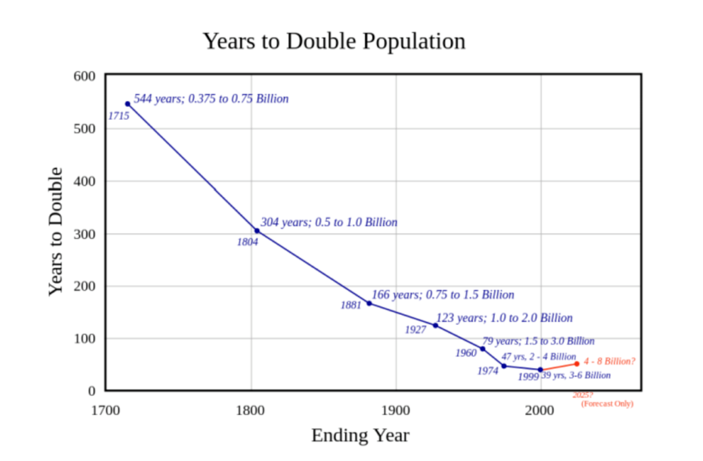

::: details Sample Answer

This line chart shows information about years to double population. Firstly, the highest number can be found in 1715, which is around 544 years and 0.75 billion. Secondly, the second highest number is located in 1804, which is about 304 years and 1 billion. Thirdly, the lowest figure is for 1999, and the number is around 39 years and 3 billion. Furthermore, there is a decreasing trend for this line. In summary, this chart uses real data to describe years to double population.

:::

### 2. Dubai Gold Sales in 2002 #031002 极高频 简单

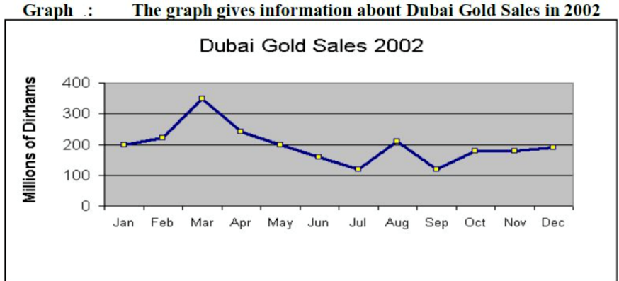

::: details Sample Answer

This line chart shows information about Dubai gold sales 2002. Firstly, the highest number can be found in March, which is around 350 million Dirhams. Secondly, the second highest number is located in April, which is about 250 million Dirhams. Thirdly, the lowest figure is for July or September, and the number is around 120 million Dirhams. Furthermore, there is a decreasing trend between March and July. In summary, this chart uses real data to describe Dubai gold sales 2002.

:::

### 3. Number of arrests per year for using illegal drugs #031005 极高频 简单

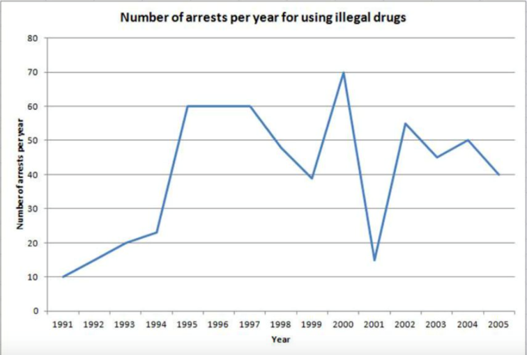

::: details Sample Answer

This line chart shows information about number of arrests per year for using illegal drugs. Firstly, the highest number can be found in 2000, which is around 70. Secondly, the second highest number is located in 1995, 1996, and 1997, which is about 60. Thirdly, the lowest figure is for 1991, and the number is around 10. Furthermore, there is an increasing trend between 1991 to 1995. In summary, this chart uses real data to describe number of arrests per year for using illegal drugs.

:::

### 4. Number of Laws in Brazil 1953-1993 #031014 极高频 简单

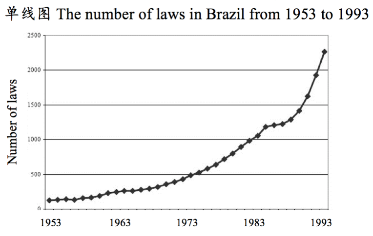

::: details Sample Answer

This line chart shows information about the number of laws in Brazil from 1953 to 1993. Firstly, the highest number can be found in 1993, which is around 2250. Secondly, the second highest number is located in 1992, which is about 1900. Thirdly, the lowest figure is for 1953, and the number is around 100. Furthermore, there is an increasing trend for this line. In summary, this chart uses real data to describe the number of laws in Brazil from 1953 to 1993.

:::

### 5. S&P/ASX 200 #031015 极高频 极限预测 简单

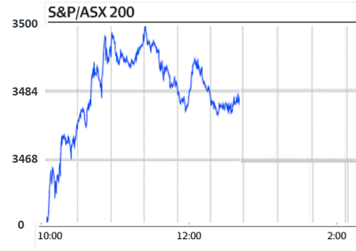

::: details Sample Answer

This line chart shows information about S&P/ASX 200. Firstly, the highest number can be found in 11: 30, which is around 3500. Secondly, the second highest number is located in 11:00, which is about 3490. Thirdly, the lowest figure is for 10:00, and the number is around 3450. Furthermore, there is an increasing trend between 10:00 to 11:00. In summary, this chart uses real data to describe S&P /ASX 200.

:::

### 6. US Fruit and Vegetables Consumption Trends #031019 极高频 简单

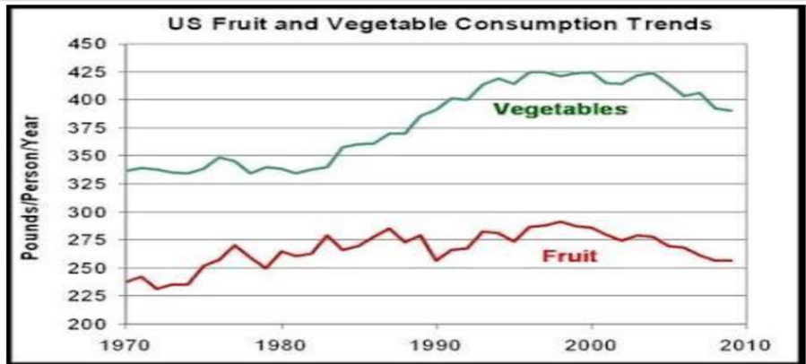

::: details Sample Answer

This line chart shows information about US fruit and vegetable consumption trends. If you look at vegetables, the highest number can be found in 2000, which is around 425 pounds per person per year. The lowest figure is located in 1980, which is about 325 pounds per person per year. If you look at fruit, the highest number is for 2000, and the number is around 300 pounds per person per year. Furthermore, the number of vegetables is always higher than fruit. In summary, this chart uses real data to describe US fruit and vegetable consumption trends.

:::

### 7. Life Expectancy (Years) at Birth by Sex #031021 极高频 简单

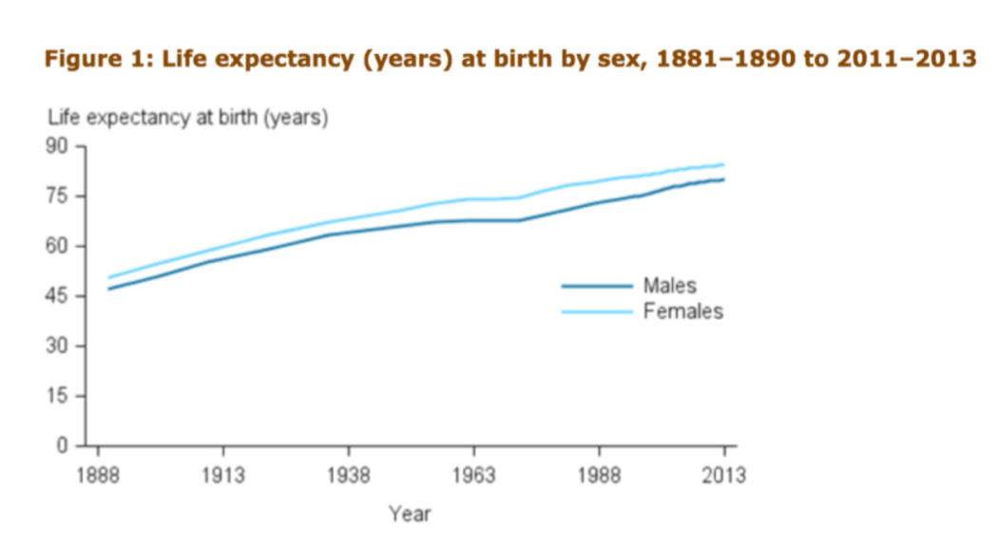

::: details Sample Answer

This line chart shows information about life expectancy years at birth by sex, 1881-1890 to 2011-2013. If you look at males, the highest number can be found in 2013, which is around 75. The lowest figure is located in 1888, which is about 45. If you look at females,  the highest number is for 2013, and the number is around 80. Furthermore, the number for females is always higher than males. In summary, this chart uses real data to describe life expectancy years at birth by sex, 1881-1890 to 2011-2013.

:::

### 8. Articles Published Per Year by Male and Female University Professors #031023 极高频 简单

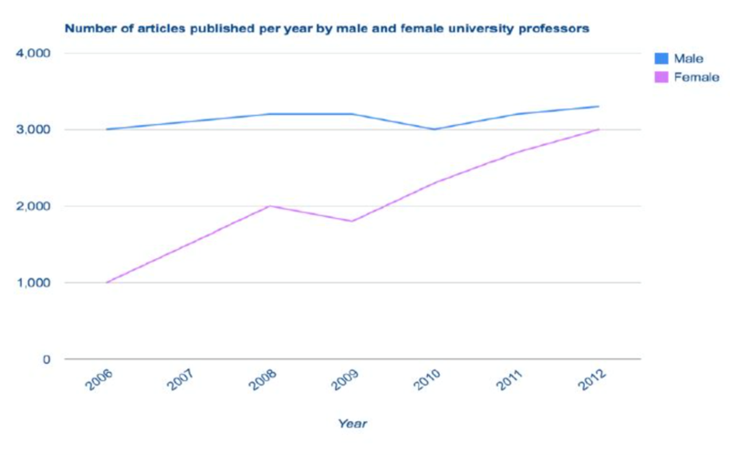

::: details Sample Answer

This line chart shows information about numbers of articles published per year by male and female university professors. If you look at male, the highest number can be found in 2012, which is around 3300. The lowest figure is located in 2006 or 2010, which is about 3000. If you look at female, the highest number is for 2012, and the number is around 3000. Furthermore, the number for male is always higher than female. In summary, this chart uses real data to describe numbers of articles published per year by male and female university professors.

:::

### 9. Daily temperature in Beijing China #031024 极高频 简单

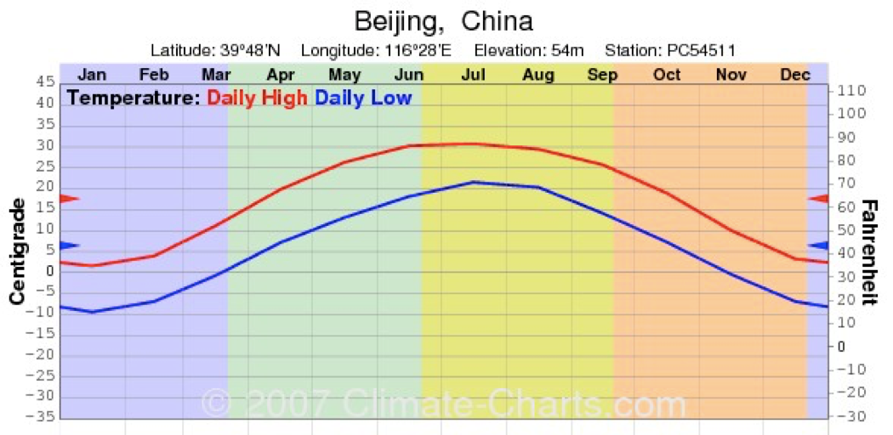

::: details Sample Answer

This line chart shows information about Beijing China. If you look at daily high temperature, the highest number can be found in July, which is around 30 degree Centigrade. The lowest figure is located in January or December, which is about 2 degree Centigrade. If you look at daily low temperature,  the highest number is for July, and the number is around 21 degree Centigrade. Furthermore, the number for daily high is always higher than daily low. In summary, this chart uses real data to describe Beijing China.

:::

### 10. Population Growth and Growth in Rating Base #031027 极高频 简单

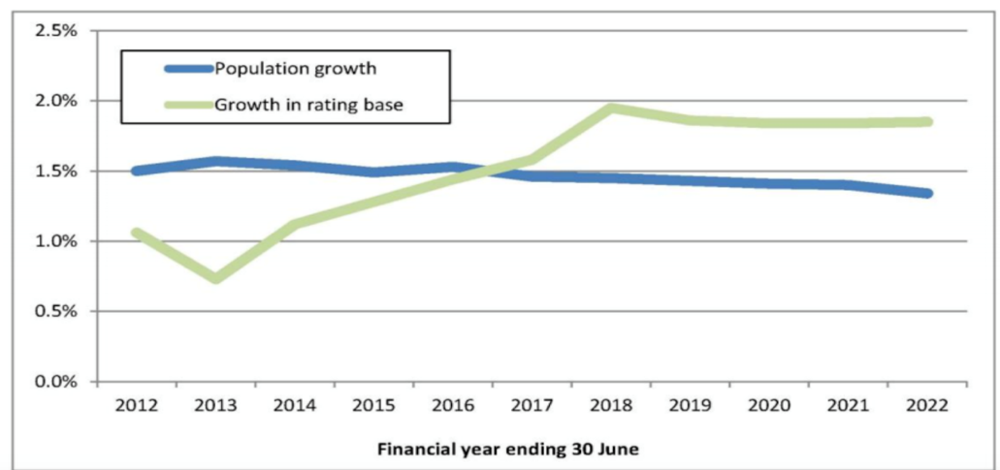

::: details Sample Answer

This line chart shows information about population growth and growth in rating base. If you look at population growth, the highest number can be found in 2013, which is around 1.6%. The lowest figure is located in 2022, which is about 1.3%. If you look at growth in rating base,  the highest number is for 2018, and the number is around 1.9%. Furthermore, there may be a decreasing trend for the line for population growth in the future. In summary, this chart uses real data to describe population growth and growth in rating base.

:::

### 11. Electricity Generation in China by Type 1994-2004 #031028 极高频 简单

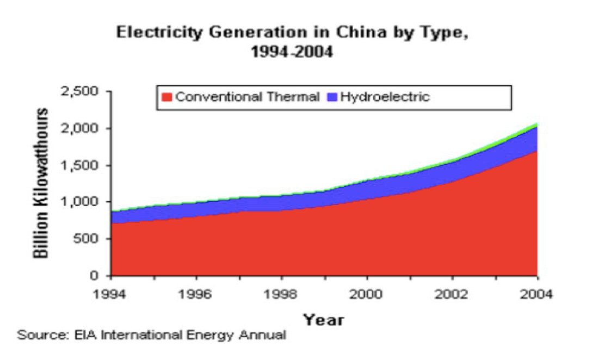

::: details Sample Answer

This line chart shows information about electricity generation in China by type 1994-2004. If you look at conventional thermal, the highest number can be found in 2004, which is around 1700 billion kilowatthours. The lowest figure is located in 1994, which is about 750 billion kilowatthours. If you look at hydroelectric,  the highest number is for 2004, and the number is around 2000 billion kilowatthours. Furthermore, the number for hydroelectric is always higher than conventional thermal. In summary, this chart uses real data to describe electricity generation in China by type 1994-2004.

:::

### 12. University and College Students who did educational activities #031032 极高频 简单

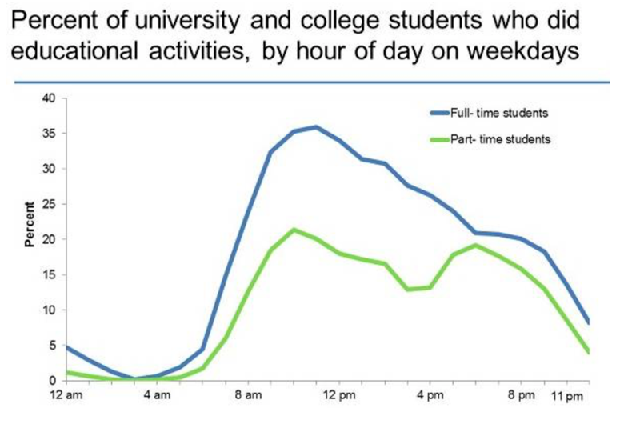

::: details Sample Answer

This line chart shows information about percent of university and college students who did educational activities, by hour of day on weekdays. If you look at full-time students, the highest number can be found in 11am, which is around 35%. The lowest figure is located in 3am, which is about 0%. If you look at part-time students,  the highest number is for 10am, and the number is around 22%. Furthermore, the number for full-time students is always higher than part-time students. In summary, this chart uses real data to describe percent of university and college students who did educational activities, by hour of day on weekdays.

:::

### 13. Temperature and CO2 for the Last 400,000 Years #031033 极高频 普通

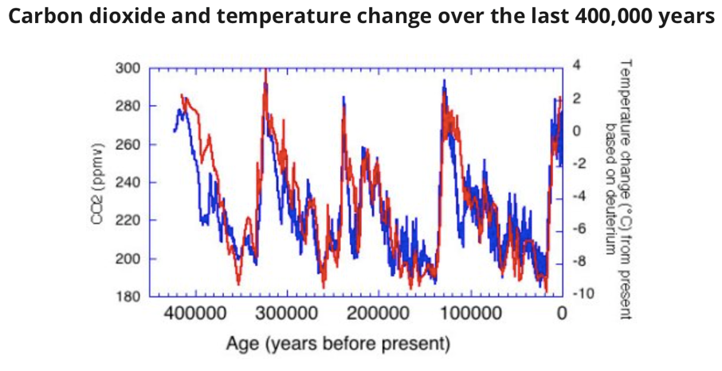

::: details Sample Answer

This line chart shows information about carbon dioxide and temperature change over the last 400,000 years. If you look at carbon dioxide, the highest number can be found in 300,000 years before present, which is around 300 parts per million by volume. The lowest figure is located in 10,000 years before present, which is about 185 parts per million by volume. If you look at temperature change from present based on deuterium,  the highest number is for 300,000 years before present, and the number is around 4 degree Celsius. Furthermore, both lines have a similar trend. In summary, this chart uses real data to describe carbon dioxide and temperature change over the last 400,000 years.

:::

### 14. Food price vs oil price #031036 极高频 简单

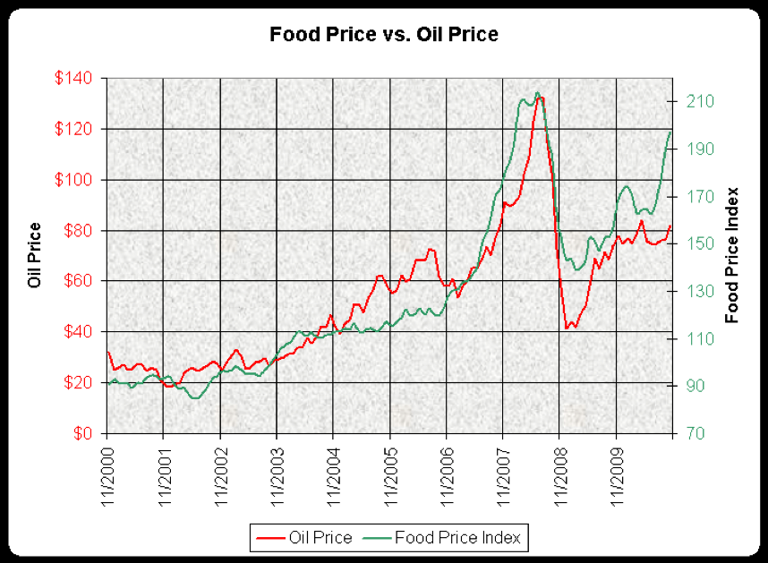

::: details Sample Answer

This line chart shows information about food price versus oil price. If you look at oil price, the highest number can be found in August 2008, which is around $130. The lowest figure is located in December 2001, which is about $20. If you look at food price index,  the highest number is for July 2008, and the number is around 215. Furthermore, both lines have a similar trend. In summary, this chart uses real data to describe food price versus oil price.

:::

### 15. Projected Population in Australia #031046 极高频 极限预测 简单

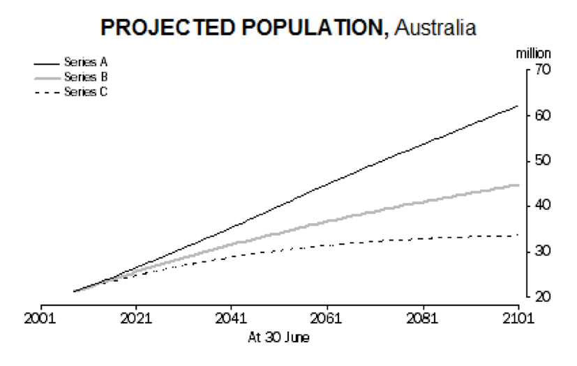

::: details Sample Answer

This line chart shows information about projected population Australia. If you look at Series A, the highest number can be found in 2101, which is around 62 million. The lowest figure is located in 2008, which is about 25 million. If you look at Series B,  the highest number is for 2101, and the number is around 45 million. Furthermore, there is an increasing trend for the line of Series C. In summary, this chart uses real data to describe projected population Australia.

:::

### 16. Annual per capita Meat Consumption (kg) #031049 极高频 简单

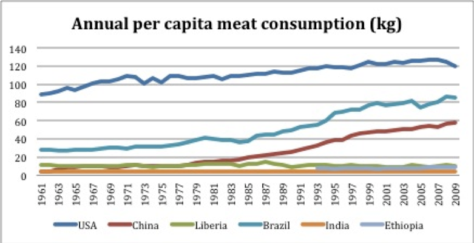

::: details Sample Answer

This line chart shows information about annual per capita meat consumption kilogram. If you look at USA, the highest number can be found in 2007, which is around 130 kilograms. The lowest figure is located in 1961, which is about 90 kilograms. If you look at China,  the highest number is for 2009, and the number is around 60 kilograms. Furthermore, there is an increasing trend for the line of Brazil. In summary, this chart uses real data to describe annual per capita meat consumption kilogram.

:::

### 17. Australian Age Group #031053 极高频 简单

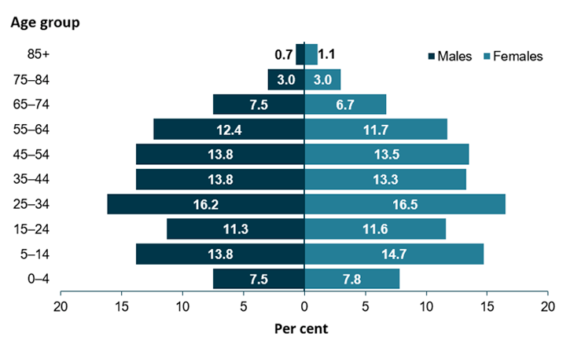

::: details Sample Answer

This bar chart shows information about age group. If you look at males, the highest number can be found in 25-34, which is around 16.2%. The lowest figure is located in over 85, which is about 0.7%. If you look at females,  the highest number is for 25- 34, and the number is around 16.5%. Furthermore, both males and females have the same percentage in the age group of 75-84. In summary, this chart uses real data to describe age group.

:::

### 18. Internet Population in Millions of Users #031058 极高频 简单

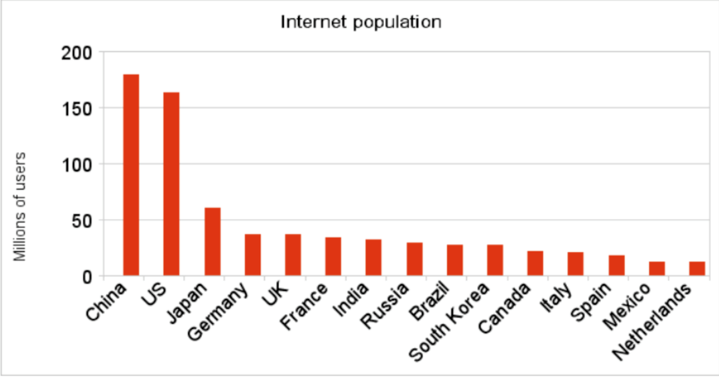

::: details Sample Answer

This bar chart shows information about internet population. Firstly, the highest number can be found in China, which is around 180 million users. Secondly, the second highest number is located in US, which is about 160 million users. Thirdly, the lowest figure is for Netherlands, and the number is around 10 million users. Furthermore, Germany and UK have a similar value around 40 million users. In summary, this chart uses real data to describe internet population.

:::

### 19. The Taxation by Countries by Payroll and Superannuation #031065 极高频 简单

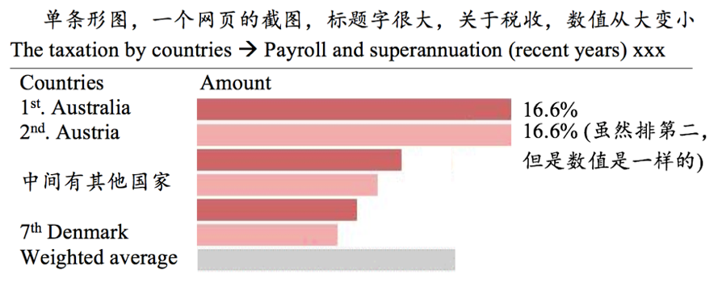

::: details Sample Answer

This bar chart shows information about the taxation by countries by payroll and superannuation recent years. Firstly, the highest number can be found in Australia, which is around 16.6%. Secondly, the second highest number is located in Austria, which is about 16.6%. Thirdly, the lowest figure is for Denmark, and the number is around 8%. Furthermore, the weighted average is higher than most of the countries. In summary, this chart uses real data to describe the taxation by countries by payroll and superannuation recent years.

:::

### 20. Unemployment Rates by Ethnic Group & Sex in UK 2001 #031068 极高频 简单

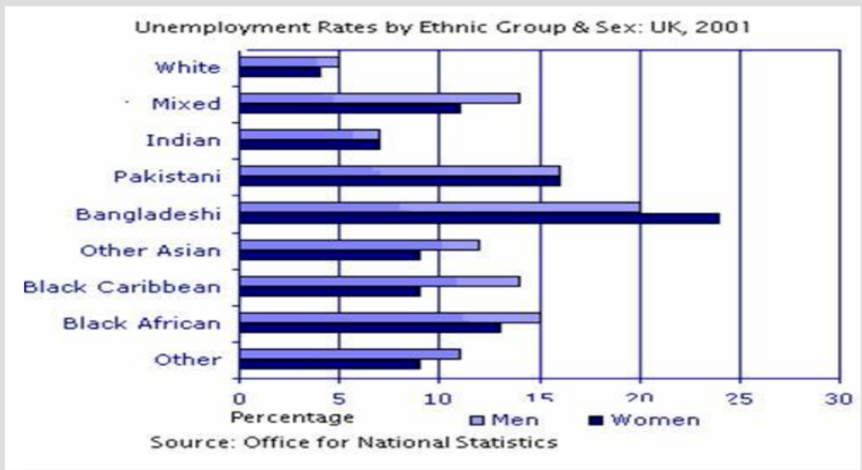

::: details Sample Answer

This bar chart shows information about unemployment rates by ethnic group & sex UK 2001. If you look at men, the highest number can be found in Bangladeshi, which is around 20%. The lowest figure is located in white, which is about 5%. If you look at women,  the highest number is for Bangladeshi, and the number is around 24%. Furthermore, men and women have the same percentage for Indian and Pakistani. In summary, this chart uses real data to describe unemployment rates by ethnic group & sex UK 2001.

:::

### 21. Earnings and Unemployment Rates by Educational Attainment #031071 极高频 普通

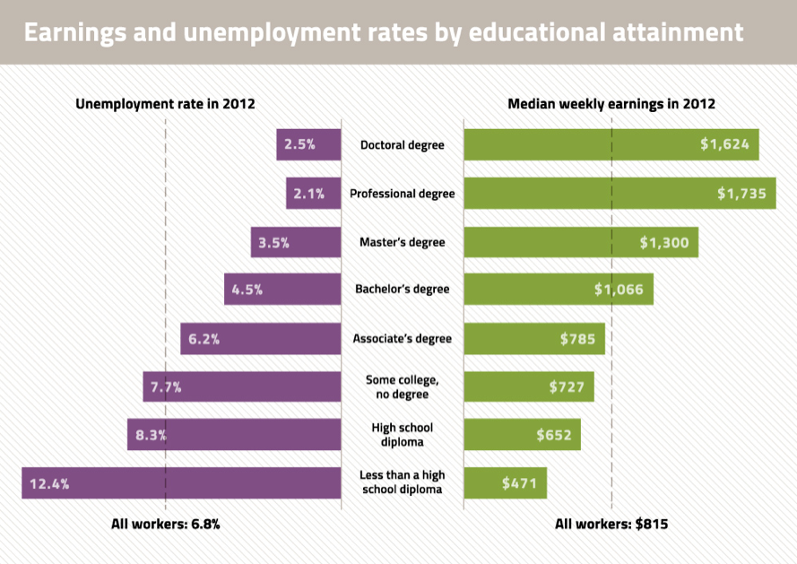

::: details Sample Answer

This bar chart shows information about earnings and unemployment rates by educational attainment. If you look at unemployment rate in 2012, the highest number can be found in less than a high school diploma, which is around 12.4%. The lowest figure is located in professional degree, which is about 2.1%. If you look at median weekly earnings in 2012,  the highest number is for professional degree, and the number is around $1,735. Furthermore, there is an opposite trend between unemployment rate and median weekly earnings. In summary, this chart uses real data to describe earnings and unemployment rates by educational attainment.

:::

### 22. Population of Major European Countries in 1996 and 2007 #031076 极高频 简单

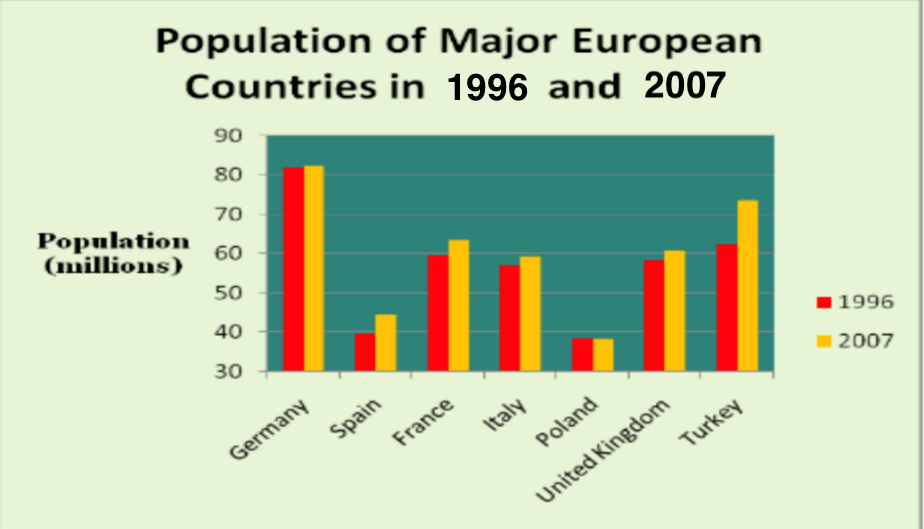

::: details Sample Answer

This bar chart shows information about population of major European countries in 1996 and 2007. If you look at 1996, the highest number can be found in Germany, which is around 81 million. The lowest figure is located in Poland, which is about 38 million. If you look at 2007,  the highest number is for Germany, and the number is around 82 million. Furthermore, there is an increasing trend of the population between 1996 and 2007. In summary, this chart uses real data to describe population of major European countries in 1996 and 2007.

:::

### 23. Transport Modes in a European City 1960-2000 #031078 极高频 简单

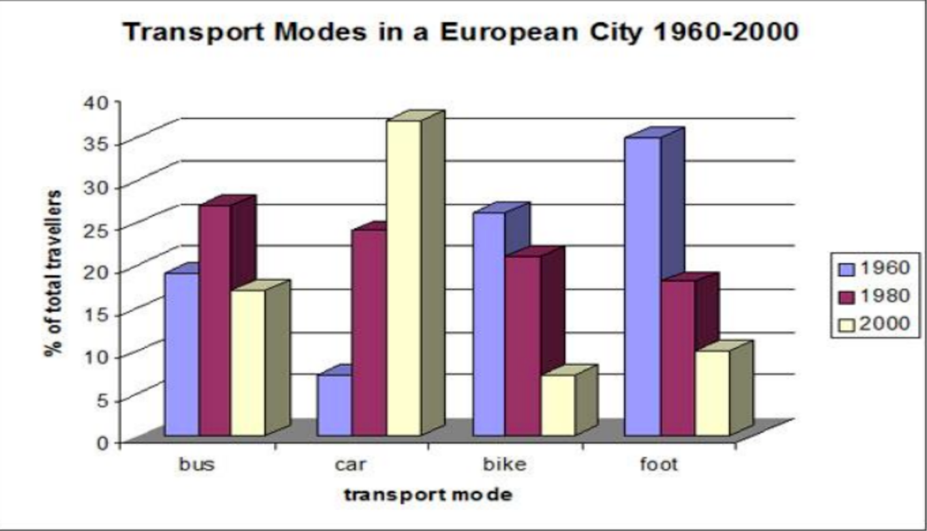

::: details Sample Answer

This bar chart shows information about transport modes in a European city 1960-2000. If you look at 1960, the highest number can be found in foot, which is around 33% of total travellers. The lowest figure is located in car, which is about 5% of total travellers. If you look at 1980,  the highest number is for bus, and the number is around 25% of total travellers. Furthermore, there is an increasing trend of using cars as the transport mode from 1960 to 2000. In summary, this chart uses real data to describe transport modes in a European city 1960- 2000.

:::

### 24. Age Percentage in UK #031082 极高频 普通

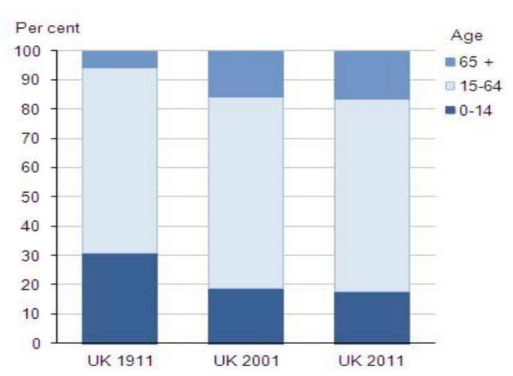

::: details Sample Answer

This bar chart shows information about age percentage in UK. If you look at 0-14, the highest number can be found in UK 1911, which is around 30%. The lowest figure is located in UK 2011, which is about 18%. If you look at 65+,  the highest number is for UK 2011, and the number is around 18%. Furthermore, the number for 15-64 is similar from 1911 to 2011. In summary, this chart uses real data to describe age percentage in UK.

:::

### 25. Beginning of flow chart for quiz #031086 极高频 简单

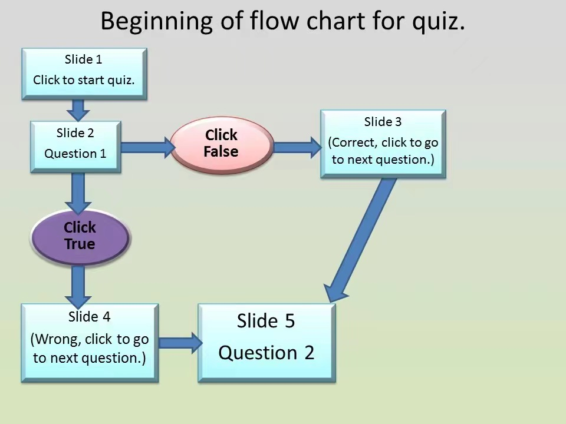

::: details Sample Answer

This flow chart shows information about beginning of flow chart for quiz. According to the picture we can see that firstly, the process starts from the first stage, which is called slide 1 click to start quiz. Secondly, it goes to the second stage, which is about slide 2 question 1. Thirdly, it comes to the third stage, which is called click true or click false. Furthermore, the process comes to the ending point, which is about slide 5 question 2. Furthermore, slide 4 which is wrong and slide 3 which is correct also carry important weight. In summary, the process shows details about flow chart for quiz.

:::

### 26. Age Percentage by Gender #031100 极高频 简单

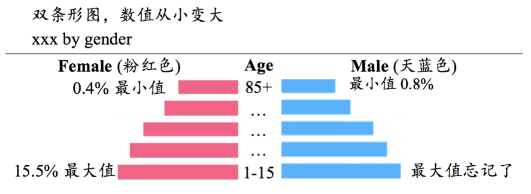

::: details Sample Answer

This bar chart shows information about age percentage by gender. If you look at female, the highest number can be found in 1-15, which is around 15.5%. The lowest figure is located in over 85, which is about 0.4%. If you look at male,  the lowest number is for over 85, and the number is around 0.8%. Furthermore, both female and male are having a similar trend. In summary, this chart uses real data to describe age percentage by gender.

:::

### 27. Languages have influenced English #031131 极高频 普通

::: details Sample Answer

This pie chart shows information about languages have influenced English. Firstly, the highest number can be found in Latin or French, which is around 29%. Secondly, the second highest number is located in Germanic languages, which is about 26%. Thirdly, the lowest figure is for derived from proper names, and the number is around 4%. Furthermore, Greek and other languages or unknown have the same value at 6%. In summary, this chart uses real data to describe languages have influenced English.

:::

### 28. Approximate Composition of the Air #031132 极高频 简单

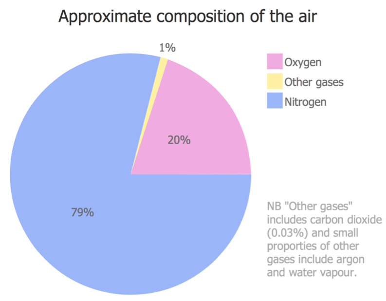

::: details Sample Answer

This pie chart shows information about the approximate composition of the air. Firstly, the highest number can be found in nitrogen, which is around 79%. Secondly, the second highest number is located in oxygen, which is about 20%. Thirdly, the lowest figure is for other gases, and the number is around 1%. Furthermore, nitrogen and oxygen together make up almost all of the air. In summary, this chart uses real data to describe the approximate composition of the air.

:::

### 29. Pet Expenditure in US #031133 极高频 简单

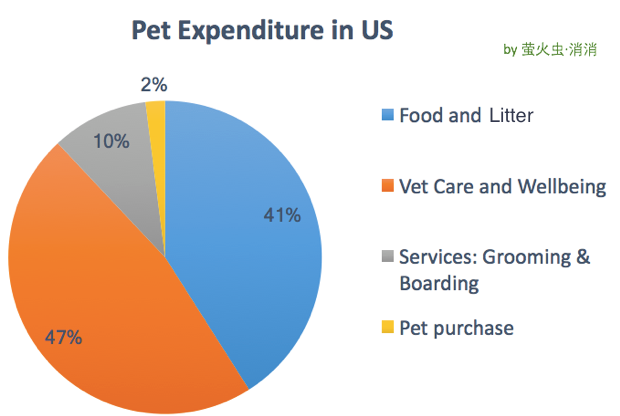

::: details Sample Answer

This pie chart shows information about pet expenditure in US. Firstly, the highest number can be found in vet care and wellbeing, which is around 47%. Secondly, the second highest number is located in food and litter, which is about 41%. Thirdly, the lowest figure is for pet purchase, and the number is around 2%. Furthermore, the number for services: grooming and boarding is 10%. In summary, this chart uses real data to describe pet expenditure in US.

:::

### 30. Enrollments on Six Courses #031136 极高频 简单

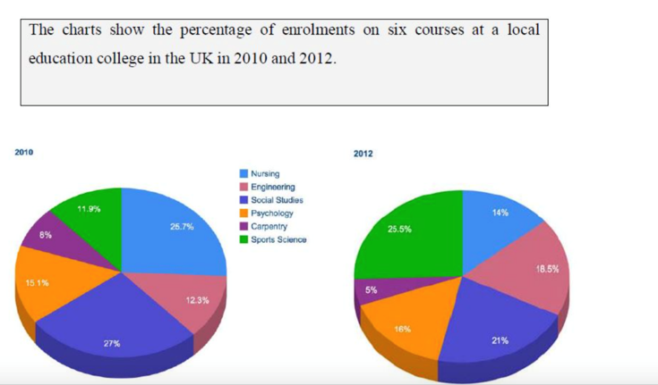

::: details Sample Answer

This pie chart shows information about the percentage of enrolments on six courses at a local education college in the UK in 2010 and 2012. If you look at 2010, the highest number can be found in social studies, which is around 27%. The lowest figure is located in carpentry, which is about 8%. If you look at 2012,  the highest number is for sports science, and the number is around 25.5%. Furthermore, there is a decreasing trend for nursing and carpentry from 2010 to 2012. In summary, this chart uses real data to describe the percentage of enrolments on six courses at a local education college in the UK in 2010 and 2012.

:::

### 31. Populations of Countries of the European Union in 1998 and 2007 #031137 极高频 简单

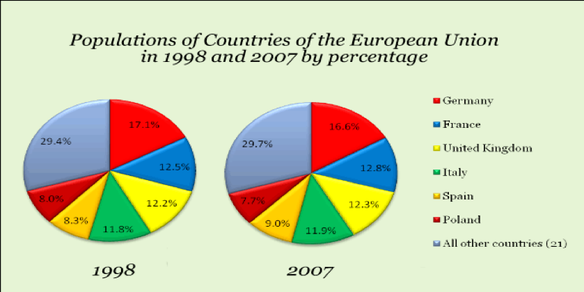

::: details Sample Answer

This pie chart shows information about populations of countries of the European Union in 1998 and 2007 by percentage. If you look at 1998, the highest number can be found in all other countries, which is around 29.4%. The lowest figure is located in Poland, which is about 8%. If you look at 2007, the highest number is for all other countries, and the number is around 29.7%. Furthermore, Italy, Spain, and France have a similar value between 1998 and 2007. In summary, this chart uses real data to describe populations of countries of the European Union in 1998 and 2007 by percentage.

:::

### 32. Size of Nine Planets #031141 极高频 极限预测 困难

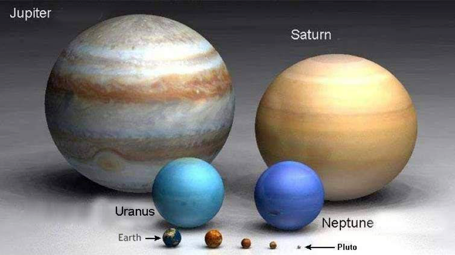

::: details Sample Answer

This picture shows information about size of nine planets. If you look at the left, the most obvious information given here is Jupiter. Next to it, we can see Uranus and Earth, and the planets are both in blue color. If you look at the right, Saturn and Neptune are also shown in this part, which are bigger than some other planets. Furthermore, we can also see Pluto and Mars in this picture as well. In summary, this picture uses different elements to describe size of nine planets.

:::

### 33. Typing Postures #031142 极高频 困难

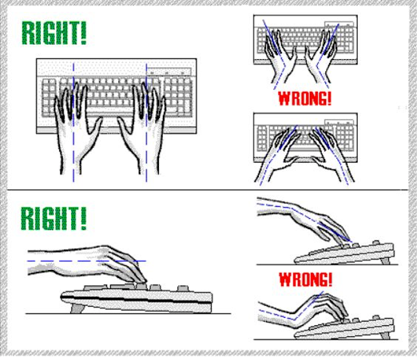

::: details Sample Answer

This picture shows information about typing postures. If you look at the right posture, the most obvious information given here is hands are parallel. Next to it, we can see the keyboard is parallel to the table and the hand is parallel to the keyboard, and the keyboard is placed flat. If you look at the wrong posture, hands bending inward and hands bending outward are also shown in this part, which may cause discomfort for the wrists. Furthermore, we can also see the keyboard at an angle to the table and bending wrists in this picture as well. In summary, this picture uses different elements to describe typing postures.

:::

### 34. Adults Healthy BMI Chart #031143 极高频 普通

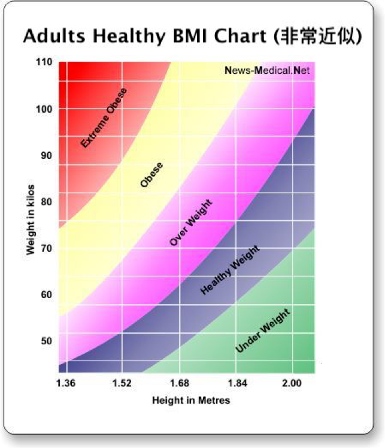

::: details Sample Answer

This chart shows information about adults healthy BMI chart. If you look at under weight, the highest number can be found in 2.2 meters, which is around 74 kilos. The lowest figure is located in 1.6 meters, which is about 43 kilos. If you look at healthy weight,  the highest number is for 2.2 meters, and the number is around 100 kilos. Furthermore, the range of obese is 55 to 110 kilos for weight and 1.36 to 1.9 meters for height. In summary, this chart uses real data to describe adults healthy BMI chart.

:::

### 35. How Solar Yard Lights Work #031145 极高频 困难

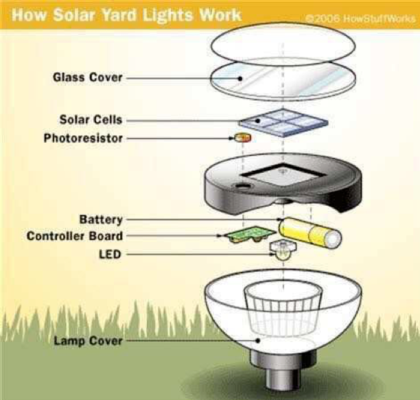

::: details Sample Answer

This picture shows information about how solar yard lights work. If you look at the upper part of the picture, the most obvious information given here is the glass cover. Next to it, we can see the photoresistor and the solar cells, and these elements are also quite important. If you look at the middle part of the picture, the battery and the controller board are also shown in this part, giving a better understanding about this picture. Furthermore, we can also see the LED light and the lamp cover. In summary, this picture describes how solar yard lights work.

:::

### 36. Student Accommodation of Southampton University #031146 极高频 极限预测 困难

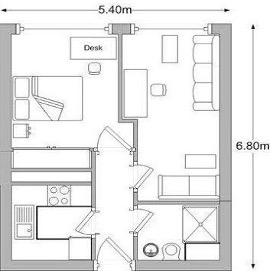

::: details Sample Answer

This floor plan shows information about Student Accommodation of Southampton University. If you look at the left side, the most obvious information given here is the bedroom area, and next to it, we can see a desk and a bed, and these elements are also quite important. If you look at the right side, a living room and a sofa are also shown in this part, giving a better understanding about this picture. Furthermore, the length is 6.8 meters and the width is 5.4 meters. In summary, this picture uses different elements to describe the floor plan of Student Accommodation of Southampton University.

:::

### 37. Food Pyramid #031148 极高频 极限预测 困难

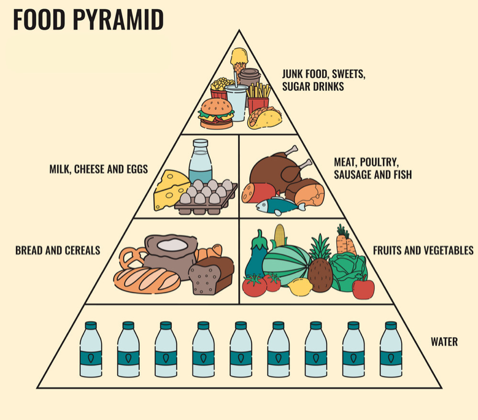

::: details Sample Answer

This picture shows information about food pyramid. If you look at the top, the most obvious information given here is junk food, sweets, sugar drinks. Next to it, we can see milk, cheese and eggs and meat, poultry, sausage and fish, and these are the food people need to have less. If you look at the bottom, water and bread and cereals are also shown in this part, which are the food people should have more. Furthermore, we can also see fruits and vegetables in this picture as well. In summary, this picture uses different elements to describe food pyramid.

:::

### 38. The Graduation Laboratory #031150 极高频 极限预测 困难

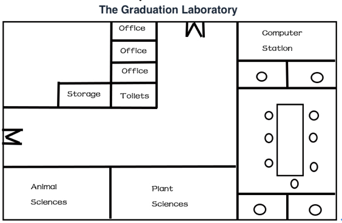

::: details Sample Answer

This picture shows information about the graduation laboratory. If you look at the left, the most obvious information given here is storage. Next to it, we can see offices and animal sciences, which are at the opposite sides of the corridor. If you look at the right, computer station and meeting room are also shown in this part, and there may be some smaller rooms next to them. Furthermore, we can also see plant sciences and entrance in this picture as well. In summary, this picture uses different elements to describe the graduation laboratory.

:::

### 39. Library Plan #031151 极高频 困难

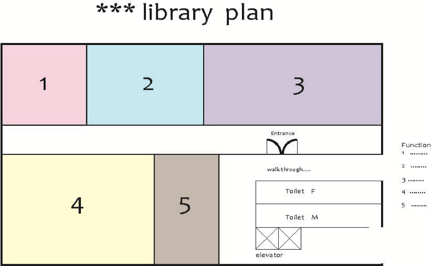

::: details Sample Answer

This picture shows information about a library plan. If you look at the upper part of the picture, the most obvious information given here is rooms 1, 2 and 3. Next to it, we can see the entrance and walk through, and these elements are also quite important. If you look at the lower part of the picture, room 4 and 5 are also shown in this part. Furthermore, we can also see male and female toilets as well. In summary, this picture uses different elements to describe a library plan.

:::

### 40. Oxbow Lake Formation #031152 极高频 极限预测 困难

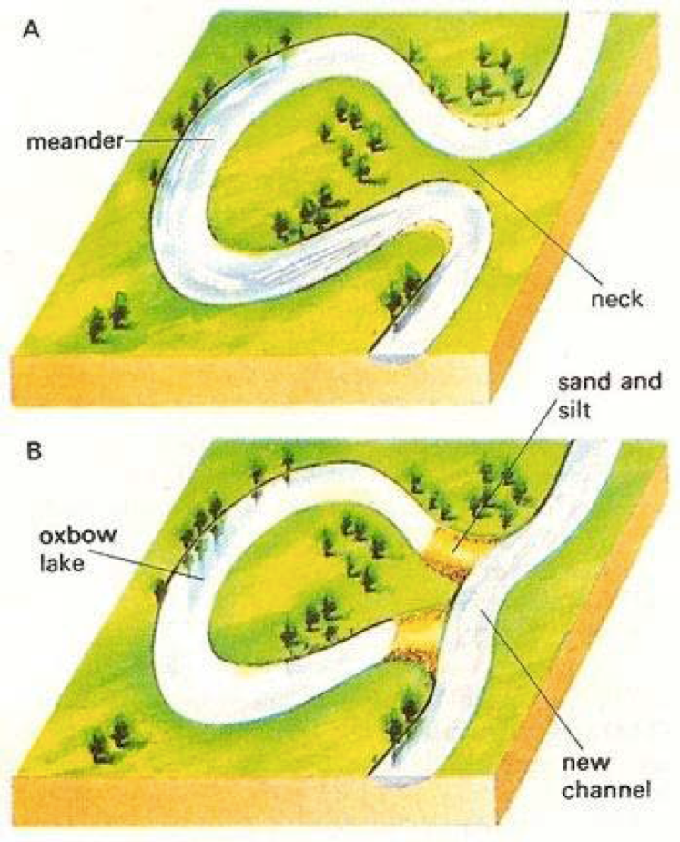

::: details Sample Answer

This picture shows information about Oxbow Lake formation. If you look at picture A, the most obvious information given here is the meander. Next to it, we can see the river neck and the trees and grassland, and these elements are also quite important. If you look at picture B, Oxbow Lake is also shown in this part, giving a better understanding about this picture. Furthermore, we can also see a new channel in this picture. In summary, this picture uses different elements to describe Oxbow Lake formation.

:::

### 41. The Eatwell Plate #031156 极高频 普通

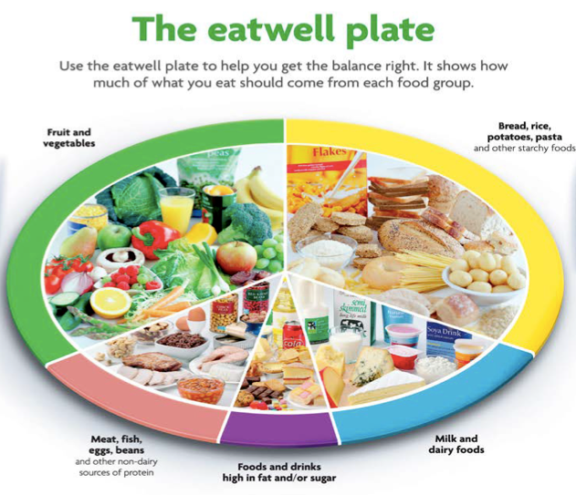

::: details Sample Answer

This pie chart shows information about  the eatwell plate. Firstly, the highest number can be found in fruit and vegetables or bread, rice, potatoes and pasta, which is around 30%. Secondly, the second highest number is located in meat, fish, eggs, beans or milk and dairy foods, which is about 15%. Thirdly, the lowest figure is for foods and drinks high in fat and/or sugar, and the number is around 5%. Furthermore, we can use the eatwell plate to help us get the balance diet. In summary, this chart uses real data to describe the eatwell plate.

:::

### 42. Student Accommodation - Floor Plan #031160 极高频 普通

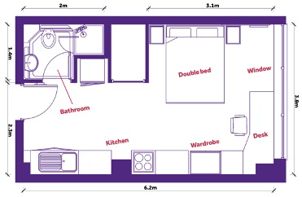

::: details Sample Answer

This picture shows information about student accommodation floor plan. If you look at the top, the most obvious information given here is bathroom. Next to it, we can see double bed and window, and the window extends from the bed to the desk. If you look at the bottom, kitchen and wardrobe are also shown in this part, which are opposite to the bed and the bathroom. Furthermore, we can also see desk and chair in this picture as well. In summary, this picture uses different elements to describe student accommodation floor plan.

:::

### 43. The World’s Water #031164 极高频 困难

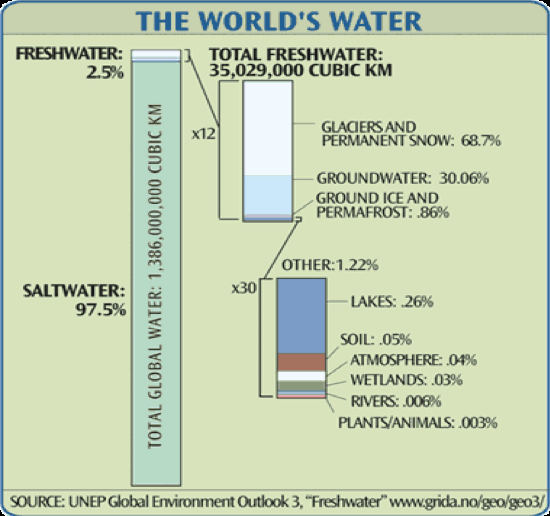

::: details Sample Answer

This chart shows information about The World’s Water. If you look at global water distribution, the highest number can be found in saltwater, which is around 97.5%, and the lowest figure is located in freshwater, which is about 2.5%. If you look at freshwater distribution, the highest number is for glaciers and permanent snow, and the number is around 68.7%. Furthermore, groundwater and lakes also account for noticeable proportions in this graph. In summary, this chart uses real data to describe The World’s Water.

:::

### 44. Fish Count in Daytime and Nighttime #031165 极高频 困难

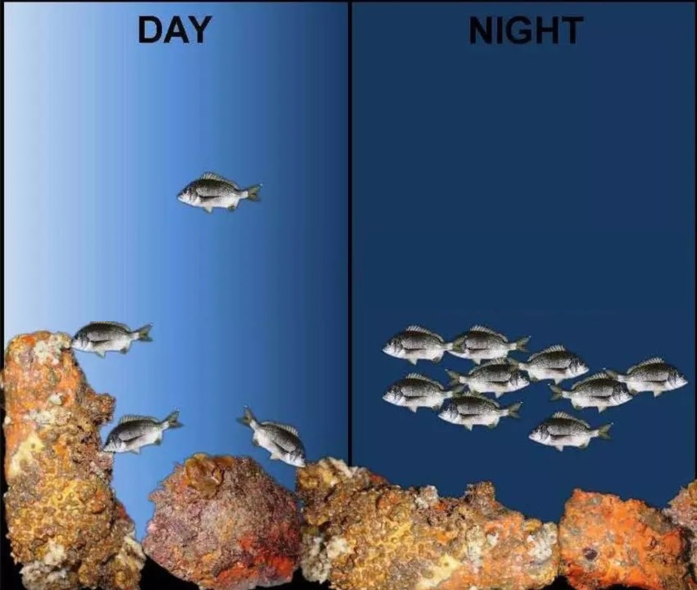

::: details Sample Answer

This picture shows information about fish count in daytime and nighttime. If you look at the left, the most obvious information given here is 4 fish swimming separately during the daytime. Next to it, we can see rocks and water, and these elements are also quite important. If you look at the right, a larger group of fish swimming together is also shown in this part, giving a better understanding about this picture. Furthermore, there is a clear contrast between daytime and nighttime in fish group. In summary, this picture uses different elements to describe fish count in daytime and nighttime.

:::

### 45. Lunar Cycle affects Fish Catch Rates #031167 极高频 极限预测 困难

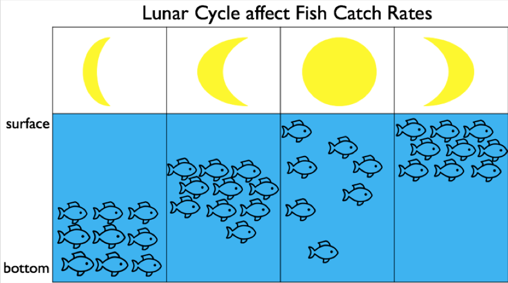

::: details Sample Answer

This picture shows information about lunar cycle affect fish catch rates. If you look at the top, the most obvious information given here is new moon. Next to it, we can see half moon and full moon, and they are shown in different days in a month. If you look at the bottom, fish at the bottom and fish near the surface are also shown in this part, which means whether it is difficult or easy to catch the fish. Furthermore, we can also see fish swimming together as a group and fish swimming separately in this picture as well. In summary, this picture uses different elements to describe lunar cycle affect fish catch rates.

:::

### 46. Computers Then and Now #031168 极高频 极限预测 困难

::: details Sample Answer

This picture shows information about computers then and now. If you look at the left, the most obvious information given here is the large, old- style computer with a bulky structure. Next to it, we can see control panels with no mouse, and these elements are also quite important. If you look to the right, a desktop computer with keyboard, mouse and a larger screen is also shown in this part. Furthermore, computers have become smaller and more user-friendly over time. In summary, this picture uses different elements to describe computers then and now.

:::

### 47. Different Heights of Four Trees #031169 极高频 困难

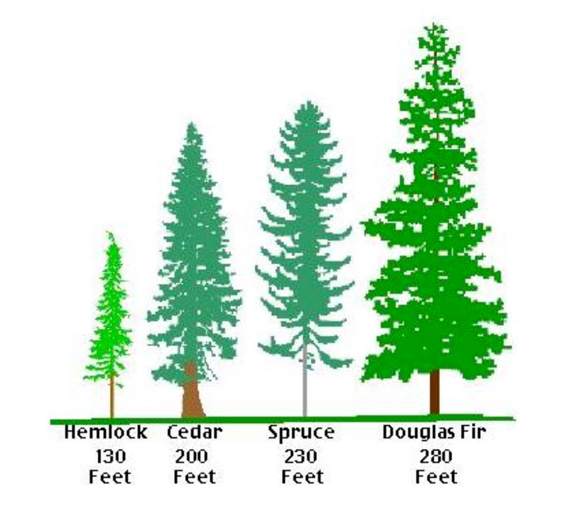

::: details Sample Answer

This picture shows information about different heights of four trees. Firstly, the highest number can be found in douglas fir, which is around 280 feet. Secondly, the second highest number is located in spruce, which is about 230 feet. Thirdly, the lowest figure is for hemlock, and the number is around 130 feet. Furthermore, the height for cedar is 200 feet. In summary, this chart uses real data to describe different heights of four trees.

:::

### 48. Human Arms and Wings #031170 极高频 困难

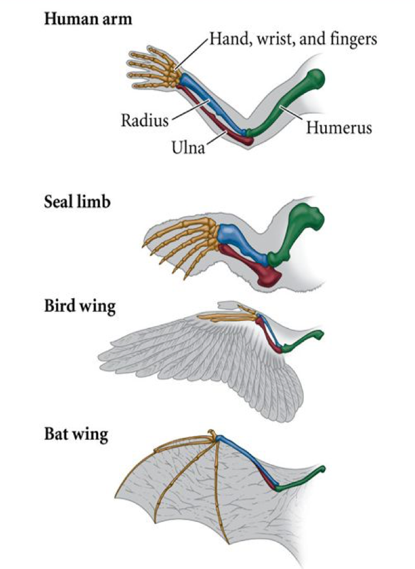

::: details Sample Answer

This picture shows information about human arms and wings. If you look at the top, the most obvious information given here is human arm. Next to it, we can see hand, wrist, and fingers and radius, and all animals in the picture have the similar parts. If you look at the bottom, seal limb and bird wing are also shown in this part, and the structure of the seal limb looks similar to humans’. Furthermore, we can also see bat wing and bird wing look different comparing to the human arm. In summary, this picture uses different elements to describe human arms and wings.

:::

### 49. Overshot Waterwheel and Breast-shot Waterwheel #031171 极高频 极限预测 困难

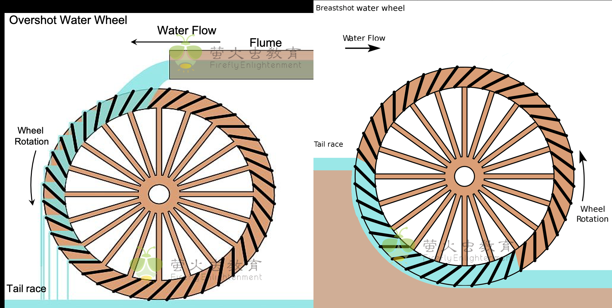

::: details Sample Answer

This picture shows information about overshot waterwheel and breast-shot waterwheel. If you look at the overshot water wheel, the most obvious information given here is the water flow from right to left. Next to it, we can see the flume and anticlockwise wheel rotation, and the water flows from the flume to the tail race. If you look at the breastshot water wheel, tail race and the water flow from left to right are also shown in this part, which means there is no flume. Furthermore, we can also see the wheels have different tail race positions. In summary, this picture uses different elements to describe overshot waterwheel and breast-shot waterwheel.

:::

### 50. Wind Power to Electricity #031172 极高频 困难

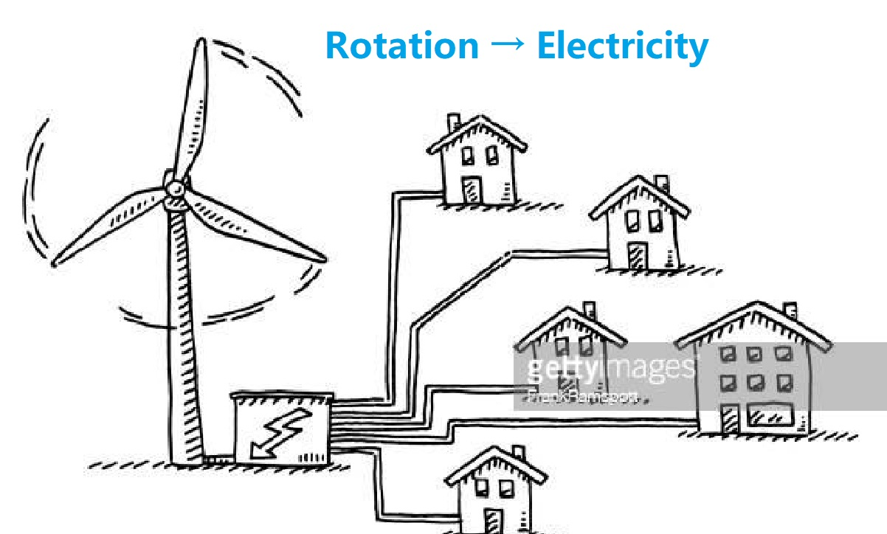

::: details Sample Answer

This picture shows information about wind power to electricity. If you look at the left part of the picture, the most obvious information given here is the wind turbine rotation. Next to it, we can see a generator box and cables, and these elements are also quite important. If you look at the right, several houses connected by power lines are also shown in this part. Furthermore, we can see that the wind power generates the electricity for home use. In summary, this picture uses different elements to describe wind power to electricity.

:::

### 51. Layers of the Earth and the distance #031173 极高频 普通

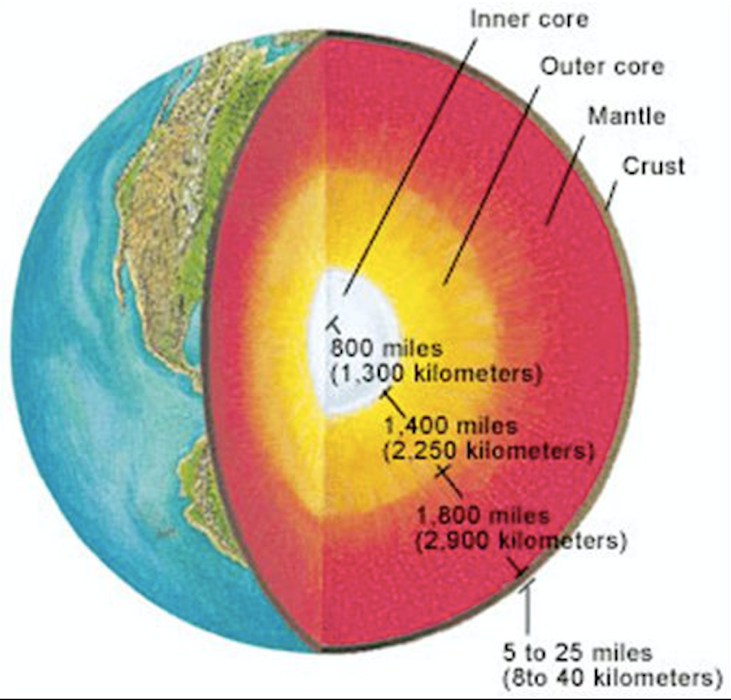

::: details Sample Answer

This picture shows information about layers of the Earth and the distance. If you look at the inside, the most obvious information given here is inner core around 800 miles. Next to it, we can see outer core about 1,400 miles, and the core’s depth is almost half of the Earth’s depth. If you look at the outside, crust and mantle are also shown in this part, which form the other half of the Earth. Furthermore, we can also see 1,800 miles and 5 to 25 miles in this picture as well. In summary, this picture uses different elements to describe layers of the Earth and the distance.

:::

### 52. Bird Feeder #031174 极高频 困难

::: details Sample Answer

This picture shows information about a bird feeder. If you look at the left picture, the most obvious information given here is a plastic bottle filled with bird food. Next to it, we can see a wooden stick and holes in the bottle, and these elements are also quite important. If you look at the right, a bird is also shown in this part, giving a better understanding about this picture. Furthermore, we can also see the spoons and birds can stand and eat easily. In summary, this picture uses different elements to describe bird feeder.

:::

### 53. Parts of a Tree #031175 极高频 普通

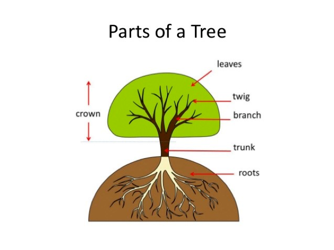

::: details Sample Answer

This picture shows information about Parts of a Tree. If you look at the upper part, the most obvious information given here is the leaves and branches. Next to it, we can see the twig and the crown, and these elements are also quite important. If you look at the middle part, the trunk is also shown in this part, giving a better understanding about this picture. Furthermore, we can also see the roots and the soil in the lower part as well. In summary, this picture uses different elements to describe Parts of a Tree.

:::

### 54. Land Use Map of India #031176 极高频 困难

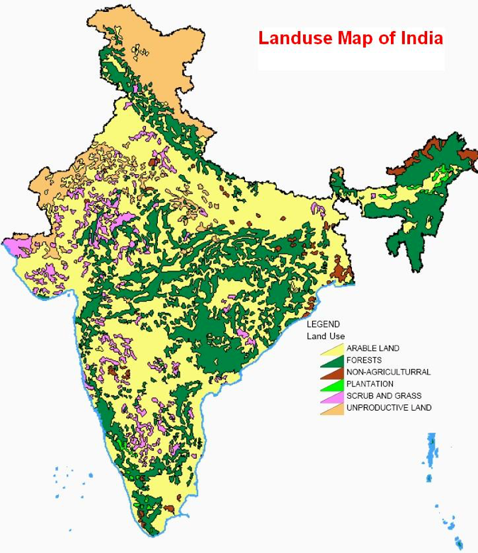

::: details Sample Answer

This picture shows information about land use map of India. If you look at the top, the most obvious information given here is unproductive land. Next to it, we can see smaller areas of arable land and forest, which are placed irregularly below the unproductive land. If you look at the bottom, scrub and grass are also shown in this part, which is within the arable land. Furthermore, we can also see plantation and non-agricultural in this picture as well. In summary, this picture uses different elements to describe land use map of India.

:::

### 55. Distribution of Tropical Rain Forests #031181 极高频 困难

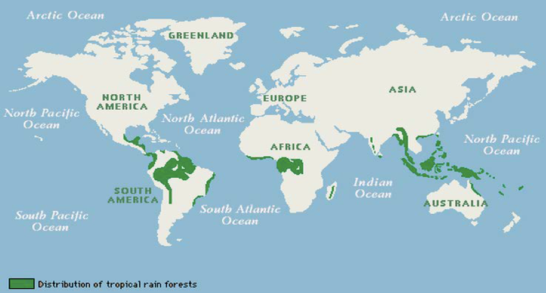

::: details Sample Answer

This picture shows information about distribution of tropical rain forests. If you look at left, the most obvious information given here is tropical rain forests in South America. Next to it, we can see rain forests in a small part of central America, and is extends to some parts of Middle America. If you look at the right, tropical rain forests in the center of Africa are also shown in this part, and the area is smaller than the one in South America. Furthermore, there are tropical rain forests in most islands near North Pacific Ocean. In summary, this picture uses different elements to describe distribution of tropical rain forests.

:::

### 56. Climate Zones for Temperature and Humidity #031182 极高频 困难

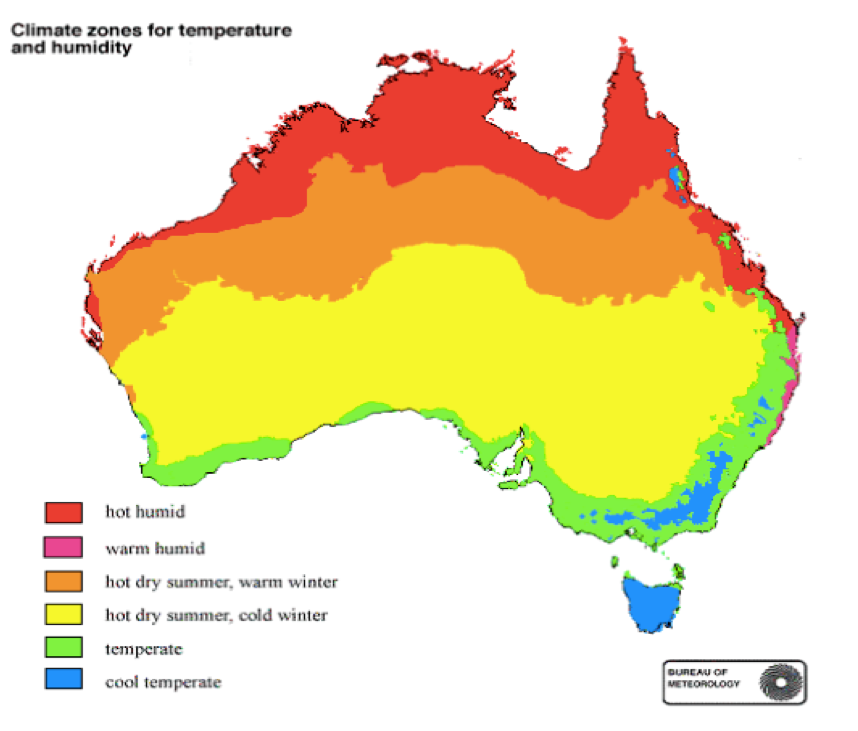

::: details Sample Answer

This picture shows information about climate zones for temperature and humidity. If you look at the top, the most obvious information given here is hot humid. Next to it, we can see hot dry summer, warm winter and hot dry summer, cold winter, and they cover almost two-thirds of Australia. If you look at the bottom, cool temperate and temperate are also shown in this part, and they only cover about one-sixth of Australia. Furthermore, we can also see warm humid in the east in this picture as well. In summary, this picture uses different elements to describe climate zones for temperature and humidity.

:::

### 57. Population Density in Australia 2011 #031192 极高频 困难

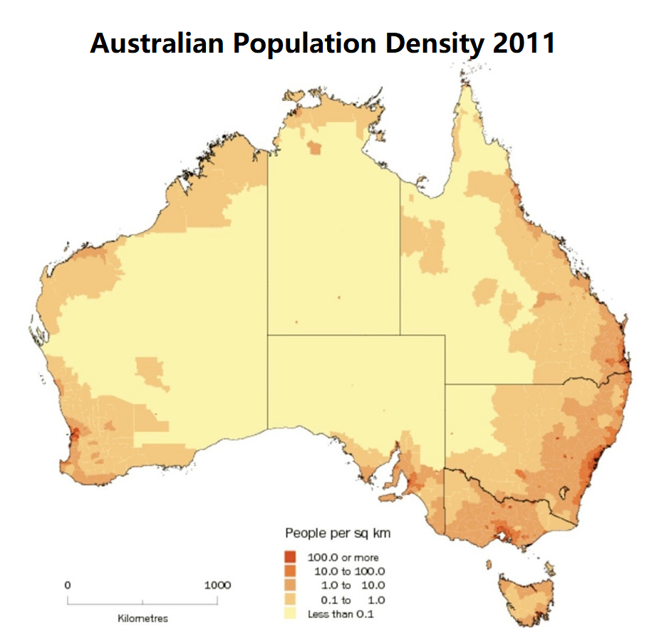

::: details Sample Answer

This map shows information about Australian population density 2011. Firstly, the highest number can be found in the south-east part of Australia, which is around 100 or more people per square kilometer. Secondly, the second highest number is located in the east part of Australia, which is about 10 to 100 people per square kilometer. Thirdly, the lowest figure is for the middle part of Australia, and the number is around less than 0.1 people per square kilometer. Furthermore, 1 to 10 and 0.1 to 1 people per square kilometer also carry important weight in this graph. In summary, this chart uses real data to describe Australian population density 2011.

:::

### 58. Annual Sunshine Hours for France #031196 极高频 极限预测 普通

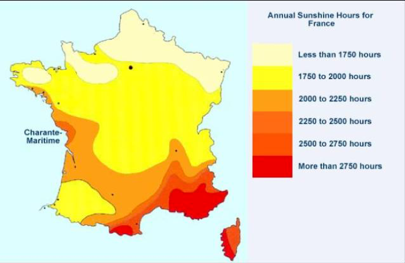

::: details Sample Answer

This map shows information about annual sunshine hours for France. Firstly, the highest number can be found in the south of France, which is around more than 2750 hours. Secondly, the second highest number is located in the south of France, which is about 2500 to 2750 hours. Thirdly, the lowest figure is for the north of France, and the number is around less than 1750 hours. Furthermore, Charante-Maritime and 2250 to 2500 hours also carry important weight in this graph. In summary, this chart uses real data to describe annual sunshine hours for France.

:::

### 59. Global Warming Predictions by Temperature Increase #031197 极高频 极限预测 普通

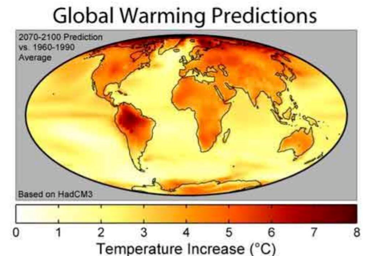

::: details Sample Answer

This map shows information about global warming predictions by temperature increase. Firstly, the highest number can be found in the Arctic, which is around 8 degree Celsius. Secondly, the second highest number is located in the north of South America, which is about 7 degree Celsius. Thirdly, the lowest figure is for the ocean, and the number is around 0 degree Celsius. Furthermore, 4 and 5 degree Celsius also carry important weight in this graph. In summary, this chart uses real data to describe global warming predictions by temperature increase.

:::

### 60. Germination of Bean Plants #031201 极高频 困难

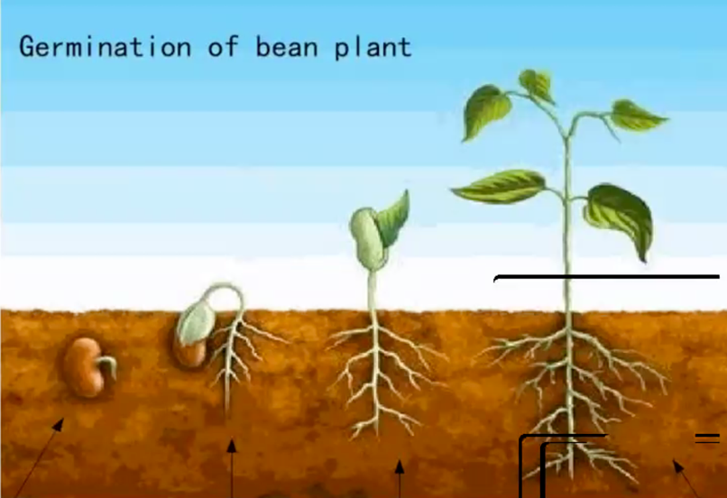

::: details Sample Answer

This flow chart shows information about germination of bean plants. According to the picture we can see that firstly, the process starts from the first stage, which is called bean sprouting. Secondly, it goes to the second stage, which is about the root grows out. Thirdly, it comes to the third stage, which is called growing out from the soil. Furthermore, the process comes to the ending point, which is about leaves. In summary, the process shows details about germination of bean plants.

:::

### 61. Water Cycle (color) #031202 极高频 普通

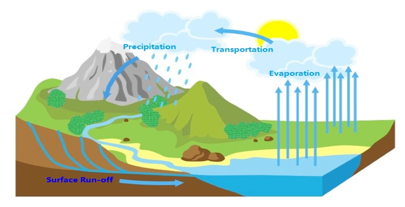

::: details Sample Answer

This flow chart shows information about water cycle. According to the picture we can see that firstly, the process starts from the first stage, which is called evaporation. Secondly, it goes to the second stage, which is about transportation. Thirdly, it comes to the third stage, which is called precipitation. Furthermore, the process comes to the ending point, which is about surface run-off. In the end, the process will start again from the very beginning.

:::

### 62. Life Cycle of an Apple Tree #031209 极高频 普通

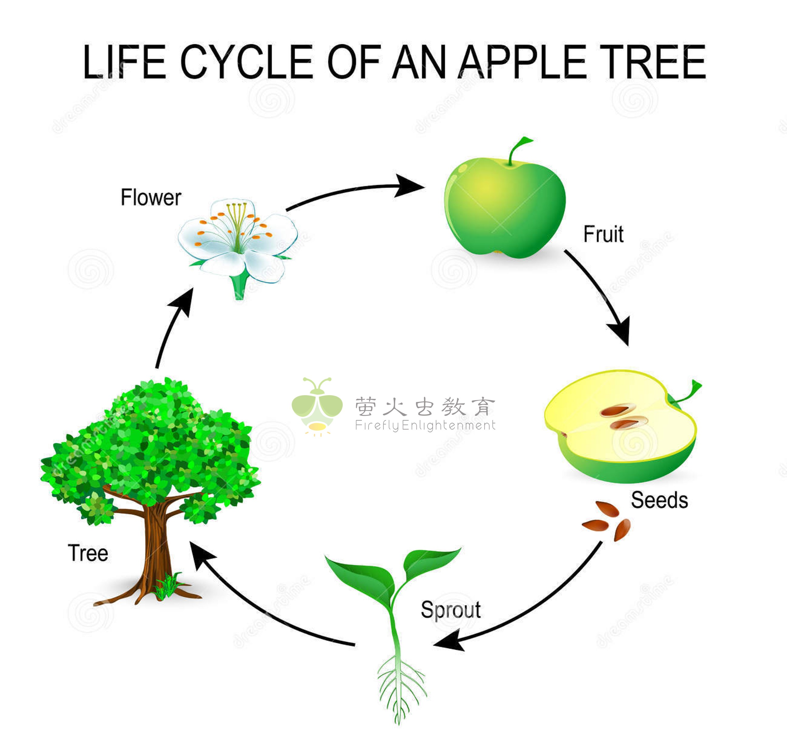

::: details Sample Answer

This flow chart shows information about the life cycle of an apple tree. According to the picture we can see that firstly, the process starts from the first stage, which is called seeds. Secondly, it goes to the second stage, which is about sprout and a tree. Thirdly, it comes to the third stage, which is called flower. Furthermore, the process comes to the ending point, which is about fruit. In the end, the process will start again from the very beginning.

:::

### 63. Tesco Extra Music Download #031214 极高频 普通

::: details Sample Answer

This flow chart shows information about Tesco Extra Music Download. According to the picture we can see that firstly, the process starts from the first stage, which is called search. Secondly, it goes to the second stage, which is about purchase. Thirdly, it comes to the third stage, which is called download. Furthermore, the process comes to the ending point, which is about play. In the end, the process will start again from the very beginning.

:::

### 64. Fungus Gnat Lifecycle in 28 Days #031224 极高频 极限预测 困难

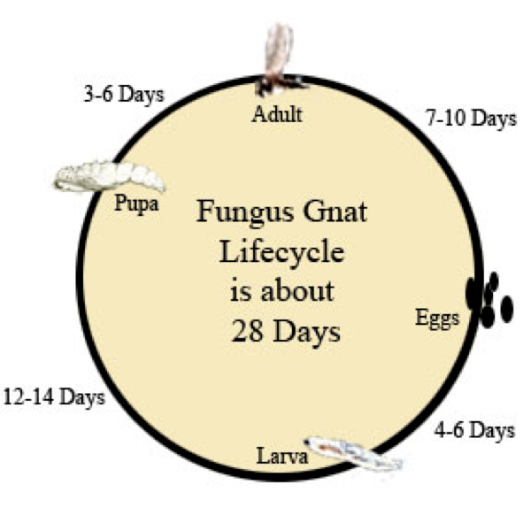

::: details Sample Answer

This flow chart shows information about fungus gnat lifecycle is about 28 days. According to the picture we can see that firstly, the process starts from the first stage, which is called adult. Secondly, it goes to the second stage, which is about taking 7-10 days to eggs. Thirdly, it comes to the third stage, which is called taking 4-6 days to larva. Furthermore, the process comes to the ending point, which is about pupa taking  3-6 days to adult. In the end, the process will start again from the very beginning.

:::

### 65. Adding an Article to Wikipedia #031225 极高频 普通

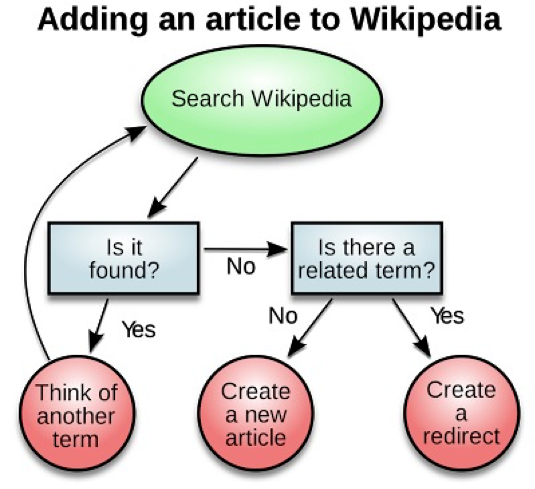

::: details Sample Answer

This flow chart shows information about adding an article to Wikipedia. According to the picture we can see that firstly, the process starts from the first stage, which is called search Wikipedia. Secondly, it goes to the second stage, which is about is it found. Thirdly, it comes to the third stage, which is called think of another term if yes and is there a related term if no. Furthermore, the process comes to the ending point, which is about create a new article if no and create a redirect if yes or search Wikipedia again. In summary, the process shows details about adding an article to Wikipedia.

:::

### 66. Where the Air Pollution Comes From #031226 极高频 普通

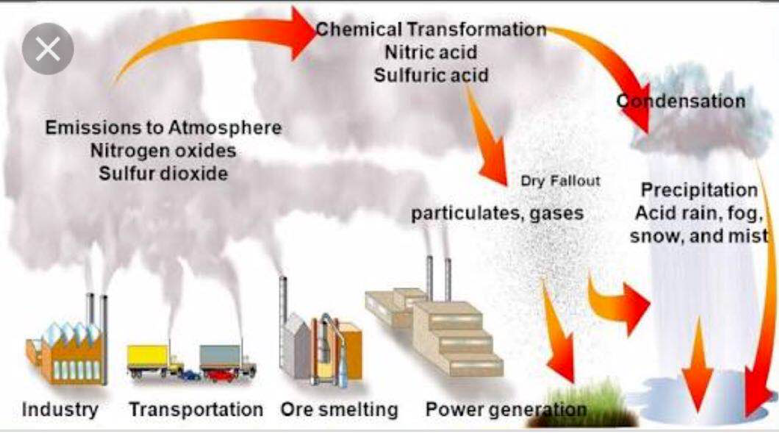

::: details Sample Answer

This flow chart shows information about where the air pollution comes from. According to the picture we can see that firstly, the process starts from the first stage, which is called emissions to atmosphere, nitrogen oxides and sulfur dioxide from industry, transportation, ore smelting and power generation. Secondly, it goes to the second stage, which is about chemical transformation, nitric acid and sulfuric acid. Thirdly, it comes to the third stage, which is called particulates gases dry fallout or condensation. Furthermore, the process comes to the ending point, which is about precipitation, acid rain, fog, snow, and mist. In summary, the process shows details about where the air pollution comes from.

:::

### 67. Commuting Time in Different Regions, Britain 2014 #031249 极高频 普通

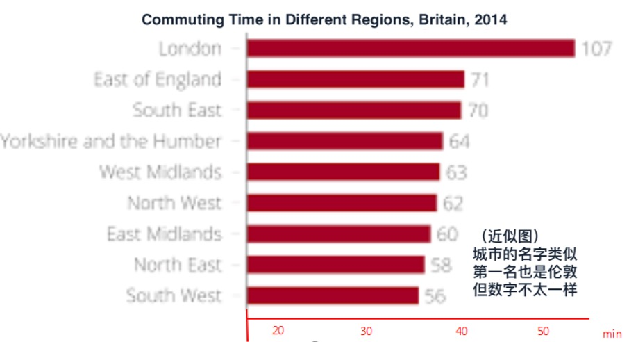

::: details Sample Answer

This bar chart shows information about commuting time in different regions, Britain 2014. Firstly, the highest number can be found in London, which is around 107 minutes. Secondly, the second highest number is located in East of England, which is about 71 minutes. Thirdly, the lowest figure is for South West, and the number is around 56 minutes. Furthermore, North West, West Midlands and Yorkshire and the Humber have a similar commuting time between 62 to 64 minutes. In summary, this chart uses real data to describe commuting time in different regions, Britain 2014.

:::

### 68. Vehicle Ownership, New Zealand in 2001 and 2013 #031254 极高频 简单

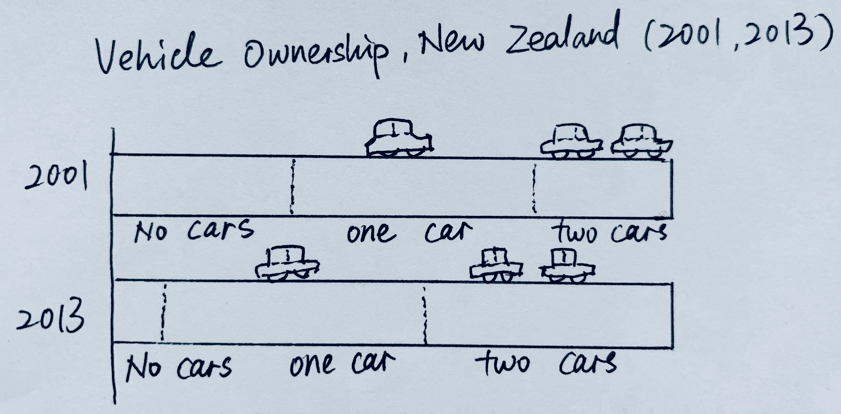

::: details Sample Answer

This bar chart shows information about vehicle ownership, New Zealand 2001, 2013. If you look at 2001, the highest number can be found in one car, which is around 50%. The lowest figure is located in two cars, which is about 20%. If you look at 2013, the highest number is for one car, and the number is around 55%. Furthermore, there is an increasing trend of people buying cars or buying more cars. In summary, this chart uses real data to describe vehicle ownership, New Zealand 2001, 2013.

:::

### 69. Eclipse #031259 极高频 困难

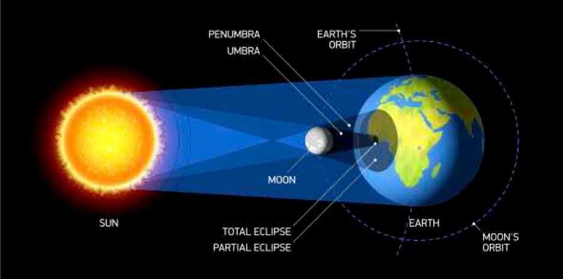

::: details Sample Answer

This picture shows information about eclipse. If you look at the left part of the picture, the most obvious information given here is the sun. Next to it, we can see total eclipse and partial eclipse, and these elements are also quite important. If you look at the right part of the picture, the Earth, the moon and their orbits are also shown in this part, giving a better understanding about this picture. Furthermore, we can also see umbra and penumbra. In summary, this picture uses different elements to describe eclipse.

:::

### 70. Annual Change in Forest Area by Region 1990-2010 #031262 极高频 极限预测 困难

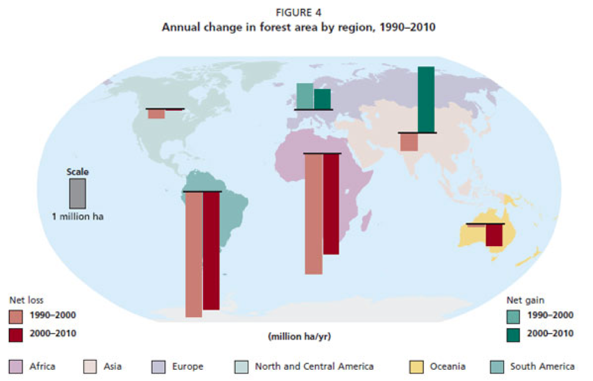

::: details Sample Answer

This bar chart shows information about annual change in forest area by region from 1990 to 2010. If you look at net loss, the highest number can be found in South America, which is around 4 million hectares per year. The lowest figure is located in North and Central America, at about 0.5 million hectares per year. If you look at net gain, the highest number is for Asia, and the number is roughly 3 million hectares per year. Furthermore, Africa shows a large net loss while Europe records a small but clear net gain. In summary, this chart uses real data to describe global forest loss and gain over the given period.

:::

### 71. Weekly household spending, Ireland #031263 极高频 普通

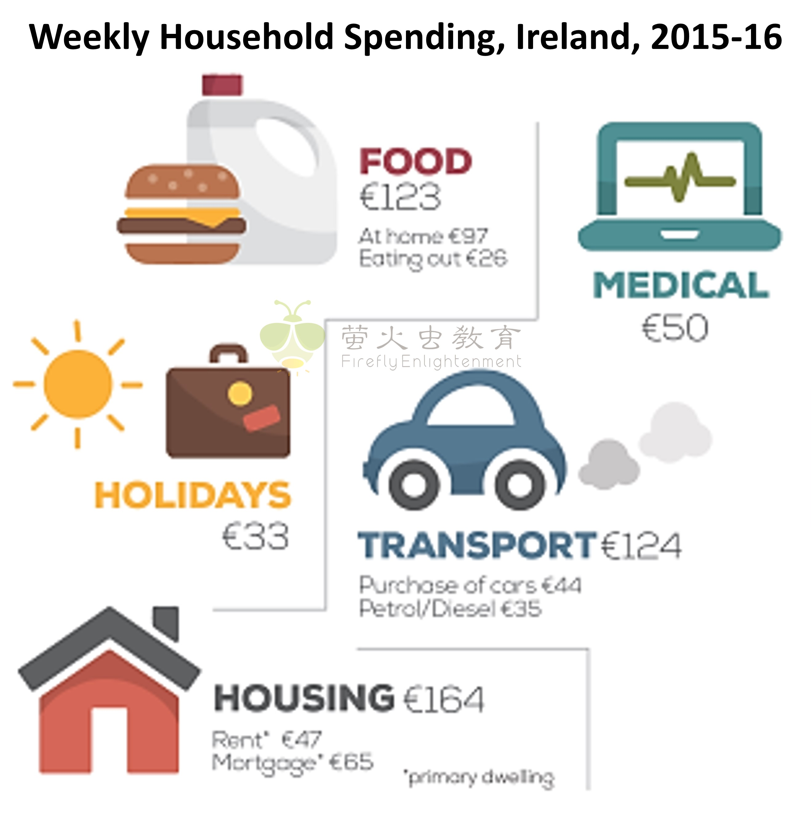

::: details Sample Answer

This picture shows information about weekly household spending, Ireland, 2015-16. Firstly, the highest number can be found in housing, which is around 164 euros. Secondly, the second highest number is located in transport, which is about 124 euros. Thirdly, the lowest figure is for holidays, and the number is around 33 euros. Furthermore, people spend most of the money at home when they spend on food. In summary, this chart uses real data to describe weekly household spending, Ireland, 2015-16.

:::

### 72. Input-Output Process #031264 极高频 普通

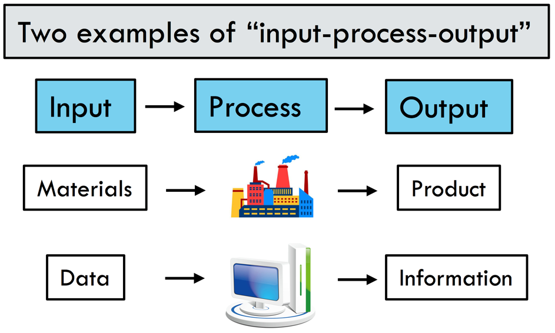

::: details Sample Answer

This flow chart shows information about two examples of input-process-output. According to the picture we can see that firstly, the process starts from the first stage, which is called input of materials and data. Secondly, it goes to the second stage, which is about process of factories and computers. Thirdly, it comes to the third stage, which is called output of product and information. Furthermore, both examples show the input- process-output procedure in different fields. In summary, the process shows details about two examples of input-process-output.

:::

### 73. Trading Goods in Ancient Egypt #031266 极高频 极限预测 普通

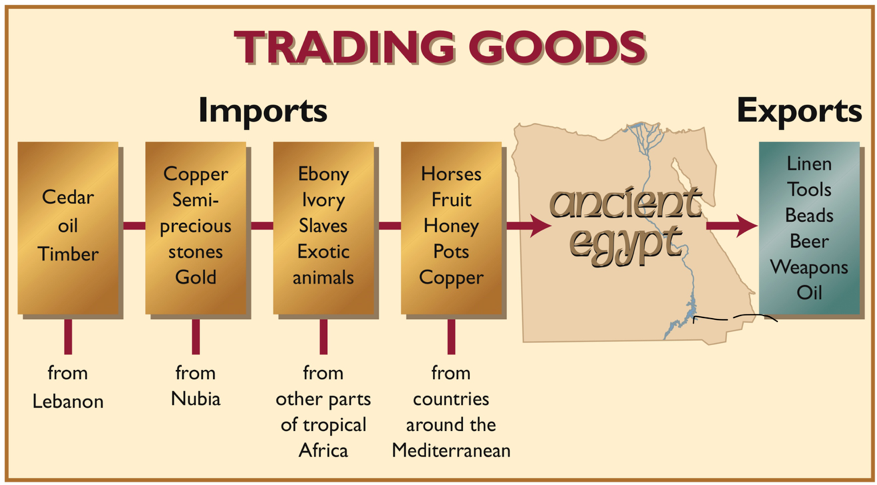

::: details Sample Answer

This flow chart shows information about trading goods. According to the picture we can see that firstly, the process starts from the first stage, which is called imports of materials like cedar, copper, ebony and horses from regions like Lebanon, Nubia, other parts of tropical Africa and countries around the Mediterranean. Secondly, it goes to the second stage, which is about ancient Egypt. Thirdly, it comes to the third stage, which is called exports of linen, tools, beads, beer, weapons and oil. Furthermore, we can also see timber and semi- precious stones in this picture as well. In summary, the process shows details about trading goods.

:::

### 74. DELL Recycling #031267 极高频 普通

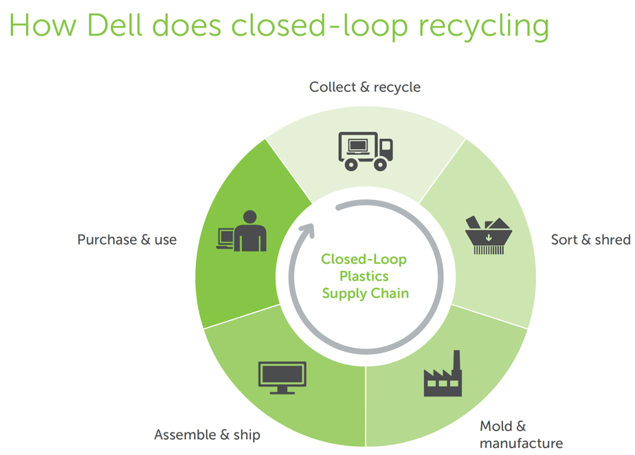

::: details Sample Answer

This flow chart shows information about how Dell does closed-loop recycling. According to the picture we can see that firstly, the process starts from the first stage, which is called collect and recycle. Secondly, it goes to the second stage, which is about sort and shred. Thirdly, it comes to the third stage, which is called mold and manufacture. Furthermore, the process comes to the ending point, which is about assemble and ship, followed by purchase and use. In the end, the process will start again from the very beginning.

:::

### 75. Sweden Government Budget 2018 #031268 极高频 普通

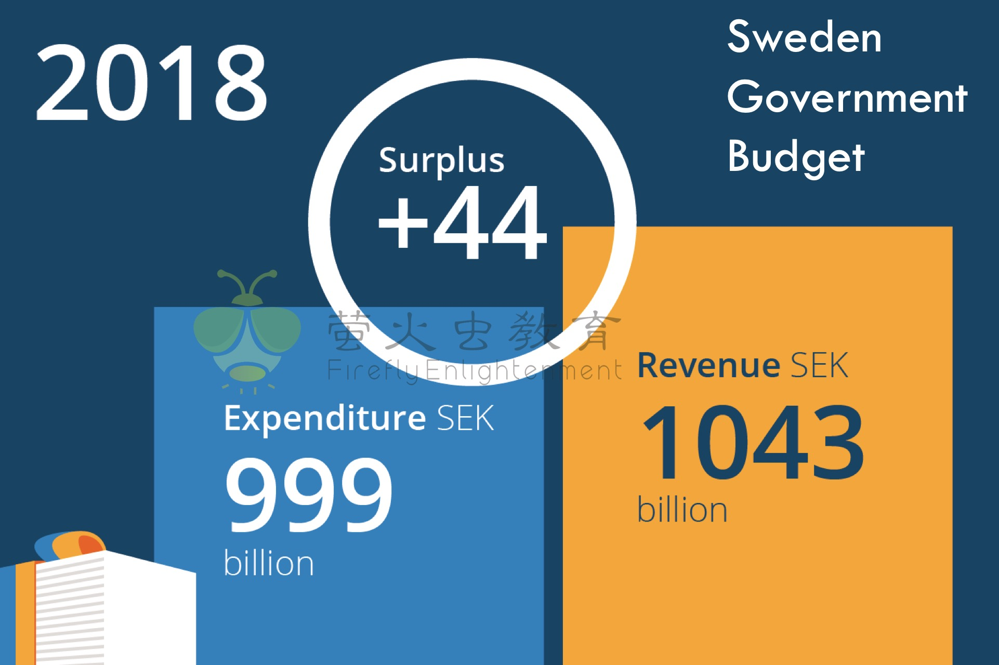

::: details Sample Answer

This picture shows information about Sweden Government Budget in 2018. If you look at the left part of the picture, the most obvious information given here is the government expenditure and 999 billion SEK. Next to it, we can see the year 2018, and these elements are also quite important. If you look at the right, government revenue and 1043 billion SEK and a budget surplus of positive 44 are also shown in this part, giving a better understanding about this picture. In summary, this picture uses different elements to describe Sweden’ s government budget in 2018.

:::

### 76. Annual Mean Temperature #031270 极高频 困难

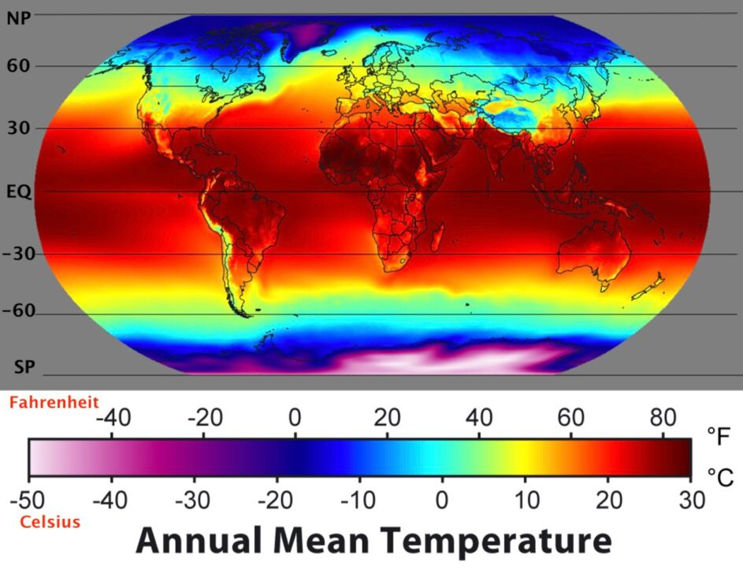

::: details Sample Answer

This map shows information about annual mean temperature. Firstly, the highest number can be found in equator, which is around degree Celsius or 80 degree Fahrenheit. Secondly, the second highest number is located in between equator to 30 degrees, which is about 20 degree Celsius or 70 degree Fahrenheit. Thirdly, the lowest figure is for the South Pole, and the number is around -50 degree Celsius or Fahrenheit. Furthermore, the North Pole is warmer than the South Pole. In summary, this chart uses real data to describe annual mean temperature.

:::

### 77. Journeys in UK by purpose #031273 极高频 简单

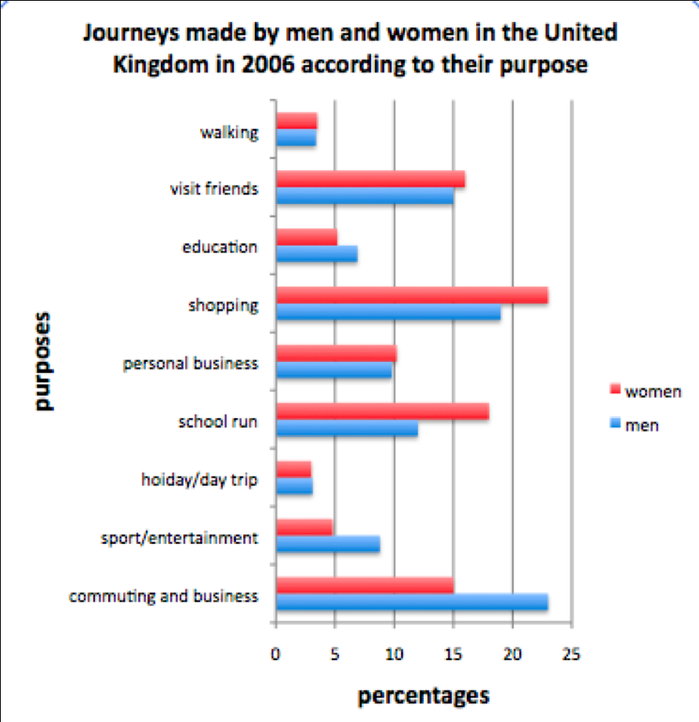

::: details Sample Answer

This bar chart shows information about journeys made by men and women in the United Kingdom in 2006 according to their purpose. If you look at women, the highest number can be found in shopping, which is around 23%. The lowest figure is located in holiday or day trip, which is about 3%. If you look at men,  the highest number is for commuting and business, and the number is around 23%. Furthermore, women and men have a similar percentage for personal business around 10%. In summary, this chart uses real data to describe journeys made by men and women in the United Kingdom in 2006 according to their purpose.

:::

### 78. Adults vs Teens: Number of texts on a typical day #031274 极高频 极限预测 简单

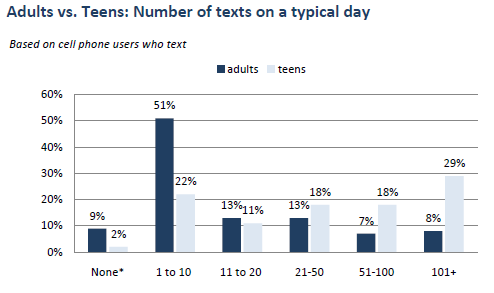

::: details Sample Answer

This bar chart shows information about adults versus teens: number of texts on a typical day. If you look at adults, the highest number can be found in 1 to 10, which is around 51%. The lowest figure is located in 51-100, which is about 7%. If you look at teens,  the highest number is for 101+, and the number is around 29%. Furthermore, we can see adults text much less than teens. In summary, this chart uses real data to describe adults versus teens: number of texts on a typical day.

:::

### 79. Rainforest in South America #031283 极高频 极限预测 困难

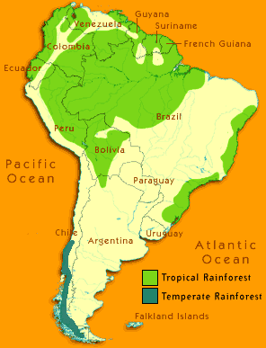

::: details Sample Answer

This picture shows information about rainforest in South America. If you look at the top, the most obvious information given here is tropical rainforest. Next to it, we can see Colombia and Brazil, and almost half of Brazil has tropical rainforest. If you look at the bottom, temperate rainforest and Chile are also shown in this part, and almost half of Chile has temperate rainforest. Furthermore, we can also see Pacific Ocean and Atlantic Ocean in this picture as well. In summary, this picture uses different elements to describe rainforest in South America.

:::

### 80. Fruits #031284 极高频 极限预测 困难

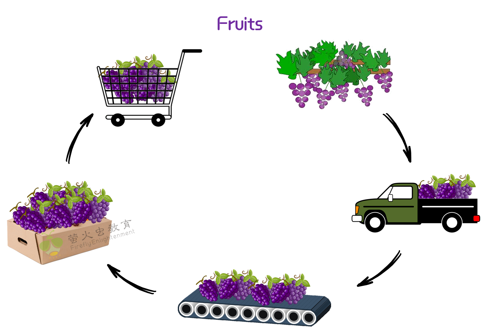

::: details Sample Answer

This flow chart shows information about the distribution process of fruits. According to the picture we can see that firstly, the process starts from the first stage, which is harvesting or picking up grapes. Secondly, it goes to the second stage, which is about transportation by truck. Thirdly, it comes to the third stage, which is called processing and packaging. Furthermore, the process comes to the ending point, which is about selling fruits in stores. In the end, the process will start again from the very beginning.

:::

### 81. A Food Chain #031285 极高频 困难

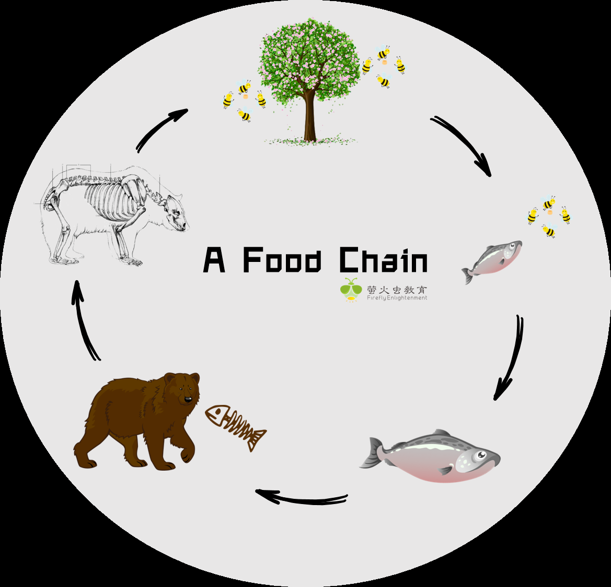

::: details Sample Answer

This flow chart shows information about a food chain. According to the picture we can see that firstly, the process starts from the first stage, which is called bees and the tree. Secondly, it goes to the second stage, which is about fish eating the bees. Thirdly, it comes to the third stage, which is called the fish. Furthermore, the process comes to the ending point, which is about the bear dies and becomes bones. We can also see the bear eats the fish in this picture as well. In the end, the process will start again from the very beginning.

:::

### 82. World Population Density (Orange) #031290 极高频 困难

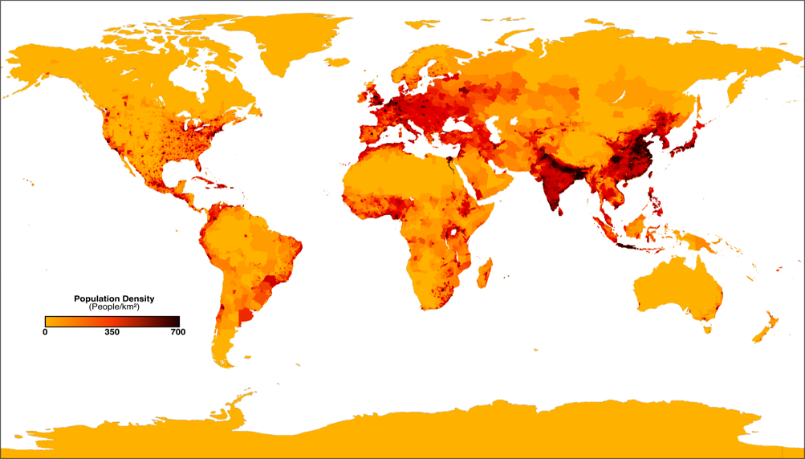

::: details Sample Answer

This map shows information about world population density. Firstly, the highest number can be found in China and India, which is around 700 people/km2. Secondly, the second highest number is located in Europe and US, which is about 600 people/km2. Thirdly, the lowest figure is for North Pole and South Pole, and the number is around 0 people/km2. Furthermore, some parts in Africa and South America also have large population density. In summary, this chart uses real data to describe world population density.

:::

### 83. Iron Age Hut #031293 极高频 困难

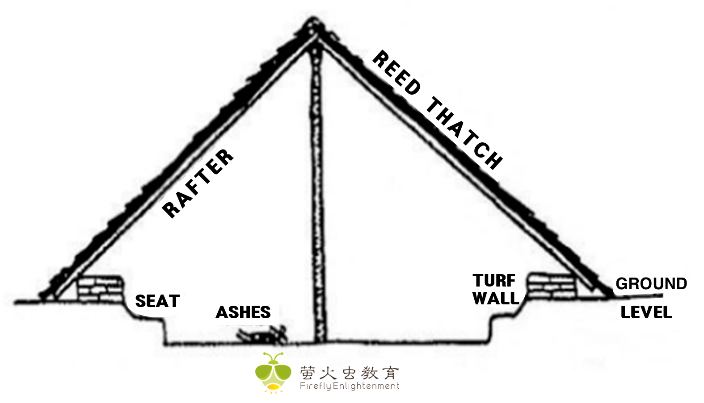

::: details Sample Answer

This picture shows information about iron age hut. If you look at the left, the most obvious information given here is rafter. Next to it, we can see seat and ashes, and the ashes may come from burning something. If you look at the right, reed thatch and turf wall are also shown in this part, which are similar to modern houses. Furthermore, we can also see ground level in this picture as well. In summary, this picture uses different elements to describe iron age hut.

:::

### 84. Mosquito life cycle #031297 极高频 极限预测 普通

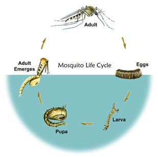

::: details Sample Answer

This flow chart shows information about mosquito life cycle. According to the picture we can see that firstly, the process starts from the first stage, which is called adult. Secondly, it goes to the second stage, which is about eggs. Thirdly, it comes to the third stage, which is called larva. Furthermore, the process comes to the ending point, which is about pupa and adult emerges. In the end, the process will start again from the very beginning.

:::

### 85. How to form acid rain (非原图) #031299 极高频 普通

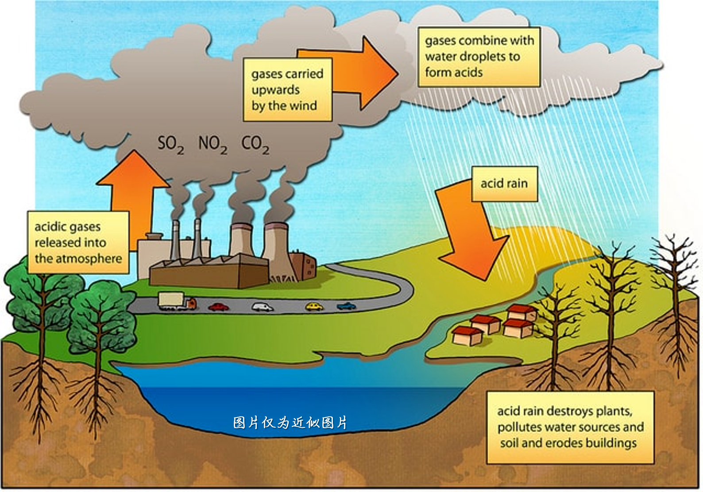

::: details Sample Answer

This flow chart shows information about how to form acid rain. According to the picture we can see that firstly, the process starts from the first stage, which is called acidic gases released into the atmosphere. Secondly, it goes to the second stage, which is about gases carried upwards by the wind. Thirdly, it comes to the third stage, which is called gases combine with water droplets to form acids. Furthermore, the process comes to the ending point, which is about acid rain destroys plants, pollutes water sources and soil and erodes buildings. In summary, the process shows details about how to form acid rain.

:::

### 86. What is E-waste #031300 极高频 极限预测 普通

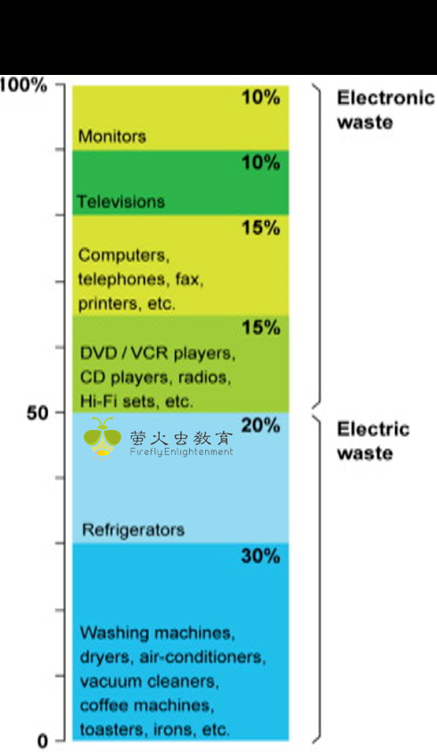

::: details Sample Answer

This bar char shows information about what is e- waste. If you look at electric waste, the highest number can be found in washing machines, dryers, air-conditioners, vacuum cleaners, coffee machines, toasters, irons, which is around 30%. The lowest figure is located in refrigerators, which is about 20%. If you look at electronic waste,  the highest number is for DVD/VCR players, CD players, radios, Hi-Fi sets or computers, telephones, fax, printers, and the number is around 15%. Furthermore, monitors and televisions have the same percentage of 10%. In summary, this chart uses real data to describe what is e-waste.

:::

### 87. Internet users who accessed via a mobile phone #031301 极高频 简单

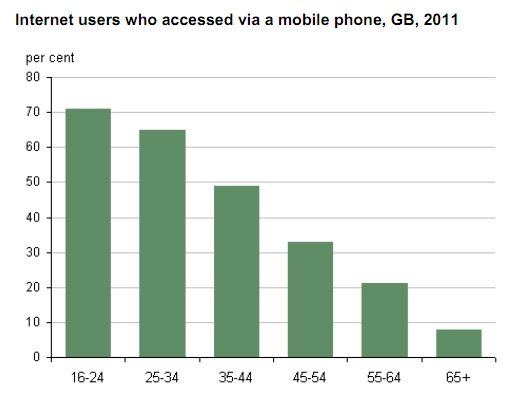

::: details Sample Answer

This bar chart shows information about internet users who accessed via a mobile phone, GB, 2011. Firstly, the highest number can be found in 16-24, which is around 71%. Secondly, the second highest number is located in 25-34, which is about 65%. Thirdly, the lowest figure is for 65+, and the number is around 8%. Furthermore, young people are more likely to access internet via a mobile phone than older ones. In summary, this chart uses real data to describe internet users who accessed via a mobile phone, GB, 2011.

:::

### 88. Popularity of cultural websites in Scotland 2013 #031312 极高频 简单

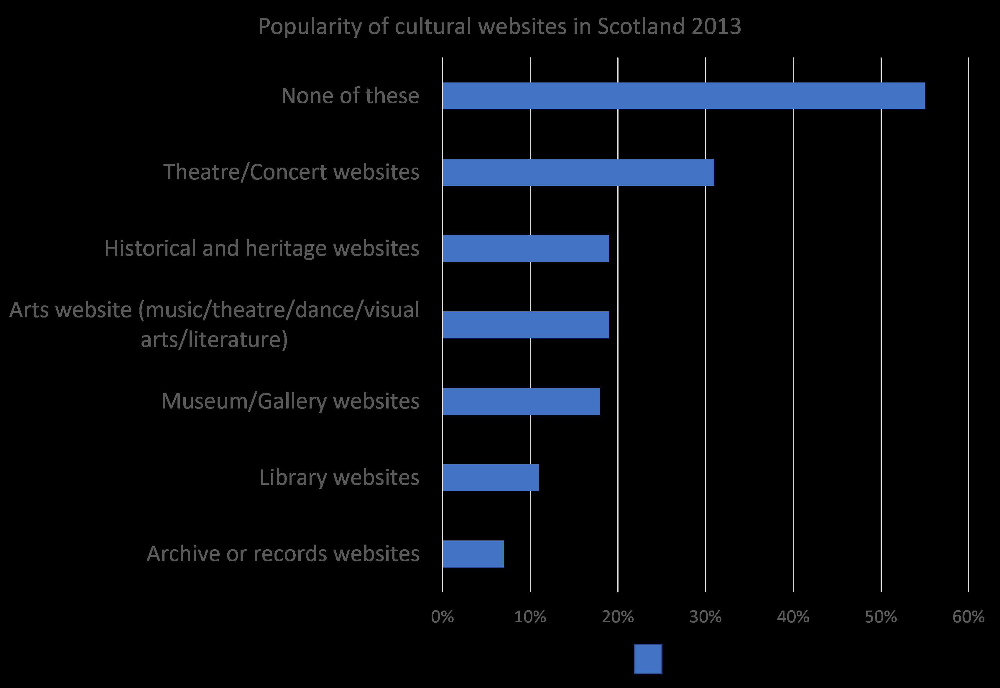

::: details Sample Answer

This bar chart shows information about popularity of cultural websites in Scotland 2013. Firstly, the highest number can be found in none of these, which is around 55%. Secondly, the second highest number is located in theater/concert websites, which is about 31%. Thirdly, the lowest figure is for archive or records websites, and the number is around 7%. Furthermore, historical and heritage websites and arts websites have a similar percentage of 19%. In summary, this chart uses real data to describe popularity of cultural websites in Scotland 2013.

:::

### 89. Honey: Percentage of national production #031318 极高频 普通

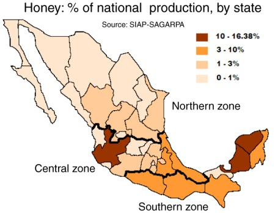

::: details Sample Answer

This map shows information about honey: percentage of national production by state. Firstly, the highest number can be found in central zone, which is around 10-16.38%. Secondly, the second highest number is located in southern zone, which is about 3-10%. Thirdly, the lowest figure is for northern zone, and the number is around 0-1%. Furthermore, there is more honey in the southern zone comparing to the northern zone. In summary, this chart uses real data to describe honey: percentage of national production by state.

:::

### 90. Main Hall #031319 极高频 困难

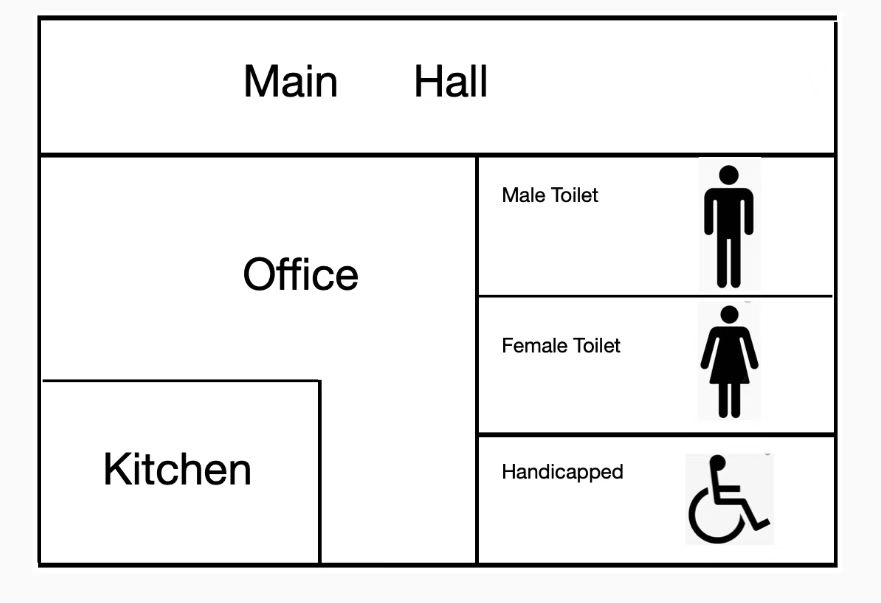

::: details Sample Answer

This picture shows information about main hall. If you look at the left, the most obvious information given here is main hall. Next to it, we can see kitchen and office, and the kitchen is within the office area. If you look at the right, male toilet and female toilet are also shown in this part, which have a similar area. Furthermore, we can also see handicapped in this picture as well. In summary, this picture uses different elements to describe main hall.

:::

### 91. Best food for brain health #031323 极高频 困难

::: details Sample Answer

This picture shows information about best food for brain health. If you look at the left side, the most obvious information given here is a head and some unhealthy food. Next to it, we can see the words “change bad habits,” and these elements are also quite important. If you look at the right side, fruits and vegetables and boost your brain power are also shown in this part, giving a better understanding about this picture. Furthermore, we can also see diet, exercise and sleep in this picture as well. In summary, this picture uses different elements to describe best food for brain health.

:::

### 92. Pet Ownership #031325 极高频 极限预测 简单

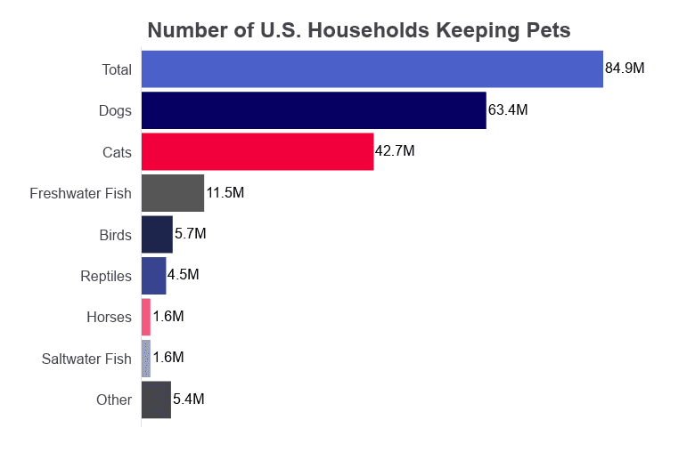

::: details Sample Answer

This bar chart shows information about number of US households keeping pets. Firstly, the highest number can be found in total, which is around 84.9 million. Secondly, the second highest number is located in dogs, which is about 63.4 million. Thirdly, the lowest figure is for horses and saltwater fish, and the number is around 1.6 million. Furthermore, most of other households have cats as the pet. In summary, this chart uses real data to describe number of US households keeping pets.

:::

### 93. Australia: Inbound visitors 2005 - 2006 #031331 极高频 普通

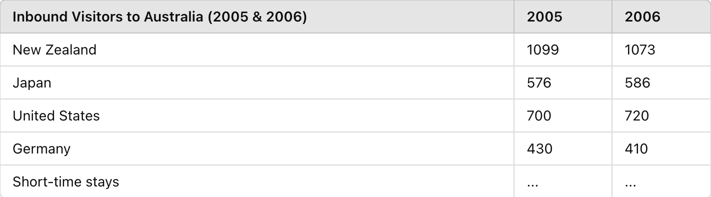

::: details Sample Answer

This table chart shows information about  inbound visitors to Australia 2005 and 2006. If you look at 2005, the highest number can be found in New Zealand, which is around 1099. The lowest figure is located in Germany, which is about 430. If you look at 2006,  the highest number is for New Zealand, and the number is around 1073. Furthermore, there are also visitors from Japan and United States to Australia. In summary, this chart uses real data to describe  inbound visitors to Australia 2005 and 2006.

:::

### 94. Food Pyramid 1970s vs 2010s #031337 极高频 困难

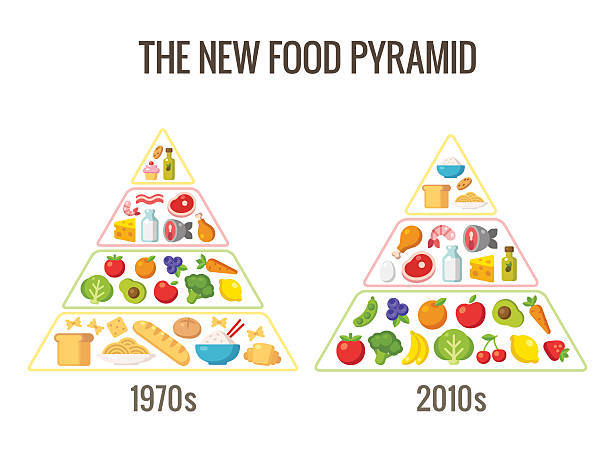

::: details Sample Answer

This picture shows information about the new food pyramid. If you look at 1970s, the most obvious information given here is people eat bread, pasta and rice at most. Next to it, we can see people eat only a little bit of cookies, cakes and oil, which means they may be unhealthy. If you look at 2010s, people eat different fruits and vegetables at most and increased amount of fish, meat and dairy product are also shown in this part, which means the food structure is changed. Furthermore, we can also see less bread and rice in this picture as well. In summary, this picture uses different elements to describe the new food pyramid.

:::

### 95. Percentage of Volunteer Job #031340 极高频 简单

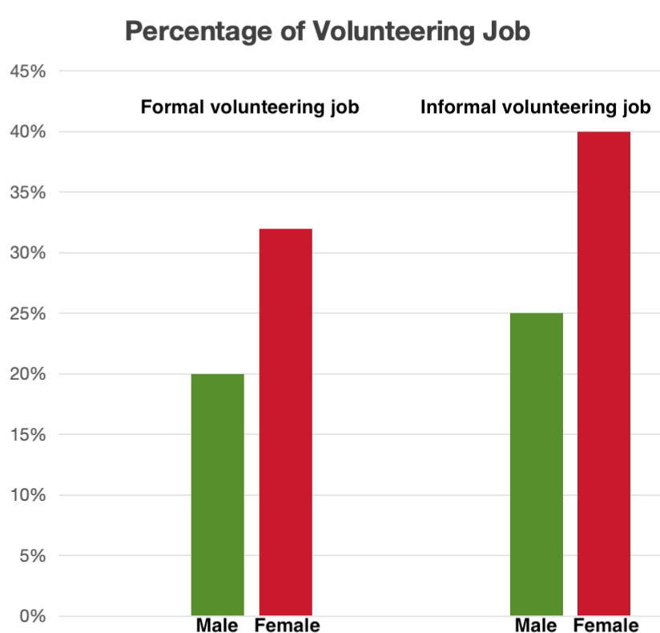

::: details Sample Answer

This bar chart shows information about the percentage of volunteer job. If you look at formal volunteering jobs, the highest number can be found in females, which is around 32%, and the lowest figure is located in males, which is about 20%. If you look at informal volunteering jobs, the highest number is for females, and the number is around 40%. Furthermore, male participation in informal volunteering is higher than in formal volunteering. In summary, this chart uses real data to describe the percentage of volunteer job.

:::

### 96. Collapse of Atlantic Cod Stocks #031341 极高频 困难

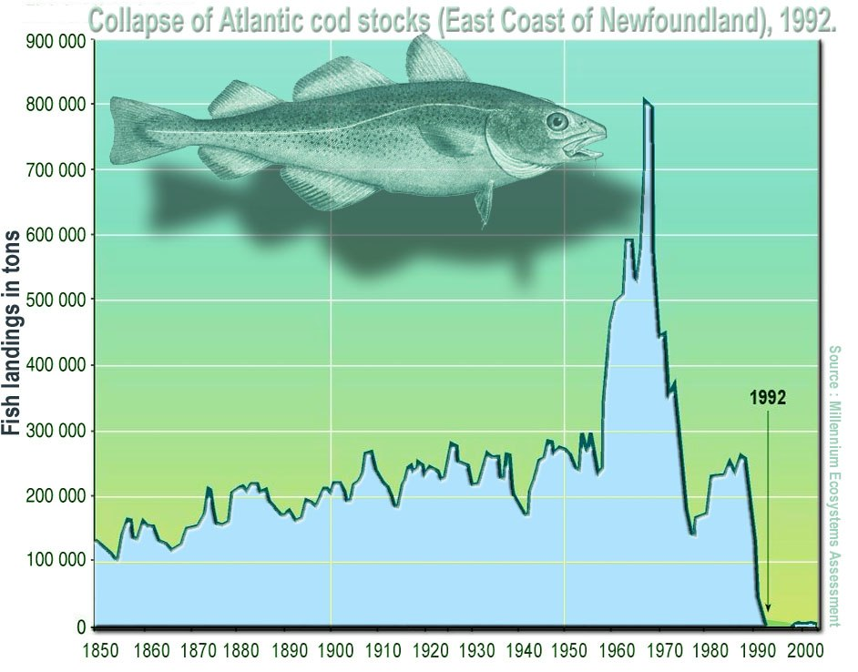

::: details Sample Answer

This line chart shows information about collapse of Atlantic cod stocks east coast of Newfoundland 1992. Firstly, the highest number can be found in 1965, which is around 800,000 tons of fish landings. Secondly, the second highest number is located in 1960, which is about 600,000 tons of fish landings. Thirdly, the lowest figure is for 1992, and the number is around 0 tons of fish landings. Furthermore, there is a sharp decreasing trend from 1965 to 1975. In summary, this chart uses real data to describe collapse of Atlantic cod stocks east coast of Newfoundland 1992.

:::

### 97. Wage Growth, Consumption, Household Debt #031346 极高频 简单

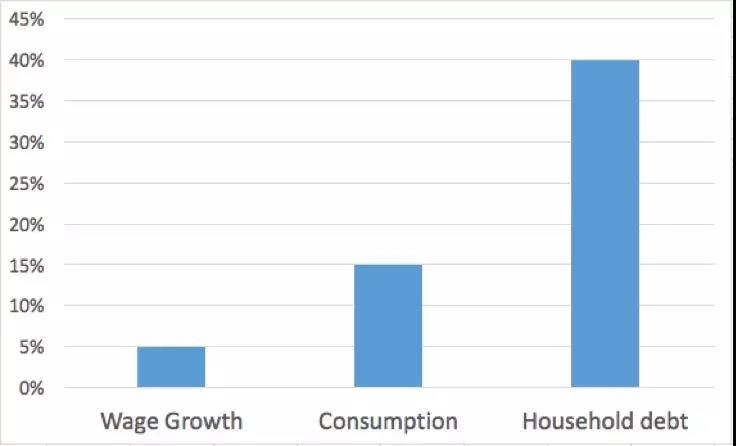

::: details Sample Answer

This bar chart shows information about wage growth, consumption and household debt. Firstly, the highest number can be found in household debt, which is around 40%. Secondly, the second highest number is located in consumption, which is about 15%. Thirdly, the lowest figure is for wage growth, and the number is around 5%. Furthermore, consumption is noticeably higher than wage growth. In summary, this chart uses real data to describe wage growth, consumption and household debt.

:::

### 98. Pre-tax profits of the 1,000 Largest Banks #031347 极高频 困难

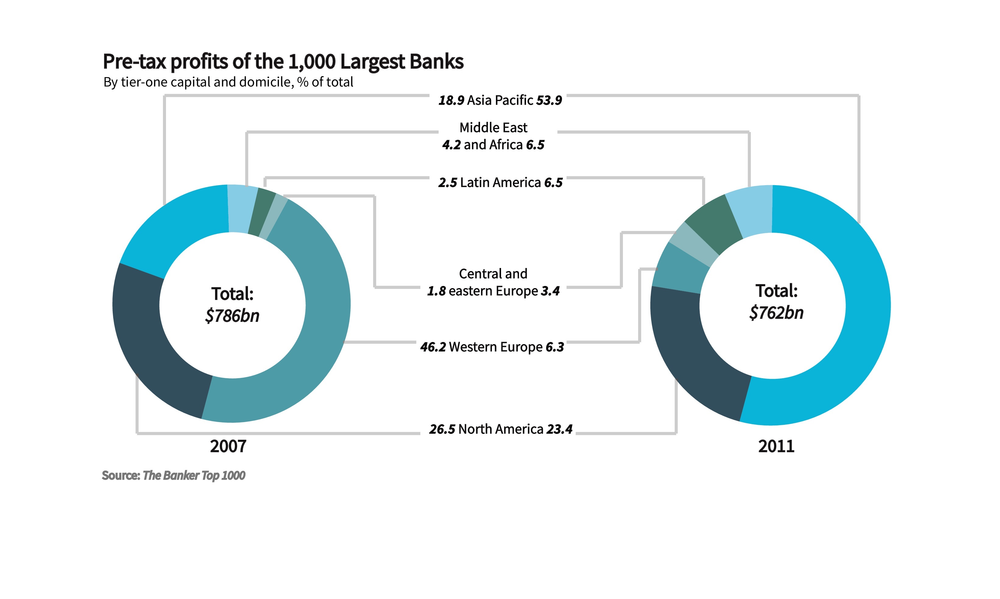

::: details Sample Answer

This pie chart shows information about pre-tax profits of the 1,000 largest banks. If you look at 2007, the highest number can be found in Western Europe, which is around 46.2%. The lowest figure is located in Central and Eastern Europe, which is about 1.8%. If you look at 2011,  the highest number is for Asia Pacific, and the number is around 53.9%. Furthermore, there is not a clear difference for North America between 2007 and 2011. In summary, this chart uses real data to describe pre-tax profits of the 1,000 largest banks.

:::

### 99. Estimated Number of U.S. Households that Own a Pet #031349 极高频 困难

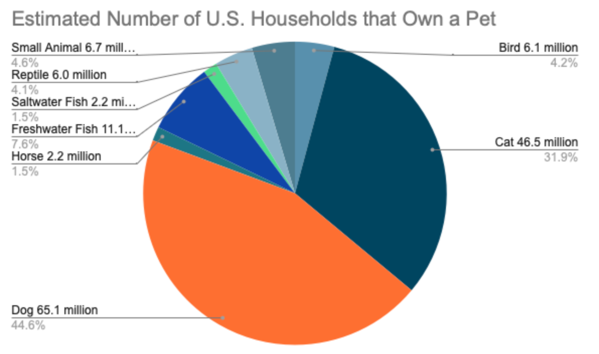

::: details Sample Answer

This pie chart shows information about estimated number of US households that own a pet. Firstly, the highest number can be found in dog, which is around 65.1 million and 44.6%. Secondly, the second highest number is located in cat, which is about 46.5 million and 31.9%. Thirdly, the lowest figure is for horse and saltwater fish, and the number is around 2.2 million and 1.5%. Furthermore, small animal, bird and reptile have a similar value. In summary, this chart uses real data to describe estimated number of US households that own a pet.

:::

### 100. Households in Millions Who Own Pets #031350 极高频 普通

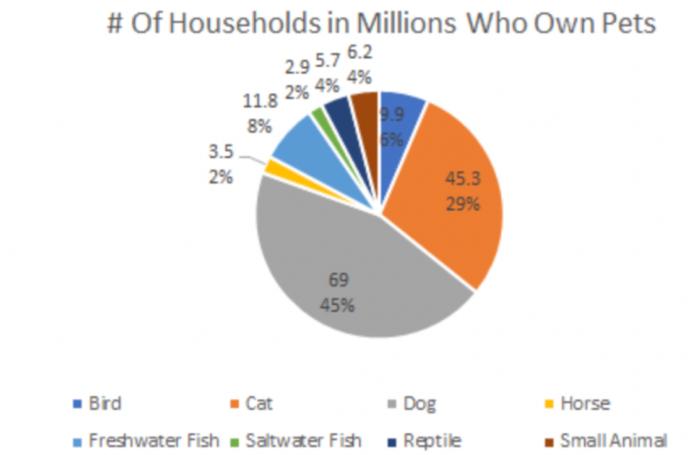

::: details Sample Answer

This pie chart shows information about number of households in millions who own pets. Firstly, the highest number can be found in dog, which is around 69 million and 45%. Secondly, the second highest number is located in cat, which is about 45.3 million and 29%. Thirdly, the lowest figure is for saltwater fish, and the number is around 2.9 million and 2%. Furthermore, small animal reptile have a similar percentage of 4%. In summary, this chart uses real data to describe number of households in millions who own pets.

:::

### 101. Chemical experiment #031352 极高频 普通

::: details Sample Answer

This picture shows information about chemical experiment. If you look at the right, the most obvious information given here is a student doing chemical experiment. Next to it, we can see red liquid and white liquid, and they are in different containers. If you look at the left, a professional wearing glasses are also shown in this part, who is looking at the liquid. Furthermore, we can also see beakers and lab coats in this picture as well. In summary, this picture uses different elements to describe chemical experiment.

:::

### 102. Population age groups in Australia #031354 极高频 普通

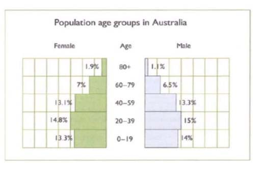

::: details Sample Answer

This bar chart shows information about population age groups in Australia. If you look at female, the highest number can be found in 20-39, which is around 14.8%. The lowest figure is located in 80+, which is about 1.9%. If you look at male,  the highest number is for 20-39, and the number is around 15%. Furthermore, female and male are having a similar trend. In summary, this chart uses real data to describe population age groups in Australia.

:::

### 103. Luxury Ensuite #031356 极高频 普通

::: details Sample Answer

This picture shows information about luxury ensuite. If you look at the top, the most obvious information given here is ensuite. Next to it, we can see toilet and desk, and there is a wall between them. If you look at the bottom, wardrobe and bed are also shown in this part, which are at the right side of the door. Furthermore, we can also see door and chair in this picture as well. In summary, this picture uses different elements to describe luxury ensuite.

:::

### 104. Share of Companies #031357 极高频 简单

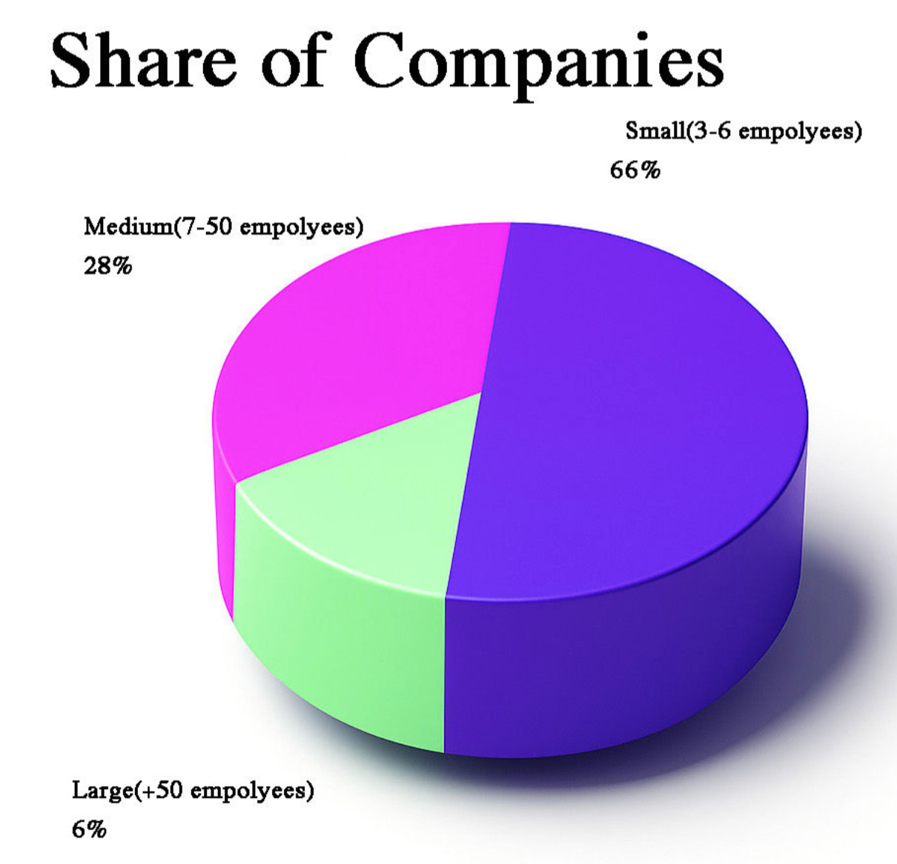

::: details Sample Answer

This pie chart shows information about share of companies. Firstly, the highest number can be found in small 3-6 employees, which is around 66%. Secondly, the second highest number is located in medium 7-50 employees, which is about 28%. Thirdly, the lowest figure is for large 50+ employees, and the number is around 6%. Furthermore, purple, pink and green colors also carry important weight in this graph. In summary, this chart uses real data to describe share of companies.

:::

### 105. Inbound Tourists - Ecuador #031359 极高频 简单

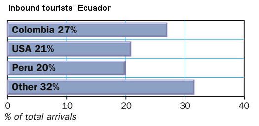

::: details Sample Answer

This bar chart shows information about inbound tourists to Ecuador. Firstly, the highest number can be found in other countries, which is around 32% of total arrivals. Secondly, the second highest number is located in Colombia, which is about 27%. Thirdly, the lowest figure is for Peru, and the number is around 20%. Furthermore, visitors from the USA account for 21%, and are slightly higher than Peru. In summary, this chart uses real data to describe inbound tourists to Ecuador.

:::

### 106. Annual Height Increase #031360 极高频 普通

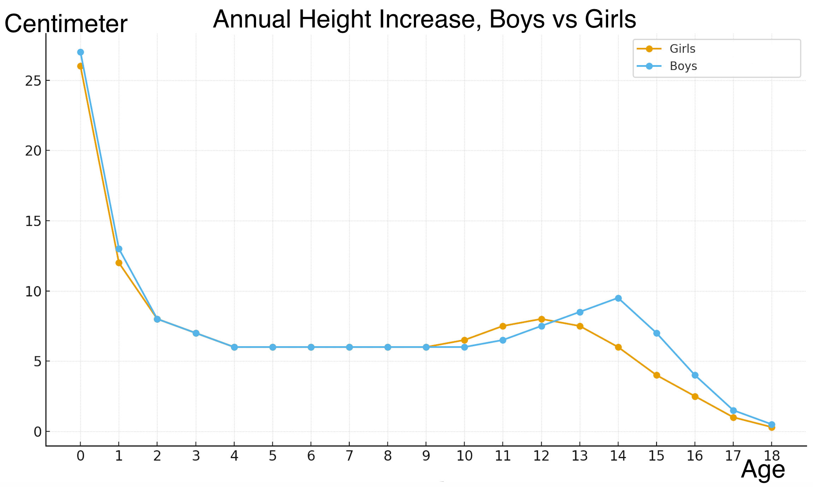

::: details Sample Answer

This line chart shows information about annual height increase for boys and girls. If you look at girls, the highest number can be found at age 0, which is around 26 centimeters, and the lowest figure is located at age 18, which is about 0 centimeter. If you look at boys, the highest number is for age 0, and the number is around 27 centimeters. Furthermore, boys generally experience a higher growth increase than girls from age 13 to 18. In summary, this chart uses real data to describe annual height increase for boys and girls.

:::

### 107. Comparison of Birth Rates between Male and Female on Sunday #031363 极高频 简单

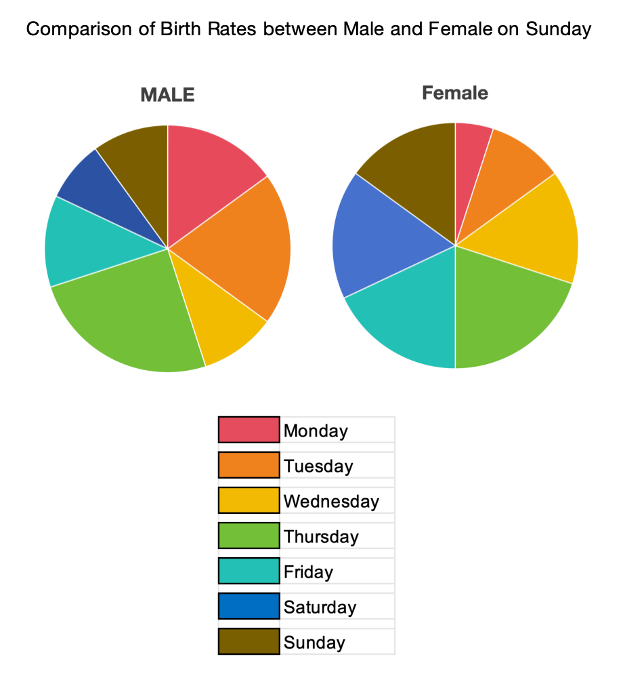

::: details Sample Answer

This pie chart shows information about the comparison of birth rates between males and females on different days of the week. If you look at males, the highest number can be found in Thursday, which is the green section, and the lowest figure is located in Saturday, which is shown in blue. If you look at females, the highest number is for Thursday as well, and the number is indicated by the green area. Furthermore, births of males are higher than females on Mondays and Tuesdays. In summary, this chart uses real data to describe the comparison of birth.

:::

### 108. Why Students Choose to Study Foreign Languages #031364 极高频 普通

::: details Sample Answer

This pie chart shows information about why students choose to study foreign languages. Firstly, the highest number can be found in personal interest and enjoyment, which is around 43%. Secondly, the second highest number is located in degree requirement, which is about 24%. Thirdly, the lowest figure is for other reasons and societal responsibility, and the number is around 1%. Furthermore, use in future career accounts for about 13%. In summary, this chart uses real data to describe foreign languages.

:::

### 109. Types of Clubs that People Belong to #031365 极高频 普通

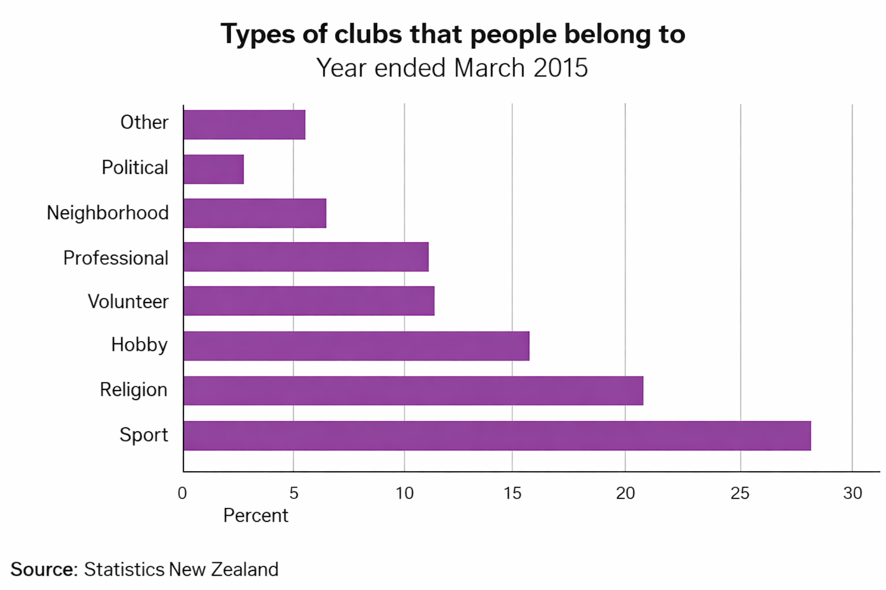

::: details Sample Answer

This bar chart shows information about the types of clubs that people belong to in the year ended March 2015. Firstly, the highest number can be found in sport, which is around 28%. Secondly, the second highest number is located in religion, which is about 21%. Thirdly, the lowest figure is for political clubs, and the number is around 3%. Furthermore, hobby accounts for approximately 16%. In summary, this chart uses real data to describe the types of clubs.

:::

### 110. Household car ownership in New Zealand or Canada #031366 极高频 普通

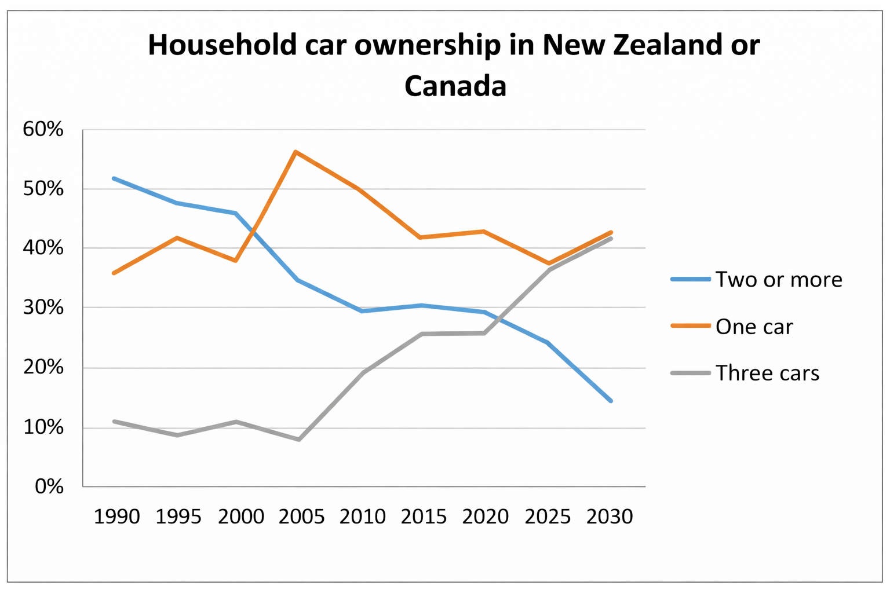

::: details Sample Answer

This line chart shows information about household car ownership in New Zealand or Canada. If you look at one-car households, the highest number can be found in 2005, which is around 55%, and the lowest figure is located in 1990, which is about 35%. If you look at three cars, the highest number is for 2030, and the number is around 40%. Furthermore, households with two or more cars show a downward trend. In summary, this chart uses real data to describe household car ownership.

:::

### 111. Legal Immigrants by Region #031367 极高频 困难

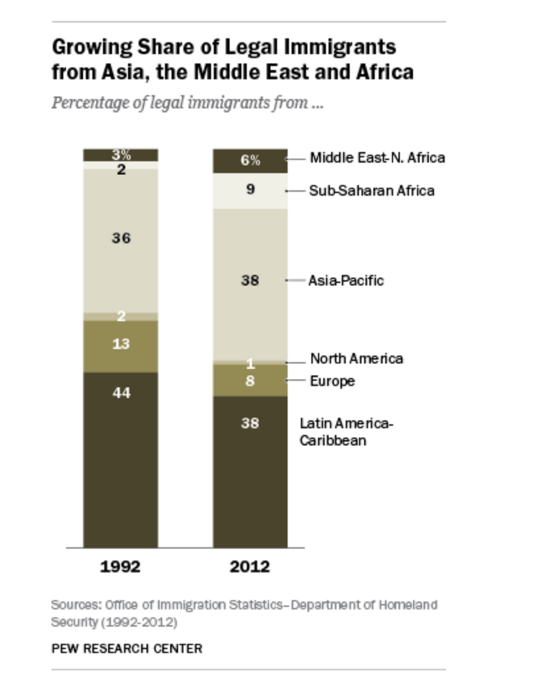

::: details Sample Answer

This bar chart shows information about the growing share of legal immigrants from Asia, the Middle East and Africa. If you look at 1992, the highest number can be found in Latin America and the Caribbean, which is around 44%, and the lowest figure is located in North America, which is about 2%. If you look at 2012, the highest number is for both Asia-Pacific and Latin America, and the number is around 38%. Furthermore, Europe accounts for approximately 8%. In summary, this chart uses real data to describe the growing share of legal immigrants.

:::

### 112. Newspaper Circulation(USA) #031368 极高频 普通

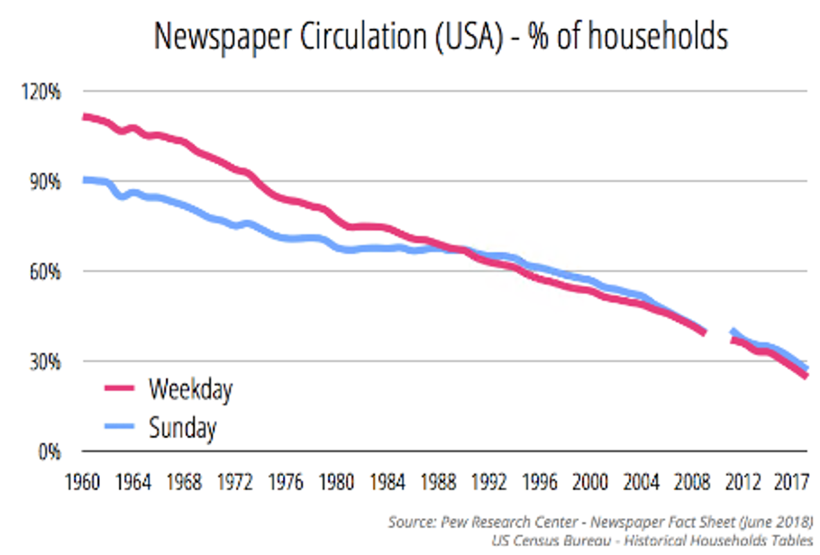

::: details Sample Answer

This line chart shows information about newspaper circulation usa, percentage of households. If we look at the weekday, the highest number can be found in 1960, which is around 100%. And the lowest figure is located in 2017, which is about 30%. And for Sunday, the highest value is for 1960, and the number is around 90%. Furthermore, there is a decreasing trend for both lines. In summary, this chart uses real data to describe newspaper circulation in usa.

:::

### 113. Urban and Rural Population #031369 极高频 普通

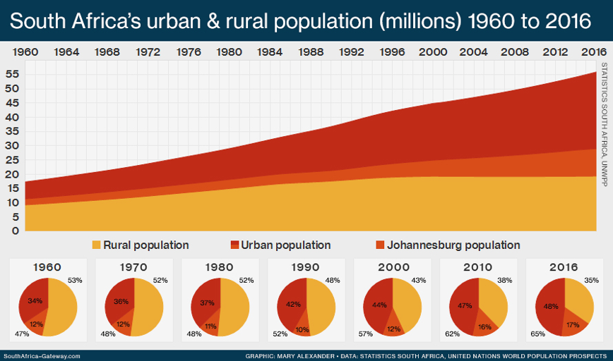

::: details Sample Answer

This line chart shows information about South Africa's urban and rural population in millions from 1960 to 2016. If we look at the rural population, the highest number can be found in 2016, which is around 15 million. The lowest figure is located in 1960, which is about 10 million. For urban population, the highest number is for 2016, totalling 55 million. Furthermore, the Johannusberg population accounts for 12% and 16% in 2000 and 2010 respectively. In summary, the line chart describes South Africa's population.

:::

### 114. The Most Cat Owners #031370 极高频 简单

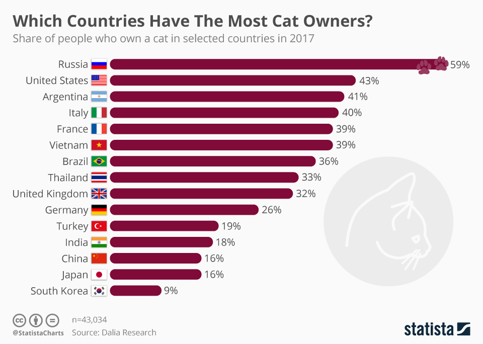

::: details Sample Answer

This bar chart shows information about which countries have the most cat owners. Firstly, the highest number can be found in Russia, which is around 59%. Secondly, the second-highest figure is located in the United States, which is about 43%. Thirdly, the least value is South Korea, and the number is 9%. Furthermore, the number of Italy is slightly higher than France. In summary, the bar chart describes which countries have the most cat owners.

:::

### 115. Weekly Household Speending #031371 极高频 普通

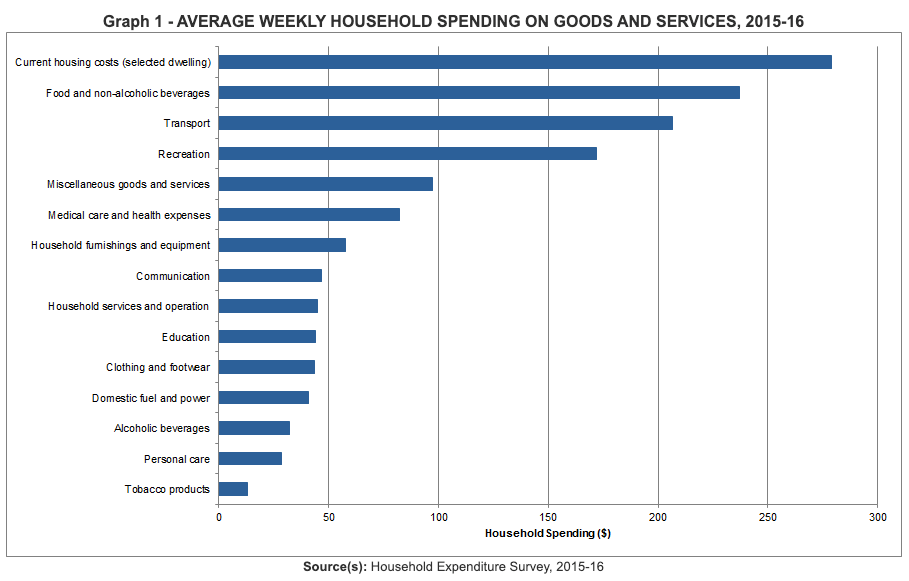

::: details Sample Answer

This bar chart shows information about average weekly household spending on goods and services, from 2015 to 16. Firstly, the highest number can be found in current housing costs, which is around 270 dollars. Secondly, the second-highest figure is located in food and non-alcoholic beverages, which is about 240 dollars. Thirdly, the lowest value is tobacco products, and the number is nearly 10 dollars. Furthermore, the number of transport is higher than recreation. In summary, the bar chart uses real data to describe average weekly household spending on goods and services.

:::

### 116. Most Popular Social Platforms #031372 极高频 极限预测 普通

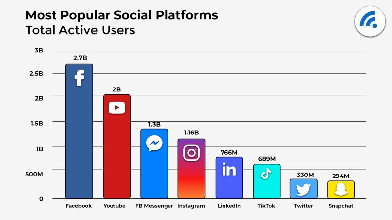

::: details Sample Answer

This bar chart shows information about the most popular social platforms and total active users. Firstly, the highest number can be found in Facebook, which is around 2.7 billion. Secondly, the second-highest figure is located in youtube, which is about 2 billion. Thirdly, the lowest value is for Snapchat, and the number is totalled at 294 million. Furthermore, FB messenger and Instagram have 1.3 billion and 1.16 billion users, respectively. In summary, the bar chart shows information about the most popular social platforms and total active users.

:::

### 117. Consumer Confidence #031008 极高频 重回 极限预测 简单

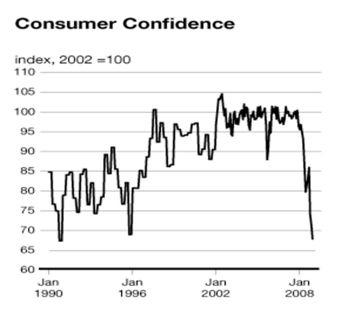

::: details Sample Answer

This line chart shows information about consumer confidence. Firstly, the highest number can be found in January 2002, which is around 105. Secondly, the second highest number is located in January 1998, which is about 101. Thirdly, the lowest figure is for January 1991, and the number is around 67. Furthermore, there may be a decreasing trend from January 2008. In summary, this chart uses real data to describe consumer confidence.

:::

### 118. US Energy Consumption by Fuel 1980-2030 #031047 极高频 重回 极限预测 简单

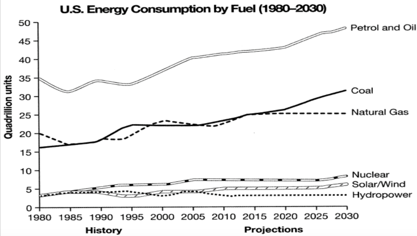

::: details Sample Answer

This line chart shows information about US energy consumption by fuel 1980-2030. If you look at petrol and oil, the highest number can be found in 2030, which is around 48 quadrillion units. The lowest figure is located in 1985, which is about 31 quadrillion units. If you look at coal,  the highest number is for 2030, and the number is around 30 quadrillion units. Furthermore, the numbers for the line of nuclear, solar/wind and hydropower are similar. In summary, this chart uses real data to describe US energy consumption by fuel 1980- 2030.

:::

### 119. World Population Density #031198 极高频 重回 极限预测 困难

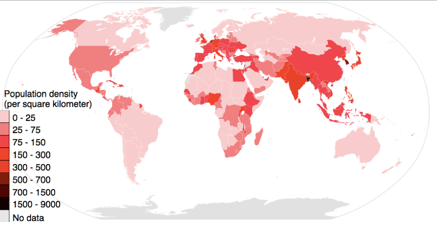

::: details Sample Answer

This map shows information about population density per square kilometer. Firstly, the highest number can be found in Bangladesh, which is around 1500-9000. Secondly, the second highest number is located in Korea, which is about 700- 1500. Thirdly, the lowest figure is for Australia, Russia, Canada and South America, and the number is around 0-25. Furthermore, there is no data collected for Antarctica and Greenland. In summary, this chart uses real data to describe population density per square kilometer.

:::

### 120. Climate zones #031305 极高频 重回 极限预测 困难

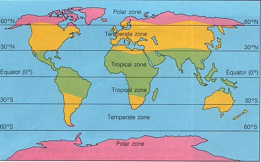

::: details Sample Answer

This map shows information about climate zones. If you look at the Northern Hemisphere, the highest proportion can be found in the temperate zone, which is around 50%, while the lowest figure is located in the polar zone, which is about 10%. If you look at the Southern Hemisphere, the highest figure is for the temperate zone, and the number is around 60%. Furthermore, the tropical zone also takes up a large part of the map, especially around the Equator. In summary, this map uses real data to describe climate zones.

:::

### 121. Housing owned and rented in the UK #031336 极高频 重回 极限预测 普通

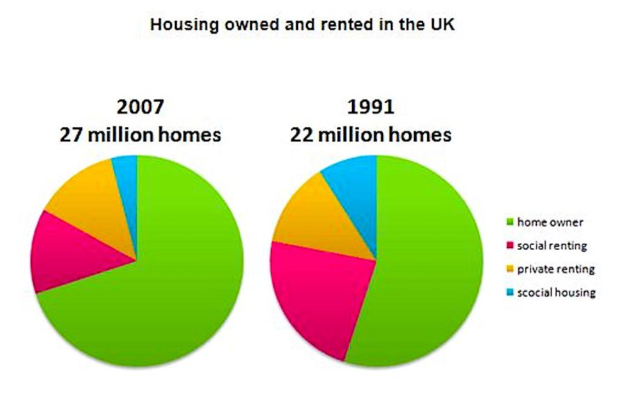

::: details Sample Answer

This pie chart shows information about housing owned and rented in the UK in 1991 and 2007. If you look at 1991, the highest number can be found in home owners, which is in green color, while the lowest figure is located in social housing, which is in blue. If you look at 2007, the highest number is for home owners, and the color is green. Furthermore, social renting and private renting also play an important role. In summary, this chart uses real data to describe housing owned and rented in the UK in 1991 and 2007.

:::

### 122. The Study Space #031373 极高频 新题 极限预测 简单

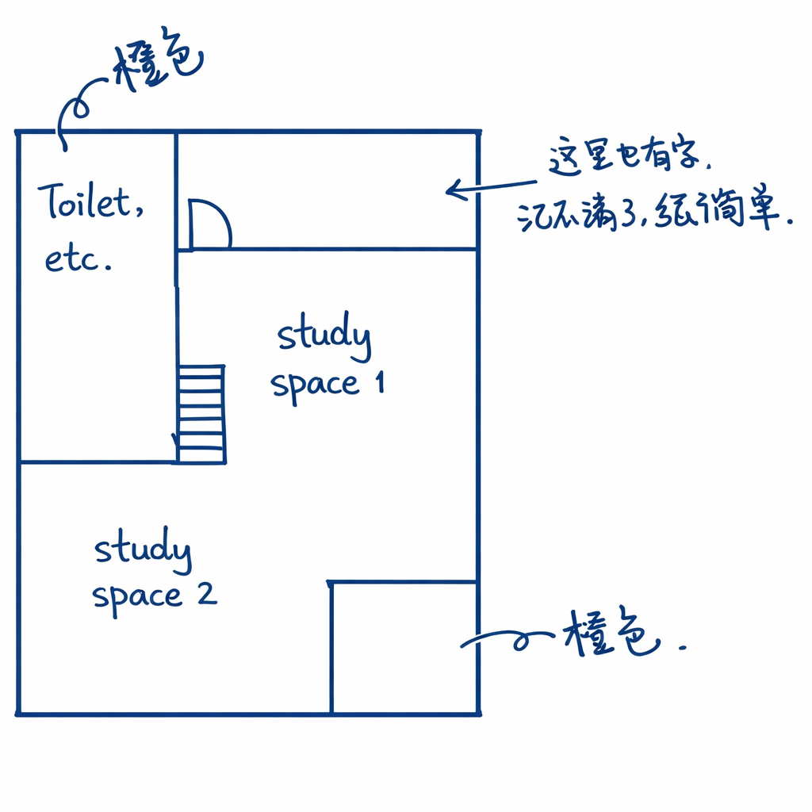

::: details Sample Answer

This picture shows information about the study space. If we look at the top, the most obvious information given here is the toilet. Next to it, we can see an entrance and another room, which is vacant and not in use. If we look at the bottom, study spaces 1 and 2 are shown in this part, which are quite big and spacious. Furthermore, we can also see stairs and rooms in orange color. So in summary, the picture vividly shows the study space.

:::

### 123. Market Share of Sneaker Brand #031374 极高频 新题 极限预测 简单

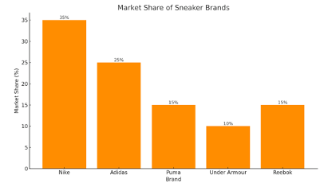

::: details Sample Answer

The bar chart gives information about the market share of sneaker brands. Firstly, the highest number can be found in Nike, which is around 35%. Secondly, the lowest figure is located in Under Armour, and the number is only 10%. Also, the second largest number is Adidas, valued at 25%. Furthermore, the number of Puma Brand is equal to that of Reebok. In summary, it uses detailed figures to describe the market share of sneaker brands.

:::

### 124. Ontario manufacturing employment and the Canadian dollar exchange #031016 降频区 简单

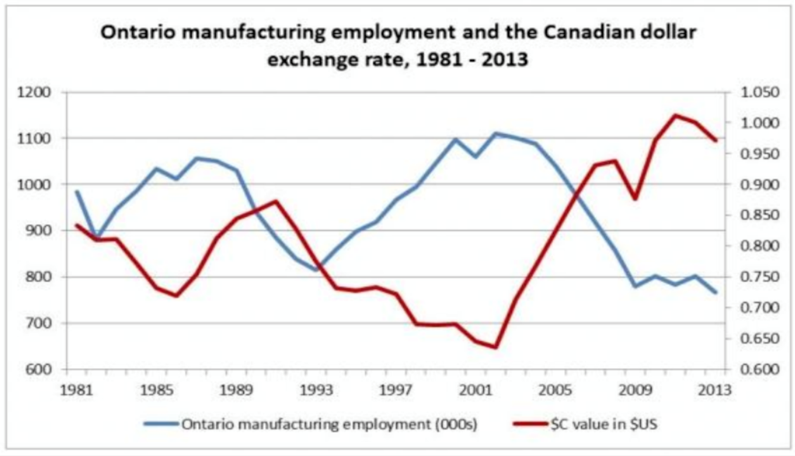

::: details Sample Answer

This line chart shows information about Ontario manufacturing employment and the Canadian dollar exchange rate, 1981 to 2013. If you look at Ontario manufacturing employment, the highest number can be found in 2002, which is around 1100. The lowest figure is located in 2013, which is about 750. If you look at Canadian dollar value in US dollar,  the highest number is for 2011, and the number is around 1.02. Furthermore, there is an increasing trend between 1991 to 2002 for Canadian dollar value in US dollar. In summary, this chart uses real data to describe Ontario manufacturing employment and the Canadian dollar exchange rate, 1981 to 2013.

:::

### 125. Drinking Habits by Age in US #031081 降频区 简单

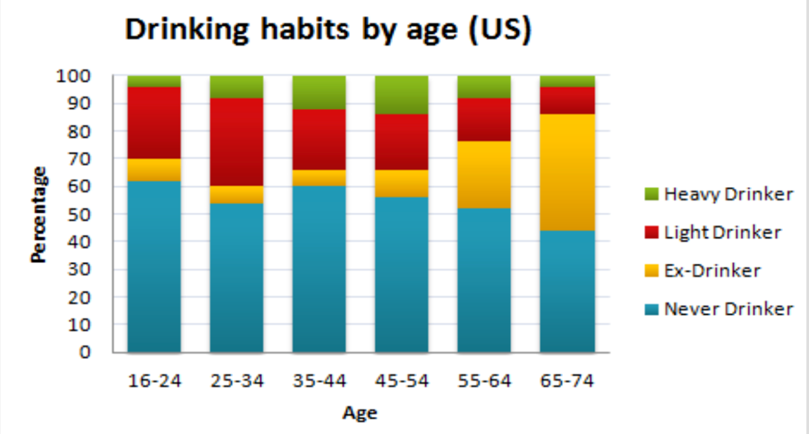

::: details Sample Answer

This bar chart shows information about drinking habits by age US. If you look at never drinker, the highest number can be found in 16-24, which is around 61%. The lowest figure is located in 65-74, which is about 44%. If you look at heavy drinker, the highest number is for 45-54, and the number is around 14%. Furthermore, the percentage for never drinker is always higher than other drinkers. In summary, this chart uses real data to describe drinking habits by age US.

:::

### 126. Media in UK #031247 降频区 普通

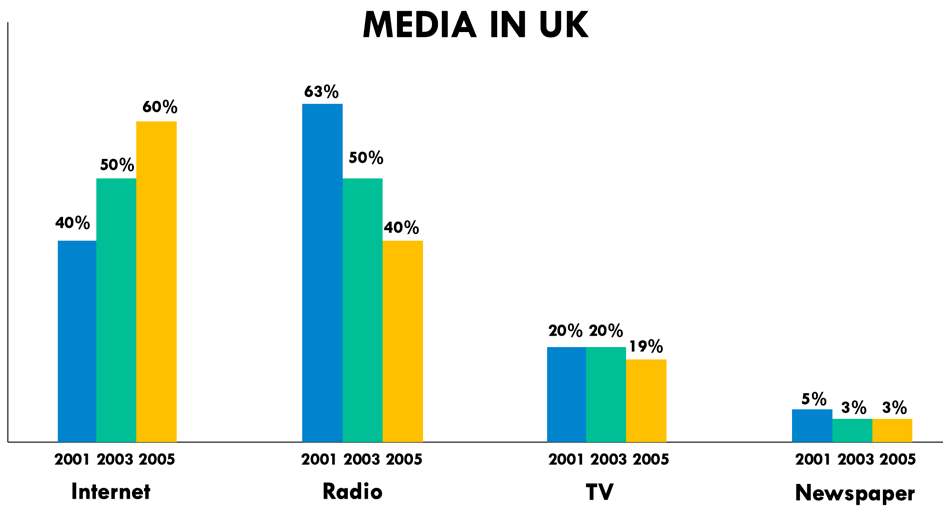

::: details Sample Answer

This bar chart shows information about media in UK. If you look at Internet, the highest number can be found in 2005, which is around 60%. The lowest figure is located in 2001, which is about 40%. If you look at radio,  the highest number is for 2001, and the number is around 63%. Furthermore, not many people in UK read newspaper and there is a decreasing trend for it. In summary, this chart uses real data to describe media in UK.

:::

### 127. Body Mass Index of Obese, Overweight, Normal and Underweight People #031251 降频区 简单

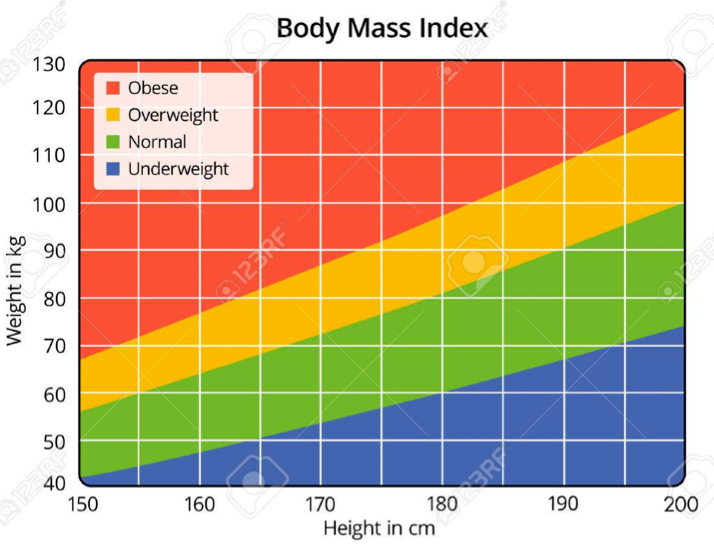

::: details Sample Answer

This chart shows information about body mass index. If you look at underweight, the highest number can be found in 200 centimeters, which is around 74 kilograms. The lowest figure is located in 150 centimeters, which is about 42 kilograms. If you look at normal,  the highest number is for 200 centimeters, and the number is around 100 kilograms. Furthermore, when people weigh over 68 kilograms with the height of 150 centimeters, they will be considered obese. In summary, this chart uses real data to describe body mass index.

:::

### 128. Buying school bags at a stationery shop #031324 降频区 困难

::: details Sample Answer

This picture shows information about buying school bags at a stationery shop. If you look at the left, the most obvious information given here is a girl holding a school bag. Next to it, we can see a mom and stationery shop, and the mom stands next to her daughter. If you look at the right, pencils and smiling are also shown in this part, which shows the girl is happy. Furthermore, we can also see shelves and pencil cases in this picture as well. In summary, this picture uses different elements to describe buying school bags at a stationery shop.

:::

### 129. New Zealand House Price #031329 降频区 普通

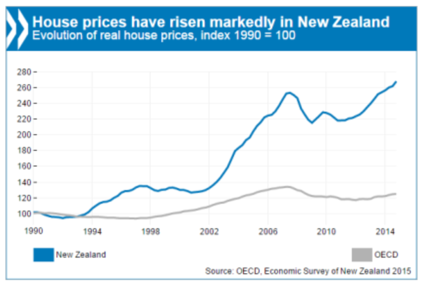

::: details Sample Answer

This line chart shows information about house prices have risen markedly in New Zealand. If you look at New Zealand, the highest number can be found in 2015, which is around 270. The lowest figure is located in 1992, which is about 95. If you look at OECD,  the highest number is for 2007, and the number is around 135. Furthermore, there may be an increasing trend in the future for the line of New Zealand. In summary, this chart uses real data to describe house prices have risen markedly in New Zealand.

:::

### 130. Students from Disadvantaged Backgrounds #031339 降频区 简单

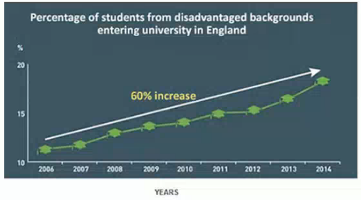

::: details Sample Answer

This line chart shows information about percentage of students from disadvantaged backgrounds entering university in England. Firstly, the highest number can be found in 2014, which is around 18%. Secondly, the second highest number is located in 2013, which is about 16%. Thirdly, the lowest figure is for 2006, and the number is around 11%. Furthermore, there is a 60% increase from 2006 to 2014. In summary, this chart uses real data to describe percentage of students from disadvantaged backgrounds entering university in England.

:::

### 131. Market Share of Pet Services and Products #031351 降频区 简单

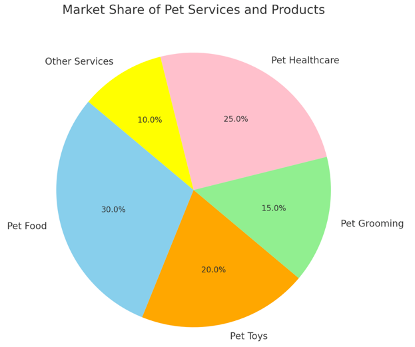

::: details Sample Answer

This pie chart shows information about market share of pet services and products. Firstly, the highest number can be found in pet food, which is around 30%. Secondly, the second highest number is located in pet healthcare, which is about 25%. Thirdly, the lowest figure is for other services, and the number is around 10%. Furthermore, pet toys and pet grooming have the percentage of 20% and 15%. In summary, this chart uses real data to describe market share of pet services and products.

:::

### 132. Mean Salary of First-Degree Graduates by Gender #031358 降频区 普通

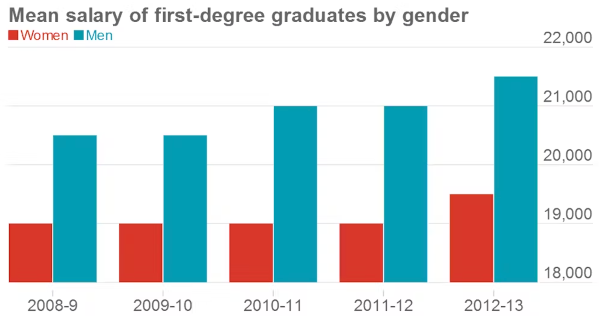

::: details Sample Answer

This bar chart shows information about mean salary of first-degree graduates by gender. If you look at men, the highest number can be found in 2012-13, which is around 21,500. The lowest figure is located in 2008-9 and 2009-10, which is about 20,500. If you look at women,  the highest number is for 2012-13, and the number is around 19,500. Furthermore, the mean salary for women is steady from 2008 to 2012. In summary, this chart uses real data to describe mean salary of first-degree graduates by gender.

:::

### 133. Volunteer Rate by Age #031361 降频区 普通

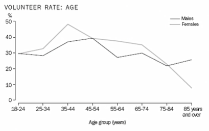

::: details Sample Answer

This line chart shows information about volunteer rate by age. If you look at males, the highest number can be found in the 45–54 age group, which is around 40%, and the lowest figure is located in the 18–24 age group, which is about 30%. If you look at females, the highest number is for the 35–44 age group, and the number is around 50%. Furthermore, female volunteer rates are generally higher than those of males in most age groups. In summary, this chart uses real data to describe volunteer rate by age.

:::

### 134. Nuclear Power Generation in Europe #031362 降频区 困难

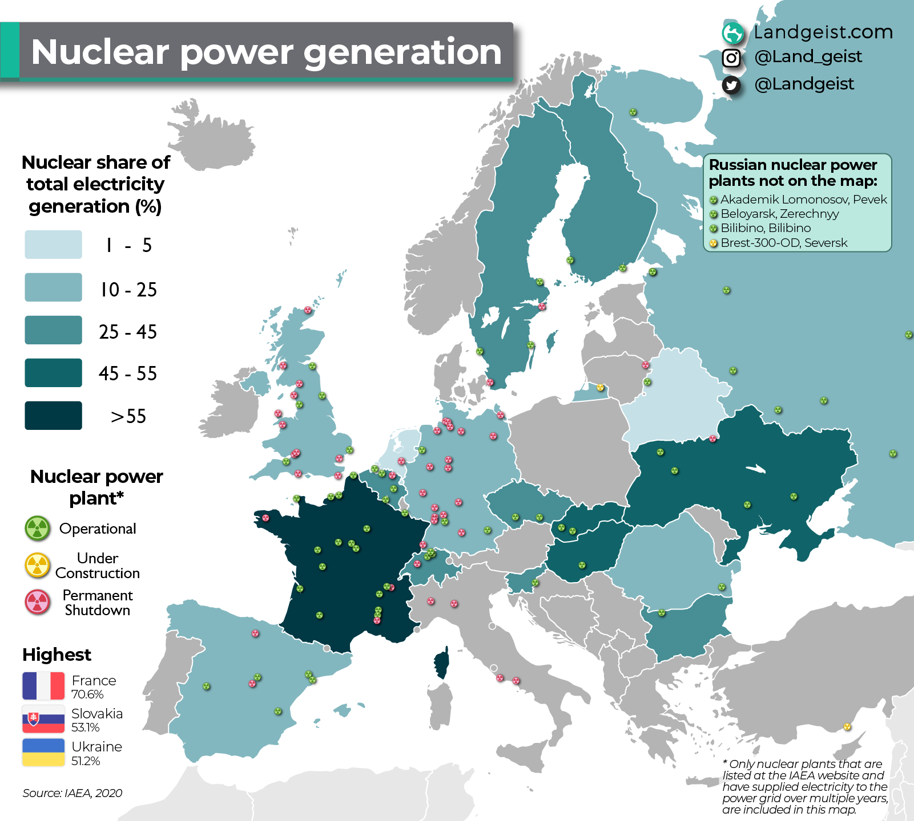

::: details Sample Answer

This map shows information about nuclear power generation in Europe. Firstly, the highest number can be found in France, which is above 55%. Secondly, the second highest number is located in Slovakia and Ukraine, which is between 45% and 55%. Thirdly, the lowest figure is for Belarus and the Netherlands, and the number is around 1–5%. Furthermore, higher nuclear power shares are mainly concentrated in Western and Eastern Europe. In summary, this chart uses real data to describe nuclear power generation in Europe.

:::
