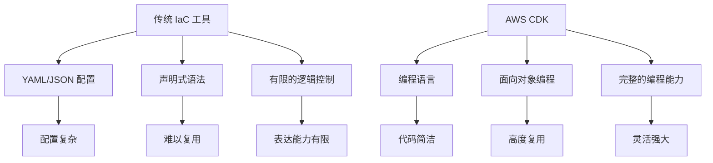
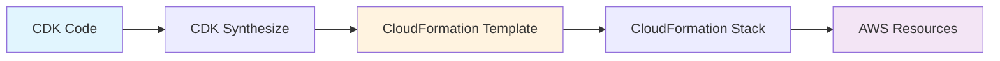
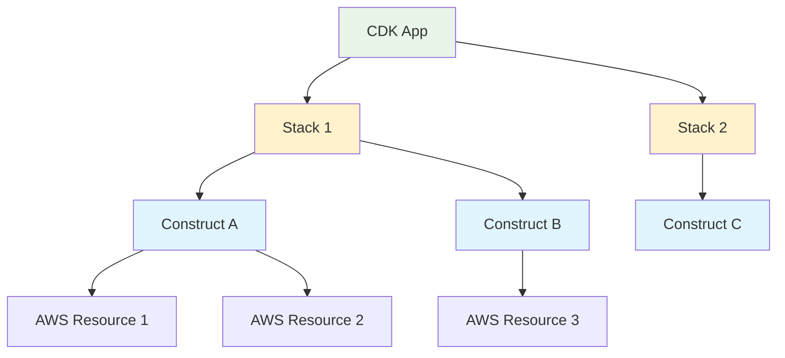
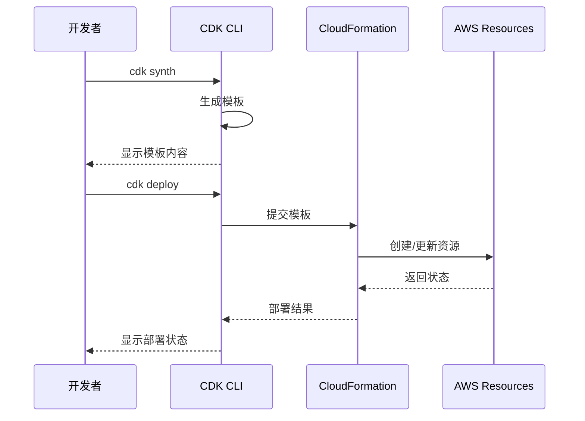

# 第 1 章：CDK 概述与环境准备

::: tip 学习目标
- 理解什么是 AWS CDK 以及它解决的问题
- 了解 CDK 与 CloudFormation 的关系
- 掌握 CDK 开发环境的搭建
- 完成第一个 CDK 应用的创建
:::

## 知识点总结

### 什么是 AWS CDK

AWS Cloud Development Kit (CDK) 是一个开源软件开发框架，用于使用熟悉的编程语言来定义云基础设施资源。CDK 支持 TypeScript、JavaScript、Python、Java、C#/.Net 和 Go。

::: note CDK 的核心优势
- **类型安全**：编译时检查，减少运行时错误
- **IDE 支持**：代码补全、重构、调试等
- **代码复用**：通过函数、类、包来复用基础设施代码
- **版本控制**：使用 Git 等工具管理基础设施变更
- **测试支持**：可以编写单元测试和集成测试
:::

### CDK 与传统 IaC 工具对比



### CDK 与 CloudFormation 的关系



CDK 实际上是 CloudFormation 的高级抽象，最终会编译成 CloudFormation 模板进行部署。

## 环境搭建

### 系统要求

| 工具 | 版本要求 | 说明 |
|------|----------|------|
| Node.js | >= 18.x | CDK CLI 运行环境 |
| Python | >= 3.8 | Python CDK 应用开发 |
| AWS CLI | >= 2.x | AWS 访问凭证配置 |
| CDK CLI | 最新版本 | CDK 命令行工具 |

### 安装步骤

```python
# 1. 安装 Node.js 和 npm (需要先安装 Node.js)

# 2. 安装 AWS CLI
# pip install awscli

# 3. 配置 AWS 凭证
# aws configure

# 4. 安装 CDK CLI
# npm install -g aws-cdk

# 5. 验证安装
# cdk --version

# 6. 安装 Python CDK 库
# pip install aws-cdk-lib constructs
```

::: warning 注意事项
- CDK CLI 需要 Node.js 环境，即使你使用 Python 编写 CDK 应用
- 确保 AWS 凭证配置正确，CDK 需要相应的 AWS 权限
- 建议使用虚拟环境管理 Python 依赖
:::

## 第一个 CDK 应用

### 创建新项目

```python
# 创建新的 CDK 应用
# cdk init app --language python

# 项目结构
# my-cdk-app/
# ├── app.py                 # 应用入口文件
# ├── cdk.json              # CDK 配置文件
# ├── requirements.txt       # Python 依赖
# └── my_cdk_app/
#     ├── __init__.py
#     └── my_cdk_app_stack.py  # Stack 定义文件
```

### Hello World 示例

```python
#!/usr/bin/env python3
# app.py - 应用入口文件
import aws_cdk as cdk
from my_cdk_app.my_cdk_app_stack import MyCdkAppStack

app = cdk.App()
MyCdkAppStack(app, "MyCdkAppStack")

app.synth()
```

```python
# my_cdk_app/my_cdk_app_stack.py - Stack 定义
from aws_cdk import (
    Duration,
    Stack,
    aws_s3 as s3,
)
from constructs import Construct

class MyCdkAppStack(Stack):
    def __init__(self, scope: Construct, construct_id: str, **kwargs) -> None:
        super().__init__(scope, construct_id, **kwargs)

        # 创建一个简单的 S3 存储桶
        bucket = s3.Bucket(
            self, 
            "MyFirstBucket",
            bucket_name="my-first-cdk-bucket-unique-name",
            versioned=True,  # 启用版本控制
            removal_policy=cdk.RemovalPolicy.DESTROY  # 用于开发环境
        )
        
        # 输出存储桶名称
        cdk.CfnOutput(
            self,
            "BucketName",
            value=bucket.bucket_name,
            description="Name of the S3 bucket"
        )
```

### CDK 应用架构



### 常用 CDK 命令

```python
# 查看可用命令
# cdk --help

# 列出所有 stacks
# cdk list

# 合成 CloudFormation 模板
# cdk synth

# 查看将要部署的更改
# cdk diff

# 部署 stack
# cdk deploy

# 销毁 stack
# cdk destroy

# 初始化 Bootstrap
# cdk bootstrap
```

::: tip Bootstrap 说明
Bootstrap 是 CDK 的初始化过程，会在 AWS 账户中创建必要的基础设施资源（如 S3 存储桶用于存储部署资产）。每个 AWS 账户/区域组合只需要执行一次。
:::

### 部署流程



### 实践练习

1. **安装环境**：按照上述步骤安装 CDK 开发环境
2. **创建项目**：使用 `cdk init` 创建第一个 Python CDK 应用
3. **修改代码**：在 Stack 中添加一个 S3 存储桶
4. **合成模板**：使用 `cdk synth` 查看生成的 CloudFormation 模板
5. **部署应用**：使用 `cdk deploy` 部署到 AWS
6. **验证结果**：在 AWS 控制台中查看创建的资源
7. **清理资源**：使用 `cdk destroy` 清理创建的资源

::: warning 成本提醒
即使是简单的 S3 存储桶，也可能产生少量费用。完成练习后记得及时清理资源。
:::

## 故障排除

### 常见问题

| 问题 | 解决方案 |
|------|----------|
| `cdk command not found` | 确保正确安装了 CDK CLI |
| `AWS credentials not configured` | 运行 `aws configure` 配置凭证 |
| `Bootstrap required` | 运行 `cdk bootstrap` 初始化环境 |
| 部署权限不足 | 检查 IAM 用户权限 |

### 调试技巧

```python
# 1. 使用 synth 命令查看生成的模板
# cdk synth --output ./cdk.out

# 2. 使用 diff 命令查看变更
# cdk diff

# 3. 启用详细日志
# cdk deploy --verbose

# 4. 指定具体的 stack
# cdk deploy MySpecificStack
```

这一章为 CDK 学习奠定了基础，确保你理解了 CDK 的基本概念并成功搭建了开发环境。