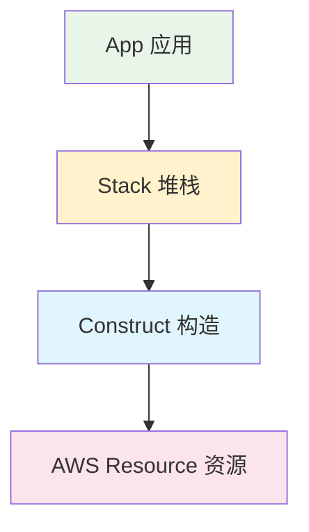
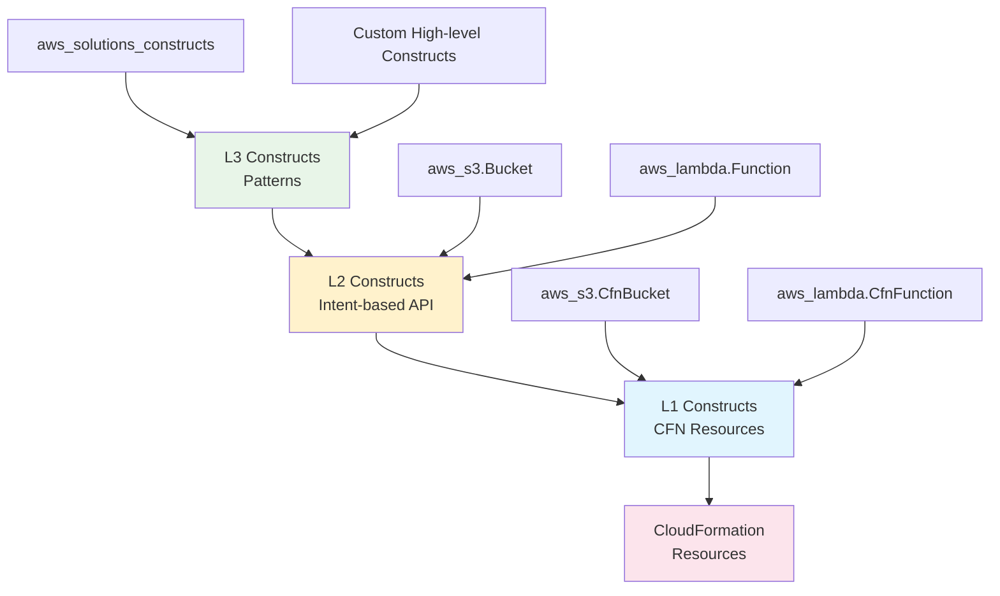
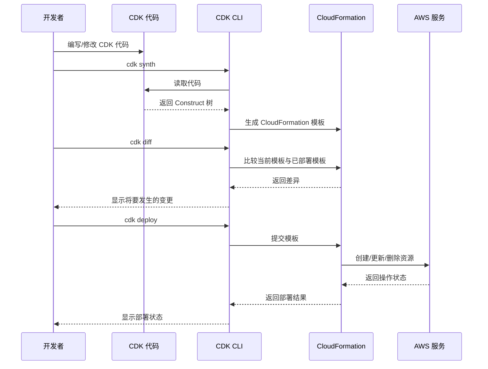

::: tip 学习目标
- 掌握 App、Stack、Construct 三大核心概念
- 理解 CDK 的层级结构和组织方式
- 学会使用 CDK CLI 基本命令
- 了解 CDK 的生命周期和部署流程
:::

## 核心概念详解

### CDK 三大核心概念



#### 1. App（应用）

App 是 CDK 应用的根容器，代表整个 CDK 应用程序。

```python
#!/usr/bin/env python3
import aws_cdk as cdk
from my_app.vpc_stack import VpcStack
from my_app.database_stack import DatabaseStack
from my_app.web_stack import WebStack

# 创建 CDK 应用
app = cdk.App()

# 在应用中定义多个 Stack
vpc_stack = VpcStack(app, "VpcStack")
db_stack = DatabaseStack(app, "DatabaseStack", vpc=vpc_stack.vpc)
web_stack = WebStack(app, "WebStack", vpc=vpc_stack.vpc, database=db_stack.database)

# 合成应用
app.synth()
```

#### 2. Stack（堆栈）

Stack 是部署的基本单位，对应一个 CloudFormation 堆栈。

```python
from aws_cdk import Stack, Environment
from constructs import Construct
import aws_cdk as cdk

class MyStack(Stack):
    def __init__(self, scope: Construct, construct_id: str, **kwargs) -> None:
        super().__init__(scope, construct_id, **kwargs)
        
        # Stack 属性
        self.stack_name = "MyApplicationStack"
        self.description = "This stack contains my web application resources"
        
        # 在这里定义你的资源构造
        # self.create_networking()
        # self.create_compute()
        # self.create_storage()
        
    @property
    def availability_zones(self):
        """获取可用区"""
        return self.get_azs()
        
    @property 
    def region(self):
        """获取当前区域"""
        return self.region

# 使用环境配置的 Stack
production_env = Environment(
    account="123456789012", 
    region="us-east-1"
)

stack = MyStack(app, "ProductionStack", env=production_env)
```

#### 3. Construct（构造）

Construct 是 CDK 的基本构建块，表示云组件。

```python
from constructs import Construct
from aws_cdk import (
    aws_s3 as s3,
    aws_iam as iam,
    RemovalPolicy
)

class S3BucketWithPolicy(Construct):
    """自定义构造：带有策略的 S3 存储桶"""
    
    def __init__(self, scope: Construct, construct_id: str, 
                 bucket_name: str = None, **kwargs) -> None:
        super().__init__(scope, construct_id, **kwargs)
        
        # 创建 S3 存储桶
        self.bucket = s3.Bucket(
            self,
            "Bucket",
            bucket_name=bucket_name,
            versioned=True,
            encryption=s3.BucketEncryption.S3_MANAGED,
            removal_policy=RemovalPolicy.DESTROY,
            auto_delete_objects=True
        )
        
        # 创建 IAM 策略
        self.read_policy = iam.PolicyStatement(
            effect=iam.Effect.ALLOW,
            actions=["s3:GetObject", "s3:GetObjectVersion"],
            resources=[f"{self.bucket.bucket_arn}/*"],
            principals=[iam.ServicePrincipal("lambda.amazonaws.com")]
        )
        
        # 应用策略到存储桶
        self.bucket.add_to_resource_policy(self.read_policy)
    
    @property
    def bucket_name(self) -> str:
        """返回存储桶名称"""
        return self.bucket.bucket_name
    
    @property
    def bucket_arn(self) -> str:
        """返回存储桶 ARN"""
        return self.bucket.bucket_arn

# 在 Stack 中使用自定义构造
class MyApplicationStack(Stack):
    def __init__(self, scope: Construct, construct_id: str, **kwargs) -> None:
        super().__init__(scope, construct_id, **kwargs)
        
        # 使用自定义构造
        data_bucket = S3BucketWithPolicy(
            self, 
            "DataBucket",
            bucket_name="my-app-data-bucket"
        )
        
        logs_bucket = S3BucketWithPolicy(
            self,
            "LogsBucket", 
            bucket_name="my-app-logs-bucket"
        )
```

## CDK 层级结构

### Construct 层级



### 层级详解

| 层级 | 名称 | 特点 | 使用场景 |
|------|------|------|----------|
| L1 | CFN Resources | 1:1 映射 CloudFormation | 需要精确控制资源属性 |
| L2 | Intent-based API | 封装最佳实践 | 日常开发推荐使用 |
| L3 | Patterns | 多资源组合 | 快速实现常见架构 |

### 示例：不同层级的 S3 存储桶创建

```python
from aws_cdk import (
    Stack,
    aws_s3 as s3,
    aws_s3_deployment as s3deploy,
    RemovalPolicy
)
from constructs import Construct

class S3ExamplesStack(Stack):
    def __init__(self, scope: Construct, construct_id: str, **kwargs) -> None:
        super().__init__(scope, construct_id, **kwargs)
        
        # L1 Construct - 直接使用 CloudFormation 资源
        l1_bucket = s3.CfnBucket(
            self,
            "L1Bucket",
            bucket_name="my-l1-bucket",
            versioning_configuration={
                "status": "Enabled"
            },
            public_access_block_configuration={
                "blockPublicAcls": True,
                "blockPublicPolicy": True,
                "ignorePublicAcls": True,
                "restrictPublicBuckets": True
            }
        )
        
        # L2 Construct - 高级 API，包含最佳实践
        l2_bucket = s3.Bucket(
            self,
            "L2Bucket", 
            bucket_name="my-l2-bucket",
            versioned=True,  # 简化的版本控制设置
            block_public_access=s3.BlockPublicAccess.BLOCK_ALL,  # 简化的访问控制
            encryption=s3.BucketEncryption.S3_MANAGED,
            removal_policy=RemovalPolicy.DESTROY,
            auto_delete_objects=True
        )
        
        # L3 Construct - 模式/组合构造（需要安装额外包）
        # 这里展示一个自定义的 L3 构造示例
        website_bucket = StaticWebsite(
            self,
            "StaticWebsite",
            domain_name="example.com"
        )

class StaticWebsite(Construct):
    """L3 构造示例：静态网站托管"""
    
    def __init__(self, scope: Construct, construct_id: str, 
                 domain_name: str, **kwargs) -> None:
        super().__init__(scope, construct_id, **kwargs)
        
        # 创建 S3 存储桶用于托管
        self.bucket = s3.Bucket(
            self,
            "WebsiteBucket",
            website_index_document="index.html",
            website_error_document="error.html",
            public_read_access=True,
            removal_policy=RemovalPolicy.DESTROY,
            auto_delete_objects=True
        )
        
        # 部署网站内容
        s3deploy.BucketDeployment(
            self,
            "DeployWebsite",
            sources=[s3deploy.Source.asset("./website-dist")],
            destination_bucket=self.bucket
        )
    
    @property
    def url(self) -> str:
        return self.bucket.bucket_website_url
```

## CDK 项目结构

### 典型项目结构

```
my-cdk-app/
├── app.py                  # 应用入口点
├── cdk.json               # CDK 配置
├── requirements.txt       # Python 依赖
├── requirements-dev.txt   # 开发依赖  
├── README.md
├── .gitignore
├── tests/                 # 测试目录
│   ├── unit/
│   └── integration/
└── my_cdk_app/           # 应用包
    ├── __init__.py
    ├── stacks/           # Stack 定义
    │   ├── __init__.py
    │   ├── vpc_stack.py
    │   ├── database_stack.py
    │   └── web_stack.py
    ├── constructs/       # 自定义构造
    │   ├── __init__.py
    │   └── custom_constructs.py
    └── config/           # 配置文件
        ├── __init__.py
        └── environments.py
```

### 模块化的应用组织

```python
# app.py
#!/usr/bin/env python3
import aws_cdk as cdk
from my_cdk_app.config.environments import get_environment_config
from my_cdk_app.stacks.vpc_stack import VpcStack
from my_cdk_app.stacks.database_stack import DatabaseStack
from my_cdk_app.stacks.web_stack import WebStack

app = cdk.App()

# 从上下文获取环境配置
env_name = app.node.try_get_context("env") or "dev"
env_config = get_environment_config(env_name)

# 创建 VPC Stack
vpc_stack = VpcStack(
    app, 
    f"VpcStack-{env_name}",
    env_config=env_config,
    env=env_config.cdk_environment
)

# 创建数据库 Stack，依赖 VPC
database_stack = DatabaseStack(
    app,
    f"DatabaseStack-{env_name}",
    vpc=vpc_stack.vpc,
    env_config=env_config,
    env=env_config.cdk_environment
)

# 创建 Web Stack，依赖 VPC 和数据库
web_stack = WebStack(
    app,
    f"WebStack-{env_name}",
    vpc=vpc_stack.vpc,
    database=database_stack.database,
    env_config=env_config,
    env=env_config.cdk_environment
)

app.synth()
```

```python
# my_cdk_app/config/environments.py
from dataclasses import dataclass
from aws_cdk import Environment

@dataclass
class EnvironmentConfig:
    environment_name: str
    account_id: str
    region: str
    vpc_cidr: str
    database_instance_type: str
    web_instance_count: int
    
    @property
    def cdk_environment(self) -> Environment:
        return Environment(account=self.account_id, region=self.region)

def get_environment_config(env_name: str) -> EnvironmentConfig:
    """根据环境名称获取配置"""
    configs = {
        "dev": EnvironmentConfig(
            environment_name="development",
            account_id="111111111111",
            region="us-west-2",
            vpc_cidr="10.0.0.0/16",
            database_instance_type="db.t3.micro",
            web_instance_count=1
        ),
        "staging": EnvironmentConfig(
            environment_name="staging", 
            account_id="222222222222",
            region="us-west-2",
            vpc_cidr="10.1.0.0/16",
            database_instance_type="db.t3.small",
            web_instance_count=2
        ),
        "prod": EnvironmentConfig(
            environment_name="production",
            account_id="333333333333",
            region="us-east-1", 
            vpc_cidr="10.2.0.0/16",
            database_instance_type="db.r5.large",
            web_instance_count=3
        )
    }
    
    if env_name not in configs:
        raise ValueError(f"Unknown environment: {env_name}")
    
    return configs[env_name]
```

## CDK 生命周期

### 开发到部署流程



### CDK 命令详解

```python
# 项目初始化
# cdk init app --language python

# 查看所有可用的 stacks
# cdk list

# 合成指定 stack 的模板
# cdk synth MyStack --output ./cdk.out

# 查看将要部署的更改
# cdk diff MyStack

# 部署单个 stack
# cdk deploy MyStack

# 部署所有 stacks
# cdk deploy --all

# 带参数部署
# cdk deploy --context env=prod

# 销毁 stack
# cdk destroy MyStack

# 查看 stack 的元数据
# cdk metadata MyStack

# 列出构造树
# cdk tree

# 初始化引导环境
# cdk bootstrap aws://ACCOUNT-NUMBER/REGION
```

### Context 和配置

```python
# cdk.json - CDK 项目配置文件
{
  "app": "python app.py",
  "watch": {
    "include": ["**"],
    "exclude": [
      "README.md",
      "cdk*.json",
      "requirements*.txt",
      "source.bat",
      "**/__pycache__",
      "**/*.pyc"
    ]
  },
  "context": {
    "@aws-cdk/aws-lambda:recognizeLayerVersion": true,
    "@aws-cdk/core:checkSecretUsage": true,
    "@aws-cdk/core:target-partitions": ["aws", "aws-cn"],
    
    // 自定义上下文值
    "vpc-cidr": "10.0.0.0/16",
    "enable-dns-hostnames": true,
    "database-backup-retention": 7
  },
  "feature_flags": {
    "@aws-cdk/core:enableStackNameDuplicates": true,
    "@aws-cdk/core:enableStringConsolidation": true
  }
}
```

```python
# 在代码中使用 context
from aws_cdk import Stack
from constructs import Construct

class MyStack(Stack):
    def __init__(self, scope: Construct, construct_id: str, **kwargs) -> None:
        super().__init__(scope, construct_id, **kwargs)
        
        # 获取 context 值
        vpc_cidr = self.node.try_get_context("vpc-cidr")
        enable_dns = self.node.try_get_context("enable-dns-hostnames")
        backup_retention = self.node.try_get_context("database-backup-retention")
        
        # 使用环境变量覆盖 context（命令行传入）
        environment = self.node.try_get_context("environment") or "dev"
        
        print(f"Deploying to environment: {environment}")
        print(f"Using VPC CIDR: {vpc_cidr}")
```

## 最佳实践

### 1. Stack 设计原则

```python
# ✅ 好的实践：按照功能和生命周期分离 Stack
class NetworkStack(Stack):
    """网络基础设施 - 生命周期长，变更少"""
    pass

class DatabaseStack(Stack): 
    """数据库层 - 生命周期长，但配置可能变更"""
    pass

class ApplicationStack(Stack):
    """应用层 - 频繁部署和更新"""
    pass

# ❌ 避免：把所有资源放在一个巨大的 Stack 中
class MonolithStack(Stack):
    """不推荐：包含所有资源的巨型 Stack"""
    pass
```

### 2. 资源命名规范

```python
class NamingConventionStack(Stack):
    def __init__(self, scope: Construct, construct_id: str, 
                 env_name: str, **kwargs) -> None:
        super().__init__(scope, construct_id, **kwargs)
        
        # 使用一致的命名规范
        self.app_name = "myapp"
        
        # S3 存储桶命名
        bucket = s3.Bucket(
            self,
            "DataBucket",
            bucket_name=f"{self.app_name}-{env_name}-data-{self.account}-{self.region}"
        )
        
        # Lambda 函数命名
        function = lambda_.Function(
            self,
            "ProcessorFunction", 
            function_name=f"{self.app_name}-{env_name}-processor",
            # ... 其他配置
        )
```

### 3. 依赖管理

```python
# 通过构造函数明确依赖关系
class WebStack(Stack):
    def __init__(self, scope: Construct, construct_id: str,
                 vpc: ec2.Vpc,  # 显式依赖
                 database: rds.Database,  # 显式依赖
                 **kwargs) -> None:
        super().__init__(scope, construct_id, **kwargs)
        
        # 使用传入的依赖
        self.vpc = vpc
        self.database = database
        
        # 创建依赖于 VPC 和数据库的资源
        self.create_application_resources()
    
    def create_application_resources(self):
        # 在这里创建应用资源
        pass
```

这一章深入介绍了 CDK 的核心架构概念，为后续的实际开发奠定了坚实基础。理解这些概念对于构建可维护、可扩展的 CDK 应用至关重要。