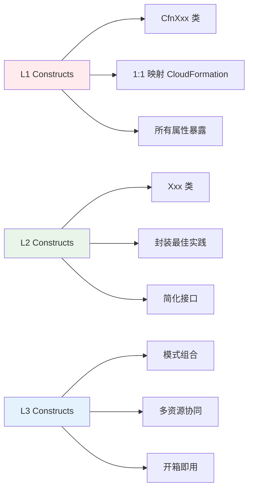

::: tip 学习目标
- 掌握 L1、L2、L3 Constructs 的区别和使用场景
- 学会创建和配置基础 AWS 资源（S3、Lambda、IAM）
- 理解资源间的依赖关系
- 掌握 CDK 中的参数传递和配置管理
:::

## Constructs 层级深入理解

### 三层架构对比



### 选择合适的 Construct 层级

| 场景 | 推荐层级 | 原因 |
|------|----------|------|
| 快速原型开发 | L3 | 减少代码量，快速验证 |
| 生产环境标准配置 | L2 | 平衡易用性和控制力 |
| 特殊配置需求 | L1 | 完全控制所有属性 |
| 遗留系统迁移 | L1 | 精确映射现有配置 |

## S3 存储桶完整示例

### L1 层级：完全控制

```python
from aws_cdk import (
    Stack,
    aws_s3 as s3,
    CfnOutput
)
from constructs import Construct

class S3L1Stack(Stack):
    def __init__(self, scope: Construct, construct_id: str, **kwargs) -> None:
        super().__init__(scope, construct_id, **kwargs)
        
        # L1 构造：直接使用 CloudFormation 资源
        bucket_l1 = s3.CfnBucket(
            self,
            "MyBucketL1",
            bucket_name="my-app-data-bucket-l1",
            # 版本控制配置
            versioning_configuration=s3.CfnBucket.VersioningConfigurationProperty(
                status="Enabled"
            ),
            # 加密配置
            bucket_encryption=s3.CfnBucket.BucketEncryptionProperty(
                server_side_encryption_configuration=[
                    s3.CfnBucket.ServerSideEncryptionRuleProperty(
                        server_side_encryption_by_default=s3.CfnBucket.ServerSideEncryptionByDefaultProperty(
                            sse_algorithm="AES256"
                        )
                    )
                ]
            ),
            # 公共访问阻止
            public_access_block_configuration=s3.CfnBucket.PublicAccessBlockConfigurationProperty(
                block_public_acls=True,
                block_public_policy=True,
                ignore_public_acls=True,
                restrict_public_buckets=True
            ),
            # 生命周期规则
            lifecycle_configuration=s3.CfnBucket.LifecycleConfigurationProperty(
                rules=[
                    s3.CfnBucket.RuleProperty(
                        id="DeleteOldVersions",
                        status="Enabled",
                        noncurrent_version_expiration=s3.CfnBucket.NoncurrentVersionExpirationProperty(
                            noncurrent_days=30
                        )
                    )
                ]
            ),
            # 通知配置
            notification_configuration=s3.CfnBucket.NotificationConfigurationProperty(
                # 可以配置 Lambda、SQS、SNS 通知
            )
        )
        
        CfnOutput(self, "BucketNameL1", value=bucket_l1.ref)
```

### L2 层级：最佳实践

```python
from aws_cdk import (
    Stack,
    aws_s3 as s3,
    aws_s3_notifications as s3n,
    aws_lambda as lambda_,
    RemovalPolicy,
    Duration,
    CfnOutput
)
from constructs import Construct

class S3L2Stack(Stack):
    def __init__(self, scope: Construct, construct_id: str, **kwargs) -> None:
        super().__init__(scope, construct_id, **kwargs)
        
        # L2 构造：简化的 API，包含最佳实践
        bucket_l2 = s3.Bucket(
            self,
            "MyBucketL2",
            bucket_name="my-app-data-bucket-l2",
            # 版本控制（简化）
            versioned=True,
            # 加密（简化）
            encryption=s3.BucketEncryption.S3_MANAGED,
            # 公共访问（简化）
            block_public_access=s3.BlockPublicAccess.BLOCK_ALL,
            # 自动删除对象（用于开发环境）
            auto_delete_objects=True,
            removal_policy=RemovalPolicy.DESTROY,
            # 生命周期规则（简化）
            lifecycle_rules=[
                s3.LifecycleRule(
                    id="delete-old-versions",
                    enabled=True,
                    noncurrent_version_expiration=Duration.days(30),
                    abort_incomplete_multipart_upload_after=Duration.days(1)
                )
            ],
            # CORS 配置
            cors=[
                s3.CorsRule(
                    allowed_methods=[s3.HttpMethods.GET, s3.HttpMethods.POST],
                    allowed_origins=["https://example.com"],
                    allowed_headers=["*"],
                    max_age=3000
                )
            ]
        )
        
        # 创建处理函数
        processor_function = lambda_.Function(
            self,
            "S3Processor",
            runtime=lambda_.Runtime.PYTHON_3_9,
            handler="index.handler",
            code=lambda_.Code.from_inline("""
def handler(event, context):
    for record in event['Records']:
        bucket = record['s3']['bucket']['name']
        key = record['s3']['object']['key']
        print(f"File {key} uploaded to bucket {bucket}")
    return {'statusCode': 200}
            """)
        )
        
        # 添加 S3 事件通知（L2 的优势：简单的 API）
        bucket_l2.add_event_notification(
            s3.EventType.OBJECT_CREATED,
            s3n.LambdaDestination(processor_function),
            s3.NotificationKeyFilter(prefix="uploads/", suffix=".jpg")
        )
        
        # 授予 Lambda 读取权限
        bucket_l2.grant_read(processor_function)
        
        CfnOutput(self, "BucketNameL2", value=bucket_l2.bucket_name)
        CfnOutput(self, "BucketArnL2", value=bucket_l2.bucket_arn)
```

### L3 层级：模式组合

```python
from constructs import Construct
from aws_cdk import (
    Stack,
    aws_s3 as s3,
    aws_s3_deployment as s3deploy,
    aws_cloudfront as cloudfront,
    aws_cloudfront_origins as origins,
    RemovalPolicy,
    CfnOutput
)

class StaticWebsiteConstruct(Construct):
    """L3 构造：静态网站托管模式"""
    
    def __init__(self, scope: Construct, construct_id: str,
                 domain_name: str = None, **kwargs) -> None:
        super().__init__(scope, construct_id, **kwargs)
        
        # 网站内容存储桶
        self.website_bucket = s3.Bucket(
            self,
            "WebsiteBucket",
            # 启用静态网站托管
            website_index_document="index.html",
            website_error_document="error.html",
            # 公共读访问
            public_read_access=True,
            block_public_access=s3.BlockPublicAccess(
                block_public_acls=False,
                block_public_policy=False,
                ignore_public_acls=False,
                restrict_public_buckets=False
            ),
            removal_policy=RemovalPolicy.DESTROY,
            auto_delete_objects=True
        )
        
        # 日志存储桶
        self.logs_bucket = s3.Bucket(
            self,
            "LogsBucket",
            removal_policy=RemovalPolicy.DESTROY,
            auto_delete_objects=True
        )
        
        # CloudFront 分发
        self.distribution = cloudfront.Distribution(
            self,
            "WebsiteDistribution",
            default_behavior=cloudfront.BehaviorOptions(
                origin=origins.S3Origin(self.website_bucket),
                viewer_protocol_policy=cloudfront.ViewerProtocolPolicy.REDIRECT_TO_HTTPS,
                cache_policy=cloudfront.CachePolicy.CACHING_OPTIMIZED
            ),
            # 默认根对象
            default_root_object="index.html",
            # 错误页面
            error_responses=[
                cloudfront.ErrorResponse(
                    http_status=404,
                    response_http_status=404,
                    response_page_path="/error.html"
                )
            ],
            # 访问日志
            enable_logging=True,
            log_bucket=self.logs_bucket,
            log_file_prefix="access-logs/"
        )
    
    @property
    def bucket_name(self) -> str:
        return self.website_bucket.bucket_name
    
    @property
    def distribution_domain_name(self) -> str:
        return self.distribution.distribution_domain_name
    
    @property
    def website_url(self) -> str:
        return f"https://{self.distribution.distribution_domain_name}"

class S3L3Stack(Stack):
    def __init__(self, scope: Construct, construct_id: str, **kwargs) -> None:
        super().__init__(scope, construct_id, **kwargs)
        
        # 使用 L3 构造
        website = StaticWebsiteConstruct(
            self,
            "MyWebsite",
            domain_name="example.com"
        )
        
        # 部署网站内容（如果存在 website-dist 目录）
        # s3deploy.BucketDeployment(
        #     self,
        #     "DeployWebsite",
        #     sources=[s3deploy.Source.asset("./website-dist")],
        #     destination_bucket=website.website_bucket,
        #     distribution=website.distribution,
        #     distribution_paths=["/*"]
        # )
        
        CfnOutput(self, "WebsiteURL", value=website.website_url)
        CfnOutput(self, "BucketName", value=website.bucket_name)
```

## Lambda 函数完整示例

### 基础 Lambda 函数

```python
from aws_cdk import (
    Stack,
    aws_lambda as lambda_,
    aws_iam as iam,
    aws_logs as logs,
    Duration,
    CfnOutput
)
from constructs import Construct

class LambdaStack(Stack):
    def __init__(self, scope: Construct, construct_id: str, **kwargs) -> None:
        super().__init__(scope, construct_id, **kwargs)
        
        # 基础 Lambda 函数
        basic_function = lambda_.Function(
            self,
            "BasicFunction",
            runtime=lambda_.Runtime.PYTHON_3_9,
            handler="index.handler",
            code=lambda_.Code.from_inline("""
import json
import boto3

def handler(event, context):
    print(f"Event: {json.dumps(event)}")
    
    return {
        'statusCode': 200,
        'headers': {
            'Content-Type': 'application/json',
            'Access-Control-Allow-Origin': '*'
        },
        'body': json.dumps({
            'message': 'Hello from Lambda!',
            'requestId': context.aws_request_id
        })
    }
            """),
            timeout=Duration.seconds(30),
            memory_size=256,
            # 环境变量
            environment={
                "ENV": "production",
                "LOG_LEVEL": "INFO"
            },
            # 日志保留期
            log_retention=logs.RetentionDays.ONE_WEEK,
            # 描述
            description="Basic Lambda function example"
        )
        
        # 从文件部署的 Lambda 函数
        file_function = lambda_.Function(
            self,
            "FileFunction",
            runtime=lambda_.Runtime.PYTHON_3_9,
            handler="app.lambda_handler",
            code=lambda_.Code.from_asset("lambda"),  # 从本地 lambda 目录
            timeout=Duration.minutes(1),
            memory_size=512,
            environment={
                "BUCKET_NAME": "my-data-bucket"
            }
        )
        
        # 分层函数（使用 Lambda Layer）
        # 创建 Layer
        shared_layer = lambda_.LayerVersion(
            self,
            "SharedLayer",
            code=lambda_.Code.from_asset("layers/shared"),  # 包含共享库
            compatible_runtimes=[lambda_.Runtime.PYTHON_3_9],
            description="Shared utilities layer"
        )
        
        layered_function = lambda_.Function(
            self,
            "LayeredFunction", 
            runtime=lambda_.Runtime.PYTHON_3_9,
            handler="index.handler",
            code=lambda_.Code.from_asset("lambda/layered"),
            layers=[shared_layer],
            timeout=Duration.minutes(2)
        )
        
        CfnOutput(self, "BasicFunctionArn", value=basic_function.function_arn)
        CfnOutput(self, "FileFunctionName", value=file_function.function_name)
```

### Lambda 权限和集成

```python
from aws_cdk import (
    Stack,
    aws_lambda as lambda_,
    aws_s3 as s3,
    aws_dynamodb as dynamodb,
    aws_iam as iam,
    aws_apigateway as apigw,
    aws_events as events,
    aws_events_targets as targets,
    Duration
)
from constructs import Construct

class LambdaIntegrationStack(Stack):
    def __init__(self, scope: Construct, construct_id: str, **kwargs) -> None:
        super().__init__(scope, construct_id, **kwargs)
        
        # 创建 DynamoDB 表
        table = dynamodb.Table(
            self,
            "DataTable",
            table_name="user-data",
            partition_key=dynamodb.Attribute(
                name="id",
                type=dynamodb.AttributeType.STRING
            ),
            billing_mode=dynamodb.BillingMode.PAY_PER_REQUEST,
            removal_policy=cdk.RemovalPolicy.DESTROY
        )
        
        # 创建 S3 存储桶
        bucket = s3.Bucket(
            self,
            "DataBucket",
            removal_policy=cdk.RemovalPolicy.DESTROY,
            auto_delete_objects=True
        )
        
        # Lambda 函数
        processor_function = lambda_.Function(
            self,
            "DataProcessor",
            runtime=lambda_.Runtime.PYTHON_3_9,
            handler="processor.handler",
            code=lambda_.Code.from_inline("""
import json
import boto3
import os

dynamodb = boto3.resource('dynamodb')
s3 = boto3.client('s3')

def handler(event, context):
    table_name = os.environ['TABLE_NAME']
    bucket_name = os.environ['BUCKET_NAME']
    
    table = dynamodb.Table(table_name)
    
    # 处理 API Gateway 请求
    if 'httpMethod' in event:
        if event['httpMethod'] == 'POST':
            body = json.loads(event['body'])
            # 写入 DynamoDB
            table.put_item(Item=body)
            return {
                'statusCode': 200,
                'body': json.dumps({'message': 'Data saved'})
            }
    
    # 处理 S3 事件
    if 'Records' in event:
        for record in event['Records']:
            if 's3' in record:
                bucket = record['s3']['bucket']['name']
                key = record['s3']['object']['key']
                print(f"Processing file {key} from bucket {bucket}")
    
    return {'statusCode': 200}
            """),
            environment={
                "TABLE_NAME": table.table_name,
                "BUCKET_NAME": bucket.bucket_name
            },
            timeout=Duration.minutes(1)
        )
        
        # 授予权限
        table.grant_read_write_data(processor_function)
        bucket.grant_read_write(processor_function)
        
        # API Gateway 集成
        api = apigw.RestApi(
            self,
            "DataAPI",
            rest_api_name="Data Processing API",
            description="API for data processing"
        )
        
        # 添加资源和方法
        data_resource = api.root.add_resource("data")
        data_resource.add_method(
            "POST",
            apigw.LambdaIntegration(processor_function),
            authorization_type=apigw.AuthorizationType.NONE
        )
        
        # S3 事件触发
        bucket.add_event_notification(
            s3.EventType.OBJECT_CREATED,
            s3n.LambdaDestination(processor_function),
            s3.NotificationKeyFilter(prefix="incoming/")
        )
        
        # 定时触发（EventBridge）
        schedule_rule = events.Rule(
            self,
            "ScheduleRule",
            schedule=events.Schedule.cron(hour="2", minute="0"),  # 每天凌晨2点
            description="Daily processing trigger"
        )
        
        schedule_rule.add_target(targets.LambdaFunction(processor_function))
```

## IAM 角色和权限

### 精确权限控制

```python
from aws_cdk import (
    Stack,
    aws_iam as iam,
    aws_s3 as s3,
    aws_lambda as lambda_,
    aws_dynamodb as dynamodb
)
from constructs import Construct

class IAMExamplesStack(Stack):
    def __init__(self, scope: Construct, construct_id: str, **kwargs) -> None:
        super().__init__(scope, construct_id, **kwargs)
        
        # 创建自定义 IAM 角色
        lambda_role = iam.Role(
            self,
            "LambdaExecutionRole",
            assumed_by=iam.ServicePrincipal("lambda.amazonaws.com"),
            role_name="MyLambdaRole",
            description="Custom role for Lambda function",
            # 基础执行权限
            managed_policies=[
                iam.ManagedPolicy.from_aws_managed_policy_name(
                    "service-role/AWSLambdaBasicExecutionRole"
                )
            ]
        )
        
        # 创建自定义策略
        s3_policy = iam.Policy(
            self,
            "S3AccessPolicy",
            policy_name="S3BucketAccess",
            statements=[
                iam.PolicyStatement(
                    effect=iam.Effect.ALLOW,
                    actions=[
                        "s3:GetObject",
                        "s3:PutObject",
                        "s3:DeleteObject"
                    ],
                    resources=["arn:aws:s3:::my-bucket/*"]
                ),
                iam.PolicyStatement(
                    effect=iam.Effect.ALLOW,
                    actions=["s3:ListBucket"],
                    resources=["arn:aws:s3:::my-bucket"]
                )
            ]
        )
        
        # 将策略附加到角色
        lambda_role.attach_inline_policy(s3_policy)
        
        # 创建用户和组
        developer_group = iam.Group(
            self,
            "DeveloperGroup",
            group_name="Developers"
        )
        
        # 为组添加权限
        developer_group.add_managed_policy(
            iam.ManagedPolicy.from_aws_managed_policy_name("ReadOnlyAccess")
        )
        
        # 创建用户
        dev_user = iam.User(
            self,
            "DevUser",
            user_name="john-developer",
            groups=[developer_group]
        )
        
        # 创建访问密钥（谨慎使用）
        access_key = iam.AccessKey(
            self,
            "DevUserAccessKey",
            user=dev_user
        )
        
        # 创建跨账户角色
        cross_account_role = iam.Role(
            self,
            "CrossAccountRole",
            assumed_by=iam.AccountPrincipal("123456789012"),  # 信任的账户ID
            role_name="CrossAccountDataAccess",
            external_ids=["unique-external-id"]  # 外部ID增加安全性
        )
```

### 资源级权限

```python
class ResourceLevelPermissions(Stack):
    def __init__(self, scope: Construct, construct_id: str, **kwargs) -> None:
        super().__init__(scope, construct_id, **kwargs)
        
        # 创建资源
        bucket = s3.Bucket(self, "MyBucket")
        table = dynamodb.Table(
            self,
            "MyTable",
            partition_key=dynamodb.Attribute(
                name="id",
                type=dynamodb.AttributeType.STRING
            )
        )
        
        # 创建 Lambda 函数
        function = lambda_.Function(
            self,
            "MyFunction",
            runtime=lambda_.Runtime.PYTHON_3_9,
            handler="index.handler",
            code=lambda_.Code.from_inline("def handler(event, context): pass")
        )
        
        # 使用 L2 构造的便利方法授权
        # 这些方法会自动创建必要的 IAM 策略
        
        # 授予 S3 权限
        bucket.grant_read(function)  # 只读权限
        bucket.grant_write(function)  # 写入权限
        bucket.grant_read_write(function)  # 读写权限
        bucket.grant_delete(function)  # 删除权限
        
        # 授予 DynamoDB 权限
        table.grant_read_data(function)  # 读取数据
        table.grant_write_data(function)  # 写入数据
        table.grant_read_write_data(function)  # 读写数据
        table.grant_full_access(function)  # 完全访问
        
        # 更精细的权限控制
        custom_policy = iam.PolicyStatement(
            effect=iam.Effect.ALLOW,
            actions=[
                "dynamodb:GetItem",
                "dynamodb:PutItem"
            ],
            resources=[table.table_arn],
            conditions={
                "ForAllValues:StringEquals": {
                    "dynamodb:LeadingKeys": ["user123"]  # 只能访问特定分区键
                }
            }
        )
        
        function.add_to_role_policy(custom_policy)
```

## 资源依赖关系管理

### 显式依赖

```python
from aws_cdk import (
    Stack,
    aws_vpc as ec2,
    aws_rds as rds,
    aws_lambda as lambda_,
    aws_apigateway as apigw,
    Duration
)

class DependencyStack(Stack):
    def __init__(self, scope: Construct, construct_id: str, **kwargs) -> None:
        super().__init__(scope, construct_id, **kwargs)
        
        # 1. 创建 VPC（基础设施）
        vpc = ec2.Vpc(
            self,
            "MyVPC",
            max_azs=2,
            cidr="10.0.0.0/16",
            subnet_configuration=[
                ec2.SubnetConfiguration(
                    name="Public",
                    subnet_type=ec2.SubnetType.PUBLIC,
                    cidr_mask=24
                ),
                ec2.SubnetConfiguration(
                    name="Private",
                    subnet_type=ec2.SubnetType.PRIVATE_WITH_EGRESS,
                    cidr_mask=24
                ),
                ec2.SubnetConfiguration(
                    name="Database",
                    subnet_type=ec2.SubnetType.PRIVATE_ISOLATED,
                    cidr_mask=24
                )
            ]
        )
        
        # 2. 创建数据库（依赖 VPC）
        database = rds.DatabaseInstance(
            self,
            "MyDatabase",
            engine=rds.DatabaseInstanceEngine.postgres(
                version=rds.PostgresEngineVersion.VER_13_7
            ),
            instance_type=ec2.InstanceType.of(
                ec2.InstanceClass.BURSTABLE3,
                ec2.InstanceSize.MICRO
            ),
            vpc=vpc,  # 显式依赖
            vpc_subnets=ec2.SubnetSelection(
                subnet_type=ec2.SubnetType.PRIVATE_ISOLATED
            ),
            database_name="myapp",
            credentials=rds.Credentials.from_generated_secret(
                "dbadmin",
                exclude_characters='/@"\'
            ),
            backup_retention=Duration.days(7),
            delete_automated_backups=True,
            deletion_protection=False,
            removal_policy=cdk.RemovalPolicy.DESTROY
        )
        
        # 3. 创建 Lambda 函数（依赖数据库）
        db_function = lambda_.Function(
            self,
            "DatabaseFunction",
            runtime=lambda_.Runtime.PYTHON_3_9,
            handler="db.handler",
            code=lambda_.Code.from_asset("lambda/database"),
            vpc=vpc,  # 与数据库在同一 VPC
            vpc_subnets=ec2.SubnetSelection(
                subnet_type=ec2.SubnetType.PRIVATE_WITH_EGRESS
            ),
            environment={
                "DB_HOST": database.instance_endpoint.hostname,
                "DB_PORT": database.instance_endpoint.port,
                "DB_NAME": "myapp",
                "SECRET_ARN": database.secret.secret_arn
            },
            timeout=Duration.seconds(30)
        )
        
        # 授予访问数据库密钥的权限
        database.secret.grant_read(db_function)
        
        # 4. 创建 API Gateway（依赖 Lambda）
        api = apigw.RestApi(
            self,
            "DatabaseAPI",
            rest_api_name="Database API"
        )
        
        users_resource = api.root.add_resource("users")
        users_resource.add_method(
            "GET",
            apigw.LambdaIntegration(db_function)
        )
        users_resource.add_method(
            "POST", 
            apigw.LambdaIntegration(db_function)
        )
```

### 跨 Stack 依赖

```python
# base_stack.py
class BaseInfrastructureStack(Stack):
    def __init__(self, scope: Construct, construct_id: str, **kwargs) -> None:
        super().__init__(scope, construct_id, **kwargs)
        
        # 创建 VPC
        self.vpc = ec2.Vpc(
            self,
            "SharedVPC",
            max_azs=3,
            cidr="10.0.0.0/16"
        )
        
        # 创建安全组
        self.database_security_group = ec2.SecurityGroup(
            self,
            "DatabaseSG",
            vpc=self.vpc,
            description="Security group for database access"
        )
        
        # 输出 VPC ID 供其他 Stack 使用
        CfnOutput(
            self,
            "VpcId",
            value=self.vpc.vpc_id,
            export_name="SharedVpcId"
        )
        
        CfnOutput(
            self,
            "DatabaseSGId",
            value=self.database_security_group.security_group_id,
            export_name="DatabaseSGId"
        )

# application_stack.py
class ApplicationStack(Stack):
    def __init__(self, scope: Construct, construct_id: str,
                 base_stack: BaseInfrastructureStack,  # 接受依赖的 Stack
                 **kwargs) -> None:
        super().__init__(scope, construct_id, **kwargs)
        
        # 使用来自 base_stack 的资源
        vpc = base_stack.vpc
        database_sg = base_stack.database_security_group
        
        # 或者通过导入使用
        # vpc = ec2.Vpc.from_lookup(self, "ImportedVpc", vpc_id="vpc-xxx")
        
        # 创建应用资源
        app_function = lambda_.Function(
            self,
            "AppFunction",
            runtime=lambda_.Runtime.PYTHON_3_9,
            handler="app.handler",
            code=lambda_.Code.from_asset("lambda/app"),
            vpc=vpc  # 使用共享的 VPC
        )
        
        # 允许 Lambda 访问数据库安全组
        database_sg.add_ingress_rule(
            peer=ec2.Peer.security_group_id(app_function.connections.security_groups[0].security_group_id),
            connection=ec2.Port.tcp(5432),
            description="Allow Lambda access to database"
        )

# app.py
app = cdk.App()

# 创建基础设施 Stack
base_stack = BaseInfrastructureStack(app, "BaseInfrastructure")

# 创建应用 Stack，传入依赖
app_stack = ApplicationStack(
    app, 
    "ApplicationStack",
    base_stack=base_stack  # 传递依赖
)

# 确保部署顺序
app_stack.add_dependency(base_stack)

app.synth()
```

## 配置管理最佳实践

### 环境配置

```python
# config.py
from dataclasses import dataclass
from typing import Dict, Any

@dataclass 
class EnvironmentConfig:
    environment: str
    vpc_cidr: str
    database_instance_type: str
    lambda_memory_size: int
    api_throttle_limit: int
    
    @classmethod
    def get_config(cls, environment: str) -> 'EnvironmentConfig':
        configs = {
            "dev": cls(
                environment="dev",
                vpc_cidr="10.0.0.0/16",
                database_instance_type="db.t3.micro",
                lambda_memory_size=256,
                api_throttle_limit=100
            ),
            "staging": cls(
                environment="staging", 
                vpc_cidr="10.1.0.0/16",
                database_instance_type="db.t3.small",
                lambda_memory_size=512,
                api_throttle_limit=500
            ),
            "prod": cls(
                environment="prod",
                vpc_cidr="10.2.0.0/16", 
                database_instance_type="db.r5.large",
                lambda_memory_size=1024,
                api_throttle_limit=2000
            )
        }
        
        if environment not in configs:
            raise ValueError(f"Unknown environment: {environment}")
            
        return configs[environment]

# 使用配置的 Stack
class ConfigurableStack(Stack):
    def __init__(self, scope: Construct, construct_id: str,
                 config: EnvironmentConfig, **kwargs) -> None:
        super().__init__(scope, construct_id, **kwargs)
        
        self.config = config
        
        # 使用配置创建资源
        vpc = ec2.Vpc(
            self,
            "VPC",
            cidr=config.vpc_cidr,
            max_azs=2 if config.environment == "dev" else 3
        )
        
        function = lambda_.Function(
            self,
            "Function",
            runtime=lambda_.Runtime.PYTHON_3_9,
            handler="index.handler", 
            code=lambda_.Code.from_inline("def handler(e, c): pass"),
            memory_size=config.lambda_memory_size,
            environment={
                "ENV": config.environment,
                "VPC_ID": vpc.vpc_id
            }
        )
```

这一章全面介绍了 CDK 中基础 Constructs 的使用方法，包括不同层级的选择、资源配置、权限管理和依赖关系。掌握这些基础知识将为构建复杂的云基础设施打下坚实基础。