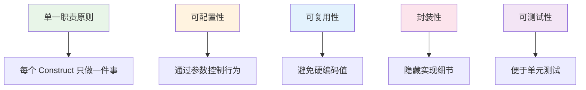
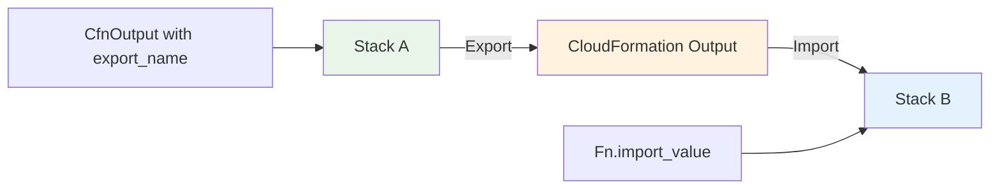

::: tip 学习目标
- 掌握自定义 Construct 的创建方法
- 学会使用 CDK Patterns 和最佳实践
- 理解 Cross-Stack References 的使用
- 掌握 CDK Context 和 Feature Flags 的应用
:::

## 自定义 Construct 开发

### Construct 设计原则



### 创建自定义 Construct

```python
from constructs import Construct
from aws_cdk import (
    aws_lambda as lambda_,
    aws_apigateway as apigw,
    aws_dynamodb as dynamodb,
    aws_iam as iam,
    Duration,
    RemovalPolicy
)
from typing import Optional, List, Dict

class ServerlessApi(Construct):
    """自定义 Construct：无服务器 API"""
    
    def __init__(self, scope: Construct, construct_id: str,
                 table_name: str,
                 lambda_timeout: Optional[Duration] = None,
                 cors_origins: Optional[List[str]] = None,
                 api_key_required: bool = False,
                 **kwargs) -> None:
        super().__init__(scope, construct_id, **kwargs)
        
        # 设置默认值
        lambda_timeout = lambda_timeout or Duration.seconds(30)
        cors_origins = cors_origins or ["*"]
        
        # 创建 DynamoDB 表
        self.table = dynamodb.Table(
            self,
            "Table",
            table_name=table_name,
            partition_key=dynamodb.Attribute(
                name="id",
                type=dynamodb.AttributeType.STRING
            ),
            billing_mode=dynamodb.BillingMode.PAY_PER_REQUEST,
            removal_policy=RemovalPolicy.DESTROY
        )
        
        # 创建 Lambda 函数
        self.function = lambda_.Function(
            self,
            "ApiFunction",
            runtime=lambda_.Runtime.PYTHON_3_9,
            handler="index.handler",
            code=lambda_.Code.from_inline(self._get_lambda_code()),
            timeout=lambda_timeout,
            environment={
                "TABLE_NAME": self.table.table_name
            }
        )
        
        # 授予 Lambda 访问 DynamoDB 的权限
        self.table.grant_read_write_data(self.function)
        
        # 创建 API Gateway
        self.api = apigw.RestApi(
            self,
            "Api",
            rest_api_name=f"{table_name}-api",
            description=f"API for {table_name} operations",
            default_cors_preflight_options=apigw.CorsOptions(
                allow_origins=cors_origins,
                allow_methods=apigw.Cors.ALL_METHODS,
                allow_headers=["Content-Type", "X-Amz-Date", "Authorization", "X-Api-Key"]
            )
        )
        
        # 创建 API 资源和方法
        items_resource = self.api.root.add_resource("items")
        item_resource = items_resource.add_resource("{id}")
        
        # Lambda 集成
        integration = apigw.LambdaIntegration(self.function)
        
        # 添加方法
        items_resource.add_method("GET", integration, api_key_required=api_key_required)
        items_resource.add_method("POST", integration, api_key_required=api_key_required)
        item_resource.add_method("GET", integration, api_key_required=api_key_required)
        item_resource.add_method("PUT", integration, api_key_required=api_key_required)
        item_resource.add_method("DELETE", integration, api_key_required=api_key_required)
        
        # 如果需要 API Key，创建使用计划
        if api_key_required:
            self._setup_api_key()
    
    def _get_lambda_code(self) -> str:
        """Lambda 函数代码"""
        return """
import json
import boto3
import uuid
from decimal import Decimal

dynamodb = boto3.resource('dynamodb')
table_name = os.environ['TABLE_NAME']
table = dynamodb.Table(table_name)

def decimal_default(obj):
    if isinstance(obj, Decimal):
        return float(obj)
    raise TypeError

def handler(event, context):
    try:
        http_method = event['httpMethod']
        resource_path = event['resource']
        
        if resource_path == '/items' and http_method == 'GET':
            return list_items()
        elif resource_path == '/items' and http_method == 'POST':
            return create_item(json.loads(event['body']))
        elif resource_path == '/items/{id}' and http_method == 'GET':
            return get_item(event['pathParameters']['id'])
        elif resource_path == '/items/{id}' and http_method == 'PUT':
            return update_item(event['pathParameters']['id'], json.loads(event['body']))
        elif resource_path == '/items/{id}' and http_method == 'DELETE':
            return delete_item(event['pathParameters']['id'])
        else:
            return {
                'statusCode': 405,
                'body': json.dumps({'error': 'Method not allowed'})
            }
            
    except Exception as e:
        return {
            'statusCode': 500,
            'body': json.dumps({'error': str(e)})
        }

def list_items():
    response = table.scan()
    return {
        'statusCode': 200,
        'body': json.dumps(response['Items'], default=decimal_default)
    }

def create_item(item_data):
    item_data['id'] = str(uuid.uuid4())
    table.put_item(Item=item_data)
    return {
        'statusCode': 201,
        'body': json.dumps(item_data, default=decimal_default)
    }

def get_item(item_id):
    response = table.get_item(Key={'id': item_id})
    if 'Item' not in response:
        return {
            'statusCode': 404,
            'body': json.dumps({'error': 'Item not found'})
        }
    return {
        'statusCode': 200,
        'body': json.dumps(response['Item'], default=decimal_default)
    }

def update_item(item_id, item_data):
    item_data['id'] = item_id
    table.put_item(Item=item_data)
    return {
        'statusCode': 200,
        'body': json.dumps(item_data, default=decimal_default)
    }

def delete_item(item_id):
    table.delete_item(Key={'id': item_id})
    return {
        'statusCode': 204,
        'body': ''
    }
        """
    
    def _setup_api_key(self):
        """设置 API Key 和使用计划"""
        api_key = apigw.ApiKey(
            self,
            "ApiKey",
            api_key_name=f"{self.api.rest_api_name}-key"
        )
        
        usage_plan = apigw.UsagePlan(
            self,
            "UsagePlan",
            name=f"{self.api.rest_api_name}-usage-plan",
            throttle=apigw.ThrottleSettings(
                rate_limit=100,
                burst_limit=200
            ),
            quota=apigw.QuotaSettings(
                limit=10000,
                period=apigw.Period.MONTH
            ),
            api_stages=[
                apigw.UsagePlanPerApiStage(
                    api=self.api,
                    stage=self.api.deployment_stage
                )
            ]
        )
        
        usage_plan.add_api_key(api_key)
        
        self.api_key = api_key
        self.usage_plan = usage_plan
    
    @property
    def api_url(self) -> str:
        """API 网关 URL"""
        return self.api.url
    
    @property 
    def table_name(self) -> str:
        """DynamoDB 表名"""
        return self.table.table_name
    
    def add_custom_domain(self, domain_name: str, certificate_arn: str):
        """添加自定义域名"""
        domain = apigw.DomainName(
            self,
            "CustomDomain",
            domain_name=domain_name,
            certificate=apigw.Certificate.from_certificate_arn(
                self, "Certificate", certificate_arn
            )
        )
        
        apigw.BasePathMapping(
            self,
            "BasePathMapping",
            domain_name=domain,
            rest_api=self.api
        )
        
        return domain
```

### 使用自定义 Construct

```python
from aws_cdk import Stack
from constructs import Construct
from .serverless_api import ServerlessApi

class MyApplicationStack(Stack):
    def __init__(self, scope: Construct, construct_id: str, **kwargs) -> None:
        super().__init__(scope, construct_id, **kwargs)
        
        # 使用自定义 Construct
        users_api = ServerlessApi(
            self,
            "UsersApi",
            table_name="users",
            lambda_timeout=Duration.minutes(1),
            cors_origins=["https://myapp.com", "https://admin.myapp.com"],
            api_key_required=True
        )
        
        products_api = ServerlessApi(
            self,
            "ProductsApi",
            table_name="products",
            cors_origins=["*"]
        )
        
        # 输出 API URLs
        CfnOutput(
            self,
            "UsersApiUrl",
            value=users_api.api_url,
            description="Users API Gateway URL"
        )
        
        CfnOutput(
            self,
            "ProductsApiUrl", 
            value=products_api.api_url,
            description="Products API Gateway URL"
        )
```

## CDK Patterns 和最佳实践

### 常用架构模式

```python
from constructs import Construct
from aws_cdk import (
    aws_lambda as lambda_,
    aws_sqs as sqs,
    aws_lambda_event_sources as lambda_events,
    aws_sns as sns,
    aws_sns_subscriptions as subscriptions,
    Duration
)

class EventDrivenPattern(Construct):
    """事件驱动架构模式"""
    
    def __init__(self, scope: Construct, construct_id: str, **kwargs) -> None:
        super().__init__(scope, construct_id, **kwargs)
        
        # 创建 SNS 主题
        self.topic = sns.Topic(
            self,
            "EventTopic",
            topic_name="application-events"
        )
        
        # 创建死信队列
        dlq = sqs.Queue(
            self,
            "DeadLetterQueue",
            queue_name="failed-events-dlq",
            retention_period=Duration.days(14)
        )
        
        # 创建处理队列
        self.processing_queue = sqs.Queue(
            self,
            "ProcessingQueue",
            queue_name="event-processing",
            dead_letter_queue=sqs.DeadLetterQueue(
                max_receive_count=3,
                queue=dlq
            ),
            visibility_timeout=Duration.minutes(5)
        )
        
        # 订阅 SNS 到 SQS
        self.topic.add_subscription(
            subscriptions.SqsSubscription(self.processing_queue)
        )
        
        # 创建处理函数
        self.processor = lambda_.Function(
            self,
            "EventProcessor",
            runtime=lambda_.Runtime.PYTHON_3_9,
            handler="processor.handler",
            code=lambda_.Code.from_inline("""
import json

def handler(event, context):
    for record in event['Records']:
        # 从 SQS 记录中提取 SNS 消息
        sns_message = json.loads(record['body'])
        message = json.loads(sns_message['Message'])
        
        print(f"Processing event: {message}")
        
        # 这里添加实际的处理逻辑
        process_event(message)
    
    return {'statusCode': 200}

def process_event(event_data):
    event_type = event_data.get('type')
    
    if event_type == 'user_created':
        # 处理用户创建事件
        pass
    elif event_type == 'order_placed':
        # 处理订单创建事件
        pass
    else:
        print(f"Unknown event type: {event_type}")
            """),
            timeout=Duration.minutes(1),
            environment={
                "TOPIC_ARN": self.topic.topic_arn
            }
        )
        
        # 配置 Lambda 从 SQS 读取事件
        self.processor.add_event_source(
            lambda_events.SqsEventSource(
                self.processing_queue,
                batch_size=10,
                max_batching_window=Duration.seconds(5)
            )
        )
        
        # 授予发布权限
        self.topic.grant_publish(self.processor)
    
    def create_subscriber(self, handler_code: str, handler_name: str) -> lambda_.Function:
        """创建事件订阅者"""
        subscriber = lambda_.Function(
            self,
            f"{handler_name}Subscriber",
            runtime=lambda_.Runtime.PYTHON_3_9,
            handler="index.handler", 
            code=lambda_.Code.from_inline(handler_code),
            timeout=Duration.seconds(30)
        )
        
        # 创建专用队列
        subscriber_queue = sqs.Queue(
            self,
            f"{handler_name}Queue",
            visibility_timeout=Duration.seconds(60)
        )
        
        # 订阅主题
        self.topic.add_subscription(
            subscriptions.SqsSubscription(subscriber_queue)
        )
        
        # 配置 Lambda 事件源
        subscriber.add_event_source(
            lambda_events.SqsEventSource(subscriber_queue)
        )
        
        return subscriber
```

### 微服务模式

```python
class MicroservicePattern(Construct):
    """微服务架构模式"""
    
    def __init__(self, scope: Construct, construct_id: str,
                 service_name: str,
                 **kwargs) -> None:
        super().__init__(scope, construct_id, **kwargs)
        
        self.service_name = service_name
        
        # 服务专用的 VPC 子网组
        # （假设 VPC 已经存在）
        
        # 1. 数据层
        self.database = self._create_database()
        
        # 2. 业务逻辑层
        self.business_logic = self._create_business_logic()
        
        # 3. API 层
        self.api = self._create_api()
        
        # 4. 监控和日志
        self.monitoring = self._create_monitoring()
    
    def _create_database(self):
        """创建服务专用数据库"""
        return dynamodb.Table(
            self,
            "ServiceDatabase",
            table_name=f"{self.service_name}-data",
            partition_key=dynamodb.Attribute(
                name="pk",
                type=dynamodb.AttributeType.STRING
            ),
            sort_key=dynamodb.Attribute(
                name="sk", 
                type=dynamodb.AttributeType.STRING
            ),
            billing_mode=dynamodb.BillingMode.PAY_PER_REQUEST,
            stream=dynamodb.StreamViewType.NEW_AND_OLD_IMAGES
        )
    
    def _create_business_logic(self):
        """创建业务逻辑处理器"""
        return lambda_.Function(
            self,
            "BusinessLogic",
            function_name=f"{self.service_name}-processor",
            runtime=lambda_.Runtime.PYTHON_3_9,
            handler="business.handler",
            code=lambda_.Code.from_asset(f"lambda/{self.service_name}"),
            environment={
                "SERVICE_NAME": self.service_name,
                "TABLE_NAME": self.database.table_name
            },
            timeout=Duration.minutes(5)
        )
    
    def _create_api(self):
        """创建 API Gateway"""
        api = apigw.RestApi(
            self,
            "ServiceApi",
            rest_api_name=f"{self.service_name}-api",
            description=f"API for {self.service_name} microservice"
        )
        
        # 健康检查端点
        health = api.root.add_resource("health")
        health.add_method(
            "GET",
            apigw.MockIntegration(
                integration_responses=[
                    apigw.IntegrationResponse(
                        status_code="200",
                        response_templates={
                            "application/json": '{"status": "healthy", "service": "' + self.service_name + '"}'
                        }
                    )
                ],
                request_templates={
                    "application/json": '{"statusCode": 200}'
                }
            ),
            method_responses=[
                apigw.MethodResponse(status_code="200")
            ]
        )
        
        # 业务端点
        service_resource = api.root.add_resource(self.service_name)
        service_resource.add_method(
            "ANY",
            apigw.LambdaIntegration(self.business_logic),
            authorization_type=apigw.AuthorizationType.IAM
        )
        
        # 代理资源处理所有子路径
        proxy = service_resource.add_resource("{proxy+}")
        proxy.add_method(
            "ANY",
            apigw.LambdaIntegration(self.business_logic)
        )
        
        return api
    
    def _create_monitoring(self):
        """创建监控和告警"""
        # 这里会创建 CloudWatch 告警、仪表板等
        # 为简化示例，暂时省略
        pass

# 使用微服务模式
class MicroservicesStack(Stack):
    def __init__(self, scope: Construct, construct_id: str, **kwargs) -> None:
        super().__init__(scope, construct_id, **kwargs)
        
        # 创建多个微服务
        user_service = MicroservicePattern(
            self, "UserService", service_name="users"
        )
        
        product_service = MicroservicePattern(
            self, "ProductService", service_name="products"  
        )
        
        order_service = MicroservicePattern(
            self, "OrderService", service_name="orders"
        )
        
        # 创建 API 网关聚合层
        self._create_api_gateway(user_service, product_service, order_service)
    
    def _create_api_gateway(self, *services):
        """创建统一的 API 网关"""
        # 实现 API 网关聚合逻辑
        pass
```

## Cross-Stack References

### 导出和导入机制



### 实践示例

```python
# shared_infrastructure.py
class SharedInfrastructureStack(Stack):
    def __init__(self, scope: Construct, construct_id: str, **kwargs) -> None:
        super().__init__(scope, construct_id, **kwargs)
        
        # 创建共享 VPC
        self.vpc = ec2.Vpc(
            self,
            "SharedVpc",
            max_azs=3,
            cidr="10.0.0.0/16",
            subnet_configuration=[
                ec2.SubnetConfiguration(
                    name="Public",
                    subnet_type=ec2.SubnetType.PUBLIC,
                    cidr_mask=24
                ),
                ec2.SubnetConfiguration(
                    name="Private",
                    subnet_type=ec2.SubnetType.PRIVATE_WITH_EGRESS,
                    cidr_mask=24
                ),
                ec2.SubnetConfiguration(
                    name="Database",
                    subnet_type=ec2.SubnetType.PRIVATE_ISOLATED,
                    cidr_mask=24
                )
            ]
        )
        
        # 创建共享安全组
        self.app_security_group = ec2.SecurityGroup(
            self,
            "AppSecurityGroup",
            vpc=self.vpc,
            description="Security group for applications",
            allow_all_outbound=True
        )
        
        self.database_security_group = ec2.SecurityGroup(
            self,
            "DatabaseSecurityGroup", 
            vpc=self.vpc,
            description="Security group for databases"
        )
        
        # 允许应用访问数据库
        self.database_security_group.add_ingress_rule(
            peer=self.app_security_group,
            connection=ec2.Port.tcp(5432),
            description="Allow app access to database"
        )
        
        # 导出资源供其他 Stack 使用
        CfnOutput(
            self,
            "VpcId",
            value=self.vpc.vpc_id,
            export_name="SharedVpcId",
            description="Shared VPC ID"
        )
        
        CfnOutput(
            self,
            "PrivateSubnetIds",
            value=",".join([subnet.subnet_id for subnet in self.vpc.private_subnets]),
            export_name="SharedPrivateSubnetIds",
            description="Private subnet IDs"
        )
        
        CfnOutput(
            self,
            "PublicSubnetIds",
            value=",".join([subnet.subnet_id for subnet in self.vpc.public_subnets]),
            export_name="SharedPublicSubnetIds", 
            description="Public subnet IDs"
        )
        
        CfnOutput(
            self,
            "DatabaseSubnetIds",
            value=",".join([subnet.subnet_id for subnet in self.vpc.isolated_subnets]),
            export_name="SharedDatabaseSubnetIds",
            description="Database subnet IDs"
        )
        
        CfnOutput(
            self,
            "AppSecurityGroupId",
            value=self.app_security_group.security_group_id,
            export_name="SharedAppSecurityGroupId",
            description="Application security group ID"
        )
        
        CfnOutput(
            self,
            "DatabaseSecurityGroupId",
            value=self.database_security_group.security_group_id,
            export_name="SharedDatabaseSecurityGroupId",
            description="Database security group ID"
        )

# application_stack.py
class ApplicationStack(Stack):
    def __init__(self, scope: Construct, construct_id: str, **kwargs) -> None:
        super().__init__(scope, construct_id, **kwargs)
        
        # 导入共享资源
        vpc_id = cdk.Fn.import_value("SharedVpcId")
        private_subnet_ids = cdk.Fn.import_value("SharedPrivateSubnetIds").split(",")
        app_sg_id = cdk.Fn.import_value("SharedAppSecurityGroupId")
        
        # 或者使用 CDK 的便利方法
        vpc = ec2.Vpc.from_lookup(
            self,
            "ImportedVpc",
            vpc_id=vpc_id
        )
        
        app_security_group = ec2.SecurityGroup.from_security_group_id(
            self,
            "ImportedAppSG",
            security_group_id=app_sg_id
        )
        
        # 创建应用资源
        app_function = lambda_.Function(
            self,
            "AppFunction",
            runtime=lambda_.Runtime.PYTHON_3_9,
            handler="app.handler",
            code=lambda_.Code.from_asset("lambda"),
            vpc=vpc,
            vpc_subnets=ec2.SubnetSelection(
                subnet_type=ec2.SubnetType.PRIVATE_WITH_EGRESS
            ),
            security_groups=[app_security_group]
        )
        
        # 创建 ALB
        alb = elbv2.ApplicationLoadBalancer(
            self,
            "AppLoadBalancer",
            vpc=vpc,
            internet_facing=True,
            vpc_subnets=ec2.SubnetSelection(
                subnet_type=ec2.SubnetType.PUBLIC
            )
        )
        
        # 配置目标组
        target_group = elbv2.ApplicationTargetGroup(
            self,
            "AppTargets",
            vpc=vpc,
            port=80,
            protocol=elbv2.ApplicationProtocol.HTTP,
            targets=[targets.LambdaTarget(app_function)]
        )
        
        # 添加监听器
        alb.add_listener(
            "AppListener",
            port=80,
            default_target_groups=[target_group]
        )

# database_stack.py  
class DatabaseStack(Stack):
    def __init__(self, scope: Construct, construct_id: str, **kwargs) -> None:
        super().__init__(scope, construct_id, **kwargs)
        
        # 导入共享资源
        vpc_id = cdk.Fn.import_value("SharedVpcId")
        db_subnet_ids = cdk.Fn.import_value("SharedDatabaseSubnetIds").split(",")
        db_sg_id = cdk.Fn.import_value("SharedDatabaseSecurityGroupId")
        
        vpc = ec2.Vpc.from_lookup(self, "ImportedVpc", vpc_id=vpc_id)
        
        # 创建子网组
        db_subnet_group = rds.SubnetGroup(
            self,
            "DatabaseSubnetGroup",
            description="Subnet group for database",
            vpc=vpc,
            vpc_subnets=ec2.SubnetSelection(
                subnet_type=ec2.SubnetType.PRIVATE_ISOLATED
            ),
            removal_policy=RemovalPolicy.DESTROY
        )
        
        # 创建数据库
        database = rds.DatabaseInstance(
            self,
            "ApplicationDatabase",
            engine=rds.DatabaseInstanceEngine.postgres(
                version=rds.PostgresEngineVersion.VER_13_7
            ),
            instance_type=ec2.InstanceType.of(
                ec2.InstanceClass.BURSTABLE3,
                ec2.InstanceSize.MICRO
            ),
            vpc=vpc,
            subnet_group=db_subnet_group,
            security_groups=[
                ec2.SecurityGroup.from_security_group_id(
                    self, "ImportedDbSG", db_sg_id
                )
            ],
            credentials=rds.Credentials.from_generated_secret(
                "dbadmin",
                exclude_characters='/@"\'
            ),
            database_name="appdb",
            backup_retention=Duration.days(7),
            deletion_protection=False,
            removal_policy=RemovalPolicy.DESTROY
        )
        
        # 导出数据库连接信息
        CfnOutput(
            self,
            "DatabaseEndpoint",
            value=database.instance_endpoint.hostname,
            export_name="DatabaseEndpoint",
            description="Database endpoint"
        )
        
        CfnOutput(
            self,
            "DatabaseSecretArn", 
            value=database.secret.secret_arn,
            export_name="DatabaseSecretArn",
            description="Database secret ARN"
        )
```

## CDK Context 和 Feature Flags

### Context 配置管理

```python
# cdk.json 中的 context 配置
{
  "app": "python app.py",
  "context": {
    "@aws-cdk/aws-lambda:recognizeLayerVersion": true,
    "@aws-cdk/core:enableStackNameDuplicates": true,
    "@aws-cdk/core:stackRelativeExports": true,
    
    // 自定义上下文
    "environment": "development",
    "vpc-cidr": "10.0.0.0/16",
    "database-instance-type": "db.t3.micro",
    "enable-logging": true,
    "cors-origins": ["https://localhost:3000", "https://dev.example.com"],
    
    // 环境特定配置
    "dev": {
      "instance-count": 1,
      "database-backup-retention": 1,
      "log-retention-days": 7
    },
    "prod": {
      "instance-count": 3,
      "database-backup-retention": 30,
      "log-retention-days": 365
    }
  },
  "feature_flags": {
    "@aws-cdk/core:newStyleStackSynthesis": true,
    "@aws-cdk/aws-s3:createDefaultLoggingPolicy": true,
    "@aws-cdk/aws-sns-subscriptions:restrictSqsDescryption": true
  }
}
```

### 在代码中使用 Context

```python
class ContextAwareStack(Stack):
    def __init__(self, scope: Construct, construct_id: str, **kwargs) -> None:
        super().__init__(scope, construct_id, **kwargs)
        
        # 获取 context 值
        environment = self.node.try_get_context("environment") or "dev"
        vpc_cidr = self.node.try_get_context("vpc-cidr") or "10.0.0.0/16"
        enable_logging = self.node.try_get_context("enable-logging") or False
        cors_origins = self.node.try_get_context("cors-origins") or ["*"]
        
        # 获取环境特定配置
        env_config = self.node.try_get_context(environment) or {}
        instance_count = env_config.get("instance-count", 1)
        backup_retention = env_config.get("database-backup-retention", 7)
        log_retention_days = env_config.get("log-retention-days", 7)
        
        # 使用配置创建资源
        vpc = ec2.Vpc(
            self,
            "Vpc",
            cidr=vpc_cidr,
            max_azs=2 if environment == "dev" else 3
        )
        
        # 条件性创建资源
        if enable_logging:
            log_group = logs.LogGroup(
                self,
                "ApplicationLogs",
                log_group_name=f"/aws/lambda/{environment}-app",
                retention=logs.RetentionDays(log_retention_days),
                removal_policy=RemovalPolicy.DESTROY
            )
        
        # 创建 Lambda 函数，使用环境特定配置
        function = lambda_.Function(
            self,
            "AppFunction",
            runtime=lambda_.Runtime.PYTHON_3_9,
            handler="index.handler",
            code=lambda_.Code.from_inline("def handler(e, c): return {}"),
            environment={
                "ENVIRONMENT": environment,
                "CORS_ORIGINS": ",".join(cors_origins),
                "LOG_LEVEL": "DEBUG" if environment == "dev" else "INFO"
            },
            log_group=log_group if enable_logging else None
        )
        
        # 创建数据库，使用环境特定实例类型
        db_instance_type = self.node.try_get_context("database-instance-type")
        if db_instance_type:
            database = rds.DatabaseInstance(
                self,
                "Database",
                engine=rds.DatabaseInstanceEngine.postgres(
                    version=rds.PostgresEngineVersion.VER_13_7
                ),
                instance_type=ec2.InstanceType(db_instance_type),
                vpc=vpc,
                backup_retention=Duration.days(backup_retention),
                removal_policy=RemovalPolicy.DESTROY
            )
```

### 高级 Context 使用

```python
class AdvancedContextStack(Stack):
    def __init__(self, scope: Construct, construct_id: str, **kwargs) -> None:
        super().__init__(scope, construct_id, **kwargs)
        
        # 从命令行或环境变量获取 context
        # cdk deploy --context env=prod --context region=us-east-1
        
        env_name = self.node.try_get_context("env")
        region = self.node.try_get_context("region") 
        
        if not env_name:
            raise ValueError("Environment context 'env' is required")
        
        # 加载环境配置文件
        config = self._load_environment_config(env_name)
        
        # 验证必需的 context 值
        self._validate_context()
        
        # 使用配置创建资源
        self._create_resources(config)
    
    def _load_environment_config(self, env_name: str) -> dict:
        """加载环境配置"""
        configs = {
            "dev": {
                "vpc_cidr": "10.0.0.0/16",
                "database": {
                    "instance_type": "db.t3.micro",
                    "multi_az": False,
                    "backup_retention": 1
                },
                "lambda": {
                    "memory_size": 256,
                    "timeout": 30
                },
                "monitoring": {
                    "detailed_monitoring": False,
                    "log_retention": 7
                }
            },
            "staging": {
                "vpc_cidr": "10.1.0.0/16", 
                "database": {
                    "instance_type": "db.t3.small",
                    "multi_az": False,
                    "backup_retention": 7
                },
                "lambda": {
                    "memory_size": 512,
                    "timeout": 60
                },
                "monitoring": {
                    "detailed_monitoring": True,
                    "log_retention": 30
                }
            },
            "prod": {
                "vpc_cidr": "10.2.0.0/16",
                "database": {
                    "instance_type": "db.r5.large", 
                    "multi_az": True,
                    "backup_retention": 30
                },
                "lambda": {
                    "memory_size": 1024,
                    "timeout": 300
                },
                "monitoring": {
                    "detailed_monitoring": True,
                    "log_retention": 365
                }
            }
        }
        
        if env_name not in configs:
            raise ValueError(f"Unknown environment: {env_name}")
            
        return configs[env_name]
    
    def _validate_context(self):
        """验证必需的 context 值"""
        required_contexts = ["env"]
        
        for context_key in required_contexts:
            if not self.node.try_get_context(context_key):
                raise ValueError(f"Required context '{context_key}' is missing")
    
    def _create_resources(self, config: dict):
        """根据配置创建资源"""
        # 根据配置创建 VPC
        vpc = ec2.Vpc(
            self,
            "Vpc",
            cidr=config["vpc_cidr"]
        )
        
        # 根据配置创建数据库
        database = rds.DatabaseInstance(
            self,
            "Database",
            engine=rds.DatabaseInstanceEngine.postgres(
                version=rds.PostgresEngineVersion.VER_13_7
            ),
            instance_type=ec2.InstanceType(config["database"]["instance_type"]),
            vpc=vpc,
            multi_az=config["database"]["multi_az"],
            backup_retention=Duration.days(config["database"]["backup_retention"]),
            removal_policy=RemovalPolicy.DESTROY
        )
        
        # 根据配置创建 Lambda
        function = lambda_.Function(
            self,
            "Function",
            runtime=lambda_.Runtime.PYTHON_3_9,
            handler="index.handler",
            code=lambda_.Code.from_inline("def handler(e, c): return {}"),
            memory_size=config["lambda"]["memory_size"],
            timeout=Duration.seconds(config["lambda"]["timeout"]),
            log_retention=logs.RetentionDays(config["monitoring"]["log_retention"])
        )
```

这一章深入介绍了 CDK 的高级特性，包括自定义 Construct 开发、架构模式、跨 Stack 引用和上下文管理。这些技能对于构建企业级、可维护的基础设施代码至关重要。