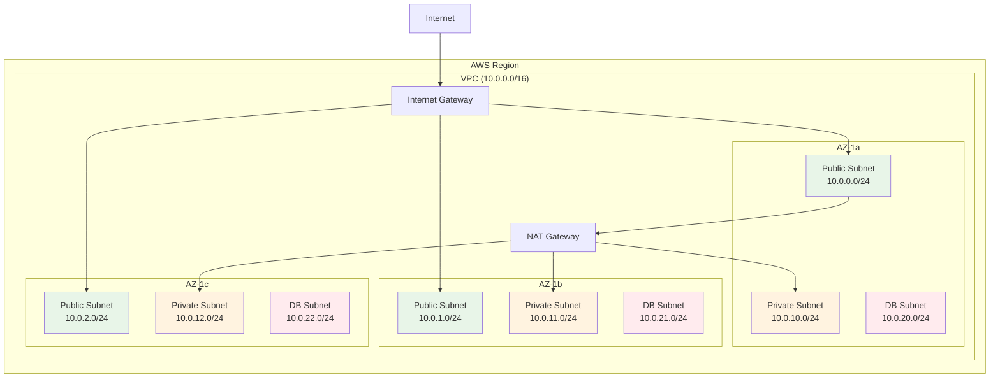

::: tip 学习目标
- 掌握 VPC 网络架构的 CDK 实现
- 学会配置 EC2、RDS、ElastiCache 等计算和存储服务
- 理解 API Gateway、Lambda 的无服务器架构实现
- 掌握 CloudWatch、SNS、SQS 等监控和消息服务配置
:::

## VPC 网络架构

### 完整的 VPC 设置

```python
from aws_cdk import (
    Stack,
    aws_ec2 as ec2,
    aws_logs as logs,
    CfnOutput
)
from constructs import Construct

class NetworkingStack(Stack):
    def __init__(self, scope: Construct, construct_id: str, **kwargs) -> None:
        super().__init__(scope, construct_id, **kwargs)
        
        # 创建 VPC
        self.vpc = ec2.Vpc(
            self,
            "MainVPC",
            vpc_name="main-vpc",
            max_azs=3,  # 使用 3 个可用区
            cidr="10.0.0.0/16",
            
            # 定义子网配置
            subnet_configuration=[
                # 公有子网 - 用于负载均衡器、NAT 网关
                ec2.SubnetConfiguration(
                    name="Public",
                    subnet_type=ec2.SubnetType.PUBLIC,
                    cidr_mask=24  # 10.0.0.0/24, 10.0.1.0/24, 10.0.2.0/24
                ),
                # 私有子网 - 用于应用服务器
                ec2.SubnetConfiguration(
                    name="Private", 
                    subnet_type=ec2.SubnetType.PRIVATE_WITH_EGRESS,
                    cidr_mask=24  # 10.0.10.0/24, 10.0.11.0/24, 10.0.12.0/24
                ),
                # 数据库子网 - 完全隔离
                ec2.SubnetConfiguration(
                    name="Database",
                    subnet_type=ec2.SubnetType.PRIVATE_ISOLATED,
                    cidr_mask=24  # 10.0.20.0/24, 10.0.21.0/24, 10.0.22.0/24
                )
            ],
            
            # 启用 DNS 
            enable_dns_hostnames=True,
            enable_dns_support=True,
            
            # NAT 网关配置
            nat_gateways=1,  # 生产环境建议每个 AZ 一个
            
            # 流日志
            flow_logs={
                "FlowLogsCloudWatch": ec2.FlowLogOptions(
                    destination=ec2.FlowLogDestination.to_cloud_watch_logs(
                        log_group=logs.LogGroup(
                            self,
                            "VpcFlowLogsGroup",
                            retention=logs.RetentionDays.ONE_MONTH
                        )
                    ),
                    traffic_type=ec2.FlowLogTrafficType.ALL
                )
            }
        )
        
        # 创建安全组
        self._create_security_groups()
        
        # 创建 VPC 端点（减少 NAT 网关费用）
        self._create_vpc_endpoints()
        
        # 输出网络信息
        self._create_outputs()
    
    def _create_security_groups(self):
        """创建安全组"""
        
        # Web 层安全组
        self.web_sg = ec2.SecurityGroup(
            self,
            "WebSecurityGroup",
            vpc=self.vpc,
            description="Security group for web servers",
            allow_all_outbound=True
        )
        
        # 允许 HTTP/HTTPS 流量
        self.web_sg.add_ingress_rule(
            peer=ec2.Peer.any_ipv4(),
            connection=ec2.Port.tcp(80),
            description="Allow HTTP"
        )
        self.web_sg.add_ingress_rule(
            peer=ec2.Peer.any_ipv4(),
            connection=ec2.Port.tcp(443),
            description="Allow HTTPS"
        )
        
        # 应用层安全组
        self.app_sg = ec2.SecurityGroup(
            self,
            "AppSecurityGroup",
            vpc=self.vpc,
            description="Security group for application servers",
            allow_all_outbound=True
        )
        
        # 只允许来自 Web 层的流量
        self.app_sg.add_ingress_rule(
            peer=self.web_sg,
            connection=ec2.Port.tcp(8080),
            description="Allow traffic from web tier"
        )
        
        # 数据库层安全组
        self.db_sg = ec2.SecurityGroup(
            self,
            "DatabaseSecurityGroup", 
            vpc=self.vpc,
            description="Security group for database servers"
        )
        
        # 只允许来自应用层的数据库连接
        self.db_sg.add_ingress_rule(
            peer=self.app_sg,
            connection=ec2.Port.tcp(5432),
            description="Allow PostgreSQL from app tier"
        )
        self.db_sg.add_ingress_rule(
            peer=self.app_sg,
            connection=ec2.Port.tcp(3306),
            description="Allow MySQL from app tier"
        )
        
        # 缓存层安全组
        self.cache_sg = ec2.SecurityGroup(
            self,
            "CacheSecurityGroup",
            vpc=self.vpc,
            description="Security group for cache servers"
        )
        
        self.cache_sg.add_ingress_rule(
            peer=self.app_sg,
            connection=ec2.Port.tcp(6379),
            description="Allow Redis from app tier"
        )
        
        # 管理访问安全组
        self.bastion_sg = ec2.SecurityGroup(
            self,
            "BastionSecurityGroup",
            vpc=self.vpc,
            description="Security group for bastion host"
        )
        
        # 只允许来自公司 IP 的 SSH 访问
        self.bastion_sg.add_ingress_rule(
            peer=ec2.Peer.ipv4("203.0.113.0/24"),  # 替换为实际的公司 IP 范围
            connection=ec2.Port.tcp(22),
            description="Allow SSH from company network"
        )
    
    def _create_vpc_endpoints(self):
        """创建 VPC 端点以减少 NAT 网关使用"""
        
        # S3 网关端点
        self.vpc.add_gateway_endpoint(
            "S3Endpoint",
            service=ec2.GatewayVpcEndpointAwsService.S3,
            subnets=[
                ec2.SubnetSelection(subnet_type=ec2.SubnetType.PRIVATE_WITH_EGRESS),
                ec2.SubnetSelection(subnet_type=ec2.SubnetType.PRIVATE_ISOLATED)
            ]
        )
        
        # DynamoDB 网关端点
        self.vpc.add_gateway_endpoint(
            "DynamoDbEndpoint", 
            service=ec2.GatewayVpcEndpointAwsService.DYNAMODB,
            subnets=[
                ec2.SubnetSelection(subnet_type=ec2.SubnetType.PRIVATE_WITH_EGRESS),
                ec2.SubnetSelection(subnet_type=ec2.SubnetType.PRIVATE_ISOLATED)
            ]
        )
        
        # 接口端点安全组
        endpoint_sg = ec2.SecurityGroup(
            self,
            "VpcEndpointSG",
            vpc=self.vpc,
            description="Security group for VPC endpoints"
        )
        endpoint_sg.add_ingress_rule(
            peer=ec2.Peer.ipv4(self.vpc.vpc_cidr_block),
            connection=ec2.Port.tcp(443),
            description="Allow HTTPS from VPC"
        )
        
        # 常用服务的接口端点
        services = [
            ec2.InterfaceVpcEndpointAwsService.ECR,
            ec2.InterfaceVpcEndpointAwsService.ECR_DOCKER,
            ec2.InterfaceVpcEndpointAwsService.LAMBDA,
            ec2.InterfaceVpcEndpointAwsService.SECRETS_MANAGER,
            ec2.InterfaceVpcEndpointAwsService.SSM,
            ec2.InterfaceVpcEndpointAwsService.SSM_MESSAGES,
            ec2.InterfaceVpcEndpointAwsService.EC2_MESSAGES
        ]
        
        for service in services:
            self.vpc.add_interface_endpoint(
                f"{service.name}Endpoint",
                service=service,
                subnets=ec2.SubnetSelection(
                    subnet_type=ec2.SubnetType.PRIVATE_WITH_EGRESS
                ),
                security_groups=[endpoint_sg]
            )
    
    def _create_outputs(self):
        """创建输出"""
        CfnOutput(self, "VpcId", value=self.vpc.vpc_id)
        CfnOutput(self, "VpcCidr", value=self.vpc.vpc_cidr_block)
        
        CfnOutput(
            self, "PublicSubnetIds",
            value=",".join([s.subnet_id for s in self.vpc.public_subnets])
        )
        CfnOutput(
            self, "PrivateSubnetIds", 
            value=",".join([s.subnet_id for s in self.vpc.private_subnets])
        )
        CfnOutput(
            self, "DatabaseSubnetIds",
            value=",".join([s.subnet_id for s in self.vpc.isolated_subnets])
        )
```

### VPC 架构图



## RDS 数据库配置

### 生产级 RDS 设置

```python
from aws_cdk import (
    Stack,
    aws_rds as rds,
    aws_ec2 as ec2,
    aws_kms as kms,
    aws_secretsmanager as secretsmanager,
    Duration,
    RemovalPolicy
)

class DatabaseStack(Stack):
    def __init__(self, scope: Construct, construct_id: str,
                 vpc: ec2.Vpc,
                 database_sg: ec2.SecurityGroup,
                 **kwargs) -> None:
        super().__init__(scope, construct_id, **kwargs)
        
        self.vpc = vpc
        self.database_sg = database_sg
        
        # 创建主数据库
        self.primary_db = self._create_primary_database()
        
        # 创建只读副本
        self.read_replica = self._create_read_replica()
        
        # 创建 ElastiCache 集群
        self.cache_cluster = self._create_cache_cluster()
        
        # 输出数据库信息
        self._create_outputs()
    
    def _create_primary_database(self):
        """创建主数据库"""
        
        # 创建 KMS 密钥用于加密
        db_key = kms.Key(
            self,
            "DatabaseKey",
            description="KMS key for database encryption",
            enable_key_rotation=True
        )
        
        # 创建数据库凭据
        credentials = rds.Credentials.from_generated_secret(
            username="dbadmin",
            secret_name="rds-credentials",
            exclude_characters='/@"\'\\;'
        )
        
        # 创建子网组
        subnet_group = rds.SubnetGroup(
            self,
            "DatabaseSubnetGroup",
            description="Subnet group for RDS database",
            vpc=self.vpc,
            vpc_subnets=ec2.SubnetSelection(
                subnet_type=ec2.SubnetType.PRIVATE_ISOLATED
            ),
            removal_policy=RemovalPolicy.DESTROY
        )
        
        # 创建参数组
        parameter_group = rds.ParameterGroup(
            self,
            "DatabaseParameterGroup",
            engine=rds.DatabaseInstanceEngine.postgres(
                version=rds.PostgresEngineVersion.VER_13_7
            ),
            description="Custom parameter group for PostgreSQL",
            parameters={
                "shared_preload_libraries": "pg_stat_statements",
                "log_statement": "all",
                "log_min_duration_statement": "1000",
                "log_checkpoints": "on",
                "log_lock_waits": "on"
            }
        )
        
        # 创建 RDS 实例
        database = rds.DatabaseInstance(
            self,
            "PrimaryDatabase",
            engine=rds.DatabaseInstanceEngine.postgres(
                version=rds.PostgresEngineVersion.VER_13_7
            ),
            instance_type=ec2.InstanceType.of(
                ec2.InstanceClass.BURSTABLE3,
                ec2.InstanceSize.MEDIUM
            ),
            credentials=credentials,
            vpc=self.vpc,
            subnet_group=subnet_group,
            security_groups=[self.database_sg],
            
            # 数据库配置
            database_name="appdb",
            port=5432,
            parameter_group=parameter_group,
            
            # 存储配置
            allocated_storage=100,  # GB
            max_allocated_storage=1000,  # 启用自动扩展
            storage_type=rds.StorageType.GP2,
            storage_encrypted=True,
            storage_encryption_key=db_key,
            
            # 备份配置
            backup_retention=Duration.days(7),
            backup_window="03:00-04:00",  # UTC 时间
            preferred_backup_window="03:00-04:00",
            
            # 维护配置
            maintenance_window="Sun:04:00-Sun:05:00",
            auto_minor_version_upgrade=True,
            
            # 高可用性
            multi_az=True,
            
            # 监控
            monitoring_interval=Duration.seconds(60),
            enable_performance_insights=True,
            performance_insight_retention=rds.PerformanceInsightRetention.DEFAULT,
            performance_insight_encryption_key=db_key,
            
            # 日志导出
            cloudwatch_logs_exports=["postgresql"],
            cloudwatch_logs_retention=logs.RetentionDays.ONE_MONTH,
            
            # 删除保护
            deletion_protection=False,  # 开发环境，生产环境设为 True
            delete_automated_backups=True,
            removal_policy=RemovalPolicy.DESTROY  # 开发环境
        )
        
        return database
    
    def _create_read_replica(self):
        """创建只读副本"""
        read_replica = rds.DatabaseInstanceReadReplica(
            self,
            "ReadReplica",
            source_database_instance=self.primary_db,
            instance_type=ec2.InstanceType.of(
                ec2.InstanceClass.BURSTABLE3,
                ec2.InstanceSize.SMALL
            ),
            vpc=self.vpc,
            vpc_subnets=ec2.SubnetSelection(
                subnet_type=ec2.SubnetType.PRIVATE_ISOLATED
            ),
            security_groups=[self.database_sg],
            
            # 只读副本配置
            auto_minor_version_upgrade=True,
            backup_retention=Duration.days(0),  # 只读副本不需要备份
            monitoring_interval=Duration.seconds(60),
            enable_performance_insights=True,
            
            deletion_protection=False,
            removal_policy=RemovalPolicy.DESTROY
        )
        
        return read_replica
    
    def _create_cache_cluster(self):
        """创建 ElastiCache Redis 集群"""
        
        # 创建缓存子网组
        cache_subnet_group = elasticache.CfnSubnetGroup(
            self,
            "CacheSubnetGroup",
            description="Subnet group for ElastiCache",
            subnet_ids=[subnet.subnet_id for subnet in self.vpc.private_subnets]
        )
        
        # 创建缓存参数组
        cache_parameter_group = elasticache.CfnParameterGroup(
            self,
            "CacheParameterGroup",
            cache_parameter_group_family="redis6.x",
            description="Custom parameter group for Redis",
            properties={
                "maxmemory-policy": "allkeys-lru",
                "timeout": "300"
            }
        )
        
        # 创建 Redis 复制组
        redis_cluster = elasticache.CfnReplicationGroup(
            self,
            "RedisCluster",
            description="Redis cluster for application caching",
            
            # 集群配置
            replication_group_id="app-redis-cluster",
            num_cache_clusters=2,  # 主节点 + 1个只读副本
            
            # 实例配置
            cache_node_type="cache.t3.micro",
            engine="redis",
            engine_version="6.2",
            port=6379,
            
            # 网络配置
            cache_subnet_group_name=cache_subnet_group.ref,
            security_group_ids=[self.database_sg.security_group_id],
            
            # 参数组
            cache_parameter_group_name=cache_parameter_group.ref,
            
            # 安全配置
            at_rest_encryption_enabled=True,
            transit_encryption_enabled=True,
            auth_token="your-secure-auth-token-here",  # 生产环境应使用 Secrets Manager
            
            # 备份配置
            automatic_failover_enabled=True,
            snapshot_retention_limit=5,
            snapshot_window="03:00-05:00",
            preferred_maintenance_window="sun:05:00-sun:06:00",
            
            # 通知
            notification_topic_arn="",  # 可以设置 SNS 主题接收通知
            
            # 日志
            log_delivery_configurations=[
                elasticache.CfnReplicationGroup.LogDeliveryConfigurationRequestProperty(
                    destination_type="cloudwatch-logs",
                    destination_details=elasticache.CfnReplicationGroup.DestinationDetailsProperty(
                        cloud_watch_logs_details=elasticache.CfnReplicationGroup.CloudWatchLogsDestinationDetailsProperty(
                            log_group="/aws/elasticache/redis"
                        )
                    ),
                    log_format="json",
                    log_type="slow-log"
                )
            ]
        )
        
        # 添加依赖关系
        redis_cluster.add_dependency(cache_subnet_group)
        redis_cluster.add_dependency(cache_parameter_group)
        
        return redis_cluster
    
    def _create_outputs(self):
        """创建输出"""
        CfnOutput(
            self,
            "DatabaseEndpoint",
            value=self.primary_db.instance_endpoint.hostname,
            description="Primary database endpoint"
        )
        
        CfnOutput(
            self,
            "DatabaseSecretArn",
            value=self.primary_db.secret.secret_arn,
            description="Database credentials secret ARN"
        )
        
        CfnOutput(
            self,
            "ReadReplicaEndpoint",
            value=self.read_replica.instance_endpoint.hostname,
            description="Read replica endpoint"
        )
        
        CfnOutput(
            self,
            "RedisEndpoint",
            value=self.redis_cluster.attr_redis_endpoint_address,
            description="Redis cluster endpoint"
        )
```

## Lambda 和 API Gateway 无服务器架构

### 完整的无服务器 API

```python
from aws_cdk import (
    Stack,
    aws_lambda as lambda_,
    aws_apigateway as apigw,
    aws_dynamodb as dynamodb,
    aws_cognito as cognito,
    aws_iam as iam,
    Duration,
    RemovalPolicy
)

class ServerlessApiStack(Stack):
    def __init__(self, scope: Construct, construct_id: str, **kwargs) -> None:
        super().__init__(scope, construct_id, **kwargs)
        
        # 创建用户池用于身份验证
        self.user_pool = self._create_user_pool()
        
        # 创建 DynamoDB 表
        self.table = self._create_dynamodb_table()
        
        # 创建 Lambda 层
        self.common_layer = self._create_lambda_layer()
        
        # 创建 Lambda 函数
        self.functions = self._create_lambda_functions()
        
        # 创建 API Gateway
        self.api = self._create_api_gateway()
        
        # 配置 API 路由
        self._configure_api_routes()
        
        # 输出 API 信息
        self._create_outputs()
    
    def _create_user_pool(self):
        """创建 Cognito 用户池"""
        user_pool = cognito.UserPool(
            self,
            "ApiUserPool",
            user_pool_name="api-users",
            
            # 注册配置
            self_sign_up_enabled=True,
            sign_in_aliases=cognito.SignInAliases(email=True),
            
            # 密码策略
            password_policy=cognito.PasswordPolicy(
                min_length=8,
                require_lowercase=True,
                require_uppercase=True,
                require_digits=True,
                require_symbols=False
            ),
            
            # 账户恢复
            account_recovery=cognito.AccountRecovery.EMAIL_ONLY,
            
            # 属性验证
            auto_verify=cognito.AutoVerifiedAttrs(email=True),
            
            # 用户属性
            standard_attributes=cognito.StandardAttributes(
                email=cognito.StandardAttribute(required=True, mutable=True),
                given_name=cognito.StandardAttribute(required=True, mutable=True),
                family_name=cognito.StandardAttribute(required=True, mutable=True)
            ),
            
            # 删除策略
            removal_policy=RemovalPolicy.DESTROY
        )
        
        # 创建用户池客户端
        user_pool_client = user_pool.add_client(
            "ApiClient",
            user_pool_client_name="api-client",
            
            # 认证流程
            auth_flows=cognito.AuthFlow(
                user_srp=True,
                user_password=True,
                admin_user_password=True
            ),
            
            # Token 有效期
            access_token_validity=Duration.minutes(60),
            id_token_validity=Duration.minutes(60),
            refresh_token_validity=Duration.days(30),
            
            # 读写权限
            read_attributes=cognito.ClientAttributes(
                email=True,
                given_name=True,
                family_name=True
            ),
            write_attributes=cognito.ClientAttributes(
                email=True,
                given_name=True,
                family_name=True
            )
        )
        
        return user_pool
    
    def _create_dynamodb_table(self):
        """创建 DynamoDB 表"""
        table = dynamodb.Table(
            self,
            "ApiDataTable",
            table_name="api-data",
            
            # 主键设计
            partition_key=dynamodb.Attribute(
                name="PK",
                type=dynamodb.AttributeType.STRING
            ),
            sort_key=dynamodb.Attribute(
                name="SK", 
                type=dynamodb.AttributeType.STRING
            ),
            
            # 计费模式
            billing_mode=dynamodb.BillingMode.PAY_PER_REQUEST,
            
            # 全局二级索引
            global_secondary_indexes=[
                dynamodb.GlobalSecondaryIndex(
                    index_name="GSI1",
                    partition_key=dynamodb.Attribute(
                        name="GSI1PK",
                        type=dynamodb.AttributeType.STRING
                    ),
                    sort_key=dynamodb.Attribute(
                        name="GSI1SK",
                        type=dynamodb.AttributeType.STRING
                    ),
                    projection_type=dynamodb.ProjectionType.ALL
                )
            ],
            
            # 流配置
            stream=dynamodb.StreamViewType.NEW_AND_OLD_IMAGES,
            
            # 时间点恢复
            point_in_time_recovery=True,
            
            # 删除策略
            removal_policy=RemovalPolicy.DESTROY
        )
        
        return table
    
    def _create_lambda_layer(self):
        """创建 Lambda 层"""
        layer = lambda_.LayerVersion(
            self,
            "CommonLayer",
            code=lambda_.Code.from_asset("layers/common"),
            compatible_runtimes=[lambda_.Runtime.PYTHON_3_9],
            description="Common utilities and dependencies",
            layer_version_name="common-utils"
        )
        
        return layer
    
    def _create_lambda_functions(self):
        """创建 Lambda 函数"""
        
        # 通用环境变量
        common_env = {
            "TABLE_NAME": self.table.table_name,
            "USER_POOL_ID": self.user_pool.user_pool_id,
            "POWERTOOLS_SERVICE_NAME": "api-service",
            "LOG_LEVEL": "INFO"
        }
        
        # 通用配置
        function_props = {
            "runtime": lambda_.Runtime.PYTHON_3_9,
            "timeout": Duration.seconds(30),
            "memory_size": 256,
            "layers": [self.common_layer],
            "environment": common_env,
            "tracing": lambda_.Tracing.ACTIVE  # 启用 X-Ray 追踪
        }
        
        functions = {}
        
        # 用户管理函数
        functions['users'] = lambda_.Function(
            self,
            "UsersFunction",
            handler="users.handler",
            code=lambda_.Code.from_asset("lambda/users"),
            description="Handle user operations",
            **function_props
        )
        
        # 产品管理函数
        functions['products'] = lambda_.Function(
            self,
            "ProductsFunction", 
            handler="products.handler",
            code=lambda_.Code.from_asset("lambda/products"),
            description="Handle product operations",
            **function_props
        )
        
        # 订单管理函数
        functions['orders'] = lambda_.Function(
            self,
            "OrdersFunction",
            handler="orders.handler",
            code=lambda_.Code.from_asset("lambda/orders"),
            description="Handle order operations",
            **function_props
        )
        
        # 授权函数
        functions['authorizer'] = lambda_.Function(
            self,
            "AuthorizerFunction",
            handler="authorizer.handler",
            code=lambda_.Code.from_asset("lambda/authorizer"),
            description="Custom API Gateway authorizer",
            timeout=Duration.seconds(10),
            **{k: v for k, v in function_props.items() if k != 'timeout'}
        )
        
        # 为所有函数授予 DynamoDB 权限
        for func in functions.values():
            if func != functions['authorizer']:
                self.table.grant_read_write_data(func)
        
        return functions
    
    def _create_api_gateway(self):
        """创建 API Gateway"""
        
        # 创建自定义授权器
        authorizer = apigw.RequestAuthorizer(
            self,
            "CustomAuthorizer",
            handler=self.functions['authorizer'],
            identity_sources=[
                apigw.IdentitySource.header('Authorization'),
                apigw.IdentitySource.header('x-api-key')
            ],
            results_cache_ttl=Duration.minutes(5)
        )
        
        # 创建 API
        api = apigw.RestApi(
            self,
            "ServerlessApi",
            rest_api_name="serverless-api",
            description="Serverless API with Lambda and DynamoDB",
            
            # CORS 配置
            default_cors_preflight_options=apigw.CorsOptions(
                allow_origins=apigw.Cors.ALL_ORIGINS,
                allow_methods=apigw.Cors.ALL_METHODS,
                allow_headers=[
                    "Content-Type",
                    "X-Amz-Date", 
                    "Authorization",
                    "X-Api-Key",
                    "X-Amz-Security-Token"
                ]
            ),
            
            # 部署配置
            deploy=True,
            deploy_options=apigw.StageOptions(
                stage_name="prod",
                throttling_rate_limit=1000,
                throttling_burst_limit=2000,
                logging_level=apigw.MethodLoggingLevel.INFO,
                data_trace_enabled=True,
                metrics_enabled=True,
                
                # 缓存配置
                caching_enabled=True,
                cache_cluster_enabled=True,
                cache_cluster_size=apigw.CacheClusterSize.SMALL,
                
                # 访问日志
                access_log_destination=apigw.LogGroupLogDestination(
                    logs.LogGroup(
                        self,
                        "ApiAccessLogs",
                        retention=logs.RetentionDays.ONE_MONTH
                    )
                ),
                access_log_format=apigw.AccessLogFormat.json_with_standard_fields()
            ),
            
            # 端点配置
            endpoint_configuration=apigw.EndpointConfiguration(
                types=[apigw.EndpointType.REGIONAL]
            )
        )
        
        return api
    
    def _configure_api_routes(self):
        """配置 API 路由"""
        
        # v1 API 根路径
        v1 = self.api.root.add_resource("v1")
        
        # 用户路由
        users = v1.add_resource("users")
        users.add_method(
            "GET",
            apigw.LambdaIntegration(self.functions['users']),
            authorizer=self.authorizer,
            authorization_type=apigw.AuthorizationType.CUSTOM,
            request_validator=apigw.RequestValidator(
                self,
                "UsersValidator",
                rest_api=self.api,
                validate_request_parameters=True,
                validate_request_body=True
            )
        )
        users.add_method(
            "POST",
            apigw.LambdaIntegration(self.functions['users']),
            authorizer=self.authorizer,
            authorization_type=apigw.AuthorizationType.CUSTOM
        )
        
        # 用户详情路由
        user_detail = users.add_resource("{userId}")
        user_detail.add_method(
            "GET",
            apigw.LambdaIntegration(self.functions['users']),
            authorizer=self.authorizer,
            authorization_type=apigw.AuthorizationType.CUSTOM
        )
        user_detail.add_method(
            "PUT",
            apigw.LambdaIntegration(self.functions['users']),
            authorizer=self.authorizer,
            authorization_type=apigw.AuthorizationType.CUSTOM
        )
        user_detail.add_method(
            "DELETE",
            apigw.LambdaIntegration(self.functions['users']),
            authorizer=self.authorizer,
            authorization_type=apigw.AuthorizationType.CUSTOM
        )
        
        # 产品路由
        products = v1.add_resource("products")
        products.add_method("ANY", apigw.LambdaIntegration(self.functions['products']))
        
        # 产品详情路由（代理集成）
        product_proxy = products.add_resource("{proxy+}")
        product_proxy.add_method("ANY", apigw.LambdaIntegration(self.functions['products']))
        
        # 订单路由
        orders = v1.add_resource("orders")
        orders.add_method("ANY", apigw.LambdaIntegration(self.functions['orders']))
        order_proxy = orders.add_resource("{proxy+}")
        order_proxy.add_method("ANY", apigw.LambdaIntegration(self.functions['orders']))
        
        # 健康检查路由（无需认证）
        health = self.api.root.add_resource("health")
        health.add_method(
            "GET",
            apigw.MockIntegration(
                integration_responses=[
                    apigw.IntegrationResponse(
                        status_code="200",
                        response_templates={
                            "application/json": '{"status": "healthy", "timestamp": "$context.requestTime"}'
                        }
                    )
                ],
                request_templates={
                    "application/json": '{"statusCode": 200}'
                }
            ),
            method_responses=[
                apigw.MethodResponse(
                    status_code="200",
                    response_models={
                        "application/json": apigw.Model.EMPTY_MODEL
                    }
                )
            ]
        )
    
    def _create_outputs(self):
        """创建输出"""
        CfnOutput(
            self,
            "ApiUrl",
            value=self.api.url,
            description="API Gateway URL"
        )
        
        CfnOutput(
            self,
            "UserPoolId", 
            value=self.user_pool.user_pool_id,
            description="Cognito User Pool ID"
        )
        
        CfnOutput(
            self,
            "TableName",
            value=self.table.table_name,
            description="DynamoDB table name"
        )
```

## 监控和消息服务

### CloudWatch 监控配置

```python
from aws_cdk import (
    Stack,
    aws_cloudwatch as cloudwatch,
    aws_cloudwatch_actions as cw_actions,
    aws_sns as sns,
    aws_sns_subscriptions as subscriptions,
    aws_lambda as lambda_,
    aws_logs as logs,
    Duration
)

class MonitoringStack(Stack):
    def __init__(self, scope: Construct, construct_id: str,
                 lambda_functions: dict,
                 api_gateway: apigw.RestApi,
                 database: rds.DatabaseInstance,
                 **kwargs) -> None:
        super().__init__(scope, construct_id, **kwargs)
        
        self.functions = lambda_functions
        self.api = api_gateway
        self.database = database
        
        # 创建 SNS 主题用于告警
        self.alarm_topic = self._create_alarm_topic()
        
        # 创建 CloudWatch 仪表板
        self.dashboard = self._create_dashboard()
        
        # 创建告警
        self._create_alarms()
        
        # 创建自定义指标
        self._create_custom_metrics()
    
    def _create_alarm_topic(self):
        """创建告警主题"""
        topic = sns.Topic(
            self,
            "AlarmTopic",
            topic_name="system-alarms",
            display_name="System Alarms"
        )
        
        # 添加邮件订阅
        topic.add_subscription(
            subscriptions.EmailSubscription("admin@example.com")
        )
        
        # 添加 Slack 通知（通过 Lambda）
        slack_notifier = lambda_.Function(
            self,
            "SlackNotifier",
            runtime=lambda_.Runtime.PYTHON_3_9,
            handler="slack_notifier.handler",
            code=lambda_.Code.from_inline("""
import json
import urllib3
import os

def handler(event, context):
    webhook_url = os.environ['SLACK_WEBHOOK_URL']
    
    for record in event['Records']:
        sns_message = json.loads(record['Sns']['Message'])
        alarm_name = sns_message['AlarmName']
        new_state = sns_message['NewStateValue']
        reason = sns_message['NewStateReason']
        
        color = "danger" if new_state == "ALARM" else "good"
        
        slack_message = {
            "attachments": [{
                "color": color,
                "title": f"CloudWatch Alarm: {alarm_name}",
                "text": f"State: {new_state}\\nReason: {reason}",
                "ts": record['Sns']['Timestamp']
            }]
        }
        
        http = urllib3.PoolManager()
        response = http.request(
            'POST',
            webhook_url,
            body=json.dumps(slack_message).encode('utf-8'),
            headers={'Content-Type': 'application/json'}
        )
        
        print(f"Slack notification sent: {response.status}")
    
    return {'statusCode': 200}
            """),
            environment={
                "SLACK_WEBHOOK_URL": "https://hooks.slack.com/services/YOUR/SLACK/WEBHOOK"
            },
            timeout=Duration.seconds(30)
        )
        
        topic.add_subscription(
            subscriptions.LambdaSubscription(slack_notifier)
        )
        
        return topic
    
    def _create_dashboard(self):
        """创建 CloudWatch 仪表板"""
        dashboard = cloudwatch.Dashboard(
            self,
            "SystemDashboard",
            dashboard_name="system-overview"
        )
        
        # API Gateway 指标
        api_widgets = [
            cloudwatch.GraphWidget(
                title="API Gateway Requests",
                left=[
                    cloudwatch.Metric(
                        namespace="AWS/ApiGateway",
                        metric_name="Count",
                        dimensions_map={
                            "ApiName": self.api.rest_api_name
                        },
                        statistic="Sum"
                    )
                ],
                period=Duration.minutes(5)
            ),
            cloudwatch.GraphWidget(
                title="API Gateway Latency", 
                left=[
                    cloudwatch.Metric(
                        namespace="AWS/ApiGateway",
                        metric_name="Latency",
                        dimensions_map={
                            "ApiName": self.api.rest_api_name
                        },
                        statistic="Average"
                    )
                ],
                period=Duration.minutes(5)
            ),
            cloudwatch.GraphWidget(
                title="API Gateway Errors",
                left=[
                    cloudwatch.Metric(
                        namespace="AWS/ApiGateway",
                        metric_name="4XXError",
                        dimensions_map={
                            "ApiName": self.api.rest_api_name
                        },
                        statistic="Sum"
                    ),
                    cloudwatch.Metric(
                        namespace="AWS/ApiGateway", 
                        metric_name="5XXError",
                        dimensions_map={
                            "ApiName": self.api.rest_api_name
                        },
                        statistic="Sum"
                    )
                ],
                period=Duration.minutes(5)
            )
        ]
        
        # Lambda 指标
        lambda_widgets = []
        for func_name, func in self.functions.items():
            lambda_widgets.extend([
                cloudwatch.GraphWidget(
                    title=f"Lambda {func_name} - Invocations",
                    left=[func.metric_invocations()],
                    period=Duration.minutes(5)
                ),
                cloudwatch.GraphWidget(
                    title=f"Lambda {func_name} - Duration",
                    left=[func.metric_duration()],
                    period=Duration.minutes(5)
                ),
                cloudwatch.GraphWidget(
                    title=f"Lambda {func_name} - Errors",
                    left=[func.metric_errors()],
                    period=Duration.minutes(5)
                )
            ])
        
        # RDS 指标
        rds_widgets = [
            cloudwatch.GraphWidget(
                title="RDS CPU Utilization",
                left=[
                    cloudwatch.Metric(
                        namespace="AWS/RDS",
                        metric_name="CPUUtilization", 
                        dimensions_map={
                            "DBInstanceIdentifier": self.database.instance_identifier
                        },
                        statistic="Average"
                    )
                ],
                period=Duration.minutes(5)
            ),
            cloudwatch.GraphWidget(
                title="RDS Connections",
                left=[
                    cloudwatch.Metric(
                        namespace="AWS/RDS",
                        metric_name="DatabaseConnections",
                        dimensions_map={
                            "DBInstanceIdentifier": self.database.instance_identifier
                        },
                        statistic="Average"
                    )
                ],
                period=Duration.minutes(5)
            )
        ]
        
        # 添加所有组件到仪表板
        dashboard.add_widgets(*api_widgets)
        dashboard.add_widgets(*lambda_widgets)
        dashboard.add_widgets(*rds_widgets)
        
        return dashboard
    
    def _create_alarms(self):
        """创建告警"""
        
        # API Gateway 告警
        high_latency_alarm = cloudwatch.Alarm(
            self,
            "ApiHighLatency",
            alarm_name="API-High-Latency",
            metric=cloudwatch.Metric(
                namespace="AWS/ApiGateway",
                metric_name="Latency",
                dimensions_map={
                    "ApiName": self.api.rest_api_name
                },
                statistic="Average"
            ),
            threshold=5000,  # 5 秒
            evaluation_periods=2,
            datapoints_to_alarm=2,
            comparison_operator=cloudwatch.ComparisonOperator.GREATER_THAN_THRESHOLD,
            alarm_description="API Gateway latency is high",
            treat_missing_data=cloudwatch.TreatMissingData.NOT_BREACHING
        )
        
        high_latency_alarm.add_alarm_action(
            cw_actions.SnsAction(self.alarm_topic)
        )
        
        # Lambda 错误告警
        for func_name, func in self.functions.items():
            error_alarm = cloudwatch.Alarm(
                self,
                f"{func_name}Errors",
                alarm_name=f"Lambda-{func_name}-Errors",
                metric=func.metric_errors(period=Duration.minutes(5)),
                threshold=5,
                evaluation_periods=2,
                alarm_description=f"High error rate for {func_name} function"
            )
            
            error_alarm.add_alarm_action(
                cw_actions.SnsAction(self.alarm_topic)
            )
        
        # RDS 告警
        db_cpu_alarm = cloudwatch.Alarm(
            self,
            "DatabaseHighCPU",
            alarm_name="RDS-High-CPU",
            metric=cloudwatch.Metric(
                namespace="AWS/RDS",
                metric_name="CPUUtilization",
                dimensions_map={
                    "DBInstanceIdentifier": self.database.instance_identifier
                },
                statistic="Average"
            ),
            threshold=80,
            evaluation_periods=2,
            alarm_description="Database CPU utilization is high"
        )
        
        db_cpu_alarm.add_alarm_action(
            cw_actions.SnsAction(self.alarm_topic)
        )
    
    def _create_custom_metrics(self):
        """创建自定义指标"""
        
        # 创建 Lambda 函数来发送自定义指标
        metrics_publisher = lambda_.Function(
            self,
            "MetricsPublisher",
            runtime=lambda_.Runtime.PYTHON_3_9,
            handler="metrics.handler",
            code=lambda_.Code.from_inline("""
import boto3
import json
import time

cloudwatch = boto3.client('cloudwatch')

def handler(event, context):
    # 发送自定义业务指标
    
    # 示例：用户注册数量
    cloudwatch.put_metric_data(
        Namespace='MyApp/Users',
        MetricData=[
            {
                'MetricName': 'NewRegistrations',
                'Value': event.get('new_users', 0),
                'Unit': 'Count',
                'Timestamp': time.time()
            }
        ]
    )
    
    # 示例：订单金额
    if 'order_amount' in event:
        cloudwatch.put_metric_data(
            Namespace='MyApp/Orders',
            MetricData=[
                {
                    'MetricName': 'OrderValue',
                    'Value': event['order_amount'],
                    'Unit': 'None',
                    'Timestamp': time.time()
                }
            ]
        )
    
    return {'statusCode': 200}
            """),
            timeout=Duration.seconds(30)
        )
        
        # 授予发送指标的权限
        metrics_publisher.add_to_role_policy(
            iam.PolicyStatement(
                effect=iam.Effect.ALLOW,
                actions=["cloudwatch:PutMetricData"],
                resources=["*"]
            )
        )
        
        return metrics_publisher
```

这一章全面介绍了 CDK 中主要 AWS 服务的集成方法，包括网络架构、数据库配置、无服务器架构和监控设置。这些知识点构成了构建生产级应用的基础。