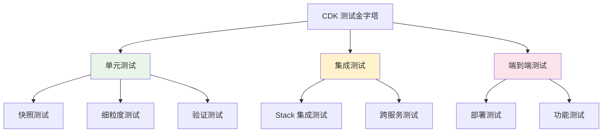

::: tip 学习目标
- 掌握 CDK 应用的单元测试编写方法
- 理解快照测试和细粒度测试的区别和用途
- 学会使用 CDK 内置的测试工具和断言
- 掌握 CDK 应用的调试技巧和故障排除方法
- 了解集成测试和端到端测试策略
:::

## 知识点总结

### CDK 测试概述

CDK 支持多种层次的测试，从单元测试到集成测试，确保基础设施代码的质量和可靠性。



### 测试类型说明

| 测试类型 | 用途 | 特点 | 执行速度 |
|----------|------|------|----------|
| 快照测试 | 检测意外变更 | 比较生成的 CloudFormation 模板 | 快 |
| 细粒度测试 | 验证特定属性 | 检查资源的具体配置 | 快 |
| 集成测试 | 测试组件交互 | 验证多个资源间的关系 | 中等 |
| 端到端测试 | 完整功能验证 | 实际部署和功能测试 | 慢 |

## 单元测试实战

### 测试环境搭建

```python
# requirements-dev.txt
pytest>=7.0.0
aws-cdk-lib>=2.50.0
constructs>=10.0.0
pytest-mock>=3.8.0

# 安装测试依赖
# pip install -r requirements-dev.txt
```

```python
# tests/__init__.py
# 空文件，使 tests 成为 Python 包
```

### 快照测试

快照测试是最基本的测试类型，用于检测 CloudFormation 模板的意外变更。

```python
# tests/unit/test_snapshot.py
import aws_cdk as core
import aws_cdk.assertions as assertions
from my_cdk_app.web_app_stack import WebAppStack

def test_snapshot():
    """快照测试 - 检测模板变更"""
    app = core.App()
    stack = WebAppStack(app, "TestWebAppStack")
    
    # 生成模板
    template = assertions.Template.from_stack(stack)
    
    # 快照断言 - 会生成一个快照文件进行比较
    template.template_matches({
        "AWSTemplateFormatVersion": "2010-09-09",
        "Resources": {
            # 这里会包含完整的资源定义
            # 首次运行会创建快照，后续运行会比较差异
        }
    })

def test_s3_bucket_snapshot():
    """S3 存储桶快照测试"""
    app = core.App()
    stack = WebAppStack(app, "TestStack")
    template = assertions.Template.from_stack(stack)
    
    # 验证包含 S3 存储桶
    template.has_resource_properties("AWS::S3::Bucket", {
        "VersioningConfiguration": {
            "Status": "Enabled"
        }
    })
```

### 细粒度测试

细粒度测试用于验证资源的特定属性和配置。

```python
# tests/unit/test_fine_grained.py
import aws_cdk as core
import aws_cdk.assertions as assertions
from my_cdk_app.web_app_stack import WebAppStack

class TestWebAppStack:
    def setup_method(self):
        """测试初始化"""
        self.app = core.App()
        self.stack = WebAppStack(self.app, "TestWebAppStack")
        self.template = assertions.Template.from_stack(self.stack)
    
    def test_s3_bucket_properties(self):
        """测试 S3 存储桶属性"""
        self.template.has_resource_properties("AWS::S3::Bucket", {
            "VersioningConfiguration": {
                "Status": "Enabled"
            },
            "BucketEncryption": {
                "ServerSideEncryptionConfiguration": [
                    {
                        "ServerSideEncryptionByDefault": {
                            "SSEAlgorithm": "AES256"
                        }
                    }
                ]
            }
        })
    
    def test_lambda_function_configuration(self):
        """测试 Lambda 函数配置"""
        self.template.has_resource_properties("AWS::Lambda::Function", {
            "Runtime": "python3.9",
            "Handler": "index.handler",
            "Timeout": 30,
            "Environment": {
                "Variables": {
                    "BUCKET_NAME": assertions.Match.any_value()
                }
            }
        })
    
    def test_resource_count(self):
        """测试资源数量"""
        self.template.resource_count_is("AWS::S3::Bucket", 1)
        self.template.resource_count_is("AWS::Lambda::Function", 2)
        self.template.resource_count_is("AWS::IAM::Role", 2)
    
    def test_iam_role_policies(self):
        """测试 IAM 角色策略"""
        self.template.has_resource_properties("AWS::IAM::Role", {
            "AssumeRolePolicyDocument": {
                "Statement": [
                    {
                        "Effect": "Allow",
                        "Principal": {
                            "Service": "lambda.amazonaws.com"
                        },
                        "Action": "sts:AssumeRole"
                    }
                ]
            }
        })
```

### 验证测试

验证测试用于检查资源之间的引用和依赖关系。

```python
# tests/unit/test_validation.py
import aws_cdk as core
import aws_cdk.assertions as assertions
from my_cdk_app.web_app_stack import WebAppStack

def test_lambda_s3_permissions():
    """验证 Lambda 函数是否有 S3 访问权限"""
    app = core.App()
    stack = WebAppStack(app, "TestStack")
    template = assertions.Template.from_stack(stack)
    
    # 检查是否有 Lambda 执行角色
    template.has_resource_properties("AWS::IAM::Role", {
        "AssumeRolePolicyDocument": {
            "Statement": assertions.Match.array_with([
                {
                    "Effect": "Allow",
                    "Principal": {
                        "Service": "lambda.amazonaws.com"
                    },
                    "Action": "sts:AssumeRole"
                }
            ])
        }
    })
    
    # 检查是否有 S3 访问策略
    template.has_resource_properties("AWS::IAM::Policy", {
        "PolicyDocument": {
            "Statement": assertions.Match.array_with([
                {
                    "Effect": "Allow",
                    "Action": [
                        "s3:GetObject",
                        "s3:PutObject"
                    ],
                    "Resource": assertions.Match.any_value()
                }
            ])
        }
    })

def test_api_gateway_lambda_integration():
    """验证 API Gateway 与 Lambda 的集成"""
    app = core.App()
    stack = WebAppStack(app, "TestStack")
    template = assertions.Template.from_stack(stack)
    
    # 检查 Lambda 权限
    template.has_resource_properties("AWS::Lambda::Permission", {
        "Action": "lambda:InvokeFunction",
        "Principal": "apigateway.amazonaws.com"
    })
```

## 高级测试技术

### 使用 Mock 和 Stub

```python
# tests/unit/test_with_mocks.py
import pytest
from unittest.mock import patch, Mock
import aws_cdk as core
from my_cdk_app.custom_construct import DatabaseConstruct

def test_database_construct_with_mock():
    """使用 Mock 测试自定义构造"""
    app = core.App()
    stack = core.Stack(app, "TestStack")
    
    with patch('boto3.client') as mock_client:
        # 模拟 RDS 客户端响应
        mock_rds = Mock()
        mock_rds.describe_db_instances.return_value = {
            'DBInstances': [
                {'DBInstanceStatus': 'available'}
            ]
        }
        mock_client.return_value = mock_rds
        
        # 创建构造
        db_construct = DatabaseConstruct(
            stack, 
            "TestDatabase",
            instance_type="db.t3.micro"
        )
        
        # 验证构造创建成功
        assert db_construct is not None
```

### 参数化测试

```python
# tests/unit/test_parameterized.py
import pytest
import aws_cdk as core
import aws_cdk.assertions as assertions
from my_cdk_app.web_app_stack import WebAppStack

@pytest.mark.parametrize("environment,expected_instance_count", [
    ("dev", 1),
    ("staging", 2),
    ("prod", 3)
])
def test_instance_count_by_environment(environment, expected_instance_count):
    """根据环境参数化测试实例数量"""
    app = core.App()
    stack = WebAppStack(
        app, 
        f"TestStack-{environment}",
        env_name=environment
    )
    
    template = assertions.Template.from_stack(stack)
    template.resource_count_is(
        "AWS::EC2::Instance", 
        expected_instance_count
    )

@pytest.mark.parametrize("runtime,handler", [
    ("python3.9", "index.handler"),
    ("nodejs18.x", "index.handler"),
    ("java11", "com.example.Handler")
])
def test_lambda_runtime_configurations(runtime, handler):
    """测试不同运行时的 Lambda 配置"""
    app = core.App()
    stack = WebAppStack(
        app, 
        "TestStack",
        lambda_runtime=runtime,
        lambda_handler=handler
    )
    
    template = assertions.Template.from_stack(stack)
    template.has_resource_properties("AWS::Lambda::Function", {
        "Runtime": runtime,
        "Handler": handler
    })
```

## 集成测试

### Stack 级别集成测试

```python
# tests/integration/test_stack_integration.py
import aws_cdk as core
import aws_cdk.assertions as assertions
from my_cdk_app.web_app_stack import WebAppStack
from my_cdk_app.database_stack import DatabaseStack

class TestStackIntegration:
    def setup_method(self):
        """集成测试初始化"""
        self.app = core.App()
        self.db_stack = DatabaseStack(self.app, "TestDatabaseStack")
        self.web_stack = WebAppStack(
            self.app, 
            "TestWebStack",
            database=self.db_stack.database
        )
    
    def test_cross_stack_references(self):
        """测试跨 Stack 引用"""
        web_template = assertions.Template.from_stack(self.web_stack)
        
        # 验证 Web Stack 引用了数据库
        web_template.has_resource_properties("AWS::Lambda::Function", {
            "Environment": {
                "Variables": {
                    "DB_HOST": assertions.Match.any_value(),
                    "DB_PORT": "5432"
                }
            }
        })
    
    def test_security_group_rules(self):
        """测试安全组规则"""
        db_template = assertions.Template.from_stack(self.db_stack)
        web_template = assertions.Template.from_stack(self.web_stack)
        
        # 验证数据库安全组允许来自 Web 层的访问
        db_template.has_resource_properties("AWS::EC2::SecurityGroupIngress", {
            "IpProtocol": "tcp",
            "FromPort": 5432,
            "ToPort": 5432
        })
```

### 应用级别集成测试

```python
# tests/integration/test_app_integration.py
import aws_cdk as core
from my_cdk_app.app import create_app

def test_complete_application():
    """测试完整应用程序"""
    app = create_app()
    
    # 合成所有 Stack
    assembly = app.synth()
    
    # 验证生成了预期的 Stack
    stack_names = [stack.stack_name for stack in assembly.stacks]
    expected_stacks = ["DatabaseStack", "WebAppStack", "MonitoringStack"]
    
    for expected in expected_stacks:
        assert any(expected in name for name in stack_names), f"Missing stack: {expected}"
    
    # 验证没有合成错误
    assert len(assembly.messages) == 0, f"Synthesis errors: {assembly.messages}"
```

## 调试技术

### CDK 调试工具

```python
# debug_utils.py
import json
import aws_cdk as core
from aws_cdk import assertions

def debug_stack_template(stack: core.Stack, output_file: str = None):
    """调试工具：输出 Stack 模板"""
    template = assertions.Template.from_stack(stack)
    template_json = template.to_json()
    
    if output_file:
        with open(output_file, 'w') as f:
            json.dump(template_json, f, indent=2)
        print(f"Template saved to {output_file}")
    else:
        print(json.dumps(template_json, indent=2))

def find_resource_by_type(stack: core.Stack, resource_type: str):
    """查找特定类型的资源"""
    template = assertions.Template.from_stack(stack)
    template_dict = template.to_json()
    
    resources = template_dict.get('Resources', {})
    found_resources = []
    
    for logical_id, resource in resources.items():
        if resource.get('Type') == resource_type:
            found_resources.append({
                'LogicalId': logical_id,
                'Type': resource_type,
                'Properties': resource.get('Properties', {})
            })
    
    return found_resources

# 使用示例
def test_debug_resources():
    app = core.App()
    stack = WebAppStack(app, "DebugStack")
    
    # 输出完整模板
    debug_stack_template(stack, "debug_template.json")
    
    # 查找所有 Lambda 函数
    lambdas = find_resource_by_type(stack, "AWS::Lambda::Function")
    print(f"Found {len(lambdas)} Lambda functions:")
    for lamb in lambdas:
        print(f"  - {lamb['LogicalId']}: {lamb['Properties'].get('Handler')}")
```

### 条件断点和日志

```python
# tests/unit/test_with_debugging.py
import logging
import aws_cdk as core
import aws_cdk.assertions as assertions
from my_cdk_app.web_app_stack import WebAppStack

# 配置日志
logging.basicConfig(level=logging.DEBUG)
logger = logging.getLogger(__name__)

def test_with_debugging():
    """带调试信息的测试"""
    logger.info("开始创建测试 Stack")
    
    app = core.App()
    stack = WebAppStack(app, "DebugTestStack")
    template = assertions.Template.from_stack(stack)
    
    logger.info("Stack 创建完成，开始验证资源")
    
    # 获取所有资源用于调试
    template_dict = template.to_json()
    resources = template_dict.get('Resources', {})
    
    logger.debug(f"总共创建了 {len(resources)} 个资源")
    for logical_id, resource in resources.items():
        logger.debug(f"  - {logical_id}: {resource['Type']}")
    
    # 执行实际测试
    template.resource_count_is("AWS::Lambda::Function", 1)
    logger.info("测试通过")
```

### 错误诊断工具

```python
# tests/utils/diagnostic_tools.py
import aws_cdk as core
import aws_cdk.assertions as assertions

class CDKDiagnostics:
    """CDK 诊断工具类"""
    
    def __init__(self, stack: core.Stack):
        self.stack = stack
        self.template = assertions.Template.from_stack(stack)
    
    def check_common_issues(self):
        """检查常见问题"""
        issues = []
        template_dict = self.template.to_json()
        
        # 检查是否有硬编码的 ARN
        issues.extend(self._check_hardcoded_arns(template_dict))
        
        # 检查是否有不安全的权限
        issues.extend(self._check_overpermissive_policies(template_dict))
        
        # 检查资源命名
        issues.extend(self._check_resource_naming(template_dict))
        
        return issues
    
    def _check_hardcoded_arns(self, template_dict):
        """检查硬编码的 ARN"""
        issues = []
        # 实现硬编码 ARN 检查逻辑
        return issues
    
    def _check_overpermissive_policies(self, template_dict):
        """检查过度权限的策略"""
        issues = []
        resources = template_dict.get('Resources', {})
        
        for logical_id, resource in resources.items():
            if resource.get('Type') == 'AWS::IAM::Policy':
                statements = resource.get('Properties', {}).get('PolicyDocument', {}).get('Statement', [])
                for statement in statements:
                    if statement.get('Resource') == '*' and statement.get('Effect') == 'Allow':
                        issues.append(f"Policy {logical_id} has overly broad permissions")
        
        return issues
    
    def _check_resource_naming(self, template_dict):
        """检查资源命名规范"""
        issues = []
        # 实现命名规范检查逻辑
        return issues

# 使用示例
def test_diagnostic_check():
    app = core.App()
    stack = WebAppStack(app, "DiagnosticTestStack")
    
    diagnostics = CDKDiagnostics(stack)
    issues = diagnostics.check_common_issues()
    
    if issues:
        print("发现的问题:")
        for issue in issues:
            print(f"  - {issue}")
        
        # 如果有严重问题，测试失败
        critical_issues = [i for i in issues if "overly broad permissions" in i]
        assert len(critical_issues) == 0, f"Critical security issues found: {critical_issues}"
    else:
        print("未发现问题")
```

## 测试最佳实践

### 1. 测试组织结构

```
tests/
├── unit/                 # 单元测试
│   ├── test_stacks.py   # Stack 测试
│   ├── test_constructs.py # 构造测试
│   └── test_utils.py    # 工具函数测试
├── integration/         # 集成测试
│   ├── test_app.py      # 应用级测试
│   └── test_cross_stack.py # 跨Stack测试
├── e2e/                 # 端到端测试
│   └── test_deployment.py
├── fixtures/            # 测试数据
│   └── sample_config.json
└── utils/               # 测试工具
    ├── __init__.py
    └── test_helpers.py
```

### 2. 测试配置

```python
# pytest.ini
[tool:pytest]
testpaths = tests
python_files = test_*.py
python_classes = Test*
python_functions = test_*
addopts = 
    -v
    --tb=short
    --strict-markers
    --disable-warnings
markers =
    unit: Unit tests
    integration: Integration tests
    e2e: End-to-end tests
    slow: Slow running tests
```

### 3. 测试数据管理

```python
# tests/fixtures/test_data.py
from dataclasses import dataclass
from typing import Dict, Any

@dataclass
class TestConfiguration:
    """测试配置数据类"""
    environment: str
    instance_count: int
    lambda_memory: int
    database_instance_type: str
    
    @classmethod
    def dev_config(cls):
        return cls(
            environment="dev",
            instance_count=1,
            lambda_memory=128,
            database_instance_type="db.t3.micro"
        )
    
    @classmethod
    def prod_config(cls):
        return cls(
            environment="prod",
            instance_count=3,
            lambda_memory=512,
            database_instance_type="db.r5.large"
        )

# 使用测试数据
def test_dev_configuration():
    config = TestConfiguration.dev_config()
    app = core.App()
    stack = WebAppStack(app, "TestStack", config=config)
    # 测试逻辑...
```

### 4. 持续集成配置

```yaml
# .github/workflows/test.yml
name: CDK Tests

on:
  push:
    branches: [ main, develop ]
  pull_request:
    branches: [ main ]

jobs:
  test:
    runs-on: ubuntu-latest
    
    steps:
    - uses: actions/checkout@v3
    
    - name: Set up Python
      uses: actions/setup-python@v4
      with:
        python-version: '3.9'
    
    - name: Set up Node.js
      uses: actions/setup-node@v3
      with:
        node-version: '18'
    
    - name: Install dependencies
      run: |
        npm install -g aws-cdk
        pip install -r requirements.txt
        pip install -r requirements-dev.txt
    
    - name: Run unit tests
      run: pytest tests/unit -v --cov=my_cdk_app
    
    - name: Run integration tests
      run: pytest tests/integration -v
      if: github.event_name == 'push'
    
    - name: CDK synth check
      run: cdk synth --all
      env:
        AWS_DEFAULT_REGION: us-east-1
```

::: tip 测试最佳实践总结
1. **测试金字塔**：大量单元测试 + 适量集成测试 + 少量端到端测试
2. **快速反馈**：优先执行快速的单元测试
3. **隔离测试**：每个测试应该独立，不依赖其他测试的状态
4. **有意义的断言**：测试应该验证业务逻辑，而不仅仅是技术实现
5. **持续维护**：随着代码变更，及时更新测试用例
:::

## 故障排除指南

### 常见测试问题

| 问题 | 原因 | 解决方案 |
|------|------|----------|
| 模板比较失败 | 资源顺序或格式不匹配 | 使用 `Match.any_value()` 或更宽泛的匹配 |
| 资源计数不正确 | 隐式创建的资源 | 检查 CDK 自动创建的资源（如 IAM 角色） |
| 权限测试失败 | 策略文档格式复杂 | 使用 `assertions.Match.array_with()` |
| 测试运行缓慢 | 大量资源创建 | 使用 Mock 和 Stub 减少真实资源创建 |

### 调试步骤

1. **输出模板**：使用 `cdk synth` 查看生成的 CloudFormation 模板
2. **逐步验证**：从简单的资源计数开始，逐步增加断言复杂度
3. **使用日志**：在测试中添加详细的日志输出
4. **隔离问题**：创建最小化的测试用例重现问题
5. **查阅文档**：参考 CDK 和 CloudFormation 文档确认预期行为

通过本章学习，你应该能够为 CDK 应用编写全面的测试，确保基础设施代码的质量和可靠性。