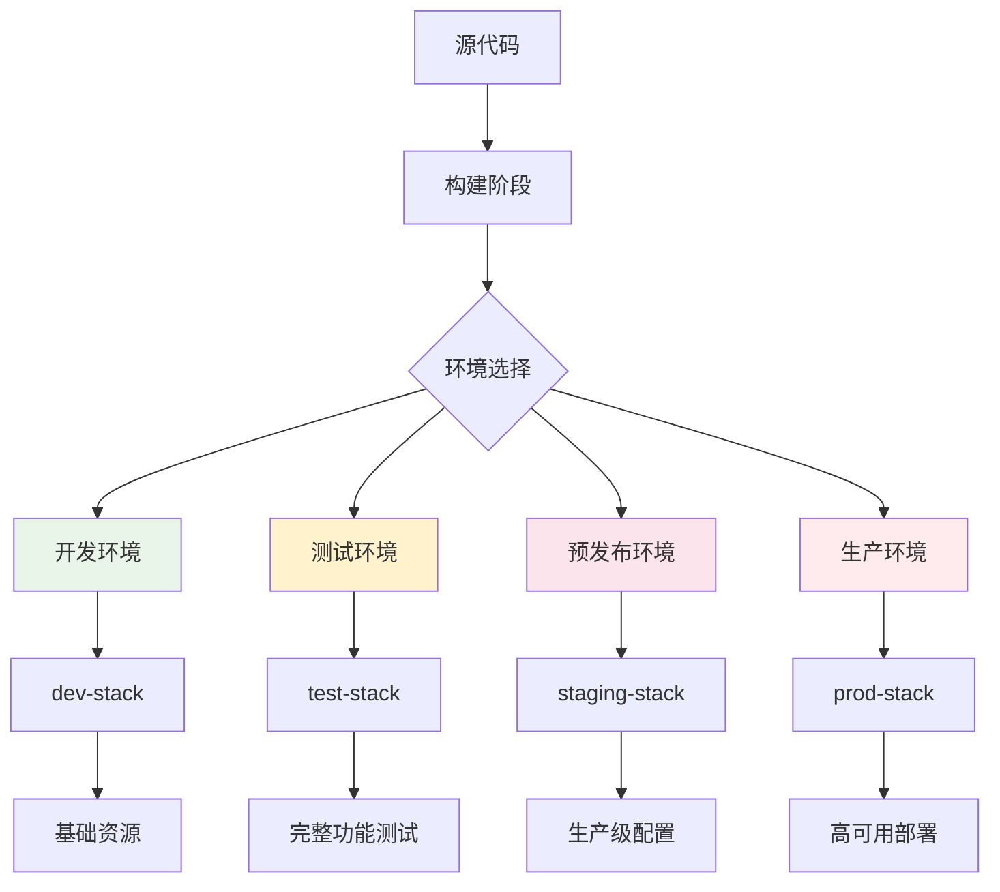

# 第 7 章：部署策略与环境管理

::: tip 学习目标
- 掌握 CDK 多环境部署策略和最佳实践
- 理解 CDK 应用的生命周期管理
- 学会使用 CDK Pipelines 实现 CI/CD
- 掌握配置管理和参数化部署
- 了解蓝绿部署、金丝雀发布等高级部署策略
:::

## 知识点总结

### 环境管理概述

在企业级应用中，通常需要管理多个环境：开发(dev)、测试(test)、预发布(staging)、生产(prod)。CDK 提供了灵活的机制来管理这些不同环境的差异。



### 环境差异化配置

```python
# config/environments.py
from dataclasses import dataclass
from typing import Dict, List, Optional
import aws_cdk as cdk

@dataclass
class EnvironmentConfig:
    """环境配置数据类"""
    name: str
    account: str
    region: str
    
    # 基础设施配置
    instance_count: int
    instance_type: str
    database_instance_type: str
    
    # Lambda 配置
    lambda_memory: int
    lambda_timeout: int
    
    # 网络配置
    vpc_cidr: str
    enable_nat_gateway: bool
    
    # 监控和日志
    enable_detailed_monitoring: bool
    log_retention_days: int
    
    # 安全配置
    enable_encryption: bool
    backup_retention_days: int
    
    # 标签
    tags: Dict[str, str]

class EnvironmentFactory:
    """环境配置工厂"""
    
    @staticmethod
    def get_config(env_name: str) -> EnvironmentConfig:
        configs = {
            'dev': EnvironmentConfig(
                name='dev',
                account='123456789012',
                region='us-east-1',
                instance_count=1,
                instance_type='t3.micro',
                database_instance_type='db.t3.micro',
                lambda_memory=128,
                lambda_timeout=30,
                vpc_cidr='10.0.0.0/16',
                enable_nat_gateway=False,
                enable_detailed_monitoring=False,
                log_retention_days=7,
                enable_encryption=False,
                backup_retention_days=7,
                tags={
                    'Environment': 'dev',
                    'Project': 'web-app',
                    'Owner': 'dev-team'
                }
            ),
            'staging': EnvironmentConfig(
                name='staging',
                account='123456789012',
                region='us-east-1',
                instance_count=2,
                instance_type='t3.small',
                database_instance_type='db.t3.small',
                lambda_memory=256,
                lambda_timeout=60,
                vpc_cidr='10.1.0.0/16',
                enable_nat_gateway=True,
                enable_detailed_monitoring=True,
                log_retention_days=30,
                enable_encryption=True,
                backup_retention_days=14,
                tags={
                    'Environment': 'staging',
                    'Project': 'web-app',
                    'Owner': 'dev-team'
                }
            ),
            'prod': EnvironmentConfig(
                name='prod',
                account='987654321098',
                region='us-east-1',
                instance_count=3,
                instance_type='t3.medium',
                database_instance_type='db.r5.large',
                lambda_memory=512,
                lambda_timeout=120,
                vpc_cidr='10.2.0.0/16',
                enable_nat_gateway=True,
                enable_detailed_monitoring=True,
                log_retention_days=365,
                enable_encryption=True,
                backup_retention_days=30,
                tags={
                    'Environment': 'prod',
                    'Project': 'web-app',
                    'Owner': 'ops-team',
                    'CostCenter': 'engineering'
                }
            )
        }
        
        if env_name not in configs:
            raise ValueError(f"Unknown environment: {env_name}")
        
        return configs[env_name]
```

## 参数化 Stack 设计

### 配置驱动的 Stack

```python
# stacks/configurable_web_stack.py
import aws_cdk as cdk
from aws_cdk import (
    aws_ec2 as ec2,
    aws_rds as rds,
    aws_lambda as lambda_,
    aws_apigateway as apigateway,
    aws_s3 as s3,
    aws_cloudwatch as cloudwatch
)
from constructs import Construct
from config.environments import EnvironmentConfig

class ConfigurableWebStack(cdk.Stack):
    """可配置的 Web 应用 Stack"""
    
    def __init__(self, scope: Construct, construct_id: str, 
                 config: EnvironmentConfig, **kwargs) -> None:
        
        # 设置环境
        env = cdk.Environment(
            account=config.account,
            region=config.region
        )
        super().__init__(scope, construct_id, env=env, **kwargs)
        
        self.config = config
        
        # 应用标签
        for key, value in config.tags.items():
            cdk.Tags.of(self).add(key, value)
        
        # 创建 VPC
        self.vpc = self._create_vpc()
        
        # 创建数据库
        self.database = self._create_database()
        
        # 创建 Lambda 函数
        self.lambda_function = self._create_lambda()
        
        # 创建 API Gateway
        self.api = self._create_api_gateway()
        
        # 创建 S3 存储桶
        self.bucket = self._create_s3_bucket()
        
        # 创建监控
        if config.enable_detailed_monitoring:
            self._create_monitoring()
    
    def _create_vpc(self) -> ec2.Vpc:
        """创建 VPC"""
        return ec2.Vpc(
            self, 
            "VPC",
            ip_addresses=ec2.IpAddresses.cidr(self.config.vpc_cidr),
            max_azs=2,
            nat_gateways=1 if self.config.enable_nat_gateway else 0,
            subnet_configuration=[
                ec2.SubnetConfiguration(
                    cidr_mask=24,
                    name="Public",
                    subnet_type=ec2.SubnetType.PUBLIC
                ),
                ec2.SubnetConfiguration(
                    cidr_mask=24,
                    name="Private",
                    subnet_type=ec2.SubnetType.PRIVATE_WITH_EGRESS if self.config.enable_nat_gateway 
                              else ec2.SubnetType.PRIVATE_ISOLATED
                )
            ]
        )
    
    def _create_database(self) -> rds.DatabaseInstance:
        """创建 RDS 数据库"""
        # 数据库安全组
        db_security_group = ec2.SecurityGroup(
            self, 
            "DatabaseSecurityGroup",
            vpc=self.vpc,
            description="Security group for RDS database",
            allow_all_outbound=False
        )
        
        # 创建数据库子网组
        subnet_group = rds.SubnetGroup(
            self,
            "DatabaseSubnetGroup",
            description="Subnet group for RDS database",
            vpc=self.vpc,
            vpc_subnets=ec2.SubnetSelection(
                subnet_type=ec2.SubnetType.PRIVATE_ISOLATED
            )
        )
        
        return rds.DatabaseInstance(
            self,
            "Database",
            engine=rds.DatabaseInstanceEngine.postgres(
                version=rds.PostgresEngineVersion.VER_13_7
            ),
            instance_type=ec2.InstanceType(self.config.database_instance_type),
            vpc=self.vpc,
            subnet_group=subnet_group,
            security_groups=[db_security_group],
            database_name="webapp",
            credentials=rds.Credentials.from_generated_secret("dbuser"),
            storage_encrypted=self.config.enable_encryption,
            monitoring_interval=cdk.Duration.seconds(60) if self.config.enable_detailed_monitoring else None,
            backup_retention=cdk.Duration.days(self.config.backup_retention_days),
            deletion_protection=self.config.name == 'prod'
        )
    
    def _create_lambda(self) -> lambda_.Function:
        """创建 Lambda 函数"""
        # Lambda 安全组
        lambda_security_group = ec2.SecurityGroup(
            self,
            "LambdaSecurityGroup",
            vpc=self.vpc,
            description="Security group for Lambda function"
        )
        
        # 允许 Lambda 访问数据库
        self.database.connections.allow_default_port_from(lambda_security_group)
        
        return lambda_.Function(
            self,
            "WebFunction",
            runtime=lambda_.Runtime.PYTHON_3_9,
            handler="app.handler",
            code=lambda_.Code.from_asset("lambda"),
            vpc=self.vpc,
            security_groups=[lambda_security_group],
            memory_size=self.config.lambda_memory,
            timeout=cdk.Duration.seconds(self.config.lambda_timeout),
            environment={
                "DB_HOST": self.database.instance_endpoint.hostname,
                "DB_PORT": self.database.instance_endpoint.port,
                "DB_NAME": "webapp",
                "ENVIRONMENT": self.config.name
            },
            log_retention=getattr(cdk.aws_logs.RetentionDays, f"_{self.config.log_retention_days}_DAYS")
        )
    
    def _create_api_gateway(self) -> apigateway.RestApi:
        """创建 API Gateway"""
        api = apigateway.RestApi(
            self,
            "WebAPI",
            rest_api_name=f"{self.config.name}-web-api",
            description=f"Web API for {self.config.name} environment",
            deploy_options=apigateway.StageOptions(
                stage_name=self.config.name,
                throttling_rate_limit=100 if self.config.name != 'prod' else 1000,
                throttling_burst_limit=200 if self.config.name != 'prod' else 2000,
                logging_level=apigateway.MethodLoggingLevel.INFO if self.config.enable_detailed_monitoring 
                             else apigateway.MethodLoggingLevel.ERROR
            )
        )
        
        # 创建 Lambda 集成
        lambda_integration = apigateway.LambdaIntegration(
            self.lambda_function,
            request_templates={"application/json": '{ "statusCode": "200" }'}
        )
        
        # 添加资源和方法
        api.root.add_method("ANY", lambda_integration)
        api.root.add_proxy(default_integration=lambda_integration)
        
        return api
    
    def _create_s3_bucket(self) -> s3.Bucket:
        """创建 S3 存储桶"""
        return s3.Bucket(
            self,
            "WebAssets",
            bucket_name=f"{self.config.name}-web-assets-{self.account}",
            versioned=True,
            encryption=s3.BucketEncryption.S3_MANAGED if self.config.enable_encryption 
                      else s3.BucketEncryption.UNENCRYPTED,
            lifecycle_rules=[
                s3.LifecycleRule(
                    id="DeleteOldVersions",
                    enabled=True,
                    noncurrent_version_expiration=cdk.Duration.days(30)
                )
            ],
            removal_policy=cdk.RemovalPolicy.DESTROY if self.config.name != 'prod' 
                          else cdk.RemovalPolicy.RETAIN
        )
    
    def _create_monitoring(self):
        """创建监控资源"""
        # 创建 CloudWatch Dashboard
        dashboard = cloudwatch.Dashboard(
            self,
            "WebAppDashboard",
            dashboard_name=f"{self.config.name}-webapp-dashboard"
        )
        
        # Lambda 监控
        dashboard.add_widgets(
            cloudwatch.GraphWidget(
                title="Lambda Invocations",
                left=[self.lambda_function.metric_invocations()],
                right=[self.lambda_function.metric_errors()]
            ),
            cloudwatch.GraphWidget(
                title="Lambda Duration",
                left=[self.lambda_function.metric_duration()]
            )
        )
        
        # API Gateway 监控
        dashboard.add_widgets(
            cloudwatch.GraphWidget(
                title="API Gateway Requests",
                left=[self.api.metric_count()],
                right=[self.api.metric_client_error(), self.api.metric_server_error()]
            )
        )
        
        # 数据库监控
        dashboard.add_widgets(
            cloudwatch.GraphWidget(
                title="Database Connections",
                left=[self.database.metric_database_connections()]
            )
        )
```

### 应用程序入口

```python
# app.py
#!/usr/bin/env python3
import os
import aws_cdk as cdk
from stacks.configurable_web_stack import ConfigurableWebStack
from config.environments import EnvironmentFactory

def main():
    """主函数"""
    app = cdk.App()
    
    # 从环境变量或上下文获取环境名称
    env_name = app.node.try_get_context("environment") or os.environ.get("ENVIRONMENT", "dev")
    
    # 获取环境配置
    config = EnvironmentFactory.get_config(env_name)
    
    # 创建 Stack
    ConfigurableWebStack(
        app, 
        f"WebApp-{config.name}",
        config=config,
        description=f"Web application stack for {config.name} environment"
    )
    
    app.synth()

if __name__ == "__main__":
    main()
```

## CDK Pipelines 实现 CI/CD

### Pipeline Stack

```python
# stacks/pipeline_stack.py
import aws_cdk as cdk
from aws_cdk import (
    pipelines,
    aws_codecommit as codecommit,
    aws_codebuild as codebuild,
    aws_iam as iam
)
from constructs import Construct
from .configurable_web_stack import ConfigurableWebStack
from config.environments import EnvironmentFactory

class WebAppPipelineStack(cdk.Stack):
    """Web 应用 CI/CD Pipeline"""
    
    def __init__(self, scope: Construct, construct_id: str, **kwargs) -> None:
        super().__init__(scope, construct_id, **kwargs)
        
        # 创建代码仓库
        repo = codecommit.Repository(
            self,
            "WebAppRepo",
            repository_name="web-app-cdk",
            description="Web application CDK code repository"
        )
        
        # 创建 Pipeline
        pipeline = pipelines.CodePipeline(
            self,
            "WebAppPipeline",
            pipeline_name="web-app-pipeline",
            synth=pipelines.ShellStep(
                "Synth",
                input=pipelines.CodePipelineSource.code_commit(repo, "main"),
                commands=[
                    "npm install -g aws-cdk",
                    "pip install -r requirements.txt",
                    "cdk synth"
                ]
            ),
            code_build_defaults=pipelines.CodeBuildOptions(
                build_environment=codebuild.BuildEnvironment(
                    build_image=codebuild.LinuxBuildImage.STANDARD_5_0,
                    compute_type=codebuild.ComputeType.SMALL
                ),
                role_policy=[
                    iam.PolicyStatement(
                        effect=iam.Effect.ALLOW,
                        actions=[
                            "ssm:GetParameter",
                            "ssm:GetParameters",
                            "kms:Decrypt"
                        ],
                        resources=["*"]
                    )
                ]
            )
        )
        
        # 开发环境阶段
        dev_stage = WebAppStage(self, "Dev", env_name="dev")
        dev_deployment = pipeline.add_stage(dev_stage)
        
        # 添加开发环境测试
        dev_deployment.add_post([
            pipelines.ShellStep(
                "DevIntegrationTests",
                commands=[
                    "pip install -r requirements-test.txt",
                    "pytest tests/integration/ -v"
                ],
                env_from_cfn_outputs={
                    "API_URL": dev_stage.api_url
                }
            )
        ])
        
        # 预发布环境阶段
        staging_stage = WebAppStage(self, "Staging", env_name="staging")
        staging_deployment = pipeline.add_stage(staging_stage)
        
        # 添加预发布环境测试
        staging_deployment.add_post([
            pipelines.ShellStep(
                "StagingLoadTests",
                commands=[
                    "pip install locust",
                    "locust --headless --users 10 --spawn-rate 2 --run-time 1m --host $API_URL"
                ],
                env_from_cfn_outputs={
                    "API_URL": staging_stage.api_url
                }
            )
        ])
        
        # 生产环境阶段（需要手动批准）
        prod_stage = WebAppStage(self, "Prod", env_name="prod")
        prod_deployment = pipeline.add_stage(
            prod_stage,
            pre=[
                pipelines.ManualApprovalStep("PromoteToProd")
            ]
        )
        
        # 生产环境部署后验证
        prod_deployment.add_post([
            pipelines.ShellStep(
                "ProdSmokeTests",
                commands=[
                    "curl -f $API_URL/health || exit 1",
                    "echo 'Production deployment successful'"
                ],
                env_from_cfn_outputs={
                    "API_URL": prod_stage.api_url
                }
            )
        ])

class WebAppStage(cdk.Stage):
    """Web 应用部署阶段"""
    
    def __init__(self, scope: Construct, construct_id: str, 
                 env_name: str, **kwargs) -> None:
        
        config = EnvironmentFactory.get_config(env_name)
        env = cdk.Environment(account=config.account, region=config.region)
        
        super().__init__(scope, construct_id, env=env, **kwargs)
        
        # 创建 Web App Stack
        web_stack = ConfigurableWebStack(
            self,
            f"WebApp-{env_name}",
            config=config
        )
        
        # 输出 API URL 供后续阶段使用
        self.api_url = cdk.CfnOutput(
            web_stack,
            "ApiUrl",
            value=web_stack.api.url,
            export_name=f"WebApp-{env_name}-ApiUrl"
        )
```

### 部署配置

```python
# cdk.json
{
  "app": "python app.py",
  "watch": {
    "include": [
      "**"
    ],
    "exclude": [
      "README.md",
      "cdk*.json",
      "requirements*.txt",
      "source.bat",
      "**/__pycache__",
      "**/*.pyc"
    ]
  },
  "context": {
    "@aws-cdk/aws-lambda:recognizeLayerVersion": true,
    "@aws-cdk/core:checkSecretUsage": true,
    "@aws-cdk/core:target": "aws-cdk-lib",
    "@aws-cdk-containers/ecs-service-extensions:enableDefaultLogDriver": true,
    "@aws-cdk/aws-ec2:uniqueImdsv2TemplateName": true,
    "@aws-cdk/aws-ecs:arnFormatIncludesClusterName": true,
    "@aws-cdk/aws-iam:minimizePolicies": true,
    "@aws-cdk/core:validateSnapshotRemovalPolicy": true,
    "@aws-cdk/aws-codepipeline:crossAccountKeyAliasStackSafeResourceName": true,
    "@aws-cdk/aws-s3:createDefaultLoggingPolicy": true,
    "@aws-cdk/aws-sns-subscriptions:restrictSqsDescryption": true,
    "@aws-cdk/aws-apigateway:disableCloudWatchRole": true,
    "@aws-cdk/core:enablePartitionLiterals": true,
    "@aws-cdk/aws-events:eventsTargetQueueSameAccount": true,
    "@aws-cdk/aws-iam:standardizedServicePrincipals": true,
    "@aws-cdk/aws-ecs:disableExplicitDeploymentControllerForCircuitBreaker": true,
    "@aws-cdk/aws-iam:importedRoleStackSafeDefaultPolicyName": true,
    "@aws-cdk/aws-s3:serverAccessLogsUseBucketPolicy": true,
    "@aws-cdk/aws-route53-patters:useCertificate": true,
    "@aws-cdk/customresources:installLatestAwsSdkDefault": false,
    "@aws-cdk/aws-rds:databaseProxyUniqueResourceName": true,
    "@aws-cdk/aws-codedeploy:removeAlarmsFromDeploymentGroup": true,
    "@aws-cdk/aws-apigateway:authorizerChangeDeploymentLogicalId": true,
    "@aws-cdk/aws-ec2:launchTemplateDefaultUserData": true,
    "@aws-cdk/aws-secretsmanager:useAttachedSecretResourcePolicyForSecretTargetAttachments": true,
    "@aws-cdk/aws-redshift:columnId": true,
    "@aws-cdk/aws-stepfunctions-tasks:enableLoggingForLambdaInvoke": true,
    "@aws-cdk/aws-ec2:restrictDefaultSecurityGroup": true,
    "@aws-cdk/aws-apigateway:requestValidatorUniqueId": true,
    "@aws-cdk/aws-kms:aliasNameRef": true,
    "@aws-cdk/aws-autoscaling:generateLaunchTemplateInsteadOfLaunchConfig": true,
    "@aws-cdk/core:includePrefixInUniqueNameGeneration": true,
    "@aws-cdk/aws-efs:denyAnonymousAccess": true,
    "@aws-cdk/aws-opensearchservice:enableOpensearchMultiAzWithStandby": true,
    "@aws-cdk/aws-lambda-nodejs:useLatestRuntimeVersion": true,
    "@aws-cdk/aws-efs:mountTargetOrderInsensitiveLogicalId": true,
    "@aws-cdk/aws-rds:auroraClusterChangeScopeOfInstanceParameterGroupWithEachParameters": true,
    "@aws-cdk/aws-appsync:useArnForSourceApiAssociationIdentifier": true,
    "@aws-cdk/aws-rds:preventRenderingDeprecatedCredentials": true,
    "@aws-cdk/aws-codepipeline-actions:betaFeatures": true,
    "@aws-cdk/aws-redshift:createClusterSubnetGroupDefaultRolePermsToPublicSchema": true
  }
}
```

## 高级部署策略

### 蓝绿部署

```python
# stacks/blue_green_deployment.py
import aws_cdk as cdk
from aws_cdk import (
    aws_lambda as lambda_,
    aws_codedeploy as codedeploy,
    aws_apigateway as apigateway,
    aws_cloudwatch as cloudwatch,
    aws_iam as iam
)
from constructs import Construct

class BlueGreenDeploymentStack(cdk.Stack):
    """蓝绿部署 Stack"""
    
    def __init__(self, scope: Construct, construct_id: str, **kwargs) -> None:
        super().__init__(scope, construct_id, **kwargs)
        
        # Lambda 函数
        self.lambda_function = lambda_.Function(
            self,
            "WebFunction",
            runtime=lambda_.Runtime.PYTHON_3_9,
            handler="app.handler",
            code=lambda_.Code.from_asset("lambda"),
            memory_size=256,
            timeout=cdk.Duration.seconds(30)
        )
        
        # Lambda 别名
        live_alias = lambda_.Alias(
            self,
            "LiveAlias",
            alias_name="live",
            version=self.lambda_function.current_version
        )
        
        # CodeDeploy 应用
        application = codedeploy.LambdaApplication(
            self,
            "DeploymentApplication",
            application_name="web-app-deployment"
        )
        
        # 部署配置
        deployment_config = codedeploy.LambdaDeploymentConfig.ALL_AT_ONCE_CODEDEPLOY_LAMBDA
        
        # 如果需要渐进式部署
        if self.node.try_get_context("canary_deployment"):
            deployment_config = codedeploy.LambdaDeploymentConfig.CANARY_10_PERCENT_30_MINUTES
        
        # 部署组
        deployment_group = codedeploy.LambdaDeploymentGroup(
            self,
            "DeploymentGroup",
            application=application,
            alias=live_alias,
            deployment_config=deployment_config,
            # 自动回滚配置
            auto_rollback=codedeploy.AutoRollbackConfig(
                failed_deployment=True,
                stopped_deployment=True,
                deployment_in_alarm=True
            ),
            # CloudWatch 告警
            alarms=[
                cloudwatch.Alarm(
                    self,
                    "ErrorAlarm",
                    metric=self.lambda_function.metric_errors(),
                    threshold=5,
                    evaluation_periods=2,
                    datapoints_to_alarm=2
                ),
                cloudwatch.Alarm(
                    self,
                    "DurationAlarm",
                    metric=self.lambda_function.metric_duration(),
                    threshold=5000,  # 5 seconds
                    evaluation_periods=2,
                    datapoints_to_alarm=2
                )
            ]
        )
        
        # API Gateway 指向别名
        api = apigateway.RestApi(
            self,
            "WebAPI",
            rest_api_name="web-api"
        )
        
        integration = apigateway.LambdaIntegration(live_alias)
        api.root.add_method("ANY", integration)
        api.root.add_proxy(default_integration=integration)
        
        # 输出
        cdk.CfnOutput(
            self,
            "ApiUrl",
            value=api.url,
            description="API Gateway URL"
        )
        
        cdk.CfnOutput(
            self,
            "DeploymentGroup",
            value=deployment_group.deployment_group_name,
            description="CodeDeploy deployment group name"
        )
```

### 金丝雀发布

```python
# stacks/canary_deployment.py
import aws_cdk as cdk
from aws_cdk import (
    aws_lambda as lambda_,
    aws_apigateway as apigateway,
    aws_cloudwatch as cloudwatch,
    aws_synthetics as synthetics,
    aws_iam as iam
)
from constructs import Construct

class CanaryDeploymentStack(cdk.Stack):
    """金丝雀发布 Stack"""
    
    def __init__(self, scope: Construct, construct_id: str, **kwargs) -> None:
        super().__init__(scope, construct_id, **kwargs)
        
        # 生产版本 Lambda
        prod_function = lambda_.Function(
            self,
            "ProdFunction",
            runtime=lambda_.Runtime.PYTHON_3_9,
            handler="app.handler",
            code=lambda_.Code.from_asset("lambda/prod"),
            memory_size=256,
            timeout=cdk.Duration.seconds(30),
            environment={
                "VERSION": "prod"
            }
        )
        
        # 金丝雀版本 Lambda
        canary_function = lambda_.Function(
            self,
            "CanaryFunction",
            runtime=lambda_.Runtime.PYTHON_3_9,
            handler="app.handler",
            code=lambda_.Code.from_asset("lambda/canary"),
            memory_size=256,
            timeout=cdk.Duration.seconds(30),
            environment={
                "VERSION": "canary"
            }
        )
        
        # API Gateway 带权重路由
        api = apigateway.RestApi(
            self,
            "CanaryAPI",
            rest_api_name="canary-api",
            description="API with canary deployment"
        )
        
        # 创建部署阶段
        prod_deployment = apigateway.Deployment(
            self,
            "ProdDeployment",
            api=api,
            description="Production deployment"
        )
        
        canary_deployment = apigateway.Deployment(
            self,
            "CanaryDeployment",
            api=api,
            description="Canary deployment"
        )
        
        # 生产阶段
        prod_stage = apigateway.Stage(
            self,
            "ProdStage",
            deployment=prod_deployment,
            stage_name="prod"
        )
        
        # 金丝雀阶段（10% 流量）
        canary_stage = apigateway.Stage(
            self,
            "CanaryStage",
            deployment=canary_deployment,
            stage_name="canary",
            canary_settings=apigateway.CanarySettings(
                percent_traffic=10,
                stage_variables={
                    "lambdaAlias": "canary"
                }
            )
        )
        
        # Lambda 集成
        prod_integration = apigateway.LambdaIntegration(prod_function)
        canary_integration = apigateway.LambdaIntegration(canary_function)
        
        # 添加路由
        api.root.add_method("ANY", prod_integration)
        api.root.add_proxy(default_integration=prod_integration)
        
        # CloudWatch Synthetics 监控
        canary_role = iam.Role(
            self,
            "CanaryRole",
            assumed_by=iam.ServicePrincipal("lambda.amazonaws.com"),
            managed_policies=[
                iam.ManagedPolicy.from_aws_managed_policy_name("service-role/AWSLambdaBasicExecutionRole")
            ]
        )
        
        # 创建 Synthetics Canary 进行持续监控
        synthetic_canary = synthetics.Canary(
            self,
            "ApiCanary",
            canary_name="web-api-canary",
            schedule=synthetics.Schedule.rate(cdk.Duration.minutes(5)),
            test=synthetics.Test.custom(
                code=synthetics.Code.from_inline("""
                const synthetics = require('Synthetics');
                const log = require('SyntheticsLogger');
                
                const checkApiHealth = async function () {
                    const url = process.env.API_URL + '/health';
                    const response = await synthetics.getPage(url);
                    
                    if (response.status !== 200) {
                        throw new Error(`API health check failed with status: ${response.status}`);
                    }
                    
                    log.info('API health check passed');
                };
                
                exports.handler = async () => {
                    return await synthetics.executeStep('checkApiHealth', checkApiHealth);
                };
                """),
                handler="index.handler"
            ),
            runtime=synthetics.Runtime.SYNTHETICS_NODEJS_PUPPETEER_3_1,
            environment_variables={
                "API_URL": api.url
            },
            role=canary_role
        )
        
        # CloudWatch 告警
        error_alarm = cloudwatch.Alarm(
            self,
            "CanaryErrorAlarm",
            alarm_name="canary-error-alarm",
            metric=canary_function.metric_errors(),
            threshold=3,
            evaluation_periods=2,
            datapoints_to_alarm=2,
            alarm_description="Canary deployment error rate too high"
        )
        
        # 自动回滚 Lambda（简化版）
        rollback_function = lambda_.Function(
            self,
            "RollbackFunction",
            runtime=lambda_.Runtime.PYTHON_3_9,
            handler="rollback.handler",
            code=lambda_.Code.from_inline("""
import boto3
import json

def handler(event, context):
    # 简化的自动回滚逻辑
    apigateway = boto3.client('apigateway')
    
    # 获取告警详情
    alarm_data = json.loads(event['Records'][0]['Sns']['Message'])
    
    if alarm_data['NewStateValue'] == 'ALARM':
        # 执行回滚：移除金丝雀部署
        # 实际实现需要更复杂的逻辑
        print("Triggering canary rollback...")
        
        # 这里应该调用 API Gateway API 来调整流量分配
        # 或者触发 CodeDeploy 回滚
        
    return {
        'statusCode': 200,
        'body': json.dumps('Rollback handler executed')
    }
            """),
            timeout=cdk.Duration.seconds(60)
        )
        
        # 输出
        cdk.CfnOutput(
            self,
            "ProdApiUrl",
            value=f"{api.url}prod/",
            description="Production API URL"
        )
        
        cdk.CfnOutput(
            self,
            "CanaryApiUrl", 
            value=f"{api.url}canary/",
            description="Canary API URL"
        )
```

## 部署脚本和自动化

### 环境部署脚本

```python
# scripts/deploy.py
#!/usr/bin/env python3
"""
CDK 部署脚本
支持多环境部署和配置验证
"""

import argparse
import boto3
import subprocess
import sys
import json
from typing import Dict, List, Optional

class CDKDeployer:
    """CDK 部署器"""
    
    def __init__(self, environment: str, region: str = "us-east-1"):
        self.environment = environment
        self.region = region
        self.session = boto3.Session(region_name=region)
        
    def validate_environment(self) -> bool:
        """验证环境配置"""
        try:
            # 验证 AWS 凭证
            sts = self.session.client('sts')
            identity = sts.get_caller_identity()
            print(f"部署账户: {identity['Account']}")
            
            # 验证环境配置文件
            from config.environments import EnvironmentFactory
            config = EnvironmentFactory.get_config(self.environment)
            print(f"环境配置: {config.name} ({config.account})")
            
            return True
            
        except Exception as e:
            print(f"环境验证失败: {e}")
            return False
    
    def bootstrap_if_needed(self) -> bool:
        """如果需要则执行 Bootstrap"""
        try:
            # 检查是否已经 Bootstrap
            cf = self.session.client('cloudformation')
            stacks = cf.list_stacks(
                StackStatusFilter=['CREATE_COMPLETE', 'UPDATE_COMPLETE']
            )
            
            bootstrap_exists = any(
                stack['StackName'].startswith('CDKToolkit') 
                for stack in stacks['StackSummaries']
            )
            
            if not bootstrap_exists:
                print("执行 CDK Bootstrap...")
                result = subprocess.run([
                    'cdk', 'bootstrap',
                    '--region', self.region
                ], capture_output=True, text=True)
                
                if result.returncode != 0:
                    print(f"Bootstrap 失败: {result.stderr}")
                    return False
                    
                print("Bootstrap 完成")
            else:
                print("Bootstrap 已存在，跳过")
                
            return True
            
        except Exception as e:
            print(f"Bootstrap 检查失败: {e}")
            return False
    
    def synth(self) -> bool:
        """合成 CloudFormation 模板"""
        try:
            print("合成 CDK 应用...")
            result = subprocess.run([
                'cdk', 'synth',
                '--context', f'environment={self.environment}'
            ], capture_output=True, text=True)
            
            if result.returncode != 0:
                print(f"合成失败: {result.stderr}")
                return False
                
            print("合成成功")
            return True
            
        except Exception as e:
            print(f"合成异常: {e}")
            return False
    
    def diff(self) -> bool:
        """显示部署差异"""
        try:
            print("检查部署差异...")
            result = subprocess.run([
                'cdk', 'diff',
                '--context', f'environment={self.environment}'
            ], capture_output=True, text=True)
            
            print(result.stdout)
            if result.stderr:
                print(f"警告: {result.stderr}")
                
            return True
            
        except Exception as e:
            print(f"差异检查异常: {e}")
            return False
    
    def deploy(self, require_approval: bool = True) -> bool:
        """部署应用"""
        try:
            print(f"部署到 {self.environment} 环境...")
            
            cmd = [
                'cdk', 'deploy',
                '--context', f'environment={self.environment}',
                '--all'
            ]
            
            if not require_approval:
                cmd.append('--require-approval=never')
            
            result = subprocess.run(cmd, text=True)
            
            if result.returncode != 0:
                print("部署失败")
                return False
                
            print("部署成功")
            return True
            
        except Exception as e:
            print(f"部署异常: {e}")
            return False
    
    def destroy(self, force: bool = False) -> bool:
        """销毁应用"""
        if not force:
            confirm = input(f"确定要销毁 {self.environment} 环境吗？(yes/no): ")
            if confirm.lower() != 'yes':
                print("取消销毁")
                return False
        
        try:
            print(f"销毁 {self.environment} 环境...")
            result = subprocess.run([
                'cdk', 'destroy',
                '--context', f'environment={self.environment}',
                '--all',
                '--force'
            ], text=True)
            
            if result.returncode != 0:
                print("销毁失败")
                return False
                
            print("销毁成功")
            return True
            
        except Exception as e:
            print(f"销毁异常: {e}")
            return False

def main():
    parser = argparse.ArgumentParser(description='CDK 部署工具')
    parser.add_argument('action', choices=['validate', 'synth', 'diff', 'deploy', 'destroy'])
    parser.add_argument('--environment', '-e', required=True, 
                       choices=['dev', 'staging', 'prod'])
    parser.add_argument('--region', '-r', default='us-east-1')
    parser.add_argument('--no-approval', action='store_true', 
                       help='部署时不需要确认')
    parser.add_argument('--force', action='store_true',
                       help='强制执行（用于销毁）')
    
    args = parser.parse_args()
    
    deployer = CDKDeployer(args.environment, args.region)
    
    # 执行相应的操作
    if args.action == 'validate':
        success = deployer.validate_environment()
    elif args.action == 'synth':
        success = deployer.synth()
    elif args.action == 'diff':
        success = deployer.diff()
    elif args.action == 'deploy':
        success = (deployer.validate_environment() and 
                  deployer.bootstrap_if_needed() and
                  deployer.synth() and
                  deployer.deploy(not args.no_approval))
    elif args.action == 'destroy':
        success = deployer.destroy(args.force)
    
    sys.exit(0 if success else 1)

if __name__ == "__main__":
    main()
```

### Makefile 自动化

```makefile
# Makefile
ENVIRONMENT ?= dev
REGION ?= us-east-1

.PHONY: help install test lint synth diff deploy destroy clean

help:			## 显示帮助信息
	@echo "可用命令:"
	@grep -E '^[a-zA-Z_-]+:.*?## .*$$' $(MAKEFILE_LIST) | sort | awk 'BEGIN {FS = ":.*?## "}; {printf "\033[36m%-30s\033[0m %s\n", $$1, $$2}'

install:		## 安装依赖
	npm install -g aws-cdk
	pip install -r requirements.txt
	pip install -r requirements-dev.txt

test:			## 运行测试
	pytest tests/ -v --cov=stacks

lint:			## 代码检查
	flake8 stacks/ config/ tests/
	black --check stacks/ config/ tests/
	mypy stacks/ config/

format:			## 格式化代码
	black stacks/ config/ tests/
	isort stacks/ config/ tests/

synth:			## 合成模板
	python scripts/deploy.py synth --environment $(ENVIRONMENT)

diff:			## 显示差异
	python scripts/deploy.py diff --environment $(ENVIRONMENT)

deploy:			## 部署应用
	python scripts/deploy.py deploy --environment $(ENVIRONMENT) --region $(REGION)

deploy-prod:		## 部署生产环境
	@echo "部署到生产环境，请确认配置..."
	python scripts/deploy.py deploy --environment prod --region $(REGION)

destroy:		## 销毁环境
	python scripts/deploy.py destroy --environment $(ENVIRONMENT) --region $(REGION)

clean:			## 清理临时文件
	find . -type f -name "*.pyc" -delete
	find . -type d -name "__pycache__" -delete
	rm -rf cdk.out/
	rm -rf .pytest_cache/
	rm -rf htmlcov/

validate-all:		## 验证所有环境
	@for env in dev staging prod; do \
		echo "验证 $$env 环境..."; \
		python scripts/deploy.py validate --environment $$env || exit 1; \
	done

bootstrap-all:		## Bootstrap 所有环境
	@for env in dev staging prod; do \
		echo "Bootstrap $$env 环境..."; \
		cdk bootstrap --context environment=$$env || exit 1; \
	done
```

::: tip 部署最佳实践总结
1. **环境隔离**：使用不同的 AWS 账户或严格的命名约定隔离环境
2. **配置管理**：将环境特定的配置外部化，避免硬编码
3. **渐进式部署**：使用金丝雀发布或蓝绿部署减少风险
4. **自动化测试**：在每个部署阶段集成适当的测试
5. **监控告警**：设置完善的监控和自动回滚机制
6. **权限控制**：遵循最小权限原则，为不同环境配置不同的访问权限
7. **文档维护**：保持部署文档和配置说明的更新
:::

通过本章学习，你应该能够设计和实施企业级的 CDK 部署策略，实现安全、可靠、可扩展的多环境基础设施管理。