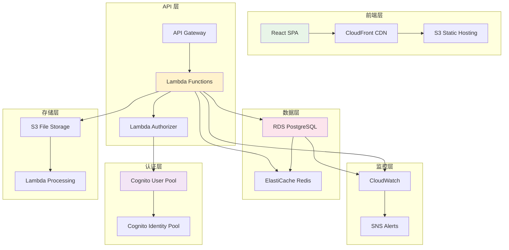

# 第 8 章：实战项目：Web 应用全栈部署

::: tip 学习目标
- 构建一个完整的全栈 Web 应用基础设施
- 掌握前端静态资源托管和 CDN 配置
- 实现后端 API 服务的无服务器架构
- 配置数据库和缓存层
- 实现用户认证和授权系统
- 添加监控、日志和告警功能
:::

## 项目概述

我们将构建一个现代化的全栈 Web 应用，包括：



### 项目架构特点

- **前端**：React SPA + TypeScript，部署到 S3 + CloudFront
- **后端**：Lambda + API Gateway，无服务器架构
- **数据库**：RDS PostgreSQL 主库 + ElastiCache Redis 缓存
- **认证**：AWS Cognito 用户池
- **存储**：S3 文件存储 + Lambda 图像处理
- **监控**：CloudWatch + SNS 告警

## 基础设施层实现

### 网络基础设施

```python
# stacks/network_stack.py
import aws_cdk as cdk
from aws_cdk import (
    aws_ec2 as ec2,
    aws_logs as logs
)
from constructs import Construct

class NetworkStack(cdk.Stack):
    """网络基础设施 Stack"""
    
    def __init__(self, scope: Construct, construct_id: str, **kwargs) -> None:
        super().__init__(scope, construct_id, **kwargs)
        
        # VPC
        self.vpc = ec2.Vpc(
            self, 
            "WebAppVpc",
            ip_addresses=ec2.IpAddresses.cidr("10.0.0.0/16"),
            max_azs=3,
            nat_gateways=2,  # 高可用
            subnet_configuration=[
                # 公共子网 - ALB, NAT Gateway
                ec2.SubnetConfiguration(
                    cidr_mask=24,
                    name="PublicSubnet",
                    subnet_type=ec2.SubnetType.PUBLIC
                ),
                # 私有子网 - Lambda, RDS
                ec2.SubnetConfiguration(
                    cidr_mask=24,
                    name="PrivateSubnet",
                    subnet_type=ec2.SubnetType.PRIVATE_WITH_EGRESS
                ),
                # 隔离子网 - 数据库
                ec2.SubnetConfiguration(
                    cidr_mask=28,
                    name="DatabaseSubnet",
                    subnet_type=ec2.SubnetType.PRIVATE_ISOLATED
                )
            ],
            # VPC Flow Logs
            flow_logs={
                "FlowLog": ec2.FlowLogOptions(
                    traffic_type=ec2.FlowLogTrafficType.ALL,
                    destination=ec2.FlowLogDestination.to_cloud_watch_logs(
                        logs.LogGroup(
                            self,
                            "VpcFlowLogGroup",
                            retention=logs.RetentionDays.ONE_MONTH
                        )
                    )
                )
            }
        )
        
        # VPC Endpoints - 减少 NAT Gateway 费用
        self.vpc.add_gateway_endpoint(
            "S3Endpoint",
            service=ec2.GatewayVpcEndpointAwsService.S3
        )
        
        self.vpc.add_gateway_endpoint(
            "DynamoDbEndpoint", 
            service=ec2.GatewayVpcEndpointAwsService.DYNAMODB
        )
        
        # Interface Endpoints
        self.vpc.add_interface_endpoint(
            "LambdaEndpoint",
            service=ec2.InterfaceVpcEndpointAwsService.LAMBDA
        )
        
        # 安全组
        self.lambda_security_group = ec2.SecurityGroup(
            self,
            "LambdaSecurityGroup",
            vpc=self.vpc,
            description="Security group for Lambda functions",
            allow_all_outbound=True
        )
        
        self.database_security_group = ec2.SecurityGroup(
            self,
            "DatabaseSecurityGroup", 
            vpc=self.vpc,
            description="Security group for RDS database",
            allow_all_outbound=False
        )
        
        self.cache_security_group = ec2.SecurityGroup(
            self,
            "CacheSecurityGroup",
            vpc=self.vpc, 
            description="Security group for ElastiCache",
            allow_all_outbound=False
        )
        
        # 安全组规则
        self.database_security_group.add_ingress_rule(
            peer=self.lambda_security_group,
            connection=ec2.Port.tcp(5432),
            description="Allow Lambda to access PostgreSQL"
        )
        
        self.cache_security_group.add_ingress_rule(
            peer=self.lambda_security_group,
            connection=ec2.Port.tcp(6379),
            description="Allow Lambda to access Redis"
        )
        
        # 输出
        cdk.CfnOutput(self, "VpcId", value=self.vpc.vpc_id)
        cdk.CfnOutput(self, "VpcCidr", value=self.vpc.vpc_cidr_block)
```

### 数据存储层

```python
# stacks/data_stack.py
import aws_cdk as cdk
from aws_cdk import (
    aws_rds as rds,
    aws_elasticache as elasticache,
    aws_s3 as s3,
    aws_s3_notifications as s3n,
    aws_lambda as lambda_,
    aws_iam as iam,
    aws_secretsmanager as secrets
)
from constructs import Construct
from .network_stack import NetworkStack

class DataStack(cdk.Stack):
    """数据存储 Stack"""
    
    def __init__(self, scope: Construct, construct_id: str, 
                 network_stack: NetworkStack, **kwargs) -> None:
        super().__init__(scope, construct_id, **kwargs)
        
        self.network_stack = network_stack
        
        # 数据库凭证
        self.db_credentials = rds.DatabaseSecret(
            self,
            "DatabaseSecret",
            username="webapp_user",
            secret_name="webapp-db-credentials"
        )
        
        # RDS 子网组
        db_subnet_group = rds.SubnetGroup(
            self,
            "DatabaseSubnetGroup",
            description="Subnet group for RDS database",
            vpc=network_stack.vpc,
            vpc_subnets=ec2.SubnetSelection(
                subnet_type=ec2.SubnetType.PRIVATE_ISOLATED
            )
        )
        
        # RDS PostgreSQL 数据库
        self.database = rds.DatabaseInstance(
            self,
            "PostgreSQLDatabase",
            engine=rds.DatabaseInstanceEngine.postgres(
                version=rds.PostgresEngineVersion.VER_14_9
            ),
            instance_type=ec2.InstanceType.of(
                ec2.InstanceClass.BURSTABLE3,
                ec2.InstanceSize.MICRO
            ),
            vpc=network_stack.vpc,
            subnet_group=db_subnet_group,
            security_groups=[network_stack.database_security_group],
            credentials=rds.Credentials.from_secret(self.db_credentials),
            database_name="webapp",
            allocated_storage=20,
            max_allocated_storage=100,
            storage_encrypted=True,
            multi_az=False,  # 设为 True 以获得高可用性
            backup_retention=cdk.Duration.days(7),
            delete_automated_backups=True,
            deletion_protection=False,  # 生产环境应设为 True
            monitoring_interval=cdk.Duration.seconds(60),
            performance_insights_enabled=True,
            cloudwatch_logs_exports=["postgresql"],
            # 参数组配置
            parameter_group=rds.ParameterGroup(
                self,
                "DatabaseParameterGroup",
                engine=rds.DatabaseInstanceEngine.postgres(
                    version=rds.PostgresEngineVersion.VER_14_9
                ),
                parameters={
                    "shared_preload_libraries": "pg_stat_statements",
                    "log_statement": "all",
                    "log_min_duration_statement": "1000"  # 记录超过1秒的查询
                }
            )
        )
        
        # ElastiCache 子网组
        cache_subnet_group = elasticache.CfnSubnetGroup(
            self,
            "CacheSubnetGroup",
            description="Subnet group for ElastiCache",
            subnet_ids=network_stack.vpc.select_subnets(
                subnet_type=ec2.SubnetType.PRIVATE_WITH_EGRESS
            ).subnet_ids
        )
        
        # ElastiCache Redis
        self.cache_cluster = elasticache.CfnCacheCluster(
            self,
            "RedisCache",
            cache_node_type="cache.t3.micro",
            engine="redis",
            num_cache_nodes=1,
            cache_subnet_group_name=cache_subnet_group.ref,
            vpc_security_group_ids=[network_stack.cache_security_group.security_group_id],
            # Redis 配置
            engine_version="7.0",
            port=6379,
            # 快照和备份
            snapshot_retention_limit=5,
            snapshot_window="03:00-05:00",
            preferred_maintenance_window="sun:05:00-sun:07:00",
            # 通知
            notification_topic_arn=None  # 可以添加 SNS 主题
        )
        
        # S3 存储桶 - 文件存储
        self.file_bucket = s3.Bucket(
            self,
            "FileBucket",
            bucket_name=f"webapp-files-{self.account}-{self.region}",
            versioned=True,
            encryption=s3.BucketEncryption.S3_MANAGED,
            # CORS 配置
            cors=[
                s3.CorsRule(
                    allowed_methods=[s3.HttpMethods.GET, s3.HttpMethods.POST, s3.HttpMethods.PUT],
                    allowed_origins=["*"],  # 生产环境应该限制域名
                    allowed_headers=["*"],
                    max_age=3000
                )
            ],
            # 生命周期规则
            lifecycle_rules=[
                s3.LifecycleRule(
                    id="DeleteIncompleteMultipartUploads",
                    enabled=True,
                    abort_incomplete_multipart_upload_after=cdk.Duration.days(1)
                ),
                s3.LifecycleRule(
                    id="TransitionToIA",
                    enabled=True,
                    transitions=[
                        s3.Transition(
                            storage_class=s3.StorageClass.INFREQUENT_ACCESS,
                            transition_after=cdk.Duration.days(30)
                        ),
                        s3.Transition(
                            storage_class=s3.StorageClass.GLACIER,
                            transition_after=cdk.Duration.days(90)
                        )
                    ]
                )
            ],
            removal_policy=cdk.RemovalPolicy.DESTROY  # 生产环境应设为 RETAIN
        )
        
        # 图像处理 Lambda
        self.image_processor = lambda_.Function(
            self,
            "ImageProcessor",
            runtime=lambda_.Runtime.PYTHON_3_9,
            handler="image_processor.handler",
            code=lambda_.Code.from_asset("lambda/image_processor"),
            timeout=cdk.Duration.seconds(30),
            memory_size=1024,  # 图像处理需要更多内存
            environment={
                "DESTINATION_BUCKET": self.file_bucket.bucket_name
            }
        )
        
        # S3 事件通知
        self.file_bucket.add_event_notification(
            s3.EventType.OBJECT_CREATED,
            s3n.LambdaDestination(self.image_processor),
            s3.NotificationKeyFilter(prefix="uploads/", suffix=".jpg")
        )
        
        self.file_bucket.add_event_notification(
            s3.EventType.OBJECT_CREATED,
            s3n.LambdaDestination(self.image_processor),
            s3.NotificationKeyFilter(prefix="uploads/", suffix=".png")
        )
        
        # 授予 Lambda 访问 S3 权限
        self.file_bucket.grant_read_write(self.image_processor)
        
        # 输出
        cdk.CfnOutput(self, "DatabaseEndpoint", value=self.database.instance_endpoint.hostname)
        cdk.CfnOutput(self, "DatabasePort", value=self.database.instance_endpoint.port)
        cdk.CfnOutput(self, "DatabaseSecretArn", value=self.db_credentials.secret_arn)
        cdk.CfnOutput(self, "CacheEndpoint", value=self.cache_cluster.attr_cache_nodes[0].address)
        cdk.CfnOutput(self, "FileBucketName", value=self.file_bucket.bucket_name)
```

### 认证服务层

```python
# stacks/auth_stack.py
import aws_cdk as cdk
from aws_cdk import (
    aws_cognito as cognito,
    aws_lambda as lambda_,
    aws_iam as iam,
    aws_logs as logs
)
from constructs import Construct

class AuthStack(cdk.Stack):
    """认证服务 Stack"""
    
    def __init__(self, scope: Construct, construct_id: str, **kwargs) -> None:
        super().__init__(scope, construct_id, **kwargs)
        
        # Lambda 触发器 - 用户注册后处理
        self.post_confirmation_trigger = lambda_.Function(
            self,
            "PostConfirmationTrigger",
            runtime=lambda_.Runtime.PYTHON_3_9,
            handler="post_confirmation.handler",
            code=lambda_.Code.from_asset("lambda/auth_triggers"),
            timeout=cdk.Duration.seconds(30),
            log_retention=logs.RetentionDays.ONE_WEEK
        )
        
        # Lambda 触发器 - 自定义认证流程
        self.pre_authentication_trigger = lambda_.Function(
            self,
            "PreAuthenticationTrigger", 
            runtime=lambda_.Runtime.PYTHON_3_9,
            handler="pre_authentication.handler",
            code=lambda_.Code.from_asset("lambda/auth_triggers"),
            timeout=cdk.Duration.seconds(30),
            log_retention=logs.RetentionDays.ONE_WEEK
        )
        
        # Cognito User Pool
        self.user_pool = cognito.UserPool(
            self,
            "WebAppUserPool",
            user_pool_name="webapp-users",
            # 注册配置
            sign_in_aliases=cognito.SignInAliases(
                username=True,
                email=True
            ),
            # 用户属性
            standard_attributes=cognito.StandardAttributes(
                email=cognito.StandardAttribute(
                    required=True,
                    mutable=True
                ),
                given_name=cognito.StandardAttribute(
                    required=True,
                    mutable=True
                ),
                family_name=cognito.StandardAttribute(
                    required=True,
                    mutable=True
                )
            ),
            # 自定义属性
            custom_attributes={
                "role": cognito.StringAttribute(min_len=1, max_len=50, mutable=True),
                "organization": cognito.StringAttribute(min_len=1, max_len=100, mutable=True)
            },
            # 密码策略
            password_policy=cognito.PasswordPolicy(
                min_length=8,
                require_lowercase=True,
                require_uppercase=True,
                require_digits=True,
                require_symbols=True
            ),
            # 账户恢复
            account_recovery=cognito.AccountRecovery.EMAIL_ONLY,
            # 邮箱验证
            email_verification_subject="验证您的 WebApp 账户",
            email_verification_body="感谢注册 WebApp！请点击链接验证您的邮箱: {##Verify Email##}",
            # 用户邀请
            user_invitation=cognito.UserInvitationConfig(
                email_subject="欢迎加入 WebApp",
                email_body="您已被邀请加入 WebApp。用户名: {username}，临时密码: {####}",
                sms_message="您的 WebApp 用户名: {username}，临时密码: {####}"
            ),
            # Lambda 触发器
            lambda_triggers=cognito.UserPoolTriggers(
                post_confirmation=self.post_confirmation_trigger,
                pre_authentication=self.pre_authentication_trigger
            ),
            # MFA 配置
            mfa=cognito.Mfa.OPTIONAL,
            mfa_second_factor=cognito.MfaSecondFactor(
                sms=True,
                otp=True  # Time-based One Time Password
            ),
            # 设备跟踪
            device_tracking=cognito.DeviceTracking(
                challenge_required_on_new_device=True,
                device_only_remembered_on_user_prompt=True
            ),
            removal_policy=cdk.RemovalPolicy.DESTROY  # 生产环境应设为 RETAIN
        )
        
        # User Pool 域名
        self.user_pool_domain = cognito.UserPoolDomain(
            self,
            "WebAppUserPoolDomain",
            user_pool=self.user_pool,
            cognito_domain=cognito.CognitoDomainOptions(
                domain_prefix="webapp-auth-domain"  # 必须全局唯一
            )
        )
        
        # User Pool Client - Web 应用
        self.web_client = cognito.UserPoolClient(
            self,
            "WebAppClient",
            user_pool=self.user_pool,
            user_pool_client_name="webapp-web-client",
            # OAuth 配置
            o_auth=cognito.OAuthSettings(
                flows=cognito.OAuthFlows(
                    authorization_code_grant=True,
                    implicit_code_grant=True
                ),
                scopes=[
                    cognito.OAuthScope.EMAIL,
                    cognito.OAuthScope.OPENID,
                    cognito.OAuthScope.PROFILE
                ],
                callback_urls=[
                    "http://localhost:3000/auth/callback",  # 开发环境
                    "https://webapp.example.com/auth/callback"  # 生产环境
                ],
                logout_urls=[
                    "http://localhost:3000/auth/logout",
                    "https://webapp.example.com/auth/logout"
                ]
            ),
            # 认证流程
            auth_flows=cognito.AuthFlow(
                user_password=True,
                user_srp=True
            ),
            # Token 有效期
            access_token_validity=cdk.Duration.hours(1),
            id_token_validity=cdk.Duration.hours(1),
            refresh_token_validity=cdk.Duration.days(30),
            # 防止用户存在枚举攻击
            prevent_user_existence_errors=True
        )
        
        # User Pool Client - 移动应用
        self.mobile_client = cognito.UserPoolClient(
            self,
            "WebAppMobileClient",
            user_pool=self.user_pool,
            user_pool_client_name="webapp-mobile-client",
            generate_secret=True,  # 移动应用需要客户端密钥
            auth_flows=cognito.AuthFlow(
                user_password=True,
                user_srp=True,
                custom=True  # 支持自定义认证流程
            ),
            # Token 有效期（移动应用可以更长）
            access_token_validity=cdk.Duration.hours(8),
            id_token_validity=cdk.Duration.hours(8),
            refresh_token_validity=cdk.Duration.days(60)
        )
        
        # Identity Pool - 用于 AWS 资源访问
        self.identity_pool = cognito.CfnIdentityPool(
            self,
            "WebAppIdentityPool",
            identity_pool_name="webapp_identity_pool",
            allow_unauthenticated_identities=False,
            cognito_identity_providers=[
                cognito.CfnIdentityPool.CognitoIdentityProviderProperty(
                    client_id=self.web_client.user_pool_client_id,
                    provider_name=self.user_pool.user_pool_provider_name
                )
            ]
        )
        
        # Identity Pool 角色
        # 认证用户角色
        self.authenticated_role = iam.Role(
            self,
            "AuthenticatedRole",
            assumed_by=iam.FederatedPrincipal(
                "cognito-identity.amazonaws.com",
                {
                    "StringEquals": {
                        "cognito-identity.amazonaws.com:aud": self.identity_pool.ref
                    },
                    "ForAnyValue:StringLike": {
                        "cognito-identity.amazonaws.com:amr": "authenticated"
                    }
                },
                "sts:AssumeRoleWithWebIdentity"
            )
        )
        
        # 为认证用户添加基本权限
        self.authenticated_role.add_to_policy(
            iam.PolicyStatement(
                effect=iam.Effect.ALLOW,
                actions=[
                    "cognito-sync:*",
                    "cognito-identity:*"
                ],
                resources=["*"]
            )
        )
        
        # S3 访问权限（基于用户身份）
        self.authenticated_role.add_to_policy(
            iam.PolicyStatement(
                effect=iam.Effect.ALLOW,
                actions=[
                    "s3:GetObject",
                    "s3:PutObject",
                    "s3:DeleteObject"
                ],
                resources=[
                    f"arn:aws:s3:::webapp-files-{self.account}-{self.region}/users/${{cognito-identity.amazonaws.com:sub}}/*"
                ]
            )
        )
        
        # Identity Pool 角色映射
        cognito.CfnIdentityPoolRoleAttachment(
            self,
            "IdentityPoolRoleAttachment",
            identity_pool_id=self.identity_pool.ref,
            roles={
                "authenticated": self.authenticated_role.role_arn
            }
        )
        
        # 输出
        cdk.CfnOutput(self, "UserPoolId", value=self.user_pool.user_pool_id)
        cdk.CfnOutput(self, "UserPoolArn", value=self.user_pool.user_pool_arn)
        cdk.CfnOutput(self, "WebClientId", value=self.web_client.user_pool_client_id)
        cdk.CfnOutput(self, "MobileClientId", value=self.mobile_client.user_pool_client_id)
        cdk.CfnOutput(self, "IdentityPoolId", value=self.identity_pool.ref)
        cdk.CfnOutput(self, "UserPoolDomainUrl", 
                     value=f"https://{self.user_pool_domain.domain_name}.auth.{self.region}.amazoncognito.com")
```

## API 服务层实现

### Lambda 函数层

```python
# stacks/api_stack.py
import aws_cdk as cdk
from aws_cdk import (
    aws_lambda as lambda_,
    aws_apigateway as apigateway,
    aws_iam as iam,
    aws_logs as logs,
    aws_ssm as ssm
)
from constructs import Construct
from .network_stack import NetworkStack
from .data_stack import DataStack
from .auth_stack import AuthStack

class ApiStack(cdk.Stack):
    """API 服务 Stack"""
    
    def __init__(self, scope: Construct, construct_id: str,
                 network_stack: NetworkStack,
                 data_stack: DataStack,
                 auth_stack: AuthStack, **kwargs) -> None:
        super().__init__(scope, construct_id, **kwargs)
        
        self.network_stack = network_stack
        self.data_stack = data_stack
        self.auth_stack = auth_stack
        
        # Lambda Layer - 共享库
        self.shared_layer = lambda_.LayerVersion(
            self,
            "SharedLayer",
            code=lambda_.Code.from_asset("lambda/layers/shared"),
            compatible_runtimes=[lambda_.Runtime.PYTHON_3_9],
            description="Shared libraries for Lambda functions"
        )
        
        # Lambda 函数环境变量
        common_environment = {
            "DB_SECRET_ARN": data_stack.db_credentials.secret_arn,
            "REDIS_ENDPOINT": data_stack.cache_cluster.attr_cache_nodes[0].address,
            "REDIS_PORT": "6379",
            "FILE_BUCKET": data_stack.file_bucket.bucket_name,
            "USER_POOL_ID": auth_stack.user_pool.user_pool_id,
            "LOG_LEVEL": "INFO"
        }
        
        # 用户管理 Lambda
        self.user_function = lambda_.Function(
            self,
            "UserFunction",
            runtime=lambda_.Runtime.PYTHON_3_9,
            handler="user.handler",
            code=lambda_.Code.from_asset("lambda/api/user"),
            layers=[self.shared_layer],
            vpc=network_stack.vpc,
            security_groups=[network_stack.lambda_security_group],
            timeout=cdk.Duration.seconds(30),
            memory_size=256,
            environment=common_environment,
            log_retention=logs.RetentionDays.ONE_MONTH
        )
        
        # 文件管理 Lambda
        self.file_function = lambda_.Function(
            self,
            "FileFunction",
            runtime=lambda_.Runtime.PYTHON_3_9,
            handler="file.handler",
            code=lambda_.Code.from_asset("lambda/api/file"),
            layers=[self.shared_layer],
            vpc=network_stack.vpc,
            security_groups=[network_stack.lambda_security_group],
            timeout=cdk.Duration.seconds(30),
            memory_size=512,  # 文件处理需要更多内存
            environment=common_environment,
            log_retention=logs.RetentionDays.ONE_MONTH
        )
        
        # 业务逻辑 Lambda
        self.business_function = lambda_.Function(
            self,
            "BusinessFunction",
            runtime=lambda_.Runtime.PYTHON_3_9,
            handler="business.handler", 
            code=lambda_.Code.from_asset("lambda/api/business"),
            layers=[self.shared_layer],
            vpc=network_stack.vpc,
            security_groups=[network_stack.lambda_security_group],
            timeout=cdk.Duration.seconds(60),
            memory_size=512,
            environment=common_environment,
            log_retention=logs.RetentionDays.ONE_MONTH
        )
        
        # Lambda Authorizer
        self.authorizer_function = lambda_.Function(
            self,
            "AuthorizerFunction",
            runtime=lambda_.Runtime.PYTHON_3_9,
            handler="authorizer.handler",
            code=lambda_.Code.from_asset("lambda/authorizer"),
            layers=[self.shared_layer],
            timeout=cdk.Duration.seconds(30),
            memory_size=256,
            environment={
                "USER_POOL_ID": auth_stack.user_pool.user_pool_id,
                "APP_CLIENT_ID": auth_stack.web_client.user_pool_client_id
            },
            log_retention=logs.RetentionDays.ONE_MONTH
        )
        
        # 授予 Lambda 访问数据库密钥权限
        data_stack.db_credentials.grant_read(self.user_function)
        data_stack.db_credentials.grant_read(self.file_function)
        data_stack.db_credentials.grant_read(self.business_function)
        
        # 授予 Lambda 访问 S3 权限
        data_stack.file_bucket.grant_read_write(self.file_function)
        
        # 授予 Lambda 访问 Cognito 权限
        self.user_function.add_to_role_policy(
            iam.PolicyStatement(
                effect=iam.Effect.ALLOW,
                actions=[
                    "cognito-idp:AdminGetUser",
                    "cognito-idp:AdminUpdateUserAttributes",
                    "cognito-idp:ListUsers"
                ],
                resources=[auth_stack.user_pool.user_pool_arn]
            )
        )
        
        # API Gateway
        self.api = apigateway.RestApi(
            self,
            "WebAppAPI",
            rest_api_name="webapp-api",
            description="Web Application REST API",
            # CORS 配置
            default_cors_preflight_options=apigateway.CorsOptions(
                allow_origins=apigateway.Cors.ALL_ORIGINS,  # 生产环境应限制域名
                allow_methods=apigateway.Cors.ALL_METHODS,
                allow_headers=["Content-Type", "X-Amz-Date", "Authorization", "X-Api-Key"]
            ),
            # API 密钥配置
            api_key_source_type=apigateway.ApiKeySourceType.HEADER,
            # 部署选项
            deploy_options=apigateway.StageOptions(
                stage_name="v1",
                throttling_rate_limit=1000,
                throttling_burst_limit=2000,
                logging_level=apigateway.MethodLoggingLevel.INFO,
                data_trace_enabled=True,
                metrics_enabled=True
            )
        )
        
        # Lambda Authorizer
        self.lambda_authorizer = apigateway.TokenAuthorizer(
            self,
            "LambdaAuthorizer",
            handler=self.authorizer_function,
            token_source=apigateway.IdentitySource.header("Authorization"),
            results_cache_ttl=cdk.Duration.minutes(5)
        )
        
        # API 资源和方法
        # /users 资源
        users_resource = self.api.root.add_resource("users")
        users_resource.add_method(
            "GET",
            apigateway.LambdaIntegration(self.user_function),
            authorizer=self.lambda_authorizer,
            api_key_required=True
        )
        users_resource.add_method(
            "POST",
            apigateway.LambdaIntegration(self.user_function),
            authorizer=self.lambda_authorizer,
            api_key_required=True
        )
        
        # /users/{id} 资源
        user_resource = users_resource.add_resource("{id}")
        user_resource.add_method(
            "GET",
            apigateway.LambdaIntegration(self.user_function),
            authorizer=self.lambda_authorizer,
            api_key_required=True
        )
        user_resource.add_method(
            "PUT",
            apigateway.LambdaIntegration(self.user_function),
            authorizer=self.lambda_authorizer,
            api_key_required=True
        )
        user_resource.add_method(
            "DELETE",
            apigateway.LambdaIntegration(self.user_function),
            authorizer=self.lambda_authorizer,
            api_key_required=True
        )
        
        # /files 资源
        files_resource = self.api.root.add_resource("files")
        files_resource.add_method(
            "POST",
            apigateway.LambdaIntegration(self.file_function),
            authorizer=self.lambda_authorizer,
            api_key_required=True
        )
        files_resource.add_method(
            "GET",
            apigateway.LambdaIntegration(self.file_function),
            authorizer=self.lambda_authorizer,
            api_key_required=True
        )
        
        # /business 资源
        business_resource = self.api.root.add_resource("business")
        business_resource.add_method(
            "POST",
            apigateway.LambdaIntegration(self.business_function),
            authorizer=self.lambda_authorizer,
            api_key_required=True
        )
        
        # API 密钥和使用计划
        self.api_key = apigateway.ApiKey(
            self,
            "WebAppApiKey",
            api_key_name="webapp-api-key",
            description="API key for web application"
        )
        
        self.usage_plan = apigateway.UsagePlan(
            self,
            "WebAppUsagePlan",
            name="webapp-usage-plan",
            description="Usage plan for web application",
            api_stages=[
                apigateway.UsagePlanPerApiStage(
                    api=self.api,
                    stage=self.api.deployment_stage
                )
            ],
            throttle=apigateway.ThrottleSettings(
                rate_limit=1000,
                burst_limit=2000
            ),
            quota=apigateway.QuotaSettings(
                limit=10000,
                period=apigateway.Period.DAY
            )
        )
        
        self.usage_plan.add_api_key(self.api_key)
        
        # 输出
        cdk.CfnOutput(self, "ApiUrl", value=self.api.url)
        cdk.CfnOutput(self, "ApiId", value=self.api.rest_api_id)
        cdk.CfnOutput(self, "ApiKeyId", value=self.api_key.key_id)
```

## 前端基础设施

### 静态资源托管

```python
# stacks/frontend_stack.py
import aws_cdk as cdk
from aws_cdk import (
    aws_s3 as s3,
    aws_s3_deployment as s3_deployment,
    aws_cloudfront as cloudfront,
    aws_cloudfront_origins as origins,
    aws_certificatemanager as acm,
    aws_route53 as route53,
    aws_route53_targets as targets,
    aws_iam as iam
)
from constructs import Construct

class FrontendStack(cdk.Stack):
    """前端基础设施 Stack"""
    
    def __init__(self, scope: Construct, construct_id: str, 
                 domain_name: str = None, **kwargs) -> None:
        super().__init__(scope, construct_id, **kwargs)
        
        self.domain_name = domain_name
        
        # S3 存储桶 - 静态网站托管
        self.website_bucket = s3.Bucket(
            self,
            "WebsiteBucket",
            bucket_name=f"webapp-frontend-{self.account}-{self.region}",
            website_index_document="index.html",
            website_error_document="error.html",
            public_read_access=False,  # 通过 CloudFront 访问
            block_public_access=s3.BlockPublicAccess.BLOCK_ALL,
            removal_policy=cdk.RemovalPolicy.DESTROY
        )
        
        # Origin Access Identity - 限制 S3 访问
        self.origin_access_identity = cloudfront.OriginAccessIdentity(
            self,
            "WebsiteOAI",
            comment="OAI for webapp frontend"
        )
        
        # 授予 CloudFront 访问 S3 权限
        self.website_bucket.add_to_resource_policy(
            iam.PolicyStatement(
                effect=iam.Effect.ALLOW,
                principals=[self.origin_access_identity.grant_principal],
                actions=["s3:GetObject"],
                resources=[f"{self.website_bucket.bucket_arn}/*"]
            )
        )
        
        # SSL 证书（如果提供了域名）
        certificate = None
        if domain_name:
            certificate = acm.Certificate(
                self,
                "WebsiteCertificate",
                domain_name=domain_name,
                subject_alternative_names=[f"www.{domain_name}"],
                validation=acm.CertificateValidation.from_dns()
            )
        
        # CloudFront 分发
        self.distribution = cloudfront.Distribution(
            self,
            "WebsiteDistribution",
            default_behavior=cloudfront.BehaviorOptions(
                origin=origins.S3Origin(
                    self.website_bucket,
                    origin_access_identity=self.origin_access_identity
                ),
                viewer_protocol_policy=cloudfront.ViewerProtocolPolicy.REDIRECT_TO_HTTPS,
                allowed_methods=cloudfront.AllowedMethods.ALLOW_GET_HEAD,
                cached_methods=cloudfront.CachedMethods.CACHE_GET_HEAD,
                cache_policy=cloudfront.CachePolicy.CACHING_OPTIMIZED,
                compress=True
            ),
            additional_behaviors={
                # API 路径 - 不缓存
                "/api/*": cloudfront.BehaviorOptions(
                    origin=origins.HttpOrigin("api.example.com"),  # 替换为实际 API 域名
                    viewer_protocol_policy=cloudfront.ViewerProtocolPolicy.HTTPS_ONLY,
                    allowed_methods=cloudfront.AllowedMethods.ALLOW_ALL,
                    cache_policy=cloudfront.CachePolicy.CACHING_DISABLED,
                    origin_request_policy=cloudfront.OriginRequestPolicy.CORS_S3_ORIGIN
                ),
                # 静态资源 - 长时间缓存
                "/static/*": cloudfront.BehaviorOptions(
                    origin=origins.S3Origin(
                        self.website_bucket,
                        origin_access_identity=self.origin_access_identity
                    ),
                    viewer_protocol_policy=cloudfront.ViewerProtocolPolicy.HTTPS_ONLY,
                    cache_policy=cloudfront.CachePolicy.CACHING_OPTIMIZED_FOR_UNCOMPRESSED_OBJECTS,
                    compress=True
                )
            },
            # 错误页面配置
            error_responses=[
                cloudfront.ErrorResponse(
                    http_status=404,
                    response_http_status=200,
                    response_page_path="/index.html",
                    ttl=cdk.Duration.minutes(5)
                ),
                cloudfront.ErrorResponse(
                    http_status=403,
                    response_http_status=200,
                    response_page_path="/index.html", 
                    ttl=cdk.Duration.minutes(5)
                )
            ],
            # 地理限制
            geo_restriction=cloudfront.GeoRestriction.allowlist("US", "CA", "GB", "DE", "JP", "CN"),
            # 价格等级
            price_class=cloudfront.PriceClass.PRICE_CLASS_100,
            # 启用 IPv6
            enable_ipv6=True,
            # SSL 配置
            certificate=certificate,
            domain_names=[domain_name, f"www.{domain_name}"] if domain_name else None,
            # 默认根对象
            default_root_object="index.html"
        )
        
        # Route 53 配置（如果提供了域名）
        if domain_name:
            # 获取托管区域
            hosted_zone = route53.HostedZone.from_lookup(
                self,
                "HostedZone",
                domain_name=domain_name
            )
            
            # A 记录指向 CloudFront
            route53.ARecord(
                self,
                "WebsiteARecord",
                zone=hosted_zone,
                record_name=domain_name,
                target=route53.RecordTarget.from_alias(
                    targets.CloudFrontTarget(self.distribution)
                )
            )
            
            # www 子域名
            route53.ARecord(
                self,
                "WebsiteWWWARecord", 
                zone=hosted_zone,
                record_name=f"www.{domain_name}",
                target=route53.RecordTarget.from_alias(
                    targets.CloudFrontTarget(self.distribution)
                )
            )
        
        # 部署前端应用
        s3_deployment.BucketDeployment(
            self,
            "DeployWebsite",
            sources=[s3_deployment.Source.asset("frontend/build")],
            destination_bucket=self.website_bucket,
            distribution=self.distribution,
            distribution_paths=["/*"],  # 清除所有缓存
            # 保留现有文件
            prune=False
        )
        
        # 输出
        cdk.CfnOutput(
            self,
            "WebsiteUrl",
            value=f"https://{self.distribution.distribution_domain_name}",
            description="CloudFront distribution URL"
        )
        
        if domain_name:
            cdk.CfnOutput(
                self,
                "CustomDomainUrl",
                value=f"https://{domain_name}",
                description="Custom domain URL"
            )
        
        cdk.CfnOutput(self, "BucketName", value=self.website_bucket.bucket_name)
        cdk.CfnOutput(self, "DistributionId", value=self.distribution.distribution_id)
```

## 监控和告警

```python
# stacks/monitoring_stack.py
import aws_cdk as cdk
from aws_cdk import (
    aws_cloudwatch as cloudwatch,
    aws_sns as sns,
    aws_sns_subscriptions as subscriptions,
    aws_logs as logs,
    aws_logs_destinations as destinations
)
from constructs import Construct
from .api_stack import ApiStack
from .data_stack import DataStack
from .frontend_stack import FrontendStack

class MonitoringStack(cdk.Stack):
    """监控和告警 Stack"""
    
    def __init__(self, scope: Construct, construct_id: str,
                 api_stack: ApiStack,
                 data_stack: DataStack, 
                 frontend_stack: FrontendStack,
                 alert_email: str, **kwargs) -> None:
        super().__init__(scope, construct_id, **kwargs)
        
        # SNS 主题 - 告警通知
        self.alert_topic = sns.Topic(
            self,
            "AlertTopic",
            topic_name="webapp-alerts",
            display_name="WebApp Alerts"
        )
        
        # 添加邮箱订阅
        self.alert_topic.add_subscription(
            subscriptions.EmailSubscription(alert_email)
        )
        
        # CloudWatch Dashboard
        self.dashboard = cloudwatch.Dashboard(
            self,
            "WebAppDashboard",
            dashboard_name="WebApp-Monitoring",
            period_override=cloudwatch.PeriodOverride.AUTO
        )
        
        # API Gateway 监控
        self._create_api_monitoring(api_stack)
        
        # Lambda 监控
        self._create_lambda_monitoring(api_stack)
        
        # 数据库监控
        self._create_database_monitoring(data_stack)
        
        # CloudFront 监控
        self._create_cloudfront_monitoring(frontend_stack)
        
        # 自定义业务指标
        self._create_business_monitoring()
    
    def _create_api_monitoring(self, api_stack: ApiStack):
        """API Gateway 监控"""
        # API Gateway 指标
        api_requests = api_stack.api.metric_count()
        api_4xx_errors = api_stack.api.metric_client_error()
        api_5xx_errors = api_stack.api.metric_server_error()
        api_latency = api_stack.api.metric_latency()
        
        # 添加到仪表板
        self.dashboard.add_widgets(
            cloudwatch.GraphWidget(
                title="API Gateway - Requests",
                left=[api_requests],
                right=[api_4xx_errors, api_5xx_errors],
                period=cdk.Duration.minutes(5),
                width=12,
                height=6
            ),
            cloudwatch.GraphWidget(
                title="API Gateway - Latency", 
                left=[api_latency],
                period=cdk.Duration.minutes(5),
                width=12,
                height=6
            )
        )
        
        # 告警
        # 高错误率告警
        cloudwatch.Alarm(
            self,
            "ApiHighErrorRateAlarm",
            alarm_name="API-High-Error-Rate",
            alarm_description="API Gateway error rate is too high",
            metric=api_5xx_errors,
            threshold=10,
            evaluation_periods=2,
            datapoints_to_alarm=2,
            treat_missing_data=cloudwatch.TreatMissingData.NOT_BREACHING
        ).add_alarm_action(
            cloudwatch.SnsAction(self.alert_topic)
        )
        
        # 高延迟告警
        cloudwatch.Alarm(
            self,
            "ApiHighLatencyAlarm",
            alarm_name="API-High-Latency",
            alarm_description="API Gateway latency is too high",
            metric=api_latency,
            threshold=5000,  # 5 seconds
            evaluation_periods=3,
            datapoints_to_alarm=2
        ).add_alarm_action(
            cloudwatch.SnsAction(self.alert_topic)
        )
    
    def _create_lambda_monitoring(self, api_stack: ApiStack):
        """Lambda 函数监控"""
        lambda_functions = [
            ("User Function", api_stack.user_function),
            ("File Function", api_stack.file_function),
            ("Business Function", api_stack.business_function)
        ]
        
        for name, func in lambda_functions:
            # Lambda 指标
            invocations = func.metric_invocations()
            errors = func.metric_errors()
            duration = func.metric_duration()
            throttles = func.metric_throttles()
            
            # 添加到仪表板
            self.dashboard.add_widgets(
                cloudwatch.GraphWidget(
                    title=f"{name} - Metrics",
                    left=[invocations, throttles],
                    right=[errors],
                    period=cdk.Duration.minutes(5),
                    width=12,
                    height=6
                ),
                cloudwatch.GraphWidget(
                    title=f"{name} - Duration",
                    left=[duration],
                    period=cdk.Duration.minutes(5),
                    width=12,
                    height=6
                )
            )
            
            # 错误率告警
            cloudwatch.Alarm(
                self,
                f"{name.replace(' ', '')}ErrorAlarm",
                alarm_name=f"Lambda-{name.replace(' ', '-')}-Errors",
                alarm_description=f"{name} error rate is too high",
                metric=errors,
                threshold=5,
                evaluation_periods=2,
                datapoints_to_alarm=2
            ).add_alarm_action(
                cloudwatch.SnsAction(self.alert_topic)
            )
            
            # 执行时间告警
            cloudwatch.Alarm(
                self,
                f"{name.replace(' ', '')}DurationAlarm",
                alarm_name=f"Lambda-{name.replace(' ', '-')}-Duration",
                alarm_description=f"{name} execution duration is too high",
                metric=duration,
                threshold=10000,  # 10 seconds
                evaluation_periods=3,
                datapoints_to_alarm=2
            ).add_alarm_action(
                cloudwatch.SnsAction(self.alert_topic)
            )
    
    def _create_database_monitoring(self, data_stack: DataStack):
        """数据库监控"""
        # RDS 指标
        db_connections = data_stack.database.metric_database_connections()
        cpu_utilization = data_stack.database.metric_cpu_utilization()
        free_storage_space = data_stack.database.metric_free_storage_space()
        
        # 添加到仪表板
        self.dashboard.add_widgets(
            cloudwatch.GraphWidget(
                title="RDS - Database Connections",
                left=[db_connections],
                period=cdk.Duration.minutes(5),
                width=12,
                height=6
            ),
            cloudwatch.GraphWidget(
                title="RDS - CPU Utilization",
                left=[cpu_utilization],
                period=cdk.Duration.minutes(5),
                width=12,
                height=6
            ),
            cloudwatch.GraphWidget(
                title="RDS - Free Storage Space",
                left=[free_storage_space],
                period=cdk.Duration.minutes(5), 
                width=12,
                height=6
            )
        )
        
        # 数据库告警
        # 高 CPU 使用率
        cloudwatch.Alarm(
            self,
            "DatabaseHighCPUAlarm",
            alarm_name="Database-High-CPU",
            alarm_description="Database CPU utilization is too high",
            metric=cpu_utilization,
            threshold=80,
            evaluation_periods=3,
            datapoints_to_alarm=2
        ).add_alarm_action(
            cloudwatch.SnsAction(self.alert_topic)
        )
        
        # 存储空间不足
        cloudwatch.Alarm(
            self,
            "DatabaseLowStorageAlarm",
            alarm_name="Database-Low-Storage",
            alarm_description="Database free storage space is running low",
            metric=free_storage_space,
            threshold=1000000000,  # 1GB in bytes
            comparison_operator=cloudwatch.ComparisonOperator.LESS_THAN_THRESHOLD,
            evaluation_periods=2,
            datapoints_to_alarm=2
        ).add_alarm_action(
            cloudwatch.SnsAction(self.alert_topic)
        )
    
    def _create_cloudfront_monitoring(self, frontend_stack: FrontendStack):
        """CloudFront 监控"""
        # CloudFront 指标
        requests = cloudwatch.Metric(
            namespace="AWS/CloudFront",
            metric_name="Requests",
            dimensions_map={
                "DistributionId": frontend_stack.distribution.distribution_id
            }
        )
        
        bytes_downloaded = cloudwatch.Metric(
            namespace="AWS/CloudFront",
            metric_name="BytesDownloaded",
            dimensions_map={
                "DistributionId": frontend_stack.distribution.distribution_id
            }
        )
        
        # 添加到仪表板
        self.dashboard.add_widgets(
            cloudwatch.GraphWidget(
                title="CloudFront - Requests",
                left=[requests],
                period=cdk.Duration.minutes(5),
                width=12,
                height=6
            ),
            cloudwatch.GraphWidget(
                title="CloudFront - Bytes Downloaded",
                left=[bytes_downloaded],
                period=cdk.Duration.minutes(5),
                width=12,
                height=6
            )
        )
    
    def _create_business_monitoring(self):
        """业务指标监控"""
        # 自定义指标 - 用户注册数
        user_registrations = cloudwatch.Metric(
            namespace="WebApp/Business",
            metric_name="UserRegistrations",
            statistic="Sum"
        )
        
        # 自定义指标 - 文件上传数
        file_uploads = cloudwatch.Metric(
            namespace="WebApp/Business",
            metric_name="FileUploads",
            statistic="Sum"
        )
        
        # 添加到仪表板
        self.dashboard.add_widgets(
            cloudwatch.GraphWidget(
                title="Business Metrics",
                left=[user_registrations],
                right=[file_uploads],
                period=cdk.Duration.hours(1),
                width=12,
                height=6
            )
        )
        
        # 输出
        cdk.CfnOutput(self, "DashboardUrl",
                     value=f"https://console.aws.amazon.com/cloudwatch/home?region={self.region}#dashboards:name={self.dashboard.dashboard_name}")
        cdk.CfnOutput(self, "AlertTopicArn", value=self.alert_topic.topic_arn)
```

## 应用程序集成

### 主应用程序

```python
# app.py
#!/usr/bin/env python3
import aws_cdk as cdk
from stacks.network_stack import NetworkStack
from stacks.data_stack import DataStack
from stacks.auth_stack import AuthStack
from stacks.api_stack import ApiStack
from stacks.frontend_stack import FrontendStack
from stacks.monitoring_stack import MonitoringStack

def main():
    app = cdk.App()
    
    # 从上下文获取配置
    environment = app.node.try_get_context("environment") or "dev"
    domain_name = app.node.try_get_context("domain_name")
    alert_email = app.node.try_get_context("alert_email") or "admin@example.com"
    
    # 通用标签
    tags = {
        "Project": "WebApp",
        "Environment": environment,
        "Owner": "DevTeam",
        "ManagedBy": "CDK"
    }
    
    # 应用标签到所有资源
    for key, value in tags.items():
        cdk.Tags.of(app).add(key, value)
    
    # 网络基础设施
    network_stack = NetworkStack(
        app, 
        f"WebApp-Network-{environment}",
        stack_name=f"webapp-network-{environment}"
    )
    
    # 数据存储
    data_stack = DataStack(
        app,
        f"WebApp-Data-{environment}",
        network_stack=network_stack,
        stack_name=f"webapp-data-{environment}"
    )
    
    # 认证服务
    auth_stack = AuthStack(
        app,
        f"WebApp-Auth-{environment}",
        stack_name=f"webapp-auth-{environment}"
    )
    
    # API 服务
    api_stack = ApiStack(
        app,
        f"WebApp-API-{environment}",
        network_stack=network_stack,
        data_stack=data_stack,
        auth_stack=auth_stack,
        stack_name=f"webapp-api-{environment}"
    )
    
    # 前端托管
    frontend_stack = FrontendStack(
        app,
        f"WebApp-Frontend-{environment}",
        domain_name=domain_name,
        stack_name=f"webapp-frontend-{environment}"
    )
    
    # 监控告警
    monitoring_stack = MonitoringStack(
        app,
        f"WebApp-Monitoring-{environment}",
        api_stack=api_stack,
        data_stack=data_stack,
        frontend_stack=frontend_stack,
        alert_email=alert_email,
        stack_name=f"webapp-monitoring-{environment}"
    )
    
    # Stack 依赖关系
    data_stack.add_dependency(network_stack)
    api_stack.add_dependency(data_stack)
    api_stack.add_dependency(auth_stack)
    monitoring_stack.add_dependency(api_stack)
    monitoring_stack.add_dependency(data_stack)
    monitoring_stack.add_dependency(frontend_stack)
    
    app.synth()

if __name__ == "__main__":
    main()
```

## 部署和使用指南

### 部署步骤

```bash
# 1. 安装依赖
pip install -r requirements.txt
npm install -g aws-cdk

# 2. 配置 AWS 凭证
aws configure

# 3. Bootstrap CDK（如果还没有）
cdk bootstrap

# 4. 部署基础设施
cdk deploy --all --require-approval never

# 5. 构建和部署前端
cd frontend
npm run build
cd ..
cdk deploy WebApp-Frontend-dev
```

### 配置文件示例

```json
# cdk.context.json
{
  "environment": "dev",
  "domain_name": "webapp.example.com",
  "alert_email": "admin@example.com"
}
```

::: tip 项目最佳实践总结
1. **模块化设计**：将不同功能分离到独立的 Stack 中
2. **安全优先**：使用 VPC、安全组、IAM 角色最小权限原则
3. **可扩展性**：使用 Lambda、API Gateway 等无服务器服务
4. **监控完备**：全面的监控、日志和告警系统
5. **成本优化**：合理使用 VPC Endpoints、适当的实例规格
6. **高可用性**：多 AZ 部署、自动故障转移
7. **DevOps 集成**：支持 CI/CD 和基础设施即代码
:::

通过本章的实战项目，你应该能够构建一个完整的、生产级的全栈 Web 应用基础设施，涵盖了现代云原生应用的所有核心组件。