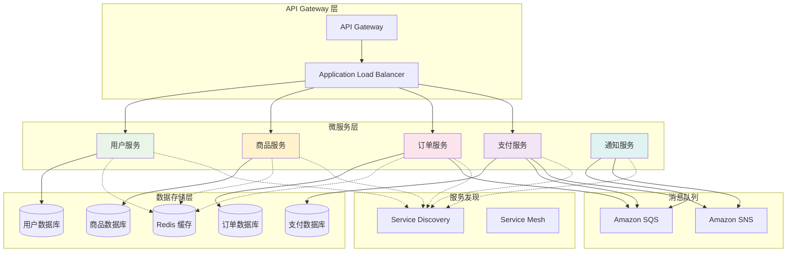

# 第 9 章：实战项目：微服务架构

::: tip 学习目标
- 设计和实现现代微服务架构
- 掌握服务发现和负载均衡配置
- 实现微服务间通信（同步和异步）
- 配置 API Gateway 和服务网格
- 实现分布式追踪和监控
- 掌握微服务的部署和扩展策略
:::

## 微服务架构概述

我们将构建一个电商系统的微服务架构，包括用户服务、商品服务、订单服务、支付服务和通知服务。



### 架构特点

- **服务独立性**：每个服务有独立的数据库和部署单元
- **异步通信**：使用消息队列实现服务间解耦
- **弹性扩展**：每个服务可独立扩展
- **故障隔离**：单个服务故障不影响整体系统
- **技术多样性**：不同服务可使用不同技术栈

## 共享基础设施

### 网络和服务发现

```python
# stacks/shared_infrastructure_stack.py
import aws_cdk as cdk
from aws_cdk import (
    aws_ec2 as ec2,
    aws_ecs as ecs,
    aws_servicediscovery as servicediscovery,
    aws_elasticloadbalancingv2 as elbv2,
    aws_logs as logs,
    aws_iam as iam
)
from constructs import Construct

class SharedInfrastructureStack(cdk.Stack):
    """共享基础设施 Stack"""
    
    def __init__(self, scope: Construct, construct_id: str, **kwargs) -> None:
        super().__init__(scope, construct_id, **kwargs)
        
        # VPC
        self.vpc = ec2.Vpc(
            self,
            "MicroservicesVPC",
            ip_addresses=ec2.IpAddresses.cidr("10.0.0.0/16"),
            max_azs=3,
            nat_gateways=2,
            subnet_configuration=[
                ec2.SubnetConfiguration(
                    cidr_mask=24,
                    name="PublicSubnet",
                    subnet_type=ec2.SubnetType.PUBLIC
                ),
                ec2.SubnetConfiguration(
                    cidr_mask=24, 
                    name="PrivateSubnet",
                    subnet_type=ec2.SubnetType.PRIVATE_WITH_EGRESS
                ),
                ec2.SubnetConfiguration(
                    cidr_mask=28,
                    name="DatabaseSubnet",
                    subnet_type=ec2.SubnetType.PRIVATE_ISOLATED
                )
            ]
        )
        
        # ECS Cluster
        self.cluster = ecs.Cluster(
            self,
            "MicroservicesCluster",
            vpc=self.vpc,
            cluster_name="microservices-cluster",
            container_insights=True
        )
        
        # 添加 EC2 容量（可选，也可以使用 Fargate）
        self.cluster.add_capacity(
            "EC2Capacity",
            instance_type=ec2.InstanceType("t3.medium"),
            min_capacity=2,
            max_capacity=10,
            auto_scaling_group_name="microservices-asg"
        )
        
        # Service Discovery Namespace
        self.service_discovery_namespace = servicediscovery.PrivateDnsNamespace(
            self,
            "ServiceDiscoveryNamespace",
            name="microservices.local",
            vpc=self.vpc,
            description="Service discovery namespace for microservices"
        )
        
        # Application Load Balancer
        self.load_balancer = elbv2.ApplicationLoadBalancer(
            self,
            "MicroservicesALB",
            vpc=self.vpc,
            internet_facing=True,
            load_balancer_name="microservices-alb"
        )
        
        # ALB Listener
        self.listener = self.load_balancer.add_listener(
            "ALBListener",
            port=80,
            protocol=elbv2.ApplicationProtocol.HTTP,
            default_action=elbv2.ListenerAction.fixed_response(
                status_code=404,
                content_type="text/plain",
                message_body="Service not found"
            )
        )
        
        # 安全组
        self.alb_security_group = ec2.SecurityGroup(
            self,
            "ALBSecurityGroup",
            vpc=self.vpc,
            description="Security group for Application Load Balancer",
            allow_all_outbound=True
        )
        
        self.alb_security_group.add_ingress_rule(
            peer=ec2.Peer.any_ipv4(),
            connection=ec2.Port.tcp(80),
            description="Allow HTTP traffic from anywhere"
        )
        
        self.alb_security_group.add_ingress_rule(
            peer=ec2.Peer.any_ipv4(),
            connection=ec2.Port.tcp(443),
            description="Allow HTTPS traffic from anywhere"
        )
        
        # ECS Service 安全组
        self.ecs_security_group = ec2.SecurityGroup(
            self,
            "ECSSecurityGroup",
            vpc=self.vpc,
            description="Security group for ECS services",
            allow_all_outbound=True
        )
        
        self.ecs_security_group.add_ingress_rule(
            peer=self.alb_security_group,
            connection=ec2.Port.all_traffic(),
            description="Allow traffic from ALB"
        )
        
        # 服务间通信
        self.ecs_security_group.add_ingress_rule(
            peer=self.ecs_security_group,
            connection=ec2.Port.all_traffic(),
            description="Allow inter-service communication"
        )
        
        # CloudWatch Log Groups
        self.log_group = logs.LogGroup(
            self,
            "MicroservicesLogGroup",
            log_group_name="/aws/ecs/microservices",
            retention=logs.RetentionDays.ONE_MONTH,
            removal_policy=cdk.RemovalPolicy.DESTROY
        )
        
        # ECS Task Execution Role
        self.task_execution_role = iam.Role(
            self,
            "ECSTaskExecutionRole",
            assumed_by=iam.ServicePrincipal("ecs-tasks.amazonaws.com"),
            managed_policies=[
                iam.ManagedPolicy.from_aws_managed_policy_name("service-role/AmazonECSTaskExecutionRolePolicy")
            ]
        )
        
        # ECS Task Role
        self.task_role = iam.Role(
            self,
            "ECSTaskRole", 
            assumed_by=iam.ServicePrincipal("ecs-tasks.amazonaws.com")
        )
        
        # 输出
        cdk.CfnOutput(self, "VPCId", value=self.vpc.vpc_id)
        cdk.CfnOutput(self, "ClusterName", value=self.cluster.cluster_name)
        cdk.CfnOutput(self, "LoadBalancerDNS", value=self.load_balancer.load_balancer_dns_name)
        cdk.CfnOutput(self, "ServiceDiscoveryNamespace", value=self.service_discovery_namespace.namespace_name)
```

### 消息队列和缓存

```python
# stacks/messaging_stack.py
import aws_cdk as cdk
from aws_cdk import (
    aws_sqs as sqs,
    aws_sns as sns,
    aws_sns_subscriptions as subscriptions,
    aws_elasticache as elasticache,
    aws_ec2 as ec2
)
from constructs import Construct
from .shared_infrastructure_stack import SharedInfrastructureStack

class MessagingStack(cdk.Stack):
    """消息队列和缓存 Stack"""
    
    def __init__(self, scope: Construct, construct_id: str,
                 shared_infra: SharedInfrastructureStack, **kwargs) -> None:
        super().__init__(scope, construct_id, **kwargs)
        
        self.shared_infra = shared_infra
        
        # 死信队列
        self.dead_letter_queue = sqs.Queue(
            self,
            "DeadLetterQueue",
            queue_name="microservices-dlq",
            retention_period=cdk.Duration.days(14)
        )
        
        # 订单处理队列
        self.order_queue = sqs.Queue(
            self,
            "OrderQueue",
            queue_name="order-processing-queue",
            visibility_timeout=cdk.Duration.seconds(300),
            dead_letter_queue=sqs.DeadLetterQueue(
                max_receive_count=3,
                queue=self.dead_letter_queue
            )
        )
        
        # 支付处理队列
        self.payment_queue = sqs.Queue(
            self,
            "PaymentQueue",
            queue_name="payment-processing-queue",
            visibility_timeout=cdk.Duration.seconds(300),
            dead_letter_queue=sqs.DeadLetterQueue(
                max_receive_count=3,
                queue=self.dead_letter_queue
            )
        )
        
        # 通知队列
        self.notification_queue = sqs.Queue(
            self,
            "NotificationQueue",
            queue_name="notification-queue",
            visibility_timeout=cdk.Duration.seconds(60),
            dead_letter_queue=sqs.DeadLetterQueue(
                max_receive_count=5,
                queue=self.dead_letter_queue
            )
        )
        
        # 库存队列
        self.inventory_queue = sqs.Queue(
            self,
            "InventoryQueue",
            queue_name="inventory-update-queue",
            visibility_timeout=cdk.Duration.seconds(180),
            dead_letter_queue=sqs.DeadLetterQueue(
                max_receive_count=3,
                queue=self.dead_letter_queue
            )
        )
        
        # SNS 主题 - 订单事件
        self.order_events_topic = sns.Topic(
            self,
            "OrderEventsTopic",
            topic_name="order-events",
            display_name="Order Events"
        )
        
        # SNS 主题 - 支付事件
        self.payment_events_topic = sns.Topic(
            self,
            "PaymentEventsTopic",
            topic_name="payment-events",
            display_name="Payment Events"
        )
        
        # SNS 主题 - 通知事件
        self.notification_events_topic = sns.Topic(
            self,
            "NotificationEventsTopic",
            topic_name="notification-events",
            display_name="Notification Events"
        )
        
        # 订阅关系
        # 订单事件 -> 支付队列
        self.order_events_topic.add_subscription(
            subscriptions.SqsSubscription(
                self.payment_queue,
                filter_policy={
                    "event_type": sns.SubscriptionFilter.string_filter(
                        allowlist=["ORDER_CREATED", "ORDER_UPDATED"]
                    )
                }
            )
        )
        
        # 订单事件 -> 库存队列
        self.order_events_topic.add_subscription(
            subscriptions.SqsSubscription(
                self.inventory_queue,
                filter_policy={
                    "event_type": sns.SubscriptionFilter.string_filter(
                        allowlist=["ORDER_CREATED", "ORDER_CANCELLED"]
                    )
                }
            )
        )
        
        # 支付事件 -> 通知队列
        self.payment_events_topic.add_subscription(
            subscriptions.SqsSubscription(
                self.notification_queue,
                filter_policy={
                    "event_type": sns.SubscriptionFilter.string_filter(
                        allowlist=["PAYMENT_COMPLETED", "PAYMENT_FAILED"]
                    )
                }
            )
        )
        
        # 所有通知事件 -> 通知队列
        self.notification_events_topic.add_subscription(
            subscriptions.SqsSubscription(self.notification_queue)
        )
        
        # ElastiCache 子网组
        cache_subnet_group = elasticache.CfnSubnetGroup(
            self,
            "CacheSubnetGroup",
            description="Subnet group for ElastiCache",
            subnet_ids=shared_infra.vpc.select_subnets(
                subnet_type=ec2.SubnetType.PRIVATE_WITH_EGRESS
            ).subnet_ids
        )
        
        # Cache 安全组
        cache_security_group = ec2.SecurityGroup(
            self,
            "CacheSecurityGroup",
            vpc=shared_infra.vpc,
            description="Security group for ElastiCache Redis",
            allow_all_outbound=False
        )
        
        cache_security_group.add_ingress_rule(
            peer=shared_infra.ecs_security_group,
            connection=ec2.Port.tcp(6379),
            description="Allow Redis access from ECS services"
        )
        
        # Redis 集群
        self.redis_cluster = elasticache.CfnReplicationGroup(
            self,
            "RedisCluster",
            replication_group_description="Redis cluster for microservices",
            replication_group_id="microservices-redis",
            # 集群配置
            cache_node_type="cache.t3.micro",
            num_cache_clusters=2,  # 主节点 + 1个副本
            engine="redis",
            engine_version="7.0",
            port=6379,
            # 网络配置
            cache_subnet_group_name=cache_subnet_group.ref,
            security_group_ids=[cache_security_group.security_group_id],
            # 持久化和备份
            automatic_failover_enabled=True,
            multi_az_enabled=True,
            snapshot_retention_limit=5,
            snapshot_window="03:00-05:00",
            preferred_maintenance_window="sun:05:00-sun:07:00",
            # 参数组（可选）
            cache_parameter_group_name="default.redis7"
        )
        
        # 输出
        cdk.CfnOutput(self, "OrderQueueUrl", value=self.order_queue.queue_url)
        cdk.CfnOutput(self, "PaymentQueueUrl", value=self.payment_queue.queue_url)
        cdk.CfnOutput(self, "NotificationQueueUrl", value=self.notification_queue.queue_url)
        cdk.CfnOutput(self, "InventoryQueueUrl", value=self.inventory_queue.queue_url)
        cdk.CfnOutput(self, "OrderEventsTopicArn", value=self.order_events_topic.topic_arn)
        cdk.CfnOutput(self, "PaymentEventsTopicArn", value=self.payment_events_topic.topic_arn)
        cdk.CfnOutput(self, "NotificationEventsTopicArn", value=self.notification_events_topic.topic_arn)
        cdk.CfnOutput(self, "RedisEndpoint", value=self.redis_cluster.attr_configuration_end_point_address)
```

## 微服务实现

### 用户服务

```python
# stacks/user_service_stack.py
import aws_cdk as cdk
from aws_cdk import (
    aws_ecs as ecs,
    aws_ecs_patterns as ecs_patterns,
    aws_rds as rds,
    aws_ec2 as ec2,
    aws_servicediscovery as servicediscovery,
    aws_iam as iam,
    aws_secretsmanager as secrets
)
from constructs import Construct
from .shared_infrastructure_stack import SharedInfrastructureStack
from .messaging_stack import MessagingStack

class UserServiceStack(cdk.Stack):
    """用户服务 Stack"""
    
    def __init__(self, scope: Construct, construct_id: str,
                 shared_infra: SharedInfrastructureStack,
                 messaging: MessagingStack, **kwargs) -> None:
        super().__init__(scope, construct_id, **kwargs)
        
        # 数据库凭证
        self.db_credentials = rds.DatabaseSecret(
            self,
            "UserDBSecret",
            username="userservice",
            secret_name="user-service-db-credentials"
        )
        
        # 数据库子网组
        db_subnet_group = rds.SubnetGroup(
            self,
            "UserDBSubnetGroup",
            description="Subnet group for user service database",
            vpc=shared_infra.vpc,
            vpc_subnets=ec2.SubnetSelection(
                subnet_type=ec2.SubnetType.PRIVATE_ISOLATED
            )
        )
        
        # 数据库安全组
        db_security_group = ec2.SecurityGroup(
            self,
            "UserDBSecurityGroup",
            vpc=shared_infra.vpc,
            description="Security group for user service database",
            allow_all_outbound=False
        )
        
        db_security_group.add_ingress_rule(
            peer=shared_infra.ecs_security_group,
            connection=ec2.Port.tcp(5432),
            description="Allow PostgreSQL access from user service"
        )
        
        # RDS PostgreSQL 数据库
        self.database = rds.DatabaseInstance(
            self,
            "UserDatabase",
            engine=rds.DatabaseInstanceEngine.postgres(
                version=rds.PostgresEngineVersion.VER_14_9
            ),
            instance_type=ec2.InstanceType.of(
                ec2.InstanceClass.BURSTABLE3,
                ec2.InstanceSize.MICRO
            ),
            vpc=shared_infra.vpc,
            subnet_group=db_subnet_group,
            security_groups=[db_security_group],
            credentials=rds.Credentials.from_secret(self.db_credentials),
            database_name="userservice",
            allocated_storage=20,
            max_allocated_storage=100,
            storage_encrypted=True,
            backup_retention=cdk.Duration.days(7),
            deletion_protection=False,
            monitoring_interval=cdk.Duration.seconds(60)
        )
        
        # ECS 任务定义
        self.task_definition = ecs.FargateTaskDefinition(
            self,
            "UserServiceTaskDef",
            memory_limit_mib=512,
            cpu=256,
            execution_role=shared_infra.task_execution_role,
            task_role=shared_infra.task_role
        )
        
        # 添加 IAM 权限
        shared_infra.task_role.add_to_policy(
            iam.PolicyStatement(
                effect=iam.Effect.ALLOW,
                actions=[
                    "secretsmanager:GetSecretValue",
                    "secretsmanager:DescribeSecret"
                ],
                resources=[self.db_credentials.secret_arn]
            )
        )
        
        shared_infra.task_role.add_to_policy(
            iam.PolicyStatement(
                effect=iam.Effect.ALLOW,
                actions=[
                    "sns:Publish"
                ],
                resources=[
                    messaging.notification_events_topic.topic_arn
                ]
            )
        )
        
        # 容器定义
        self.container = self.task_definition.add_container(
            "UserServiceContainer",
            image=ecs.ContainerImage.from_registry("user-service:latest"),
            memory_limit_mib=512,
            logging=ecs.LogDrivers.aws_logs(
                stream_prefix="user-service",
                log_group=shared_infra.log_group
            ),
            environment={
                "SERVICE_NAME": "user-service",
                "SERVICE_PORT": "8080",
                "DB_HOST": self.database.instance_endpoint.hostname,
                "DB_PORT": self.database.instance_endpoint.port,
                "DB_NAME": "userservice",
                "REDIS_HOST": messaging.redis_cluster.attr_configuration_end_point_address,
                "REDIS_PORT": "6379",
                "NOTIFICATION_TOPIC_ARN": messaging.notification_events_topic.topic_arn,
                "AWS_DEFAULT_REGION": self.region
            },
            secrets={
                "DB_USERNAME": ecs.Secret.from_secrets_manager(self.db_credentials, "username"),
                "DB_PASSWORD": ecs.Secret.from_secrets_manager(self.db_credentials, "password")
            }
        )
        
        self.container.add_port_mappings(
            ecs.PortMapping(
                container_port=8080,
                protocol=ecs.Protocol.TCP
            )
        )
        
        # ECS 服务
        self.service = ecs.FargateService(
            self,
            "UserService",
            cluster=shared_infra.cluster,
            task_definition=self.task_definition,
            desired_count=2,
            service_name="user-service",
            security_groups=[shared_infra.ecs_security_group],
            vpc_subnets=ec2.SubnetSelection(
                subnet_type=ec2.SubnetType.PRIVATE_WITH_EGRESS
            ),
            # 服务发现
            cloud_map_options=ecs.CloudMapOptions(
                name="user-service",
                cloud_map_namespace=shared_infra.service_discovery_namespace,
                dns_record_type=servicediscovery.DnsRecordType.A,
                dns_ttl=cdk.Duration.seconds(60)
            )
        )
        
        # 目标组
        self.target_group = elbv2.ApplicationTargetGroup(
            self,
            "UserServiceTargetGroup",
            port=8080,
            protocol=elbv2.ApplicationProtocol.HTTP,
            targets=[self.service],
            vpc=shared_infra.vpc,
            target_type=elbv2.TargetType.IP,
            health_check=elbv2.HealthCheck(
                enabled=True,
                healthy_http_codes="200",
                interval=cdk.Duration.seconds(30),
                path="/health",
                protocol=elbv2.Protocol.HTTP,
                timeout=cdk.Duration.seconds(5),
                unhealthy_threshold_count=3
            )
        )
        
        # 添加 ALB 监听器规则
        shared_infra.listener.add_targets(
            "UserServiceRule",
            targets=[self.target_group],
            conditions=[
                elbv2.ListenerCondition.path_patterns(["/api/users/*"])
            ],
            priority=100
        )
        
        # 自动扩展
        scalable_target = self.service.auto_scale_task_count(
            min_capacity=2,
            max_capacity=10
        )
        
        scalable_target.scale_on_cpu_utilization(
            "UserServiceCPUScaling",
            target_utilization_percent=70,
            scale_in_cooldown=cdk.Duration.minutes(3),
            scale_out_cooldown=cdk.Duration.minutes(1)
        )
        
        scalable_target.scale_on_memory_utilization(
            "UserServiceMemoryScaling",
            target_utilization_percent=80,
            scale_in_cooldown=cdk.Duration.minutes(3),
            scale_out_cooldown=cdk.Duration.minutes(1)
        )
        
        # 输出
        cdk.CfnOutput(self, "UserDatabaseEndpoint", value=self.database.instance_endpoint.hostname)
        cdk.CfnOutput(self, "UserServiceName", value=self.service.service_name)
```

### 订单服务

```python
# stacks/order_service_stack.py
import aws_cdk as cdk
from aws_cdk import (
    aws_ecs as ecs,
    aws_rds as rds,
    aws_ec2 as ec2,
    aws_elasticloadbalancingv2 as elbv2,
    aws_servicediscovery as servicediscovery,
    aws_iam as iam
)
from constructs import Construct
from .shared_infrastructure_stack import SharedInfrastructureStack
from .messaging_stack import MessagingStack

class OrderServiceStack(cdk.Stack):
    """订单服务 Stack"""
    
    def __init__(self, scope: Construct, construct_id: str,
                 shared_infra: SharedInfrastructureStack,
                 messaging: MessagingStack, **kwargs) -> None:
        super().__init__(scope, construct_id, **kwargs)
        
        # 数据库凭证
        self.db_credentials = rds.DatabaseSecret(
            self,
            "OrderDBSecret",
            username="orderservice",
            secret_name="order-service-db-credentials"
        )
        
        # 数据库子网组和安全组
        db_subnet_group = rds.SubnetGroup(
            self,
            "OrderDBSubnetGroup",
            description="Subnet group for order service database",
            vpc=shared_infra.vpc,
            vpc_subnets=ec2.SubnetSelection(
                subnet_type=ec2.SubnetType.PRIVATE_ISOLATED
            )
        )
        
        db_security_group = ec2.SecurityGroup(
            self,
            "OrderDBSecurityGroup",
            vpc=shared_infra.vpc,
            description="Security group for order service database",
            allow_all_outbound=False
        )
        
        db_security_group.add_ingress_rule(
            peer=shared_infra.ecs_security_group,
            connection=ec2.Port.tcp(5432),
            description="Allow PostgreSQL access from order service"
        )
        
        # RDS PostgreSQL 数据库
        self.database = rds.DatabaseInstance(
            self,
            "OrderDatabase",
            engine=rds.DatabaseInstanceEngine.postgres(
                version=rds.PostgresEngineVersion.VER_14_9
            ),
            instance_type=ec2.InstanceType.of(
                ec2.InstanceClass.BURSTABLE3,
                ec2.InstanceSize.SMALL  # 订单服务可能需要更多资源
            ),
            vpc=shared_infra.vpc,
            subnet_group=db_subnet_group,
            security_groups=[db_security_group],
            credentials=rds.Credentials.from_secret(self.db_credentials),
            database_name="orderservice",
            allocated_storage=20,
            max_allocated_storage=200,
            storage_encrypted=True,
            backup_retention=cdk.Duration.days(14),  # 订单数据备份保留更久
            deletion_protection=False,
            monitoring_interval=cdk.Duration.seconds(60),
            performance_insights_enabled=True
        )
        
        # ECS 任务定义
        self.task_definition = ecs.FargateTaskDefinition(
            self,
            "OrderServiceTaskDef",
            memory_limit_mib=1024,  # 订单服务需要更多内存
            cpu=512,
            execution_role=shared_infra.task_execution_role,
            task_role=shared_infra.task_role
        )
        
        # 添加权限
        shared_infra.task_role.add_to_policy(
            iam.PolicyStatement(
                effect=iam.Effect.ALLOW,
                actions=[
                    "secretsmanager:GetSecretValue",
                    "secretsmanager:DescribeSecret"
                ],
                resources=[self.db_credentials.secret_arn]
            )
        )
        
        shared_infra.task_role.add_to_policy(
            iam.PolicyStatement(
                effect=iam.Effect.ALLOW,
                actions=[
                    "sqs:ReceiveMessage",
                    "sqs:DeleteMessage",
                    "sqs:GetQueueAttributes"
                ],
                resources=[messaging.order_queue.queue_arn]
            )
        )
        
        shared_infra.task_role.add_to_policy(
            iam.PolicyStatement(
                effect=iam.Effect.ALLOW,
                actions=[
                    "sns:Publish"
                ],
                resources=[
                    messaging.order_events_topic.topic_arn,
                    messaging.notification_events_topic.topic_arn
                ]
            )
        )
        
        # 容器定义
        self.container = self.task_definition.add_container(
            "OrderServiceContainer",
            image=ecs.ContainerImage.from_registry("order-service:latest"),
            memory_limit_mib=1024,
            logging=ecs.LogDrivers.aws_logs(
                stream_prefix="order-service",
                log_group=shared_infra.log_group
            ),
            environment={
                "SERVICE_NAME": "order-service",
                "SERVICE_PORT": "8080",
                "DB_HOST": self.database.instance_endpoint.hostname,
                "DB_PORT": self.database.instance_endpoint.port,
                "DB_NAME": "orderservice",
                "REDIS_HOST": messaging.redis_cluster.attr_configuration_end_point_address,
                "REDIS_PORT": "6379",
                "ORDER_QUEUE_URL": messaging.order_queue.queue_url,
                "ORDER_EVENTS_TOPIC_ARN": messaging.order_events_topic.topic_arn,
                "NOTIFICATION_TOPIC_ARN": messaging.notification_events_topic.topic_arn,
                # 其他服务发现地址
                "USER_SERVICE_URL": "http://user-service.microservices.local:8080",
                "PRODUCT_SERVICE_URL": "http://product-service.microservices.local:8080",
                "PAYMENT_SERVICE_URL": "http://payment-service.microservices.local:8080",
                "AWS_DEFAULT_REGION": self.region
            },
            secrets={
                "DB_USERNAME": ecs.Secret.from_secrets_manager(self.db_credentials, "username"),
                "DB_PASSWORD": ecs.Secret.from_secrets_manager(self.db_credentials, "password")
            }
        )
        
        self.container.add_port_mappings(
            ecs.PortMapping(
                container_port=8080,
                protocol=ecs.Protocol.TCP
            )
        )
        
        # ECS 服务
        self.service = ecs.FargateService(
            self,
            "OrderService",
            cluster=shared_infra.cluster,
            task_definition=self.task_definition,
            desired_count=3,  # 订单服务需要更多实例
            service_name="order-service",
            security_groups=[shared_infra.ecs_security_group],
            vpc_subnets=ec2.SubnetSelection(
                subnet_type=ec2.SubnetType.PRIVATE_WITH_EGRESS
            ),
            cloud_map_options=ecs.CloudMapOptions(
                name="order-service",
                cloud_map_namespace=shared_infra.service_discovery_namespace,
                dns_record_type=servicediscovery.DnsRecordType.A,
                dns_ttl=cdk.Duration.seconds(60)
            )
        )
        
        # 目标组
        self.target_group = elbv2.ApplicationTargetGroup(
            self,
            "OrderServiceTargetGroup",
            port=8080,
            protocol=elbv2.ApplicationProtocol.HTTP,
            targets=[self.service],
            vpc=shared_infra.vpc,
            target_type=elbv2.TargetType.IP,
            health_check=elbv2.HealthCheck(
                enabled=True,
                healthy_http_codes="200",
                interval=cdk.Duration.seconds(30),
                path="/health",
                protocol=elbv2.Protocol.HTTP,
                timeout=cdk.Duration.seconds(10),
                unhealthy_threshold_count=3
            )
        )
        
        # ALB 路由规则
        shared_infra.listener.add_targets(
            "OrderServiceRule",
            targets=[self.target_group],
            conditions=[
                elbv2.ListenerCondition.path_patterns(["/api/orders/*"])
            ],
            priority=200
        )
        
        # 自动扩展 - 订单服务可能有突发流量
        scalable_target = self.service.auto_scale_task_count(
            min_capacity=3,
            max_capacity=20
        )
        
        # CPU 扩展
        scalable_target.scale_on_cpu_utilization(
            "OrderServiceCPUScaling",
            target_utilization_percent=60,  # 更低的阈值
            scale_in_cooldown=cdk.Duration.minutes(5),
            scale_out_cooldown=cdk.Duration.seconds(30)
        )
        
        # 基于 SQS 队列长度扩展
        scalable_target.scale_on_metric(
            "OrderServiceQueueScaling",
            metric=messaging.order_queue.metric_approximate_number_of_visible_messages(),
            scaling_steps=[
                {"lower": 0, "upper": 10, "change": 0},
                {"lower": 10, "upper": 50, "change": +2},
                {"lower": 50, "upper": 100, "change": +5},
                {"lower": 100, "change": +10}
            ],
            adjustment_type=ecs.AdjustmentType.CHANGE_IN_CAPACITY,
            cooldown=cdk.Duration.minutes(2)
        )
        
        # 输出
        cdk.CfnOutput(self, "OrderDatabaseEndpoint", value=self.database.instance_endpoint.hostname)
        cdk.CfnOutput(self, "OrderServiceName", value=self.service.service_name)
```

### 商品服务（简化版）

```python
# stacks/product_service_stack.py
import aws_cdk as cdk
from aws_cdk import (
    aws_ecs as ecs,
    aws_rds as rds,
    aws_ec2 as ec2,
    aws_elasticloadbalancingv2 as elbv2,
    aws_servicediscovery as servicediscovery,
    aws_iam as iam,
    aws_s3 as s3
)
from constructs import Construct
from .shared_infrastructure_stack import SharedInfrastructureStack
from .messaging_stack import MessagingStack

class ProductServiceStack(cdk.Stack):
    """商品服务 Stack"""
    
    def __init__(self, scope: Construct, construct_id: str,
                 shared_infra: SharedInfrastructureStack,
                 messaging: MessagingStack, **kwargs) -> None:
        super().__init__(scope, construct_id, **kwargs)
        
        # 数据库配置（简化）
        self.db_credentials = rds.DatabaseSecret(
            self,
            "ProductDBSecret",
            username="productservice",
            secret_name="product-service-db-credentials"
        )
        
        # 商品图片存储
        self.product_images_bucket = s3.Bucket(
            self,
            "ProductImagesBucket",
            bucket_name=f"product-images-{self.account}-{self.region}",
            versioned=True,
            encryption=s3.BucketEncryption.S3_MANAGED,
            cors=[
                s3.CorsRule(
                    allowed_methods=[s3.HttpMethods.GET, s3.HttpMethods.PUT, s3.HttpMethods.POST],
                    allowed_origins=["*"],
                    allowed_headers=["*"],
                    max_age=3000
                )
            ],
            lifecycle_rules=[
                s3.LifecycleRule(
                    id="DeleteOldVersions",
                    enabled=True,
                    noncurrent_version_expiration=cdk.Duration.days(30)
                )
            ]
        )
        
        # 数据库（使用 Aurora Serverless v2）
        self.database_cluster = rds.DatabaseCluster(
            self,
            "ProductDatabaseCluster",
            engine=rds.DatabaseClusterEngine.aurora_postgres(
                version=rds.AuroraPostgresEngineVersion.VER_14_9
            ),
            credentials=rds.Credentials.from_secret(self.db_credentials),
            default_database_name="productservice",
            vpc=shared_infra.vpc,
            vpc_subnets=ec2.SubnetSelection(
                subnet_type=ec2.SubnetType.PRIVATE_ISOLATED
            ),
            security_groups=[
                ec2.SecurityGroup(
                    self,
                    "ProductDBSecurityGroup",
                    vpc=shared_infra.vpc,
                    description="Security group for product database cluster",
                    allow_all_outbound=False
                )
            ],
            # Serverless v2 配置
            serverless_v2_min_capacity=0.5,
            serverless_v2_max_capacity=4
        )
        
        # 允许 ECS 访问数据库
        self.database_cluster.connections.allow_default_port_from(
            shared_infra.ecs_security_group,
            "Allow access from ECS services"
        )
        
        # ECS 任务定义
        self.task_definition = ecs.FargateTaskDefinition(
            self,
            "ProductServiceTaskDef",
            memory_limit_mib=512,
            cpu=256,
            execution_role=shared_infra.task_execution_role,
            task_role=shared_infra.task_role
        )
        
        # 添加权限
        self.product_images_bucket.grant_read_write(shared_infra.task_role)
        
        shared_infra.task_role.add_to_policy(
            iam.PolicyStatement(
                effect=iam.Effect.ALLOW,
                actions=[
                    "secretsmanager:GetSecretValue",
                    "secretsmanager:DescribeSecret"
                ],
                resources=[self.db_credentials.secret_arn]
            )
        )
        
        shared_infra.task_role.add_to_policy(
            iam.PolicyStatement(
                effect=iam.Effect.ALLOW,
                actions=[
                    "sqs:ReceiveMessage",
                    "sqs:DeleteMessage"
                ],
                resources=[messaging.inventory_queue.queue_arn]
            )
        )
        
        # 容器定义
        self.container = self.task_definition.add_container(
            "ProductServiceContainer",
            image=ecs.ContainerImage.from_registry("product-service:latest"),
            memory_limit_mib=512,
            logging=ecs.LogDrivers.aws_logs(
                stream_prefix="product-service",
                log_group=shared_infra.log_group
            ),
            environment={
                "SERVICE_NAME": "product-service",
                "SERVICE_PORT": "8080",
                "DB_HOST": self.database_cluster.cluster_endpoint.hostname,
                "DB_PORT": str(self.database_cluster.cluster_endpoint.port),
                "DB_NAME": "productservice",
                "REDIS_HOST": messaging.redis_cluster.attr_configuration_end_point_address,
                "REDIS_PORT": "6379",
                "INVENTORY_QUEUE_URL": messaging.inventory_queue.queue_url,
                "PRODUCT_IMAGES_BUCKET": self.product_images_bucket.bucket_name,
                "AWS_DEFAULT_REGION": self.region
            },
            secrets={
                "DB_USERNAME": ecs.Secret.from_secrets_manager(self.db_credentials, "username"),
                "DB_PASSWORD": ecs.Secret.from_secrets_manager(self.db_credentials, "password")
            }
        )
        
        self.container.add_port_mappings(
            ecs.PortMapping(container_port=8080, protocol=ecs.Protocol.TCP)
        )
        
        # ECS 服务
        self.service = ecs.FargateService(
            self,
            "ProductService",
            cluster=shared_infra.cluster,
            task_definition=self.task_definition,
            desired_count=2,
            service_name="product-service",
            security_groups=[shared_infra.ecs_security_group],
            vpc_subnets=ec2.SubnetSelection(
                subnet_type=ec2.SubnetType.PRIVATE_WITH_EGRESS
            ),
            cloud_map_options=ecs.CloudMapOptions(
                name="product-service",
                cloud_map_namespace=shared_infra.service_discovery_namespace,
                dns_record_type=servicediscovery.DnsRecordType.A,
                dns_ttl=cdk.Duration.seconds(60)
            )
        )
        
        # 目标组和 ALB 规则
        self.target_group = elbv2.ApplicationTargetGroup(
            self,
            "ProductServiceTargetGroup",
            port=8080,
            protocol=elbv2.ApplicationProtocol.HTTP,
            targets=[self.service],
            vpc=shared_infra.vpc,
            target_type=elbv2.TargetType.IP,
            health_check=elbv2.HealthCheck(
                enabled=True,
                healthy_http_codes="200",
                interval=cdk.Duration.seconds(30),
                path="/health",
                timeout=cdk.Duration.seconds(5)
            )
        )
        
        shared_infra.listener.add_targets(
            "ProductServiceRule",
            targets=[self.target_group],
            conditions=[
                elbv2.ListenerCondition.path_patterns(["/api/products/*"])
            ],
            priority=300
        )
        
        # 自动扩展
        scalable_target = self.service.auto_scale_task_count(
            min_capacity=2,
            max_capacity=8
        )
        
        scalable_target.scale_on_cpu_utilization(
            "ProductServiceCPUScaling",
            target_utilization_percent=70
        )
        
        # 输出
        cdk.CfnOutput(self, "ProductDatabaseEndpoint", value=self.database_cluster.cluster_endpoint.hostname)
        cdk.CfnOutput(self, "ProductImagesBucket", value=self.product_images_bucket.bucket_name)
        cdk.CfnOutput(self, "ProductServiceName", value=self.service.service_name)
```

## API Gateway 集成

### API Gateway 微服务网关

```python
# stacks/api_gateway_stack.py
import aws_cdk as cdk
from aws_cdk import (
    aws_apigateway as apigateway,
    aws_elasticloadbalancingv2 as elbv2,
    aws_certificatemanager as acm,
    aws_route53 as route53,
    aws_wafv2 as wafv2,
    aws_logs as logs
)
from constructs import Construct
from .shared_infrastructure_stack import SharedInfrastructureStack

class ApiGatewayStack(cdk.Stack):
    """API Gateway 微服务网关 Stack"""
    
    def __init__(self, scope: Construct, construct_id: str,
                 shared_infra: SharedInfrastructureStack,
                 domain_name: str = None, **kwargs) -> None:
        super().__init__(scope, construct_id, **kwargs)
        
        # VPC Link - 连接到内部负载均衡器
        self.vpc_link = apigateway.VpcLink(
            self,
            "MicroservicesVpcLink",
            targets=[shared_infra.load_balancer],
            description="VPC link for microservices"
        )
        
        # API Gateway 访问日志
        log_group = logs.LogGroup(
            self,
            "ApiGatewayAccessLogs",
            log_group_name="/aws/apigateway/microservices-api",
            retention=logs.RetentionDays.ONE_MONTH,
            removal_policy=cdk.RemovalPolicy.DESTROY
        )
        
        # API Gateway REST API
        self.api = apigateway.RestApi(
            self,
            "MicroservicesAPI",
            rest_api_name="microservices-gateway",
            description="API Gateway for microservices",
            # CORS 配置
            default_cors_preflight_options=apigateway.CorsOptions(
                allow_origins=apigateway.Cors.ALL_ORIGINS,
                allow_methods=apigateway.Cors.ALL_METHODS,
                allow_headers=[
                    "Content-Type", 
                    "X-Amz-Date", 
                    "Authorization", 
                    "X-Api-Key",
                    "X-Requested-With"
                ],
                max_age=cdk.Duration.minutes(10)
            ),
            # 部署配置
            deploy_options=apigateway.StageOptions(
                stage_name="v1",
                # 限流配置
                throttling_rate_limit=2000,
                throttling_burst_limit=5000,
                # 日志配置
                logging_level=apigateway.MethodLoggingLevel.INFO,
                data_trace_enabled=True,
                metrics_enabled=True,
                # 访问日志
                access_log_destination=apigateway.LogGroupLogDestination(log_group),
                access_log_format=apigateway.AccessLogFormat.json_with_standard_fields(
                    caller=True,
                    http_method=True,
                    ip=True,
                    protocol=True,
                    request_time=True,
                    resource_path=True,
                    response_length=True,
                    status=True,
                    user=True
                )
            ),
            # 策略
            policy=None,  # 可以添加资源策略
            # 端点配置
            endpoint_configuration=apigateway.EndpointConfiguration(
                types=[apigateway.EndpointType.REGIONAL]
            )
        )
        
        # SSL 证书（如果提供域名）
        if domain_name:
            certificate = acm.Certificate(
                self,
                "ApiCertificate",
                domain_name=f"api.{domain_name}",
                validation=acm.CertificateValidation.from_dns()
            )
            
            # 自定义域名
            self.api.add_domain_name(
                "ApiDomainName",
                domain_name=f"api.{domain_name}",
                certificate=certificate
            )
        
        # 请求验证器
        request_validator = self.api.add_request_validator(
            "RequestValidator",
            validate_request_body=True,
            validate_request_parameters=True
        )
        
        # API Key 和使用计划
        api_key = apigateway.ApiKey(
            self,
            "MicroservicesApiKey",
            api_key_name="microservices-api-key"
        )
        
        usage_plan = apigateway.UsagePlan(
            self,
            "MicroservicesUsagePlan",
            name="microservices-usage-plan",
            api_stages=[
                apigateway.UsagePlanPerApiStage(
                    api=self.api,
                    stage=self.api.deployment_stage
                )
            ],
            throttle=apigateway.ThrottleSettings(
                rate_limit=2000,
                burst_limit=5000
            ),
            quota=apigateway.QuotaSettings(
                limit=100000,
                period=apigateway.Period.DAY
            )
        )
        usage_plan.add_api_key(api_key)
        
        # HTTP 集成 - 指向 ALB
        alb_integration = apigateway.HttpIntegration(
            f"http://{shared_infra.load_balancer.load_balancer_dns_name}",
            http_method="ANY",
            options=apigateway.IntegrationOptions(
                connection_type=apigateway.ConnectionType.VPC_LINK,
                vpc_link=self.vpc_link,
                timeout=cdk.Duration.seconds(29),
                request_parameters={
                    "integration.request.path.proxy": "method.request.path.proxy",
                    "integration.request.header.Accept": "method.request.header.Accept"
                }
            )
        )
        
        # 代理资源 - 将所有请求转发到微服务
        proxy_resource = self.api.root.add_proxy(
            default_integration=alb_integration,
            any_method=True
        )
        
        # 健康检查端点
        health_resource = self.api.root.add_resource("health")
        health_resource.add_method(
            "GET",
            apigateway.MockIntegration(
                integration_responses=[
                    apigateway.IntegrationResponse(
                        status_code="200",
                        response_templates={
                            "application/json": '{"status": "healthy", "timestamp": "$context.requestTime"}'
                        }
                    )
                ],
                request_templates={
                    "application/json": '{"statusCode": 200}'
                }
            ),
            method_responses=[
                apigateway.MethodResponse(
                    status_code="200",
                    response_models={
                        "application/json": apigateway.Model.EMPTY_MODEL
                    }
                )
            ]
        )
        
        # WAF Web ACL（可选）
        if self.node.try_get_context("enable_waf"):
            web_acl = wafv2.CfnWebACL(
                self,
                "ApiGatewayWebACL",
                scope="REGIONAL",
                default_action=wafv2.CfnWebACL.DefaultActionProperty(allow={}),
                rules=[
                    # 速率限制规则
                    wafv2.CfnWebACL.RuleProperty(
                        name="RateLimitRule",
                        priority=1,
                        statement=wafv2.CfnWebACL.StatementProperty(
                            rate_based_statement=wafv2.CfnWebACL.RateBasedStatementProperty(
                                limit=2000,
                                aggregate_key_type="IP"
                            )
                        ),
                        action=wafv2.CfnWebACL.RuleActionProperty(
                            block={}
                        ),
                        visibility_config=wafv2.CfnWebACL.VisibilityConfigProperty(
                            cloud_watch_metrics_enabled=True,
                            metric_name="RateLimitRule",
                            sampled_requests_enabled=True
                        )
                    ),
                    # AWS 托管规则 - 通用 OWASP
                    wafv2.CfnWebACL.RuleProperty(
                        name="AWSManagedRulesCommonRuleSet",
                        priority=2,
                        override_action=wafv2.CfnWebACL.OverrideActionProperty(none={}),
                        statement=wafv2.CfnWebACL.StatementProperty(
                            managed_rule_group_statement=wafv2.CfnWebACL.ManagedRuleGroupStatementProperty(
                                vendor_name="AWS",
                                name="AWSManagedRulesCommonRuleSet"
                            )
                        ),
                        visibility_config=wafv2.CfnWebACL.VisibilityConfigProperty(
                            cloud_watch_metrics_enabled=True,
                            metric_name="CommonRuleSet",
                            sampled_requests_enabled=True
                        )
                    )
                ],
                visibility_config=wafv2.CfnWebACL.VisibilityConfigProperty(
                    cloud_watch_metrics_enabled=True,
                    metric_name="MicroservicesAPIWebACL",
                    sampled_requests_enabled=True
                )
            )
            
            # 关联 Web ACL 到 API Gateway
            wafv2.CfnWebACLAssociation(
                self,
                "ApiGatewayWebACLAssociation",
                resource_arn=self.api.deployment_stage.stage_arn,
                web_acl_arn=web_acl.attr_arn
            )
        
        # 输出
        cdk.CfnOutput(
            self,
            "ApiGatewayUrl",
            value=self.api.url,
            description="API Gateway URL"
        )
        
        if domain_name:
            cdk.CfnOutput(
                self,
                "CustomApiUrl",
                value=f"https://api.{domain_name}/",
                description="Custom API domain URL"
            )
        
        cdk.CfnOutput(self, "ApiId", value=self.api.rest_api_id)
        cdk.CfnOutput(self, "VpcLinkId", value=self.vpc_link.vpc_link_id)
```

## 监控和可观测性

### 分布式追踪和监控

```python
# stacks/observability_stack.py
import aws_cdk as cdk
from aws_cdk import (
    aws_xray as xray,
    aws_cloudwatch as cloudwatch,
    aws_sns as sns,
    aws_sns_subscriptions as subscriptions,
    aws_logs as logs,
    aws_lambda as lambda_,
    aws_iam as iam
)
from constructs import Construct

class ObservabilityStack(cdk.Stack):
    """可观测性 Stack - 监控、日志、追踪"""
    
    def __init__(self, scope: Construct, construct_id: str,
                 alert_email: str, **kwargs) -> None:
        super().__init__(scope, construct_id, **kwargs)
        
        # SNS 告警主题
        self.alert_topic = sns.Topic(
            self,
            "MicroservicesAlertTopic",
            topic_name="microservices-alerts"
        )
        
        self.alert_topic.add_subscription(
            subscriptions.EmailSubscription(alert_email)
        )
        
        # X-Ray 追踪配置
        xray.CfnSamplingRule(
            self,
            "MicroservicesSamplingRule",
            sampling_rule=xray.CfnSamplingRule.SamplingRuleProperty(
                rule_name="MicroservicesTracing",
                priority=9000,
                fixed_rate=0.1,  # 10% 采样率
                reservoir_size=1,
                service_name="*",
                service_type="*",
                host="*",
                http_method="*",
                url_path="*",
                version=1
            )
        )
        
        # 自定义监控 Lambda
        self.monitoring_lambda = lambda_.Function(
            self,
            "MonitoringLambda",
            runtime=lambda_.Runtime.PYTHON_3_9,
            handler="monitoring.handler",
            code=lambda_.Code.from_inline("""
import json
import boto3
import logging
from datetime import datetime, timedelta

logger = logging.getLogger()
logger.setLevel(logging.INFO)

cloudwatch = boto3.client('cloudwatch')
sns = boto3.client('sns')

def handler(event, context):
    # 自定义监控逻辑
    # 检查服务健康状态、业务指标等
    
    try:
        # 示例：检查错误率
        response = cloudwatch.get_metric_statistics(
            Namespace='AWS/ApplicationELB',
            MetricName='HTTPCode_ELB_5XX_Count',
            Dimensions=[
                {
                    'Name': 'LoadBalancer',
                    'Value': 'microservices-alb'
                }
            ],
            StartTime=datetime.utcnow() - timedelta(minutes=5),
            EndTime=datetime.utcnow(),
            Period=300,
            Statistics=['Sum']
        )
        
        if response['Datapoints']:
            error_count = sum(dp['Sum'] for dp in response['Datapoints'])
            if error_count > 10:  # 阈值
                sns.publish(
                    TopicArn=os.environ['ALERT_TOPIC_ARN'],
                    Subject='Microservices High Error Rate Alert',
                    Message=f'High error rate detected: {error_count} errors in last 5 minutes'
                )
        
        return {
            'statusCode': 200,
            'body': json.dumps('Monitoring check completed')
        }
        
    except Exception as e:
        logger.error(f'Monitoring error: {str(e)}')
        return {
            'statusCode': 500,
            'body': json.dumps('Monitoring check failed')
        }
            """),
            timeout=cdk.Duration.minutes(5),
            environment={
                "ALERT_TOPIC_ARN": self.alert_topic.topic_arn
            }
        )
        
        # 授权监控 Lambda
        self.monitoring_lambda.add_to_role_policy(
            iam.PolicyStatement(
                effect=iam.Effect.ALLOW,
                actions=[
                    "cloudwatch:GetMetricStatistics",
                    "cloudwatch:ListMetrics"
                ],
                resources=["*"]
            )
        )
        
        self.monitoring_lambda.add_to_role_policy(
            iam.PolicyStatement(
                effect=iam.Effect.ALLOW,
                actions=["sns:Publish"],
                resources=[self.alert_topic.topic_arn]
            )
        )
        
        # 定时触发监控
        from aws_cdk import aws_events as events
        from aws_cdk import aws_events_targets as targets
        
        events.Rule(
            self,
            "MonitoringSchedule",
            schedule=events.Schedule.rate(cdk.Duration.minutes(5)),
            targets=[targets.LambdaFunction(self.monitoring_lambda)]
        )
        
        # CloudWatch Dashboard
        self.dashboard = cloudwatch.Dashboard(
            self,
            "MicroservicesDashboard",
            dashboard_name="Microservices-Overview"
        )
        
        # API Gateway 指标
        self._add_api_gateway_metrics()
        
        # ECS 服务指标
        self._add_ecs_metrics()
        
        # ALB 指标
        self._add_alb_metrics()
        
        # 消息队列指标
        self._add_messaging_metrics()
        
        # 业务指标
        self._add_business_metrics()
        
        # 输出
        cdk.CfnOutput(
            self,
            "DashboardUrl",
            value=f"https://console.aws.amazon.com/cloudwatch/home?region={self.region}#dashboards:name={self.dashboard.dashboard_name}"
        )
    
    def _add_api_gateway_metrics(self):
        """添加 API Gateway 监控指标"""
        # 通用 API Gateway 指标
        api_requests = cloudwatch.Metric(
            namespace="AWS/ApiGateway",
            metric_name="Count",
            statistic="Sum"
        )
        
        api_4xx_errors = cloudwatch.Metric(
            namespace="AWS/ApiGateway",
            metric_name="4XXError",
            statistic="Sum"
        )
        
        api_5xx_errors = cloudwatch.Metric(
            namespace="AWS/ApiGateway",
            metric_name="5XXError",
            statistic="Sum"
        )
        
        api_latency = cloudwatch.Metric(
            namespace="AWS/ApiGateway",
            metric_name="Latency",
            statistic="Average"
        )
        
        self.dashboard.add_widgets(
            cloudwatch.GraphWidget(
                title="API Gateway - Requests & Errors",
                left=[api_requests],
                right=[api_4xx_errors, api_5xx_errors],
                width=12,
                height=6
            ),
            cloudwatch.GraphWidget(
                title="API Gateway - Latency",
                left=[api_latency],
                width=12,
                height=6
            )
        )
        
        # 告警
        cloudwatch.Alarm(
            self,
            "ApiGateway5XXAlarm",
            alarm_name="API-Gateway-5XX-Errors",
            metric=api_5xx_errors,
            threshold=10,
            evaluation_periods=2
        ).add_alarm_action(
            cloudwatch.SnsAction(self.alert_topic)
        )
    
    def _add_ecs_metrics(self):
        """添加 ECS 服务监控指标"""
        # ECS 集群指标
        cpu_utilization = cloudwatch.Metric(
            namespace="AWS/ECS",
            metric_name="CPUUtilization",
            dimensions_map={"ClusterName": "microservices-cluster"},
            statistic="Average"
        )
        
        memory_utilization = cloudwatch.Metric(
            namespace="AWS/ECS",
            metric_name="MemoryUtilization", 
            dimensions_map={"ClusterName": "microservices-cluster"},
            statistic="Average"
        )
        
        self.dashboard.add_widgets(
            cloudwatch.GraphWidget(
                title="ECS Cluster - Resource Utilization",
                left=[cpu_utilization],
                right=[memory_utilization],
                width=12,
                height=6
            )
        )
        
        # 服务级别指标
        services = ["user-service", "order-service", "product-service"]
        for service_name in services:
            service_cpu = cloudwatch.Metric(
                namespace="AWS/ECS",
                metric_name="CPUUtilization",
                dimensions_map={
                    "ServiceName": service_name,
                    "ClusterName": "microservices-cluster"
                },
                statistic="Average"
            )
            
            self.dashboard.add_widgets(
                cloudwatch.GraphWidget(
                    title=f"{service_name} - CPU Utilization",
                    left=[service_cpu],
                    width=6,
                    height=4
                )
            )
    
    def _add_alb_metrics(self):
        """添加 ALB 监控指标"""
        target_response_time = cloudwatch.Metric(
            namespace="AWS/ApplicationELB",
            metric_name="TargetResponseTime",
            statistic="Average"
        )
        
        request_count = cloudwatch.Metric(
            namespace="AWS/ApplicationELB",
            metric_name="RequestCount", 
            statistic="Sum"
        )
        
        self.dashboard.add_widgets(
            cloudwatch.GraphWidget(
                title="ALB - Performance Metrics",
                left=[request_count],
                right=[target_response_time],
                width=12,
                height=6
            )
        )
    
    def _add_messaging_metrics(self):
        """添加消息队列监控指标"""
        queues = [
            "order-processing-queue",
            "payment-processing-queue", 
            "notification-queue",
            "inventory-update-queue"
        ]
        
        for queue_name in queues:
            visible_messages = cloudwatch.Metric(
                namespace="AWS/SQS",
                metric_name="ApproximateNumberOfVisibleMessages",
                dimensions_map={"QueueName": queue_name},
                statistic="Average"
            )
            
            messages_sent = cloudwatch.Metric(
                namespace="AWS/SQS",
                metric_name="NumberOfMessagesSent",
                dimensions_map={"QueueName": queue_name},
                statistic="Sum"
            )
            
            self.dashboard.add_widgets(
                cloudwatch.GraphWidget(
                    title=f"SQS - {queue_name}",
                    left=[visible_messages],
                    right=[messages_sent],
                    width=6,
                    height=4
                )
            )
    
    def _add_business_metrics(self):
        """添加业务监控指标"""
        # 自定义业务指标
        order_created = cloudwatch.Metric(
            namespace="Microservices/Business",
            metric_name="OrdersCreated",
            statistic="Sum"
        )
        
        user_registered = cloudwatch.Metric(
            namespace="Microservices/Business", 
            metric_name="UsersRegistered",
            statistic="Sum"
        )
        
        payment_processed = cloudwatch.Metric(
            namespace="Microservices/Business",
            metric_name="PaymentsProcessed",
            statistic="Sum"
        )
        
        self.dashboard.add_widgets(
            cloudwatch.GraphWidget(
                title="Business Metrics",
                left=[order_created, user_registered],
                right=[payment_processed],
                width=12,
                height=6
            )
        )
```

## 应用程序集成

### 主应用程序

```python
# app.py
#!/usr/bin/env python3
import aws_cdk as cdk
from stacks.shared_infrastructure_stack import SharedInfrastructureStack
from stacks.messaging_stack import MessagingStack
from stacks.user_service_stack import UserServiceStack
from stacks.order_service_stack import OrderServiceStack
from stacks.product_service_stack import ProductServiceStack
from stacks.api_gateway_stack import ApiGatewayStack
from stacks.observability_stack import ObservabilityStack

def main():
    app = cdk.App()
    
    # 获取配置
    environment = app.node.try_get_context("environment") or "dev"
    domain_name = app.node.try_get_context("domain_name")
    alert_email = app.node.try_get_context("alert_email") or "admin@example.com"
    
    # 通用标签
    tags = {
        "Project": "Microservices",
        "Environment": environment,
        "Architecture": "Microservices",
        "ManagedBy": "CDK"
    }
    
    for key, value in tags.items():
        cdk.Tags.of(app).add(key, value)
    
    # 共享基础设施
    shared_infra = SharedInfrastructureStack(
        app,
        f"Microservices-SharedInfra-{environment}"
    )
    
    # 消息队列和缓存
    messaging = MessagingStack(
        app,
        f"Microservices-Messaging-{environment}",
        shared_infra=shared_infra
    )
    
    # 用户服务
    user_service = UserServiceStack(
        app,
        f"Microservices-UserService-{environment}",
        shared_infra=shared_infra,
        messaging=messaging
    )
    
    # 订单服务
    order_service = OrderServiceStack(
        app,
        f"Microservices-OrderService-{environment}",
        shared_infra=shared_infra,
        messaging=messaging
    )
    
    # 商品服务
    product_service = ProductServiceStack(
        app,
        f"Microservices-ProductService-{environment}",
        shared_infra=shared_infra,
        messaging=messaging
    )
    
    # API Gateway
    api_gateway = ApiGatewayStack(
        app,
        f"Microservices-ApiGateway-{environment}",
        shared_infra=shared_infra,
        domain_name=domain_name
    )
    
    # 可观测性
    observability = ObservabilityStack(
        app,
        f"Microservices-Observability-{environment}",
        alert_email=alert_email
    )
    
    # 依赖关系
    messaging.add_dependency(shared_infra)
    user_service.add_dependency(shared_infra)
    user_service.add_dependency(messaging)
    order_service.add_dependency(shared_infra)
    order_service.add_dependency(messaging)
    product_service.add_dependency(shared_infra)
    product_service.add_dependency(messaging)
    api_gateway.add_dependency(shared_infra)
    observability.add_dependency(shared_infra)
    
    app.synth()

if __name__ == "__main__":
    main()
```

::: tip 微服务架构最佳实践总结
1. **服务拆分原则**：按业务领域拆分，保持服务的内聚性
2. **数据库隔离**：每个服务拥有独立的数据库
3. **异步通信**：使用消息队列实现服务间解耦
4. **服务发现**：使用 AWS Cloud Map 进行服务注册和发现
5. **API 网关**：统一入口、认证、限流、监控
6. **容器化部署**：使用 ECS Fargate 实现无服务器容器
7. **可观测性**：全面的监控、日志、追踪系统
8. **弹性设计**：自动扩展、熔断、重试、超时
9. **安全性**：网络隔离、最小权限、数据加密
10. **DevOps 集成**：支持 CI/CD、基础设施即代码
:::

通过本章的微服务实战项目，你应该能够设计和实现一个完整的、生产级的微服务架构，掌握微服务开发、部署、监控的最佳实践。