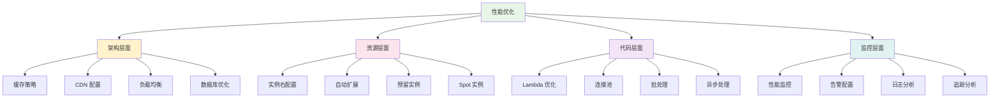

# 第 10 章：性能优化与成本控制

::: tip 学习目标
- 掌握 CDK 应用性能优化策略
- 理解 AWS 服务的成本结构和优化方法
- 学会使用 AWS 成本管理工具
- 实现自动化的成本监控和预算控制
- 掌握资源右配置和弹性扩展策略
- 了解多环境成本管理最佳实践
:::

## 性能优化概述

性能优化是一个持续的过程，涉及架构设计、资源配置、代码优化等多个方面。



## Lambda 性能优化

### Lambda 函数优化构造

```python
# constructs/optimized_lambda_construct.py
import aws_cdk as cdk
from aws_cdk import (
    aws_lambda as lambda_,
    aws_logs as logs,
    aws_iam as iam,
    aws_ec2 as ec2
)
from constructs import Construct
from typing import Optional, Dict, List

class OptimizedLambdaConstruct(Construct):
    """优化的 Lambda 函数构造"""
    
    def __init__(self, scope: Construct, construct_id: str,
                 function_name: str,
                 handler: str,
                 code_asset_path: str,
                 runtime: lambda_.Runtime = lambda_.Runtime.PYTHON_3_9,
                 memory_size: int = 256,
                 timeout_seconds: int = 30,
                 environment_variables: Optional[Dict[str, str]] = None,
                 layers: Optional[List[lambda_.LayerVersion]] = None,
                 vpc: Optional[ec2.Vpc] = None,
                 enable_tracing: bool = True,
                 enable_provisioned_concurrency: bool = False,
                 provisioned_concurrency_count: int = 1,
                 reserved_concurrent_executions: Optional[int] = None,
                 **kwargs) -> None:
        
        super().__init__(scope, construct_id, **kwargs)
        
        # 优化的环境变量
        optimized_env = {
            # 连接复用
            "PYTHONHTTPSVERIFY": "0" if runtime.name.startswith("python") else None,
            # 减少冷启动
            "AWS_LAMBDA_EXEC_WRAPPER": "/opt/bootstrap",
        }
        
        if environment_variables:
            optimized_env.update(environment_variables)
        
        # 过滤 None 值
        optimized_env = {k: v for k, v in optimized_env.items() if v is not None}
        
        # Lambda 函数
        self.function = lambda_.Function(
            self,
            "Function",
            function_name=function_name,
            runtime=runtime,
            handler=handler,
            code=lambda_.Code.from_asset(code_asset_path),
            memory_size=memory_size,
            timeout=cdk.Duration.seconds(timeout_seconds),
            environment=optimized_env,
            layers=layers or [],
            vpc=vpc,
            # 性能优化配置
            reserved_concurrent_executions=reserved_concurrent_executions,
            tracing=lambda_.Tracing.ACTIVE if enable_tracing else lambda_.Tracing.DISABLED,
            # 日志配置
            log_retention=logs.RetentionDays.ONE_MONTH,
            # 架构优化 (ARM64 通常更便宜)
            architecture=lambda_.Architecture.ARM_64,
            # 死信队列
            dead_letter_queue_enabled=True,
        )
        
        # Provisioned Concurrency（预置并发）
        if enable_provisioned_concurrency:
            version = self.function.current_version
            alias = lambda_.Alias(
                self,
                "ProdAlias",
                alias_name="prod",
                version=version
            )
            
            alias.add_provisioned_concurrency_config(
                "ProvisionedConcurrency",
                provisioned_concurrent_executions=provisioned_concurrency_count
            )
            
            self.alias = alias
        else:
            self.alias = None
        
        # 性能监控告警
        self._create_performance_alarms()
        
        # Lambda 洞察（可选）
        if self.node.try_get_context("enable_lambda_insights"):
            self.function.add_layers(
                lambda_.LayerVersion.from_layer_version_arn(
                    self,
                    "LambdaInsightsLayer",
                    layer_version_arn=f"arn:aws:lambda:{cdk.Aws.REGION}:580247275435:layer:LambdaInsightsExtension:14"
                )
            )
    
    def _create_performance_alarms(self):
        """创建性能监控告警"""
        from aws_cdk import aws_cloudwatch as cloudwatch
        from aws_cdk import aws_sns as sns
        
        # 错误率告警
        error_alarm = cloudwatch.Alarm(
            self,
            "ErrorAlarm",
            alarm_name=f"{self.function.function_name}-errors",
            metric=self.function.metric_errors(),
            threshold=5,
            evaluation_periods=2,
            datapoints_to_alarm=2
        )
        
        # 持续时间告警
        duration_alarm = cloudwatch.Alarm(
            self,
            "DurationAlarm",
            alarm_name=f"{self.function.function_name}-duration",
            metric=self.function.metric_duration(),
            threshold=10000,  # 10 seconds
            evaluation_periods=3,
            datapoints_to_alarm=2
        )
        
        # 冷启动监控
        cold_start_metric = cloudwatch.Metric(
            namespace="AWS/Lambda",
            metric_name="Duration",
            dimensions_map={
                "FunctionName": self.function.function_name
            },
            statistic="Maximum"
        )
        
        cold_start_alarm = cloudwatch.Alarm(
            self,
            "ColdStartAlarm", 
            alarm_name=f"{self.function.function_name}-cold-start",
            metric=cold_start_metric,
            threshold=5000,  # 5 seconds
            evaluation_periods=2
        )
        
        # 并发执行告警
        concurrent_executions_alarm = cloudwatch.Alarm(
            self,
            "ConcurrentExecutionsAlarm",
            alarm_name=f"{self.function.function_name}-concurrent-executions",
            metric=self.function.metric_invocations(),
            threshold=100,  # 根据实际需求调整
            evaluation_periods=2
        )
    
    def add_performance_dashboard_widgets(self, dashboard):
        """添加性能监控部件到仪表板"""
        from aws_cdk import aws_cloudwatch as cloudwatch
        
        dashboard.add_widgets(
            cloudwatch.GraphWidget(
                title=f"{self.function.function_name} - Invocations & Errors",
                left=[self.function.metric_invocations()],
                right=[self.function.metric_errors()],
                width=12,
                height=6
            ),
            cloudwatch.GraphWidget(
                title=f"{self.function.function_name} - Duration & Throttles",
                left=[self.function.metric_duration()],
                right=[self.function.metric_throttles()],
                width=12,
                height=6
            )
        )
```

### Lambda Layer 优化

```python
# stacks/lambda_layers_stack.py
import aws_cdk as cdk
from aws_cdk import (
    aws_lambda as lambda_,
    aws_s3 as s3,
    aws_s3_deployment as s3_deployment
)
from constructs import Construct

class LambdaLayersStack(cdk.Stack):
    """Lambda Layers 优化 Stack"""
    
    def __init__(self, scope: Construct, construct_id: str, **kwargs) -> None:
        super().__init__(scope, construct_id, **kwargs)
        
        # Python 依赖库层
        self.python_dependencies_layer = lambda_.LayerVersion(
            self,
            "PythonDependenciesLayer",
            code=lambda_.Code.from_asset("layers/python-dependencies"),
            compatible_runtimes=[
                lambda_.Runtime.PYTHON_3_9,
                lambda_.Runtime.PYTHON_3_10,
                lambda_.Runtime.PYTHON_3_11
            ],
            compatible_architectures=[
                lambda_.Architecture.X86_64,
                lambda_.Architecture.ARM_64
            ],
            description="Common Python dependencies (boto3, requests, etc.)",
            layer_version_name="python-dependencies"
        )
        
        # 数据库连接层
        self.database_layer = lambda_.LayerVersion(
            self,
            "DatabaseLayer",
            code=lambda_.Code.from_asset("layers/database"),
            compatible_runtimes=[lambda_.Runtime.PYTHON_3_9],
            description="Database connection utilities and drivers",
            layer_version_name="database-utilities"
        )
        
        # 监控和日志层
        self.monitoring_layer = lambda_.LayerVersion(
            self,
            "MonitoringLayer",
            code=lambda_.Code.from_asset("layers/monitoring"),
            compatible_runtimes=[lambda_.Runtime.PYTHON_3_9],
            description="Monitoring, logging, and tracing utilities",
            layer_version_name="monitoring-utilities"
        )
        
        # 性能优化层
        self.performance_layer = lambda_.LayerVersion(
            self,
            "PerformanceLayer",
            code=lambda_.Code.from_asset("layers/performance"),
            compatible_runtimes=[lambda_.Runtime.PYTHON_3_9],
            description="Performance optimization utilities",
            layer_version_name="performance-utilities"
        )
        
        # Lambda 运行时缓存层（实验性）
        if self.node.try_get_context("enable_runtime_cache"):
            self.runtime_cache_layer = lambda_.LayerVersion(
                self,
                "RuntimeCacheLayer",
                code=lambda_.Code.from_inline("""
# Runtime cache layer
import os
import json
import time
from functools import lru_cache, wraps

# 连接缓存
_connection_cache = {}

def cached_connection(connection_func):
    @wraps(connection_func)
    def wrapper(*args, **kwargs):
        cache_key = f"{connection_func.__name__}:{hash(str(args) + str(kwargs))}"
        
        if cache_key not in _connection_cache:
            _connection_cache[cache_key] = connection_func(*args, **kwargs)
        
        return _connection_cache[cache_key]
    return wrapper

# 配置缓存
@lru_cache(maxsize=128)
def get_cached_config(key):
    return os.environ.get(key)

# 预热函数
def lambda_handler(event, context):
    # 预热逻辑
    if event.get('source') == 'aws.cloudwatch':
        return {'statusCode': 200, 'body': 'warmed'}
    
    # 正常处理逻辑
    return event
                """),
                compatible_runtimes=[lambda_.Runtime.PYTHON_3_9],
                description="Runtime caching and optimization utilities"
            )
        
        # 输出
        cdk.CfnOutput(self, "PythonDependenciesLayerArn", value=self.python_dependencies_layer.layer_version_arn)
        cdk.CfnOutput(self, "DatabaseLayerArn", value=self.database_layer.layer_version_arn)
        cdk.CfnOutput(self, "MonitoringLayerArn", value=self.monitoring_layer.layer_version_arn)
        cdk.CfnOutput(self, "PerformanceLayerArn", value=self.performance_layer.layer_version_arn)
```

## 数据库性能优化

### RDS 优化构造

```python
# constructs/optimized_rds_construct.py
import aws_cdk as cdk
from aws_cdk import (
    aws_rds as rds,
    aws_ec2 as ec2,
    aws_cloudwatch as cloudwatch,
    aws_sns as sns,
    aws_secretsmanager as secrets
)
from constructs import Construct
from typing import Optional

class OptimizedRDSConstruct(Construct):
    """优化的 RDS 数据库构造"""
    
    def __init__(self, scope: Construct, construct_id: str,
                 vpc: ec2.Vpc,
                 engine_type: str = "postgres",
                 instance_class: str = "db.t3.micro",
                 multi_az: bool = False,
                 enable_performance_insights: bool = True,
                 backup_retention_days: int = 7,
                 enable_monitoring: bool = True,
                 **kwargs) -> None:
        
        super().__init__(scope, construct_id, **kwargs)
        
        # 数据库凭证
        self.credentials = rds.DatabaseSecret(
            self,
            "DatabaseCredentials",
            username="dbadmin",
            secret_name=f"{construct_id}-db-credentials"
        )
        
        # 参数组优化
        parameter_group = self._create_optimized_parameter_group(engine_type)
        
        # 子网组
        subnet_group = rds.SubnetGroup(
            self,
            "DatabaseSubnetGroup",
            description=f"Subnet group for {construct_id}",
            vpc=vpc,
            vpc_subnets=ec2.SubnetSelection(
                subnet_type=ec2.SubnetType.PRIVATE_ISOLATED
            )
        )
        
        # 安全组
        security_group = ec2.SecurityGroup(
            self,
            "DatabaseSecurityGroup",
            vpc=vpc,
            description=f"Security group for {construct_id} database",
            allow_all_outbound=False
        )
        
        # 数据库实例
        self.database = rds.DatabaseInstance(
            self,
            "DatabaseInstance",
            engine=self._get_database_engine(engine_type),
            instance_type=ec2.InstanceType(instance_class),
            vpc=vpc,
            subnet_group=subnet_group,
            security_groups=[security_group],
            credentials=rds.Credentials.from_secret(self.credentials),
            parameter_group=parameter_group,
            # 性能优化
            multi_az=multi_az,
            performance_insights_enabled=enable_performance_insights,
            performance_insights_retention=rds.PerformanceInsightsRetention.DEFAULT,
            monitoring_interval=cdk.Duration.seconds(60) if enable_monitoring else None,
            enable_performance_insights=enable_performance_insights,
            # 存储优化
            storage_type=rds.StorageType.GP2,
            allocated_storage=20,
            max_allocated_storage=1000,  # 自动扩展
            storage_encrypted=True,
            # 备份和维护
            backup_retention=cdk.Duration.days(backup_retention_days),
            preferred_backup_window="03:00-04:00",
            preferred_maintenance_window="Sun:04:00-Sun:05:00",
            delete_automated_backups=True,
            deletion_protection=False,  # 开发环境
            # 日志
            cloudwatch_logs_exports=self._get_log_exports(engine_type),
            # 自动升级
            auto_minor_version_upgrade=True
        )
        
        # 只读副本（可选）
        if self.node.try_get_context("create_read_replica"):
            self.read_replica = rds.DatabaseInstanceReadReplica(
                self,
                "ReadReplica",
                source_database_instance=self.database,
                instance_type=ec2.InstanceType(instance_class),
                vpc=vpc,
                subnet_group=subnet_group,
                security_groups=[security_group],
                performance_insights_enabled=enable_performance_insights,
                monitoring_interval=cdk.Duration.seconds(60) if enable_monitoring else None
            )
        
        # 性能监控
        if enable_monitoring:
            self._create_performance_monitoring()
        
        # 连接池配置（RDS Proxy）
        if self.node.try_get_context("enable_rds_proxy"):
            self._create_rds_proxy(vpc, security_group)
    
    def _get_database_engine(self, engine_type: str):
        """获取数据库引擎配置"""
        engines = {
            "postgres": rds.DatabaseInstanceEngine.postgres(
                version=rds.PostgresEngineVersion.VER_14_9
            ),
            "mysql": rds.DatabaseInstanceEngine.mysql(
                version=rds.MysqlEngineVersion.VER_8_0_35
            ),
            "mariadb": rds.DatabaseInstanceEngine.mariadb(
                version=rds.MariaDbEngineVersion.VER_10_6_14
            )
        }
        return engines.get(engine_type, engines["postgres"])
    
    def _create_optimized_parameter_group(self, engine_type: str):
        """创建优化的参数组"""
        if engine_type == "postgres":
            return rds.ParameterGroup(
                self,
                "PostgreSQLParameterGroup",
                engine=self._get_database_engine(engine_type),
                parameters={
                    # 连接和内存
                    "max_connections": "200",
                    "shared_buffers": "256MB",
                    "effective_cache_size": "1GB",
                    "work_mem": "4MB",
                    "maintenance_work_mem": "64MB",
                    
                    # 日志和监控
                    "log_statement": "all",
                    "log_min_duration_statement": "1000",  # 记录慢查询
                    "shared_preload_libraries": "pg_stat_statements",
                    
                    # 检查点和WAL
                    "checkpoint_completion_target": "0.9",
                    "wal_buffers": "16MB",
                    "max_wal_size": "1GB",
                    "min_wal_size": "80MB",
                    
                    # 查询优化
                    "random_page_cost": "1.1",
                    "seq_page_cost": "1.0",
                    "cpu_tuple_cost": "0.01",
                    "cpu_index_tuple_cost": "0.005"
                }
            )
        elif engine_type == "mysql":
            return rds.ParameterGroup(
                self,
                "MySQLParameterGroup",
                engine=self._get_database_engine(engine_type),
                parameters={
                    "innodb_buffer_pool_size": "{DBInstanceClassMemory*3/4}",
                    "max_connections": "200",
                    "query_cache_type": "1",
                    "query_cache_size": "32M",
                    "slow_query_log": "1",
                    "long_query_time": "1",
                    "innodb_log_file_size": "128M"
                }
            )
        else:
            return None
    
    def _get_log_exports(self, engine_type: str):
        """获取日志导出配置"""
        log_configs = {
            "postgres": ["postgresql"],
            "mysql": ["error", "general", "slowquery"],
            "mariadb": ["error", "general", "slowquery"]
        }
        return log_configs.get(engine_type, [])
    
    def _create_performance_monitoring(self):
        """创建性能监控"""
        # CPU 利用率告警
        cpu_alarm = cloudwatch.Alarm(
            self,
            "DatabaseCPUAlarm",
            alarm_name=f"{self.database.instance_identifier}-cpu-high",
            metric=self.database.metric_cpu_utilization(),
            threshold=80,
            evaluation_periods=3,
            datapoints_to_alarm=2
        )
        
        # 数据库连接告警
        connections_alarm = cloudwatch.Alarm(
            self,
            "DatabaseConnectionsAlarm",
            alarm_name=f"{self.database.instance_identifier}-connections-high",
            metric=self.database.metric_database_connections(),
            threshold=80,  # 80% of max_connections
            evaluation_periods=2
        )
        
        # 存储空间告警
        free_space_alarm = cloudwatch.Alarm(
            self,
            "DatabaseFreeSpaceAlarm", 
            alarm_name=f"{self.database.instance_identifier}-free-space-low",
            metric=self.database.metric_free_storage_space(),
            threshold=1000000000,  # 1GB
            comparison_operator=cloudwatch.ComparisonOperator.LESS_THAN_THRESHOLD,
            evaluation_periods=2
        )
        
        # 读延迟告警
        read_latency_alarm = cloudwatch.Alarm(
            self,
            "DatabaseReadLatencyAlarm",
            alarm_name=f"{self.database.instance_identifier}-read-latency-high",
            metric=self.database.metric_read_latency(),
            threshold=0.2,  # 200ms
            evaluation_periods=3
        )
        
        # 写延迟告警
        write_latency_alarm = cloudwatch.Alarm(
            self,
            "DatabaseWriteLatencyAlarm",
            alarm_name=f"{self.database.instance_identifier}-write-latency-high", 
            metric=self.database.metric_write_latency(),
            threshold=0.2,  # 200ms
            evaluation_periods=3
        )
    
    def _create_rds_proxy(self, vpc: ec2.Vpc, security_group: ec2.SecurityGroup):
        """创建 RDS Proxy 连接池"""
        proxy_security_group = ec2.SecurityGroup(
            self,
            "ProxySecurityGroup",
            vpc=vpc,
            description="Security group for RDS Proxy"
        )
        
        # 允许应用访问代理
        proxy_security_group.add_ingress_rule(
            peer=security_group,
            connection=ec2.Port.tcp(5432)  # PostgreSQL port
        )
        
        self.proxy = rds.DatabaseProxy(
            self,
            "DatabaseProxy",
            proxy_target=rds.ProxyTarget.from_database(self.database),
            secrets=[self.credentials],
            vpc=vpc,
            security_groups=[proxy_security_group],
            # 连接池配置
            max_connections_percent=100,
            max_idle_connections_percent=50,
            require_tls=True,
            # 身份验证
            auth=[
                rds.AuthFormat.secrets(
                    secret=self.credentials,
                )
            ],
            # 会话固定过滤器
            session_pinning_filters=[
                rds.SessionPinningFilter.EXCLUDE_VARIABLE_SETS
            ]
        )
```

## 成本优化策略

### 成本监控构造

```python
# constructs/cost_optimization_construct.py
import aws_cdk as cdk
from aws_cdk import (
    aws_budgets as budgets,
    aws_sns as sns,
    aws_sns_subscriptions as subscriptions,
    aws_lambda as lambda_,
    aws_events as events,
    aws_events_targets as targets,
    aws_iam as iam
)
from constructs import Construct
from typing import List, Dict

class CostOptimizationConstruct(Construct):
    """成本优化构造"""
    
    def __init__(self, scope: Construct, construct_id: str,
                 budget_limit: float,
                 alert_emails: List[str],
                 cost_allocation_tags: Dict[str, str] = None,
                 **kwargs) -> None:
        
        super().__init__(scope, construct_id, **kwargs)
        
        # SNS 主题用于成本告警
        self.cost_alert_topic = sns.Topic(
            self,
            "CostAlertTopic",
            topic_name="cost-optimization-alerts"
        )
        
        # 添加邮箱订阅
        for email in alert_emails:
            self.cost_alert_topic.add_subscription(
                subscriptions.EmailSubscription(email)
            )
        
        # 预算配置
        self._create_budgets(budget_limit)
        
        # 成本异常检测
        self._create_cost_anomaly_detection()
        
        # 自动化成本优化
        self._create_cost_optimization_lambda()
        
        # 资源标记执行
        if cost_allocation_tags:
            self._create_resource_tagging_lambda(cost_allocation_tags)
    
    def _create_budgets(self, budget_limit: float):
        """创建预算和告警"""
        # 总成本预算
        total_budget = budgets.CfnBudget(
            self,
            "TotalCostBudget",
            budget=budgets.CfnBudget.BudgetDataProperty(
                budget_name="total-monthly-budget",
                budget_limit=budgets.CfnBudget.SpendProperty(
                    amount=budget_limit,
                    unit="USD"
                ),
                time_unit="MONTHLY",
                budget_type="COST",
                cost_filters=budgets.CfnBudget.CostFiltersProperty(
                    # 可以添加特定的筛选条件
                )
            ),
            notifications_with_subscribers=[
                budgets.CfnBudget.NotificationWithSubscribersProperty(
                    notification=budgets.CfnBudget.NotificationProperty(
                        notification_type="ACTUAL",
                        comparison_operator="GREATER_THAN",
                        threshold=80,  # 80% 阈值
                        threshold_type="PERCENTAGE"
                    ),
                    subscribers=[
                        budgets.CfnBudget.SubscriberProperty(
                            subscription_type="EMAIL",
                            address=email
                        ) for email in ["admin@example.com"]  # 替换为实际邮箱
                    ]
                ),
                budgets.CfnBudget.NotificationWithSubscribersProperty(
                    notification=budgets.CfnBudget.NotificationProperty(
                        notification_type="FORECASTED",
                        comparison_operator="GREATER_THAN", 
                        threshold=100,  # 100% 预测阈值
                        threshold_type="PERCENTAGE"
                    ),
                    subscribers=[
                        budgets.CfnBudget.SubscriberProperty(
                            subscription_type="EMAIL",
                            address=email
                        ) for email in ["admin@example.com"]
                    ]
                )
            ]
        )
        
        # 服务级别预算
        services = ["AmazonEC2", "AmazonRDS", "AWSLambda", "AmazonS3"]
        for service in services:
            service_budget = budgets.CfnBudget(
                self,
                f"{service}Budget",
                budget=budgets.CfnBudget.BudgetDataProperty(
                    budget_name=f"{service.lower()}-monthly-budget",
                    budget_limit=budgets.CfnBudget.SpendProperty(
                        amount=budget_limit * 0.3,  # 每个服务 30% 的总预算
                        unit="USD"
                    ),
                    time_unit="MONTHLY",
                    budget_type="COST",
                    cost_filters=budgets.CfnBudget.CostFiltersProperty(
                        services=[service]
                    )
                ),
                notifications_with_subscribers=[
                    budgets.CfnBudget.NotificationWithSubscribersProperty(
                        notification=budgets.CfnBudget.NotificationProperty(
                            notification_type="ACTUAL",
                            comparison_operator="GREATER_THAN",
                            threshold=90,
                            threshold_type="PERCENTAGE"
                        ),
                        subscribers=[
                            budgets.CfnBudget.SubscriberProperty(
                                subscription_type="SNS",
                                address=self.cost_alert_topic.topic_arn
                            )
                        ]
                    )
                ]
            )
    
    def _create_cost_anomaly_detection(self):
        """创建成本异常检测"""
        from aws_cdk import aws_ce as ce
        
        # 成本异常检测器
        anomaly_detector = ce.CfnAnomalyDetector(
            self,
            "CostAnomalyDetector",
            anomaly_detector_name="cost-anomaly-detector",
            monitor_type="DIMENSIONAL",
            monitor_specification=ce.CfnAnomalyDetector.MonitorSpecificationProperty(
                dimension="SERVICE",
                match_options=["EQUALS"],
                values=["EC2-Instance", "Lambda", "RDS"]
            )
        )
        
        # 异常检测订阅
        ce.CfnAnomalySubscription(
            self,
            "CostAnomalySubscription",
            subscription_name="cost-anomaly-alerts",
            frequency="DAILY",
            monitor_arn_list=[anomaly_detector.attr_anomaly_detector_arn],
            subscribers=[
                ce.CfnAnomalySubscription.SubscriberProperty(
                    type="EMAIL",
                    address="admin@example.com"  # 替换为实际邮箱
                ),
                ce.CfnAnomalySubscription.SubscriberProperty(
                    type="SNS",
                    address=self.cost_alert_topic.topic_arn
                )
            ],
            threshold_expression=ce.CfnAnomalySubscription.ThresholdExpressionProperty(
                and_=[
                    ce.CfnAnomalySubscription.ThresholdExpressionProperty(
                        dimension=ce.CfnAnomalySubscription.DimensionProperty(
                            key="ANOMALY_TOTAL_IMPACT_ABSOLUTE",
                            values=["100"]  # $100 阈值
                        )
                    )
                ]
            )
        )
    
    def _create_cost_optimization_lambda(self):
        """创建自动化成本优化 Lambda"""
        self.cost_optimization_function = lambda_.Function(
            self,
            "CostOptimizationFunction",
            runtime=lambda_.Runtime.PYTHON_3_9,
            handler="cost_optimizer.handler",
            code=lambda_.Code.from_inline("""
import boto3
import json
import logging
from datetime import datetime, timedelta

logger = logging.getLogger()
logger.setLevel(logging.INFO)

def handler(event, context):
    ec2 = boto3.client('ec2')
    rds = boto3.client('rds')
    cloudwatch = boto3.client('cloudwatch')
    sns = boto3.client('sns')
    
    optimization_actions = []
    
    try:
        # 检查未使用的 EBS 卷
        unused_volumes = find_unused_ebs_volumes(ec2)
        optimization_actions.extend(unused_volumes)
        
        # 检查空闲的 RDS 实例
        idle_rds_instances = find_idle_rds_instances(rds, cloudwatch)
        optimization_actions.extend(idle_rds_instances)
        
        # 检查未使用的弹性 IP
        unused_eips = find_unused_elastic_ips(ec2)
        optimization_actions.extend(unused_eips)
        
        # 生成报告
        if optimization_actions:
            report = generate_optimization_report(optimization_actions)
            
            # 发送通知
            sns.publish(
                TopicArn=os.environ['COST_ALERT_TOPIC_ARN'],
                Subject='成本优化建议',
                Message=report
            )
        
        return {
            'statusCode': 200,
            'body': json.dumps({
                'message': 'Cost optimization check completed',
                'actions_found': len(optimization_actions)
            })
        }
        
    except Exception as e:
        logger.error(f'Cost optimization error: {str(e)}')
        return {
            'statusCode': 500,
            'body': json.dumps({'error': str(e)})
        }

def find_unused_ebs_volumes(ec2):
    volumes = ec2.describe_volumes(
        Filters=[
            {'Name': 'state', 'Values': ['available']}
        ]
    )
    
    unused_volumes = []
    for volume in volumes['Volumes']:
        unused_volumes.append({
            'type': 'unused_ebs_volume',
            'resource_id': volume['VolumeId'],
            'size': volume['Size'],
            'cost_estimate': volume['Size'] * 0.10  # $0.10 per GB per month
        })
    
    return unused_volumes

def find_idle_rds_instances(rds, cloudwatch):
    instances = rds.describe_db_instances()
    idle_instances = []
    
    for instance in instances['DBInstances']:
        if instance['DBInstanceStatus'] == 'available':
            # 检查最近7天的 CPU 使用率
            end_time = datetime.utcnow()
            start_time = end_time - timedelta(days=7)
            
            cpu_metrics = cloudwatch.get_metric_statistics(
                Namespace='AWS/RDS',
                MetricName='CPUUtilization',
                Dimensions=[
                    {'Name': 'DBInstanceIdentifier', 'Value': instance['DBInstanceIdentifier']}
                ],
                StartTime=start_time,
                EndTime=end_time,
                Period=86400,  # 1 day
                Statistics=['Average']
            )
            
            if cpu_metrics['Datapoints']:
                avg_cpu = sum(dp['Average'] for dp in cpu_metrics['Datapoints']) / len(cpu_metrics['Datapoints'])
                if avg_cpu < 5:  # CPU 使用率低于 5%
                    idle_instances.append({
                        'type': 'idle_rds_instance',
                        'resource_id': instance['DBInstanceIdentifier'],
                        'instance_class': instance['DBInstanceClass'],
                        'avg_cpu': avg_cpu
                    })
    
    return idle_instances

def find_unused_elastic_ips(ec2):
    addresses = ec2.describe_addresses()
    unused_eips = []
    
    for address in addresses['Addresses']:
        if 'InstanceId' not in address and 'NetworkInterfaceId' not in address:
            unused_eips.append({
                'type': 'unused_elastic_ip',
                'resource_id': address['PublicIp'],
                'allocation_id': address['AllocationId'],
                'cost_estimate': 3.65  # $0.005 per hour * 24 * 30.5
            })
    
    return unused_eips

def generate_optimization_report(actions):
    total_potential_savings = 0
    report_lines = ["成本优化建议报告", "=" * 30, ""]
    
    for action in actions:
        if action['type'] == 'unused_ebs_volume':
            report_lines.append(f"未使用的 EBS 卷: {action['resource_id']}")
            report_lines.append(f"  - 大小: {action['size']} GB")
            report_lines.append(f"  - 预估月成本: ${action['cost_estimate']:.2f}")
            total_potential_savings += action['cost_estimate']
        
        elif action['type'] == 'idle_rds_instance':
            report_lines.append(f"空闲的 RDS 实例: {action['resource_id']}")
            report_lines.append(f"  - 实例类型: {action['instance_class']}")
            report_lines.append(f"  - 平均 CPU 使用率: {action['avg_cpu']:.2f}%")
        
        elif action['type'] == 'unused_elastic_ip':
            report_lines.append(f"未使用的弹性 IP: {action['resource_id']}")
            report_lines.append(f"  - 预估月成本: ${action['cost_estimate']:.2f}")
            total_potential_savings += action['cost_estimate']
        
        report_lines.append("")
    
    report_lines.append(f"总潜在节省: ${total_potential_savings:.2f}/月")
    
    return "\\n".join(report_lines)
            """),
            timeout=cdk.Duration.minutes(5),
            environment={
                "COST_ALERT_TOPIC_ARN": self.cost_alert_topic.topic_arn
            }
        )
        
        # 添加必要的权限
        self.cost_optimization_function.add_to_role_policy(
            iam.PolicyStatement(
                effect=iam.Effect.ALLOW,
                actions=[
                    "ec2:DescribeVolumes",
                    "ec2:DescribeAddresses",
                    "rds:DescribeDBInstances",
                    "cloudwatch:GetMetricStatistics",
                    "sns:Publish"
                ],
                resources=["*"]
            )
        )
        
        # 定时执行成本优化检查
        events.Rule(
            self,
            "CostOptimizationSchedule",
            schedule=events.Schedule.rate(cdk.Duration.days(1)),
            targets=[targets.LambdaFunction(self.cost_optimization_function)]
        )
    
    def _create_resource_tagging_lambda(self, cost_allocation_tags: Dict[str, str]):
        """创建资源标记 Lambda"""
        self.tagging_function = lambda_.Function(
            self,
            "ResourceTaggingFunction",
            runtime=lambda_.Runtime.PYTHON_3_9,
            handler="resource_tagger.handler",
            code=lambda_.Code.from_inline(f"""
import boto3
import json
import logging

logger = logging.getLogger()
logger.setLevel(logging.INFO)

REQUIRED_TAGS = {json.dumps(cost_allocation_tags)}

def handler(event, context):
    # 获取需要标记的资源
    ec2 = boto3.client('ec2')
    rds = boto3.client('rds')
    lambda_client = boto3.client('lambda')
    s3 = boto3.client('s3')
    
    try:
        # 标记 EC2 实例
        tag_ec2_resources(ec2)
        
        # 标记 RDS 实例
        tag_rds_resources(rds)
        
        # 标记 Lambda 函数
        tag_lambda_functions(lambda_client)
        
        # 标记 S3 存储桶
        tag_s3_buckets(s3)
        
        return {{
            'statusCode': 200,
            'body': json.dumps('Resource tagging completed successfully')
        }}
        
    except Exception as e:
        logger.error(f'Resource tagging error: {{str(e)}}')
        return {{
            'statusCode': 500,
            'body': json.dumps({{'error': str(e)}})
        }}

def tag_ec2_resources(ec2):
    instances = ec2.describe_instances()
    required_tags = json.loads(REQUIRED_TAGS)
    
    for reservation in instances['Reservations']:
        for instance in reservation['Instances']:
            instance_id = instance['InstanceId']
            existing_tags = {{tag['Key']: tag['Value'] for tag in instance.get('Tags', [])}}
            
            tags_to_add = []
            for key, value in required_tags.items():
                if key not in existing_tags:
                    tags_to_add.append({{'Key': key, 'Value': value}})
            
            if tags_to_add:
                ec2.create_tags(Resources=[instance_id], Tags=tags_to_add)
                logger.info(f'Tagged EC2 instance {{instance_id}} with {{len(tags_to_add)}} tags')

def tag_rds_resources(rds):
    instances = rds.describe_db_instances()
    required_tags = json.loads(REQUIRED_TAGS)
    
    for instance in instances['DBInstances']:
        instance_arn = instance['DBInstanceArn']
        
        try:
            existing_tags = rds.list_tags_for_resource(ResourceName=instance_arn)
            existing_tag_keys = {{tag['Key'] for tag in existing_tags['TagList']}}
            
            tags_to_add = []
            for key, value in required_tags.items():
                if key not in existing_tag_keys:
                    tags_to_add.append({{'Key': key, 'Value': value}})
            
            if tags_to_add:
                rds.add_tags_to_resource(ResourceName=instance_arn, Tags=tags_to_add)
                logger.info(f'Tagged RDS instance {{instance["DBInstanceIdentifier"]}} with {{len(tags_to_add)}} tags')
        
        except Exception as e:
            logger.error(f'Error tagging RDS instance {{instance["DBInstanceIdentifier"]}}: {{e}}')

def tag_lambda_functions(lambda_client):
    functions = lambda_client.list_functions()
    required_tags = json.loads(REQUIRED_TAGS)
    
    for function in functions['Functions']:
        function_arn = function['FunctionArn']
        
        try:
            existing_tags = lambda_client.list_tags(Resource=function_arn)
            
            tags_to_add = {{}}
            for key, value in required_tags.items():
                if key not in existing_tags['Tags']:
                    tags_to_add[key] = value
            
            if tags_to_add:
                lambda_client.tag_resource(Resource=function_arn, Tags=tags_to_add)
                logger.info(f'Tagged Lambda function {{function["FunctionName"]}} with {{len(tags_to_add)}} tags')
        
        except Exception as e:
            logger.error(f'Error tagging Lambda function {{function["FunctionName"]}}: {{e}}')

def tag_s3_buckets(s3):
    buckets = s3.list_buckets()
    required_tags = json.loads(REQUIRED_TAGS)
    
    for bucket in buckets['Buckets']:
        bucket_name = bucket['Name']
        
        try:
            try:
                existing_tags = s3.get_bucket_tagging(Bucket=bucket_name)
                existing_tag_keys = {{tag['Key'] for tag in existing_tags['TagSet']}}
            except s3.exceptions.ClientError:
                existing_tag_keys = set()
            
            tags_to_add = []
            for key, value in required_tags.items():
                if key not in existing_tag_keys:
                    tags_to_add.append({{'Key': key, 'Value': value}})
            
            if tags_to_add:
                all_tags = list(existing_tags.get('TagSet', [])) + tags_to_add
                s3.put_bucket_tagging(
                    Bucket=bucket_name,
                    Tagging={{'TagSet': all_tags}}
                )
                logger.info(f'Tagged S3 bucket {{bucket_name}} with {{len(tags_to_add)}} tags')
        
        except Exception as e:
            logger.error(f'Error tagging S3 bucket {{bucket_name}}: {{e}}')
            """),
            timeout=cdk.Duration.minutes(10)
        )
        
        # 添加必要的权限
        self.tagging_function.add_to_role_policy(
            iam.PolicyStatement(
                effect=iam.Effect.ALLOW,
                actions=[
                    "ec2:DescribeInstances",
                    "ec2:CreateTags",
                    "rds:DescribeDBInstances",
                    "rds:ListTagsForResource",
                    "rds:AddTagsToResource",
                    "lambda:ListFunctions",
                    "lambda:ListTags",
                    "lambda:TagResource",
                    "s3:ListAllMyBuckets",
                    "s3:GetBucketTagging",
                    "s3:PutBucketTagging"
                ],
                resources=["*"]
            )
        )
        
        # 定时执行资源标记
        events.Rule(
            self,
            "ResourceTaggingSchedule",
            schedule=events.Schedule.rate(cdk.Duration.hours(6)),
            targets=[targets.LambdaFunction(self.tagging_function)]
        )
```

## 自动扩展和资源优化

### 智能扩展构造

```python
# constructs/intelligent_scaling_construct.py
import aws_cdk as cdk
from aws_cdk import (
    aws_autoscaling as autoscaling,
    aws_ec2 as ec2,
    aws_cloudwatch as cloudwatch,
    aws_applicationautoscaling as app_autoscaling,
    aws_lambda as lambda_,
    aws_iam as iam
)
from constructs import Construct
from typing import List, Dict

class IntelligentScalingConstruct(Construct):
    """智能扩展构造"""
    
    def __init__(self, scope: Construct, construct_id: str,
                 vpc: ec2.Vpc,
                 **kwargs) -> None:
        
        super().__init__(scope, construct_id, **kwargs)
        
        # 创建预测性扩展 Lambda
        self.predictive_scaling_function = self._create_predictive_scaling_lambda()
        
        # 创建成本感知扩展策略
        self._create_cost_aware_scaling_policies()
        
        # 创建基于业务指标的扩展
        self._create_business_metric_scaling()
    
    def create_optimized_auto_scaling_group(self, 
                                          instance_type: str = "t3.medium",
                                          min_capacity: int = 1,
                                          max_capacity: int = 10,
                                          target_cpu: int = 60) -> autoscaling.AutoScalingGroup:
        """创建优化的 Auto Scaling Group"""
        
        # 启动模板
        launch_template = ec2.LaunchTemplate(
            self,
            "OptimizedLaunchTemplate",
            instance_type=ec2.InstanceType(instance_type),
            machine_image=ec2.AmazonLinuxImage(
                generation=ec2.AmazonLinuxGeneration.AMAZON_LINUX_2
            ),
            user_data=ec2.UserData.for_linux(),
            # 性能优化
            nitro_enclave_enabled=False,
            hibernation_configured=False,
            # 安全配置
            security_group=self._create_optimized_security_group(),
            # 存储优化
            block_devices=[
                ec2.BlockDevice(
                    device_name="/dev/xvda",
                    volume=ec2.BlockDeviceVolume.ebs(
                        volume_size=20,
                        volume_type=ec2.EbsDeviceVolumeType.GP3,  # GP3 更便宜
                        encrypted=True,
                        delete_on_termination=True
                    )
                )
            ]
        )
        
        # Auto Scaling Group
        asg = autoscaling.AutoScalingGroup(
            self,
            "OptimizedASG",
            vpc=self.vpc,
            launch_template=launch_template,
            min_capacity=min_capacity,
            max_capacity=max_capacity,
            desired_capacity=min_capacity,
            # 混合实例策略（成本优化）
            mixed_instances_policy=autoscaling.MixedInstancesPolicy(
                launch_template=launch_template,
                instances_distribution=autoscaling.InstancesDistribution(
                    on_demand_base_capacity=1,  # 至少保持 1 个按需实例
                    on_demand_percentage_above_base_capacity=25,  # 25% 按需，75% Spot
                    spot_allocation_strategy=autoscaling.SpotAllocationStrategy.DIVERSIFIED
                ),
                launch_template_overrides=[
                    # 提供多种实例类型选择
                    autoscaling.LaunchTemplateOverrides(instance_type=ec2.InstanceType("t3.medium")),
                    autoscaling.LaunchTemplateOverrides(instance_type=ec2.InstanceType("t3a.medium")),
                    autoscaling.LaunchTemplateOverrides(instance_type=ec2.InstanceType("t2.medium")),
                    autoscaling.LaunchTemplateOverrides(instance_type=ec2.InstanceType("m5.large")),
                ]
            ),
            # 健康检查
            health_check=autoscaling.HealthCheck.elb(grace_period=cdk.Duration.minutes(5)),
            # 更新策略
            update_policy=autoscaling.UpdatePolicy.rolling_update(
                min_instances_in_service=1,
                max_batch_size=2,
                pause_time=cdk.Duration.minutes(5)
            ),
            # 终止策略 - 优先终止最旧的实例
            termination_policies=[autoscaling.TerminationPolicy.OLDEST_INSTANCE]
        )
        
        # 多指标扩展策略
        asg.scale_on_cpu_utilization(
            "CPUScaling",
            target_utilization_percent=target_cpu,
            scale_in_cooldown=cdk.Duration.minutes(5),
            scale_out_cooldown=cdk.Duration.minutes(2)
        )
        
        # 基于内存使用率扩展
        memory_metric = cloudwatch.Metric(
            namespace="CWAgent",
            metric_name="mem_used_percent",
            dimensions_map={"AutoScalingGroupName": asg.auto_scaling_group_name}
        )
        
        asg.scale_on_metric(
            "MemoryScaling",
            metric=memory_metric,
            scaling_steps=[
                {"lower": 0, "upper": 60, "change": 0},
                {"lower": 60, "upper": 80, "change": +1},
                {"lower": 80, "upper": 90, "change": +2},
                {"lower": 90, "change": +3}
            ],
            adjustment_type=autoscaling.AdjustmentType.CHANGE_IN_CAPACITY,
            cooldown=cdk.Duration.minutes(3)
        )
        
        # 预测性扩展
        if self.node.try_get_context("enable_predictive_scaling"):
            self._setup_predictive_scaling(asg)
        
        return asg
    
    def _create_optimized_security_group(self) -> ec2.SecurityGroup:
        """创建优化的安全组"""
        sg = ec2.SecurityGroup(
            self,
            "OptimizedSecurityGroup",
            vpc=self.vpc,
            description="Optimized security group with minimal required access",
            allow_all_outbound=False
        )
        
        # 仅允许必要的出站流量
        sg.add_egress_rule(
            peer=ec2.Peer.any_ipv4(),
            connection=ec2.Port.tcp(80),
            description="HTTP outbound"
        )
        sg.add_egress_rule(
            peer=ec2.Peer.any_ipv4(),
            connection=ec2.Port.tcp(443),
            description="HTTPS outbound"
        )
        
        return sg
    
    def _create_predictive_scaling_lambda(self) -> lambda_.Function:
        """创建预测性扩展 Lambda"""
        function = lambda_.Function(
            self,
            "PredictiveScalingFunction",
            runtime=lambda_.Runtime.PYTHON_3_9,
            handler="predictive_scaling.handler",
            code=lambda_.Code.from_inline("""
import boto3
import json
import logging
from datetime import datetime, timedelta
import math

logger = logging.getLogger()
logger.setLevel(logging.INFO)

def handler(event, context):
    cloudwatch = boto3.client('cloudwatch')
    autoscaling = boto3.client('autoscaling')
    
    try:
        # 获取历史数据
        end_time = datetime.utcnow()
        start_time = end_time - timedelta(days=7)  # 分析过去7天的数据
        
        # 获取 CPU 使用率数据
        cpu_data = cloudwatch.get_metric_statistics(
            Namespace='AWS/EC2',
            MetricName='CPUUtilization',
            Dimensions=[
                {'Name': 'AutoScalingGroupName', 'Value': event['asg_name']}
            ],
            StartTime=start_time,
            EndTime=end_time,
            Period=3600,  # 1 hour periods
            Statistics=['Average']
        )
        
        # 简单的预测算法：基于历史平均值和趋势
        if len(cpu_data['Datapoints']) >= 24:  # 至少需要24小时的数据
            sorted_data = sorted(cpu_data['Datapoints'], key=lambda x: x['Timestamp'])
            recent_values = [dp['Average'] for dp in sorted_data[-24:]]  # 最近24小时
            
            # 计算趋势
            avg_cpu = sum(recent_values) / len(recent_values)
            trend = calculate_trend(recent_values)
            
            # 预测未来1小时的 CPU 使用率
            predicted_cpu = avg_cpu + trend
            
            # 基于预测值计算建议的实例数量
            current_capacity = get_current_capacity(autoscaling, event['asg_name'])
            recommended_capacity = calculate_recommended_capacity(predicted_cpu, current_capacity)
            
            # 如果需要调整容量
            if recommended_capacity != current_capacity:
                logger.info(f'Recommending capacity change: {current_capacity} -> {recommended_capacity}')
                
                # 可以在这里实现自动调整逻辑，或者仅发送通知
                if event.get('auto_adjust', False):
                    adjust_capacity(autoscaling, event['asg_name'], recommended_capacity)
        
        return {
            'statusCode': 200,
            'body': json.dumps('Predictive scaling analysis completed')
        }
    
    except Exception as e:
        logger.error(f'Predictive scaling error: {str(e)}')
        return {
            'statusCode': 500,
            'body': json.dumps({'error': str(e)})
        }

def calculate_trend(values):
    n = len(values)
    if n < 2:
        return 0
    
    # 简单的线性趋势计算
    x_sum = sum(range(n))
    y_sum = sum(values)
    xy_sum = sum(i * values[i] for i in range(n))
    x_sq_sum = sum(i * i for i in range(n))
    
    slope = (n * xy_sum - x_sum * y_sum) / (n * x_sq_sum - x_sum * x_sum)
    return slope

def get_current_capacity(autoscaling, asg_name):
    response = autoscaling.describe_auto_scaling_groups(
        AutoScalingGroupNames=[asg_name]
    )
    return response['AutoScalingGroups'][0]['DesiredCapacity']

def calculate_recommended_capacity(predicted_cpu, current_capacity):
    # 简单的容量计算逻辑
    if predicted_cpu > 80:
        return min(current_capacity + 2, 10)  # 最多扩展到10个实例
    elif predicted_cpu > 60:
        return min(current_capacity + 1, 10)
    elif predicted_cpu < 30:
        return max(current_capacity - 1, 1)  # 至少保持1个实例
    else:
        return current_capacity

def adjust_capacity(autoscaling, asg_name, new_capacity):
    autoscaling.set_desired_capacity(
        AutoScalingGroupName=asg_name,
        DesiredCapacity=new_capacity,
        HonorCooldown=True
    )
            """),
            timeout=cdk.Duration.minutes(5)
        )
        
        function.add_to_role_policy(
            iam.PolicyStatement(
                effect=iam.Effect.ALLOW,
                actions=[
                    "cloudwatch:GetMetricStatistics",
                    "autoscaling:DescribeAutoScalingGroups",
                    "autoscaling:SetDesiredCapacity"
                ],
                resources=["*"]
            )
        )
        
        return function
    
    def _create_cost_aware_scaling_policies(self):
        """创建成本感知的扩展策略"""
        # 成本感知扩展 Lambda
        cost_aware_function = lambda_.Function(
            self,
            "CostAwareScalingFunction",
            runtime=lambda_.Runtime.PYTHON_3_9,
            handler="cost_aware_scaling.handler",
            code=lambda_.Code.from_inline("""
import boto3
import json
import logging
from datetime import datetime, timedelta

logger = logging.getLogger()
logger.setLevel(logging.INFO)

def handler(event, context):
    # 获取当前 Spot 实例价格
    ec2 = boto3.client('ec2')
    autoscaling = boto3.client('autoscaling')
    
    try:
        # 获取 Spot 价格历史
        spot_prices = ec2.describe_spot_price_history(
            InstanceTypes=['t3.medium', 't3a.medium', 'm5.large'],
            ProductDescriptions=['Linux/UNIX'],
            MaxResults=10,
            StartTime=datetime.utcnow() - timedelta(hours=1)
        )
        
        # 选择最便宜的实例类型
        cheapest_instance = min(spot_prices['SpotPriceHistory'], 
                               key=lambda x: float(x['SpotPrice']))
        
        logger.info(f'Cheapest Spot instance: {cheapest_instance["InstanceType"]} at ${cheapest_instance["SpotPrice"]}')
        
        # 基于成本调整扩展策略
        # 如果 Spot 价格很低，可以更积极地扩展
        spot_price = float(cheapest_instance['SpotPrice'])
        
        # 动态调整扩展阈值
        if spot_price < 0.02:  # 很便宜
            cpu_threshold = 50  # 更低的 CPU 阈值，更早扩展
        elif spot_price < 0.05:  # 中等价格
            cpu_threshold = 70
        else:  # 较贵
            cpu_threshold = 85  # 更高的阈值，减少扩展
        
        # 这里可以动态更新 Auto Scaling 策略
        # 实际实现需要更复杂的逻辑
        
        return {
            'statusCode': 200,
            'body': json.dumps({
                'cheapest_instance': cheapest_instance['InstanceType'],
                'spot_price': spot_price,
                'recommended_cpu_threshold': cpu_threshold
            })
        }
    
    except Exception as e:
        logger.error(f'Cost-aware scaling error: {str(e)}')
        return {
            'statusCode': 500,
            'body': json.dumps({'error': str(e)})
        }
            """),
            timeout=cdk.Duration.minutes(3)
        )
        
        cost_aware_function.add_to_role_policy(
            iam.PolicyStatement(
                effect=iam.Effect.ALLOW,
                actions=[
                    "ec2:DescribeSpotPriceHistory",
                    "autoscaling:PutScalingPolicy"
                ],
                resources=["*"]
            )
        )
    
    def _create_business_metric_scaling(self):
        """基于业务指标的扩展"""
        # 自定义业务指标
        business_metric = cloudwatch.Metric(
            namespace="CustomApp/Business",
            metric_name="ActiveUsers",
            statistic="Average"
        )
        
        # 这个可以被外部 ASG 使用
        self.business_scaling_metric = business_metric
    
    def _setup_predictive_scaling(self, asg: autoscaling.AutoScalingGroup):
        """设置预测性扩展"""
        # 创建定时规则调用预测性扩展
        from aws_cdk import aws_events as events
        from aws_cdk import aws_events_targets as targets
        
        events.Rule(
            self,
            "PredictiveScalingSchedule",
            schedule=events.Schedule.rate(cdk.Duration.hours(1)),
            targets=[
                targets.LambdaFunction(
                    self.predictive_scaling_function,
                    event=events.RuleTargetInput.from_object({
                        "asg_name": asg.auto_scaling_group_name,
                        "auto_adjust": True
                    })
                )
            ]
        )
```

::: tip 性能与成本优化最佳实践总结
1. **持续监控**：建立全面的性能和成本监控体系
2. **右配置资源**：根据实际需求选择合适的实例类型和规格
3. **弹性扩展**：使用自动扩展减少资源浪费
4. **Spot 实例**：合理使用 Spot 实例降低计算成本
5. **预留实例**：对稳定工作负载使用预留实例
6. **数据生命周期**：合理配置数据存储的生命周期策略
7. **缓存策略**：使用 CDN 和缓存减少重复计算
8. **预算控制**：设置预算和告警，防止意外支出
9. **资源标记**：使用标记进行成本分配和追踪
10. **定期优化**：定期审查和优化资源配置
:::

通过本章学习，你应该能够设计和实施全面的性能优化和成本控制策略，实现高效、经济的云基础设施管理。