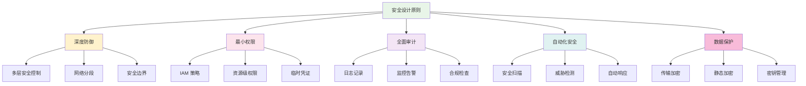

# 第 11 章：安全最佳实践

::: tip 学习目标
- 掌握 AWS CDK 安全设计原则
- 实现网络安全和访问控制
- 配置数据加密和密钥管理
- 设置安全监控和审计
- 理解合规性要求和实施方法
- 掌握安全自动化和事件响应
:::

## 安全设计原则

AWS Well-Architected Framework 的安全支柱提供了以下核心原则：



## IAM 安全管理

### 安全 IAM 构造

```python
# constructs/secure_iam_construct.py
import aws_cdk as cdk
from aws_cdk import (
    aws_iam as iam,
    aws_kms as kms,
    aws_logs as logs,
    aws_cloudtrail as cloudtrail,
    aws_s3 as s3
)
from constructs import Construct
from typing import List, Dict, Optional

class SecureIAMConstruct(Construct):
    """安全的 IAM 权限管理构造"""
    
    def __init__(self, scope: Construct, construct_id: str,
                 service_name: str,
                 required_actions: List[str] = None,
                 resource_arns: List[str] = None,
                 enable_mfa: bool = True,
                 session_duration: int = 3600,
                 **kwargs) -> None:
        
        super().__init__(scope, construct_id, **kwargs)
        
        self.service_name = service_name
        self.required_actions = required_actions or []
        self.resource_arns = resource_arns or ["*"]
        
        # 创建服务角色
        self.service_role = self._create_service_role(enable_mfa, session_duration)
        
        # 创建最小权限策略
        self._create_least_privilege_policies()
        
        # 创建边界策略
        self._create_permission_boundary()
        
        # 设置密码策略
        if self.node.try_get_context("manage_password_policy"):
            self._create_password_policy()
        
        # CloudTrail 审计
        self._setup_cloudtrail_logging()
    
    def _create_service_role(self, enable_mfa: bool, session_duration: int) -> iam.Role:
        """创建安全的服务角色"""
        
        # 构建信任策略
        trust_policy = {
            "Version": "2012-10-17",
            "Statement": [
                {
                    "Effect": "Allow",
                    "Principal": {
                        "Service": f"{self.service_name}.amazonaws.com"
                    },
                    "Action": "sts:AssumeRole"
                }
            ]
        }
        
        # 如果需要 MFA
        if enable_mfa and self.service_name not in ["lambda", "ecs-tasks", "ec2"]:
            trust_policy["Statement"][0]["Condition"] = {
                "Bool": {
                    "aws:MultiFactorAuthPresent": "true"
                },
                "NumericLessThan": {
                    "aws:MultiFactorAuthAge": str(session_duration)
                }
            }
        
        # 创建角色
        role = iam.Role(
            self,
            "ServiceRole",
            role_name=f"{self.service_name}-secure-role",
            assumed_by=iam.ServicePrincipal(f"{self.service_name}.amazonaws.com"),
            description=f"Secure role for {self.service_name} with least privilege access",
            max_session_duration=cdk.Duration.seconds(session_duration),
            inline_policies={},
            managed_policies=[],  # 避免使用过度宽泛的托管策略
        )
        
        # 添加标签
        cdk.Tags.of(role).add("Service", self.service_name)
        cdk.Tags.of(role).add("SecurityLevel", "Restricted")
        cdk.Tags.of(role).add("ManagedBy", "CDK")
        
        return role
    
    def _create_least_privilege_policies(self):
        """创建最小权限策略"""
        
        if not self.required_actions:
            return
        
        # 按服务分组权限
        service_actions = {}
        for action in self.required_actions:
            service = action.split(":")[0]
            if service not in service_actions:
                service_actions[service] = []
            service_actions[service].append(action)
        
        # 为每个服务创建策略
        for service, actions in service_actions.items():
            policy_document = iam.PolicyDocument(
                statements=[
                    iam.PolicyStatement(
                        effect=iam.Effect.ALLOW,
                        actions=actions,
                        resources=self.resource_arns,
                        # 添加条件限制
                        conditions=self._get_security_conditions(service)
                    )
                ]
            )
            
            policy = iam.Policy(
                self,
                f"{service.title()}Policy",
                policy_name=f"{self.service_name}-{service}-policy",
                document=policy_document,
                roles=[self.service_role]
            )
            
            # 添加策略标签
            cdk.Tags.of(policy).add("Service", service)
            cdk.Tags.of(policy).add("PolicyType", "LeastPrivilege")
    
    def _get_security_conditions(self, service: str) -> Dict:
        """获取服务特定的安全条件"""
        conditions = {
            # 通用条件
            "Bool": {
                "aws:SecureTransport": "true"  # 强制使用 HTTPS
            },
            "IpAddress": {
                # 可以限制 IP 范围
                # "aws:SourceIp": ["10.0.0.0/16", "192.168.1.0/24"]
            }
        }
        
        # 服务特定条件
        service_conditions = {
            "s3": {
                "StringEquals": {
                    "s3:x-amz-server-side-encryption": "AES256"
                }
            },
            "kms": {
                "StringEquals": {
                    "kms:ViaService": f"s3.{cdk.Aws.REGION}.amazonaws.com"
                }
            },
            "ec2": {
                "StringEquals": {
                    "ec2:InstanceType": ["t3.micro", "t3.small", "t3.medium"]
                }
            }
        }
        
        if service in service_conditions:
            conditions.update(service_conditions[service])
        
        return conditions
    
    def _create_permission_boundary(self):
        """创建权限边界"""
        
        boundary_policy = iam.ManagedPolicy(
            self,
            "PermissionBoundary",
            managed_policy_name=f"{self.service_name}-permission-boundary",
            description="Permission boundary to limit maximum permissions",
            document=iam.PolicyDocument(
                statements=[
                    # 允许的服务
                    iam.PolicyStatement(
                        effect=iam.Effect.ALLOW,
                        actions=[
                            "logs:CreateLogGroup",
                            "logs:CreateLogStream", 
                            "logs:PutLogEvents",
                            "cloudwatch:PutMetricData",
                            "xray:PutTraceSegments",
                            "xray:PutTelemetryRecords"
                        ],
                        resources=["*"]
                    ),
                    # 拒绝敏感操作
                    iam.PolicyStatement(
                        effect=iam.Effect.DENY,
                        actions=[
                            "iam:CreateUser",
                            "iam:CreateRole", 
                            "iam:AttachUserPolicy",
                            "iam:AttachRolePolicy",
                            "iam:PutUserPolicy",
                            "iam:PutRolePolicy",
                            "ec2:TerminateInstances",
                            "rds:DeleteDBInstance",
                            "s3:DeleteBucket"
                        ],
                        resources=["*"]
                    ),
                    # 限制区域
                    iam.PolicyStatement(
                        effect=iam.Effect.DENY,
                        not_actions=["cloudfront:*", "iam:*", "route53:*", "support:*"],
                        resources=["*"],
                        conditions={
                            "StringNotEquals": {
                                "aws:RequestedRegion": [cdk.Aws.REGION]
                            }
                        }
                    )
                ]
            )
        )
        
        # 将边界策略附加到角色
        self.service_role.add_to_policy(
            iam.PolicyStatement(
                effect=iam.Effect.ALLOW,
                actions=["iam:GetPolicy", "iam:GetPolicyVersion"],
                resources=[boundary_policy.managed_policy_arn]
            )
        )
        
        # 注意：权限边界需要在角色创建后手动附加
        # 或者使用自定义资源
        self._attach_permission_boundary(boundary_policy)
    
    def _attach_permission_boundary(self, boundary_policy: iam.ManagedPolicy):
        """附加权限边界（使用自定义资源）"""
        
        attach_boundary_lambda = lambda_.Function(
            self,
            "AttachBoundaryFunction",
            runtime=lambda_.Runtime.PYTHON_3_9,
            handler="index.handler",
            code=lambda_.Code.from_inline("""
import boto3
import json
import logging

logger = logging.getLogger()
logger.setLevel(logging.INFO)

def handler(event, context):
    iam_client = boto3.client('iam')
    
    try:
        if event['RequestType'] == 'Create' or event['RequestType'] == 'Update':
            # 附加权限边界
            iam_client.put_role_permissions_boundary(
                RoleName=event['ResourceProperties']['RoleName'],
                PermissionsBoundary=event['ResourceProperties']['BoundaryPolicyArn']
            )
            logger.info(f"Permission boundary attached to role {event['ResourceProperties']['RoleName']}")
        
        elif event['RequestType'] == 'Delete':
            # 删除权限边界
            try:
                iam_client.delete_role_permissions_boundary(
                    RoleName=event['ResourceProperties']['RoleName']
                )
                logger.info(f"Permission boundary removed from role {event['ResourceProperties']['RoleName']}")
            except iam_client.exceptions.NoSuchEntityException:
                logger.info("Permission boundary already removed")
        
        return {
            'Status': 'SUCCESS',
            'PhysicalResourceId': f"boundary-{event['ResourceProperties']['RoleName']}"
        }
    
    except Exception as e:
        logger.error(f"Error: {str(e)}")
        return {
            'Status': 'FAILED',
            'Reason': str(e),
            'PhysicalResourceId': f"boundary-{event['ResourceProperties'].get('RoleName', 'unknown')}"
        }
            """),
            timeout=cdk.Duration.minutes(1)
        )
        
        attach_boundary_lambda.add_to_role_policy(
            iam.PolicyStatement(
                effect=iam.Effect.ALLOW,
                actions=[
                    "iam:PutRolePermissionsBoundary",
                    "iam:DeleteRolePermissionsBoundary"
                ],
                resources=[self.service_role.role_arn]
            )
        )
        
        from aws_cdk import custom_resources as cr
        
        cr.AwsCustomResource(
            self,
            "AttachBoundaryCustomResource",
            on_create=cr.AwsSdkCall(
                service="Lambda",
                action="invoke",
                parameters={
                    "FunctionName": attach_boundary_lambda.function_name,
                    "Payload": json.dumps({
                        "RequestType": "Create",
                        "ResourceProperties": {
                            "RoleName": self.service_role.role_name,
                            "BoundaryPolicyArn": boundary_policy.managed_policy_arn
                        }
                    })
                },
                physical_resource_id=cr.PhysicalResourceId.of(f"boundary-{self.service_role.role_name}")
            ),
            on_delete=cr.AwsSdkCall(
                service="Lambda",
                action="invoke", 
                parameters={
                    "FunctionName": attach_boundary_lambda.function_name,
                    "Payload": json.dumps({
                        "RequestType": "Delete",
                        "ResourceProperties": {
                            "RoleName": self.service_role.role_name,
                            "BoundaryPolicyArn": boundary_policy.managed_policy_arn
                        }
                    })
                }
            ),
            policy=cr.AwsCustomResourcePolicy.from_statements([
                iam.PolicyStatement(
                    effect=iam.Effect.ALLOW,
                    actions=["lambda:InvokeFunction"],
                    resources=[attach_boundary_lambda.function_arn]
                )
            ])
        )
    
    def _create_password_policy(self):
        """创建账户密码策略"""
        
        password_policy_lambda = lambda_.Function(
            self,
            "PasswordPolicyFunction",
            runtime=lambda_.Runtime.PYTHON_3_9,
            handler="index.handler",
            code=lambda_.Code.from_inline("""
import boto3
import json
import logging

logger = logging.getLogger()
logger.setLevel(logging.INFO)

def handler(event, context):
    iam_client = boto3.client('iam')
    
    try:
        if event['RequestType'] == 'Create' or event['RequestType'] == 'Update':
            # 设置密码策略
            iam_client.update_account_password_policy(
                MinimumPasswordLength=14,
                RequireSymbols=True,
                RequireNumbers=True,
                RequireUppercaseCharacters=True,
                RequireLowercaseCharacters=True,
                AllowUsersToChangePassword=True,
                MaxPasswordAge=90,
                PasswordReusePrevention=12,
                HardExpiry=False
            )
            logger.info("Password policy updated successfully")
        
        return {
            'Status': 'SUCCESS',
            'PhysicalResourceId': 'account-password-policy'
        }
    
    except Exception as e:
        logger.error(f"Error updating password policy: {str(e)}")
        return {
            'Status': 'FAILED',
            'Reason': str(e),
            'PhysicalResourceId': 'account-password-policy'
        }
            """),
            timeout=cdk.Duration.minutes(1)
        )
        
        password_policy_lambda.add_to_role_policy(
            iam.PolicyStatement(
                effect=iam.Effect.ALLOW,
                actions=["iam:UpdateAccountPasswordPolicy"],
                resources=["*"]
            )
        )
        
        from aws_cdk import custom_resources as cr
        
        cr.AwsCustomResource(
            self,
            "PasswordPolicyCustomResource",
            on_create=cr.AwsSdkCall(
                service="Lambda",
                action="invoke",
                parameters={
                    "FunctionName": password_policy_lambda.function_name,
                    "Payload": json.dumps({
                        "RequestType": "Create"
                    })
                },
                physical_resource_id=cr.PhysicalResourceId.of("account-password-policy")
            ),
            policy=cr.AwsCustomResourcePolicy.from_statements([
                iam.PolicyStatement(
                    effect=iam.Effect.ALLOW,
                    actions=["lambda:InvokeFunction"],
                    resources=[password_policy_lambda.function_arn]
                )
            ])
        )
    
    def _setup_cloudtrail_logging(self):
        """设置 CloudTrail 审计日志"""
        
        # CloudTrail 日志存储桶
        cloudtrail_bucket = s3.Bucket(
            self,
            "CloudTrailBucket",
            bucket_name=f"cloudtrail-logs-{self.service_name}-{cdk.Aws.ACCOUNT_ID}",
            encryption=s3.BucketEncryption.S3_MANAGED,
            versioned=True,
            lifecycle_rules=[
                s3.LifecycleRule(
                    id="CloudTrailLogRetention",
                    enabled=True,
                    expiration=cdk.Duration.days(2555),  # 7年保留期
                    transitions=[
                        s3.Transition(
                            storage_class=s3.StorageClass.INFREQUENT_ACCESS,
                            transition_after=cdk.Duration.days(30)
                        ),
                        s3.Transition(
                            storage_class=s3.StorageClass.GLACIER,
                            transition_after=cdk.Duration.days(90)
                        )
                    ]
                )
            ],
            removal_policy=cdk.RemovalPolicy.RETAIN  # 保留审计日志
        )
        
        # CloudTrail
        trail = cloudtrail.Trail(
            self,
            "SecurityAuditTrail",
            trail_name=f"{self.service_name}-security-audit-trail",
            bucket=cloudtrail_bucket,
            include_global_service_events=True,
            is_multi_region_trail=True,
            enable_file_validation=True,  # 启用日志文件完整性验证
            # 事件选择器 - 只记录必要的事件
            management_events=cloudtrail.ReadWriteType.ALL,
            # KMS 加密
            kms_key=kms.Key(
                self,
                "CloudTrailKMSKey",
                description="KMS key for CloudTrail log encryption",
                enable_key_rotation=True,
                policy=iam.PolicyDocument(
                    statements=[
                        # 允许 CloudTrail 使用密钥
                        iam.PolicyStatement(
                            effect=iam.Effect.ALLOW,
                            principals=[iam.ServicePrincipal("cloudtrail.amazonaws.com")],
                            actions=[
                                "kms:Encrypt",
                                "kms:Decrypt",
                                "kms:ReEncrypt*",
                                "kms:GenerateDataKey*",
                                "kms:DescribeKey"
                            ],
                            resources=["*"]
                        ),
                        # 允许账户根用户完全访问
                        iam.PolicyStatement(
                            effect=iam.Effect.ALLOW,
                            principals=[iam.AccountRootPrincipal()],
                            actions=["kms:*"],
                            resources=["*"]
                        )
                    ]
                )
            )
        )
        
        # 添加数据事件（可选）
        if self.node.try_get_context("enable_data_events"):
            trail.add_s3_event_selector(
                [cloudtrail.S3EventSelector(
                    bucket=cloudtrail_bucket,
                    object_prefix="sensitive-data/",
                    include_management_events=False,
                    read_write_type=cloudtrail.ReadWriteType.ALL
                )]
            )
    
    def add_resource_specific_permissions(self, resources: List[str], actions: List[str]):
        """添加资源特定权限"""
        
        self.service_role.add_to_policy(
            iam.PolicyStatement(
                effect=iam.Effect.ALLOW,
                actions=actions,
                resources=resources,
                conditions={
                    "Bool": {
                        "aws:SecureTransport": "true"
                    }
                }
            )
        )
    
    def create_cross_account_role(self, trusted_account_id: str, 
                                external_id: str = None) -> iam.Role:
        """创建跨账户访问角色"""
        
        trust_policy_conditions = {
            "StringEquals": {
                "sts:ExternalId": external_id
            }
        } if external_id else {}
        
        cross_account_role = iam.Role(
            self,
            "CrossAccountRole",
            role_name=f"{self.service_name}-cross-account-role",
            assumed_by=iam.AccountPrincipal(trusted_account_id),
            description=f"Cross-account access role for {self.service_name}",
            external_ids=[external_id] if external_id else None,
            max_session_duration=cdk.Duration.hours(1)  # 限制会话时间
        )
        
        # 添加必要的标签
        cdk.Tags.of(cross_account_role).add("TrustedAccount", trusted_account_id)
        cdk.Tags.of(cross_account_role).add("AccessType", "CrossAccount")
        
        return cross_account_role
```

## 网络安全

### 安全网络构造

```python
# constructs/secure_network_construct.py
import aws_cdk as cdk
from aws_cdk import (
    aws_ec2 as ec2,
    aws_logs as logs,
    aws_wafv2 as wafv2,
    aws_shield as shield
)
from constructs import Construct
from typing import List, Dict, Optional

class SecureNetworkConstruct(Construct):
    """安全网络构造"""
    
    def __init__(self, scope: Construct, construct_id: str,
                 cidr: str = "10.0.0.0/16",
                 enable_flow_logs: bool = True,
                 enable_vpc_endpoints: bool = True,
                 enable_waf: bool = True,
                 **kwargs) -> None:
        
        super().__init__(scope, construct_id, **kwargs)
        
        # 创建安全的 VPC
        self.vpc = self._create_secure_vpc(cidr, enable_flow_logs)
        
        # 创建安全组
        self.security_groups = self._create_security_groups()
        
        # 创建 NACL
        self._create_network_acls()
        
        # 创建 VPC Endpoints
        if enable_vpc_endpoints:
            self._create_vpc_endpoints()
        
        # 创建 WAF
        if enable_waf:
            self.web_acl = self._create_waf_web_acl()
        
        # 创建 DDoS 保护
        self._setup_ddos_protection()
    
    def _create_secure_vpc(self, cidr: str, enable_flow_logs: bool) -> ec2.Vpc:
        """创建安全的 VPC"""
        
        # Flow Logs 日志组
        flow_log_group = None
        if enable_flow_logs:
            flow_log_group = logs.LogGroup(
                self,
                "VPCFlowLogGroup",
                log_group_name="/aws/vpc/flowlogs",
                retention=logs.RetentionDays.ONE_MONTH,
                removal_policy=cdk.RemovalPolicy.DESTROY
            )
        
        vpc = ec2.Vpc(
            self,
            "SecureVPC",
            ip_addresses=ec2.IpAddresses.cidr(cidr),
            max_azs=3,
            nat_gateways=2,  # 高可用 NAT
            subnet_configuration=[
                # 公共子网 - 仅用于 NAT Gateway 和 ALB
                ec2.SubnetConfiguration(
                    cidr_mask=24,
                    name="PublicSubnet",
                    subnet_type=ec2.SubnetType.PUBLIC
                ),
                # 私有子网 - 应用服务器
                ec2.SubnetConfiguration(
                    cidr_mask=24,
                    name="PrivateSubnet",
                    subnet_type=ec2.SubnetType.PRIVATE_WITH_EGRESS
                ),
                # 隔离子网 - 数据库
                ec2.SubnetConfiguration(
                    cidr_mask=28,
                    name="IsolatedSubnet",
                    subnet_type=ec2.SubnetType.PRIVATE_ISOLATED
                )
            ],
            # VPC Flow Logs
            flow_logs={
                "FlowLogsS3": ec2.FlowLogOptions(
                    traffic_type=ec2.FlowLogTrafficType.ALL,
                    destination=ec2.FlowLogDestination.to_s3(
                        bucket=s3.Bucket(
                            self,
                            "VPCFlowLogsBucket",
                            encryption=s3.BucketEncryption.S3_MANAGED,
                            lifecycle_rules=[
                                s3.LifecycleRule(
                                    id="FlowLogsRetention",
                                    enabled=True,
                                    expiration=cdk.Duration.days(90)
                                )
                            ]
                        )
                    )
                )
            } if enable_flow_logs else {},
            # 启用 DNS 主机名和解析
            enable_dns_hostnames=True,
            enable_dns_support=True
        )
        
        # CloudWatch Flow Logs
        if enable_flow_logs and flow_log_group:
            vpc.add_flow_log(
                "CloudWatchFlowLogs",
                traffic_type=ec2.FlowLogTrafficType.ALL,
                destination=ec2.FlowLogDestination.to_cloud_watch_logs(flow_log_group)
            )
        
        return vpc
    
    def _create_security_groups(self) -> Dict[str, ec2.SecurityGroup]:
        """创建安全组"""
        security_groups = {}
        
        # ALB 安全组
        security_groups['alb'] = ec2.SecurityGroup(
            self,
            "ALBSecurityGroup",
            vpc=self.vpc,
            description="Security group for Application Load Balancer",
            allow_all_outbound=False,
            security_group_name="secure-alb-sg"
        )
        
        security_groups['alb'].add_ingress_rule(
            peer=ec2.Peer.any_ipv4(),
            connection=ec2.Port.tcp(443),
            description="HTTPS from anywhere"
        )
        
        security_groups['alb'].add_ingress_rule(
            peer=ec2.Peer.any_ipv4(),
            connection=ec2.Port.tcp(80),
            description="HTTP from anywhere (redirect to HTTPS)"
        )
        
        # Web 服务器安全组
        security_groups['web'] = ec2.SecurityGroup(
            self,
            "WebServerSecurityGroup",
            vpc=self.vpc,
            description="Security group for web servers",
            allow_all_outbound=False,
            security_group_name="secure-web-sg"
        )
        
        security_groups['web'].add_ingress_rule(
            peer=security_groups['alb'],
            connection=ec2.Port.tcp(8080),
            description="Allow traffic from ALB"
        )
        
        # 添加必要的出站规则
        security_groups['web'].add_egress_rule(
            peer=ec2.Peer.any_ipv4(),
            connection=ec2.Port.tcp(443),
            description="HTTPS outbound"
        )
        
        security_groups['web'].add_egress_rule(
            peer=ec2.Peer.any_ipv4(),
            connection=ec2.Port.tcp(80),
            description="HTTP outbound"
        )
        
        # 数据库安全组
        security_groups['database'] = ec2.SecurityGroup(
            self,
            "DatabaseSecurityGroup",
            vpc=self.vpc,
            description="Security group for database servers",
            allow_all_outbound=False,
            security_group_name="secure-db-sg"
        )
        
        security_groups['database'].add_ingress_rule(
            peer=security_groups['web'],
            connection=ec2.Port.tcp(5432),
            description="PostgreSQL from web servers"
        )
        
        # 缓存安全组
        security_groups['cache'] = ec2.SecurityGroup(
            self,
            "CacheSecurityGroup",
            vpc=self.vpc,
            description="Security group for cache servers",
            allow_all_outbound=False,
            security_group_name="secure-cache-sg"
        )
        
        security_groups['cache'].add_ingress_rule(
            peer=security_groups['web'],
            connection=ec2.Port.tcp(6379),
            description="Redis from web servers"
        )
        
        # 管理访问安全组（堡垒机）
        if self.node.try_get_context("enable_bastion"):
            security_groups['bastion'] = ec2.SecurityGroup(
                self,
                "BastionSecurityGroup",
                vpc=self.vpc,
                description="Security group for bastion host",
                allow_all_outbound=True,
                security_group_name="secure-bastion-sg"
            )
            
            # 限制 SSH 访问来源
            allowed_cidrs = self.node.try_get_context("admin_cidrs") or ["0.0.0.0/0"]
            for cidr in allowed_cidrs:
                security_groups['bastion'].add_ingress_rule(
                    peer=ec2.Peer.ipv4(cidr),
                    connection=ec2.Port.tcp(22),
                    description=f"SSH access from {cidr}"
                )
        
        return security_groups
    
    def _create_network_acls(self):
        """创建网络访问控制列表"""
        
        # 私有子网 NACL
        private_nacl = ec2.NetworkAcl(
            self,
            "PrivateSubnetNACL",
            vpc=self.vpc,
            subnet_selection=ec2.SubnetSelection(
                subnet_type=ec2.SubnetType.PRIVATE_WITH_EGRESS
            )
        )
        
        # 允许来自公共子网的 HTTPS 流量
        private_nacl.add_entry(
            "AllowHTTPSFromPublic",
            rule_number=100,
            cidr=ec2.AclCidr.ipv4("10.0.0.0/24"),  # 公共子网 CIDR
            traffic=ec2.AclTraffic.tcp_port(443),
            direction=ec2.TrafficDirection.INGRESS
        )
        
        # 允许临时端口回流
        private_nacl.add_entry(
            "AllowEphemeralPorts",
            rule_number=200,
            cidr=ec2.AclCidr.any_ipv4(),
            traffic=ec2.AclTraffic.tcp_port_range(32768, 65535),
            direction=ec2.TrafficDirection.INGRESS
        )
        
        # 允许出站 HTTPS
        private_nacl.add_entry(
            "AllowOutboundHTTPS",
            rule_number=100,
            cidr=ec2.AclCidr.any_ipv4(),
            traffic=ec2.AclTraffic.tcp_port(443),
            direction=ec2.TrafficDirection.EGRESS
        )
        
        # 数据库子网 NACL
        db_nacl = ec2.NetworkAcl(
            self,
            "DatabaseSubnetNACL",
            vpc=self.vpc,
            subnet_selection=ec2.SubnetSelection(
                subnet_type=ec2.SubnetType.PRIVATE_ISOLATED
            )
        )
        
        # 只允许来自私有子网的数据库连接
        db_nacl.add_entry(
            "AllowDatabaseFromPrivate",
            rule_number=100,
            cidr=ec2.AclCidr.ipv4("10.0.1.0/24"),  # 私有子网 CIDR
            traffic=ec2.AclTraffic.tcp_port(5432),
            direction=ec2.TrafficDirection.INGRESS
        )
        
        # 允许数据库响应
        db_nacl.add_entry(
            "AllowDatabaseResponse",
            rule_number=100,
            cidr=ec2.AclCidr.ipv4("10.0.1.0/24"),
            traffic=ec2.AclTraffic.tcp_port_range(32768, 65535),
            direction=ec2.TrafficDirection.EGRESS
        )
    
    def _create_vpc_endpoints(self):
        """创建 VPC Endpoints"""
        
        # S3 Gateway Endpoint
        self.vpc.add_gateway_endpoint(
            "S3Endpoint",
            service=ec2.GatewayVpcEndpointAwsService.S3,
            subnets=[ec2.SubnetSelection(subnet_type=ec2.SubnetType.PRIVATE_WITH_EGRESS)]
        )
        
        # DynamoDB Gateway Endpoint
        self.vpc.add_gateway_endpoint(
            "DynamoDBEndpoint",
            service=ec2.GatewayVpcEndpointAwsService.DYNAMODB,
            subnets=[ec2.SubnetSelection(subnet_type=ec2.SubnetType.PRIVATE_WITH_EGRESS)]
        )
        
        # Interface Endpoints
        interface_services = [
            ("EC2", ec2.InterfaceVpcEndpointAwsService.EC2),
            ("ECR", ec2.InterfaceVpcEndpointAwsService.ECR),
            ("ECS", ec2.InterfaceVpcEndpointAwsService.ECS),
            ("Lambda", ec2.InterfaceVpcEndpointAwsService.LAMBDA),
            ("SecretsManager", ec2.InterfaceVpcEndpointAwsService.SECRETS_MANAGER),
            ("KMS", ec2.InterfaceVpcEndpointAwsService.KMS),
        ]
        
        for name, service in interface_services:
            self.vpc.add_interface_endpoint(
                f"{name}Endpoint",
                service=service,
                subnets=ec2.SubnetSelection(subnet_type=ec2.SubnetType.PRIVATE_WITH_EGRESS),
                security_groups=[self.security_groups['web']] if hasattr(self, 'security_groups') else None
            )
    
    def _create_waf_web_acl(self) -> wafv2.CfnWebACL:
        """创建 WAF Web ACL"""
        
        web_acl = wafv2.CfnWebACL(
            self,
            "SecureWebACL",
            scope="REGIONAL",
            default_action=wafv2.CfnWebACL.DefaultActionProperty(allow={}),
            description="Secure Web ACL with comprehensive protection",
            name="secure-web-acl",
            rules=[
                # AWS 托管规则集 - 常见规则集
                wafv2.CfnWebACL.RuleProperty(
                    name="AWS-AWSManagedRulesCommonRuleSet",
                    priority=1,
                    override_action=wafv2.CfnWebACL.OverrideActionProperty(none={}),
                    statement=wafv2.CfnWebACL.StatementProperty(
                        managed_rule_group_statement=wafv2.CfnWebACL.ManagedRuleGroupStatementProperty(
                            vendor_name="AWS",
                            name="AWSManagedRulesCommonRuleSet",
                            excluded_rules=[
                                # 可以排除某些规则避免误报
                                # wafv2.CfnWebACL.ExcludedRuleProperty(name="SizeRestrictions_BODY")
                            ]
                        )
                    ),
                    visibility_config=wafv2.CfnWebACL.VisibilityConfigProperty(
                        cloud_watch_metrics_enabled=True,
                        metric_name="CommonRuleSet",
                        sampled_requests_enabled=True
                    )
                ),
                # SQL 注入保护
                wafv2.CfnWebACL.RuleProperty(
                    name="AWS-AWSManagedRulesSQLiRuleSet",
                    priority=2,
                    override_action=wafv2.CfnWebACL.OverrideActionProperty(none={}),
                    statement=wafv2.CfnWebACL.StatementProperty(
                        managed_rule_group_statement=wafv2.CfnWebACL.ManagedRuleGroupStatementProperty(
                            vendor_name="AWS",
                            name="AWSManagedRulesSQLiRuleSet"
                        )
                    ),
                    visibility_config=wafv2.CfnWebACL.VisibilityConfigProperty(
                        cloud_watch_metrics_enabled=True,
                        metric_name="SQLiRuleSet",
                        sampled_requests_enabled=True
                    )
                ),
                # 速率限制规则
                wafv2.CfnWebACL.RuleProperty(
                    name="RateLimitRule",
                    priority=3,
                    action=wafv2.CfnWebACL.RuleActionProperty(
                        block=wafv2.CfnWebACL.BlockActionProperty(
                            custom_response=wafv2.CfnWebACL.CustomResponseProperty(
                                response_code=429,
                                custom_response_body_key="TooManyRequests"
                            )
                        )
                    ),
                    statement=wafv2.CfnWebACL.StatementProperty(
                        rate_based_statement=wafv2.CfnWebACL.RateBasedStatementProperty(
                            limit=2000,  # 每个 IP 每5分钟最多2000请求
                            aggregate_key_type="IP"
                        )
                    ),
                    visibility_config=wafv2.CfnWebACL.VisibilityConfigProperty(
                        cloud_watch_metrics_enabled=True,
                        metric_name="RateLimitRule", 
                        sampled_requests_enabled=True
                    )
                ),
                # 地理位置封锁（可选）
                wafv2.CfnWebACL.RuleProperty(
                    name="GeoBlockRule",
                    priority=4,
                    action=wafv2.CfnWebACL.RuleActionProperty(block={}),
                    statement=wafv2.CfnWebACL.StatementProperty(
                        geo_match_statement=wafv2.CfnWebACL.GeoMatchStatementProperty(
                            country_codes=["CN", "RU", "KP"]  # 根据需要调整
                        )
                    ),
                    visibility_config=wafv2.CfnWebACL.VisibilityConfigProperty(
                        cloud_watch_metrics_enabled=True,
                        metric_name="GeoBlockRule",
                        sampled_requests_enabled=True
                    )
                ) if self.node.try_get_context("enable_geo_blocking") else None
            ],
            # 自定义响应体
            custom_response_bodies={
                "TooManyRequests": wafv2.CfnWebACL.CustomResponseBodyProperty(
                    content_type="TEXT_PLAIN",
                    content="Too many requests. Please try again later."
                )
            },
            visibility_config=wafv2.CfnWebACL.VisibilityConfigProperty(
                cloud_watch_metrics_enabled=True,
                metric_name="SecureWebACL",
                sampled_requests_enabled=True
            )
        )
        
        return web_acl
    
    def _setup_ddos_protection(self):
        """设置 DDoS 保护"""
        
        # Shield Advanced 保护（可选，需要付费）
        if self.node.try_get_context("enable_shield_advanced"):
            # 注意：Shield Advanced 需要通过 Support API 启用
            # 这里只是示例代码
            from aws_cdk import custom_resources as cr
            
            cr.AwsCustomResource(
                self,
                "EnableShieldAdvanced",
                on_create=cr.AwsSdkCall(
                    service="Shield",
                    action="createSubscription",
                    physical_resource_id=cr.PhysicalResourceId.of("shield-advanced-subscription")
                ),
                policy=cr.AwsCustomResourcePolicy.from_statements([
                    iam.PolicyStatement(
                        effect=iam.Effect.ALLOW,
                        actions=["shield:CreateSubscription"],
                        resources=["*"]
                    )
                ])
            )
        
        # 创建 CloudWatch 告警用于监控 DDoS 攻击
        from aws_cdk import aws_cloudwatch as cloudwatch
        from aws_cdk import aws_sns as sns
        
        security_alert_topic = sns.Topic(
            self,
            "SecurityAlertTopic",
            topic_name="security-alerts"
        )
        
        # DDoS 攻击告警
        ddos_alarm = cloudwatch.Alarm(
            self,
            "DDoSAttackAlarm",
            alarm_name="DDoS-Attack-Detected",
            metric=cloudwatch.Metric(
                namespace="AWS/DDoSProtection",
                metric_name="DDoSDetected",
                statistic="Maximum"
            ),
            threshold=1,
            evaluation_periods=1,
            alarm_description="DDoS attack detected by AWS Shield"
        )
        
        ddos_alarm.add_alarm_action(
            cloudwatch.SnsAction(security_alert_topic)
        )
    
    def create_bastion_host(self) -> ec2.Instance:
        """创建安全的堡垒机"""
        
        # 堡垒机角色
        bastion_role = iam.Role(
            self,
            "BastionRole",
            assumed_by=iam.ServicePrincipal("ec2.amazonaws.com"),
            managed_policies=[
                iam.ManagedPolicy.from_aws_managed_policy_name("AmazonSSMManagedInstanceCore")
            ]
        )
        
        # 堡垒机实例
        bastion = ec2.Instance(
            self,
            "BastionHost",
            instance_type=ec2.InstanceType("t3.nano"),  # 最小规格
            machine_image=ec2.AmazonLinuxImage(
                generation=ec2.AmazonLinuxGeneration.AMAZON_LINUX_2
            ),
            vpc=self.vpc,
            vpc_subnets=ec2.SubnetSelection(subnet_type=ec2.SubnetType.PUBLIC),
            security_group=self.security_groups.get('bastion'),
            role=bastion_role,
            user_data=ec2.UserData.for_linux(),
            # 启用详细监控
            detailed_monitoring=True,
            # 禁用源/目标检查（如果需要）
            source_dest_check=True
        )
        
        # 自动关机策略
        bastion.user_data.add_commands(
            "# Install automatic shutdown",
            "echo '0 2 * * * /sbin/shutdown -h now' | crontab -"
        )
        
        return bastion
```

## 数据加密和密钥管理

### 加密构造

```python
# constructs/encryption_construct.py
import aws_cdk as cdk
from aws_cdk import (
    aws_kms as kms,
    aws_s3 as s3,
    aws_rds as rds,
    aws_secretsmanager as secrets,
    aws_iam as iam,
    aws_logs as logs
)
from constructs import Construct
from typing import List, Dict, Optional

class EncryptionConstruct(Construct):
    """数据加密和密钥管理构造"""
    
    def __init__(self, scope: Construct, construct_id: str,
                 service_name: str,
                 key_admins: List[str] = None,
                 key_users: List[str] = None,
                 **kwargs) -> None:
        
        super().__init__(scope, construct_id, **kwargs)
        
        self.service_name = service_name
        self.key_admins = key_admins or []
        self.key_users = key_users or []
        
        # 创建 KMS 密钥
        self.kms_keys = self._create_kms_keys()
        
        # 设置 Secrets Manager
        self.secrets = self._create_secrets_manager()
        
        # 创建加密存储桶
        self.encrypted_bucket = self._create_encrypted_s3_bucket()
        
        # 密钥轮换
        self._setup_key_rotation()
        
        # 密钥使用审计
        self._setup_key_usage_audit()
    
    def _create_kms_keys(self) -> Dict[str, kms.Key]:
        """创建 KMS 密钥"""
        keys = {}
        
        # 主密钥
        keys['primary'] = kms.Key(
            self,
            "PrimaryKMSKey",
            description=f"Primary KMS key for {self.service_name}",
            enable_key_rotation=True,
            removal_policy=cdk.RemovalPolicy.RETAIN,  # 密钥不能删除
            policy=self._create_kms_policy("primary")
        )
        
        # 数据库加密密钥
        keys['database'] = kms.Key(
            self,
            "DatabaseKMSKey",
            description=f"Database encryption key for {self.service_name}",
            enable_key_rotation=True,
            removal_policy=cdk.RemovalPolicy.RETAIN,
            policy=self._create_kms_policy("database")
        )
        
        # 日志加密密钥
        keys['logs'] = kms.Key(
            self,
            "LogsKMSKey",
            description=f"CloudWatch Logs encryption key for {self.service_name}",
            enable_key_rotation=True,
            removal_policy=cdk.RemovalPolicy.RETAIN,
            policy=self._create_kms_policy("logs")
        )
        
        # S3 加密密钥
        keys['s3'] = kms.Key(
            self,
            "S3KMSKey",
            description=f"S3 encryption key for {self.service_name}",
            enable_key_rotation=True,
            removal_policy=cdk.RemovalPolicy.RETAIN,
            policy=self._create_kms_policy("s3")
        )
        
        # 为每个密钥创建别名
        for key_type, key in keys.items():
            kms.Alias(
                self,
                f"{key_type.title()}KeyAlias",
                alias_name=f"alias/{self.service_name}-{key_type}",
                target_key=key
            )
        
        return keys
    
    def _create_kms_policy(self, key_type: str) -> iam.PolicyDocument:
        """创建 KMS 密钥策略"""
        
        statements = [
            # 允许账户根用户完全访问
            iam.PolicyStatement(
                effect=iam.Effect.ALLOW,
                principals=[iam.AccountRootPrincipal()],
                actions=["kms:*"],
                resources=["*"]
            )
        ]
        
        # 密钥管理员
        if self.key_admins:
            statements.append(
                iam.PolicyStatement(
                    effect=iam.Effect.ALLOW,
                    principals=[iam.ArnPrincipal(admin_arn) for admin_arn in self.key_admins],
                    actions=[
                        "kms:Create*",
                        "kms:Describe*",
                        "kms:Enable*",
                        "kms:List*",
                        "kms:Put*",
                        "kms:Update*",
                        "kms:Revoke*",
                        "kms:Disable*",
                        "kms:Get*",
                        "kms:Delete*",
                        "kms:TagResource",
                        "kms:UntagResource",
                        "kms:ScheduleKeyDeletion",
                        "kms:CancelKeyDeletion"
                    ],
                    resources=["*"]
                )
            )
        
        # 密钥使用者
        if self.key_users:
            statements.append(
                iam.PolicyStatement(
                    effect=iam.Effect.ALLOW,
                    principals=[iam.ArnPrincipal(user_arn) for user_arn in self.key_users],
                    actions=[
                        "kms:Encrypt",
                        "kms:Decrypt",
                        "kms:ReEncrypt*",
                        "kms:GenerateDataKey*",
                        "kms:DescribeKey"
                    ],
                    resources=["*"]
                )
            )
        
        # 服务特定权限
        service_permissions = {
            "s3": {
                "principals": [iam.ServicePrincipal("s3.amazonaws.com")],
                "actions": [
                    "kms:Encrypt",
                    "kms:Decrypt", 
                    "kms:ReEncrypt*",
                    "kms:GenerateDataKey*",
                    "kms:DescribeKey"
                ]
            },
            "database": {
                "principals": [iam.ServicePrincipal("rds.amazonaws.com")],
                "actions": [
                    "kms:Encrypt",
                    "kms:Decrypt",
                    "kms:ReEncrypt*",
                    "kms:GenerateDataKey*",
                    "kms:DescribeKey"
                ]
            },
            "logs": {
                "principals": [iam.ServicePrincipal(f"logs.{cdk.Aws.REGION}.amazonaws.com")],
                "actions": [
                    "kms:Encrypt",
                    "kms:Decrypt",
                    "kms:ReEncrypt*",
                    "kms:GenerateDataKey*",
                    "kms:DescribeKey"
                ]
            }
        }
        
        if key_type in service_permissions:
            perm = service_permissions[key_type]
            statements.append(
                iam.PolicyStatement(
                    effect=iam.Effect.ALLOW,
                    principals=perm["principals"],
                    actions=perm["actions"],
                    resources=["*"],
                    conditions={
                        "StringEquals": {
                            "kms:ViaService": f"{key_type}.{cdk.Aws.REGION}.amazonaws.com"
                        }
                    }
                )
            )
        
        return iam.PolicyDocument(statements=statements)
    
    def _create_secrets_manager(self) -> Dict[str, secrets.Secret]:
        """创建 Secrets Manager 密钥"""
        secrets_dict = {}
        
        # 数据库密钥
        secrets_dict['database'] = secrets.Secret(
            self,
            "DatabaseSecret",
            secret_name=f"{self.service_name}/database/credentials",
            description="Database credentials",
            generate_secret_string=secrets.SecretStringGenerator(
                secret_string_template='{"username": "admin"}',
                generate_string_key="password",
                exclude_characters='"@/\\',
                password_length=32,
                require_each_included_type=True
            ),
            encryption_key=self.kms_keys['primary']
        )
        
        # API 密钥
        secrets_dict['api_keys'] = secrets.Secret(
            self,
            "APIKeysSecret",
            secret_name=f"{self.service_name}/api/keys",
            description="API keys and tokens",
            secret_string_value=cdk.SecretValue.cfn_parameter(
                cdk.CfnParameter(
                    self,
                    "APIKeysParameter",
                    type="String",
                    description="API keys in JSON format",
                    no_echo=True
                )
            ),
            encryption_key=self.kms_keys['primary']
        )
        
        # JWT 签名密钥
        secrets_dict['jwt_secret'] = secrets.Secret(
            self,
            "JWTSecret",
            secret_name=f"{self.service_name}/jwt/signing-key",
            description="JWT signing secret",
            generate_secret_string=secrets.SecretStringGenerator(
                password_length=64,
                exclude_characters='"@/\\',
                require_each_included_type=True
            ),
            encryption_key=self.kms_keys['primary']
        )
        
        return secrets_dict
    
    def _create_encrypted_s3_bucket(self) -> s3.Bucket:
        """创建加密的 S3 存储桶"""
        
        bucket = s3.Bucket(
            self,
            "EncryptedBucket",
            bucket_name=f"{self.service_name}-encrypted-data-{cdk.Aws.ACCOUNT_ID}",
            # 服务器端加密
            encryption=s3.BucketEncryption.KMS,
            encryption_key=self.kms_keys['s3'],
            # 版本控制
            versioned=True,
            # 访问日志
            server_access_logs_bucket=s3.Bucket(
                self,
                "AccessLogsBucket",
                bucket_name=f"{self.service_name}-access-logs-{cdk.Aws.ACCOUNT_ID}",
                encryption=s3.BucketEncryption.S3_MANAGED,
                lifecycle_rules=[
                    s3.LifecycleRule(
                        id="AccessLogsLifecycle",
                        enabled=True,
                        expiration=cdk.Duration.days(90)
                    )
                ]
            ),
            server_access_logs_prefix="access-logs/",
            # 生命周期规则
            lifecycle_rules=[
                s3.LifecycleRule(
                    id="EncryptedDataLifecycle",
                    enabled=True,
                    transitions=[
                        s3.Transition(
                            storage_class=s3.StorageClass.INFREQUENT_ACCESS,
                            transition_after=cdk.Duration.days(30)
                        ),
                        s3.Transition(
                            storage_class=s3.StorageClass.GLACIER,
                            transition_after=cdk.Duration.days(90)
                        )
                    ],
                    noncurrent_version_expiration=cdk.Duration.days(30)
                )
            ],
            # 阻止公共访问
            block_public_access=s3.BlockPublicAccess.BLOCK_ALL,
            # 删除策略
            removal_policy=cdk.RemovalPolicy.RETAIN,
            # 通知配置
            event_bridge_enabled=True
        )
        
        # 存储桶策略 - 强制加密
        bucket.add_to_resource_policy(
            iam.PolicyStatement(
                effect=iam.Effect.DENY,
                principals=[iam.AnyPrincipal()],
                actions=["s3:PutObject"],
                resources=[f"{bucket.bucket_arn}/*"],
                conditions={
                    "StringNotEquals": {
                        "s3:x-amz-server-side-encryption": "aws:kms"
                    }
                }
            )
        )
        
        # 强制使用指定的 KMS 密钥
        bucket.add_to_resource_policy(
            iam.PolicyStatement(
                effect=iam.Effect.DENY,
                principals=[iam.AnyPrincipal()],
                actions=["s3:PutObject"],
                resources=[f"{bucket.bucket_arn}/*"],
                conditions={
                    "StringNotEquals": {
                        "s3:x-amz-server-side-encryption-aws-kms-key-id": self.kms_keys['s3'].key_arn
                    }
                }
            )
        )
        
        return bucket
    
    def _setup_key_rotation(self):
        """设置密钥轮换"""
        
        # Secrets Manager 自动轮换
        rotation_lambda = lambda_.Function(
            self,
            "SecretsRotationFunction",
            runtime=lambda_.Runtime.PYTHON_3_9,
            handler="rotation.handler",
            code=lambda_.Code.from_inline("""
import boto3
import json
import logging

logger = logging.getLogger()
logger.setLevel(logging.INFO)

def handler(event, context):
    secrets_client = boto3.client('secretsmanager')
    
    try:
        secret_arn = event['Step1']['secret_arn']
        token = event['Step1']['token']
        
        # 获取当前密钥
        current_secret = secrets_client.get_secret_value(
            SecretId=secret_arn,
            VersionStage='AWSCURRENT'
        )
        
        # 生成新密钥
        new_secret_value = generate_new_secret(
            json.loads(current_secret['SecretString'])
        )
        
        # 更新密钥
        secrets_client.put_secret_value(
            SecretId=secret_arn,
            SecretString=json.dumps(new_secret_value),
            VersionStage='AWSPENDING'
        )
        
        # 测试新密钥
        if test_connection(new_secret_value):
            # 提升新密钥为当前版本
            secrets_client.update_secret_version_stage(
                SecretId=secret_arn,
                VersionStage='AWSCURRENT',
                MoveToVersionId=token
            )
            logger.info('Secret rotation completed successfully')
        else:
            raise Exception('New secret failed connection test')
        
        return {
            'statusCode': 200,
            'body': json.dumps('Secret rotated successfully')
        }
    
    except Exception as e:
        logger.error(f'Secret rotation failed: {str(e)}')
        raise e

def generate_new_secret(current_secret):
    import secrets
    import string
    
    # 生成新密码
    alphabet = string.ascii_letters + string.digits + "!@#$%^&*"
    new_password = ''.join(secrets.choice(alphabet) for _ in range(32))
    
    return {
        'username': current_secret['username'],
        'password': new_password
    }

def test_connection(secret_value):
    # 实现连接测试逻辑
    return True
            """),
            timeout=cdk.Duration.minutes(15)
        )
        
        # 给轮换 Lambda 必要的权限
        rotation_lambda.add_to_role_policy(
            iam.PolicyStatement(
                effect=iam.Effect.ALLOW,
                actions=[
                    "secretsmanager:GetSecretValue",
                    "secretsmanager:PutSecretValue",
                    "secretsmanager:UpdateSecretVersionStage"
                ],
                resources=[secret.secret_arn for secret in self.secrets.values()]
            )
        )
        
        # 为数据库密钥设置自动轮换
        if 'database' in self.secrets:
            self.secrets['database'].add_rotation_schedule(
                "DatabaseRotation",
                rotation_lambda=rotation_lambda,
                automatically_after=cdk.Duration.days(30)
            )
    
    def _setup_key_usage_audit(self):
        """设置密钥使用审计"""
        
        # CloudWatch 日志组
        audit_log_group = logs.LogGroup(
            self,
            "KeyUsageAuditLogGroup",
            log_group_name=f"/aws/kms/{self.service_name}/usage-audit",
            retention=logs.RetentionDays.ONE_YEAR,
            encryption_key=self.kms_keys['logs']
        )
        
        # 密钥使用监控 Lambda
        audit_lambda = lambda_.Function(
            self,
            "KeyUsageAuditFunction",
            runtime=lambda_.Runtime.PYTHON_3_9,
            handler="audit.handler",
            code=lambda_.Code.from_inline("""
import boto3
import json
import logging
from datetime import datetime, timedelta

logger = logging.getLogger()
logger.setLevel(logging.INFO)

def handler(event, context):
    cloudtrail = boto3.client('cloudtrail')
    logs_client = boto3.client('logs')
    
    try:
        # 查询过去24小时的 KMS 使用情况
        end_time = datetime.utcnow()
        start_time = end_time - timedelta(days=1)
        
        events = cloudtrail.lookup_events(
            LookupAttributes=[
                {
                    'AttributeKey': 'EventSource',
                    'AttributeValue': 'kms.amazonaws.com'
                }
            ],
            StartTime=start_time,
            EndTime=end_time
        )
        
        # 分析和记录密钥使用情况
        for event in events['Events']:
            log_message = {
                'timestamp': event['EventTime'].isoformat(),
                'event_name': event['EventName'],
                'user_identity': event.get('Username', 'Unknown'),
                'source_ip': event.get('SourceIPAddress', 'Unknown'),
                'event_id': event['EventId']
            }
            
            logger.info(f"KMS Event: {json.dumps(log_message)}")
        
        return {
            'statusCode': 200,
            'body': json.dumps(f'Processed {len(events["Events"])} KMS events')
        }
    
    except Exception as e:
        logger.error(f'Key usage audit failed: {str(e)}')
        return {
            'statusCode': 500,
            'body': json.dumps({'error': str(e)})
        }
            """),
            timeout=cdk.Duration.minutes(5),
            log_group=audit_log_group
        )
        
        audit_lambda.add_to_role_policy(
            iam.PolicyStatement(
                effect=iam.Effect.ALLOW,
                actions=[
                    "cloudtrail:LookupEvents",
                    "logs:CreateLogStream",
                    "logs:PutLogEvents"
                ],
                resources=["*"]
            )
        )
        
        # 定时执行审计
        from aws_cdk import aws_events as events
        from aws_cdk import aws_events_targets as targets
        
        events.Rule(
            self,
            "KeyUsageAuditSchedule",
            schedule=events.Schedule.rate(cdk.Duration.hours(24)),
            targets=[targets.LambdaFunction(audit_lambda)]
        )
    
    def create_encrypted_database(self, vpc: ec2.Vpc) -> rds.DatabaseInstance:
        """创建加密的数据库实例"""
        
        return rds.DatabaseInstance(
            self,
            "EncryptedDatabase",
            engine=rds.DatabaseInstanceEngine.postgres(
                version=rds.PostgresEngineVersion.VER_14_9
            ),
            instance_type=ec2.InstanceType("db.t3.micro"),
            vpc=vpc,
            credentials=rds.Credentials.from_secret(self.secrets['database']),
            # 启用加密
            storage_encrypted=True,
            storage_encryption_key=self.kms_keys['database'],
            # 性能洞察加密
            performance_insights_enabled=True,
            performance_insights_encryption_key=self.kms_keys['database'],
            # 备份加密
            backup_retention=cdk.Duration.days(7),
            # 监控
            monitoring_interval=cdk.Duration.seconds(60),
            # 日志导出
            cloudwatch_logs_exports=["postgresql"],
            # 删除保护
            deletion_protection=True,
            removal_policy=cdk.RemovalPolicy.RETAIN
        )
```

::: tip 安全最佳实践总结
1. **深度防御**：在网络、应用、数据多个层次实施安全控制
2. **最小权限原则**：严格限制访问权限，只给予必要的最小权限
3. **全程加密**：数据传输和存储都要进行加密保护
4. **持续监控**：实时监控安全事件和异常活动
5. **定期审计**：定期检查和验证安全配置
6. **自动化安全**：使用自动化工具进行安全扫描和响应
7. **密钥管理**：妥善管理加密密钥，定期轮换
8. **网络隔离**：使用 VPC、安全组、NACL 实现网络分段
9. **合规性**：遵循相关的合规标准和最佳实践
10. **事件响应**：建立完善的安全事件响应流程
:::

通过本章学习，你应该能够设计和实施企业级的安全架构，确保 CDK 应用的全面安全防护。