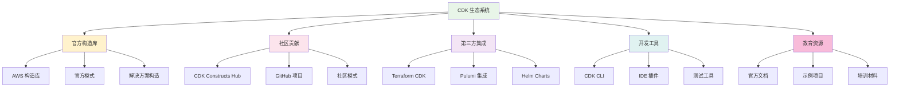

# 第 12 章：CDK 生态系统与扩展

::: tip 学习目标
- 了解 CDK 生态系统的组成和发展
- 掌握第三方 CDK 构造的使用和集成
- 学会创建和发布自定义 CDK 构造
- 理解 CDK 与其他 IaC 工具的集成
- 掌握 CDK 插件和扩展开发
- 了解 CDK 社区最佳实践和贡献方式
:::

## CDK 生态系统概述

AWS CDK 拥有一个丰富的生态系统，包括官方构造、社区贡献、第三方集成等多个方面。



## 第三方构造集成

### 热门社区构造

```python
# 使用社区构造的示例项目
# requirements.txt
"""
aws-cdk-lib>=2.50.0
constructs>=10.0.0

# 社区构造
cdk-dynamo-table-viewer>=4.0.0
cdk-spa-deploy>=2.0.0
cdk-datadog>=1.0.0
cdk-github>=1.0.0
cdk-fargate-patterns>=2.0.0
"""

# stacks/community_constructs_stack.py
import aws_cdk as cdk
from constructs import Construct

# 第三方构造导入
try:
    from cdk_dynamo_table_viewer import TableViewer
    from cdk_spa_deploy import SPADeploy
    from datadog_cdk_constructs import Datadog
    from cdk_github import GitHubRepository
except ImportError as e:
    print(f"某些社区构造未安装: {e}")
    print("请运行: pip install cdk-dynamo-table-viewer cdk-spa-deploy")

class CommunityConstructsStack(cdk.Stack):
    """展示社区构造使用的示例 Stack"""
    
    def __init__(self, scope: Construct, construct_id: str, **kwargs) -> None:
        super().__init__(scope, construct_id, **kwargs)
        
        # 1. DynamoDB Table Viewer - 可视化 DynamoDB 表
        self._setup_dynamo_viewer()
        
        # 2. SPA Deploy - 单页应用部署
        self._setup_spa_deploy()
        
        # 3. Datadog 集成
        self._setup_datadog_integration()
        
        # 4. GitHub 集成
        self._setup_github_integration()
        
        # 5. 自定义社区构造使用示例
        self._demonstrate_pattern_usage()
    
    def _setup_dynamo_viewer(self):
        """设置 DynamoDB 表查看器"""
        
        # 创建 DynamoDB 表
        from aws_cdk import aws_dynamodb as dynamodb
        
        users_table = dynamodb.Table(
            self,
            "UsersTable",
            table_name="community-users-table",
            partition_key=dynamodb.Attribute(
                name="userId",
                type=dynamodb.AttributeType.STRING
            ),
            billing_mode=dynamodb.BillingMode.PAY_PER_REQUEST,
            removal_policy=cdk.RemovalPolicy.DESTROY
        )
        
        # 使用社区构造创建表查看器
        if 'TableViewer' in globals():
            table_viewer = TableViewer(
                self,
                "UsersTableViewer",
                table=users_table,
                title="Users Table Viewer",
                sort_by="-userId"
            )
            
            cdk.CfnOutput(
                self,
                "TableViewerUrl",
                value=table_viewer.endpoint,
                description="DynamoDB Table Viewer URL"
            )
    
    def _setup_spa_deploy(self):
        """设置 SPA 部署"""
        
        if 'SPADeploy' in globals():
            spa_deploy = SPADeploy(
                self,
                "SPADeploy",
                source_path="./frontend/build",  # React/Vue 等构建输出目录
                # 自定义域名（可选）
                custom_domain_name="app.example.com" if self.node.try_get_context("domain_name") else None,
                # 启用 HTTPS 重定向
                redirect_https=True,
                # 启用 IPv6
                ipv6_enabled=True,
                # 错误配置
                error_configurations=[
                    {
                        "error_code": 404,
                        "response_code": 200,
                        "response_page_path": "/index.html"
                    }
                ]
            )
            
            cdk.CfnOutput(
                self,
                "SPAUrl",
                value=spa_deploy.cloudfront_distribution.distribution_domain_name,
                description="SPA CloudFront URL"
            )
    
    def _setup_datadog_integration(self):
        """设置 Datadog 监控集成"""
        
        if 'Datadog' in globals():
            # Datadog API 密钥（应该存储在 Secrets Manager 中）
            datadog_api_key = cdk.SecretValue.secrets_manager("datadog/api-key")
            
            datadog_integration = Datadog(
                self,
                "DatadogIntegration",
                api_key=datadog_api_key,
                # 监控的服务
                service="community-app",
                env="production",
                version="1.0.0",
                # 启用的监控功能
                enable_logs_monitoring=True,
                enable_enhanced_metrics=True,
                enable_tracing=True,
                # 标签
                tags=[
                    "team:engineering",
                    "project:community-app",
                    "environment:prod"
                ]
            )
            
            # 自定义仪表板
            datadog_integration.create_dashboard({
                "title": "Community App Dashboard",
                "widgets": [
                    {
                        "type": "timeseries",
                        "title": "API Requests",
                        "query": "sum:aws.apigateway.count{service:community-app}.as_count()"
                    },
                    {
                        "type": "query_value",
                        "title": "Error Rate",
                        "query": "sum:aws.apigateway.5xx{service:community-app}.as_count()"
                    }
                ]
            })
    
    def _setup_github_integration(self):
        """设置 GitHub 集成"""
        
        if 'GitHubRepository' in globals():
            # 创建 GitHub 仓库（如果不存在）
            github_repo = GitHubRepository(
                self,
                "CommunityAppRepo",
                repository_name="community-app-infrastructure",
                description="Infrastructure as Code for Community App",
                # 仓库配置
                private=True,
                auto_init=True,
                gitignore_template="Python",
                license_template="MIT",
                # 分支保护
                branch_protection_rules=[
                    {
                        "pattern": "main",
                        "required_status_checks": {
                            "strict": True,
                            "contexts": ["ci/build", "ci/test"]
                        },
                        "required_pull_request_reviews": {
                            "required_approving_review_count": 2,
                            "dismiss_stale_reviews": True
                        },
                        "enforce_admins": False,
                        "restrictions": None
                    }
                ]
            )
            
            # GitHub Actions 工作流
            github_repo.add_workflow(
                name="ci",
                workflow={
                    "name": "CI/CD Pipeline",
                    "on": {
                        "push": {"branches": ["main", "develop"]},
                        "pull_request": {"branches": ["main"]}
                    },
                    "jobs": {
                        "test": {
                            "runs-on": "ubuntu-latest",
                            "steps": [
                                {"uses": "actions/checkout@v3"},
                                {
                                    "uses": "actions/setup-python@v4",
                                    "with": {"python-version": "3.9"}
                                },
                                {"run": "pip install -r requirements.txt"},
                                {"run": "pytest tests/"},
                                {"run": "cdk synth"}
                            ]
                        },
                        "deploy": {
                            "needs": "test",
                            "runs-on": "ubuntu-latest",
                            "if": "github.ref == 'refs/heads/main'",
                            "steps": [
                                {"uses": "actions/checkout@v3"},
                                {"run": "cdk deploy --require-approval never"}
                            ]
                        }
                    }
                }
            )
    
    def _demonstrate_pattern_usage(self):
        """演示常见模式的使用"""
        
        # 使用多个构造组合创建复杂模式
        from aws_cdk import (
            aws_lambda as lambda_,
            aws_apigateway as apigateway,
            aws_dynamodb as dynamodb,
            aws_s3 as s3,
            aws_cloudfront as cloudfront
        )
        
        # Serverless API 模式
        api_lambda = lambda_.Function(
            self,
            "APIFunction",
            runtime=lambda_.Runtime.PYTHON_3_9,
            handler="api.handler",
            code=lambda_.Code.from_asset("lambda/api")
        )
        
        api = apigateway.RestApi(
            self,
            "CommunityAPI",
            rest_api_name="community-api"
        )
        
        api.root.add_proxy(
            default_integration=apigateway.LambdaIntegration(api_lambda)
        )
        
        # 静态资源 + 动态 API 模式
        assets_bucket = s3.Bucket(
            self,
            "AssetsBucket",
            bucket_name=f"community-assets-{cdk.Aws.ACCOUNT_ID}",
            public_read_access=False
        )
        
        distribution = cloudfront.CloudFrontWebDistribution(
            self,
            "CommunityDistribution",
            origin_configs=[
                cloudfront.SourceConfiguration(
                    s3_origin_source=cloudfront.S3OriginConfig(
                        s3_bucket_source=assets_bucket
                    ),
                    behaviors=[
                        cloudfront.Behavior(
                            path_pattern="/static/*",
                            is_default_behavior=False
                        )
                    ]
                ),
                cloudfront.SourceConfiguration(
                    custom_origin_source=cloudfront.CustomOriginConfig(
                        domain_name=api.url.replace("https://", "").replace("/", "")
                    ),
                    behaviors=[
                        cloudfront.Behavior(
                            path_pattern="/api/*",
                            is_default_behavior=False,
                            allowed_methods=cloudfront.CloudFrontAllowedMethods.ALL
                        )
                    ]
                )
            ],
            default_root_object="index.html"
        )
```

## 自定义构造开发

### 创建可重用构造

```python
# constructs/multi_tier_web_app.py
import aws_cdk as cdk
from aws_cdk import (
    aws_ec2 as ec2,
    aws_rds as rds,
    aws_elasticloadbalancingv2 as elbv2,
    aws_autoscaling as autoscaling,
    aws_s3 as s3,
    aws_cloudfront as cloudfront
)
from constructs import Construct
from typing import Optional, List, Dict
import json

class MultiTierWebAppProps:
    """多层 Web 应用构造的属性"""
    
    def __init__(self,
                 app_name: str,
                 environment: str,
                 vpc_cidr: str = "10.0.0.0/16",
                 instance_type: str = "t3.medium",
                 min_capacity: int = 2,
                 max_capacity: int = 10,
                 database_instance_type: str = "db.t3.micro",
                 enable_https: bool = True,
                 domain_name: Optional[str] = None,
                 **kwargs):
        
        self.app_name = app_name
        self.environment = environment
        self.vpc_cidr = vpc_cidr
        self.instance_type = instance_type
        self.min_capacity = min_capacity
        self.max_capacity = max_capacity
        self.database_instance_type = database_instance_type
        self.enable_https = enable_https
        self.domain_name = domain_name
        
        # 合并任何额外的属性
        for key, value in kwargs.items():
            setattr(self, key, value)

class MultiTierWebApp(Construct):
    """多层 Web 应用构造 - 可重用的完整 Web 应用架构"""
    
    def __init__(self, scope: Construct, construct_id: str, 
                 props: MultiTierWebAppProps, **kwargs) -> None:
        
        super().__init__(scope, construct_id, **kwargs)
        
        self.props = props
        
        # 存储创建的资源引用
        self.vpc: Optional[ec2.Vpc] = None
        self.database: Optional[rds.DatabaseInstance] = None
        self.load_balancer: Optional[elbv2.ApplicationLoadBalancer] = None
        self.auto_scaling_group: Optional[autoscaling.AutoScalingGroup] = None
        self.cdn: Optional[cloudfront.CloudFrontWebDistribution] = None
        
        # 创建基础设施层
        self._create_networking()
        self._create_database_layer()
        self._create_application_layer()
        self._create_load_balancer()
        self._create_cdn()
        
        # 输出重要信息
        self._create_outputs()
    
    def _create_networking(self):
        """创建网络层"""
        
        self.vpc = ec2.Vpc(
            self,
            "VPC",
            ip_addresses=ec2.IpAddresses.cidr(self.props.vpc_cidr),
            max_azs=3,
            nat_gateways=2,
            subnet_configuration=[
                ec2.SubnetConfiguration(
                    cidr_mask=24,
                    name="Public",
                    subnet_type=ec2.SubnetType.PUBLIC
                ),
                ec2.SubnetConfiguration(
                    cidr_mask=24,
                    name="Private",
                    subnet_type=ec2.SubnetType.PRIVATE_WITH_EGRESS
                ),
                ec2.SubnetConfiguration(
                    cidr_mask=28,
                    name="Database",
                    subnet_type=ec2.SubnetType.PRIVATE_ISOLATED
                )
            ]
        )
        
        # 安全组
        self.web_security_group = ec2.SecurityGroup(
            self,
            "WebSecurityGroup",
            vpc=self.vpc,
            description=f"Security group for {self.props.app_name} web servers",
            allow_all_outbound=True
        )
        
        self.database_security_group = ec2.SecurityGroup(
            self,
            "DatabaseSecurityGroup",
            vpc=self.vpc,
            description=f"Security group for {self.props.app_name} database",
            allow_all_outbound=False
        )
        
        # 允许 Web 层访问数据库
        self.database_security_group.add_ingress_rule(
            peer=self.web_security_group,
            connection=ec2.Port.tcp(5432),
            description="Allow web servers to access database"
        )
    
    def _create_database_layer(self):
        """创建数据库层"""
        
        # 数据库子网组
        db_subnet_group = rds.SubnetGroup(
            self,
            "DatabaseSubnetGroup",
            description=f"Subnet group for {self.props.app_name} database",
            vpc=self.vpc,
            vpc_subnets=ec2.SubnetSelection(
                subnet_type=ec2.SubnetType.PRIVATE_ISOLATED
            )
        )
        
        # 数据库凭证
        db_credentials = rds.DatabaseSecret(
            self,
            "DatabaseCredentials",
            username=f"{self.props.app_name}admin"
        )
        
        # RDS 实例
        self.database = rds.DatabaseInstance(
            self,
            "Database",
            engine=rds.DatabaseInstanceEngine.postgres(
                version=rds.PostgresEngineVersion.VER_14_9
            ),
            instance_type=ec2.InstanceType(self.props.database_instance_type),
            vpc=self.vpc,
            subnet_group=db_subnet_group,
            security_groups=[self.database_security_group],
            credentials=rds.Credentials.from_secret(db_credentials),
            database_name=self.props.app_name.replace("-", "_"),
            backup_retention=cdk.Duration.days(7),
            deletion_protection=self.props.environment == "prod",
            multi_az=self.props.environment == "prod"
        )
    
    def _create_application_layer(self):
        """创建应用层"""
        
        # 用户数据脚本
        user_data = ec2.UserData.for_linux()
        user_data.add_commands(
            "yum update -y",
            "yum install -y python3 python3-pip",
            f"echo 'APP_NAME={self.props.app_name}' > /etc/environment",
            f"echo 'ENVIRONMENT={self.props.environment}' >> /etc/environment",
            f"echo 'DB_HOST={self.database.instance_endpoint.hostname}' >> /etc/environment",
            "systemctl enable amazon-cloudwatch-agent",
            "systemctl start amazon-cloudwatch-agent"
        )
        
        # 启动模板
        launch_template = ec2.LaunchTemplate(
            self,
            "LaunchTemplate",
            instance_type=ec2.InstanceType(self.props.instance_type),
            machine_image=ec2.AmazonLinuxImage(
                generation=ec2.AmazonLinuxGeneration.AMAZON_LINUX_2
            ),
            security_group=self.web_security_group,
            user_data=user_data,
            role=self._create_instance_role()
        )
        
        # Auto Scaling Group
        self.auto_scaling_group = autoscaling.AutoScalingGroup(
            self,
            "AutoScalingGroup",
            vpc=self.vpc,
            launch_template=launch_template,
            min_capacity=self.props.min_capacity,
            max_capacity=self.props.max_capacity,
            desired_capacity=self.props.min_capacity,
            vpc_subnets=ec2.SubnetSelection(
                subnet_type=ec2.SubnetType.PRIVATE_WITH_EGRESS
            ),
            health_check=autoscaling.HealthCheck.elb(
                grace_period=cdk.Duration.minutes(5)
            ),
            update_policy=autoscaling.UpdatePolicy.rolling_update(
                min_instances_in_service=1,
                max_batch_size=2
            )
        )
        
        # 基于 CPU 的扩展策略
        self.auto_scaling_group.scale_on_cpu_utilization(
            "CPUScaling",
            target_utilization_percent=70,
            scale_in_cooldown=cdk.Duration.minutes(5),
            scale_out_cooldown=cdk.Duration.minutes(2)
        )
    
    def _create_instance_role(self):
        """创建 EC2 实例角色"""
        
        from aws_cdk import aws_iam as iam
        
        role = iam.Role(
            self,
            "InstanceRole",
            assumed_by=iam.ServicePrincipal("ec2.amazonaws.com"),
            managed_policies=[
                iam.ManagedPolicy.from_aws_managed_policy_name("CloudWatchAgentServerPolicy"),
                iam.ManagedPolicy.from_aws_managed_policy_name("AmazonSSMManagedInstanceCore")
            ]
        )
        
        # 允许访问数据库密钥
        role.add_to_policy(
            iam.PolicyStatement(
                effect=iam.Effect.ALLOW,
                actions=["secretsmanager:GetSecretValue"],
                resources=[self.database.secret.secret_arn]
            )
        )
        
        return role
    
    def _create_load_balancer(self):
        """创建负载均衡器"""
        
        # Application Load Balancer
        self.load_balancer = elbv2.ApplicationLoadBalancer(
            self,
            "LoadBalancer",
            vpc=self.vpc,
            internet_facing=True,
            vpc_subnets=ec2.SubnetSelection(
                subnet_type=ec2.SubnetType.PUBLIC
            )
        )
        
        # 目标组
        target_group = elbv2.ApplicationTargetGroup(
            self,
            "TargetGroup",
            port=80,
            protocol=elbv2.ApplicationProtocol.HTTP,
            targets=[self.auto_scaling_group],
            vpc=self.vpc,
            health_check=elbv2.HealthCheck(
                enabled=True,
                healthy_http_codes="200",
                interval=cdk.Duration.seconds(30),
                path="/health",
                timeout=cdk.Duration.seconds(5)
            )
        )
        
        # HTTP 监听器
        http_listener = self.load_balancer.add_listener(
            "HTTPListener",
            port=80,
            protocol=elbv2.ApplicationProtocol.HTTP,
            default_target_groups=[target_group]
        )
        
        # HTTPS 监听器（如果启用）
        if self.props.enable_https and self.props.domain_name:
            from aws_cdk import aws_certificatemanager as acm
            
            certificate = acm.Certificate(
                self,
                "Certificate",
                domain_name=self.props.domain_name,
                validation=acm.CertificateValidation.from_dns()
            )
            
            https_listener = self.load_balancer.add_listener(
                "HTTPSListener",
                port=443,
                protocol=elbv2.ApplicationProtocol.HTTPS,
                certificates=[certificate],
                default_target_groups=[target_group]
            )
            
            # HTTP 重定向到 HTTPS
            http_listener.add_action(
                "HTTPSRedirect",
                action=elbv2.ListenerAction.redirect(
                    protocol="HTTPS",
                    port="443",
                    permanent=True
                )
            )
        
        # 允许 ALB 访问 Web 服务器
        self.web_security_group.add_ingress_rule(
            peer=ec2.Peer.any_ipv4(),
            connection=ec2.Port.tcp(80),
            description="Allow HTTP from ALB"
        )
    
    def _create_cdn(self):
        """创建 CDN"""
        
        # 静态资源存储桶
        static_assets_bucket = s3.Bucket(
            self,
            "StaticAssetsBucket",
            bucket_name=f"{self.props.app_name}-static-{cdk.Aws.ACCOUNT_ID}",
            public_read_access=False,
            removal_policy=cdk.RemovalPolicy.DESTROY
        )
        
        # CloudFront 分发
        self.cdn = cloudfront.CloudFrontWebDistribution(
            self,
            "CDN",
            origin_configs=[
                # 静态资源来源
                cloudfront.SourceConfiguration(
                    s3_origin_source=cloudfront.S3OriginConfig(
                        s3_bucket_source=static_assets_bucket,
                        origin_access_identity=cloudfront.OriginAccessIdentity(
                            self, "OAI"
                        )
                    ),
                    behaviors=[
                        cloudfront.Behavior(
                            path_pattern="/static/*",
                            is_default_behavior=False,
                            compress=True,
                            cache_policy=cloudfront.CachePolicy.CACHING_OPTIMIZED
                        )
                    ]
                ),
                # 动态内容来源
                cloudfront.SourceConfiguration(
                    custom_origin_source=cloudfront.CustomOriginConfig(
                        domain_name=self.load_balancer.load_balancer_dns_name,
                        http_port=80,
                        https_port=443 if self.props.enable_https else None,
                        origin_protocol_policy=cloudfront.OriginProtocolPolicy.HTTP_ONLY if not self.props.enable_https else cloudfront.OriginProtocolPolicy.HTTPS_ONLY
                    ),
                    behaviors=[
                        cloudfront.Behavior(
                            path_pattern="/api/*",
                            is_default_behavior=False,
                            cache_policy=cloudfront.CachePolicy.CACHING_DISABLED,
                            allowed_methods=cloudfront.CloudFrontAllowedMethods.ALL
                        ),
                        cloudfront.Behavior(
                            is_default_behavior=True,
                            cache_policy=cloudfront.CachePolicy.CACHING_OPTIMIZED
                        )
                    ]
                )
            ],
            price_class=cloudfront.PriceClass.PRICE_CLASS_100,
            enable_ipv6=True
        )
    
    def _create_outputs(self):
        """创建输出"""
        
        cdk.CfnOutput(
            self,
            "LoadBalancerDNS",
            value=self.load_balancer.load_balancer_dns_name,
            description=f"Load Balancer DNS for {self.props.app_name}"
        )
        
        cdk.CfnOutput(
            self,
            "CDNDomainName",
            value=self.cdn.distribution_domain_name,
            description=f"CloudFront distribution domain for {self.props.app_name}"
        )
        
        cdk.CfnOutput(
            self,
            "DatabaseEndpoint",
            value=self.database.instance_endpoint.hostname,
            description=f"Database endpoint for {self.props.app_name}"
        )
        
        cdk.CfnOutput(
            self,
            "VPCId",
            value=self.vpc.vpc_id,
            description=f"VPC ID for {self.props.app_name}"
        )
    
    def add_monitoring(self, alert_email: str):
        """添加监控和告警"""
        
        from aws_cdk import aws_cloudwatch as cloudwatch
        from aws_cdk import aws_sns as sns
        from aws_cdk import aws_sns_subscriptions as subscriptions
        
        # SNS 主题
        alert_topic = sns.Topic(
            self,
            "AlertTopic",
            topic_name=f"{self.props.app_name}-alerts"
        )
        
        alert_topic.add_subscription(
            subscriptions.EmailSubscription(alert_email)
        )
        
        # CloudWatch 告警
        # 高 CPU 使用率告警
        cloudwatch.Alarm(
            self,
            "HighCPUAlarm",
            alarm_name=f"{self.props.app_name}-high-cpu",
            metric=self.auto_scaling_group.metric_cpu_utilization(),
            threshold=80,
            evaluation_periods=3
        ).add_alarm_action(
            cloudwatch.SnsAction(alert_topic)
        )
        
        # ALB 错误率告警
        cloudwatch.Alarm(
            self,
            "HighErrorRateAlarm",
            alarm_name=f"{self.props.app_name}-high-error-rate",
            metric=self.load_balancer.metric_http_code_elb(
                code=elbv2.HttpCodeElb.ELB_5XX_COUNT
            ),
            threshold=10,
            evaluation_periods=2
        ).add_alarm_action(
            cloudwatch.SnsAction(alert_topic)
        )
        
        # 数据库连接告警
        cloudwatch.Alarm(
            self,
            "DatabaseConnectionsAlarm",
            alarm_name=f"{self.props.app_name}-db-connections",
            metric=self.database.metric_database_connections(),
            threshold=80,
            evaluation_periods=2
        ).add_alarm_action(
            cloudwatch.SnsAction(alert_topic)
        )
    
    def enable_backup(self, retention_days: int = 30):
        """启用备份"""
        
        from aws_cdk import aws_backup as backup
        
        # 备份保险库
        backup_vault = backup.BackupVault(
            self,
            "BackupVault",
            backup_vault_name=f"{self.props.app_name}-backup-vault"
        )
        
        # 备份计划
        backup_plan = backup.BackupPlan(
            self,
            "BackupPlan",
            backup_plan_name=f"{self.props.app_name}-backup-plan",
            backup_plan_rules=[
                backup.BackupPlanRule(
                    rule_name="DailyBackups",
                    backup_vault=backup_vault,
                    schedule_expression=backup.Schedule.cron(
                        hour="2",
                        minute="0"
                    ),
                    delete_after=cdk.Duration.days(retention_days)
                )
            ]
        )
        
        # 添加数据库到备份选择
        backup_plan.add_selection(
            "DatabaseBackupSelection",
            resources=[
                backup.BackupResource.from_rds_database_instance(self.database)
            ]
        )
```

### 构造发布和分发

```python
# 构造包发布配置

# setup.py
from setuptools import setup, find_packages

setup(
    name="multi-tier-web-app-cdk",
    version="1.0.0",
    description="A reusable CDK construct for multi-tier web applications",
    long_description=open("README.md").read(),
    long_description_content_type="text/markdown",
    author="Your Name",
    author_email="your.email@example.com",
    url="https://github.com/yourusername/multi-tier-web-app-cdk",
    packages=find_packages(exclude=["tests*"]),
    install_requires=[
        "aws-cdk-lib>=2.50.0",
        "constructs>=10.0.0"
    ],
    python_requires=">=3.7",
    classifiers=[
        "Development Status :: 4 - Beta",
        "Intended Audience :: Developers",
        "License :: OSI Approved :: MIT License",
        "Programming Language :: Python :: 3",
        "Programming Language :: Python :: 3.7",
        "Programming Language :: Python :: 3.8", 
        "Programming Language :: Python :: 3.9",
        "Programming Language :: Python :: 3.10",
        "Programming Language :: Python :: 3.11",
        "Topic :: Software Development :: Libraries :: Python Modules",
        "Topic :: System :: Systems Administration",
        "Typing :: Typed"
    ],
    keywords="aws cdk construct web-app infrastructure",
    project_urls={
        "Bug Reports": "https://github.com/yourusername/multi-tier-web-app-cdk/issues",
        "Source": "https://github.com/yourusername/multi-tier-web-app-cdk",
        "Documentation": "https://multi-tier-web-app-cdk.readthedocs.io/"
    }
)
```

```yaml
# .github/workflows/publish.yml
name: Publish to PyPI

on:
  release:
    types: [published]

jobs:
  build-and-publish:
    runs-on: ubuntu-latest
    
    steps:
    - uses: actions/checkout@v3
    
    - name: Set up Python
      uses: actions/setup-python@v4
      with:
        python-version: '3.9'
    
    - name: Install dependencies
      run: |
        python -m pip install --upgrade pip
        pip install build twine
        pip install -r requirements.txt
    
    - name: Run tests
      run: |
        pip install pytest
        pytest tests/
    
    - name: Build package
      run: python -m build
    
    - name: Publish to PyPI
      env:
        TWINE_USERNAME: __token__
        TWINE_PASSWORD: ${{ secrets.PYPI_API_TOKEN }}
      run: twine upload dist/*
    
    - name: Publish to Constructs Hub
      run: |
        # 自动提交到 Constructs Hub
        echo "Package published, will appear in Constructs Hub"
```

## CDK 工具集成

### VS Code 插件开发

```typescript
// VS Code CDK 插件示例
// package.json
{
  "name": "aws-cdk-helper",
  "displayName": "AWS CDK Helper", 
  "description": "Helper tools for AWS CDK development",
  "version": "1.0.0",
  "engines": {
    "vscode": "^1.60.0"
  },
  "categories": ["Other"],
  "activationEvents": [
    "onLanguage:python",
    "onLanguage:typescript",
    "workspaceContains:**/cdk.json"
  ],
  "main": "./out/extension.js",
  "contributes": {
    "commands": [
      {
        "command": "cdk-helper.synthesize",
        "title": "CDK: Synthesize"
      },
      {
        "command": "cdk-helper.deploy",
        "title": "CDK: Deploy"
      },
      {
        "command": "cdk-helper.diff",
        "title": "CDK: Diff"
      }
    ],
    "menus": {
      "explorer/context": [
        {
          "command": "cdk-helper.synthesize",
          "when": "resourceFilename == cdk.json",
          "group": "navigation"
        }
      ]
    },
    "configuration": {
      "title": "AWS CDK Helper",
      "properties": {
        "cdk-helper.defaultProfile": {
          "type": "string",
          "default": "default",
          "description": "Default AWS profile to use"
        }
      }
    }
  },
  "scripts": {
    "vscode:prepublish": "npm run compile",
    "compile": "tsc -p ./",
    "watch": "tsc -watch -p ./"
  },
  "devDependencies": {
    "@types/vscode": "^1.60.0",
    "@types/node": "16.x",
    "typescript": "^4.4.4"
  }
}
```

```typescript
// src/extension.ts
import * as vscode from 'vscode';
import { exec } from 'child_process';
import * as path from 'path';

export function activate(context: vscode.ExtensionContext) {
    console.log('AWS CDK Helper is now active!');
    
    // 注册命令
    let synthesizeCommand = vscode.commands.registerCommand('cdk-helper.synthesize', () => {
        synthesizeCDK();
    });
    
    let deployCommand = vscode.commands.registerCommand('cdk-helper.deploy', () => {
        deployCDK();
    });
    
    let diffCommand = vscode.commands.registerCommand('cdk-helper.diff', () => {
        diffCDK();
    });
    
    context.subscriptions.push(synthesizeCommand, deployCommand, diffCommand);
    
    // 状态栏项
    let statusBarItem = vscode.window.createStatusBarItem(vscode.StatusBarAlignment.Left);
    statusBarItem.text = "$(cloud) CDK";
    statusBarItem.command = 'cdk-helper.synthesize';
    statusBarItem.show();
    context.subscriptions.push(statusBarItem);
    
    // 文件监视器
    let watcher = vscode.workspace.createFileSystemWatcher('**/*.py');
    watcher.onDidChange(() => {
        validateCDKCode();
    });
    context.subscriptions.push(watcher);
}

function synthesizeCDK() {
    const terminal = vscode.window.createTerminal('CDK Synthesize');
    terminal.show();
    terminal.sendText('cdk synth');
}

function deployCDK() {
    vscode.window.showInformationMessage('Deploying CDK stack...', 'Confirm', 'Cancel')
        .then(selection => {
            if (selection === 'Confirm') {
                const terminal = vscode.window.createTerminal('CDK Deploy');
                terminal.show();
                terminal.sendText('cdk deploy');
            }
        });
}

function diffCDK() {
    const terminal = vscode.window.createTerminal('CDK Diff');
    terminal.show();
    terminal.sendText('cdk diff');
}

function validateCDKCode() {
    // 简单的代码验证逻辑
    const activeEditor = vscode.window.activeTextEditor;
    if (activeEditor) {
        const document = activeEditor.document;
        if (document.languageId === 'python') {
            // 检查常见的 CDK 模式
            const text = document.getText();
            if (text.includes('aws_cdk') && text.includes('Stack')) {
                vscode.window.showInformationMessage('CDK Stack detected!');
            }
        }
    }
}

export function deactivate() {}
```

### CDK 测试工具

```python
# tests/test_framework.py
import json
import pytest
from aws_cdk import App, assertions
from constructs.multi_tier_web_app import MultiTierWebApp, MultiTierWebAppProps

class CDKTestFramework:
    """CDK 测试框架"""
    
    def __init__(self):
        self.app = App()
        self.test_results = []
    
    def create_test_stack(self, stack_name: str, props: MultiTierWebAppProps):
        """创建测试用的 Stack"""
        return MultiTierWebApp(self.app, stack_name, props)
    
    def assert_resource_count(self, stack, resource_type: str, expected_count: int):
        """断言资源数量"""
        template = assertions.Template.from_stack(stack)
        template.resource_count_is(resource_type, expected_count)
        
        self.test_results.append({
            "test": "resource_count",
            "resource_type": resource_type,
            "expected": expected_count,
            "status": "passed"
        })
    
    def assert_resource_properties(self, stack, resource_type: str, properties: dict):
        """断言资源属性"""
        template = assertions.Template.from_stack(stack)
        template.has_resource_properties(resource_type, properties)
        
        self.test_results.append({
            "test": "resource_properties",
            "resource_type": resource_type,
            "properties": properties,
            "status": "passed"
        })
    
    def assert_security_best_practices(self, stack):
        """断言安全最佳实践"""
        template = assertions.Template.from_stack(stack)
        
        # 检查 S3 存储桶是否启用加密
        template.has_resource_properties("AWS::S3::Bucket", {
            "BucketEncryption": assertions.Match.object_like({
                "ServerSideEncryptionConfiguration": assertions.Match.any_value()
            })
        })
        
        # 检查数据库是否启用加密
        template.has_resource_properties("AWS::RDS::DBInstance", {
            "StorageEncrypted": True
        })
        
        # 检查安全组规则
        template.has_resource_properties("AWS::EC2::SecurityGroup", {
            "SecurityGroupIngress": assertions.Match.array_with([
                assertions.Match.object_like({
                    "IpProtocol": "tcp",
                    "FromPort": assertions.Match.any_value(),
                    "ToPort": assertions.Match.any_value()
                })
            ])
        })
        
        self.test_results.append({
            "test": "security_best_practices",
            "status": "passed"
        })
    
    def generate_test_report(self, output_file: str = "test_report.json"):
        """生成测试报告"""
        report = {
            "timestamp": json.dumps(datetime.now().isoformat()),
            "total_tests": len(self.test_results),
            "passed_tests": len([r for r in self.test_results if r["status"] == "passed"]),
            "failed_tests": len([r for r in self.test_results if r["status"] == "failed"]),
            "test_details": self.test_results
        }
        
        with open(output_file, 'w') as f:
            json.dump(report, f, indent=2)
        
        return report

# 使用测试框架的示例
def test_multi_tier_web_app():
    """测试多层 Web 应用构造"""
    
    # 创建测试框架
    test_framework = CDKTestFramework()
    
    # 创建测试属性
    props = MultiTierWebAppProps(
        app_name="test-app",
        environment="test",
        instance_type="t3.micro",
        min_capacity=1,
        max_capacity=3
    )
    
    # 创建测试 Stack
    stack = test_framework.create_test_stack("TestStack", props)
    
    # 执行测试
    test_framework.assert_resource_count(stack, "AWS::EC2::VPC", 1)
    test_framework.assert_resource_count(stack, "AWS::RDS::DBInstance", 1)
    test_framework.assert_resource_count(stack, "AWS::ElasticLoadBalancingV2::LoadBalancer", 1)
    test_framework.assert_resource_count(stack, "AWS::AutoScaling::AutoScalingGroup", 1)
    
    # 安全性测试
    test_framework.assert_security_best_practices(stack)
    
    # 生成测试报告
    report = test_framework.generate_test_report()
    print(f"测试完成: {report['passed_tests']}/{report['total_tests']} 通过")

if __name__ == "__main__":
    test_multi_tier_web_app()
```

### CDK CLI 扩展

```python
# cdk_extensions/cli_plugin.py
import click
import subprocess
import json
import os
from typing import List, Dict

@click.group()
def cdk_ext():
    """CDK 扩展命令行工具"""
    pass

@cdk_ext.command()
@click.option('--stack-name', help='Stack name to analyze')
@click.option('--output', default='analysis.json', help='Output file name')
def analyze(stack_name: str, output: str):
    """分析 CDK Stack 的成本和安全性"""
    click.echo(f"分析 Stack: {stack_name}")
    
    # 获取 Stack 模板
    result = subprocess.run(['cdk', 'synth', stack_name], 
                          capture_output=True, text=True)
    
    if result.returncode != 0:
        click.echo(f"Error: {result.stderr}", err=True)
        return
    
    template = json.loads(result.stdout)
    
    # 分析成本
    cost_analysis = analyze_cost(template)
    
    # 分析安全性
    security_analysis = analyze_security(template)
    
    # 生成报告
    analysis_report = {
        "stack_name": stack_name,
        "cost_analysis": cost_analysis,
        "security_analysis": security_analysis,
        "recommendations": generate_recommendations(cost_analysis, security_analysis)
    }
    
    with open(output, 'w') as f:
        json.dump(analysis_report, f, indent=2)
    
    click.echo(f"分析报告已保存到: {output}")

def analyze_cost(template: Dict) -> Dict:
    """成本分析"""
    resources = template.get('Resources', {})
    cost_estimate = 0
    resource_costs = {}
    
    for resource_id, resource in resources.items():
        resource_type = resource.get('Type')
        properties = resource.get('Properties', {})
        
        # 简化的成本估算逻辑
        if resource_type == 'AWS::EC2::Instance':
            instance_type = properties.get('InstanceType', 't3.micro')
            cost_estimate += get_ec2_cost(instance_type) * 24 * 30  # 月成本
            resource_costs[resource_id] = {
                "type": resource_type,
                "monthly_cost": get_ec2_cost(instance_type) * 24 * 30
            }
        
        elif resource_type == 'AWS::RDS::DBInstance':
            instance_class = properties.get('DBInstanceClass', 'db.t3.micro')
            cost_estimate += get_rds_cost(instance_class) * 24 * 30
            resource_costs[resource_id] = {
                "type": resource_type,
                "monthly_cost": get_rds_cost(instance_class) * 24 * 30
            }
    
    return {
        "total_monthly_estimate": round(cost_estimate, 2),
        "resource_breakdown": resource_costs,
        "top_cost_drivers": sorted(
            resource_costs.items(),
            key=lambda x: x[1]["monthly_cost"],
            reverse=True
        )[:5]
    }

def analyze_security(template: Dict) -> Dict:
    """安全性分析"""
    resources = template.get('Resources', {})
    security_issues = []
    security_score = 100
    
    for resource_id, resource in resources.items():
        resource_type = resource.get('Type')
        properties = resource.get('Properties', {})
        
        # S3 存储桶安全检查
        if resource_type == 'AWS::S3::Bucket':
            if not properties.get('BucketEncryption'):
                security_issues.append({
                    "resource": resource_id,
                    "issue": "S3 bucket encryption not enabled",
                    "severity": "high",
                    "recommendation": "Enable server-side encryption"
                })
                security_score -= 15
            
            if properties.get('PublicAccessBlockConfiguration', {}).get('BlockPublicAcls') != True:
                security_issues.append({
                    "resource": resource_id,
                    "issue": "S3 bucket allows public access",
                    "severity": "critical",
                    "recommendation": "Block all public access"
                })
                security_score -= 25
        
        # RDS 安全检查
        elif resource_type == 'AWS::RDS::DBInstance':
            if not properties.get('StorageEncrypted'):
                security_issues.append({
                    "resource": resource_id,
                    "issue": "RDS instance storage not encrypted",
                    "severity": "high",
                    "recommendation": "Enable storage encryption"
                })
                security_score -= 15
        
        # 安全组检查
        elif resource_type == 'AWS::EC2::SecurityGroup':
            ingress_rules = properties.get('SecurityGroupIngress', [])
            for rule in ingress_rules:
                if rule.get('CidrIp') == '0.0.0.0/0' and rule.get('FromPort') != 80 and rule.get('FromPort') != 443:
                    security_issues.append({
                        "resource": resource_id,
                        "issue": f"Security group allows unrestricted access on port {rule.get('FromPort')}",
                        "severity": "high",
                        "recommendation": "Restrict access to specific IP ranges"
                    })
                    security_score -= 10
    
    return {
        "security_score": max(0, security_score),
        "issues_found": len(security_issues),
        "issues": security_issues,
        "compliance_status": "compliant" if security_score >= 80 else "non-compliant"
    }

def generate_recommendations(cost_analysis: Dict, security_analysis: Dict) -> List[Dict]:
    """生成优化建议"""
    recommendations = []
    
    # 成本优化建议
    if cost_analysis["total_monthly_estimate"] > 1000:
        recommendations.append({
            "category": "cost",
            "priority": "high",
            "title": "High monthly cost detected",
            "description": f"Estimated monthly cost: ${cost_analysis['total_monthly_estimate']}",
            "actions": [
                "Consider using Reserved Instances for consistent workloads",
                "Review instance types and downsize if possible",
                "Implement auto-scaling to optimize resource usage"
            ]
        })
    
    # 安全性建议
    if security_analysis["security_score"] < 80:
        recommendations.append({
            "category": "security",
            "priority": "critical",
            "title": "Security improvements needed",
            "description": f"Security score: {security_analysis['security_score']}/100",
            "actions": [
                "Address all critical and high severity security issues",
                "Enable encryption for all data at rest",
                "Review and restrict security group rules"
            ]
        })
    
    return recommendations

def get_ec2_cost(instance_type: str) -> float:
    """获取 EC2 实例每小时成本（简化版）"""
    costs = {
        't3.micro': 0.0104,
        't3.small': 0.0208,
        't3.medium': 0.0416,
        't3.large': 0.0832,
        'm5.large': 0.096,
        'm5.xlarge': 0.192
    }
    return costs.get(instance_type, 0.0416)  # 默认 t3.medium 价格

def get_rds_cost(instance_class: str) -> float:
    """获取 RDS 实例每小时成本（简化版）"""
    costs = {
        'db.t3.micro': 0.017,
        'db.t3.small': 0.034,
        'db.t3.medium': 0.068,
        'db.r5.large': 0.24,
        'db.r5.xlarge': 0.48
    }
    return costs.get(instance_class, 0.068)  # 默认 db.t3.medium 价格

@cdk_ext.command()
@click.option('--stack-name', help='Stack name to optimize')
def optimize(stack_name: str):
    """优化 CDK Stack 配置"""
    click.echo(f"优化 Stack: {stack_name}")
    
    # 运行分析
    result = subprocess.run(['python', '-m', 'cdk_extensions.cli_plugin', 
                           'analyze', '--stack-name', stack_name], 
                          capture_output=True, text=True)
    
    if result.returncode != 0:
        click.echo(f"Error running analysis: {result.stderr}", err=True)
        return
    
    # 读取分析结果
    with open('analysis.json', 'r') as f:
        analysis = json.load(f)
    
    # 生成优化建议
    recommendations = analysis.get('recommendations', [])
    
    click.echo("\n优化建议:")
    click.echo("=" * 50)
    
    for i, rec in enumerate(recommendations, 1):
        click.echo(f"{i}. {rec['title']} ({rec['priority']})")
        click.echo(f"   {rec['description']}")
        click.echo("   建议操作:")
        for action in rec['actions']:
            click.echo(f"   - {action}")
        click.echo()

@cdk_ext.command()
@click.option('--template-name', help='Template name to create')
@click.option('--language', default='python', help='Programming language')
def create_template(template_name: str, language: str):
    """创建 CDK 项目模板"""
    click.echo(f"创建模板: {template_name} ({language})")
    
    # 模板目录结构
    templates = {
        'web-app': {
            'description': 'Multi-tier web application',
            'files': [
                'app.py',
                'requirements.txt', 
                'cdk.json',
                'stacks/__init__.py',
                'stacks/web_app_stack.py'
            ]
        },
        'serverless-api': {
            'description': 'Serverless API with Lambda and API Gateway',
            'files': [
                'app.py',
                'requirements.txt',
                'cdk.json',
                'stacks/__init__.py',
                'stacks/api_stack.py',
                'lambda/api.py'
            ]
        },
        'data-pipeline': {
            'description': 'Data processing pipeline',
            'files': [
                'app.py',
                'requirements.txt',
                'cdk.json',
                'stacks/__init__.py',
                'stacks/pipeline_stack.py'
            ]
        }
    }
    
    if template_name not in templates:
        click.echo(f"未知模板: {template_name}")
        click.echo(f"可用模板: {list(templates.keys())}")
        return
    
    template_info = templates[template_name]
    
    # 创建项目目录
    project_dir = f"{template_name}-project"
    os.makedirs(project_dir, exist_ok=True)
    
    # 创建文件
    for file_path in template_info['files']:
        full_path = os.path.join(project_dir, file_path)
        os.makedirs(os.path.dirname(full_path), exist_ok=True)
        
        # 生成文件内容（简化版）
        content = generate_file_content(file_path, template_name, language)
        
        with open(full_path, 'w') as f:
            f.write(content)
    
    click.echo(f"模板项目已创建: {project_dir}")
    click.echo(f"描述: {template_info['description']}")

def generate_file_content(file_path: str, template_name: str, language: str) -> str:
    """生成模板文件内容"""
    
    if file_path == 'app.py':
        return f'''#!/usr/bin/env python3
import aws_cdk as cdk
from stacks.{template_name.replace('-', '_')}_stack import {template_name.replace('-', ' ').title().replace(' ', '')}Stack

app = cdk.App()
{template_name.replace('-', ' ').title().replace(' ', '')}Stack(app, "{template_name.replace('-', ' ').title().replace(' ', '')}Stack")

app.synth()
'''
    
    elif file_path == 'requirements.txt':
        return '''aws-cdk-lib>=2.50.0
constructs>=10.0.0
'''
    
    elif file_path == 'cdk.json':
        return '''{
  "app": "python app.py",
  "watch": {
    "include": ["**"],
    "exclude": ["README.md", "cdk*.json", "requirements*.txt", "**/__pycache__", "**/*.pyc"]
  },
  "context": {
    "@aws-cdk/aws-lambda:recognizeLayerVersion": true,
    "@aws-cdk/core:checkSecretUsage": true
  }
}
'''
    
    elif 'stack.py' in file_path:
        stack_class = template_name.replace('-', ' ').title().replace(' ', '') + 'Stack'
        return f'''import aws_cdk as cdk
from aws_cdk import aws_s3 as s3
from constructs import Construct

class {stack_class}(cdk.Stack):

    def __init__(self, scope: Construct, construct_id: str, **kwargs) -> None:
        super().__init__(scope, construct_id, **kwargs)

        # TODO: Add your resources here
        bucket = s3.Bucket(self, "MyBucket")
        
        cdk.CfnOutput(self, "BucketName", value=bucket.bucket_name)
'''
    
    else:
        return f'# {file_path}\n# TODO: Add implementation\n'

if __name__ == '__main__':
    cdk_ext()
```

::: tip CDK 生态系统最佳实践总结
1. **构造复用**：优先使用成熟的社区构造，避免重复造轮子
2. **模块化设计**：将复杂的基础设施分解为可重用的构造
3. **版本管理**：为自定义构造建立明确的版本控制策略
4. **文档完善**：为构造提供详细的文档和示例
5. **测试覆盖**：确保构造有充分的单元测试和集成测试
6. **社区贡献**：积极参与开源社区，分享和改进构造
7. **工具集成**：使用和开发工具提升开发效率
8. **标准化**：建立团队或组织的构造开发标准
9. **监控追踪**：追踪构造的使用情况和性能表现
10. **持续改进**：根据用户反馈持续优化构造设计
:::

通过本章学习，你应该能够充分利用 CDK 生态系统的丰富资源，创建自己的可重用构造，并为社区做出贡献。CDK 的力量不仅在于其技术能力，更在于其活跃的社区和丰富的生态系统。

---

## 结语

恭喜你完成了 AWS CDK 完整课程的学习！从基础概念到高级实战，从性能优化到安全最佳实践，你已经掌握了使用 CDK 构建现代云基础设施的全面技能。

CDK 作为基础设施即代码的革新工具，正在改变我们构建和管理云基础设施的方式。希望这个课程能够帮助你在云原生架构和 DevOps 实践中取得成功。

记住，学习是一个持续的过程。随着 AWS 服务的不断发展和 CDK 生态系统的日益丰富，保持学习和实践的热情，与社区保持紧密联系，将使你在这个快速发展的领域中始终保持竞争优势。

祝你在云基础设施的征途上一帆风顺！