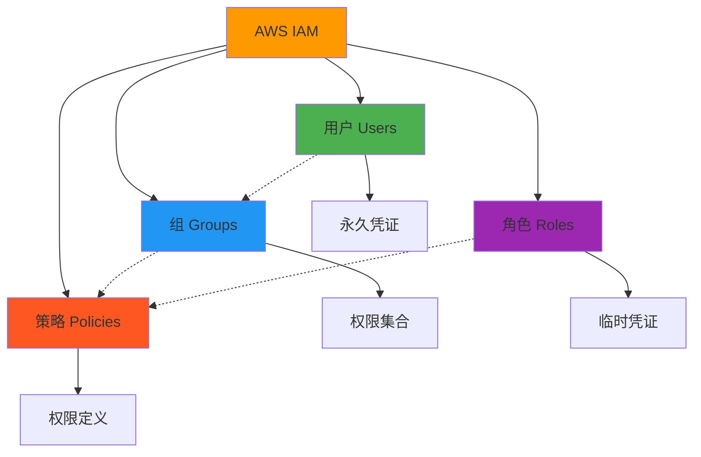
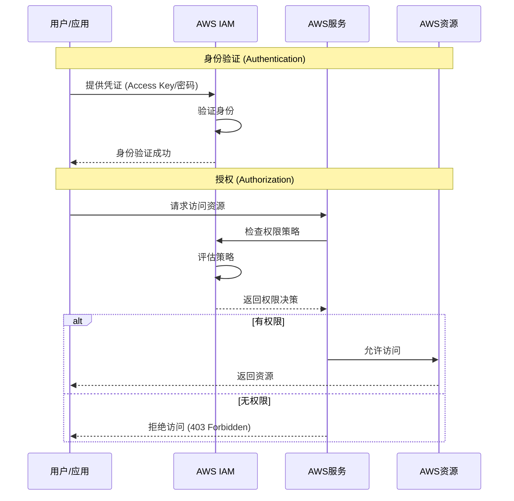
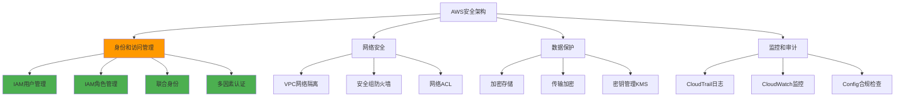

# 第01章：AWS IAM 基础概念

::: tip 学习目标
- 理解什么是AWS IAM及其核心作用
- 掌握IAM的基本组件和概念
- 了解IAM在AWS安全架构中的地位
- 理解身份验证和授权的区别
:::

## 知识点

### 什么是AWS IAM

AWS Identity and Access Management (IAM) 是一个Web服务，用于帮助您安全地控制对AWS资源的访问。IAM允许您控制谁可以被认证（登录）以及被授权（具有权限）使用资源。

### IAM核心组件



### IAM组件详解

| 组件 | 用途 | 特点 | 适用场景 |
|------|------|------|----------|
| **用户 (Users)** | 代表个人或应用程序 | 永久凭证、长期访问 | 开发人员、系统管理员 |
| **组 (Groups)** | 用户的集合 | 简化权限管理 | 部门、团队权限管理 |
| **角色 (Roles)** | 可被承担的身份 | 临时凭证、安全性高 | 服务间调用、跨账户访问 |
| **策略 (Policies)** | 定义权限的文档 | JSON格式、细粒度控制 | 权限定义和管理 |

### 身份验证 vs 授权



## 示例代码

### IAM基本概念示例

```python
import boto3
import json
from datetime import datetime

# 初始化IAM客户端
iam_client = boto3.client('iam')

def demonstrate_iam_concepts():
    """
    演示IAM基本概念和组件
    """
    
    print("=== AWS IAM 基础概念演示 ===")
    
    # 1. 列出当前账户的用户
    print("\n1. 当前账户的IAM用户:")
    try:
        users_response = iam_client.list_users()
        for user in users_response['Users']:
            print(f"   - 用户名: {user['UserName']}")
            print(f"     创建时间: {user['CreateDate']}")
            print(f"     ARN: {user['Arn']}")
    except Exception as e:
        print(f"   获取用户列表失败: {e}")
    
    # 2. 列出用户组
    print("\n2. 当前账户的IAM组:")
    try:
        groups_response = iam_client.list_groups()
        for group in groups_response['Groups']:
            print(f"   - 组名: {group['GroupName']}")
            print(f"     创建时间: {group['CreateDate']}")
            print(f"     ARN: {group['Arn']}")
    except Exception as e:
        print(f"   获取组列表失败: {e}")
    
    # 3. 列出角色
    print("\n3. 当前账户的IAM角色:")
    try:
        roles_response = iam_client.list_roles(MaxItems=5)  # 限制显示数量
        for role in roles_response['Roles']:
            print(f"   - 角色名: {role['RoleName']}")
            print(f"     创建时间: {role['CreateDate']}")
            print(f"     描述: {role.get('Description', '无描述')}")
    except Exception as e:
        print(f"   获取角色列表失败: {e}")
    
    # 4. 列出策略（仅显示客户管理的策略）
    print("\n4. 当前账户的客户管理策略:")
    try:
        policies_response = iam_client.list_policies(
            Scope='Local',  # 只显示客户创建的策略
            MaxItems=5
        )
        for policy in policies_response['Policies']:
            print(f"   - 策略名: {policy['PolicyName']}")
            print(f"     ARN: {policy['Arn']}")
            print(f"     描述: {policy.get('Description', '无描述')}")
    except Exception as e:
        print(f"   获取策略列表失败: {e}")

def analyze_iam_structure():
    """
    分析IAM结构和关系
    """
    
    print("\n=== IAM结构分析 ===")
    
    try:
        # 获取账户摘要
        summary = iam_client.get_account_summary()
        summary_map = summary['SummaryMap']
        
        print("\n账户IAM资源统计:")
        print(f"   - 用户数量: {summary_map.get('Users', 0)}")
        print(f"   - 组数量: {summary_map.get('Groups', 0)}")
        print(f"   - 角色数量: {summary_map.get('Roles', 0)}")
        print(f"   - 策略数量: {summary_map.get('Policies', 0)}")
        print(f"   - 客户管理策略: {summary_map.get('PolicyVersionsInUse', 0)}")
        
        # 分析密码策略
        try:
            password_policy = iam_client.get_account_password_policy()
            policy = password_policy['PasswordPolicy']
            
            print("\n账户密码策略:")
            print(f"   - 最小长度: {policy.get('MinimumPasswordLength', '未设置')}")
            print(f"   - 需要大写字母: {policy.get('RequireUppercaseCharacters', False)}")
            print(f"   - 需要小写字母: {policy.get('RequireLowercaseCharacters', False)}")
            print(f"   - 需要数字: {policy.get('RequireNumbers', False)}")
            print(f"   - 需要符号: {policy.get('RequireSymbols', False)}")
            print(f"   - 密码过期天数: {policy.get('MaxPasswordAge', '不过期')}")
            
        except iam_client.exceptions.NoSuchEntityException:
            print("\n账户密码策略: 未设置自定义密码策略")
            
    except Exception as e:
        print(f"获取账户摘要失败: {e}")

def demonstrate_policy_evaluation():
    """
    演示IAM策略评估逻辑
    """
    
    print("\n=== IAM策略评估逻辑 ===")
    
    # 策略评估的基本原则
    evaluation_rules = {
        "默认拒绝": "默认情况下，所有请求都被拒绝",
        "显式允许": "明确的Allow语句可以覆盖默认拒绝",
        "显式拒绝": "明确的Deny语句具有最高优先级",
        "策略类型": "身份策略、资源策略、权限边界、SCP等的组合评估"
    }
    
    print("\n策略评估原则:")
    for rule, description in evaluation_rules.items():
        print(f"   - {rule}: {description}")
    
    # 模拟策略评估流程
    print("\n策略评估流程:")
    print("   1. 收集所有适用的策略")
    print("   2. 检查是否有显式拒绝 -> 如果有，直接拒绝")
    print("   3. 检查是否有显式允许 -> 如果有，允许")
    print("   4. 默认拒绝 -> 没有明确允许则拒绝")

if __name__ == "__main__":
    # 运行演示函数
    demonstrate_iam_concepts()
    analyze_iam_structure()
    demonstrate_policy_evaluation()
```

### IAM权限检查工具

```python
import boto3
import json
from botocore.exceptions import ClientError

class IAMPermissionChecker:
    """
    IAM权限检查工具类
    """
    
    def __init__(self):
        self.iam_client = boto3.client('iam')
        self.sts_client = boto3.client('sts')
    
    def check_current_identity(self):
        """
        检查当前身份信息
        """
        try:
            identity = self.sts_client.get_caller_identity()
            print("当前身份信息:")
            print(f"   - 账户ID: {identity['Account']}")
            print(f"   - 用户/角色ARN: {identity['Arn']}")
            print(f"   - 用户ID: {identity['UserId']}")
            return identity
        except Exception as e:
            print(f"获取身份信息失败: {e}")
            return None
    
    def check_user_permissions(self, username):
        """
        检查指定用户的权限
        """
        print(f"\n检查用户 '{username}' 的权限:")
        
        try:
            # 获取用户信息
            user = self.iam_client.get_user(UserName=username)
            print(f"   用户ARN: {user['User']['Arn']}")
            
            # 获取用户直接附加的策略
            attached_policies = self.iam_client.list_attached_user_policies(
                UserName=username
            )
            print(f"   直接附加的管理策略数量: {len(attached_policies['AttachedPolicies'])}")
            
            for policy in attached_policies['AttachedPolicies']:
                print(f"     - {policy['PolicyName']} ({policy['PolicyArn']})")
            
            # 获取用户的内联策略
            inline_policies = self.iam_client.list_user_policies(UserName=username)
            print(f"   内联策略数量: {len(inline_policies['PolicyNames'])}")
            
            for policy_name in inline_policies['PolicyNames']:
                print(f"     - {policy_name}")
            
            # 获取用户所在的组
            groups = self.iam_client.get_groups_for_user(UserName=username)
            print(f"   所属组数量: {len(groups['Groups'])}")
            
            for group in groups['Groups']:
                print(f"     - {group['GroupName']}")
                self._check_group_permissions(group['GroupName'])
                
        except ClientError as e:
            if e.response['Error']['Code'] == 'NoSuchEntity':
                print(f"   用户 '{username}' 不存在")
            else:
                print(f"   检查用户权限失败: {e}")
    
    def _check_group_permissions(self, group_name):
        """
        检查组的权限（私有方法）
        """
        try:
            # 获取组附加的策略
            attached_policies = self.iam_client.list_attached_group_policies(
                GroupName=group_name
            )
            
            if attached_policies['AttachedPolicies']:
                print(f"       组 '{group_name}' 的管理策略:")
                for policy in attached_policies['AttachedPolicies']:
                    print(f"         - {policy['PolicyName']}")
            
            # 获取组的内联策略
            inline_policies = self.iam_client.list_group_policies(GroupName=group_name)
            if inline_policies['PolicyNames']:
                print(f"       组 '{group_name}' 的内联策略:")
                for policy_name in inline_policies['PolicyNames']:
                    print(f"         - {policy_name}")
                    
        except Exception as e:
            print(f"       检查组 '{group_name}' 权限失败: {e}")
    
    def simulate_policy(self, principal_arn, action_names, resource_arns):
        """
        模拟策略执行
        """
        print(f"\n模拟策略执行:")
        print(f"   主体: {principal_arn}")
        print(f"   操作: {', '.join(action_names)}")
        print(f"   资源: {', '.join(resource_arns)}")
        
        try:
            response = self.iam_client.simulate_principal_policy(
                PolicySourceArn=principal_arn,
                ActionNames=action_names,
                ResourceArns=resource_arns
            )
            
            print(f"\n模拟结果:")
            for result in response['EvaluationResults']:
                action = result['EvalActionName']
                decision = result['EvalDecision']
                resource = result['EvalResourceName']
                
                print(f"   操作: {action}")
                print(f"   资源: {resource}")
                print(f"   决策: {decision}")
                
                if 'MatchedStatements' in result:
                    print(f"   匹配的语句数量: {len(result['MatchedStatements'])}")
                
                print()
                
        except Exception as e:
            print(f"   策略模拟失败: {e}")

# 使用示例
if __name__ == "__main__":
    checker = IAMPermissionChecker()
    
    # 检查当前身份
    identity = checker.check_current_identity()
    
    # 如果需要检查特定用户，请取消注释并替换用户名
    # checker.check_user_permissions("your-username")
    
    # 策略模拟示例（需要实际的ARN）
    # checker.simulate_policy(
    #     principal_arn="arn:aws:iam::123456789012:user/testuser",
    #     action_names=["s3:GetObject"],
    #     resource_arns=["arn:aws:s3:::my-bucket/*"]
    # )
```

## IAM在AWS安全架构中的地位



### IAM核心概念总结

::: note IAM的主要功能
- **集中式访问控制**：统一管理所有AWS资源的访问权限
- **细粒度权限**：可以精确控制到特定资源的特定操作
- **临时凭证**：通过角色提供安全的临时访问
- **联合身份**：与现有身份系统集成
- **审计跟踪**：完整的访问日志记录
:::

::: warning 重要概念区别
- **用户 vs 角色**：用户有永久凭证，角色使用临时凭证
- **管理策略 vs 内联策略**：管理策略可重用，内联策略嵌入到特定实体
- **身份策略 vs 资源策略**：身份策略附加到身份，资源策略附加到资源
- **允许 vs 拒绝**：拒绝始终优先于允许
:::

## 最佳实践原则

| 原则 | 说明 | 实施方法 |
|------|------|----------|
| **最小权限** | 只授予完成任务所需的最少权限 | 定期审查和清理权限 |
| **职责分离** | 不同角色分配不同权限 | 创建专门的角色和组 |
| **强身份验证** | 使用强密码和MFA | 启用密码策略和MFA |
| **定期轮换** | 定期更换访问密钥 | 设置访问密钥轮换策略 |
| **监控审计** | 记录和监控所有访问活动 | 启用CloudTrail和CloudWatch |

::: tip 理解要点
IAM是AWS安全的核心基础，正确理解和使用IAM组件是构建安全云架构的关键。掌握用户、组、角色和策略之间的关系，以及身份验证与授权的区别，是深入学习IAM的基础。
:::