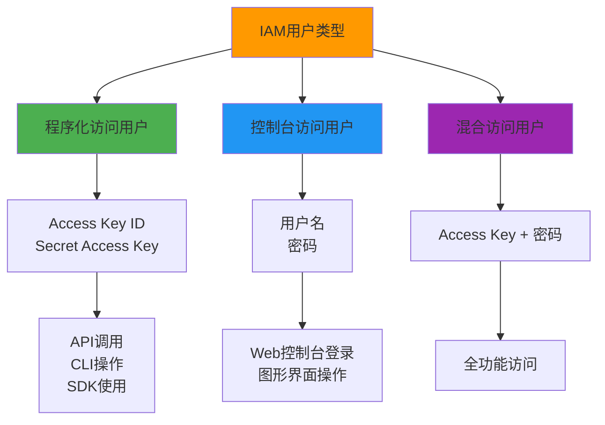
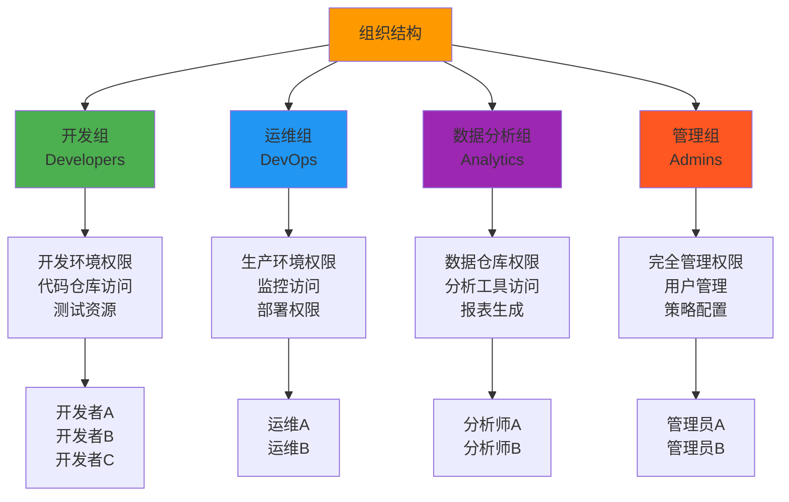

# 第02章：IAM 用户和组管理

::: tip 学习目标
- 创建和管理IAM用户
- 设置用户访问凭证
- 创建和管理用户组
- 实现用户权限的分层管理
- 配置多因素认证(MFA)
:::

## 知识点

### IAM用户类型和用途



### 用户组管理架构



## 示例代码

### IAM用户管理完整示例

```python
import boto3
import json
import secrets
import string
from datetime import datetime
from botocore.exceptions import ClientError

class IAMUserManager:
    """
    IAM用户管理器 - 提供完整的用户生命周期管理
    """
    
    def __init__(self):
        self.iam = boto3.client('iam')
        
    def create_user_with_credentials(self, username, enable_console=True, 
                                   enable_programmatic=True, groups=None):
        """
        创建用户并配置访问凭证
        
        Args:
            username: 用户名
            enable_console: 是否启用控制台访问
            enable_programmatic: 是否启用程序化访问
            groups: 用户组列表
        """
        
        print(f"创建用户: {username}")
        
        try:
            # 1. 创建用户
            user_response = self.iam.create_user(
                UserName=username,
                Tags=[
                    {'Key': 'CreatedBy', 'Value': 'IAMManager'},
                    {'Key': 'CreatedDate', 'Value': datetime.now().isoformat()},
                    {'Key': 'Environment', 'Value': 'Development'}
                ]
            )
            
            user_arn = user_response['User']['Arn']
            print(f"✓ 用户创建成功: {user_arn}")
            
            credentials = {}
            
            # 2. 配置控制台访问
            if enable_console:
                password = self._generate_password()
                self.iam.create_login_profile(
                    UserName=username,
                    Password=password,
                    PasswordResetRequired=True
                )
                credentials['console_password'] = password
                print("✓ 控制台访问已启用")
            
            # 3. 配置程序化访问
            if enable_programmatic:
                access_key_response = self.iam.create_access_key(UserName=username)
                access_key = access_key_response['AccessKey']
                
                credentials['access_key_id'] = access_key['AccessKeyId']
                credentials['secret_access_key'] = access_key['SecretAccessKey']
                print("✓ 程序化访问已启用")
            
            # 4. 加入用户组
            if groups:
                for group_name in groups:
                    try:
                        self.iam.add_user_to_group(
                            GroupName=group_name,
                            UserName=username
                        )
                        print(f"✓ 用户已加入组: {group_name}")
                    except ClientError as e:
                        if e.response['Error']['Code'] == 'NoSuchEntity':
                            print(f"⚠️ 组不存在，将创建组: {group_name}")
                            self.create_group(group_name)
                            self.iam.add_user_to_group(
                                GroupName=group_name,
                                UserName=username
                            )
                            print(f"✓ 用户已加入新创建的组: {group_name}")
                        else:
                            print(f"❌ 加入组失败: {e}")
            
            return credentials
            
        except ClientError as e:
            if e.response['Error']['Code'] == 'EntityAlreadyExists':
                print(f"❌ 用户 {username} 已存在")
            else:
                print(f"❌ 创建用户失败: {e}")
            return None
    
    def create_group(self, group_name, description="", policies=None):
        """
        创建用户组并附加策略
        
        Args:
            group_name: 组名
            description: 组描述
            policies: 要附加的策略ARN列表
        """
        
        print(f"创建用户组: {group_name}")
        
        try:
            # 创建组
            response = self.iam.create_group(
                GroupName=group_name,
                Path='/departments/'
            )
            
            group_arn = response['Group']['Arn']
            print(f"✓ 组创建成功: {group_arn}")
            
            # 附加策略
            if policies:
                for policy_arn in policies:
                    try:
                        self.iam.attach_group_policy(
                            GroupName=group_name,
                            PolicyArn=policy_arn
                        )
                        print(f"✓ 策略已附加: {policy_arn}")
                    except ClientError as e:
                        print(f"❌ 附加策略失败 {policy_arn}: {e}")
            
            return group_arn
            
        except ClientError as e:
            if e.response['Error']['Code'] == 'EntityAlreadyExists':
                print(f"❌ 组 {group_name} 已存在")
            else:
                print(f"❌ 创建组失败: {e}")
            return None
    
    def setup_mfa_for_user(self, username, device_name="default"):
        """
        为用户设置MFA设备
        
        Args:
            username: 用户名
            device_name: MFA设备名称
        """
        
        print(f"为用户 {username} 设置MFA")
        
        try:
            # 创建虚拟MFA设备
            response = self.iam.create_virtual_mfa_device(
                VirtualMFADeviceName=f"{username}-{device_name}",
                Tags=[
                    {'Key': 'Owner', 'Value': username},
                    {'Key': 'CreatedDate', 'Value': datetime.now().isoformat()}
                ]
            )
            
            mfa_device = response['VirtualMFADevice']
            serial_number = mfa_device['SerialNumber']
            qr_code_png = mfa_device['QRCodePNG']
            
            print(f"✓ MFA设备创建成功")
            print(f"  设备序列号: {serial_number}")
            print(f"  二维码数据长度: {len(qr_code_png)} bytes")
            
            # 注意：在实际应用中，需要将QR码显示给用户扫描
            # 然后获取两个连续的TOTP代码来激活设备
            
            print("📱 请使用MFA应用扫描二维码，然后调用 enable_mfa_device 方法")
            
            return {
                'serial_number': serial_number,
                'qr_code_png': qr_code_png
            }
            
        except ClientError as e:
            print(f"❌ 创建MFA设备失败: {e}")
            return None
    
    def enable_mfa_device(self, username, serial_number, auth_code1, auth_code2):
        """
        启用MFA设备
        
        Args:
            username: 用户名
            serial_number: MFA设备序列号
            auth_code1: 第一个认证码
            auth_code2: 第二个认证码
        """
        
        try:
            self.iam.enable_mfa_device(
                UserName=username,
                SerialNumber=serial_number,
                AuthenticationCode1=auth_code1,
                AuthenticationCode2=auth_code2
            )
            
            print(f"✓ MFA设备已启用: {serial_number}")
            return True
            
        except ClientError as e:
            print(f"❌ 启用MFA设备失败: {e}")
            return False
    
    def rotate_access_keys(self, username):
        """
        轮换用户访问密钥
        
        Args:
            username: 用户名
        """
        
        print(f"轮换用户 {username} 的访问密钥")
        
        try:
            # 1. 获取现有访问密钥
            current_keys = self.iam.list_access_keys(UserName=username)
            
            if len(current_keys['AccessKeyMetadata']) >= 2:
                print("❌ 用户已有2个访问密钥，无法创建更多")
                return None
            
            # 2. 创建新的访问密钥
            new_key_response = self.iam.create_access_key(UserName=username)
            new_key = new_key_response['AccessKey']
            
            print(f"✓ 新访问密钥创建成功: {new_key['AccessKeyId']}")
            print(f"📋 新密钥信息:")
            print(f"   Access Key ID: {new_key['AccessKeyId']}")
            print(f"   Secret Access Key: {new_key['SecretAccessKey']}")
            
            # 3. 提示用户更新应用程序配置
            print("⚠️ 请更新应用程序配置使用新的访问密钥")
            print("⚠️ 确认新密钥工作正常后，请调用 delete_old_access_key 方法删除旧密钥")
            
            return new_key
            
        except ClientError as e:
            print(f"❌ 轮换访问密钥失败: {e}")
            return None
    
    def delete_access_key(self, username, access_key_id):
        """
        删除指定的访问密钥
        
        Args:
            username: 用户名
            access_key_id: 要删除的访问密钥ID
        """
        
        try:
            self.iam.delete_access_key(
                UserName=username,
                AccessKeyId=access_key_id
            )
            
            print(f"✓ 访问密钥已删除: {access_key_id}")
            return True
            
        except ClientError as e:
            print(f"❌ 删除访问密钥失败: {e}")
            return False
    
    def get_user_summary(self, username):
        """
        获取用户详细信息摘要
        
        Args:
            username: 用户名
        """
        
        print(f"获取用户 {username} 的详细信息")
        
        try:
            summary = {}
            
            # 基本用户信息
            user = self.iam.get_user(UserName=username)
            summary['user'] = {
                'username': user['User']['UserName'],
                'arn': user['User']['Arn'],
                'user_id': user['User']['UserId'],
                'create_date': user['User']['CreateDate'].isoformat(),
                'tags': user['User'].get('Tags', [])
            }
            
            # 登录配置文件
            try:
                login_profile = self.iam.get_login_profile(UserName=username)
                summary['console_access'] = {
                    'enabled': True,
                    'password_reset_required': login_profile['LoginProfile']['PasswordResetRequired'],
                    'create_date': login_profile['LoginProfile']['CreateDate'].isoformat()
                }
            except ClientError as e:
                if e.response['Error']['Code'] == 'NoSuchEntity':
                    summary['console_access'] = {'enabled': False}
            
            # 访问密钥
            access_keys = self.iam.list_access_keys(UserName=username)
            summary['access_keys'] = []
            for key in access_keys['AccessKeyMetadata']:
                summary['access_keys'].append({
                    'access_key_id': key['AccessKeyId'],
                    'status': key['Status'],
                    'create_date': key['CreateDate'].isoformat()
                })
            
            # 用户组
            groups = self.iam.get_groups_for_user(UserName=username)
            summary['groups'] = [group['GroupName'] for group in groups['Groups']]\n            \n            # 直接附加的策略\n            attached_policies = self.iam.list_attached_user_policies(UserName=username)\n            summary['attached_policies'] = [\n                policy['PolicyName'] for policy in attached_policies['AttachedPolicies']\n            ]\n            \n            # 内联策略\n            inline_policies = self.iam.list_user_policies(UserName=username)\n            summary['inline_policies'] = inline_policies['PolicyNames']\n            \n            # MFA设备\n            mfa_devices = self.iam.list_mfa_devices(UserName=username)\n            summary['mfa_devices'] = [\n                device['SerialNumber'] for device in mfa_devices['MFADevices']\n            ]\n            \n            return summary\n            \n        except ClientError as e:\n            print(f"❌ 获取用户信息失败: {e}")\n            return None\n    \n    def _generate_password(self, length=12):\n        """\n        生成安全密码\n        \n        Args:\n            length: 密码长度\n        """\n        \n        # 确保密码包含各种字符类型\n        password_chars = (\n            string.ascii_lowercase +\n            string.ascii_uppercase + \n            string.digits +\n            "!@#$%^&*()"\n        )\n        \n        password = ''.join(secrets.choice(password_chars) for _ in range(length))\n        \n        # 确保至少包含一个数字、大写字母、小写字母和符号\n        if (not any(c.islower() for c in password) or\n            not any(c.isupper() for c in password) or\n            not any(c.isdigit() for c in password) or\n            not any(c in "!@#$%^&*()" for c in password)):\n            return self._generate_password(length)\n        \n        return password\n\n# 使用示例\ndef demo_user_management():\n    """\n    用户管理演示\n    """\n    \n    manager = IAMUserManager()\n    \n    # 1. 创建开发组\n    dev_policies = [\n        'arn:aws:iam::aws:policy/PowerUserAccess',  # 开发环境权限\n    ]\n    manager.create_group('developers', 'Development team', dev_policies)\n    \n    # 2. 创建用户\n    credentials = manager.create_user_with_credentials(\n        username='john.developer',\n        enable_console=True,\n        enable_programmatic=True,\n        groups=['developers']\n    )\n    \n    if credentials:\n        print("\\n🔐 用户凭证:")\n        if 'console_password' in credentials:\n            print(f"   控制台密码: {credentials['console_password']}")\n        if 'access_key_id' in credentials:\n            print(f"   Access Key ID: {credentials['access_key_id']}")\n            print(f"   Secret Access Key: {credentials['secret_access_key'][:8]}...")\n    \n    # 3. 设置MFA\n    mfa_info = manager.setup_mfa_for_user('john.developer')\n    \n    # 4. 获取用户摘要\n    summary = manager.get_user_summary('john.developer')\n    if summary:\n        print("\\n📋 用户摘要:")\n        print(json.dumps(summary, indent=2, default=str))\n\n# 群组管理示例\ndef setup_organizational_groups():\n    """\n    设置组织化的用户组结构\n    """\n    \n    manager = IAMUserManager()\n    \n    # 定义组织结构和权限\n    groups_config = {\n        'administrators': {\n            'description': 'System administrators with full access',\n            'policies': [\n                'arn:aws:iam::aws:policy/AdministratorAccess'\n            ]\n        },\n        'developers': {\n            'description': 'Application developers',\n            'policies': [\n                'arn:aws:iam::aws:policy/PowerUserAccess'\n            ]\n        },\n        'devops': {\n            'description': 'DevOps engineers',\n            'policies': [\n                'arn:aws:iam::aws:policy/job-function/SystemAdministrator'\n            ]\n        },\n        'analysts': {\n            'description': 'Data analysts',\n            'policies': [\n                'arn:aws:iam::aws:policy/job-function/DataScientist'\n            ]\n        },\n        'readonly': {\n            'description': 'Read-only access users',\n            'policies': [\n                'arn:aws:iam::aws:policy/ReadOnlyAccess'\n            ]\n        }\n    }\n    \n    # 创建所有组\n    for group_name, config in groups_config.items():\n        manager.create_group(\n            group_name=group_name,\n            description=config['description'],\n            policies=config['policies']\n        )\n        print(f"✓ 组 {group_name} 设置完成")\n    \n    print("\\n🏢 组织结构设置完成!")\n\nif __name__ == "__main__":\n    print("IAM用户和组管理演示")\n    print("=" * 50)\n    \n    # 运行演示\n    setup_organizational_groups()\n    demo_user_management()\n```\n\n### 密码策略配置\n\n```python\nimport boto3\nfrom botocore.exceptions import ClientError\n\ndef configure_password_policy():\n    """\n    配置账户密码策略\n    """\n    \n    iam = boto3.client('iam')\n    \n    # 定义强密码策略\n    password_policy = {\n        'MinimumPasswordLength': 12,\n        'RequireSymbols': True,\n        'RequireNumbers': True,\n        'RequireUppercaseCharacters': True,\n        'RequireLowercaseCharacters': True,\n        'AllowUsersToChangePassword': True,\n        'MaxPasswordAge': 90,  # 90天过期\n        'PasswordReusePrevention': 5,  # 不能重复使用最近5个密码\n        'HardExpiry': False  # 密码过期后允许继续登录但必须更改\n    }\n    \n    try:\n        iam.update_account_password_policy(**password_policy)\n        print("✓ 账户密码策略已更新")\n        print("策略详情:")\n        for key, value in password_policy.items():\n            print(f"   - {key}: {value}")\n            \n    except ClientError as e:\n        print(f"❌ 设置密码策略失败: {e}")\n\ndef get_password_policy():\n    """\n    获取当前密码策略\n    """\n    \n    iam = boto3.client('iam')\n    \n    try:\n        response = iam.get_account_password_policy()\n        policy = response['PasswordPolicy']\n        \n        print("当前密码策略:")\n        for key, value in policy.items():\n            print(f"   - {key}: {value}")\n            \n        return policy\n        \n    except ClientError as e:\n        if e.response['Error']['Code'] == 'NoSuchEntity':\n            print("⚠️ 未设置自定义密码策略，使用AWS默认策略")\n        else:\n            print(f"❌ 获取密码策略失败: {e}")\n        return None\n\nif __name__ == "__main__":\n    configure_password_policy()\n    get_password_policy()\n```\n\n## 用户生命周期管理\n\n### 用户状态管理流程\n\n```mermaid\nstateDiagram-v2\n    [*] --> 待创建: 申请用户账户\n    待创建 --> 活跃: 创建用户并设置凭证\n    活跃 --> 临时禁用: 违规或安全事件\n    活跃 --> 待删除: 离职申请\n    临时禁用 --> 活跃: 问题解决\n    临时禁用 --> 待删除: 严重违规\n    待删除 --> 已归档: 删除用户但保留记录\n    活跃 --> 凭证轮换: 定期安全维护\n    凭证轮换 --> 活跃: 轮换完成\n    \n    活跃: 正常使用\n    临时禁用: 访问被暂停\n    待删除: 准备清理\n    已归档: 审计记录保留\n```\n\n### 权限管理最佳实践\n\n| 实践 | 说明 | 实施方法 |\n|------|------|----------|\n| **最小权限原则** | 只给予完成工作所需的最少权限 | 使用具体的策略而非管理员权限 |\n| **基于角色的访问** | 通过角色而非用户直接授权 | 创建功能性角色并让用户承担 |\n| **定期权限审查** | 定期检查和清理不需要的权限 | 设置自动化审查流程 |\n| **职责分离** | 关键操作需要多人协作 | 使用MFA和审批流程 |\n| **访问日志记录** | 记录所有访问活动 | 启用CloudTrail和CloudWatch |\n\n::: note MFA配置建议\n- **管理员账户**：必须启用MFA\n- **特权用户**：建议启用MFA  \n- **程序化访问**：使用角色而非长期访问密钥\n- **移动设备**：使用硬件令牌或认证应用\n- **备用设备**：配置多个MFA设备以防丢失\n:::\n\n::: warning 安全注意事项\n- **访问密钥管理**：定期轮换，不要硬编码在代码中\n- **密码安全**：使用强密码，避免重复使用\n- **权限继承**：理解组权限会被用户继承\n- **临时凭证**：优先使用角色和临时凭证\n- **监控异常**：设置异常访问告警\n:::\n\n::: tip 管理技巧\n- 使用标签管理用户和组，便于批量操作\n- 建立命名规范，如用户名格式：firstname.lastname\n- 设置自动化脚本处理常规的用户管理任务\n- 使用IAM条件键实现更细粒度的权限控制\n- 定期生成IAM凭证报告进行安全审计\n:::\n\n<function_calls>\n<invoke name="TodoWrite">\n<parameter name="todos">[{"content": "\u751f\u6210\u7b2c2\u7ae0\uff1aIAM\u7528\u6237\u548c\u7ec4\u7ba1\u7406\u7b14\u8bb0", "status": "completed", "activeForm": "\u6b63\u5728\u751f\u6210\u7b2c2\u7ae0\uff1aIAM\u7528\u6237\u548c\u7ec4\u7ba1\u7406\u7b14\u8bb0"}, {"content": "\u751f\u6210\u7b2c3-12\u7ae0\u5269\u4f59\u7b14\u8bb0", "status": "in_progress", "activeForm": "\u6b63\u5728\u751f\u6210\u7b2c3-12\u7ae0\u5269\u4f59\u7b14\u8bb0"}]