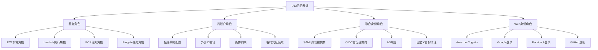
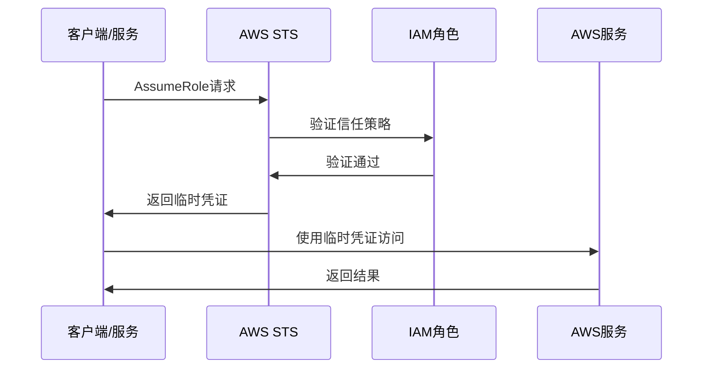

# 第03章：IAM角色深入理解

## 学习目标

1. 理解IAM角色的概念和用途
2. 创建和配置服务角色
3. 设置跨账户角色访问
4. 配置联合身份角色
5. 掌握角色切换和临时凭证

## 角色系统架构图



## 3.1 IAM角色基础概念

### 3.1.1 角色与用户的区别

::: tip 核心差异
| 特征 | IAM用户 | IAM角色 |
|------|---------|---------|
| 身份类型 | 永久身份 | 临时身份 |
| 凭证 | 长期凭证 | 临时凭证 |
| 使用场景 | 人员访问 | 服务间访问 |
| 权限获取 | 直接附加 | 代入获取 |
| 安全性 | 需要密钥管理 | 自动轮换 |
:::

### 3.1.2 角色的工作机制



### 3.1.3 创建基础IAM角色

```python
import boto3
import json
from datetime import datetime, timedelta

def create_basic_role(role_name, trusted_entity, description=""):
    """
    创建基础IAM角色
    
    Args:
        role_name: 角色名称
        trusted_entity: 信任的实体（服务或账户）
        description: 角色描述
    """
    iam = boto3.client('iam')
    
    # 基础信任策略模板
    trust_policy_templates = {
        'ec2': {
            "Version": "2012-10-17",
            "Statement": [
                {
                    "Effect": "Allow",
                    "Principal": {
                        "Service": "ec2.amazonaws.com"
                    },
                    "Action": "sts:AssumeRole"
                }
            ]
        },
        'lambda': {
            "Version": "2012-10-17",
            "Statement": [
                {
                    "Effect": "Allow",
                    "Principal": {
                        "Service": "lambda.amazonaws.com"
                    },
                    "Action": "sts:AssumeRole"
                }
            ]
        },
        'cross-account': {
            "Version": "2012-10-17",
            "Statement": [
                {
                    "Effect": "Allow",
                    "Principal": {
                        "AWS": f"arn:aws:iam::{trusted_entity}:root"
                    },
                    "Action": "sts:AssumeRole"
                }
            ]
        }
    }
    
    try:
        # 选择信任策略
        if trusted_entity in trust_policy_templates:
            trust_policy = trust_policy_templates[trusted_entity]
        elif trusted_entity.startswith('arn:aws:iam::'):
            # 跨账户角色
            trust_policy = {
                "Version": "2012-10-17",
                "Statement": [
                    {
                        "Effect": "Allow",
                        "Principal": {
                            "AWS": trusted_entity
                        },
                        "Action": "sts:AssumeRole"
                    }
                ]
            }
        else:
            # 自定义服务
            trust_policy = {
                "Version": "2012-10-17",
                "Statement": [
                    {
                        "Effect": "Allow",
                        "Principal": {
                            "Service": trusted_entity
                        },
                        "Action": "sts:AssumeRole"
                    }
                ]
            }
        
        # 创建角色
        response = iam.create_role(
            RoleName=role_name,
            AssumeRolePolicyDocument=json.dumps(trust_policy),
            Description=description,
            MaxSessionDuration=3600,  # 1小时
            Tags=[
                {
                    'Key': 'CreatedBy',
                    'Value': 'IAM-Automation'
                },
                {
                    'Key': 'CreatedDate',
                    'Value': datetime.now().strftime('%Y-%m-%d')
                }
            ]
        )
        
        print(f"✅ 角色 {role_name} 创建成功")
        print(f"   ARN: {response['Role']['Arn']}")
        
        return response['Role']
        
    except Exception as e:
        print(f"❌ 创建角色失败: {str(e)}")
        return None

# 创建不同类型的角色示例
ec2_role = create_basic_role("EC2-S3-Access-Role", "ec2", "EC2实例访问S3的角色")
lambda_role = create_basic_role("Lambda-Execution-Role", "lambda", "Lambda函数执行角色")
```

## 3.2 服务角色详解

### 3.2.1 EC2实例角色

```python
def create_ec2_instance_role():
    """
    创建EC2实例角色和实例配置文件
    """
    iam = boto3.client('iam')
    
    # 1. 创建角色
    trust_policy = {
        "Version": "2012-10-17",
        "Statement": [
            {
                "Effect": "Allow",
                "Principal": {
                    "Service": "ec2.amazonaws.com"
                },
                "Action": "sts:AssumeRole"
            }
        ]
    }
    
    try:
        # 创建角色
        role_response = iam.create_role(
            RoleName='EC2-WebServer-Role',
            AssumeRolePolicyDocument=json.dumps(trust_policy),
            Description='Role for EC2 web servers with S3 and CloudWatch access'
        )
        
        role_arn = role_response['Role']['Arn']
        print(f"✅ EC2角色创建成功: {role_arn}")
        
        # 2. 附加AWS管理策略
        managed_policies = [
            'arn:aws:iam::aws:policy/AmazonS3ReadOnlyAccess',
            'arn:aws:iam::aws:policy/CloudWatchAgentServerPolicy'
        ]
        
        for policy_arn in managed_policies:
            iam.attach_role_policy(
                RoleName='EC2-WebServer-Role',
                PolicyArn=policy_arn
            )
            print(f"✅ 已附加策略: {policy_arn}")
        
        # 3. 创建自定义策略
        custom_policy = {
            "Version": "2012-10-17",
            "Statement": [
                {
                    "Effect": "Allow",
                    "Action": [
                        "s3:PutObject",
                        "s3:PutObjectAcl"
                    ],
                    "Resource": "arn:aws:s3:::my-web-logs/*"
                },
                {
                    "Effect": "Allow",
                    "Action": [
                        "ssm:GetParameter",
                        "ssm:GetParameters",
                        "ssm:GetParametersByPath"
                    ],
                    "Resource": "arn:aws:ssm:*:*:parameter/webserver/*"
                }
            ]
        }
        
        policy_response = iam.create_policy(
            PolicyName='EC2-WebServer-CustomPolicy',
            PolicyDocument=json.dumps(custom_policy),
            Description='Custom policy for web server specific permissions'
        )
        
        # 附加自定义策略
        iam.attach_role_policy(
            RoleName='EC2-WebServer-Role',
            PolicyArn=policy_response['Policy']['Arn']
        )
        
        # 4. 创建实例配置文件
        iam.create_instance_profile(
            InstanceProfileName='EC2-WebServer-Profile'
        )
        
        # 5. 将角色添加到实例配置文件
        iam.add_role_to_instance_profile(
            InstanceProfileName='EC2-WebServer-Profile',
            RoleName='EC2-WebServer-Role'
        )
        
        print("✅ EC2实例配置文件创建完成")
        
        # 6. 启动EC2实例时使用角色的示例
        ec2_launch_example = """
        # 在启动EC2实例时指定实例配置文件
        import boto3
        
        ec2 = boto3.client('ec2')
        
        response = ec2.run_instances(
            ImageId='ami-0abcdef1234567890',
            MinCount=1,
            MaxCount=1,
            InstanceType='t3.micro',
            IamInstanceProfile={
                'Name': 'EC2-WebServer-Profile'
            },
            SecurityGroupIds=['sg-12345678'],
            SubnetId='subnet-12345678'
        )
        """
        
        print("📝 EC2实例启动示例代码:")
        print(ec2_launch_example)
        
        return role_arn
        
    except Exception as e:
        print(f"❌ 创建EC2角色失败: {str(e)}")
        return None

# 测试EC2实例角色中的权限
def test_ec2_role_permissions():
    """
    在EC2实例中测试角色权限的示例代码
    """
    test_code = """
    # 这段代码应该在EC2实例中运行
    import boto3
    
    # EC2实例会自动使用附加的IAM角色
    s3 = boto3.client('s3')
    ssm = boto3.client('ssm')
    
    try:
        # 测试S3读取权限
        buckets = s3.list_buckets()
        print(f"✅ S3访问成功，找到 {len(buckets['Buckets'])} 个存储桶")
        
        # 测试SSM参数访问
        parameters = ssm.get_parameters_by_path(
            Path='/webserver/',
            Recursive=True
        )
        print(f"✅ SSM参数访问成功，找到 {len(parameters['Parameters'])} 个参数")
        
        # 测试上传日志到S3
        s3.put_object(
            Bucket='my-web-logs',
            Key=f'access-logs/{datetime.now().strftime("%Y/%m/%d")}/access.log',
            Body='示例日志内容'
        )
        print("✅ 日志上传到S3成功")
        
    except Exception as e:
        print(f"❌ 权限测试失败: {str(e)}")
    """
    
    print("📝 EC2实例内权限测试代码:")
    print(test_code)

create_ec2_instance_role()
test_ec2_role_permissions()
```

### 3.2.2 Lambda执行角色

```python
def create_lambda_execution_role(function_name, additional_permissions=None):
    """
    创建Lambda函数执行角色
    
    Args:
        function_name: Lambda函数名称
        additional_permissions: 额外的权限列表
    """
    iam = boto3.client('iam')
    
    role_name = f"Lambda-{function_name}-ExecutionRole"
    
    # Lambda基础信任策略
    trust_policy = {
        "Version": "2012-10-17",
        "Statement": [
            {
                "Effect": "Allow",
                "Principal": {
                    "Service": "lambda.amazonaws.com"
                },
                "Action": "sts:AssumeRole"
            }
        ]
    }
    
    try:
        # 1. 创建角色
        role_response = iam.create_role(
            RoleName=role_name,
            AssumeRolePolicyDocument=json.dumps(trust_policy),
            Description=f'Execution role for Lambda function {function_name}'
        )
        
        role_arn = role_response['Role']['Arn']
        print(f"✅ Lambda执行角色创建成功: {role_arn}")
        
        # 2. 附加基础Lambda执行策略
        iam.attach_role_policy(
            RoleName=role_name,
            PolicyArn='arn:aws:iam::aws:policy/service-role/AWSLambdaBasicExecutionRole'
        )
        
        # 3. 根据需要附加额外权限
        if additional_permissions:
            # 创建自定义策略
            custom_policy = {
                "Version": "2012-10-17",
                "Statement": additional_permissions
            }
            
            policy_response = iam.create_policy(
                PolicyName=f'Lambda-{function_name}-CustomPolicy',
                PolicyDocument=json.dumps(custom_policy),
                Description=f'Custom permissions for Lambda function {function_name}'
            )
            
            # 附加自定义策略
            iam.attach_role_policy(
                RoleName=role_name,
                PolicyArn=policy_response['Policy']['Arn']
            )
            
            print(f"✅ 自定义策略已附加")
        
        return role_arn
        
    except Exception as e:
        print(f"❌ 创建Lambda角色失败: {str(e)}")
        return None

# 创建不同场景的Lambda角色
def create_specialized_lambda_roles():
    """
    创建特定场景的Lambda角色
    """
    
    # 1. S3处理Lambda角色
    s3_permissions = [
        {
            "Effect": "Allow",
            "Action": [
                "s3:GetObject",
                "s3:PutObject",
                "s3:DeleteObject"
            ],
            "Resource": "arn:aws:s3:::my-lambda-bucket/*"
        },
        {
            "Effect": "Allow",
            "Action": [
                "s3:ListBucket"
            ],
            "Resource": "arn:aws:s3:::my-lambda-bucket"
        }
    ]
    
    s3_role = create_lambda_execution_role("S3Processor", s3_permissions)
    
    # 2. DynamoDB处理Lambda角色
    dynamodb_permissions = [
        {
            "Effect": "Allow",
            "Action": [
                "dynamodb:GetItem",
                "dynamodb:PutItem",
                "dynamodb:UpdateItem",
                "dynamodb:DeleteItem",
                "dynamodb:Query",
                "dynamodb:Scan"
            ],
            "Resource": "arn:aws:dynamodb:*:*:table/MyTable*"
        }
    ]
    
    dynamodb_role = create_lambda_execution_role("DynamoDBProcessor", dynamodb_permissions)
    
    # 3. SNS/SQS处理Lambda角色
    messaging_permissions = [
        {
            "Effect": "Allow",
            "Action": [
                "sns:Publish"
            ],
            "Resource": "arn:aws:sns:*:*:MyTopic"
        },
        {
            "Effect": "Allow",
            "Action": [
                "sqs:ReceiveMessage",
                "sqs:DeleteMessage",
                "sqs:GetQueueAttributes",
                "sqs:SendMessage"
            ],
            "Resource": "arn:aws:sqs:*:*:MyQueue"
        }
    ]
    
    messaging_role = create_lambda_execution_role("MessagingProcessor", messaging_permissions)
    
    print("\n📋 Lambda角色创建汇总:")
    print(f"  S3处理角色: {s3_role}")
    print(f"  DynamoDB处理角色: {dynamodb_role}")
    print(f"  消息处理角色: {messaging_role}")

create_specialized_lambda_roles()
```

## 3.3 跨账户角色访问

### 3.3.1 设置跨账户角色

```python
def create_cross_account_role(trusted_account_id, role_name, external_id=None):
    """
    创建跨账户访问角色
    
    Args:
        trusted_account_id: 受信任的AWS账户ID
        role_name: 角色名称
        external_id: 外部ID（可选，增强安全性）
    """
    iam = boto3.client('iam')
    
    # 构建信任策略
    trust_statement = {
        "Effect": "Allow",
        "Principal": {
            "AWS": f"arn:aws:iam::{trusted_account_id}:root"
        },
        "Action": "sts:AssumeRole"
    }
    
    # 如果提供了外部ID，添加条件
    if external_id:
        trust_statement["Condition"] = {
            "StringEquals": {
                "sts:ExternalId": external_id
            }
        }
    
    trust_policy = {
        "Version": "2012-10-17",
        "Statement": [trust_statement]
    }
    
    try:
        # 创建跨账户角色
        role_response = iam.create_role(
            RoleName=role_name,
            AssumeRolePolicyDocument=json.dumps(trust_policy),
            Description=f'Cross-account role for account {trusted_account_id}',
            MaxSessionDuration=3600,
            Tags=[
                {
                    'Key': 'Type',
                    'Value': 'CrossAccount'
                },
                {
                    'Key': 'TrustedAccount',
                    'Value': trusted_account_id
                }
            ]
        )
        
        role_arn = role_response['Role']['Arn']
        print(f"✅ 跨账户角色创建成功: {role_arn}")
        
        # 附加示例权限策略
        cross_account_policy = {
            "Version": "2012-10-17",
            "Statement": [
                {
                    "Effect": "Allow",
                    "Action": [
                        "s3:ListBucket",
                        "s3:GetObject"
                    ],
                    "Resource": [
                        "arn:aws:s3:::shared-data-bucket",
                        "arn:aws:s3:::shared-data-bucket/*"
                    ]
                },
                {
                    "Effect": "Allow",
                    "Action": [
                        "ec2:DescribeInstances",
                        "ec2:DescribeSecurityGroups"
                    ],
                    "Resource": "*"
                }
            ]
        }
        
        # 创建并附加策略
        policy_response = iam.create_policy(
            PolicyName=f'{role_name}-Policy',
            PolicyDocument=json.dumps(cross_account_policy),
            Description=f'Policy for cross-account role {role_name}'
        )
        
        iam.attach_role_policy(
            RoleName=role_name,
            PolicyArn=policy_response['Policy']['Arn']
        )
        
        print(f"✅ 跨账户策略已附加")
        
        # 提供使用说明
        usage_info = f"""
        📝 跨账户角色使用说明:
        
        1. 角色ARN: {role_arn}
        2. 外部ID: {external_id if external_id else '无'}
        3. 受信任账户: {trusted_account_id}
        
        在受信任账户中使用此角色:
        
        import boto3
        
        sts = boto3.client('sts')
        
        # 代入角色
        response = sts.assume_role(
            RoleArn='{role_arn}',
            RoleSessionName='CrossAccountSession'{external_id_param}
        )
        
        # 使用临时凭证
        credentials = response['Credentials']
        
        s3 = boto3.client(
            's3',
            aws_access_key_id=credentials['AccessKeyId'],
            aws_secret_access_key=credentials['SecretAccessKey'],
            aws_session_token=credentials['SessionToken']
        )
        """
        
        external_id_param = f",\n            ExternalId='{external_id}'" if external_id else ""
        
        print(usage_info.format(
            role_arn=role_arn,
            external_id_param=external_id_param
        ))
        
        return role_arn
        
    except Exception as e:
        print(f"❌ 创建跨账户角色失败: {str(e)}")
        return None

def assume_cross_account_role(role_arn, session_name, external_id=None, duration=3600):
    """
    代入跨账户角色
    
    Args:
        role_arn: 角色ARN
        session_name: 会话名称
        external_id: 外部ID
        duration: 会话持续时间（秒）
    """
    sts = boto3.client('sts')
    
    try:
        # 构建AssumeRole参数
        assume_role_params = {
            'RoleArn': role_arn,
            'RoleSessionName': session_name,
            'DurationSeconds': duration
        }
        
        if external_id:
            assume_role_params['ExternalId'] = external_id
        
        # 代入角色
        response = sts.assume_role(**assume_role_params)
        
        credentials = response['Credentials']
        assumed_role_user = response['AssumedRoleUser']
        
        print(f"✅ 成功代入角色")
        print(f"   用户ARN: {assumed_role_user['Arn']}")
        print(f"   凭证过期时间: {credentials['Expiration']}")
        
        # 创建使用临时凭证的客户端示例
        temp_session = boto3.Session(
            aws_access_key_id=credentials['AccessKeyId'],
            aws_secret_access_key=credentials['SecretAccessKey'],
            aws_session_token=credentials['SessionToken']
        )
        
        # 测试权限
        s3_client = temp_session.client('s3')
        try:
            buckets = s3_client.list_buckets()
            print(f"✅ S3访问测试成功，可访问 {len(buckets['Buckets'])} 个存储桶")
        except Exception as e:
            print(f"⚠️ S3访问测试失败: {str(e)}")
        
        return temp_session
        
    except Exception as e:
        print(f"❌ 代入角色失败: {str(e)}")
        return None

# 创建跨账户角色示例
cross_account_role = create_cross_account_role(
    trusted_account_id="123456789012",
    role_name="CrossAccount-DataAccess-Role",
    external_id="unique-external-id-12345"
)
```

### 3.3.2 高级跨账户角色配置

```python
def create_advanced_cross_account_role():
    """
    创建具有高级安全配置的跨账户角色
    """
    iam = boto3.client('iam')
    
    # 高级信任策略，包含多种安全条件
    trust_policy = {
        "Version": "2012-10-17",
        "Statement": [
            {
                "Effect": "Allow",
                "Principal": {
                    "AWS": "arn:aws:iam::123456789012:root"
                },
                "Action": "sts:AssumeRole",
                "Condition": {
                    "StringEquals": {
                        "sts:ExternalId": "secure-external-id-2024"
                    },
                    "IpAddress": {
                        "aws:SourceIp": [
                            "203.0.113.0/24",  # 允许的IP范围
                            "198.51.100.0/24"
                        ]
                    },
                    "DateGreaterThan": {
                        "aws:CurrentTime": "2024-01-01T00:00:00Z"
                    },
                    "DateLessThan": {
                        "aws:CurrentTime": "2024-12-31T23:59:59Z"
                    },
                    "StringLike": {
                        "aws:userid": "AIDACKCEVSQ6C2EXAMPLE:*"  # 特定用户ID模式
                    }
                }
            },
            {
                "Effect": "Allow",
                "Principal": {
                    "AWS": [
                        "arn:aws:iam::123456789012:user/TrustedUser1",
                        "arn:aws:iam::123456789012:user/TrustedUser2"
                    ]
                },
                "Action": "sts:AssumeRole",
                "Condition": {
                    "Bool": {
                        "aws:MultiFactorAuthPresent": "true"
                    },
                    "NumericLessThan": {
                        "aws:MultiFactorAuthAge": "3600"  # MFA必须在1小时内
                    }
                }
            }
        ]
    }
    
    try:
        # 创建角色
        role_response = iam.create_role(
            RoleName='SecureCrossAccount-Role',
            AssumeRolePolicyDocument=json.dumps(trust_policy),
            Description='Secure cross-account role with advanced conditions',
            MaxSessionDuration=3600,  # 最大会话时间1小时
            Tags=[
                {'Key': 'SecurityLevel', 'Value': 'High'},
                {'Key': 'Purpose', 'Value': 'SecureCrossAccountAccess'}
            ]
        )
        
        print(f"✅ 高级跨账户角色创建成功")
        
        # 创建分层权限策略
        policies = {
            'ReadOnlyPolicy': {
                "Version": "2012-10-17",
                "Statement": [
                    {
                        "Effect": "Allow",
                        "Action": [
                            "s3:GetObject",
                            "s3:ListBucket",
                            "ec2:Describe*",
                            "rds:Describe*"
                        ],
                        "Resource": "*"
                    }
                ]
            },
            'LimitedWritePolicy': {
                "Version": "2012-10-17",
                "Statement": [
                    {
                        "Effect": "Allow",
                        "Action": [
                            "s3:PutObject"
                        ],
                        "Resource": "arn:aws:s3:::shared-data/*",
                        "Condition": {
                            "StringEquals": {
                                "s3:x-amz-server-side-encryption": "AES256"
                            }
                        }
                    }
                ]
            }
        }
        
        # 创建并附加策略
        for policy_name, policy_doc in policies.items():
            policy_response = iam.create_policy(
                PolicyName=f'SecureCrossAccount-{policy_name}',
                PolicyDocument=json.dumps(policy_doc),
                Description=f'Secure cross-account {policy_name.lower()}'
            )
            
            iam.attach_role_policy(
                RoleName='SecureCrossAccount-Role',
                PolicyArn=policy_response['Policy']['Arn']
            )
            
            print(f"✅ 策略 {policy_name} 已附加")
        
        return role_response['Role']['Arn']
        
    except Exception as e:
        print(f"❌ 创建高级跨账户角色失败: {str(e)}")
        return None

# 创建监控跨账户角色使用的函数
def monitor_cross_account_role_usage():
    """
    监控跨账户角色的使用情况
    """
    cloudtrail = boto3.client('cloudtrail')
    
    try:
        # 查询AssumeRole事件
        response = cloudtrail.lookup_events(
            LookupAttributes=[
                {
                    'AttributeKey': 'EventName',
                    'AttributeValue': 'AssumeRole'
                }
            ],
            StartTime=datetime.now() - timedelta(days=7),  # 最近7天
            EndTime=datetime.now()
        )
        
        print("🔍 跨账户角色使用监控报告")
        print("=" * 50)
        
        assume_role_events = []
        for event in response['Events']:
            if 'AssumeRole' in event['EventName']:
                assume_role_events.append({
                    'time': event['EventTime'],
                    'user': event.get('Username', 'Unknown'),
                    'source_ip': event.get('SourceIPAddress', 'Unknown'),
                    'resources': event.get('Resources', [])
                })
        
        print(f"📊 总AssumeRole事件数: {len(assume_role_events)}")
        
        # 按用户分组统计
        user_stats = {}
        for event in assume_role_events:
            user = event['user']
            if user not in user_stats:
                user_stats[user] = {'count': 0, 'last_access': None}
            user_stats[user]['count'] += 1
            if not user_stats[user]['last_access'] or event['time'] > user_stats[user]['last_access']:
                user_stats[user]['last_access'] = event['time']
        
        print("\n👤 用户使用统计:")
        for user, stats in user_stats.items():
            print(f"  {user}: {stats['count']} 次, 最后访问: {stats['last_access']}")
        
        return assume_role_events
        
    except Exception as e:
        print(f"❌ 监控查询失败: {str(e)}")
        return []

# 执行高级配置
advanced_role_arn = create_advanced_cross_account_role()
usage_events = monitor_cross_account_role_usage()
```

## 3.4 联合身份角色

### 3.4.1 SAML 2.0联合身份

```python
def create_saml_identity_provider(provider_name, metadata_document):
    """
    创建SAML 2.0身份提供商
    
    Args:
        provider_name: 身份提供商名称
        metadata_document: SAML元数据文档
    """
    iam = boto3.client('iam')
    
    try:
        # 创建SAML身份提供商
        response = iam.create_saml_provider(
            SAMLMetadataDocument=metadata_document,
            Name=provider_name,
            Tags=[
                {'Key': 'Type', 'Value': 'SAML'},
                {'Key': 'Purpose', 'Value': 'Federation'}
            ]
        )
        
        provider_arn = response['SAMLProviderArn']
        print(f"✅ SAML身份提供商创建成功: {provider_arn}")
        
        return provider_arn
        
    except Exception as e:
        print(f"❌ 创建SAML身份提供商失败: {str(e)}")
        return None

def create_saml_federated_role(provider_arn, role_name):
    """
    创建SAML联合身份角色
    
    Args:
        provider_arn: SAML身份提供商ARN
        role_name: 角色名称
    """
    iam = boto3.client('iam')
    
    # SAML联合身份信任策略
    trust_policy = {
        "Version": "2012-10-17",
        "Statement": [
            {
                "Effect": "Allow",
                "Principal": {
                    "Federated": provider_arn
                },
                "Action": "sts:AssumeRoleWithSAML",
                "Condition": {
                    "StringEquals": {
                        "SAML:aud": "https://signin.aws.amazon.com/saml"
                    }
                }
            }
        ]
    }
    
    try:
        # 创建联合身份角色
        role_response = iam.create_role(
            RoleName=role_name,
            AssumeRolePolicyDocument=json.dumps(trust_policy),
            Description='SAML federated role for enterprise users'
        )
        
        role_arn = role_response['Role']['Arn']
        print(f"✅ SAML联合身份角色创建成功: {role_arn}")
        
        # 附加权限策略
        saml_policy = {
            "Version": "2012-10-17",
            "Statement": [
                {
                    "Effect": "Allow",
                    "Action": [
                        "ec2:Describe*",
                        "s3:ListBucket",
                        "s3:GetObject"
                    ],
                    "Resource": "*"
                },
                {
                    "Effect": "Allow",
                    "Action": [
                        "iam:GetUser",
                        "iam:ListMFADevices"
                    ],
                    "Resource": "arn:aws:iam::*:user/${saml:uid}"
                }
            ]
        }
        
        # 创建并附加策略
        policy_response = iam.create_policy(
            PolicyName=f'{role_name}-Policy',
            PolicyDocument=json.dumps(saml_policy),
            Description=f'Policy for SAML federated role {role_name}'
        )
        
        iam.attach_role_policy(
            RoleName=role_name,
            PolicyArn=policy_response['Policy']['Arn']
        )
        
        print(f"✅ SAML联合身份策略已附加")
        
        # 提供集成说明
        integration_guide = f"""
        📝 SAML集成配置指南:
        
        1. 身份提供商ARN: {provider_arn}
        2. 角色ARN: {role_arn}
        
        在IdP中配置以下属性映射:
        - https://aws.amazon.com/SAML/Attributes/Role: {role_arn},{provider_arn}
        - https://aws.amazon.com/SAML/Attributes/RoleSessionName: {{user.email}}
        
        用户登录流程:
        1. 用户在IdP进行身份验证
        2. IdP生成SAML断言
        3. 用户重定向到AWS SAML终端节点
        4. AWS验证断言并提供临时凭证
        """
        
        print(integration_guide)
        
        return role_arn
        
    except Exception as e:
        print(f"❌ 创建SAML联合身份角色失败: {str(e)}")
        return None

# 示例SAML元数据文档（简化版）
saml_metadata = '''<?xml version="1.0" encoding="UTF-8"?>
<md:EntityDescriptor xmlns:md="urn:oasis:names:tc:SAML:2.0:metadata" 
                     entityID="https://example.com/saml">
    <md:IDPSSODescriptor WantAuthnRequestsSigned="false" 
                         protocolSupportEnumeration="urn:oasis:names:tc:SAML:2.0:protocol">
        <md:KeyDescriptor use="signing">
            <ds:KeyInfo xmlns:ds="http://www.w3.org/2000/09/xmldsig#">
                <ds:X509Data>
                    <ds:X509Certificate>
                        <!-- 证书内容 -->
                    </ds:X509Certificate>
                </ds:X509Data>
            </ds:KeyInfo>
        </md:KeyDescriptor>
        <md:SingleSignOnService Binding="urn:oasis:names:tc:SAML:2.0:bindings:HTTP-POST"
                                Location="https://example.com/sso"/>
    </md:IDPSSODescriptor>
</md:EntityDescriptor>'''

# 创建SAML联合身份
# provider_arn = create_saml_identity_provider("CompanySAML", saml_metadata)
# saml_role = create_saml_federated_role(provider_arn, "SAML-FederatedUser-Role")
```

### 3.4.2 OpenID Connect (OIDC) 联合身份

```python
def create_oidc_identity_provider(provider_url, client_ids, thumbprints):
    """
    创建OpenID Connect身份提供商
    
    Args:
        provider_url: OIDC提供商URL
        client_ids: 客户端ID列表
        thumbprints: 证书指纹列表
    """
    iam = boto3.client('iam')
    
    try:
        # 创建OIDC身份提供商
        response = iam.create_open_id_connect_provider(
            Url=provider_url,
            ClientIDList=client_ids,
            ThumbprintList=thumbprints,
            Tags=[
                {'Key': 'Type', 'Value': 'OIDC'},
                {'Key': 'Purpose', 'Value': 'WebIdentityFederation'}
            ]
        )
        
        provider_arn = response['OpenIDConnectProviderArn']
        print(f"✅ OIDC身份提供商创建成功: {provider_arn}")
        
        return provider_arn
        
    except Exception as e:
        print(f"❌ 创建OIDC身份提供商失败: {str(e)}")
        return None

def create_oidc_federated_role(provider_arn, role_name, audience):
    """
    创建OIDC联合身份角色
    
    Args:
        provider_arn: OIDC身份提供商ARN
        role_name: 角色名称
        audience: 受众（通常是客户端ID）
    """
    iam = boto3.client('iam')
    
    # OIDC联合身份信任策略
    trust_policy = {
        "Version": "2012-10-17",
        "Statement": [
            {
                "Effect": "Allow",
                "Principal": {
                    "Federated": provider_arn
                },
                "Action": "sts:AssumeRoleWithWebIdentity",
                "Condition": {
                    "StringEquals": {
                        f"{provider_arn.split('/')[-1]}:aud": audience
                    },
                    "StringLike": {
                        f"{provider_arn.split('/')[-1]}:sub": "*"
                    }
                }
            }
        ]
    }
    
    try:
        # 创建联合身份角色
        role_response = iam.create_role(
            RoleName=role_name,
            AssumeRolePolicyDocument=json.dumps(trust_policy),
            Description='OIDC federated role for web identity federation'
        )
        
        role_arn = role_response['Role']['Arn']
        print(f"✅ OIDC联合身份角色创建成功: {role_arn}")
        
        # 附加权限策略
        oidc_policy = {
            "Version": "2012-10-17",
            "Statement": [
                {
                    "Effect": "Allow",
                    "Action": [
                        "s3:GetObject",
                        "s3:PutObject"
                    ],
                    "Resource": "arn:aws:s3:::user-data-bucket/${www.example.com:sub}/*"
                },
                {
                    "Effect": "Allow",
                    "Action": [
                        "dynamodb:GetItem",
                        "dynamodb:PutItem",
                        "dynamodb:UpdateItem"
                    ],
                    "Resource": "arn:aws:dynamodb:*:*:table/UserProfiles",
                    "Condition": {
                        "ForAllValues:StringEquals": {
                            "dynamodb:Attributes": [
                                "UserId",
                                "ProfileData"
                            ]
                        },
                        "StringEquals": {
                            "dynamodb:LeadingKeys": ["${www.example.com:sub}"]
                        }
                    }
                }
            ]
        }
        
        # 创建并附加策略
        policy_response = iam.create_policy(
            PolicyName=f'{role_name}-Policy',
            PolicyDocument=json.dumps(oidc_policy),
            Description=f'Policy for OIDC federated role {role_name}'
        )
        
        iam.attach_role_policy(
            RoleName=role_name,
            PolicyArn=policy_response['Policy']['Arn']
        )
        
        print(f"✅ OIDC联合身份策略已附加")
        
        return role_arn
        
    except Exception as e:
        print(f"❌ 创建OIDC联合身份角色失败: {str(e)}")
        return None

# GitHub Actions OIDC联合身份示例
def setup_github_actions_oidc():
    """
    设置GitHub Actions的OIDC联合身份
    """
    
    # GitHub的OIDC提供商信息
    github_provider_url = "https://token.actions.githubusercontent.com"
    github_thumbprints = ["6938fd4d98bab03faadb97b34396831e3780aea1"]  # GitHub的证书指纹
    
    # 创建GitHub OIDC提供商
    provider_arn = create_oidc_identity_provider(
        provider_url=github_provider_url,
        client_ids=["sts.amazonaws.com"],
        thumbprints=github_thumbprints
    )
    
    if provider_arn:
        # 创建GitHub Actions角色
        github_role = create_oidc_federated_role(
            provider_arn=provider_arn,
            role_name="GitHubActions-DeploymentRole",
            audience="sts.amazonaws.com"
        )
        
        # 提供GitHub Actions工作流配置示例
        workflow_example = f"""
        # GitHub Actions工作流配置示例
        name: Deploy to AWS
        
        on:
          push:
            branches: [main]
        
        permissions:
          id-token: write
          contents: read
        
        jobs:
          deploy:
            runs-on: ubuntu-latest
            steps:
              - name: Checkout code
                uses: actions/checkout@v3
              
              - name: Configure AWS credentials
                uses: aws-actions/configure-aws-credentials@v2
                with:
                  role-to-assume: {github_role}
                  role-session-name: GitHubActions-Deploy
                  aws-region: us-east-1
              
              - name: Deploy to S3
                run: |
                  aws s3 sync ./dist s3://my-deployment-bucket
        """
        
        print("📝 GitHub Actions工作流配置示例:")
        print(workflow_example)

# 执行GitHub Actions OIDC设置
setup_github_actions_oidc()
```

## 3.5 角色会话和临时凭证

### 3.5.1 管理角色会话

```python
def create_role_session_manager():
    """
    角色会话管理器
    """
    
    class RoleSessionManager:
        def __init__(self):
            self.sts = boto3.client('sts')
            self.active_sessions = {}
        
        def assume_role_with_session_policy(self, role_arn, session_name, 
                                          session_policy=None, duration=3600):
            """
            使用会话策略代入角色
            
            Args:
                role_arn: 角色ARN
                session_name: 会话名称
                session_policy: 会话策略（可选，用于进一步限制权限）
                duration: 会话持续时间
            """
            try:
                assume_role_params = {
                    'RoleArn': role_arn,
                    'RoleSessionName': session_name,
                    'DurationSeconds': duration
                }
                
                # 如果提供了会话策略，添加到参数中
                if session_policy:
                    assume_role_params['Policy'] = json.dumps(session_policy)
                
                response = self.sts.assume_role(**assume_role_params)
                
                credentials = response['Credentials']
                session_info = {
                    'credentials': credentials,
                    'assumed_role_user': response['AssumedRoleUser'],
                    'session_name': session_name,
                    'role_arn': role_arn,
                    'expires_at': credentials['Expiration']
                }
                
                # 存储会话信息
                self.active_sessions[session_name] = session_info
                
                print(f"✅ 角色会话创建成功: {session_name}")
                print(f"   过期时间: {credentials['Expiration']}")
                
                return session_info
                
            except Exception as e:
                print(f"❌ 创建角色会话失败: {str(e)}")
                return None
        
        def get_session_credentials(self, session_name):
            """
            获取会话凭证
            """
            if session_name in self.active_sessions:
                session = self.active_sessions[session_name]
                
                # 检查凭证是否过期
                if datetime.now(session['expires_at'].tzinfo) < session['expires_at']:
                    return session['credentials']
                else:
                    print(f"⚠️ 会话 {session_name} 已过期")
                    del self.active_sessions[session_name]
                    return None
            else:
                print(f"❌ 会话 {session_name} 不存在")
                return None
        
        def create_boto3_session(self, session_name):
            """
            创建使用角色凭证的boto3会话
            """
            credentials = self.get_session_credentials(session_name)
            if credentials:
                return boto3.Session(
                    aws_access_key_id=credentials['AccessKeyId'],
                    aws_secret_access_key=credentials['SecretAccessKey'],
                    aws_session_token=credentials['SessionToken']
                )
            return None
        
        def refresh_session(self, session_name):
            """
            刷新会话凭证
            """
            if session_name in self.active_sessions:
                session_info = self.active_sessions[session_name]
                return self.assume_role_with_session_policy(
                    session_info['role_arn'],
                    session_name
                )
            return None
        
        def list_active_sessions(self):
            """
            列出活跃的会话
            """
            print("📋 活跃的角色会话:")
            for session_name, session_info in self.active_sessions.items():
                expires_at = session_info['expires_at']
                remaining = expires_at - datetime.now(expires_at.tzinfo)
                
                print(f"  {session_name}:")
                print(f"    角色: {session_info['role_arn']}")
                print(f"    过期时间: {expires_at}")
                print(f"    剩余时间: {remaining}")
        
        def cleanup_expired_sessions(self):
            """
            清理过期的会话
            """
            expired_sessions = []
            current_time = datetime.now()
            
            for session_name, session_info in self.active_sessions.items():
                expires_at = session_info['expires_at']
                if current_time.replace(tzinfo=expires_at.tzinfo) >= expires_at:
                    expired_sessions.append(session_name)
            
            for session_name in expired_sessions:
                del self.active_sessions[session_name]
                print(f"🧹 已清理过期会话: {session_name}")
            
            return len(expired_sessions)
    
    return RoleSessionManager()

# 使用示例
session_manager = create_role_session_manager()

# 创建受限制的会话策略
restricted_session_policy = {
    "Version": "2012-10-17",
    "Statement": [
        {
            "Effect": "Allow",
            "Action": [
                "s3:GetObject"
            ],
            "Resource": "arn:aws:s3:::specific-bucket/*"
        },
        {
            "Effect": "Deny",
            "Action": [
                "s3:DeleteObject"
            ],
            "Resource": "*"
        }
    ]
}

# 使用会话策略代入角色
session_info = session_manager.assume_role_with_session_policy(
    role_arn="arn:aws:iam::123456789012:role/MyRole",
    session_name="RestrictedSession",
    session_policy=restricted_session_policy,
    duration=1800  # 30分钟
)

# 创建使用临时凭证的客户端
if session_info:
    temp_session = session_manager.create_boto3_session("RestrictedSession")
    s3_client = temp_session.client('s3')
    
    # 使用受限制的权限访问S3
    try:
        objects = s3_client.list_objects_v2(Bucket='specific-bucket')
        print(f"✅ 可以列出对象，共 {objects.get('KeyCount', 0)} 个")
    except Exception as e:
        print(f"❌ 访问失败: {str(e)}")

# 列出活跃会话
session_manager.list_active_sessions()
```

## 3.6 角色最佳实践和安全考虑

### 3.6.1 角色安全最佳实践

::: tip 安全原则
1. **最小权限原则**: 只授予角色完成任务所需的最小权限
2. **临时凭证**: 优先使用角色而不是长期访问密钥
3. **外部ID**: 在跨账户访问中使用外部ID防止混淆代理攻击
4. **条件约束**: 使用IAM条件限制角色的使用场景
5. **会话时长**: 设置适当的最大会话持续时间
:::

### 3.6.2 角色权限审计

```python
def audit_role_permissions():
    """
    审计IAM角色权限
    """
    iam = boto3.client('iam')
    
    try:
        # 获取所有角色
        paginator = iam.get_paginator('list_roles')
        
        audit_report = {
            'high_risk_roles': [],
            'cross_account_roles': [],
            'service_roles': [],
            'unused_roles': [],
            'roles_without_mfa': []
        }
        
        for page in paginator.paginate():
            for role in page['Roles']:
                role_name = role['RoleName']
                
                print(f"🔍 审计角色: {role_name}")
                
                # 获取角色的信任策略
                trust_policy = json.loads(role['AssumeRolePolicyDocument'])
                
                # 分析信任策略
                for statement in trust_policy.get('Statement', []):
                    principal = statement.get('Principal', {})
                    
                    # 检查跨账户角色
                    if isinstance(principal.get('AWS'), str):
                        if 'arn:aws:iam::' in principal['AWS'] and ':root' in principal['AWS']:
                            audit_report['cross_account_roles'].append({
                                'role_name': role_name,
                                'trusted_account': principal['AWS'],
                                'conditions': statement.get('Condition', {})
                            })
                    
                    # 检查服务角色
                    if 'Service' in principal:
                        audit_report['service_roles'].append({
                            'role_name': role_name,
                            'service': principal['Service']
                        })
                    
                    # 检查MFA要求
                    conditions = statement.get('Condition', {})
                    has_mfa_condition = False
                    for condition_operator, condition_block in conditions.items():
                        if 'aws:MultiFactorAuthPresent' in str(condition_block):
                            has_mfa_condition = True
                            break
                    
                    if not has_mfa_condition and 'AWS' in principal:
                        audit_report['roles_without_mfa'].append(role_name)
                
                # 获取角色的附加策略
                attached_policies = iam.list_attached_role_policies(RoleName=role_name)
                inline_policies = iam.list_role_policies(RoleName=role_name)
                
                # 检查高风险权限
                high_risk_actions = [
                    'iam:*',
                    '*:*',
                    'sts:AssumeRole',
                    's3:DeleteBucket',
                    'ec2:TerminateInstances',
                    'rds:DeleteDBInstance'
                ]
                
                has_high_risk = False
                all_policies = []
                
                # 检查管理策略
                for policy in attached_policies['AttachedPolicies']:
                    policy_version = iam.get_policy_version(
                        PolicyArn=policy['PolicyArn'],
                        VersionId=iam.get_policy(PolicyArn=policy['PolicyArn'])['Policy']['DefaultVersionId']
                    )
                    all_policies.append(policy_version['PolicyVersion']['Document'])
                
                # 检查内联策略
                for policy_name in inline_policies['PolicyNames']:
                    policy_doc = iam.get_role_policy(RoleName=role_name, PolicyName=policy_name)
                    all_policies.append(policy_doc['PolicyDocument'])
                
                # 分析策略内容
                for policy_doc in all_policies:
                    for statement in policy_doc.get('Statement', []):
                        actions = statement.get('Action', [])
                        if isinstance(actions, str):
                            actions = [actions]
                        
                        for action in actions:
                            if any(risk_action in action for risk_action in high_risk_actions):
                                has_high_risk = True
                                break
                        
                        if has_high_risk:
                            break
                    
                    if has_high_risk:
                        break
                
                if has_high_risk:
                    audit_report['high_risk_roles'].append({
                        'role_name': role_name,
                        'last_used': role.get('RoleLastUsed', {}).get('LastUsedDate'),
                        'attached_policies': len(attached_policies['AttachedPolicies']),
                        'inline_policies': len(inline_policies['PolicyNames'])
                    })
                
                # 检查未使用的角色（30天内未使用）
                last_used = role.get('RoleLastUsed', {}).get('LastUsedDate')
                if not last_used or (datetime.now().replace(tzinfo=None) - last_used.replace(tzinfo=None)).days > 30:
                    audit_report['unused_roles'].append({
                        'role_name': role_name,
                        'last_used': last_used,
                        'created_date': role['CreateDate']
                    })
        
        # 生成审计报告
        print("\n📊 IAM角色安全审计报告")
        print("=" * 50)
        
        print(f"\n⚠️ 高风险角色 ({len(audit_report['high_risk_roles'])}):")
        for role_info in audit_report['high_risk_roles']:
            print(f"  - {role_info['role_name']} (最后使用: {role_info['last_used']})")
        
        print(f"\n🔗 跨账户角色 ({len(audit_report['cross_account_roles'])}):")
        for role_info in audit_report['cross_account_roles']:
            print(f"  - {role_info['role_name']} -> {role_info['trusted_account']}")
        
        print(f"\n🤖 服务角色 ({len(audit_report['service_roles'])}):")
        for role_info in audit_report['service_roles']:
            print(f"  - {role_info['role_name']} ({role_info['service']})")
        
        print(f"\n🔒 缺少MFA要求的角色 ({len(audit_report['roles_without_mfa'])}):")
        for role_name in audit_report['roles_without_mfa']:
            print(f"  - {role_name}")
        
        print(f"\n💤 未使用的角色 ({len(audit_report['unused_roles'])}):")
        for role_info in audit_report['unused_roles']:
            print(f"  - {role_info['role_name']} (创建于: {role_info['created_date']})")
        
        return audit_report
        
    except Exception as e:
        print(f"❌ 角色审计失败: {str(e)}")
        return None

# 执行角色权限审计
audit_results = audit_role_permissions()
```

### 3.6.3 角色使用监控和告警

```python
def setup_role_monitoring():
    """
    设置角色使用监控和告警
    """
    cloudwatch = boto3.client('cloudwatch')
    sns = boto3.client('sns')
    
    try:
        # 创建SNS主题用于告警
        topic_response = sns.create_topic(
            Name='IAM-Role-Security-Alerts'
        )
        topic_arn = topic_response['TopicArn']
        
        # 创建CloudWatch告警监控异常的角色代入
        cloudwatch.put_metric_alarm(
            AlarmName='IAM-UnusualRoleAssumption',
            ComparisonOperator='GreaterThanThreshold',
            EvaluationPeriods=1,
            MetricName='AssumeRole',
            Namespace='AWS/CloudTrail',
            Period=300,  # 5分钟
            Statistic='Sum',
            Threshold=10.0,  # 5分钟内超过10次AssumeRole
            ActionsEnabled=True,
            AlarmActions=[topic_arn],
            AlarmDescription='Alert when unusual role assumption activity is detected',
            Dimensions=[
                {
                    'Name': 'EventName',
                    'Value': 'AssumeRole'
                }
            ],
            Unit='Count'
        )
        
        print("✅ 角色使用监控告警已设置")
        
        # 创建自定义指标监控脚本
        monitoring_script = '''
        # 角色使用监控脚本
        import boto3
        import json
        from datetime import datetime, timedelta
        
        def monitor_role_usage():
            cloudtrail = boto3.client('cloudtrail')
            cloudwatch = boto3.client('cloudwatch')
            
            # 查询最近1小时的AssumeRole事件
            end_time = datetime.now()
            start_time = end_time - timedelta(hours=1)
            
            events = cloudtrail.lookup_events(
                LookupAttributes=[
                    {
                        'AttributeKey': 'EventName',
                        'AttributeValue': 'AssumeRole'
                    }
                ],
                StartTime=start_time,
                EndTime=end_time
            )
            
            # 统计各种异常情况
            unusual_patterns = {
                'failed_attempts': 0,
                'unusual_source_ips': set(),
                'high_frequency_users': {},
                'cross_account_assumptions': 0
            }
            
            for event in events['Events']:
                # 检查失败的AssumeRole尝试
                if event.get('ErrorCode'):
                    unusual_patterns['failed_attempts'] += 1
                
                # 检查异常的源IP
                source_ip = event.get('SourceIPAddress', '')
                if source_ip and not source_ip.startswith('AWS Internal'):
                    unusual_patterns['unusual_source_ips'].add(source_ip)
                
                # 检查高频用户
                user = event.get('Username', 'Unknown')
                unusual_patterns['high_frequency_users'][user] = unusual_patterns['high_frequency_users'].get(user, 0) + 1
                
                # 检查跨账户角色代入
                if 'AssumeRole' in event['EventName']:
                    for resource in event.get('Resources', []):
                        if resource.get('ResourceType') == 'AWS::IAM::Role':
                            resource_arn = resource.get('ResourceName', '')
                            if '::' in resource_arn:
                                account_id = resource_arn.split(':')[4]
                                # 这里需要获取当前账户ID进行比较
                                # if account_id != current_account_id:
                                #     unusual_patterns['cross_account_assumptions'] += 1
            
            # 发送自定义指标到CloudWatch
            metrics = [
                {
                    'MetricName': 'FailedAssumeRoleAttempts',
                    'Value': unusual_patterns['failed_attempts'],
                    'Unit': 'Count'
                },
                {
                    'MetricName': 'UnusualSourceIPs',
                    'Value': len(unusual_patterns['unusual_source_ips']),
                    'Unit': 'Count'
                }
            ]
            
            for metric in metrics:
                cloudwatch.put_metric_data(
                    Namespace='IAM/Security',
                    MetricData=[
                        {
                            'MetricName': metric['MetricName'],
                            'Value': metric['Value'],
                            'Unit': metric['Unit'],
                            'Timestamp': datetime.now()
                        }
                    ]
                )
            
            print(f"监控数据已发送到CloudWatch")
            return unusual_patterns
        
        # 定期执行监控
        if __name__ == "__main__":
            monitor_role_usage()
        '''
        
        print("📝 角色监控脚本:")
        print(monitoring_script)
        
        return topic_arn
        
    except Exception as e:
        print(f"❌ 设置角色监控失败: {str(e)}")
        return None

# 设置角色监控
monitoring_topic = setup_role_monitoring()
```

## 总结

本章深入介绍了AWS IAM角色的各个方面：

1. **角色基础**: 理解角色与用户的区别和工作机制
2. **服务角色**: EC2实例角色、Lambda执行角色的创建和配置
3. **跨账户访问**: 安全的跨账户角色设置和高级条件配置
4. **联合身份**: SAML 2.0和OIDC联合身份的实现
5. **会话管理**: 临时凭证和会话策略的使用
6. **安全最佳实践**: 角色权限审计和监控告警

通过本章学习，您应该能够：
- 熟练创建和管理各类IAM角色
- 实现安全的跨账户访问
- 配置联合身份集成
- 管理角色会话和临时凭证
- 审计和监控角色使用情况

下一章我们将学习IAM策略的详细语法和高级功能。