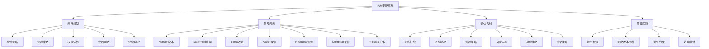

# 第04章：IAM策略详解

## 学习目标

1. 掌握IAM策略的JSON语法结构
2. 理解策略元素和属性的使用
3. 学习条件块和条件操作符
4. 掌握策略变量和动态引用
5. 理解策略评估逻辑和优先级

## IAM策略系统架构



## 4.1 IAM策略基础语法

### 4.1.1 策略文档结构

::: tip 策略基本结构
IAM策略使用JSON格式，包含以下基本元素：
- **Version**: 策略语言版本
- **Statement**: 权限声明数组
- **Effect**: Allow或Deny
- **Action**: 允许或拒绝的操作
- **Resource**: 操作作用的资源
- **Condition**: 可选的条件约束
:::

```python
import boto3
import json
from datetime import datetime

def create_basic_policy_structure():
    """
    创建IAM策略的基本结构示例
    """
    
    # 最简单的策略结构
    simple_policy = {
        "Version": "2012-10-17",
        "Statement": [
            {
                "Effect": "Allow",
                "Action": "s3:GetObject",
                "Resource": "*"
            }
        ]
    }
    
    # 完整的策略结构
    complete_policy = {
        "Version": "2012-10-17",
        "Id": "ExamplePolicy123",  # 可选的策略ID
        "Statement": [
            {
                "Sid": "AllowS3ReadAccess",  # 可选的语句ID
                "Effect": "Allow",
                "Principal": {  # 仅在资源策略中使用
                    "AWS": "arn:aws:iam::123456789012:user/ExampleUser"
                },
                "Action": [
                    "s3:GetObject",
                    "s3:GetObjectVersion"
                ],
                "Resource": [
                    "arn:aws:s3:::example-bucket/*",
                    "arn:aws:s3:::another-bucket/*"
                ],
                "Condition": {
                    "StringEquals": {
                        "s3:x-amz-server-side-encryption": "AES256"
                    },
                    "DateGreaterThan": {
                        "aws:CurrentTime": "2024-01-01T00:00:00Z"
                    }
                }
            }
        ]
    }
    
    print("📝 简单策略结构:")
    print(json.dumps(simple_policy, indent=2, ensure_ascii=False))
    
    print("\n📝 完整策略结构:")
    print(json.dumps(complete_policy, indent=2, ensure_ascii=False))
    
    return simple_policy, complete_policy

def validate_policy_syntax(policy_document):
    """
    验证IAM策略语法的正确性
    """
    iam = boto3.client('iam')
    
    try:
        # 使用AWS IAM服务验证策略语法
        response = iam.simulate_principal_policy(
            PolicySourceArn='arn:aws:iam::123456789012:user/test-user',
            ActionNames=['s3:GetObject'],
            ResourceArns=['arn:aws:s3:::test-bucket/*'],
            PolicyInputList=[json.dumps(policy_document)]
        )
        
        print("✅ 策略语法验证通过")
        
        # 检查模拟结果
        for result in response['EvaluationResults']:
            decision = result['EvalDecision']
            action = result['EvalActionName']
            resource = result['EvalResourceName']
            
            print(f"   操作: {action}")
            print(f"   资源: {resource}")
            print(f"   决策: {decision}")
            
            if 'MatchedStatements' in result:
                print(f"   匹配语句: {len(result['MatchedStatements'])}")
        
        return True
        
    except Exception as e:
        print(f"❌ 策略语法验证失败: {str(e)}")
        return False

# 创建和验证策略示例
simple_policy, complete_policy = create_basic_policy_structure()
validate_policy_syntax(simple_policy)
```

### 4.1.2 策略元素详解

```python
def demonstrate_policy_elements():
    """
    演示IAM策略各个元素的使用
    """
    
    # Version元素
    version_examples = {
        "current": "2012-10-17",  # 当前版本，推荐使用
        "legacy": "2008-10-17"    # 旧版本，不推荐
    }
    
    print("📋 Version版本说明:")
    for version_type, version_value in version_examples.items():
        print(f"  {version_type}: {version_value}")
    
    # Effect元素
    effect_examples = {
        "Allow": "授予权限",
        "Deny": "明确拒绝权限（优先级最高）"
    }
    
    print("\n📋 Effect效果类型:")
    for effect, description in effect_examples.items():
        print(f"  {effect}: {description}")
    
    # Action元素的各种格式
    action_formats = {
        "单个操作": "s3:GetObject",
        "操作列表": ["s3:GetObject", "s3:PutObject"],
        "通配符": "s3:*",
        "服务通配符": "*",
        "操作族": "s3:Get*"
    }
    
    print("\n📋 Action操作格式:")
    for format_type, example in action_formats.items():
        print(f"  {format_type}: {example}")
    
    # Resource元素的各种格式
    resource_formats = {
        "具体资源": "arn:aws:s3:::my-bucket/file.txt",
        "存储桶": "arn:aws:s3:::my-bucket",
        "存储桶内容": "arn:aws:s3:::my-bucket/*",
        "资源列表": [
            "arn:aws:s3:::bucket1/*",
            "arn:aws:s3:::bucket2/*"
        ],
        "通配符": "*",
        "部分通配符": "arn:aws:s3:::my-*"
    }
    
    print("\n📋 Resource资源格式:")
    for format_type, example in resource_formats.items():
        print(f"  {format_type}: {example}")
    
    # Principal元素（仅用于资源策略）
    principal_formats = {
        "AWS账户": "arn:aws:iam::123456789012:root",
        "IAM用户": "arn:aws:iam::123456789012:user/UserName",
        "IAM角色": "arn:aws:iam::123456789012:role/RoleName",
        "AWS服务": "lambda.amazonaws.com",
        "匿名用户": "*",
        "联合用户": "arn:aws:sts::123456789012:federated-user/UserName"
    }
    
    print("\n📋 Principal主体类型:")
    for principal_type, example in principal_formats.items():
        print(f"  {principal_type}: {example}")
    
    # 创建展示各种元素的完整策略
    comprehensive_policy = {
        "Version": "2012-10-17",
        "Id": "ComprehensivePolicyExample",
        "Statement": [
            {
                "Sid": "AllowS3ReadAccess",
                "Effect": "Allow",
                "Action": [
                    "s3:GetObject",
                    "s3:GetObjectVersion",
                    "s3:ListBucket"
                ],
                "Resource": [
                    "arn:aws:s3:::my-data-bucket",
                    "arn:aws:s3:::my-data-bucket/*"
                ]
            },
            {
                "Sid": "AllowS3WriteToSpecificPrefix",
                "Effect": "Allow",
                "Action": [
                    "s3:PutObject",
                    "s3:PutObjectAcl",
                    "s3:DeleteObject"
                ],
                "Resource": "arn:aws:s3:::my-data-bucket/user-uploads/*"
            },
            {
                "Sid": "DenyDeleteBucket",
                "Effect": "Deny",
                "Action": "s3:DeleteBucket",
                "Resource": "*"
            },
            {
                "Sid": "AllowEC2ReadOnly",
                "Effect": "Allow",
                "Action": "ec2:Describe*",
                "Resource": "*"
            }
        ]
    }
    
    print("\n📝 综合策略示例:")
    print(json.dumps(comprehensive_policy, indent=2, ensure_ascii=False))
    
    return comprehensive_policy

# 演示策略元素
comprehensive_policy = demonstrate_policy_elements()
```

## 4.2 条件块和条件操作符

### 4.2.1 条件操作符详解

```python
def demonstrate_condition_operators():
    """
    演示IAM策略中的各种条件操作符
    """
    
    # 字符串条件操作符
    string_conditions = {
        "StringEquals": {
            "description": "精确匹配字符串",
            "example": {
                "aws:PrincipalTag/Department": "Finance"
            }
        },
        "StringNotEquals": {
            "description": "不等于字符串",
            "example": {
                "aws:PrincipalTag/Department": "Temp"
            }
        },
        "StringLike": {
            "description": "通配符模式匹配",
            "example": {
                "s3:prefix": ["home/${aws:username}/*"]
            }
        },
        "StringNotLike": {
            "description": "不匹配通配符模式",
            "example": {
                "s3:prefix": ["restricted/*"]
            }
        }
    }
    
    # 数值条件操作符
    numeric_conditions = {
        "NumericEquals": {
            "description": "数值等于",
            "example": {
                "s3:max-keys": "10"
            }
        },
        "NumericNotEquals": {
            "description": "数值不等于",
            "example": {
                "s3:max-keys": "100"
            }
        },
        "NumericLessThan": {
            "description": "小于数值",
            "example": {
                "aws:MultiFactorAuthAge": "3600"
            }
        },
        "NumericLessThanEquals": {
            "description": "小于等于数值",
            "example": {
                "s3:max-keys": "50"
            }
        },
        "NumericGreaterThan": {
            "description": "大于数值",
            "example": {
                "s3:object-size": "1024"
            }
        },
        "NumericGreaterThanEquals": {
            "description": "大于等于数值",
            "example": {
                "s3:object-size": "0"
            }
        }
    }
    
    # 日期条件操作符
    date_conditions = {
        "DateEquals": {
            "description": "日期等于",
            "example": {
                "aws:CurrentTime": "2024-01-01T00:00:00Z"
            }
        },
        "DateNotEquals": {
            "description": "日期不等于",
            "example": {
                "aws:CurrentTime": "2024-12-25T00:00:00Z"
            }
        },
        "DateLessThan": {
            "description": "日期早于",
            "example": {
                "aws:CurrentTime": "2024-12-31T23:59:59Z"
            }
        },
        "DateGreaterThan": {
            "description": "日期晚于",
            "example": {
                "aws:CurrentTime": "2024-01-01T00:00:00Z"
            }
        }
    }
    
    # 布尔条件操作符
    boolean_conditions = {
        "Bool": {
            "description": "布尔值比较",
            "example": {
                "aws:SecureTransport": "true",
                "aws:MultiFactorAuthPresent": "true"
            }
        }
    }
    
    # IP地址条件操作符
    ip_conditions = {
        "IpAddress": {
            "description": "IP地址在范围内",
            "example": {
                "aws:SourceIp": ["203.0.113.0/24", "2001:DB8:1234:5678::/64"]
            }
        },
        "NotIpAddress": {
            "description": "IP地址不在范围内",
            "example": {
                "aws:SourceIp": ["192.0.2.0/24"]
            }
        }
    }
    
    # ARN条件操作符
    arn_conditions = {
        "ArnEquals": {
            "description": "ARN精确匹配",
            "example": {
                "aws:SourceArn": "arn:aws:s3:::my-bucket"
            }
        },
        "ArnLike": {
            "description": "ARN通配符匹配",
            "example": {
                "aws:SourceArn": "arn:aws:s3:::my-*"
            }
        },
        "ArnNotEquals": {
            "description": "ARN不等于",
            "example": {
                "aws:SourceArn": "arn:aws:s3:::restricted-bucket"
            }
        },
        "ArnNotLike": {
            "description": "ARN不匹配通配符",
            "example": {
                "aws:SourceArn": "arn:aws:s3:::temp-*"
            }
        }
    }
    
    # 创建包含各种条件的综合策略
    condition_policy = {
        "Version": "2012-10-17",
        "Statement": [
            {
                "Sid": "StringConditions",
                "Effect": "Allow",
                "Action": "s3:GetObject",
                "Resource": "*",
                "Condition": {
                    "StringEquals": {
                        "s3:ExistingObjectTag/Environment": "Production"
                    },
                    "StringLike": {
                        "s3:prefix": ["home/${aws:username}/*"]
                    }
                }
            },
            {
                "Sid": "NumericConditions", 
                "Effect": "Allow",
                "Action": "s3:PutObject",
                "Resource": "*",
                "Condition": {
                    "NumericLessThan": {
                        "s3:object-size": "10485760"  # 10MB
                    },
                    "NumericGreaterThan": {
                        "s3:object-size": "0"
                    }
                }
            },
            {
                "Sid": "DateConditions",
                "Effect": "Allow",
                "Action": "ec2:RunInstances",
                "Resource": "*",
                "Condition": {
                    "DateGreaterThan": {
                        "aws:CurrentTime": "2024-01-01T00:00:00Z"
                    },
                    "DateLessThan": {
                        "aws:CurrentTime": "2024-12-31T23:59:59Z"
                    }
                }
            },
            {
                "Sid": "BooleanAndIPConditions",
                "Effect": "Allow",
                "Action": "iam:*",
                "Resource": "*",
                "Condition": {
                    "Bool": {
                        "aws:MultiFactorAuthPresent": "true",
                        "aws:SecureTransport": "true"
                    },
                    "IpAddress": {
                        "aws:SourceIp": ["203.0.113.0/24"]
                    }
                }
            },
            {
                "Sid": "ARNConditions",
                "Effect": "Allow",
                "Action": "sns:Publish",
                "Resource": "*",
                "Condition": {
                    "ArnLike": {
                        "aws:SourceArn": "arn:aws:s3:::my-bucket/*"
                    }
                }
            }
        ]
    }
    
    print("📋 条件操作符类型:")
    print("\n🔤 字符串条件:")
    for op, details in string_conditions.items():
        print(f"  {op}: {details['description']}")
    
    print("\n🔢 数值条件:")
    for op, details in numeric_conditions.items():
        print(f"  {op}: {details['description']}")
    
    print("\n📅 日期条件:")
    for op, details in date_conditions.items():
        print(f"  {op}: {details['description']}")
    
    print("\n✅ 布尔条件:")
    for op, details in boolean_conditions.items():
        print(f"  {op}: {details['description']}")
    
    print("\n🌐 IP地址条件:")
    for op, details in ip_conditions.items():
        print(f"  {op}: {details['description']}")
    
    print("\n🏷️ ARN条件:")
    for op, details in arn_conditions.items():
        print(f"  {op}: {details['description']}")
    
    print("\n📝 综合条件策略示例:")
    print(json.dumps(condition_policy, indent=2, ensure_ascii=False))
    
    return condition_policy

# 演示条件操作符
condition_policy = demonstrate_condition_operators()
```

### 4.2.2 条件修饰符和集合操作

```python
def demonstrate_condition_modifiers():
    """
    演示IAM条件的修饰符和集合操作
    """
    
    # 条件修饰符
    modifier_examples = {
        "IfExists": {
            "description": "仅当键存在时才检查条件",
            "use_case": "处理可选字段",
            "example": {
                "StringEqualsIfExists": {
                    "s3:ExistingObjectTag/Environment": "Production"
                }
            }
        },
        "ForAllValues": {
            "description": "请求中的所有值都必须匹配条件",
            "use_case": "限制多值字段的所有值",
            "example": {
                "ForAllValues:StringEquals": {
                    "dynamodb:Attributes": ["UserId", "Email", "Name"]
                }
            }
        },
        "ForAnyValue": {
            "description": "请求中至少有一个值匹配条件",
            "use_case": "允许多值字段中的任意值",
            "example": {
                "ForAnyValue:StringEquals": {
                    "aws:PrincipalTag/Department": ["Finance", "HR", "IT"]
                }
            }
        }
    }
    
    # 创建展示修饰符的策略
    modifier_policy = {
        "Version": "2012-10-17",
        "Statement": [
            {
                "Sid": "IfExistsModifier",
                "Effect": "Allow",
                "Action": "s3:GetObject",
                "Resource": "*",
                "Condition": {
                    "StringEqualsIfExists": {
                        "s3:ExistingObjectTag/Classification": "Public"
                    },
                    "StringEquals": {
                        "s3:ExistingObjectTag/Environment": "Production"
                    }
                }
            },
            {
                "Sid": "ForAllValuesModifier",
                "Effect": "Allow",
                "Action": "dynamodb:GetItem",
                "Resource": "arn:aws:dynamodb:*:*:table/UserProfiles",
                "Condition": {
                    "ForAllValues:StringEquals": {
                        "dynamodb:Attributes": [
                            "UserId",
                            "Email", 
                            "FirstName",
                            "LastName"
                        ]
                    }
                }
            },
            {
                "Sid": "ForAnyValueModifier",
                "Effect": "Allow",
                "Action": "s3:PutObject",
                "Resource": "arn:aws:s3:::company-data/*",
                "Condition": {
                    "ForAnyValue:StringEquals": {
                        "aws:PrincipalTag/Department": [
                            "Engineering",
                            "DevOps",
                            "QA"
                        ]
                    }
                }
            }
        ]
    }
    
    print("📋 条件修饰符说明:")
    for modifier, details in modifier_examples.items():
        print(f"\n{modifier}:")
        print(f"  描述: {details['description']}")
        print(f"  用途: {details['use_case']}")
        print(f"  示例: {json.dumps(details['example'], indent=4, ensure_ascii=False)}")
    
    print("\n📝 修饰符策略示例:")
    print(json.dumps(modifier_policy, indent=2, ensure_ascii=False))
    
    # 创建复杂的条件组合示例
    complex_condition_policy = {
        "Version": "2012-10-17",
        "Statement": [
            {
                "Sid": "ComplexS3Access",
                "Effect": "Allow",
                "Action": [
                    "s3:GetObject",
                    "s3:PutObject"
                ],
                "Resource": "arn:aws:s3:::sensitive-data/*",
                "Condition": {
                    "Bool": {
                        "aws:SecureTransport": "true",
                        "aws:MultiFactorAuthPresent": "true"
                    },
                    "StringEquals": {
                        "s3:x-amz-server-side-encryption": "aws:kms"
                    },
                    "StringLike": {
                        "s3:x-amz-server-side-encryption-aws-kms-key-id": "arn:aws:kms:*:*:key/*"
                    },
                    "NumericLessThan": {
                        "aws:MultiFactorAuthAge": "1800"  # MFA在30分钟内
                    },
                    "IpAddress": {
                        "aws:SourceIp": [
                            "203.0.113.0/24",    # 办公网络
                            "198.51.100.0/24"    # VPN网络
                        ]
                    },
                    "DateGreaterThan": {
                        "aws:CurrentTime": "2024-01-01T00:00:00Z"
                    },
                    "ForAllValues:StringEquals": {
                        "aws:TagKeys": [
                            "Environment",
                            "Project", 
                            "Owner"
                        ]
                    }
                }
            }
        ]
    }
    
    print("\n📝 复杂条件组合策略:")
    print(json.dumps(complex_condition_policy, indent=2, ensure_ascii=False))
    
    return modifier_policy, complex_condition_policy

# 演示条件修饰符
modifier_policy, complex_policy = demonstrate_condition_modifiers()
```

## 4.3 策略变量和动态引用

### 4.3.1 AWS策略变量

```python
def demonstrate_policy_variables():
    """
    演示IAM策略中的变量使用
    """
    
    # AWS全局变量
    global_variables = {
        "aws:CurrentTime": "当前时间戳",
        "aws:EpochTime": "Unix时间戳",
        "aws:PrincipalType": "主体类型（User, Role, Account等）",
        "aws:SecureTransport": "是否使用HTTPS",
        "aws:SourceIp": "请求的源IP地址",
        "aws:UserAgent": "HTTP User-Agent头",
        "aws:userid": "AWS用户ID",
        "aws:username": "用户名",
        "aws:PrincipalArn": "主体的ARN",
        "aws:RequestedRegion": "请求的AWS区域",
        "aws:RequestTag/key": "请求中的标签值",
        "aws:PrincipalTag/key": "主体的标签值"
    }
    
    # 服务特定变量
    service_variables = {
        "s3": {
            "s3:prefix": "S3对象前缀",
            "s3:delimiter": "S3分隔符",
            "s3:max-keys": "列出对象的最大数量",
            "s3:ExistingObjectTag/key": "现有对象的标签值",
            "s3:x-amz-content-sha256": "内容的SHA256哈希",
            "s3:x-amz-server-side-encryption": "服务端加密类型"
        },
        "ec2": {
            "ec2:InstanceType": "EC2实例类型",
            "ec2:Region": "EC2区域",
            "ec2:ResourceTag/key": "EC2资源标签",
            "ec2:Subnet": "子网ID"
        },
        "dynamodb": {
            "dynamodb:Attributes": "DynamoDB属性列表",
            "dynamodb:LeadingKeys": "DynamoDB主键值",
            "dynamodb:Encrypt": "是否启用加密"
        }
    }
    
    # 创建使用变量的策略示例
    variable_policies = {
        "user_home_directory": {
            "description": "用户只能访问自己的主目录",
            "policy": {
                "Version": "2012-10-17",
                "Statement": [
                    {
                        "Effect": "Allow",
                        "Action": [
                            "s3:GetObject",
                            "s3:PutObject",
                            "s3:DeleteObject"
                        ],
                        "Resource": "arn:aws:s3:::user-home-directories/${aws:username}/*"
                    },
                    {
                        "Effect": "Allow",
                        "Action": "s3:ListBucket",
                        "Resource": "arn:aws:s3:::user-home-directories",
                        "Condition": {
                            "StringLike": {
                                "s3:prefix": "${aws:username}/*"
                            }
                        }
                    }
                ]
            }
        },
        "time_based_access": {
            "description": "基于时间的访问控制",
            "policy": {
                "Version": "2012-10-17",
                "Statement": [
                    {
                        "Effect": "Allow",
                        "Action": "ec2:*",
                        "Resource": "*",
                        "Condition": {
                            "DateGreaterThan": {
                                "aws:CurrentTime": "2024-01-01T00:00:00Z"
                            },
                            "DateLessThan": {
                                "aws:CurrentTime": "2024-12-31T23:59:59Z"
                            },
                            "IpAddress": {
                                "aws:SourceIp": "203.0.113.0/24"
                            }
                        }
                    }
                ]
            }
        },
        "tag_based_access": {
            "description": "基于标签的访问控制",
            "policy": {
                "Version": "2012-10-17",
                "Statement": [
                    {
                        "Effect": "Allow",
                        "Action": [
                            "ec2:StartInstances",
                            "ec2:StopInstances",
                            "ec2:RebootInstances"
                        ],
                        "Resource": "*",
                        "Condition": {
                            "StringEquals": {
                                "ec2:ResourceTag/Owner": "${aws:username}",
                                "ec2:ResourceTag/Department": "${aws:PrincipalTag/Department}"
                            }
                        }
                    },
                    {
                        "Effect": "Allow",
                        "Action": "ec2:RunInstances",
                        "Resource": "*",
                        "Condition": {
                            "StringEquals": {
                                "aws:RequestedTag/Owner": "${aws:username}",
                                "aws:RequestedTag/Department": "${aws:PrincipalTag/Department}"
                            }
                        }
                    }
                ]
            }
        },
        "dynamodb_row_level": {
            "description": "DynamoDB行级访问控制",
            "policy": {
                "Version": "2012-10-17",
                "Statement": [
                    {
                        "Effect": "Allow",
                        "Action": [
                            "dynamodb:GetItem",
                            "dynamodb:PutItem",
                            "dynamodb:UpdateItem",
                            "dynamodb:DeleteItem"
                        ],
                        "Resource": "arn:aws:dynamodb:*:*:table/UserProfiles",
                        "Condition": {
                            "ForAllValues:StringEquals": {
                                "dynamodb:LeadingKeys": ["${aws:username}"]
                            }
                        }
                    }
                ]
            }
        }
    }
    
    print("📋 AWS全局变量:")
    for var, description in global_variables.items():
        print(f"  ${{{var}}}: {description}")
    
    print("\n📋 服务特定变量:")
    for service, variables in service_variables.items():
        print(f"\n  {service.upper()}服务:")
        for var, description in variables.items():
            print(f"    ${{{var}}}: {description}")
    
    print("\n📝 策略变量使用示例:")
    for policy_name, policy_info in variable_policies.items():
        print(f"\n{policy_name}:")
        print(f"  描述: {policy_info['description']}")
        print(f"  策略: {json.dumps(policy_info['policy'], indent=2, ensure_ascii=False)}")
    
    return variable_policies

def create_dynamic_policy_generator():
    """
    创建动态策略生成器
    """
    
    class DynamicPolicyGenerator:
        def __init__(self):
            self.base_templates = {}
        
        def register_template(self, name, template):
            """注册策略模板"""
            self.base_templates[name] = template
        
        def generate_user_specific_policy(self, username, department, resources):
            """生成用户特定的策略"""
            user_policy = {
                "Version": "2012-10-17",
                "Statement": [
                    {
                        "Sid": "AllowUserSpecificS3Access",
                        "Effect": "Allow",
                        "Action": [
                            "s3:GetObject",
                            "s3:PutObject",
                            "s3:DeleteObject"
                        ],
                        "Resource": f"arn:aws:s3:::user-data/{username}/*"
                    },
                    {
                        "Sid": "AllowDepartmentSharedAccess",
                        "Effect": "Allow",
                        "Action": "s3:GetObject",
                        "Resource": f"arn:aws:s3:::shared-data/{department.lower()}/*"
                    }
                ]
            }
            
            # 添加资源特定的权限
            if resources:
                for resource in resources:
                    if resource['type'] == 'ec2':
                        user_policy['Statement'].append({
                            "Sid": f"AllowEC2Access{resource['name']}",
                            "Effect": "Allow",
                            "Action": [
                                "ec2:StartInstances",
                                "ec2:StopInstances",
                                "ec2:RebootInstances"
                            ],
                            "Resource": resource['arn'],
                            "Condition": {
                                "StringEquals": {
                                    "ec2:ResourceTag/Owner": username
                                }
                            }
                        })
            
            return user_policy
        
        def generate_role_specific_policy(self, service_name, permissions_level):
            """生成角色特定的策略"""
            service_policies = {
                "lambda": {
                    "basic": {
                        "Version": "2012-10-17",
                        "Statement": [
                            {
                                "Effect": "Allow",
                                "Action": [
                                    "logs:CreateLogGroup",
                                    "logs:CreateLogStream",
                                    "logs:PutLogEvents"
                                ],
                                "Resource": "arn:aws:logs:*:*:*"
                            }
                        ]
                    },
                    "s3_access": {
                        "Version": "2012-10-17",
                        "Statement": [
                            {
                                "Effect": "Allow",
                                "Action": [
                                    "logs:CreateLogGroup",
                                    "logs:CreateLogStream", 
                                    "logs:PutLogEvents"
                                ],
                                "Resource": "arn:aws:logs:*:*:*"
                            },
                            {
                                "Effect": "Allow",
                                "Action": [
                                    "s3:GetObject",
                                    "s3:PutObject"
                                ],
                                "Resource": "arn:aws:s3:::lambda-data/*"
                            }
                        ]
                    }
                }
            }
            
            return service_policies.get(service_name, {}).get(permissions_level, {})
        
        def apply_security_constraints(self, policy, constraints):
            """应用安全约束到策略"""
            enhanced_policy = policy.copy()
            
            # 添加通用安全条件
            security_conditions = {
                "Bool": {
                    "aws:SecureTransport": "true"
                }
            }
            
            if constraints.get('require_mfa'):
                security_conditions["Bool"]["aws:MultiFactorAuthPresent"] = "true"
                security_conditions["NumericLessThan"] = {
                    "aws:MultiFactorAuthAge": str(constraints.get('mfa_max_age', 3600))
                }
            
            if constraints.get('ip_restriction'):
                security_conditions["IpAddress"] = {
                    "aws:SourceIp": constraints['ip_restriction']
                }
            
            if constraints.get('time_restriction'):
                if 'start_time' in constraints['time_restriction']:
                    security_conditions["DateGreaterThan"] = {
                        "aws:CurrentTime": constraints['time_restriction']['start_time']
                    }
                if 'end_time' in constraints['time_restriction']:
                    security_conditions["DateLessThan"] = {
                        "aws:CurrentTime": constraints['time_restriction']['end_time']
                    }
            
            # 将安全条件应用到所有语句
            for statement in enhanced_policy.get('Statement', []):
                if 'Condition' not in statement:
                    statement['Condition'] = {}
                
                # 合并条件
                for condition_type, condition_value in security_conditions.items():
                    if condition_type not in statement['Condition']:
                        statement['Condition'][condition_type] = {}
                    statement['Condition'][condition_type].update(condition_value)
            
            return enhanced_policy
    
    return DynamicPolicyGenerator()

# 演示策略变量
variable_policies = demonstrate_policy_variables()

# 创建并使用动态策略生成器
policy_generator = create_dynamic_policy_generator()

# 生成用户特定策略
user_policy = policy_generator.generate_user_specific_policy(
    username="john.doe",
    department="Engineering",
    resources=[
        {
            "type": "ec2",
            "name": "DevServer",
            "arn": "arn:aws:ec2:us-east-1:123456789012:instance/i-1234567890abcdef0"
        }
    ]
)

print("\n📝 动态生成的用户策略:")
print(json.dumps(user_policy, indent=2, ensure_ascii=False))

# 应用安全约束
constraints = {
    "require_mfa": True,
    "mfa_max_age": 1800,  # 30分钟
    "ip_restriction": ["203.0.113.0/24"],
    "time_restriction": {
        "start_time": "2024-01-01T00:00:00Z",
        "end_time": "2024-12-31T23:59:59Z"
    }
}

secured_policy = policy_generator.apply_security_constraints(user_policy, constraints)

print("\n📝 应用安全约束后的策略:")
print(json.dumps(secured_policy, indent=2, ensure_ascii=False))
```

## 4.4 策略评估逻辑

### 4.4.1 策略评估顺序

```python
def demonstrate_policy_evaluation_logic():
    """
    演示IAM策略的评估逻辑和优先级
    """
    
    # 策略评估顺序
    evaluation_order = {
        1: {
            "step": "显式拒绝检查",
            "description": "检查所有策略中是否有显式的Deny语句",
            "result": "如果找到匹配的Deny，立即拒绝请求"
        },
        2: {
            "step": "组织SCP检查", 
            "description": "检查AWS组织的服务控制策略",
            "result": "如果SCP不允许，拒绝请求"
        },
        3: {
            "step": "资源策略检查",
            "description": "检查资源上的基于资源的策略",
            "result": "如果资源策略允许，可能允许请求"
        },
        4: {
            "step": "权限边界检查",
            "description": "检查IAM实体的权限边界",
            "result": "权限边界限制最大权限"
        },
        5: {
            "step": "身份策略检查",
            "description": "检查用户、组和角色的身份策略",
            "result": "如果身份策略允许，可能允许请求"
        },
        6: {
            "step": "会话策略检查",
            "description": "检查AssumeRole时提供的会话策略",
            "result": "会话策略进一步限制权限"
        },
        7: {
            "step": "默认拒绝",
            "description": "如果没有显式允许，默认拒绝",
            "result": "拒绝请求"
        }
    }
    
    print("📋 IAM策略评估顺序:")
    for step_num, step_info in evaluation_order.items():
        print(f"\n{step_num}. {step_info['step']}")
        print(f"   描述: {step_info['description']}")
        print(f"   结果: {step_info['result']}")
    
    # 创建策略评估示例
    evaluation_examples = {
        "explicit_deny_wins": {
            "scenario": "显式拒绝优先级最高",
            "policies": {
                "identity_policy": {
                    "Version": "2012-10-17",
                    "Statement": [
                        {
                            "Effect": "Allow",
                            "Action": "s3:*",
                            "Resource": "*"
                        }
                    ]
                },
                "resource_policy": {
                    "Version": "2012-10-17",
                    "Statement": [
                        {
                            "Effect": "Deny",
                            "Principal": "*",
                            "Action": "s3:DeleteObject",
                            "Resource": "arn:aws:s3:::critical-data/*"
                        }
                    ]
                }
            },
            "result": "DeleteObject操作被拒绝，因为显式拒绝优先级最高"
        },
        "permissions_boundary_limitation": {
            "scenario": "权限边界限制",
            "policies": {
                "identity_policy": {
                    "Version": "2012-10-17",
                    "Statement": [
                        {
                            "Effect": "Allow",
                            "Action": "*",
                            "Resource": "*"
                        }
                    ]
                },
                "permissions_boundary": {
                    "Version": "2012-10-17",
                    "Statement": [
                        {
                            "Effect": "Allow",
                            "Action": "s3:*",
                            "Resource": "*"
                        }
                    ]
                }
            },
            "result": "只允许S3操作，其他服务操作被权限边界阻止"
        },
        "session_policy_restriction": {
            "scenario": "会话策略进一步限制",
            "policies": {
                "role_policy": {
                    "Version": "2012-10-17",
                    "Statement": [
                        {
                            "Effect": "Allow",
                            "Action": "s3:*",
                            "Resource": "*"
                        }
                    ]
                },
                "session_policy": {
                    "Version": "2012-10-17",
                    "Statement": [
                        {
                            "Effect": "Allow",
                            "Action": "s3:GetObject",
                            "Resource": "arn:aws:s3:::specific-bucket/*"
                        }
                    ]
                }
            },
            "result": "只允许读取特定存储桶中的对象，其他S3操作被会话策略限制"
        }
    }
    
    print("\n📝 策略评估示例:")
    for example_name, example_info in evaluation_examples.items():
        print(f"\n{example_name}:")
        print(f"  场景: {example_info['scenario']}")
        print(f"  结果: {example_info['result']}")
        
        for policy_type, policy_content in example_info['policies'].items():
            print(f"\n  {policy_type}:")
            print(f"  {json.dumps(policy_content, indent=2, ensure_ascii=False)}")
    
    return evaluation_order, evaluation_examples

def create_policy_evaluation_simulator():
    """
    创建策略评估模拟器
    """
    
    class PolicyEvaluationSimulator:
        def __init__(self):
            self.policies = {
                'identity_policies': [],
                'resource_policies': [],
                'permissions_boundaries': [],
                'session_policies': [],
                'scp_policies': []
            }
        
        def add_policy(self, policy_type, policy_document):
            """添加策略到模拟器"""
            if policy_type in self.policies:
                self.policies[policy_type].append(policy_document)
        
        def evaluate_request(self, action, resource, principal=None, conditions=None):
            """模拟策略评估过程"""
            evaluation_result = {
                'action': action,
                'resource': resource,
                'principal': principal,
                'conditions': conditions or {},
                'decision': 'Deny',  # 默认拒绝
                'evaluation_steps': []
            }
            
            # 步骤1: 检查显式拒绝
            explicit_deny = self._check_explicit_deny(action, resource, conditions)
            evaluation_result['evaluation_steps'].append({
                'step': 1,
                'name': 'Explicit Deny Check',
                'result': 'Deny' if explicit_deny else 'No explicit deny found',
                'decision': 'Deny' if explicit_deny else 'Continue'
            })
            
            if explicit_deny:
                evaluation_result['decision'] = 'Deny'
                evaluation_result['reason'] = 'Explicit deny found'
                return evaluation_result
            
            # 步骤2: 检查组织SCP（模拟）
            scp_allow = self._check_scp_policies(action, resource)
            evaluation_result['evaluation_steps'].append({
                'step': 2,
                'name': 'Organization SCP Check',
                'result': 'Allow' if scp_allow else 'Deny',
                'decision': 'Continue' if scp_allow else 'Deny'
            })
            
            if not scp_allow:
                evaluation_result['decision'] = 'Deny'
                evaluation_result['reason'] = 'Organization SCP denies'
                return evaluation_result
            
            # 步骤3: 检查资源策略
            resource_policy_allow = self._check_resource_policies(action, resource, principal)
            evaluation_result['evaluation_steps'].append({
                'step': 3,
                'name': 'Resource Policy Check',
                'result': 'Allow' if resource_policy_allow else 'No explicit allow',
                'decision': 'Continue'
            })
            
            # 步骤4: 检查权限边界
            permissions_boundary_allow = self._check_permissions_boundaries(action, resource)
            evaluation_result['evaluation_steps'].append({
                'step': 4,
                'name': 'Permissions Boundary Check',
                'result': 'Allow' if permissions_boundary_allow else 'Deny',
                'decision': 'Continue' if permissions_boundary_allow else 'Deny'
            })
            
            if not permissions_boundary_allow:
                evaluation_result['decision'] = 'Deny'
                evaluation_result['reason'] = 'Permissions boundary denies'
                return evaluation_result
            
            # 步骤5: 检查身份策略
            identity_policy_allow = self._check_identity_policies(action, resource, conditions)
            evaluation_result['evaluation_steps'].append({
                'step': 5,
                'name': 'Identity Policy Check',
                'result': 'Allow' if identity_policy_allow else 'No explicit allow',
                'decision': 'Continue' if identity_policy_allow else 'Deny'
            })
            
            # 步骤6: 检查会话策略
            session_policy_allow = self._check_session_policies(action, resource)
            evaluation_result['evaluation_steps'].append({
                'step': 6,
                'name': 'Session Policy Check',
                'result': 'Allow' if session_policy_allow else 'No restriction',
                'decision': 'Continue'
            })
            
            # 最终决策
            if (resource_policy_allow or identity_policy_allow) and session_policy_allow:
                evaluation_result['decision'] = 'Allow'
                evaluation_result['reason'] = 'Request allowed by policies'
            else:
                evaluation_result['decision'] = 'Deny' 
                evaluation_result['reason'] = 'No explicit allow found (implicit deny)'
            
            return evaluation_result
        
        def _check_explicit_deny(self, action, resource, conditions):
            """检查是否有显式拒绝"""
            all_policies = (
                self.policies['identity_policies'] + 
                self.policies['resource_policies'] +
                self.policies['session_policies']
            )
            
            for policy in all_policies:
                for statement in policy.get('Statement', []):
                    if (statement.get('Effect') == 'Deny' and
                        self._action_matches(action, statement.get('Action', [])) and
                        self._resource_matches(resource, statement.get('Resource', []))):
                        return True
            return False
        
        def _check_scp_policies(self, action, resource):
            """检查组织SCP策略"""
            if not self.policies['scp_policies']:
                return True  # 没有SCP策略，允许
            
            for policy in self.policies['scp_policies']:
                for statement in policy.get('Statement', []):
                    if (statement.get('Effect') == 'Allow' and
                        self._action_matches(action, statement.get('Action', [])) and
                        self._resource_matches(resource, statement.get('Resource', []))):
                        return True
            return False
        
        def _check_resource_policies(self, action, resource, principal):
            """检查资源策略"""
            for policy in self.policies['resource_policies']:
                for statement in policy.get('Statement', []):
                    if (statement.get('Effect') == 'Allow' and
                        self._action_matches(action, statement.get('Action', [])) and
                        self._resource_matches(resource, statement.get('Resource', [])) and
                        self._principal_matches(principal, statement.get('Principal', {}))):
                        return True
            return False
        
        def _check_permissions_boundaries(self, action, resource):
            """检查权限边界"""
            if not self.policies['permissions_boundaries']:
                return True  # 没有权限边界，不限制
            
            for policy in self.policies['permissions_boundaries']:
                for statement in policy.get('Statement', []):
                    if (statement.get('Effect') == 'Allow' and
                        self._action_matches(action, statement.get('Action', [])) and
                        self._resource_matches(resource, statement.get('Resource', []))):
                        return True
            return False
        
        def _check_identity_policies(self, action, resource, conditions):
            """检查身份策略"""
            for policy in self.policies['identity_policies']:
                for statement in policy.get('Statement', []):
                    if (statement.get('Effect') == 'Allow' and
                        self._action_matches(action, statement.get('Action', [])) and
                        self._resource_matches(resource, statement.get('Resource', []))):
                        return True
            return False
        
        def _check_session_policies(self, action, resource):
            """检查会话策略"""
            if not self.policies['session_policies']:
                return True  # 没有会话策略，不限制
            
            for policy in self.policies['session_policies']:
                for statement in policy.get('Statement', []):
                    if (statement.get('Effect') == 'Allow' and
                        self._action_matches(action, statement.get('Action', [])) and
                        self._resource_matches(resource, statement.get('Resource', []))):
                        return True
            return False
        
        def _action_matches(self, requested_action, policy_actions):
            """检查操作是否匹配"""
            if isinstance(policy_actions, str):
                policy_actions = [policy_actions]
            
            for policy_action in policy_actions:
                if policy_action == '*' or policy_action == requested_action:
                    return True
                if policy_action.endswith('*'):
                    prefix = policy_action[:-1]
                    if requested_action.startswith(prefix):
                        return True
            return False
        
        def _resource_matches(self, requested_resource, policy_resources):
            """检查资源是否匹配"""
            if isinstance(policy_resources, str):
                policy_resources = [policy_resources]
            
            for policy_resource in policy_resources:
                if policy_resource == '*' or policy_resource == requested_resource:
                    return True
                if policy_resource.endswith('*'):
                    prefix = policy_resource[:-1]
                    if requested_resource.startswith(prefix):
                        return True
            return False
        
        def _principal_matches(self, requested_principal, policy_principal):
            """检查主体是否匹配"""
            if not policy_principal:
                return True
            if policy_principal == '*':
                return True
            # 简化的主体匹配逻辑
            return True
    
    return PolicyEvaluationSimulator()

# 演示策略评估逻辑
evaluation_order, evaluation_examples = demonstrate_policy_evaluation_logic()

# 创建并使用策略评估模拟器
simulator = create_policy_evaluation_simulator()

# 添加示例策略
identity_policy = {
    "Version": "2012-10-17",
    "Statement": [
        {
            "Effect": "Allow",
            "Action": "s3:GetObject",
            "Resource": "arn:aws:s3:::my-bucket/*"
        }
    ]
}

deny_policy = {
    "Version": "2012-10-17",
    "Statement": [
        {
            "Effect": "Deny",
            "Action": "s3:DeleteObject",
            "Resource": "*"
        }
    ]
}

simulator.add_policy('identity_policies', identity_policy)
simulator.add_policy('identity_policies', deny_policy)

# 模拟策略评估
result1 = simulator.evaluate_request(
    action='s3:GetObject',
    resource='arn:aws:s3:::my-bucket/file.txt',
    principal='arn:aws:iam::123456789012:user/testuser'
)

result2 = simulator.evaluate_request(
    action='s3:DeleteObject',
    resource='arn:aws:s3:::my-bucket/file.txt',
    principal='arn:aws:iam::123456789012:user/testuser'
)

print("\n📝 策略评估模拟结果:")
print("\n允许的GetObject请求:")
print(json.dumps(result1, indent=2, ensure_ascii=False, default=str))

print("\n拒绝的DeleteObject请求:")
print(json.dumps(result2, indent=2, ensure_ascii=False, default=str))
```

## 4.5 策略类型和使用场景

### 4.5.1 不同类型的策略

```python
def demonstrate_policy_types():
    """
    演示不同类型的IAM策略及其使用场景
    """
    
    policy_types = {
        "identity_based_policies": {
            "description": "附加到IAM身份（用户、组、角色）的策略",
            "types": {
                "managed_policies": {
                    "aws_managed": "AWS提供的预定义策略",
                    "customer_managed": "客户创建和管理的策略"
                },
                "inline_policies": "直接嵌入到单个身份的策略"
            },
            "use_cases": [
                "定义用户、组或角色的权限",
                "在多个身份之间共享相同权限",
                "提供基线权限集"
            ]
        },
        "resource_based_policies": {
            "description": "附加到AWS资源的策略",
            "examples": ["S3存储桶策略", "SQS队列策略", "KMS密钥策略", "Lambda资源策略"],
            "use_cases": [
                "定义谁可以访问特定资源",
                "跨账户资源共享",
                "资源级别的访问控制"
            ]
        },
        "permissions_boundaries": {
            "description": "定义IAM实体的最大权限边界",
            "use_cases": [
                "限制开发人员的最大权限",
                "实现权限委托",
                "企业治理和合规"
            ]
        },
        "organization_scps": {
            "description": "AWS组织的服务控制策略",
            "use_cases": [
                "在组织级别限制服务使用",
                "防止意外的高成本操作",
                "强制合规要求"
            ]
        },
        "session_policies": {
            "description": "AssumeRole时提供的临时策略",
            "use_cases": [
                "进一步限制角色权限",
                "提供临时的细粒度控制",
                "动态权限调整"
            ]
        }
    }
    
    # 创建不同类型策略的示例
    policy_examples = {
        "identity_based_managed": {
            "name": "S3ReadOnlyAccess-Custom",
            "description": "自定义S3只读访问策略",
            "policy": {
                "Version": "2012-10-17",
                "Statement": [
                    {
                        "Effect": "Allow",
                        "Action": [
                            "s3:GetObject",
                            "s3:GetObjectVersion",
                            "s3:ListBucket",
                            "s3:GetBucketLocation",
                            "s3:GetBucketVersioning"
                        ],
                        "Resource": [
                            "arn:aws:s3:::company-data-*",
                            "arn:aws:s3:::company-data-*/*"
                        ]
                    }
                ]
            }
        },
        "resource_based_s3": {
            "name": "S3BucketCrossAccountPolicy", 
            "description": "允许跨账户访问S3存储桶",
            "policy": {
                "Version": "2012-10-17",
                "Statement": [
                    {
                        "Sid": "AllowCrossAccountRead",
                        "Effect": "Allow",
                        "Principal": {
                            "AWS": [
                                "arn:aws:iam::111122223333:root",
                                "arn:aws:iam::444455556666:user/trusted-user"
                            ]
                        },
                        "Action": [
                            "s3:GetObject",
                            "s3:ListBucket"
                        ],
                        "Resource": [
                            "arn:aws:s3:::shared-bucket",
                            "arn:aws:s3:::shared-bucket/*"
                        ],
                        "Condition": {
                            "StringEquals": {
                                "s3:x-amz-server-side-encryption": "AES256"
                            }
                        }
                    }
                ]
            }
        },
        "permissions_boundary": {
            "name": "DeveloperPermissionsBoundary",
            "description": "开发人员权限边界",
            "policy": {
                "Version": "2012-10-17",
                "Statement": [
                    {
                        "Effect": "Allow",
                        "Action": [
                            "s3:*",
                            "dynamodb:*",
                            "lambda:*",
                            "ec2:Describe*",
                            "ec2:RunInstances",
                            "ec2:StopInstances",
                            "ec2:StartInstances"
                        ],
                        "Resource": "*"
                    },
                    {
                        "Effect": "Deny",
                        "Action": [
                            "iam:*",
                            "organizations:*",
                            "account:*",
                            "billing:*"
                        ],
                        "Resource": "*"
                    },
                    {
                        "Effect": "Deny",
                        "Action": "ec2:TerminateInstances",
                        "Resource": "*",
                        "Condition": {
                            "StringNotEquals": {
                                "ec2:ResourceTag/Environment": ["Dev", "Test"]
                            }
                        }
                    }
                ]
            }
        },
        "organization_scp": {
            "name": "PreventHighCostServices",
            "description": "防止使用高成本服务的SCP",
            "policy": {
                "Version": "2012-10-17",
                "Statement": [
                    {
                        "Effect": "Deny",
                        "Action": [
                            "sagemaker:*",
                            "redshift:*",
                            "emr:*"
                        ],
                        "Resource": "*"
                    },
                    {
                        "Effect": "Deny",
                        "Action": "ec2:RunInstances",
                        "Resource": "*",
                        "Condition": {
                            "ForAnyValue:StringNotEquals": {
                                "ec2:InstanceType": [
                                    "t2.micro",
                                    "t2.small", 
                                    "t3.micro",
                                    "t3.small"
                                ]
                            }
                        }
                    }
                ]
            }
        },
        "session_policy": {
            "name": "TemporaryReadOnlyAccess",
            "description": "临时只读访问会话策略",
            "policy": {
                "Version": "2012-10-17",
                "Statement": [
                    {
                        "Effect": "Allow",
                        "Action": [
                            "s3:GetObject",
                            "s3:ListBucket",
                            "ec2:Describe*",
                            "cloudwatch:Get*",
                            "cloudwatch:List*",
                            "cloudwatch:Describe*"
                        ],
                        "Resource": "*"
                    }
                ]
            }
        }
    }
    
    print("📋 IAM策略类型说明:")
    for policy_type, info in policy_types.items():
        print(f"\n{policy_type.replace('_', ' ').title()}:")
        print(f"  描述: {info['description']}")
        if 'types' in info:
            print("  子类型:")
            for subtype, subdesc in info['types'].items():
                if isinstance(subdesc, dict):
                    print(f"    {subtype}:")
                    for k, v in subdesc.items():
                        print(f"      - {k}: {v}")
                else:
                    print(f"    - {subtype}: {subdesc}")
        if 'examples' in info:
            print(f"  示例: {', '.join(info['examples'])}")
        print("  使用场景:")
        for use_case in info['use_cases']:
            print(f"    - {use_case}")
    
    print("\n📝 策略示例:")
    for example_name, example_info in policy_examples.items():
        print(f"\n{example_name}:")
        print(f"  名称: {example_info['name']}")
        print(f"  描述: {example_info['description']}")
        print(f"  策略内容:")
        print(json.dumps(example_info['policy'], indent=4, ensure_ascii=False))
    
    return policy_types, policy_examples

def create_policy_management_system():
    """
    创建策略管理系统
    """
    
    class PolicyManagementSystem:
        def __init__(self):
            self.iam = boto3.client('iam')
            self.policy_templates = {}
            self.policy_versions = {}
        
        def create_managed_policy(self, policy_name, policy_document, description=""):
            """创建托管策略"""
            try:
                response = self.iam.create_policy(
                    PolicyName=policy_name,
                    PolicyDocument=json.dumps(policy_document),
                    Description=description,
                    Tags=[
                        {
                            'Key': 'ManagedBy',
                            'Value': 'PolicyManagementSystem'
                        },
                        {
                            'Key': 'CreatedDate',
                            'Value': datetime.now().strftime('%Y-%m-%d')
                        }
                    ]
                )
                
                policy_arn = response['Policy']['Arn']
                print(f"✅ 托管策略创建成功: {policy_arn}")
                
                return policy_arn
                
            except Exception as e:
                print(f"❌ 创建托管策略失败: {str(e)}")
                return None
        
        def create_policy_version(self, policy_arn, new_policy_document):
            """创建策略新版本"""
            try:
                # 获取当前版本信息
                policy = self.iam.get_policy(PolicyArn=policy_arn)
                current_versions = self.iam.list_policy_versions(PolicyArn=policy_arn)
                
                # 检查版本数量限制（最多5个版本）
                if len(current_versions['Versions']) >= 5:
                    # 删除最旧的非默认版本
                    oldest_version = None
                    for version in current_versions['Versions']:
                        if not version['IsDefaultVersion']:
                            if oldest_version is None or version['CreateDate'] < oldest_version['CreateDate']:
                                oldest_version = version
                    
                    if oldest_version:
                        self.iam.delete_policy_version(
                            PolicyArn=policy_arn,
                            VersionId=oldest_version['VersionId']
                        )
                        print(f"🗑️ 删除旧版本: {oldest_version['VersionId']}")
                
                # 创建新版本
                response = self.iam.create_policy_version(
                    PolicyArn=policy_arn,
                    PolicyDocument=json.dumps(new_policy_document),
                    SetAsDefault=True
                )
                
                version_id = response['PolicyVersion']['VersionId']
                print(f"✅ 策略新版本创建成功: {version_id}")
                
                return version_id
                
            except Exception as e:
                print(f"❌ 创建策略版本失败: {str(e)}")
                return None
        
        def attach_policy_to_entity(self, policy_arn, entity_type, entity_name):
            """将策略附加到IAM实体"""
            try:
                if entity_type == 'user':
                    self.iam.attach_user_policy(
                        UserName=entity_name,
                        PolicyArn=policy_arn
                    )
                elif entity_type == 'role':
                    self.iam.attach_role_policy(
                        RoleName=entity_name,
                        PolicyArn=policy_arn
                    )
                elif entity_type == 'group':
                    self.iam.attach_group_policy(
                        GroupName=entity_name,
                        PolicyArn=policy_arn
                    )
                else:
                    raise ValueError(f"不支持的实体类型: {entity_type}")
                
                print(f"✅ 策略已附加到{entity_type}: {entity_name}")
                return True
                
            except Exception as e:
                print(f"❌ 附加策略失败: {str(e)}")
                return False
        
        def set_permissions_boundary(self, entity_type, entity_name, boundary_policy_arn):
            """设置权限边界"""
            try:
                if entity_type == 'user':
                    self.iam.put_user_permissions_boundary(
                        UserName=entity_name,
                        PermissionsBoundary=boundary_policy_arn
                    )
                elif entity_type == 'role':
                    self.iam.put_role_permissions_boundary(
                        RoleName=entity_name,
                        PermissionsBoundary=boundary_policy_arn
                    )
                else:
                    raise ValueError(f"权限边界不支持实体类型: {entity_type}")
                
                print(f"✅ 权限边界已设置为{entity_type}: {entity_name}")
                return True
                
            except Exception as e:
                print(f"❌ 设置权限边界失败: {str(e)}")
                return False
        
        def validate_policy_permissions(self, policy_arn, test_cases):
            """验证策略权限"""
            try:
                validation_results = []
                
                for test_case in test_cases:
                    response = self.iam.simulate_principal_policy(
                        PolicySourceArn=policy_arn,
                        ActionNames=[test_case['action']],
                        ResourceArns=[test_case['resource']],
                        ContextEntries=test_case.get('context', [])
                    )
                    
                    for result in response['EvaluationResults']:
                        validation_results.append({
                            'action': result['EvalActionName'],
                            'resource': result['EvalResourceName'],
                            'decision': result['EvalDecision'],
                            'expected': test_case.get('expected', 'Allow'),
                            'passed': result['EvalDecision'] == test_case.get('expected', 'Allow')
                        })
                
                print("📊 策略验证结果:")
                for result in validation_results:
                    status = "✅" if result['passed'] else "❌"
                    print(f"  {status} {result['action']} on {result['resource']}: "
                          f"{result['decision']} (期望: {result['expected']})")
                
                return validation_results
                
            except Exception as e:
                print(f"❌ 策略验证失败: {str(e)}")
                return []
        
        def generate_policy_report(self, policy_arn):
            """生成策略报告"""
            try:
                # 获取策略详情
                policy = self.iam.get_policy(PolicyArn=policy_arn)
                policy_version = self.iam.get_policy_version(
                    PolicyArn=policy_arn,
                    VersionId=policy['Policy']['DefaultVersionId']
                )
                
                # 获取策略使用情况
                entities = self.iam.list_entities_for_policy(PolicyArn=policy_arn)
                
                report = {
                    'policy_name': policy['Policy']['PolicyName'],
                    'policy_arn': policy_arn,
                    'created_date': policy['Policy']['CreateDate'],
                    'updated_date': policy['Policy']['UpdateDate'],
                    'description': policy['Policy']['Description'],
                    'default_version': policy['Policy']['DefaultVersionId'],
                    'attached_to': {
                        'users': [user['UserName'] for user in entities['PolicyUsers']],
                        'groups': [group['GroupName'] for group in entities['PolicyGroups']],
                        'roles': [role['RoleName'] for role in entities['PolicyRoles']]
                    },
                    'policy_document': policy_version['PolicyVersion']['Document']
                }
                
                print("📋 策略报告:")
                print(f"  策略名称: {report['policy_name']}")
                print(f"  创建日期: {report['created_date']}")
                print(f"  更新日期: {report['updated_date']}")
                print(f"  描述: {report['description']}")
                print(f"  当前版本: {report['default_version']}")
                print(f"  附加到用户: {len(report['attached_to']['users'])}")
                print(f"  附加到组: {len(report['attached_to']['groups'])}")
                print(f"  附加到角色: {len(report['attached_to']['roles'])}")
                
                return report
                
            except Exception as e:
                print(f"❌ 生成策略报告失败: {str(e)}")
                return None
    
    return PolicyManagementSystem()

# 演示策略类型
policy_types, policy_examples = demonstrate_policy_types()

# 创建策略管理系统
policy_mgmt = create_policy_management_system()

# 示例：创建和管理策略
example_policy = {
    "Version": "2012-10-17",
    "Statement": [
        {
            "Effect": "Allow",
            "Action": [
                "s3:GetObject",
                "s3:PutObject"
            ],
            "Resource": "arn:aws:s3:::my-app-bucket/*",
            "Condition": {
                "StringEquals": {
                    "s3:x-amz-server-side-encryption": "AES256"
                }
            }
        }
    ]
}

# 注意：实际执行需要有效的AWS凭证
print("\n📝 策略管理系统示例:")
print("创建托管策略、版本控制、附加策略等功能已准备就绪")
```

## 总结

本章深入介绍了AWS IAM策略的核心内容：

1. **基础语法**: 掌握JSON策略文档的结构和各个元素的使用方法
2. **条件系统**: 理解条件操作符、修饰符和复杂条件组合的使用
3. **策略变量**: 学习动态引用和变量替换，实现灵活的权限控制
4. **评估逻辑**: 理解策略评估的优先级和决策流程
5. **策略类型**: 掌握不同类型策略的特点和适用场景

通过本章学习，您应该能够：
- 编写符合最佳实践的IAM策略
- 使用条件和变量实现细粒度权限控制
- 理解策略评估机制，调试权限问题
- 管理不同类型的策略，满足各种业务需求
- 实施策略版本控制和权限审计

下一章我们将学习权限边界和服务控制策略的高级应用。