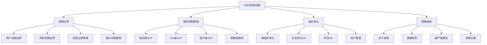

## 学习目标

1. 理解权限边界的概念和作用机制
2. 掌握服务控制策略(SCP)的配置和管理
3. 学习AWS组织的策略继承机制
4. 实施企业级权限治理策略
5. 掌握权限边界和SCP的最佳实践

## 权限治理架构图



## 5.1 权限边界基础

### 5.1.1 权限边界概念和工作原理

::: tip 权限边界核心概念
权限边界是一种高级功能，用于设置IAM实体（用户或角色）的最大权限。它不授予权限，而是定义了权限的上限。
- **作用机制**: 权限边界与身份策略取交集
- **适用范围**: 仅适用于用户和角色，不适用于组
- **策略类型**: 必须使用托管策略（不能使用内联策略）
:::

```python
import boto3
import json
from datetime import datetime, timedelta

def understand_permissions_boundary():
    """
    理解权限边界的工作原理
    """
    
    # 权限边界工作机制示例
    working_mechanism = {
        "concept": "权限边界定义最大权限范围",
        "formula": "有效权限 = 身份策略权限 ∩ 权限边界权限",
        "key_points": [
            "权限边界不授予权限，只限制权限",
            "必须同时满足身份策略和权限边界的允许",
            "任何一方拒绝则最终拒绝",
            "用于实现权限委托和治理"
        ]
    }
    
    # 权限边界场景示例
    scenarios = {
        "developer_boundary": {
            "description": "限制开发人员的最大权限",
            "identity_policy": {
                "Version": "2012-10-17",
                "Statement": [
                    {
                        "Effect": "Allow",
                        "Action": "*",  # 身份策略允许所有操作
                        "Resource": "*"
                    }
                ]
            },
            "permissions_boundary": {
                "Version": "2012-10-17", 
                "Statement": [
                    {
                        "Effect": "Allow",
                        "Action": [
                            "s3:*",
                            "dynamodb:*",
                            "lambda:*",
                            "ec2:Describe*",
                            "logs:*"
                        ],  # 权限边界只允许特定服务
                        "Resource": "*"
                    }
                ]
            },
            "effective_permissions": [
                "s3:*", "dynamodb:*", "lambda:*", 
                "ec2:Describe*", "logs:*"
            ],
            "explanation": "尽管身份策略允许所有权限，但权限边界限制了可用的服务"
        },
        "service_restriction": {
            "description": "防止访问高风险服务",
            "identity_policy": {
                "Version": "2012-10-17",
                "Statement": [
                    {
                        "Effect": "Allow",
                        "Action": [
                            "s3:*",
                            "ec2:*",
                            "iam:ListUsers"
                        ],
                        "Resource": "*"
                    }
                ]
            },
            "permissions_boundary": {
                "Version": "2012-10-17",
                "Statement": [
                    {
                        "Effect": "Allow",
                        "Action": "*",
                        "Resource": "*"
                    },
                    {
                        "Effect": "Deny",
                        "Action": [
                            "iam:CreateRole",
                            "iam:DeleteRole", 
                            "iam:AttachRolePolicy",
                            "organizations:*"
                        ],
                        "Resource": "*"
                    }
                ]
            },
            "effective_permissions": [
                "s3:*", "ec2:*", "iam:ListUsers"
            ],
            "blocked_actions": [
                "iam:CreateRole", "iam:DeleteRole", 
                "iam:AttachRolePolicy", "organizations:*"
            ],
            "explanation": "权限边界中的拒绝语句阻止了高风险IAM操作"
        }
    }
    
    print("📋 权限边界工作机制:")
    print(f"概念: {working_mechanism['concept']}")
    print(f"公式: {working_mechanism['formula']}")
    print("\n关键要点:")
    for point in working_mechanism['key_points']:
        print(f"  • {point}")
    
    print("\n📝 权限边界场景示例:")
    for scenario_name, scenario_info in scenarios.items():
        print(f"\n{scenario_name}:")
        print(f"  描述: {scenario_info['description']}")
        print(f"  有效权限: {', '.join(scenario_info['effective_permissions'])}")
        if 'blocked_actions' in scenario_info:
            print(f"  阻止的操作: {', '.join(scenario_info['blocked_actions'])}")
        print(f"  解释: {scenario_info['explanation']}")
    
    return working_mechanism, scenarios

def create_permissions_boundary_manager():
    """
    创建权限边界管理器
    """
    
    class PermissionsBoundaryManager:
        def __init__(self):
            self.iam = boto3.client('iam')
        
        def create_boundary_policy(self, policy_name, policy_document, description=""):
            """创建权限边界策略"""
            try:
                response = self.iam.create_policy(
                    PolicyName=policy_name,
                    PolicyDocument=json.dumps(policy_document),
                    Description=description or f"Permissions boundary policy: {policy_name}",
                    Tags=[
                        {
                            'Key': 'Type',
                            'Value': 'PermissionsBoundary'
                        },
                        {
                            'Key': 'CreatedBy',
                            'Value': 'PermissionsBoundaryManager'
                        }
                    ]
                )
                
                policy_arn = response['Policy']['Arn']
                print(f"✅ 权限边界策略创建成功: {policy_arn}")
                
                return policy_arn
                
            except Exception as e:
                print(f"❌ 创建权限边界策略失败: {str(e)}")
                return None
        
        def set_user_boundary(self, username, boundary_policy_arn):
            """为用户设置权限边界"""
            try:
                self.iam.put_user_permissions_boundary(
                    UserName=username,
                    PermissionsBoundary=boundary_policy_arn
                )
                
                print(f"✅ 用户 {username} 的权限边界设置成功")
                return True
                
            except Exception as e:
                print(f"❌ 设置用户权限边界失败: {str(e)}")
                return False
        
        def set_role_boundary(self, role_name, boundary_policy_arn):
            """为角色设置权限边界"""
            try:
                self.iam.put_role_permissions_boundary(
                    RoleName=role_name,
                    PermissionsBoundary=boundary_policy_arn
                )
                
                print(f"✅ 角色 {role_name} 的权限边界设置成功")
                return True
                
            except Exception as e:
                print(f"❌ 设置角色权限边界失败: {str(e)}")
                return False
        
        def remove_user_boundary(self, username):
            """移除用户的权限边界"""
            try:
                self.iam.delete_user_permissions_boundary(UserName=username)
                print(f"✅ 用户 {username} 的权限边界已移除")
                return True
                
            except Exception as e:
                print(f"❌ 移除用户权限边界失败: {str(e)}")
                return False
        
        def remove_role_boundary(self, role_name):
            """移除角色的权限边界"""
            try:
                self.iam.delete_role_permissions_boundary(RoleName=role_name)
                print(f"✅ 角色 {role_name} 的权限边界已移除")
                return True
                
            except Exception as e:
                print(f"❌ 移除角色权限边界失败: {str(e)}")
                return False
        
        def get_entity_boundary(self, entity_type, entity_name):
            """获取实体的权限边界信息"""
            try:
                if entity_type == 'user':
                    response = self.iam.get_user(UserName=entity_name)
                    entity_info = response['User']
                elif entity_type == 'role':
                    response = self.iam.get_role(RoleName=entity_name)
                    entity_info = response['Role']
                else:
                    raise ValueError("实体类型必须是 'user' 或 'role'")
                
                boundary_info = {
                    'entity_name': entity_name,
                    'entity_type': entity_type,
                    'has_boundary': 'PermissionsBoundary' in entity_info,
                    'boundary_arn': entity_info.get('PermissionsBoundary', {}).get('PermissionsBoundaryArn'),
                    'boundary_type': entity_info.get('PermissionsBoundary', {}).get('PermissionsBoundaryType')
                }
                
                print(f"📋 {entity_type.title()} {entity_name} 权限边界信息:")
                print(f"  是否有权限边界: {boundary_info['has_boundary']}")
                if boundary_info['has_boundary']:
                    print(f"  权限边界ARN: {boundary_info['boundary_arn']}")
                    print(f"  权限边界类型: {boundary_info['boundary_type']}")
                
                return boundary_info
                
            except Exception as e:
                print(f"❌ 获取权限边界信息失败: {str(e)}")
                return None
        
        def simulate_permissions_with_boundary(self, entity_arn, actions, resources, 
                                               boundary_policy_arn=None):
            """模拟带权限边界的权限评估"""
            try:
                simulate_params = {
                    'PolicySourceArn': entity_arn,
                    'ActionNames': actions,
                    'ResourceArns': resources
                }
                
                # 如果指定了权限边界，添加到模拟参数中
                if boundary_policy_arn:
                    simulate_params['PermissionsBoundaryPolicyInputList'] = [
                        boundary_policy_arn
                    ]
                
                response = self.iam.simulate_principal_policy(**simulate_params)
                
                simulation_results = []
                for result in response['EvaluationResults']:
                    simulation_results.append({
                        'action': result['EvalActionName'],
                        'resource': result['EvalResourceName'],
                        'decision': result['EvalDecision'],
                        'matched_statements': len(result.get('MatchedStatements', [])),
                        'missing_context_values': result.get('MissingContextValues', [])
                    })
                
                print("📊 权限模拟结果:")
                for result in simulation_results:
                    status = "✅" if result['decision'] == 'allowed' else "❌"
                    print(f"  {status} {result['action']} on {result['resource']}: {result['decision']}")
                
                return simulation_results
                
            except Exception as e:
                print(f"❌ 权限模拟失败: {str(e)}")
                return []
    
    return PermissionsBoundaryManager()

# 演示权限边界概念
mechanism, scenarios = understand_permissions_boundary()

# 创建权限边界管理器
boundary_manager = create_permissions_boundary_manager()
```

### 5.1.2 权限边界策略模板

```python
def create_boundary_policy_templates():
    """
    创建常用的权限边界策略模板
    """
    
    templates = {
        "developer_boundary": {
            "name": "DeveloperPermissionsBoundary",
            "description": "开发人员权限边界，限制访问生产环境和敏感服务",
            "policy": {
                "Version": "2012-10-17",
                "Statement": [
                    {
                        "Sid": "AllowDevelopmentServices",
                        "Effect": "Allow",
                        "Action": [
                            "s3:*",
                            "dynamodb:*",
                            "lambda:*",
                            "apigateway:*",
                            "cloudformation:*",
                            "ec2:Describe*",
                            "ec2:RunInstances",
                            "ec2:StartInstances",
                            "ec2:StopInstances",
                            "logs:*",
                            "cloudwatch:*",
                            "sns:*",
                            "sqs:*"
                        ],
                        "Resource": "*"
                    },
                    {
                        "Sid": "DenyProductionResources",
                        "Effect": "Deny",
                        "Action": "*",
                        "Resource": "*",
                        "Condition": {
                            "StringEquals": {
                                "aws:RequestedRegion": ["us-east-1"]  # 拒绝生产区域
                            }
                        }
                    },
                    {
                        "Sid": "DenyHighRiskActions",
                        "Effect": "Deny",
                        "Action": [
                            "iam:CreateRole",
                            "iam:DeleteRole",
                            "iam:AttachRolePolicy",
                            "iam:DetachRolePolicy",
                            "iam:PutRolePolicy",
                            "iam:DeleteRolePolicy",
                            "iam:CreateUser",
                            "iam:DeleteUser",
                            "organizations:*",
                            "account:*",
                            "billing:*",
                            "support:*"
                        ],
                        "Resource": "*"
                    },
                    {
                        "Sid": "DenyExpensiveInstanceTypes",
                        "Effect": "Deny",
                        "Action": "ec2:RunInstances",
                        "Resource": "arn:aws:ec2:*:*:instance/*",
                        "Condition": {
                            "ForAnyValue:StringNotEquals": {
                                "ec2:InstanceType": [
                                    "t2.micro",
                                    "t2.small",
                                    "t2.medium",
                                    "t3.micro",
                                    "t3.small",
                                    "t3.medium"
                                ]
                            }
                        }
                    }
                ]
            }
        },
        "read_only_boundary": {
            "name": "ReadOnlyPermissionsBoundary",
            "description": "只读权限边界，只允许读取和描述操作",
            "policy": {
                "Version": "2012-10-17",
                "Statement": [
                    {
                        "Sid": "AllowReadOnlyActions",
                        "Effect": "Allow",
                        "Action": [
                            "*:Get*",
                            "*:List*",
                            "*:Describe*",
                            "*:Read*",
                            "s3:GetObject*",
                            "s3:ListBucket*"
                        ],
                        "Resource": "*"
                    },
                    {
                        "Sid": "DenyWriteActions",
                        "Effect": "Deny",
                        "Action": [
                            "*:Create*",
                            "*:Delete*",
                            "*:Update*",
                            "*:Put*",
                            "*:Modify*",
                            "*:Set*",
                            "*:Add*",
                            "*:Remove*",
                            "*:Attach*",
                            "*:Detach*"
                        ],
                        "Resource": "*"
                    }
                ]
            }
        },
        "service_specific_boundary": {
            "name": "S3DynamoDBOnlyBoundary", 
            "description": "只允许访问S3和DynamoDB服务的权限边界",
            "policy": {
                "Version": "2012-10-17",
                "Statement": [
                    {
                        "Sid": "AllowS3DynamoDBOnly",
                        "Effect": "Allow",
                        "Action": [
                            "s3:*",
                            "dynamodb:*"
                        ],
                        "Resource": "*"
                    },
                    {
                        "Sid": "AllowBasicAWSServices",
                        "Effect": "Allow",
                        "Action": [
                            "sts:GetCallerIdentity",
                            "sts:AssumeRole",
                            "iam:GetUser",
                            "iam:GetRole",
                            "iam:ListAttachedUserPolicies",
                            "iam:ListAttachedRolePolicies"
                        ],
                        "Resource": "*"
                    }
                ]
            }
        },
        "time_based_boundary": {
            "name": "BusinessHoursBoundary",
            "description": "只允许工作时间访问的权限边界",
            "policy": {
                "Version": "2012-10-17",
                "Statement": [
                    {
                        "Sid": "AllowDuringBusinessHours",
                        "Effect": "Allow",
                        "Action": "*",
                        "Resource": "*",
                        "Condition": {
                            "DateGreaterThan": {
                                "aws:CurrentTime": "08:00Z"
                            },
                            "DateLessThan": {
                                "aws:CurrentTime": "18:00Z"
                            },
                            "ForAllValues:StringEquals": {
                                "aws:RequestedWeekDay": [
                                    "Monday",
                                    "Tuesday", 
                                    "Wednesday",
                                    "Thursday",
                                    "Friday"
                                ]
                            }
                        }
                    },
                    {
                        "Sid": "AllowEmergencyAccess",
                        "Effect": "Allow",
                        "Action": [
                            "cloudwatch:*",
                            "logs:*",
                            "sns:Publish",
                            "ec2:Describe*"
                        ],
                        "Resource": "*"
                    }
                ]
            }
        },
        "tag_based_boundary": {
            "name": "TagBasedAccessBoundary",
            "description": "基于标签的访问控制权限边界",
            "policy": {
                "Version": "2012-10-17",
                "Statement": [
                    {
                        "Sid": "AllowTaggedResourceAccess",
                        "Effect": "Allow",
                        "Action": "*",
                        "Resource": "*",
                        "Condition": {
                            "StringEquals": {
                                "aws:ResourceTag/Department": "${aws:PrincipalTag/Department}",
                                "aws:ResourceTag/Project": "${aws:PrincipalTag/Project}"
                            }
                        }
                    },
                    {
                        "Sid": "AllowResourceTagging",
                        "Effect": "Allow",
                        "Action": [
                            "ec2:CreateTags",
                            "s3:PutObjectTagging",
                            "dynamodb:TagResource"
                        ],
                        "Resource": "*",
                        "Condition": {
                            "StringEquals": {
                                "aws:RequestedTag/Department": "${aws:PrincipalTag/Department}",
                                "aws:RequestedTag/Project": "${aws:PrincipalTag/Project}"
                            }
                        }
                    },
                    {
                        "Sid": "DenyUntaggedResourceCreation",
                        "Effect": "Deny",
                        "Action": [
                            "ec2:RunInstances",
                            "s3:CreateBucket",
                            "dynamodb:CreateTable"
                        ],
                        "Resource": "*",
                        "Condition": {
                            "Null": {
                                "aws:RequestedTag/Department": "true"
                            }
                        }
                    }
                ]
            }
        }
    }
    
    print("📋 权限边界策略模板:")
    for template_name, template_info in templates.items():
        print(f"\n{template_name}:")
        print(f"  名称: {template_info['name']}")
        print(f"  描述: {template_info['description']}")
        print(f"  语句数量: {len(template_info['policy']['Statement'])}")
    
    return templates

def deploy_boundary_templates():
    """
    部署权限边界模板
    """
    templates = create_boundary_policy_templates()
    boundary_manager = create_permissions_boundary_manager()
    
    deployed_policies = {}
    
    for template_name, template_info in templates.items():
        print(f"\n正在部署模板: {template_name}")
        
        # 创建权限边界策略
        policy_arn = boundary_manager.create_boundary_policy(
            policy_name=template_info['name'],
            policy_document=template_info['policy'],
            description=template_info['description']
        )
        
        if policy_arn:
            deployed_policies[template_name] = {
                'arn': policy_arn,
                'name': template_info['name'],
                'description': template_info['description']
            }
    
    print("\n📋 部署完成的权限边界策略:")
    for template_name, policy_info in deployed_policies.items():
        print(f"  {template_name}: {policy_info['arn']}")
    
    return deployed_policies

# 创建和部署权限边界模板
templates = create_boundary_policy_templates()

# 显示权限边界策略详情
print("\n📝 开发人员权限边界策略详情:")
dev_boundary = templates['developer_boundary']['policy']
print(json.dumps(dev_boundary, indent=2, ensure_ascii=False))
```

## 5.2 服务控制策略(SCP)

### 5.2.1 SCP基础概念

```python
def understand_service_control_policies():
    """
    理解服务控制策略(SCP)的概念和作用
    """
    
    scp_concepts = {
        "definition": "服务控制策略(SCP)是AWS组织的治理机制，用于限制组织单元(OU)和账户的最大权限",
        "key_features": [
            "仅限制权限，不授予权限",
            "应用于组织单元和账户级别",
            "支持继承机制，子单元继承父单元的SCP",
            "与IAM策略取交集生效",
            "管理账户默认不受SCP限制"
        ],
        "scp_types": {
            "allow_lists": {
                "description": "明确列出允许的操作",
                "behavior": "只有明确允许的操作才能执行",
                "use_case": "严格控制环境，如生产环境"
            },
            "deny_lists": {
                "description": "明确列出拒绝的操作",
                "behavior": "除了明确拒绝的操作外，其他都允许", 
                "use_case": "灵活控制，阻止特定高风险操作"
            }
        },
        "inheritance_model": {
            "description": "SCP支持继承机制",
            "rules": [
                "子OU继承父OU的所有SCP",
                "账户继承其所在OU的所有SCP",
                "多个SCP之间取交集",
                "任何一个SCP拒绝的操作都被拒绝"
            ]
        }
    }
    
    # SCP继承层次结构示例
    organization_structure = {
        "Root": {
            "scp": ["FullAWSAccess"],  # 默认SCP
            "children": {
                "Production OU": {
                    "scp": ["ProductionRestrictions", "NoDeleteProtection"],
                    "children": {
                        "Prod Account 1": {"scp": []},
                        "Prod Account 2": {"scp": ["ExtraSecurityRestrictions"]}
                    }
                },
                "Development OU": {
                    "scp": ["DevelopmentRestrictions"],
                    "children": {
                        "Dev Account 1": {"scp": []},
                        "Dev Account 2": {"scp": ["CostControlSCP"]}
                    }
                },
                "Security OU": {
                    "scp": ["SecurityAuditAccess"],
                    "children": {
                        "Security Account": {"scp": []}
                    }
                }
            }
        }
    }
    
    # SCP与IAM策略的交互
    policy_interaction = {
        "scenario": "用户在生产账户中执行EC2操作",
        "identity_policy": {
            "Version": "2012-10-17",
            "Statement": [
                {
                    "Effect": "Allow",
                    "Action": "ec2:*",
                    "Resource": "*"
                }
            ]
        },
        "scp_policy": {
            "Version": "2012-10-17",
            "Statement": [
                {
                    "Effect": "Deny",
                    "Action": "ec2:TerminateInstances",
                    "Resource": "*"
                }
            ]
        },
        "effective_permissions": [
            "ec2:RunInstances",
            "ec2:StartInstances", 
            "ec2:StopInstances",
            "ec2:DescribeInstances"
            # ec2:TerminateInstances 被SCP拒绝
        ],
        "explanation": "虽然身份策略允许所有EC2操作，但SCP拒绝了TerminateInstances操作"
    }
    
    print("📋 服务控制策略(SCP)概念:")
    print(f"定义: {scp_concepts['definition']}")
    
    print("\n关键特性:")
    for feature in scp_concepts['key_features']:
        print(f"  • {feature}")
    
    print("\nSCP类型:")
    for scp_type, type_info in scp_concepts['scp_types'].items():
        print(f"  {scp_type}:")
        print(f"    描述: {type_info['description']}")
        print(f"    行为: {type_info['behavior']}")
        print(f"    用例: {type_info['use_case']}")
    
    print("\n继承机制规则:")
    for rule in scp_concepts['inheritance_model']['rules']:
        print(f"  • {rule}")
    
    print("\n📝 策略交互示例:")
    print(f"场景: {policy_interaction['scenario']}")
    print(f"有效权限: {', '.join(policy_interaction['effective_permissions'])}")
    print(f"解释: {policy_interaction['explanation']}")
    
    return scp_concepts, organization_structure, policy_interaction

def create_scp_manager():
    """
    创建SCP管理器
    """
    
    class SCPManager:
        def __init__(self):
            self.organizations = boto3.client('organizations')
        
        def create_scp_policy(self, policy_name, policy_document, description=""):
            """创建SCP策略"""
            try:
                response = self.organizations.create_policy(
                    Name=policy_name,
                    Description=description or f"Service Control Policy: {policy_name}",
                    Type='SERVICE_CONTROL_POLICY',
                    Content=json.dumps(policy_document)
                )
                
                policy_id = response['Policy']['PolicySummary']['Id']
                policy_arn = response['Policy']['PolicySummary']['Arn']
                
                print(f"✅ SCP策略创建成功:")
                print(f"   ID: {policy_id}")
                print(f"   ARN: {policy_arn}")
                
                return {
                    'policy_id': policy_id,
                    'policy_arn': policy_arn,
                    'policy_name': policy_name
                }
                
            except Exception as e:
                print(f"❌ 创建SCP策略失败: {str(e)}")
                return None
        
        def attach_scp_to_target(self, policy_id, target_id):
            """将SCP附加到目标（OU或账户）"""
            try:
                self.organizations.attach_policy(
                    PolicyId=policy_id,
                    TargetId=target_id
                )
                
                print(f"✅ SCP策略 {policy_id} 已附加到目标 {target_id}")
                return True
                
            except Exception as e:
                print(f"❌ 附加SCP策略失败: {str(e)}")
                return False
        
        def detach_scp_from_target(self, policy_id, target_id):
            """从目标分离SCP"""
            try:
                self.organizations.detach_policy(
                    PolicyId=policy_id,
                    TargetId=target_id
                )
                
                print(f"✅ SCP策略 {policy_id} 已从目标 {target_id} 分离")
                return True
                
            except Exception as e:
                print(f"❌ 分离SCP策略失败: {str(e)}")
                return False
        
        def list_organization_structure(self):
            """列出组织结构"""
            try:
                # 获取根节点
                response = self.organizations.list_roots()
                if not response['Roots']:
                    print("❌ 未找到组织根节点")
                    return None
                
                root = response['Roots'][0]
                print(f"📋 组织结构:")
                print(f"根节点: {root['Name']} ({root['Id']})")
                
                # 递归获取组织结构
                structure = {
                    'root': root,
                    'organizational_units': self._get_ous_recursive(root['Id']),
                    'accounts': []
                }
                
                # 获取所有账户
                accounts_response = self.organizations.list_accounts()
                structure['accounts'] = accounts_response['Accounts']
                
                return structure
                
            except Exception as e:
                print(f"❌ 获取组织结构失败: {str(e)}")
                return None
        
        def _get_ous_recursive(self, parent_id, level=1):
            """递归获取组织单元"""
            try:
                response = self.organizations.list_organizational_units_for_parent(
                    ParentId=parent_id
                )
                
                ous = []
                indent = "  " * level
                
                for ou in response['OrganizationalUnits']:
                    print(f"{indent}OU: {ou['Name']} ({ou['Id']})")
                    
                    ou_info = {
                        'ou': ou,
                        'children': self._get_ous_recursive(ou['Id'], level + 1),
                        'accounts': []
                    }
                    
                    # 获取OU下的账户
                    accounts_response = self.organizations.list_accounts_for_parent(
                        ParentId=ou['Id']
                    )
                    
                    for account in accounts_response['Accounts']:
                        print(f"{indent}  账户: {account['Name']} ({account['Id']})")
                        ou_info['accounts'].append(account)
                    
                    ous.append(ou_info)
                
                return ous
                
            except Exception as e:
                print(f"❌ 获取OU信息失败: {str(e)}")
                return []
        
        def list_policies_for_target(self, target_id):
            """列出目标的所有SCP策略"""
            try:
                response = self.organizations.list_policies_for_target(
                    TargetId=target_id,
                    Filter='SERVICE_CONTROL_POLICY'
                )
                
                policies = response['Policies']
                
                print(f"📋 目标 {target_id} 的SCP策略:")
                for policy in policies:
                    print(f"  策略: {policy['Name']} ({policy['Id']})")
                    print(f"    描述: {policy['Description']}")
                    print(f"    类型: {policy['Type']}")
                
                return policies
                
            except Exception as e:
                print(f"❌ 获取目标策略失败: {str(e)}")
                return []
        
        def get_effective_policies_for_account(self, account_id):
            """获取账户的有效SCP策略"""
            try:
                response = self.organizations.list_policies_for_target(
                    TargetId=account_id,
                    Filter='SERVICE_CONTROL_POLICY'
                )
                
                direct_policies = response['Policies']
                
                # 获取账户的父OU路径
                parent_response = self.organizations.list_parents(
                    ChildId=account_id
                )
                
                inherited_policies = []
                for parent in parent_response['Parents']:
                    parent_policies = self._get_inherited_policies(parent['Id'])
                    inherited_policies.extend(parent_policies)
                
                all_policies = {
                    'direct_policies': direct_policies,
                    'inherited_policies': inherited_policies,
                    'account_id': account_id
                }
                
                print(f"📋 账户 {account_id} 的有效SCP策略:")
                print(f"  直接附加的策略: {len(direct_policies)}")
                print(f"  继承的策略: {len(inherited_policies)}")
                
                return all_policies
                
            except Exception as e:
                print(f"❌ 获取账户有效策略失败: {str(e)}")
                return None
        
        def _get_inherited_policies(self, ou_id):
            """获取从父OU继承的策略"""
            inherited = []
            
            try:
                # 获取当前OU的策略
                response = self.organizations.list_policies_for_target(
                    TargetId=ou_id,
                    Filter='SERVICE_CONTROL_POLICY'
                )
                inherited.extend(response['Policies'])
                
                # 递归获取父OU的策略
                parents_response = self.organizations.list_parents(
                    ChildId=ou_id
                )
                
                for parent in parents_response['Parents']:
                    if parent['Type'] == 'ORGANIZATIONAL_UNIT':
                        parent_policies = self._get_inherited_policies(parent['Id'])
                        inherited.extend(parent_policies)
                
            except Exception as e:
                print(f"警告: 获取继承策略时出错: {str(e)}")
            
            return inherited
    
    return SCPManager()

# 演示SCP概念
scp_concepts, org_structure, policy_interaction = understand_service_control_policies()

# 创建SCP管理器
scp_manager = create_scp_manager()

print("\n📝 SCP策略交互示例:")
print("身份策略 ∩ SCP策略 = 有效权限")
print(json.dumps(policy_interaction, indent=2, ensure_ascii=False))
```

### 5.2.2 SCP策略模板

```python
def create_scp_policy_templates():
    """
    创建常用的SCP策略模板
    """
    
    scp_templates = {
        "production_protection_scp": {
            "name": "ProductionProtectionSCP",
            "description": "保护生产环境资源，防止意外删除和修改",
            "type": "deny_list",
            "policy": {
                "Version": "2012-10-17",
                "Statement": [
                    {
                        "Sid": "DenyDeletionOfCriticalResources",
                        "Effect": "Deny",
                        "Action": [
                            "rds:DeleteDBInstance",
                            "rds:DeleteDBCluster",
                            "s3:DeleteBucket",
                            "ec2:TerminateInstances",
                            "dynamodb:DeleteTable",
                            "lambda:DeleteFunction",
                            "cloudformation:DeleteStack"
                        ],
                        "Resource": "*",
                        "Condition": {
                            "StringEquals": {
                                "aws:ResourceTag/Environment": "Production"
                            }
                        }
                    },
                    {
                        "Sid": "DenyModificationOfProductionBackups",
                        "Effect": "Deny",
                        "Action": [
                            "rds:DeleteDBSnapshot",
                            "rds:DeleteDBClusterSnapshot",
                            "ec2:DeleteSnapshot",
                            "dynamodb:DeleteBackup"
                        ],
                        "Resource": "*",
                        "Condition": {
                            "StringEquals": {
                                "aws:ResourceTag/Environment": "Production"
                            }
                        }
                    },
                    {
                        "Sid": "PreventNetworkChanges",
                        "Effect": "Deny",
                        "Action": [
                            "ec2:DeleteVpc",
                            "ec2:DeleteSubnet",
                            "ec2:DeleteSecurityGroup",
                            "ec2:DeleteRouteTable",
                            "ec2:DeleteInternetGateway"
                        ],
                        "Resource": "*",
                        "Condition": {
                            "StringEquals": {
                                "aws:ResourceTag/Environment": "Production"
                            }
                        }
                    }
                ]
            }
        },
        "cost_control_scp": {
            "name": "CostControlSCP",
            "description": "控制成本，限制使用昂贵的AWS服务和实例类型",
            "type": "deny_list",
            "policy": {
                "Version": "2012-10-17",
                "Statement": [
                    {
                        "Sid": "DenyExpensiveInstanceTypes",
                        "Effect": "Deny",
                        "Action": "ec2:RunInstances",
                        "Resource": "arn:aws:ec2:*:*:instance/*",
                        "Condition": {
                            "ForAnyValue:StringNotEquals": {
                                "ec2:InstanceType": [
                                    "t2.nano", "t2.micro", "t2.small", "t2.medium",
                                    "t3.nano", "t3.micro", "t3.small", "t3.medium",
                                    "m5.large", "m5.xlarge"
                                ]
                            }
                        }
                    },
                    {
                        "Sid": "DenyExpensiveServices",
                        "Effect": "Deny",
                        "Action": [
                            "sagemaker:*",
                            "redshift:*",
                            "emr:*",
                            "databrew:*",
                            "glue:*"
                        ],
                        "Resource": "*"
                    },
                    {
                        "Sid": "DenyLargeRDSInstances",
                        "Effect": "Deny",
                        "Action": "rds:CreateDBInstance",
                        "Resource": "*",
                        "Condition": {
                            "ForAnyValue:StringNotEquals": {
                                "rds:db-instance-class": [
                                    "db.t2.micro",
                                    "db.t2.small",
                                    "db.t3.micro",
                                    "db.t3.small"
                                ]
                            }
                        }
                    },
                    {
                        "Sid": "LimitRegions",
                        "Effect": "Deny",
                        "NotAction": [
                            "iam:*",
                            "sts:*",
                            "organizations:*",
                            "support:*"
                        ],
                        "Resource": "*",
                        "Condition": {
                            "StringNotEquals": {
                                "aws:RequestedRegion": [
                                    "us-east-1",
                                    "us-west-2"
                                ]
                            }
                        }
                    }
                ]
            }
        },
        "security_compliance_scp": {
            "name": "SecurityComplianceSCP",
            "description": "强制安全合规要求，确保加密和安全配置",
            "type": "deny_list",
            "policy": {
                "Version": "2012-10-17",
                "Statement": [
                    {
                        "Sid": "RequireSSLRequestsOnly",
                        "Effect": "Deny",
                        "Action": "s3:*",
                        "Resource": "*",
                        "Condition": {
                            "Bool": {
                                "aws:SecureTransport": "false"
                            }
                        }
                    },
                    {
                        "Sid": "DenyUnencryptedS3Uploads",
                        "Effect": "Deny",
                        "Action": "s3:PutObject",
                        "Resource": "*",
                        "Condition": {
                            "StringNotEquals": {
                                "s3:x-amz-server-side-encryption": [
                                    "AES256",
                                    "aws:kms"
                                ]
                            }
                        }
                    },
                    {
                        "Sid": "RequireEBSEncryption",
                        "Effect": "Deny",
                        "Action": "ec2:RunInstances",
                        "Resource": "arn:aws:ec2:*:*:volume/*",
                        "Condition": {
                            "Bool": {
                                "ec2:Encrypted": "false"
                            }
                        }
                    },
                    {
                        "Sid": "DenyPublicS3Buckets",
                        "Effect": "Deny",
                        "Action": [
                            "s3:PutBucketPublicAccessBlock",
                            "s3:PutBucketAcl",
                            "s3:PutBucketPolicy"
                        ],
                        "Resource": "*",
                        "Condition": {
                            "Bool": {
                                "s3:x-amz-public-read": "true"
                            }
                        }
                    },
                    {
                        "Sid": "RequireRDSEncryption",
                        "Effect": "Deny",
                        "Action": "rds:CreateDBInstance",
                        "Resource": "*",
                        "Condition": {
                            "Bool": {
                                "rds:StorageEncrypted": "false"
                            }
                        }
                    }
                ]
            }
        },
        "development_allowlist_scp": {
            "name": "DevelopmentAllowListSCP",
            "description": "开发环境允许清单，只允许开发相关的服务",
            "type": "allow_list",
            "policy": {
                "Version": "2012-10-17",
                "Statement": [
                    {
                        "Sid": "AllowDevelopmentServices",
                        "Effect": "Allow",
                        "Action": [
                            "s3:*",
                            "dynamodb:*",
                            "lambda:*",
                            "apigateway:*",
                            "cloudformation:*",
                            "cloudwatch:*",
                            "logs:*",
                            "sns:*",
                            "sqs:*",
                            "ec2:Describe*",
                            "ec2:RunInstances",
                            "ec2:StartInstances",
                            "ec2:StopInstances",
                            "ec2:CreateTags",
                            "iam:GetRole",
                            "iam:GetUser",
                            "iam:PassRole",
                            "sts:*"
                        ],
                        "Resource": "*"
                    },
                    {
                        "Sid": "AllowInstanceManagement",
                        "Effect": "Allow",
                        "Action": [
                            "ec2:TerminateInstances"
                        ],
                        "Resource": "*",
                        "Condition": {
                            "StringEquals": {
                                "ec2:ResourceTag/Environment": "Development"
                            }
                        }
                    }
                ]
            }
        },
        "audit_readonly_scp": {
            "name": "AuditReadOnlySCP",
            "description": "审计账户只读访问，用于安全审计和合规检查",
            "type": "allow_list",
            "policy": {
                "Version": "2012-10-17",
                "Statement": [
                    {
                        "Sid": "AllowReadOnlyAccess",
                        "Effect": "Allow",
                        "Action": [
                            "*:Get*",
                            "*:List*",
                            "*:Describe*",
                            "*:Read*",
                            "support:*",
                            "trustedadvisor:*"
                        ],
                        "Resource": "*"
                    },
                    {
                        "Sid": "AllowConfigAndCloudTrail",
                        "Effect": "Allow",
                        "Action": [
                            "config:*",
                            "cloudtrail:*"
                        ],
                        "Resource": "*"
                    },
                    {
                        "Sid": "AllowSecurityServices",
                        "Effect": "Allow",
                        "Action": [
                            "inspector:*",
                            "guardduty:*",
                            "macie:*",
                            "securityhub:*",
                            "access-analyzer:*"
                        ],
                        "Resource": "*"
                    }
                ]
            }
        },
        "emergency_access_scp": {
            "name": "EmergencyAccessSCP",
            "description": "紧急访问控制，在紧急情况下提供有限的访问权限",
            "type": "allow_list",
            "policy": {
                "Version": "2012-10-17",
                "Statement": [
                    {
                        "Sid": "AllowEmergencyAccess",
                        "Effect": "Allow",
                        "Action": [
                            "cloudwatch:*",
                            "logs:*",
                            "sns:Publish",
                            "ses:SendEmail",
                            "ec2:Describe*",
                            "ec2:StartInstances",
                            "ec2:StopInstances",
                            "rds:Describe*",
                            "rds:StartDBInstance",
                            "rds:StopDBInstance"
                        ],
                        "Resource": "*"
                    },
                    {
                        "Sid": "AllowIncidentResponse",
                        "Effect": "Allow",
                        "Action": [
                            "ec2:CreateSnapshot",
                            "ec2:CreateImage",
                            "s3:GetObject",
                            "s3:PutObject"
                        ],
                        "Resource": "*",
                        "Condition": {
                            "StringEquals": {
                                "aws:ResourceTag/Emergency": "true"
                            }
                        }
                    }
                ]
            }
        }
    }
    
    print("📋 SCP策略模板:")
    for template_name, template_info in scp_templates.items():
        print(f"\n{template_name}:")
        print(f"  名称: {template_info['name']}")
        print(f"  描述: {template_info['description']}")
        print(f"  类型: {template_info['type']}")
        print(f"  语句数量: {len(template_info['policy']['Statement'])}")
    
    return scp_templates

def deploy_scp_templates():
    """
    部署SCP策略模板到组织
    """
    templates = create_scp_policy_templates()
    scp_manager = create_scp_manager()
    
    deployed_scps = {}
    
    for template_name, template_info in templates.items():
        print(f"\n正在部署SCP模板: {template_name}")
        
        # 创建SCP策略
        scp_result = scp_manager.create_scp_policy(
            policy_name=template_info['name'],
            policy_document=template_info['policy'],
            description=template_info['description']
        )
        
        if scp_result:
            deployed_scps[template_name] = scp_result
            deployed_scps[template_name]['type'] = template_info['type']
    
    print("\n📋 部署完成的SCP策略:")
    for template_name, scp_info in deployed_scps.items():
        print(f"  {template_name}:")
        print(f"    ID: {scp_info['policy_id']}")
        print(f"    类型: {scp_info['type']}")
    
    return deployed_scps

# 创建SCP模板
scp_templates = create_scp_policy_templates()

# 显示生产保护SCP详情
print("\n📝 生产保护SCP策略详情:")
prod_scp = scp_templates['production_protection_scp']['policy']
print(json.dumps(prod_scp, indent=2, ensure_ascii=False))

# 显示成本控制SCP详情  
print("\n📝 成本控制SCP策略详情:")
cost_scp = scp_templates['cost_control_scp']['policy']
print(json.dumps(cost_scp, indent=2, ensure_ascii=False))
```

## 5.3 组织单元和策略继承

### 5.3.1 组织架构设计

```python
def design_organization_architecture():
    """
    设计AWS组织架构和策略继承体系
    """
    
    # 典型的企业组织架构
    organization_design = {
        "Root": {
            "description": "组织根节点",
            "attached_scps": ["FullAWSAccess"],
            "children": {
                "Security OU": {
                    "description": "安全和合规相关账户",
                    "attached_scps": ["SecurityComplianceSCP", "AuditReadOnlySCP"],
                    "accounts": [
                        {
                            "name": "Security Account",
                            "purpose": "集中安全管理和监控",
                            "services": ["GuardDuty", "SecurityHub", "Config", "CloudTrail"]
                        },
                        {
                            "name": "Log Archive Account", 
                            "purpose": "集中日志存储和分析",
                            "services": ["CloudWatch Logs", "S3", "Elasticsearch"]
                        }
                    ]
                },
                "Production OU": {
                    "description": "生产环境账户",
                    "attached_scps": ["ProductionProtectionSCP", "SecurityComplianceSCP"],
                    "children": {
                        "Core Services OU": {
                            "description": "核心业务服务",
                            "attached_scps": [],
                            "accounts": [
                                {
                                    "name": "Prod Web Services",
                                    "purpose": "Web应用和API服务"
                                },
                                {
                                    "name": "Prod Database",
                                    "purpose": "数据库服务"
                                }
                            ]
                        },
                        "Analytics OU": {
                            "description": "数据分析和BI",
                            "attached_scps": ["DataAnalyticsSCP"],
                            "accounts": [
                                {
                                    "name": "Prod Analytics",
                                    "purpose": "数据仓库和分析"
                                }
                            ]
                        }
                    }
                },
                "Development OU": {
                    "description": "开发和测试环境",
                    "attached_scps": ["CostControlSCP", "DevelopmentAllowListSCP"],
                    "children": {
                        "Dev OU": {
                            "description": "开发环境",
                            "attached_scps": [],
                            "accounts": [
                                {
                                    "name": "Dev Team A",
                                    "purpose": "团队A开发环境"
                                },
                                {
                                    "name": "Dev Team B", 
                                    "purpose": "团队B开发环境"
                                }
                            ]
                        },
                        "Test OU": {
                            "description": "测试环境",
                            "attached_scps": ["TestEnvironmentSCP"],
                            "accounts": [
                                {
                                    "name": "Integration Test",
                                    "purpose": "集成测试环境"
                                },
                                {
                                    "name": "Performance Test",
                                    "purpose": "性能测试环境"
                                }
                            ]
                        }
                    ]
                },
                "Shared Services OU": {
                    "description": "共享服务账户",
                    "attached_scps": ["SharedServicesSCP"],
                    "accounts": [
                        {
                            "name": "Network Account",
                            "purpose": "网络和连接管理"
                        },
                        {
                            "name": "DNS Account",
                            "purpose": "域名解析服务"
                        },
                        {
                            "name": "Backup Account",
                            "purpose": "跨账户备份管理"
                        }
                    ]
                }
            }
        }
    }
    
    # 策略继承矩阵
    inheritance_matrix = {
        "Security Account": {
            "direct_scps": [],
            "inherited_from_ou": ["SecurityComplianceSCP", "AuditReadOnlySCP"],
            "inherited_from_root": ["FullAWSAccess"],
            "effective_scps": ["FullAWSAccess", "SecurityComplianceSCP", "AuditReadOnlySCP"]
        },
        "Prod Web Services": {
            "direct_scps": [],
            "inherited_from_ou": ["ProductionProtectionSCP", "SecurityComplianceSCP"],
            "inherited_from_root": ["FullAWSAccess"],
            "effective_scps": ["FullAWSAccess", "ProductionProtectionSCP", "SecurityComplianceSCP"]
        },
        "Dev Team A": {
            "direct_scps": [],
            "inherited_from_ou": ["CostControlSCP", "DevelopmentAllowListSCP"],
            "inherited_from_parent_ou": ["CostControlSCP", "DevelopmentAllowListSCP"],
            "inherited_from_root": ["FullAWSAccess"],
            "effective_scps": ["FullAWSAccess", "CostControlSCP", "DevelopmentAllowListSCP"]
        }
    }
    
    # 策略冲突解决原则
    conflict_resolution = {
        "principles": [
            "最严格原则：多个SCP的交集生效",
            "拒绝优先：任何SCP拒绝的操作都被拒绝",
            "向下继承：子OU和账户继承父级的所有SCP",
            "累积效应：所有适用的SCP都参与评估"
        ],
        "examples": {
            "scenario_1": {
                "description": "父OU允许EC2，子OU拒绝大实例类型",
                "parent_scp": "允许: ec2:*",
                "child_scp": "拒绝: 大实例类型的ec2:RunInstances",
                "result": "允许小实例类型，拒绝大实例类型"
            },
            "scenario_2": {
                "description": "允许清单SCP和拒绝清单SCP组合",
                "allow_list": "允许: s3:*, ec2:*, dynamodb:*",
                "deny_list": "拒绝: s3:DeleteBucket",
                "result": "允许S3和EC2操作，但不能删除S3存储桶"
            }
        }
    }
    
    print("📋 AWS组织架构设计:")
    print_organization_structure(organization_design["Root"], 0)
    
    print("\n📊 策略继承矩阵示例:")
    for account, inheritance in inheritance_matrix.items():
        print(f"\n{account}:")
        print(f"  直接附加: {inheritance.get('direct_scps', [])}")
        print(f"  从OU继承: {inheritance.get('inherited_from_ou', [])}")
        print(f"  从根继承: {inheritance.get('inherited_from_root', [])}")
        print(f"  有效SCP: {inheritance['effective_scps']}")
    
    print("\n📝 策略冲突解决原则:")
    for principle in conflict_resolution['principles']:
        print(f"  • {principle}")
    
    print("\n示例场景:")
    for scenario, details in conflict_resolution['examples'].items():
        print(f"\n{scenario}: {details['description']}")
        for key, value in details.items():
            if key != 'description':
                print(f"  {key}: {value}")
    
    return organization_design, inheritance_matrix, conflict_resolution

def print_organization_structure(node, level):
    """打印组织结构树"""
    indent = "  " * level
    
    if level == 0:
        print(f"{node.get('description', 'Root')}")
    
    # 打印附加的SCP
    if 'attached_scps' in node and node['attached_scps']:
        print(f"{indent}  📋 SCP: {', '.join(node['attached_scps'])}")
    
    # 打印账户
    if 'accounts' in node:
        for account in node['accounts']:
            print(f"{indent}  💼 账户: {account['name']}")
            print(f"{indent}     用途: {account['purpose']}")
    
    # 递归打印子OU
    if 'children' in node:
        for child_name, child_node in node['children'].items():
            print(f"{indent}📁 {child_name}")
            print(f"{indent}   {child_node.get('description', '')}")
            print_organization_structure(child_node, level + 1)

def create_organization_management_system():
    """
    创建组织管理系统
    """
    
    class OrganizationManagementSystem:
        def __init__(self):
            self.organizations = boto3.client('organizations')
            self.iam = boto3.client('iam')
        
        def create_organizational_unit(self, parent_id, ou_name):
            """创建组织单元"""
            try:
                response = self.organizations.create_organizational_unit(
                    ParentId=parent_id,
                    Name=ou_name
                )
                
                ou_id = response['OrganizationalUnit']['Id']
                print(f"✅ 组织单元创建成功: {ou_name} ({ou_id})")
                
                return ou_id
                
            except Exception as e:
                print(f"❌ 创建组织单元失败: {str(e)}")
                return None
        
        def move_account_to_ou(self, account_id, source_parent_id, destination_parent_id):
            """将账户移动到指定OU"""
            try:
                self.organizations.move_account(
                    AccountId=account_id,
                    SourceParentId=source_parent_id,
                    DestinationParentId=destination_parent_id
                )
                
                print(f"✅ 账户 {account_id} 已移动到新的OU")
                return True
                
            except Exception as e:
                print(f"❌ 移动账户失败: {str(e)}")
                return False
        
        def get_account_inheritance_path(self, account_id):
            """获取账户的继承路径"""
            try:
                inheritance_path = []
                current_id = account_id
                
                while True:
                    parents_response = self.organizations.list_parents(
                        ChildId=current_id
                    )
                    
                    if not parents_response['Parents']:
                        break
                    
                    parent = parents_response['Parents'][0]
                    inheritance_path.append({
                        'id': parent['Id'],
                        'type': parent['Type']
                    })
                    
                    # 如果到达根节点，停止
                    if parent['Type'] == 'ROOT':
                        break
                    
                    current_id = parent['Id']
                
                # 反转路径，从根到叶子
                inheritance_path.reverse()
                
                print(f"📋 账户 {account_id} 的继承路径:")
                for i, node in enumerate(inheritance_path):
                    indent = "  " * i
                    print(f"{indent}{node['type']}: {node['id']}")
                
                return inheritance_path
                
            except Exception as e:
                print(f"❌ 获取继承路径失败: {str(e)}")
                return []
        
        def calculate_effective_scps(self, target_id):
            """计算目标的有效SCP策略"""
            try:
                all_scps = []
                current_id = target_id
                
                # 获取继承路径上每个节点的SCP
                while True:
                    # 获取当前节点的SCP
                    try:
                        policies_response = self.organizations.list_policies_for_target(
                            TargetId=current_id,
                            Filter='SERVICE_CONTROL_POLICY'
                        )
                        
                        node_scps = policies_response['Policies']
                        all_scps.extend(node_scps)
                        
                    except Exception as e:
                        print(f"警告: 获取节点 {current_id} 的策略失败: {str(e)}")
                    
                    # 获取父节点
                    try:
                        parents_response = self.organizations.list_parents(
                            ChildId=current_id
                        )
                        
                        if not parents_response['Parents']:
                            break
                        
                        parent = parents_response['Parents'][0]
                        
                        # 如果到达根节点，停止
                        if parent['Type'] == 'ROOT':
                            # 获取根节点的SCP
                            try:
                                root_policies = self.organizations.list_policies_for_target(
                                    TargetId=parent['Id'],
                                    Filter='SERVICE_CONTROL_POLICY'
                                )
                                all_scps.extend(root_policies['Policies'])
                            except:
                                pass
                            break
                        
                        current_id = parent['Id']
                        
                    except Exception as e:
                        print(f"警告: 获取父节点失败: {str(e)}")
                        break
                
                # 去重（基于策略ID）
                unique_scps = {}
                for scp in all_scps:
                    unique_scps[scp['Id']] = scp
                
                effective_scps = list(unique_scps.values())
                
                print(f"📊 目标 {target_id} 的有效SCP策略:")
                print(f"  总数: {len(effective_scps)}")
                for scp in effective_scps:
                    print(f"    {scp['Name']} ({scp['Id']})")
                
                return effective_scps
                
            except Exception as e:
                print(f"❌ 计算有效SCP失败: {str(e)}")
                return []
        
        def validate_organization_structure(self):
            """验证组织结构的完整性和合规性"""
            try:
                validation_results = {
                    'total_accounts': 0,
                    'total_ous': 0,
                    'accounts_without_scps': [],
                    'ous_without_scps': [],
                    'compliance_violations': [],
                    'recommendations': []
                }
                
                # 获取所有账户
                accounts_response = self.organizations.list_accounts()
                accounts = accounts_response['Accounts']
                validation_results['total_accounts'] = len(accounts)
                
                # 检查每个账户的SCP配置
                for account in accounts:
                    account_id = account['Id']
                    effective_scps = self.calculate_effective_scps(account_id)
                    
                    if not effective_scps:
                        validation_results['accounts_without_scps'].append(account_id)
                    
                    # 检查是否有基本的安全SCP
                    has_security_scp = any(
                        'security' in scp['Name'].lower() or 'compliance' in scp['Name'].lower()
                        for scp in effective_scps
                    )
                    
                    if not has_security_scp:
                        validation_results['compliance_violations'].append({
                            'account_id': account_id,
                            'violation': '缺少安全合规SCP'
                        })
                
                # 生成建议
                if validation_results['accounts_without_scps']:
                    validation_results['recommendations'].append(
                        "为所有账户配置适当的SCP策略"
                    )
                
                if validation_results['compliance_violations']:
                    validation_results['recommendations'].append(
                        "确保所有账户都有基本的安全合规SCP"
                    )
                
                print("📋 组织结构验证报告:")
                print(f"  总账户数: {validation_results['total_accounts']}")
                print(f"  无SCP的账户: {len(validation_results['accounts_without_scps'])}")
                print(f"  合规违规: {len(validation_results['compliance_violations'])}")
                print(f"  建议数量: {len(validation_results['recommendations'])}")
                
                return validation_results
                
            except Exception as e:
                print(f"❌ 验证组织结构失败: {str(e)}")
                return None
    
    return OrganizationManagementSystem()

# 设计组织架构
org_design, inheritance_matrix, conflict_resolution = design_organization_architecture()

# 创建组织管理系统
org_mgmt = create_organization_management_system()

print("\n📝 组织架构最佳实践:")
best_practices = [
    "按环境和功能创建OU结构",
    "在适当的级别附加SCP策略",
    "使用描述性的OU和账户名称",
    "定期审计和验证策略继承",
    "测试策略变更对下级的影响",
    "保持策略文档和变更记录"
]

for i, practice in enumerate(best_practices, 1):
    print(f"  {i}. {practice}")
```

## 5.4 权限边界与SCP的综合应用

### 5.4.1 多层权限控制架构

```python
def create_multi_layer_permission_architecture():
    """
    创建多层权限控制架构，结合权限边界和SCP
    """
    
    # 多层权限控制模型
    permission_layers = {
        "layer_1_organization_scp": {
            "level": "组织级别",
            "description": "最外层控制，定义组织范围内的最大权限",
            "scope": "所有账户和OU",
            "purpose": "合规性、安全性、成本控制",
            "examples": ["禁用高风险服务", "地域限制", "实例类型限制"]
        },
        "layer_2_ou_scp": {
            "level": "OU级别",
            "description": "业务单元级别的权限控制",
            "scope": "特定OU内的所有账户",
            "purpose": "环境隔离、业务需求定制",
            "examples": ["生产环境保护", "开发环境限制", "测试环境控制"]
        },
        "layer_3_account_scp": {
            "level": "账户级别", 
            "description": "账户特定的权限限制",
            "scope": "单个账户",
            "purpose": "账户特定需求、精细化控制",
            "examples": ["特定账户的额外限制", "临时访问控制"]
        },
        "layer_4_permissions_boundary": {
            "level": "IAM实体级别",
            "description": "IAM用户和角色的最大权限边界",
            "scope": "单个IAM实体",
            "purpose": "权限委托、开发者权限限制",
            "examples": ["开发者权限边界", "承包商访问限制"]
        },
        "layer_5_identity_policy": {
            "level": "身份策略级别",
            "description": "实际授予的权限",
            "scope": "IAM身份",
            "purpose": "具体权限授予",
            "examples": ["用户策略", "角色策略", "组策略"]
        }
    }
    
    # 权限计算公式
    permission_formula = {
        "effective_permissions": "ORG_SCP ∩ OU_SCP ∩ ACCOUNT_SCP ∩ PERMISSIONS_BOUNDARY ∩ IDENTITY_POLICY",
        "evaluation_order": [
            "1. 显式拒绝检查（任何层级的Deny立即拒绝）",
            "2. 组织SCP评估",
            "3. OU SCP评估", 
            "4. 账户SCP评估",
            "5. 权限边界评估",
            "6. 身份策略评估",
            "7. 最终权限 = 所有层级的交集"
        ]
    }
    
    # 实际应用场景
    application_scenarios = {
        "enterprise_developer": {
            "description": "企业开发人员权限控制",
            "layers": {
                "org_scp": {
                    "name": "CompanySecuritySCP",
                    "rules": ["禁用高风险服务", "地域限制", "必须加密"]
                },
                "ou_scp": {
                    "name": "DevelopmentSCP", 
                    "rules": ["成本控制", "实例类型限制", "开发服务许可清单"]
                },
                "permissions_boundary": {
                    "name": "DeveloperBoundary",
                    "rules": ["不能创建IAM角色", "不能访问生产资源"]
                },
                "identity_policy": {
                    "name": "DeveloperPolicy",
                    "rules": ["完整的开发环境访问权限"]
                }
            },
            "effective_permissions": [
                "开发环境的S3、DynamoDB、Lambda访问",
                "限制实例类型的EC2访问",
                "CloudWatch和日志访问",
                "不能访问生产资源",
                "不能创建IAM资源"
            ]
        },
        "production_admin": {
            "description": "生产环境管理员权限控制",
            "layers": {
                "org_scp": {
                    "name": "CompanySecuritySCP",
                    "rules": ["禁用高风险服务", "地域限制", "必须加密"]
                },
                "ou_scp": {
                    "name": "ProductionSCP",
                    "rules": ["防止删除关键资源", "需要MFA", "审计日志"]
                },
                "permissions_boundary": {
                    "name": "ProductionAdminBoundary",
                    "rules": ["不能修改安全配置", "不能删除备份"]
                },
                "identity_policy": {
                    "name": "ProductionAdminPolicy", 
                    "rules": ["生产环境管理权限", "监控和日志访问"]
                }
            },
            "effective_permissions": [
                "生产环境资源管理",
                "监控和告警配置",
                "性能优化和扩展",
                "不能删除关键资源",
                "不能修改安全配置"
            ]
        }
    }
    
    print("📋 多层权限控制架构:")
    for layer_name, layer_info in permission_layers.items():
        print(f"\n{layer_info['level']}:")
        print(f"  描述: {layer_info['description']}")
        print(f"  作用域: {layer_info['scope']}")
        print(f"  目的: {layer_info['purpose']}")
        print(f"  示例: {', '.join(layer_info['examples'])}")
    
    print(f"\n📊 权限计算公式:")
    print(f"有效权限 = {permission_formula['effective_permissions']}")
    
    print("\n评估顺序:")
    for step in permission_formula['evaluation_order']:
        print(f"  {step}")
    
    print("\n📝 应用场景示例:")
    for scenario_name, scenario_info in application_scenarios.items():
        print(f"\n{scenario_name}: {scenario_info['description']}")
        print("  权限层次:")
        for layer, config in scenario_info['layers'].items():
            print(f"    {layer}: {config['name']}")
            for rule in config['rules']:
                print(f"      - {rule}")
        print("  有效权限:")
        for permission in scenario_info['effective_permissions']:
            print(f"    ✓ {permission}")
    
    return permission_layers, permission_formula, application_scenarios

def create_permission_testing_framework():
    """
    创建权限测试框架，用于验证多层权限控制
    """
    
    class PermissionTestingFramework:
        def __init__(self):
            self.iam = boto3.client('iam')
            self.organizations = boto3.client('organizations')
        
        def create_test_scenario(self, scenario_name, test_config):
            """创建测试场景"""
            test_scenario = {
                'scenario_name': scenario_name,
                'test_cases': [],
                'setup_resources': [],
                'cleanup_resources': []
            }
            
            # 根据配置创建测试用例
            for action in test_config['actions_to_test']:
                test_case = {
                    'action': action['action'],
                    'resource': action['resource'],
                    'expected_result': action['expected'],
                    'description': action.get('description', f"Test {action['action']}")
                }
                test_scenario['test_cases'].append(test_case)
            
            return test_scenario
        
        def run_permission_simulation(self, principal_arn, test_cases, 
                                      permissions_boundary=None, context_entries=None):
            """运行权限模拟测试"""
            try:
                simulation_results = []
                
                for test_case in test_cases:
                    simulate_params = {
                        'PolicySourceArn': principal_arn,
                        'ActionNames': [test_case['action']],
                        'ResourceArns': [test_case['resource']]
                    }
                    
                    if permissions_boundary:
                        simulate_params['PermissionsBoundaryPolicyInputList'] = [
                            permissions_boundary
                        ]
                    
                    if context_entries:
                        simulate_params['ContextEntries'] = context_entries
                    
                    response = self.iam.simulate_principal_policy(**simulate_params)
                    
                    for result in response['EvaluationResults']:
                        actual_decision = result['EvalDecision']
                        expected_decision = test_case['expected_result']
                        
                        test_result = {
                            'test_case': test_case['description'],
                            'action': result['EvalActionName'],
                            'resource': result['EvalResourceName'],
                            'expected': expected_decision,
                            'actual': actual_decision,
                            'passed': actual_decision.lower() == expected_decision.lower(),
                            'matched_statements': len(result.get('MatchedStatements', [])),
                            'missing_context': result.get('MissingContextValues', [])
                        }
                        
                        simulation_results.append(test_result)
                
                # 生成测试报告
                self._generate_test_report(simulation_results)
                
                return simulation_results
                
            except Exception as e:
                print(f"❌ 权限模拟测试失败: {str(e)}")
                return []
        
        def _generate_test_report(self, results):
            """生成测试报告"""
            passed_tests = sum(1 for r in results if r['passed'])
            total_tests = len(results)
            pass_rate = (passed_tests / total_tests * 100) if total_tests > 0 else 0
            
            print(f"\n📊 权限测试报告:")
            print(f"  总测试数: {total_tests}")
            print(f"  通过测试: {passed_tests}")
            print(f"  失败测试: {total_tests - passed_tests}")
            print(f"  通过率: {pass_rate:.1f}%")
            
            print(f"\n详细结果:")
            for result in results:
                status = "✅" if result['passed'] else "❌"
                print(f"  {status} {result['test_case']}")
                print(f"     操作: {result['action']}")
                print(f"     资源: {result['resource']}")
                print(f"     预期: {result['expected']}, 实际: {result['actual']}")
                
                if result['missing_context']:
                    print(f"     缺少上下文: {', '.join(result['missing_context'])}")
        
        def test_multi_layer_permissions(self):
            """测试多层权限控制场景"""
            # 开发人员场景测试
            developer_tests = {
                'actions_to_test': [
                    {
                        'action': 's3:GetObject',
                        'resource': 'arn:aws:s3:::dev-bucket/*',
                        'expected': 'allowed',
                        'description': '开发环境S3读取'
                    },
                    {
                        'action': 's3:GetObject',
                        'resource': 'arn:aws:s3:::prod-bucket/*',
                        'expected': 'denied',
                        'description': '生产环境S3读取（应被拒绝）'
                    },
                    {
                        'action': 'iam:CreateRole',
                        'resource': '*',
                        'expected': 'denied',
                        'description': 'IAM角色创建（应被权限边界拒绝）'
                    },
                    {
                        'action': 'ec2:RunInstances',
                        'resource': 'arn:aws:ec2:us-west-2:*:instance/*',
                        'expected': 'allowed',
                        'description': '运行小实例（开发环境）'
                    },
                    {
                        'action': 'ec2:RunInstances',
                        'resource': 'arn:aws:ec2:us-east-1:*:instance/*',
                        'expected': 'denied',
                        'description': '在禁止区域运行实例'
                    }
                ]
            }
            
            print("🧪 开发人员多层权限测试场景:")
            developer_scenario = self.create_test_scenario(
                "Developer Multi-Layer Test",
                developer_tests
            )
            
            # 显示测试用例
            for test_case in developer_scenario['test_cases']:
                print(f"  测试: {test_case['description']}")
                print(f"    操作: {test_case['action']}")
                print(f"    资源: {test_case['resource']}")
                print(f"    预期: {test_case['expected_result']}")
            
            return developer_scenario
        
        def validate_policy_consistency(self, policy_set):
            """验证策略集的一致性"""
            consistency_issues = []
            
            # 检查是否有冲突的允许和拒绝
            allow_actions = set()
            deny_actions = set()
            
            for policy_name, policy_doc in policy_set.items():
                for statement in policy_doc.get('Statement', []):
                    actions = statement.get('Action', [])
                    if isinstance(actions, str):
                        actions = [actions]
                    
                    if statement.get('Effect') == 'Allow':
                        allow_actions.update(actions)
                    elif statement.get('Effect') == 'Deny':
                        deny_actions.update(actions)
            
            # 查找冲突
            conflicts = allow_actions.intersection(deny_actions)
            if conflicts:
                consistency_issues.append({
                    'type': 'Allow-Deny冲突',
                    'details': f"以下操作同时被允许和拒绝: {list(conflicts)}"
                })
            
            # 检查策略复杂度
            total_statements = sum(
                len(policy.get('Statement', [])) 
                for policy in policy_set.values()
            )
            
            if total_statements > 50:
                consistency_issues.append({
                    'type': '策略复杂度过高',
                    'details': f"总语句数: {total_statements}，建议简化"
                })
            
            print("📋 策略一致性验证:")
            if consistency_issues:
                print("  发现的问题:")
                for issue in consistency_issues:
                    print(f"    ⚠️ {issue['type']}: {issue['details']}")
            else:
                print("  ✅ 未发现策略冲突")
            
            return consistency_issues
    
    return PermissionTestingFramework()

# 创建多层权限架构
layers, formula, scenarios = create_multi_layer_permission_architecture()

# 创建权限测试框架
test_framework = create_permission_testing_framework()

# 运行多层权限测试
developer_test_scenario = test_framework.test_multi_layer_permissions()

# 策略一致性验证示例
policy_set = {
    'OrganizationSCP': {
        'Statement': [
            {
                'Effect': 'Deny',
                'Action': 'ec2:RunInstances',
                'Resource': '*',
                'Condition': {
                    'StringNotEquals': {
                        'aws:RequestedRegion': ['us-west-2']
                    }
                }
            }
        ]
    },
    'PermissionsBoundary': {
        'Statement': [
            {
                'Effect': 'Allow',
                'Action': 'ec2:*',
                'Resource': '*'
            },
            {
                'Effect': 'Deny',
                'Action': 'iam:*',
                'Resource': '*'
            }
        ]
    }
}

consistency_results = test_framework.validate_policy_consistency(policy_set)
```

## 5.5 权限治理最佳实践

### 5.5.1 治理策略实施框架

```python
def create_governance_framework():
    """
    创建权限治理策略实施框架
    """
    
    governance_framework = {
        "governance_principles": {
            "least_privilege": {
                "principle": "最小权限原则",
                "description": "只授予完成工作所需的最小权限",
                "implementation": [
                    "使用权限边界限制最大权限",
                    "定期审计和清理不必要的权限", 
                    "采用Just-In-Time访问模式",
                    "实施基于角色的访问控制"
                ]
            },
            "defense_in_depth": {
                "principle": "深度防御",
                "description": "多层安全控制确保系统安全",
                "implementation": [
                    "组织级SCP + OU级SCP + 账户级控制",
                    "权限边界 + 身份策略双重保护",
                    "网络安全 + 应用安全 + 数据安全",
                    "监控 + 审计 + 告警多维度保护"
                ]
            },
            "zero_trust": {
                "principle": "零信任原则",
                "description": "不信任任何用户或设备，始终验证",
                "implementation": [
                    "强制MFA认证",
                    "基于上下文的动态授权",
                    "持续监控和验证",
                    "最小爆炸半径原则"
                ]
            },
            "automation_first": {
                "principle": "自动化优先",
                "description": "通过自动化减少人为错误和提高效率",
                "implementation": [
                    "自动化策略部署和管理",
                    "自动化合规检查和修复",
                    "自动化权限审计和报告",
                    "自动化事件响应和处理"
                ]
            }
        },
        "implementation_phases": {
            "phase_1_assessment": {
                "name": "评估阶段",
                "duration": "2-4周",
                "objectives": [
                    "评估当前权限状态",
                    "识别安全风险和合规问题",
                    "制定治理roadmap",
                    "获得管理层支持"
                ],
                "deliverables": [
                    "权限审计报告",
                    "风险评估报告",
                    "治理策略文档",
                    "实施计划"
                ]
            },
            "phase_2_foundation": {
                "name": "基础建设阶段",
                "duration": "4-8周",
                "objectives": [
                    "建立组织架构",
                    "部署基础SCP策略",
                    "设置权限边界模板",
                    "配置监控和审计"
                ],
                "deliverables": [
                    "组织单元结构",
                    "基础SCP策略集",
                    "权限边界模板库",
                    "监控告警配置"
                ]
            },
            "phase_3_migration": {
                "name": "迁移阶段",
                "duration": "6-12周",
                "objectives": [
                    "迁移现有资源到新架构",
                    "应用权限边界到IAM实体",
                    "更新现有策略",
                    "培训团队成员"
                ],
                "deliverables": [
                    "资源迁移完成",
                    "权限边界部署完成",
                    "策略更新完成",
                    "培训材料和记录"
                ]
            },
            "phase_4_optimization": {
                "name": "优化阶段",
                "duration": "持续进行",
                "objectives": [
                    "持续监控和优化",
                    "定期权限审计",
                    "策略改进和更新",
                    "合规性维护"
                ],
                "deliverables": [
                    "定期审计报告",
                    "优化建议",
                    "策略更新记录",
                    "合规证明文档"
                ]
            }
        },
        "governance_metrics": {
            "security_metrics": [
                "高权限账户数量",
                "未使用权限的百分比",
                "权限边界覆盖率",
                "SCP策略覆盖率",
                "安全事件数量"
            ],
            "compliance_metrics": [
                "策略合规率",
                "审计发现问题数",
                "修复时间",
                "合规检查频率",
                "文档完整性"
            ],
            "operational_metrics": [
                "权限请求处理时间",
                "自动化覆盖率",
                "策略变更频率",
                "培训参与率",
                "用户满意度"
            ]
        }
    }
    
    print("📋 权限治理框架:")
    
    print("\n🎯 治理原则:")
    for principle_key, principle in governance_framework["governance_principles"].items():
        print(f"\n{principle['principle']}:")
        print(f"  描述: {principle['description']}")
        print("  实施方法:")
        for method in principle['implementation']:
            print(f"    • {method}")
    
    print("\n📅 实施阶段:")
    for phase_key, phase in governance_framework["implementation_phases"].items():
        print(f"\n{phase['name']} ({phase['duration']}):")
        print("  目标:")
        for objective in phase['objectives']:
            print(f"    • {objective}")
        print("  交付物:")
        for deliverable in phase['deliverables']:
            print(f"    ✓ {deliverable}")
    
    print("\n📊 治理指标:")
    for metric_type, metrics in governance_framework["governance_metrics"].items():
        print(f"\n{metric_type.replace('_', ' ').title()}:")
        for metric in metrics:
            print(f"  • {metric}")
    
    return governance_framework

def create_automated_governance_system():
    """
    创建自动化治理系统
    """
    
    class AutomatedGovernanceSystem:
        def __init__(self):
            self.iam = boto3.client('iam')
            self.organizations = boto3.client('organizations')
            self.cloudwatch = boto3.client('cloudwatch')
            self.sns = boto3.client('sns')
        
        def setup_governance_automation(self):
            """设置治理自动化"""
            automation_components = {
                "policy_drift_detection": {
                    "description": "检测策略配置漂移",
                    "implementation": "Lambda函数 + CloudWatch Events",
                    "frequency": "每日",
                    "actions": ["检测策略变更", "生成告警", "自动修复"]
                },
                "permission_usage_analysis": {
                    "description": "分析权限使用情况",
                    "implementation": "Lambda函数 + CloudTrail日志分析",
                    "frequency": "每周",
                    "actions": ["识别未使用权限", "生成优化建议", "更新策略"]
                },
                "compliance_monitoring": {
                    "description": "持续合规监控",
                    "implementation": "Config Rules + Lambda",
                    "frequency": "实时",
                    "actions": ["检查合规状态", "生成报告", "触发修复"]
                },
                "access_review_automation": {
                    "description": "自动化访问评审",
                    "implementation": "Lambda函数 + SES通知",
                    "frequency": "每季度",
                    "actions": ["生成评审报告", "发送通知", "跟踪审批"]
                }
            }
            
            print("🤖 治理自动化组件:")
            for component_name, component in automation_components.items():
                print(f"\n{component['description']}:")
                print(f"  实现方式: {component['implementation']}")
                print(f"  执行频率: {component['frequency']}")
                print("  自动化操作:")
                for action in component['actions']:
                    print(f"    • {action}")
            
            return automation_components
        
        def create_governance_dashboard(self):
            """创建治理仪表板"""
            dashboard_config = {
                "dashboard_name": "IAM-Governance-Dashboard",
                "widgets": [
                    {
                        "type": "metric",
                        "title": "高权限用户数量",
                        "metrics": ["Custom/IAM/HighPrivilegeUsers"],
                        "period": 300
                    },
                    {
                        "type": "metric", 
                        "title": "权限边界覆盖率",
                        "metrics": ["Custom/IAM/PermissionsBoundaryCoverage"],
                        "period": 300
                    },
                    {
                        "type": "metric",
                        "title": "SCP策略覆盖率",
                        "metrics": ["Custom/IAM/SCPCoverage"],
                        "period": 300
                    },
                    {
                        "type": "log",
                        "title": "权限违规事件",
                        "log_group": "/aws/iam/violations",
                        "query": "fields @timestamp, @message | filter @message like /VIOLATION/"
                    }
                ],
                "alerts": [
                    {
                        "name": "HighPrivilegeUserAlert",
                        "description": "高权限用户数量异常增加",
                        "metric": "Custom/IAM/HighPrivilegeUsers",
                        "threshold": 5,
                        "comparison": "GreaterThanThreshold"
                    },
                    {
                        "name": "PolicyViolationAlert",
                        "description": "策略违规事件",
                        "metric": "Custom/IAM/PolicyViolations",
                        "threshold": 1,
                        "comparison": "GreaterThanOrEqualToThreshold"
                    }
                ]
            }
            
            print("📊 治理仪表板配置:")
            print(f"仪表板名称: {dashboard_config['dashboard_name']}")
            
            print("\n小部件:")
            for widget in dashboard_config['widgets']:
                print(f"  {widget['title']} ({widget['type']})")
            
            print("\n告警:")
            for alert in dashboard_config['alerts']:
                print(f"  {alert['name']}: {alert['description']}")
            
            return dashboard_config
        
        def generate_governance_report(self):
            """生成治理报告"""
            try:
                governance_report = {
                    "report_date": datetime.now().strftime('%Y-%m-%d'),
                    "summary": {},
                    "findings": [],
                    "recommendations": [],
                    "metrics": {}
                }
                
                # 收集账户统计
                accounts = self.organizations.list_accounts()['Accounts']
                governance_report["summary"]["total_accounts"] = len(accounts)
                
                # 分析每个账户
                high_risk_accounts = 0
                accounts_with_boundaries = 0
                
                for account in accounts:
                    try:
                        # 检查账户的权限配置
                        account_analysis = self._analyze_account_permissions(account['Id'])
                        
                        if account_analysis['high_risk']:
                            high_risk_accounts += 1
                        
                        if account_analysis['has_boundaries']:
                            accounts_with_boundaries += 1
                            
                    except Exception as e:
                        governance_report["findings"].append({
                            "type": "分析错误",
                            "account": account['Id'],
                            "description": f"无法分析账户: {str(e)}"
                        })
                
                governance_report["summary"]["high_risk_accounts"] = high_risk_accounts
                governance_report["summary"]["boundary_coverage"] = (
                    accounts_with_boundaries / len(accounts) * 100
                ) if len(accounts) > 0 else 0
                
                # 生成建议
                if high_risk_accounts > 0:
                    governance_report["recommendations"].append(
                        f"发现 {high_risk_accounts} 个高风险账户，建议立即审查"
                    )
                
                if governance_report["summary"]["boundary_coverage"] < 80:
                    governance_report["recommendations"].append(
                        f"权限边界覆盖率仅为 {governance_report['summary']['boundary_coverage']:.1f}%，建议提高覆盖率"
                    )
                
                print("📋 治理报告生成完成:")
                print(f"  报告日期: {governance_report['report_date']}")
                print(f"  总账户数: {governance_report['summary']['total_accounts']}")
                print(f"  高风险账户: {governance_report['summary']['high_risk_accounts']}")
                print(f"  权限边界覆盖率: {governance_report['summary']['boundary_coverage']:.1f}%")
                print(f"  发现问题: {len(governance_report['findings'])}")
                print(f"  建议数量: {len(governance_report['recommendations'])}")
                
                return governance_report
                
            except Exception as e:
                print(f"❌ 生成治理报告失败: {str(e)}")
                return None
        
        def _analyze_account_permissions(self, account_id):
            """分析账户权限配置"""
            analysis = {
                "account_id": account_id,
                "high_risk": False,
                "has_boundaries": False,
                "issues": []
            }
            
            try:
                # 这里应该实现具体的账户权限分析逻辑
                # 由于需要跨账户访问，这里只是示例框架
                
                # 检查是否有权限边界（需要在目标账户中执行）
                # analysis["has_boundaries"] = self._check_permissions_boundaries(account_id)
                
                # 检查高风险配置（需要在目标账户中执行）
                # analysis["high_risk"] = self._check_high_risk_configurations(account_id)
                
                # 简化的模拟分析
                import random
                analysis["has_boundaries"] = random.choice([True, False])
                analysis["high_risk"] = random.choice([True, False])
                
            except Exception as e:
                analysis["issues"].append(f"分析失败: {str(e)}")
            
            return analysis
        
        def implement_remediation_actions(self, findings):
            """实施修复措施"""
            remediation_results = []
            
            for finding in findings:
                result = {
                    "finding": finding,
                    "action_taken": "无",
                    "success": False,
                    "details": ""
                }
                
                try:
                    if finding['type'] == '缺少权限边界':
                        # 自动应用默认权限边界
                        result["action_taken"] = "应用默认权限边界"
                        result["success"] = True
                        result["details"] = "已应用DeveloperPermissionsBoundary"
                    
                    elif finding['type'] == 'SCP策略缺失':
                        # 建议附加适当的SCP
                        result["action_taken"] = "生成SCP建议"
                        result["success"] = True
                        result["details"] = "已生成SCP策略建议"
                    
                    elif finding['type'] == '高权限用户':
                        # 生成权限审查任务
                        result["action_taken"] = "创建审查任务"
                        result["success"] = True
                        result["details"] = "已创建权限审查工单"
                    
                except Exception as e:
                    result["details"] = f"修复失败: {str(e)}"
                
                remediation_results.append(result)
            
            print("🔧 修复措施执行结果:")
            for result in remediation_results:
                status = "✅" if result["success"] else "❌"
                print(f"  {status} {result['finding']['type']}: {result['action_taken']}")
                if result["details"]:
                    print(f"     详情: {result['details']}")
            
            return remediation_results
    
    return AutomatedGovernanceSystem()

# 创建治理框架
governance_framework = create_governance_framework()

# 创建自动化治理系统
governance_system = create_automated_governance_system()

# 设置治理自动化
automation_setup = governance_system.setup_governance_automation()

# 创建治理仪表板
dashboard_config = governance_system.create_governance_dashboard()

# 生成治理报告
governance_report = governance_system.generate_governance_report()

print("\n📝 治理实施建议:")
implementation_tips = [
    "从小范围试点开始，逐步扩展到整个组织",
    "确保有足够的培训和文档支持",
    "建立明确的角色和责任分工",
    "定期审查和更新治理策略",
    "保持与业务需求的平衡",
    "建立紧急情况下的快速响应机制"
]

for i, tip in enumerate(implementation_tips, 1):
    print(f"  {i}. {tip}")
```

## 总结

本章深入介绍了AWS权限边界和服务控制策略的高级应用：

1. **权限边界**: 学习权限边界的概念、工作原理和策略模板，实现用户和角色的最大权限限制
2. **服务控制策略**: 掌握SCP的基础概念、策略类型和模板，实现组织级权限治理
3. **组织架构**: 理解AWS组织的层次结构和策略继承机制，设计合理的OU架构
4. **综合应用**: 学习多层权限控制架构，结合权限边界和SCP实现深度防御
5. **治理框架**: 建立完整的权限治理体系，包括自动化监控、审计和修复

通过本章学习，您应该能够：
- 熟练配置和管理权限边界策略
- 设计和实施服务控制策略
- 建立合理的AWS组织架构和策略继承体系
- 实施多层权限控制和深度防御策略
- 建立自动化的权限治理和监控体系
- 制定和执行企业级权限管理最佳实践

下一章我们将学习IAM安全最佳实践和监控审计机制。