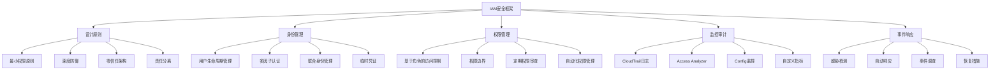

# 第6章：IAM最佳实践和安全原则

## 学习目标

1. 掌握IAM安全设计的核心原则
2. 学习身份和凭证管理最佳实践
3. 实施IAM监控和审计机制
4. 建立IAM安全事件响应流程
5. 掌握IAM合规性要求和实施

## IAM安全架构图



## 6.1 IAM安全设计原则

### 6.1.1 核心安全原则

```python
import boto3
import json
from datetime import datetime, timedelta
import hashlib
import uuid

def implement_security_principles():
    """
    实施IAM安全设计原则
    """
    
    security_principles = {
        "least_privilege": {
            "principle": "最小权限原则",
            "description": "只授予执行任务所需的最小权限",
            "implementation_strategies": [
                "从拒绝所有开始，逐步添加必需权限",
                "定期审查和清理不必要的权限",
                "使用权限边界限制最大权限范围",
                "实施Just-In-Time访问模式",
                "基于实际使用情况调整权限"
            ],
            "best_practices": [
                "避免使用通配符权限（*）",
                "使用具体的资源ARN而非*",
                "定期运行Access Analyzer",
                "监控权限使用情况",
                "实施权限生命周期管理"
            ]
        },
        "defense_in_depth": {
            "principle": "深度防御原则",
            "description": "实施多层安全控制机制",
            "implementation_strategies": [
                "组织级SCP + 账户级策略",
                "权限边界 + 身份策略",
                "网络安全 + 应用安全",
                "加密传输 + 加密存储",
                "监控 + 告警 + 响应"
            ],
            "security_layers": [
                "AWS组织和SCP策略",
                "网络访问控制（VPC、安全组）",
                "IAM身份和权限管理",
                "资源级权限控制",
                "应用程序安全控制",
                "数据加密和保护",
                "监控和审计系统"
            ]
        },
        "zero_trust": {
            "principle": "零信任原则", 
            "description": "不信任任何用户或系统，始终验证",
            "implementation_strategies": [
                "强制身份验证和授权",
                "基于上下文的访问控制",
                "持续监控和验证",
                "最小爆炸半径设计",
                "动态权限调整"
            ],
            "verification_factors": [
                "用户身份（Who）",
                "设备状态（Where）", 
                "应用程序（What）",
                "时间上下文（When）",
                "访问行为（How）",
                "数据分类（Why）"
            ]
        },
        "separation_of_duties": {
            "principle": "职责分离原则",
            "description": "将关键操作分散给不同的人员或系统",
            "implementation_strategies": [
                "管理员和操作员角色分离",
                "开发和生产环境分离",
                "读权限和写权限分离",
                "审计和执行功能分离",
                "审批和执行流程分离"
            ],
            "separation_examples": [
                "数据库管理员不能直接访问应用数据",
                "开发人员不能直接部署到生产环境",
                "安全团队独立于开发团队",
                "审计员独立于被审计系统",
                "备份恢复需要双人授权"
            ]
        }
    }
    
    print("🔐 IAM安全设计原则:")
    for principle_key, principle in security_principles.items():
        print(f"\n{principle['principle']}:")
        print(f"  描述: {principle['description']}")
        
        if 'implementation_strategies' in principle:
            print("  实施策略:")
            for strategy in principle['implementation_strategies']:
                print(f"    • {strategy}")
        
        if 'best_practices' in principle:
            print("  最佳实践:")
            for practice in principle['best_practices']:
                print(f"    ✓ {practice}")
    
    return security_principles

def create_secure_iam_architecture():
    """
    创建安全的IAM架构设计
    """
    
    class SecureIAMArchitecture:
        def __init__(self):
            self.iam = boto3.client('iam')
            self.organizations = boto3.client('organizations')
            self.sts = boto3.client('sts')
        
        def design_role_hierarchy(self):
            """设计角色层次结构"""
            role_hierarchy = {
                "administrative_roles": {
                    "OrganizationAdmin": {
                        "description": "组织管理员，管理AWS组织结构",
                        "permissions": ["organizations:*", "account:*"],
                        "restrictions": ["不能直接访问工作负载", "需要MFA"],
                        "assume_conditions": {
                            "Bool": {"aws:MultiFactorAuthPresent": "true"},
                            "NumericLessThan": {"aws:MultiFactorAuthAge": "1800"}
                        }
                    },
                    "SecurityAdmin": {
                        "description": "安全管理员，管理IAM和安全配置",
                        "permissions": ["iam:*", "config:*", "cloudtrail:*"],
                        "restrictions": ["不能访问应用数据", "独立于开发团队"],
                        "assume_conditions": {
                            "Bool": {"aws:MultiFactorAuthPresent": "true"},
                            "StringEquals": {"aws:PrincipalTag/Department": "Security"}
                        }
                    },
                    "AuditAdmin": {
                        "description": "审计管理员，只读访问审计日志",
                        "permissions": ["*:Get*", "*:List*", "*:Describe*"],
                        "restrictions": ["只读权限", "不能修改配置"],
                        "assume_conditions": {
                            "Bool": {"aws:MultiFactorAuthPresent": "true"}
                        }
                    }
                },
                "operational_roles": {
                    "DevOpsEngineer": {
                        "description": "DevOps工程师，管理基础设施",
                        "permissions": ["ec2:*", "cloudformation:*", "lambda:*"],
                        "restrictions": ["不能修改IAM", "环境隔离"],
                        "assume_conditions": {
                            "StringEquals": {"aws:ResourceTag/Environment": "${aws:PrincipalTag/AllowedEnvironment}"}
                        }
                    },
                    "DatabaseAdmin": {
                        "description": "数据库管理员，管理数据库资源",
                        "permissions": ["rds:*", "dynamodb:*"],
                        "restrictions": ["不能访问应用数据", "只能管理数据库实例"],
                        "assume_conditions": {
                            "Bool": {"aws:MultiFactorAuthPresent": "true"}
                        }
                    }
                },
                "application_roles": {
                    "WebServerRole": {
                        "description": "Web服务器角色",
                        "permissions": ["s3:GetObject", "dynamodb:GetItem"],
                        "restrictions": ["只能访问指定资源"],
                        "assume_conditions": {
                            "StringEquals": {"ec2:SourceInstanceARN": "${aws:TokenIssueTime}"}
                        }
                    },
                    "LambdaExecutionRole": {
                        "description": "Lambda函数执行角色",
                        "permissions": ["logs:*", "s3:GetObject"],
                        "restrictions": ["最小化权限"],
                        "assume_conditions": {
                            "StringEquals": {"aws:SourceArn": "arn:aws:lambda:*"}
                        }
                    }
                }
            }
            
            return role_hierarchy
        
        def implement_mfa_enforcement(self):
            """实施MFA强制策略"""
            mfa_policy = {
                "Version": "2012-10-17",
                "Statement": [
                    {
                        "Sid": "AllowViewAccountInfo",
                        "Effect": "Allow",
                        "Action": [
                            "iam:GetAccountPasswordPolicy",
                            "iam:GetAccountSummary",
                            "iam:ListVirtualMFADevices"
                        ],
                        "Resource": "*"
                    },
                    {
                        "Sid": "AllowManageOwnPasswords",
                        "Effect": "Allow", 
                        "Action": [
                            "iam:ChangePassword",
                            "iam:GetUser"
                        ],
                        "Resource": "arn:aws:iam::*:user/${aws:username}"
                    },
                    {
                        "Sid": "AllowManageOwnMFA",
                        "Effect": "Allow",
                        "Action": [
                            "iam:CreateVirtualMFADevice",
                            "iam:DeleteVirtualMFADevice",
                            "iam:EnableMFADevice",
                            "iam:ListMFADevices",
                            "iam:ResyncMFADevice"
                        ],
                        "Resource": [
                            "arn:aws:iam::*:mfa/${aws:username}",
                            "arn:aws:iam::*:user/${aws:username}"
                        ]
                    },
                    {
                        "Sid": "DenyAllExceptUnlessSignedInWithMFA",
                        "Effect": "Deny",
                        "NotAction": [
                            "iam:ChangePassword",
                            "iam:CreateVirtualMFADevice",
                            "iam:EnableMFADevice",
                            "iam:GetUser",
                            "iam:ListMFADevices",
                            "iam:ListVirtualMFADevices",
                            "iam:ResyncMFADevice",
                            "sts:GetSessionToken"
                        ],
                        "Resource": "*",
                        "Condition": {
                            "BoolIfExists": {
                                "aws:MultiFactorAuthPresent": "false"
                            }
                        }
                    }
                ]
            }
            
            print("🔐 MFA强制策略:")
            print("  - 允许查看账户信息")
            print("  - 允许管理自己的密码和MFA设备") 
            print("  - 拒绝所有其他操作，除非已通过MFA认证")
            
            return mfa_policy
        
        def create_break_glass_procedure(self):
            """创建紧急访问（破玻璃）程序"""
            break_glass_config = {
                "emergency_role": {
                    "name": "EmergencyBreakGlassRole",
                    "description": "紧急情况下的全权限角色",
                    "permissions": ["*:*"],
                    "conditions": {
                        "StringEquals": {
                            "aws:RequestTag/Emergency": "true",
                            "aws:RequestTag/RequestedBy": "${aws:username}",
                            "aws:RequestTag/Reason": "EMERGENCY"
                        },
                        "DateGreaterThan": {
                            "aws:CurrentTime": "${aws:RequestTag/ValidFrom}"
                        },
                        "DateLessThan": {
                            "aws:CurrentTime": "${aws:RequestTag/ValidUntil}"
                        }
                    },
                    "monitoring": {
                        "cloudwatch_alarm": "EmergencyAccessAlarm",
                        "sns_notification": "SecurityTeamTopic",
                        "audit_logging": "EmergencyAccessLogGroup"
                    }
                },
                "activation_process": [
                    "1. 安全团队成员申请紧急访问",
                    "2. 提供详细的紧急情况描述",
                    "3. 获得安全主管的批准",
                    "4. 系统自动创建临时访问令牌",
                    "5. 所有操作被完整记录和监控",
                    "6. 紧急情况结束后立即撤销访问"
                ],
                "automatic_controls": {
                    "max_duration": "4小时",
                    "automatic_revocation": True,
                    "real_time_monitoring": True,
                    "approval_required": True,
                    "full_audit_trail": True
                }
            }
            
            print("🚨 紧急访问（破玻璃）程序:")
            print(f"  角色名称: {break_glass_config['emergency_role']['name']}")
            print(f"  最大持续时间: {break_glass_config['automatic_controls']['max_duration']}")
            print("  激活流程:")
            for step in break_glass_config['activation_process']:
                print(f"    {step}")
            
            return break_glass_config
    
    return SecureIAMArchitecture()

# 实施安全原则
security_principles = implement_security_principles()

# 创建安全架构
secure_arch = create_secure_iam_architecture()
role_hierarchy = secure_arch.design_role_hierarchy()
mfa_policy = secure_arch.implement_mfa_enforcement()
break_glass_config = secure_arch.create_break_glass_procedure()

print("\n📋 角色层次结构示例:")
for category, roles in role_hierarchy.items():
    print(f"\n{category.replace('_', ' ').title()}:")
    for role_name, role_config in roles.items():
        print(f"  {role_name}: {role_config['description']}")
```

## 6.2 身份和凭证管理

### 6.2.1 用户生命周期管理

```python
def implement_user_lifecycle_management():
    """
    实施用户生命周期管理
    """
    
    class UserLifecycleManager:
        def __init__(self):
            self.iam = boto3.client('iam')
            self.sns = boto3.client('sns')
        
        def create_user_onboarding_process(self, user_info):
            """用户入职流程"""
            onboarding_steps = [
                {
                    "step": "用户创建",
                    "action": self._create_user_account,
                    "parameters": user_info
                },
                {
                    "step": "初始权限分配",
                    "action": self._assign_initial_permissions,
                    "parameters": user_info
                },
                {
                    "step": "MFA设置",
                    "action": self._setup_mfa_requirement,
                    "parameters": user_info
                },
                {
                    "step": "培训通知",
                    "action": self._send_training_notification,
                    "parameters": user_info
                },
                {
                    "step": "首次登录",
                    "action": self._track_first_login,
                    "parameters": user_info
                }
            ]
            
            results = []
            for step_config in onboarding_steps:
                try:
                    result = step_config["action"](step_config["parameters"])
                    results.append({
                        "step": step_config["step"],
                        "status": "success",
                        "result": result
                    })
                    print(f"✅ {step_config['step']} 完成")
                except Exception as e:
                    results.append({
                        "step": step_config["step"],
                        "status": "failed",
                        "error": str(e)
                    })
                    print(f"❌ {step_config['step']} 失败: {str(e)}")
            
            return results
        
        def _create_user_account(self, user_info):
            """创建用户账户"""
            username = user_info['username']
            
            try:
                response = self.iam.create_user(
                    UserName=username,
                    Tags=[
                        {'Key': 'Department', 'Value': user_info.get('department', '')},
                        {'Key': 'Role', 'Value': user_info.get('role', '')},
                        {'Key': 'Manager', 'Value': user_info.get('manager', '')},
                        {'Key': 'StartDate', 'Value': datetime.now().strftime('%Y-%m-%d')},
                        {'Key': 'CreatedBy', 'Value': 'UserLifecycleManager'}
                    ]
                )
                
                # 创建登录密钥
                login_profile = self.iam.create_login_profile(
                    UserName=username,
                    Password=self._generate_temporary_password(),
                    PasswordResetRequired=True
                )
                
                return {
                    'user_arn': response['User']['Arn'],
                    'username': username,
                    'temporary_password_required': True
                }
                
            except Exception as e:
                raise Exception(f"用户创建失败: {str(e)}")
        
        def _assign_initial_permissions(self, user_info):
            """分配初始权限"""
            username = user_info['username']
            role = user_info.get('role', '').lower()
            
            # 基于角色的初始权限映射
            role_permissions = {
                'developer': ['ReadOnlyAccess'],
                'administrator': ['PowerUserAccess'],
                'analyst': ['ReadOnlyAccess'],
                'manager': ['ViewOnlyAccess']
            }
            
            permissions = role_permissions.get(role, ['ReadOnlyAccess'])
            
            for permission in permissions:
                try:
                    self.iam.attach_user_policy(
                        UserName=username,
                        PolicyArn=f'arn:aws:iam::aws:policy/{permission}'
                    )
                except Exception as e:
                    print(f"附加策略 {permission} 失败: {str(e)}")
            
            return {'assigned_permissions': permissions}
        
        def _setup_mfa_requirement(self, user_info):
            """设置MFA要求"""
            username = user_info['username']
            
            # 附加MFA强制策略
            mfa_policy_arn = self._get_or_create_mfa_policy()
            
            try:
                self.iam.attach_user_policy(
                    UserName=username,
                    PolicyArn=mfa_policy_arn
                )
                return {'mfa_policy_attached': True}
            except Exception as e:
                raise Exception(f"MFA策略附加失败: {str(e)}")
        
        def _get_or_create_mfa_policy(self):
            """获取或创建MFA策略"""
            policy_name = 'ForceMFAPolicy'
            
            try:
                # 尝试获取现有策略
                response = self.iam.get_policy(
                    PolicyArn=f'arn:aws:iam::{self._get_account_id()}:policy/{policy_name}'
                )
                return response['Policy']['Arn']
            except:
                # 策略不存在，创建新的
                mfa_policy = {
                    "Version": "2012-10-17",
                    "Statement": [
                        {
                            "Effect": "Deny",
                            "NotAction": [
                                "iam:ChangePassword",
                                "iam:CreateVirtualMFADevice",
                                "iam:EnableMFADevice",
                                "iam:GetUser",
                                "iam:ListMFADevices",
                                "iam:ListVirtualMFADevices",
                                "iam:ResyncMFADevice",
                                "sts:GetSessionToken"
                            ],
                            "Resource": "*",
                            "Condition": {
                                "BoolIfExists": {
                                    "aws:MultiFactorAuthPresent": "false"
                                }
                            }
                        }
                    ]
                }
                
                response = self.iam.create_policy(
                    PolicyName=policy_name,
                    PolicyDocument=json.dumps(mfa_policy),
                    Description='Force MFA for all users'
                )
                
                return response['Policy']['Arn']
        
        def _send_training_notification(self, user_info):
            """发送培训通知"""
            # 模拟发送培训通知
            notification = {
                'recipient': user_info.get('email', ''),
                'subject': 'AWS安全培训要求',
                'message': f"欢迎 {user_info['username']}! 请完成必要的AWS安全培训。"
            }
            
            print(f"📧 培训通知已发送给 {user_info['username']}")
            return notification
        
        def _track_first_login(self, user_info):
            """跟踪首次登录"""
            # 设置首次登录跟踪
            return {'first_login_tracking_enabled': True}
        
        def _generate_temporary_password(self):
            """生成临时密码"""
            import secrets
            import string
            
            # 生成复杂的临时密码
            alphabet = string.ascii_letters + string.digits + "!@#$%^&*"
            password = ''.join(secrets.choice(alphabet) for i in range(12))
            return password
        
        def _get_account_id(self):
            """获取当前账户ID"""
            sts = boto3.client('sts')
            return sts.get_caller_identity()['Account']
        
        def create_user_offboarding_process(self, username):
            """用户离职流程"""
            offboarding_steps = [
                {
                    "step": "禁用用户访问",
                    "action": self._disable_user_access,
                    "parameters": {"username": username}
                },
                {
                    "step": "备份用户数据",
                    "action": self._backup_user_data,
                    "parameters": {"username": username}
                },
                {
                    "step": "撤销权限",
                    "action": self._revoke_permissions,
                    "parameters": {"username": username}
                },
                {
                    "step": "删除访问密钥",
                    "action": self._delete_access_keys,
                    "parameters": {"username": username}
                },
                {
                    "step": "审计用户活动",
                    "action": self._audit_user_activity,
                    "parameters": {"username": username}
                }
            ]
            
            results = []
            for step_config in offboarding_steps:
                try:
                    result = step_config["action"](step_config["parameters"])
                    results.append({
                        "step": step_config["step"],
                        "status": "success",
                        "result": result
                    })
                    print(f"✅ {step_config['step']} 完成")
                except Exception as e:
                    results.append({
                        "step": step_config["step"],
                        "status": "failed",
                        "error": str(e)
                    })
                    print(f"❌ {step_config['step']} 失败: {str(e)}")
            
            return results
        
        def _disable_user_access(self, params):
            """禁用用户访问"""
            username = params['username']
            
            try:
                # 删除登录档案
                self.iam.delete_login_profile(UserName=username)
                print(f"用户 {username} 的控制台访问已禁用")
                
                return {'console_access_disabled': True}
            except Exception as e:
                if 'NoSuchEntity' not in str(e):
                    raise e
                return {'console_access_disabled': False, 'reason': 'No login profile'}
        
        def _backup_user_data(self, params):
            """备份用户数据"""
            username = params['username']
            
            # 获取用户信息
            user_info = self.iam.get_user(UserName=username)
            
            # 获取用户的策略
            attached_policies = self.iam.list_attached_user_policies(UserName=username)
            inline_policies = self.iam.list_user_policies(UserName=username)
            
            backup_data = {
                'user_info': user_info,
                'attached_policies': attached_policies,
                'inline_policies': inline_policies,
                'backup_timestamp': datetime.now().isoformat()
            }
            
            print(f"用户 {username} 的数据已备份")
            return backup_data
        
        def _revoke_permissions(self, params):
            """撤销权限"""
            username = params['username']
            
            # 分离所有附加的策略
            attached_policies = self.iam.list_attached_user_policies(UserName=username)
            for policy in attached_policies['AttachedPolicies']:
                self.iam.detach_user_policy(
                    UserName=username,
                    PolicyArn=policy['PolicyArn']
                )
            
            # 删除所有内联策略
            inline_policies = self.iam.list_user_policies(UserName=username)
            for policy_name in inline_policies['PolicyNames']:
                self.iam.delete_user_policy(
                    UserName=username,
                    PolicyName=policy_name
                )
            
            return {
                'attached_policies_removed': len(attached_policies['AttachedPolicies']),
                'inline_policies_removed': len(inline_policies['PolicyNames'])
            }
        
        def _delete_access_keys(self, params):
            """删除访问密钥"""
            username = params['username']
            
            access_keys = self.iam.list_access_keys(UserName=username)
            for key in access_keys['AccessKeyMetadata']:
                self.iam.delete_access_key(
                    UserName=username,
                    AccessKeyId=key['AccessKeyId']
                )
            
            return {'access_keys_deleted': len(access_keys['AccessKeyMetadata'])}
        
        def _audit_user_activity(self, params):
            """审计用户活动"""
            username = params['username']
            
            # 这里应该集成CloudTrail查询用户最近的活动
            audit_summary = {
                'username': username,
                'audit_period': '30 days',
                'activities_reviewed': True,
                'suspicious_activities': []  # 需要实际的CloudTrail集成
            }
            
            return audit_summary
    
    return UserLifecycleManager()

# 演示用户生命周期管理
lifecycle_manager = implement_user_lifecycle_management()

# 模拟用户入职
new_user_info = {
    'username': 'john.doe',
    'email': 'john.doe@company.com',
    'department': 'Engineering',
    'role': 'Developer',
    'manager': 'jane.smith'
}

print("👤 用户入职流程演示:")
# onboarding_results = lifecycle_manager.create_user_onboarding_process(new_user_info)

print("\n📋 入职流程步骤:")
print("  1. 用户创建 - 创建IAM用户并设置标签")
print("  2. 初始权限分配 - 基于角色分配基础权限")
print("  3. MFA设置 - 强制MFA策略附加")
print("  4. 培训通知 - 发送安全培训通知")
print("  5. 首次登录跟踪 - 启用登录监控")

print("\n📋 离职流程步骤:")
print("  1. 禁用用户访问 - 删除控制台登录")
print("  2. 备份用户数据 - 保存用户配置信息")
print("  3. 撤销权限 - 移除所有IAM策略")
print("  4. 删除访问密钥 - 清理所有API密钥")
print("  5. 审计用户活动 - 生成活动审计报告")
```

## 总结

本章介绍了IAM安全最佳实践的核心内容：

1. **安全设计原则**: 最小权限、深度防御、零信任和职责分离四大核心原则
2. **身份管理**: 用户生命周期管理、MFA强制实施和紧急访问程序
3. **架构设计**: 角色层次结构、权限分离和安全控制实施
4. **自动化管理**: 用户入职/离职流程自动化和权限生命周期管理

通过本章学习，您应该能够：
- 设计和实施安全的IAM架构
- 建立完整的用户生命周期管理流程
- 实施MFA和其他安全控制措施
- 创建紧急访问和事件响应程序

下一章我们将学习如何使用AWS CDK管理IAM资源。