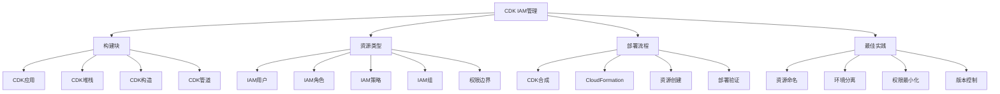

# 第7章：使用CDK管理IAM资源

## 学习目标

1. 掌握AWS CDK Python版本的基本使用
2. 学习使用CDK创建和管理IAM用户、角色、策略
3. 实现IAM资源的基础设施即代码
4. 掌握CDK中IAM的最佳实践和模式
5. 实施CDK项目的部署和管理

## CDK IAM架构图



## 7.1 CDK基础设置

### 7.1.1 CDK项目初始化

```python
# cdk_project/app.py
#!/usr/bin/env python3
import aws_cdk as cdk
from iam_stack import IamStack

app = cdk.App()
IamStack(app, "IamStack",
    env=cdk.Environment(
        account="123456789012",  # 替换为您的账户ID
        region="us-east-1"
    )
)

app.synth()
```

```python
# cdk_project/iam_stack.py
from aws_cdk import (
    Stack,
    aws_iam as iam,
    aws_s3 as s3,
    Tags,
    Duration
)
from constructs import Construct
import json

class IamStack(Stack):
    """
    IAM资源管理堆栈
    """
    
    def __init__(self, scope: Construct, construct_id: str, **kwargs) -> None:
        super().__init__(scope, construct_id, **kwargs)
        
        # 创建IAM资源
        self.create_iam_policies()
        self.create_iam_roles()
        self.create_iam_users()
        self.create_iam_groups()
        self.create_service_roles()
        
        # 添加标签
        self.add_tags()
    
    def create_iam_policies(self):
        """创建IAM策略"""
        
        # 1. 创建开发者权限边界策略
        self.developer_boundary_policy = iam.ManagedPolicy(
            self, "DeveloperPermissionsBoundary",
            managed_policy_name="DeveloperPermissionsBoundary",
            description="权限边界策略，限制开发者的最大权限",
            statements=[
                # 允许的服务
                iam.PolicyStatement(
                    effect=iam.Effect.ALLOW,
                    actions=[
                        "s3:*",
                        "dynamodb:*",
                        "lambda:*",
                        "apigateway:*",
                        "cloudformation:*",
                        "logs:*",
                        "cloudwatch:*",
                        "ec2:Describe*",
                        "ec2:RunInstances",
                        "ec2:StartInstances",
                        "ec2:StopInstances"
                    ],
                    resources=["*"]
                ),
                # 拒绝高风险操作
                iam.PolicyStatement(
                    effect=iam.Effect.DENY,
                    actions=[
                        "iam:CreateRole",
                        "iam:DeleteRole",
                        "iam:AttachRolePolicy",
                        "iam:DetachRolePolicy",
                        "organizations:*",
                        "account:*",
                        "billing:*"
                    ],
                    resources=["*"]
                ),
                # 限制实例类型
                iam.PolicyStatement(
                    effect=iam.Effect.DENY,
                    actions=["ec2:RunInstances"],
                    resources=["arn:aws:ec2:*:*:instance/*"],
                    conditions={
                        "ForAnyValue:StringNotEquals": {
                            "ec2:InstanceType": [
                                "t2.micro", "t2.small", "t2.medium",
                                "t3.micro", "t3.small", "t3.medium"
                            ]
                        }
                    }
                )
            ]
        )
        
        # 2. 创建S3只读访问策略
        self.s3_readonly_policy = iam.ManagedPolicy(
            self, "S3ReadOnlyPolicy",
            managed_policy_name="S3ReadOnlyAccess-Custom",
            description="自定义S3只读访问策略",
            statements=[
                iam.PolicyStatement(
                    effect=iam.Effect.ALLOW,
                    actions=[
                        "s3:GetObject",
                        "s3:GetObjectVersion",
                        "s3:ListBucket",
                        "s3:GetBucketLocation"
                    ],
                    resources=[
                        "arn:aws:s3:::company-data-*",
                        "arn:aws:s3:::company-data-*/*"
                    ]
                )
            ]
        )
        
        # 3. 创建Lambda执行策略
        self.lambda_execution_policy = iam.ManagedPolicy(
            self, "LambdaExecutionPolicy",
            managed_policy_name="LambdaCustomExecutionPolicy", 
            description="Lambda函数自定义执行策略",
            statements=[
                iam.PolicyStatement(
                    effect=iam.Effect.ALLOW,
                    actions=[
                        "logs:CreateLogGroup",
                        "logs:CreateLogStream",
                        "logs:PutLogEvents"
                    ],
                    resources=["arn:aws:logs:*:*:*"]
                ),
                iam.PolicyStatement(
                    effect=iam.Effect.ALLOW,
                    actions=[
                        "s3:GetObject",
                        "s3:PutObject"
                    ],
                    resources=["arn:aws:s3:::lambda-data-bucket/*"]
                ),
                iam.PolicyStatement(
                    effect=iam.Effect.ALLOW,
                    actions=[
                        "dynamodb:GetItem",
                        "dynamodb:PutItem",
                        "dynamodb:UpdateItem",
                        "dynamodb:DeleteItem"
                    ],
                    resources=["arn:aws:dynamodb:*:*:table/lambda-*"]
                )
            ]
        )
    
    def create_iam_roles(self):
        """创建IAM角色"""
        
        # 1. 创建EC2实例角色
        self.ec2_role = iam.Role(
            self, "EC2InstanceRole",
            role_name="EC2-WebServer-Role",
            description="EC2 Web服务器角色",
            assumed_by=iam.ServicePrincipal("ec2.amazonaws.com"),
            managed_policies=[
                iam.ManagedPolicy.from_aws_managed_policy_name("AmazonS3ReadOnlyAccess"),
                iam.ManagedPolicy.from_aws_managed_policy_name("CloudWatchAgentServerPolicy")
            ],
            inline_policies={
                "CustomWebServerPolicy": iam.PolicyDocument(
                    statements=[
                        iam.PolicyStatement(
                            effect=iam.Effect.ALLOW,
                            actions=[
                                "s3:PutObject",
                                "s3:PutObjectAcl"
                            ],
                            resources=["arn:aws:s3:::web-server-logs/*"]
                        ),
                        iam.PolicyStatement(
                            effect=iam.Effect.ALLOW,
                            actions=[
                                "ssm:GetParameter",
                                "ssm:GetParameters",
                                "ssm:GetParametersByPath"
                            ],
                            resources=["arn:aws:ssm:*:*:parameter/webserver/*"]
                        )
                    ]
                )
            },
            max_session_duration=Duration.hours(4)
        )
        
        # 创建实例配置文件
        self.ec2_instance_profile = iam.InstanceProfile(
            self, "EC2InstanceProfile",
            instance_profile_name="EC2-WebServer-Profile",
            role=self.ec2_role
        )
        
        # 2. 创建Lambda执行角色
        self.lambda_role = iam.Role(
            self, "LambdaExecutionRole",
            role_name="Lambda-DataProcessor-Role",
            description="Lambda数据处理函数角色",
            assumed_by=iam.ServicePrincipal("lambda.amazonaws.com"),
            managed_policies=[
                self.lambda_execution_policy
            ]
        )
        
        # 3. 创建跨账户访问角色
        self.cross_account_role = iam.Role(
            self, "CrossAccountRole",
            role_name="CrossAccount-DataAccess-Role",
            description="跨账户数据访问角色",
            assumed_by=iam.AccountPrincipal("111122223333"),  # 受信任的账户ID
            external_ids=["unique-external-id-12345"],
            managed_policies=[
                self.s3_readonly_policy
            ],
            inline_policies={
                "CrossAccountDataPolicy": iam.PolicyDocument(
                    statements=[
                        iam.PolicyStatement(
                            effect=iam.Effect.ALLOW,
                            actions=[
                                "dynamodb:GetItem",
                                "dynamodb:Query"
                            ],
                            resources=["arn:aws:dynamodb:*:*:table/shared-data"]
                        )
                    ]
                )
            }
        )
        
        # 4. 创建带权限边界的开发者角色
        self.developer_role = iam.Role(
            self, "DeveloperRole", 
            role_name="Developer-AssumeRole",
            description="开发者代入角色（带权限边界）",
            assumed_by=iam.AccountPrincipal(self.account),
            permissions_boundary=self.developer_boundary_policy,
            managed_policies=[
                iam.ManagedPolicy.from_aws_managed_policy_name("PowerUserAccess")
            ]
        )
    
    def create_iam_users(self):
        """创建IAM用户"""
        
        # 1. 创建开发者用户
        self.developer_user = iam.User(
            self, "DeveloperUser",
            user_name="john.developer",
            permissions_boundary=self.developer_boundary_policy,
            managed_policies=[
                self.s3_readonly_policy
            ]
        )
        
        # 2. 创建分析师用户
        self.analyst_user = iam.User(
            self, "AnalystUser", 
            user_name="jane.analyst",
            managed_policies=[
                iam.ManagedPolicy.from_aws_managed_policy_name("ReadOnlyAccess")
            ]
        )
        
        # 为用户创建访问密钥（仅在必要时）
        self.developer_access_key = iam.AccessKey(
            self, "DeveloperAccessKey",
            user=self.developer_user
        )
    
    def create_iam_groups(self):
        """创建IAM组"""
        
        # 1. 创建开发者组
        self.developers_group = iam.Group(
            self, "DevelopersGroup",
            group_name="Developers",
            managed_policies=[
                self.s3_readonly_policy,
                iam.ManagedPolicy.from_aws_managed_policy_name("AWSCodeCommitReadOnly")
            ]
        )
        
        # 将用户添加到组
        self.developers_group.add_user(self.developer_user)
        
        # 2. 创建管理员组
        self.admins_group = iam.Group(
            self, "AdminsGroup",
            group_name="Administrators", 
            managed_policies=[
                iam.ManagedPolicy.from_aws_managed_policy_name("AdministratorAccess")
            ]
        )
        
        # 3. 创建只读组
        self.readonly_group = iam.Group(
            self, "ReadOnlyGroup",
            group_name="ReadOnlyUsers",
            managed_policies=[
                iam.ManagedPolicy.from_aws_managed_policy_name("ReadOnlyAccess")
            ]
        )
        
        self.readonly_group.add_user(self.analyst_user)
    
    def create_service_roles(self):
        """创建服务特定角色"""
        
        # 1. 创建ECS任务角色
        self.ecs_task_role = iam.Role(
            self, "ECSTaskRole",
            role_name="ECS-TaskExecution-Role",
            description="ECS任务执行角色",
            assumed_by=iam.ServicePrincipal("ecs-tasks.amazonaws.com"),
            managed_policies=[
                iam.ManagedPolicy.from_aws_managed_policy_name("service-role/AmazonECSTaskExecutionRolePolicy")
            ],
            inline_policies={
                "ECSTaskPolicy": iam.PolicyDocument(
                    statements=[
                        iam.PolicyStatement(
                            effect=iam.Effect.ALLOW,
                            actions=[
                                "ssm:GetParameter",
                                "kms:Decrypt"
                            ],
                            resources=[
                                "arn:aws:ssm:*:*:parameter/ecs/*",
                                "arn:aws:kms:*:*:key/*"
                            ]
                        )
                    ]
                )
            }
        )
        
        # 2. 创建API Gateway执行角色
        self.apigateway_role = iam.Role(
            self, "APIGatewayRole",
            role_name="APIGateway-Execution-Role", 
            description="API Gateway执行角色",
            assumed_by=iam.ServicePrincipal("apigateway.amazonaws.com"),
            managed_policies=[
                iam.ManagedPolicy.from_aws_managed_policy_name("service-role/AmazonAPIGatewayPushToCloudWatchLogs")
            ]
        )
        
        # 3. 创建CloudFormation执行角色
        self.cloudformation_role = iam.Role(
            self, "CloudFormationRole",
            role_name="CloudFormation-Execution-Role",
            description="CloudFormation堆栈执行角色",
            assumed_by=iam.ServicePrincipal("cloudformation.amazonaws.com"),
            managed_policies=[
                iam.ManagedPolicy.from_aws_managed_policy_name("PowerUserAccess")
            ]
        )
    
    def add_tags(self):
        """添加标签"""
        tags_config = {
            "Environment": "Development",
            "Project": "IAM-Management",
            "ManagedBy": "CDK",
            "Owner": "DevOps-Team"
        }
        
        for key, value in tags_config.items():
            Tags.of(self).add(key, value)
```

```python
# cdk_project/requirements.txt
aws-cdk-lib==2.100.0
constructs>=10.0.0,<11.0.0
```

```python
# cdk_project/cdk.json
{
  "app": "python3 app.py",
  "watch": {
    "include": [
      "**"
    ],
    "exclude": [
      "README.md",
      "cdk*.json",
      "requirements*.txt",
      "source.bat",
      "**/__pycache__",
      "**/.venv"
    ]
  },
  "context": {
    "@aws-cdk/aws-lambda:recognizeLayerVersion": true,
    "@aws-cdk/core:checkSecretUsage": true,
    "@aws-cdk/core:target-partitions": [
      "aws",
      "aws-cn"
    ],
    "@aws-cdk-containers/ecs-service-extensions:enableDefaultLogDriver": true,
    "@aws-cdk/aws-ec2:uniqueImdsv2TemplateName": true,
    "@aws-cdk/aws-ecs:arnFormatIncludesClusterName": true,
    "@aws-cdk/core:validateSnapshotRemovalPolicy": true,
    "@aws-cdk/aws-codepipeline:crossAccountKeyAliasStackSafeResourceName": true,
    "@aws-cdk/aws-s3:createDefaultLoggingPolicy": true,
    "@aws-cdk/aws-sns-subscriptions:restrictSqsDescryption": true
  }
}
```

## 7.2 高级CDK模式

### 7.2.1 可重用的IAM构造

```python
# constructs/secure_role.py
from aws_cdk import (
    aws_iam as iam,
    Duration
)
from constructs import Construct
from typing import List, Dict, Optional

class SecureRole(Construct):
    """
    安全的IAM角色构造，包含最佳实践
    """
    
    def __init__(
        self, 
        scope: Construct, 
        construct_id: str,
        role_name: str,
        assumed_by: iam.IPrincipal,
        description: str = "",
        managed_policies: Optional[List[iam.IManagedPolicy]] = None,
        inline_policies: Optional[Dict[str, iam.PolicyDocument]] = None,
        permissions_boundary: Optional[iam.IManagedPolicy] = None,
        max_session_duration: Duration = Duration.hours(1),
        external_ids: Optional[List[str]] = None,
        conditions: Optional[Dict] = None,
        require_mfa: bool = False,
        **kwargs
    ):
        super().__init__(scope, construct_id, **kwargs)
        
        self.role_name = role_name
        self.require_mfa = require_mfa
        
        # 构建信任策略条件
        trust_conditions = self._build_trust_conditions(conditions, require_mfa)
        
        # 创建角色
        self.role = iam.Role(
            self, "Role",
            role_name=role_name,
            description=description or f"Secure role: {role_name}",
            assumed_by=assumed_by,
            managed_policies=managed_policies or [],
            inline_policies=inline_policies or {},
            permissions_boundary=permissions_boundary,
            max_session_duration=max_session_duration,
            external_ids=external_ids
        )
        
        # 如果需要MFA，添加条件到信任策略
        if trust_conditions:
            self._add_trust_policy_conditions(trust_conditions)
        
        # 添加安全标签
        self._add_security_tags()
    
    def _build_trust_conditions(self, conditions: Optional[Dict], require_mfa: bool) -> Dict:
        """构建信任策略条件"""
        trust_conditions = conditions or {}
        
        if require_mfa:
            trust_conditions.update({
                "Bool": {
                    "aws:MultiFactorAuthPresent": "true"
                },
                "NumericLessThan": {
                    "aws:MultiFactorAuthAge": "3600"  # MFA在1小时内有效
                }
            })
        
        return trust_conditions
    
    def _add_trust_policy_conditions(self, conditions: Dict):
        """添加信任策略条件"""
        # 由于CDK的限制，这里需要使用低级别的CloudFormation资源
        cfn_role = self.role.node.default_child
        
        # 获取现有的信任策略
        assume_role_policy = cfn_role.assume_role_policy_document
        
        # 添加条件到第一个语句
        if assume_role_policy and "Statement" in assume_role_policy:
            for statement in assume_role_policy["Statement"]:
                if "Condition" not in statement:
                    statement["Condition"] = {}
                statement["Condition"].update(conditions)
    
    def _add_security_tags(self):
        """添加安全标签"""
        security_tags = {
            "SecurityLevel": "High" if self.require_mfa else "Medium",
            "MFARequired": str(self.require_mfa),
            "CreatedBy": "SecureRoleConstruct",
            "LastReviewed": "2024-12-11"
        }
        
        for key, value in security_tags.items():
            self.role.tags.set_tag(key, value)
    
    def add_to_principals_policy(self, statement: iam.PolicyStatement):
        """向角色添加策略语句"""
        self.role.add_to_principals_policy(statement)
    
    def grant_assume_role(self, grantee: iam.IPrincipal):
        """授予其他主体代入此角色的权限"""
        return self.role.grant_assume_role(grantee)

class ServiceRole(SecureRole):
    """
    服务角色构造，专门用于AWS服务
    """
    
    def __init__(
        self,
        scope: Construct,
        construct_id: str,
        service_name: str,
        role_name: Optional[str] = None,
        **kwargs
    ):
        if not role_name:
            role_name = f"{service_name.title()}ServiceRole"
        
        super().__init__(
            scope,
            construct_id,
            role_name=role_name,
            assumed_by=iam.ServicePrincipal(f"{service_name}.amazonaws.com"),
            description=f"Service role for {service_name}",
            **kwargs
        )

class CrossAccountRole(SecureRole):
    """
    跨账户访问角色构造
    """
    
    def __init__(
        self,
        scope: Construct,
        construct_id: str,
        trusted_account_id: str,
        external_id: str,
        role_name: Optional[str] = None,
        **kwargs
    ):
        if not role_name:
            role_name = f"CrossAccount-{trusted_account_id}-Role"
        
        super().__init__(
            scope,
            construct_id,
            role_name=role_name,
            assumed_by=iam.AccountPrincipal(trusted_account_id),
            external_ids=[external_id],
            description=f"Cross-account role for account {trusted_account_id}",
            require_mfa=True,  # 跨账户角色默认需要MFA
            **kwargs
        )
```

### 7.2.2 环境特定的IAM配置

```python
# stacks/environment_iam_stack.py
from aws_cdk import (
    Stack,
    aws_iam as iam,
    Environment
)
from constructs import Construct
from constructs.secure_role import SecureRole, ServiceRole, CrossAccountRole
from typing import Dict, Any

class EnvironmentIamStack(Stack):
    """
    环境特定的IAM堆栈
    """
    
    def __init__(
        self, 
        scope: Construct, 
        construct_id: str,
        environment_config: Dict[str, Any],
        **kwargs
    ) -> None:
        super().__init__(scope, construct_id, **kwargs)
        
        self.environment_name = environment_config["name"]
        self.is_production = environment_config.get("is_production", False)
        
        # 根据环境创建不同的资源
        self.create_environment_policies(environment_config)
        self.create_environment_roles(environment_config)
        self.create_monitoring_resources()
    
    def create_environment_policies(self, config: Dict[str, Any]):
        """创建环境特定的策略"""
        
        # 基础权限策略
        base_permissions = config.get("base_permissions", [])
        
        self.environment_policy = iam.ManagedPolicy(
            self, "EnvironmentPolicy",
            managed_policy_name=f"{self.environment_name}-BasePolicy",
            description=f"Base policy for {self.environment_name} environment",
            statements=[
                iam.PolicyStatement(
                    effect=iam.Effect.ALLOW,
                    actions=base_permissions,
                    resources=["*"],
                    conditions=self._get_environment_conditions()
                )
            ]
        )
        
        # 生产环境额外限制
        if self.is_production:
            self.production_restrictions = iam.ManagedPolicy(
                self, "ProductionRestrictions",
                managed_policy_name=f"{self.environment_name}-Restrictions",
                description="Production environment restrictions",
                statements=[
                    iam.PolicyStatement(
                        effect=iam.Effect.DENY,
                        actions=[
                            "*:Delete*",
                            "*:Terminate*"
                        ],
                        resources=["*"],
                        conditions={
                            "StringEquals": {
                                "aws:ResourceTag/Environment": "Production",
                                "aws:ResourceTag/Protected": "true"
                            }
                        }
                    )
                ]
            )
    
    def create_environment_roles(self, config: Dict[str, Any]):
        """创建环境特定的角色"""
        
        # 应用程序角色
        self.app_roles = {}
        for app_name, app_config in config.get("applications", {}).items():
            role = ServiceRole(
                self, f"{app_name}Role",
                service_name=app_config.get("service", "lambda"),
                role_name=f"{self.environment_name}-{app_name}-Role",
                managed_policies=[self.environment_policy]
            )
            
            # 添加应用特定权限
            if "permissions" in app_config:
                for permission in app_config["permissions"]:
                    role.add_to_principals_policy(
                        iam.PolicyStatement(
                            effect=iam.Effect.ALLOW,
                            actions=permission["actions"],
                            resources=permission["resources"]
                        )
                    )
            
            self.app_roles[app_name] = role
        
        # 运维角色
        if config.get("create_ops_role", False):
            ops_permissions = [
                iam.ManagedPolicy.from_aws_managed_policy_name("ReadOnlyAccess")
            ]
            
            if not self.is_production:
                ops_permissions.append(
                    iam.ManagedPolicy.from_aws_managed_policy_name("PowerUserAccess")
                )
            
            self.ops_role = SecureRole(
                self, "OpsRole",
                role_name=f"{self.environment_name}-Operations-Role",
                assumed_by=iam.AccountPrincipal(self.account),
                managed_policies=ops_permissions,
                require_mfa=True,
                max_session_duration=Duration.hours(4 if self.is_production else 8)
            )
    
    def create_monitoring_resources(self):
        """创建监控相关资源"""
        
        # CloudWatch角色
        self.cloudwatch_role = ServiceRole(
            self, "CloudWatchRole",
            service_name="events",
            role_name=f"{self.environment_name}-CloudWatch-Role"
        )
        
        self.cloudwatch_role.add_to_principals_policy(
            iam.PolicyStatement(
                effect=iam.Effect.ALLOW,
                actions=[
                    "sns:Publish",
                    "lambda:InvokeFunction"
                ],
                resources=[
                    f"arn:aws:sns:*:{self.account}:{self.environment_name}-*",
                    f"arn:aws:lambda:*:{self.account}:function:{self.environment_name}-*"
                ]
            )
        )
    
    def _get_environment_conditions(self) -> Dict:
        """获取环境特定的条件"""
        conditions = {
            "StringEquals": {
                "aws:ResourceTag/Environment": self.environment_name
            }
        }
        
        if self.is_production:
            conditions["Bool"] = {
                "aws:SecureTransport": "true"
            }
        
        return conditions

# 环境配置
ENVIRONMENT_CONFIGS = {
    "development": {
        "name": "Development",
        "is_production": False,
        "base_permissions": [
            "s3:*",
            "dynamodb:*",
            "lambda:*",
            "logs:*",
            "cloudwatch:*"
        ],
        "applications": {
            "web-api": {
                "service": "lambda",
                "permissions": [
                    {
                        "actions": ["dynamodb:*"],
                        "resources": ["arn:aws:dynamodb:*:*:table/dev-*"]
                    }
                ]
            },
            "data-processor": {
                "service": "ecs-tasks", 
                "permissions": [
                    {
                        "actions": ["s3:*"],
                        "resources": ["arn:aws:s3:::dev-data-*/*"]
                    }
                ]
            }
        },
        "create_ops_role": True
    },
    "production": {
        "name": "Production",
        "is_production": True,
        "base_permissions": [
            "s3:GetObject",
            "s3:PutObject",
            "dynamodb:GetItem",
            "dynamodb:PutItem",
            "dynamodb:UpdateItem",
            "logs:CreateLogGroup",
            "logs:CreateLogStream",
            "logs:PutLogEvents"
        ],
        "applications": {
            "web-api": {
                "service": "lambda",
                "permissions": [
                    {
                        "actions": [
                            "dynamodb:GetItem",
                            "dynamodb:PutItem", 
                            "dynamodb:UpdateItem"
                        ],
                        "resources": ["arn:aws:dynamodb:*:*:table/prod-*"]
                    }
                ]
            }
        },
        "create_ops_role": True
    }
}
```

## 7.3 CDK部署和管理

### 7.3.1 部署脚本和最佳实践

```python
# scripts/deploy.py
#!/usr/bin/env python3
"""
CDK部署脚本
"""
import subprocess
import sys
import json
import boto3
from typing import List, Dict

class CDKDeployManager:
    """CDK部署管理器"""
    
    def __init__(self, app_path: str = "app.py"):
        self.app_path = app_path
        self.sts = boto3.client('sts')
    
    def validate_prerequisites(self) -> bool:
        """验证部署前置条件"""
        print("🔍 验证部署前置条件...")
        
        # 检查AWS凭证
        try:
            identity = self.sts.get_caller_identity()
            print(f"✅ AWS账户: {identity['Account']}")
            print(f"✅ IAM用户/角色: {identity['Arn']}")
        except Exception as e:
            print(f"❌ AWS凭证验证失败: {e}")
            return False
        
        # 检查CDK版本
        try:
            result = subprocess.run(['cdk', '--version'], capture_output=True, text=True)
            if result.returncode == 0:
                print(f"✅ CDK版本: {result.stdout.strip()}")
            else:
                print("❌ CDK未安装或不可用")
                return False
        except Exception as e:
            print(f"❌ CDK检查失败: {e}")
            return False
        
        # 检查Python依赖
        try:
            import aws_cdk as cdk
            print(f"✅ AWS CDK库版本: {cdk.__version__}")
        except ImportError:
            print("❌ AWS CDK Python库未安装")
            return False
        
        return True
    
    def bootstrap_environment(self, environments: List[str]) -> bool:
        """引导CDK环境"""
        print("🚀 引导CDK环境...")
        
        for env in environments:
            try:
                cmd = ['cdk', 'bootstrap', env]
                result = subprocess.run(cmd, check=True, capture_output=True, text=True)
                print(f"✅ 环境 {env} 引导成功")
            except subprocess.CalledProcessError as e:
                print(f"❌ 环境 {env} 引导失败: {e.stderr}")
                return False
        
        return True
    
    def synthesize_stacks(self, stack_names: List[str] = None) -> bool:
        """合成CloudFormation模板"""
        print("🔧 合成CloudFormation模板...")
        
        try:
            cmd = ['cdk', 'synth']
            if stack_names:
                cmd.extend(stack_names)
            
            result = subprocess.run(cmd, check=True, capture_output=True, text=True)
            print("✅ 模板合成成功")
            
            # 显示合成的堆栈
            cmd_list = ['cdk', 'list']
            result_list = subprocess.run(cmd_list, capture_output=True, text=True)
            if result_list.returncode == 0:
                stacks = result_list.stdout.strip().split('\n')
                print(f"📋 发现堆栈: {', '.join(stacks)}")
            
            return True
        except subprocess.CalledProcessError as e:
            print(f"❌ 模板合成失败: {e.stderr}")
            return False
    
    def deploy_stacks(
        self, 
        stack_names: List[str] = None,
        require_approval: bool = True,
        rollback: bool = True,
        parameters: Dict[str, str] = None
    ) -> bool:
        """部署堆栈"""
        print("🚀 开始部署堆栈...")
        
        try:
            cmd = ['cdk', 'deploy']
            
            if stack_names:
                cmd.extend(stack_names)
            else:
                cmd.append('--all')
            
            if not require_approval:
                cmd.append('--require-approval=never')
            
            if not rollback:
                cmd.append('--no-rollback')
            
            if parameters:
                for key, value in parameters.items():
                    cmd.extend(['--parameters', f'{key}={value}'])
            
            # 添加输出格式
            cmd.extend(['--outputs-file', 'cdk-outputs.json'])
            
            result = subprocess.run(cmd, check=True)
            print("✅ 堆栈部署成功")
            
            # 读取输出
            self.display_outputs()
            
            return True
        except subprocess.CalledProcessError as e:
            print(f"❌ 堆栈部署失败")
            return False
    
    def display_outputs(self):
        """显示堆栈输出"""
        try:
            with open('cdk-outputs.json', 'r') as f:
                outputs = json.load(f)
            
            print("\n📄 堆栈输出:")
            for stack_name, stack_outputs in outputs.items():
                print(f"\n{stack_name}:")
                for key, value in stack_outputs.items():
                    print(f"  {key}: {value}")
        except FileNotFoundError:
            print("📄 无堆栈输出文件")
        except Exception as e:
            print(f"❌ 读取输出失败: {e}")
    
    def run_security_scan(self) -> bool:
        """运行安全扫描"""
        print("🔒 运行安全扫描...")
        
        try:
            # 使用cdk-nag进行安全扫描（如果安装）
            cmd = ['cdk', 'synth', '--quiet']
            result = subprocess.run(cmd, capture_output=True, text=True)
            
            if result.returncode == 0:
                print("✅ 安全扫描通过")
                return True
            else:
                print(f"⚠️ 安全扫描发现问题: {result.stderr}")
                return False
        except Exception as e:
            print(f"⚠️ 安全扫描跳过: {e}")
            return True
    
    def cleanup_resources(self, stack_names: List[str] = None) -> bool:
        """清理资源"""
        print("🧹 清理堆栈资源...")
        
        try:
            cmd = ['cdk', 'destroy']
            
            if stack_names:
                cmd.extend(stack_names)
            else:
                cmd.append('--all')
            
            cmd.append('--force')  # 跳过确认
            
            result = subprocess.run(cmd, check=True)
            print("✅ 资源清理成功")
            return True
        except subprocess.CalledProcessError as e:
            print(f"❌ 资源清理失败")
            return False

def main():
    """主部署流程"""
    import argparse
    
    parser = argparse.ArgumentParser(description='CDK IAM部署管理')
    parser.add_argument('--action', choices=['deploy', 'destroy', 'synth', 'bootstrap'], 
                       default='deploy', help='执行的操作')
    parser.add_argument('--stacks', nargs='+', help='指定堆栈名称')
    parser.add_argument('--environment', help='目标环境')
    parser.add_argument('--skip-approval', action='store_true', help='跳过部署确认')
    
    args = parser.parse_args()
    
    # 创建部署管理器
    deploy_manager = CDKDeployManager()
    
    # 验证前置条件
    if not deploy_manager.validate_prerequisites():
        print("❌ 前置条件验证失败，终止部署")
        sys.exit(1)
    
    # 根据操作执行相应流程
    if args.action == 'bootstrap':
        environments = [args.environment] if args.environment else ['aws://123456789012/us-east-1']
        success = deploy_manager.bootstrap_environment(environments)
    
    elif args.action == 'synth':
        success = deploy_manager.synthesize_stacks(args.stacks)
    
    elif args.action == 'deploy':
        # 先合成
        if not deploy_manager.synthesize_stacks(args.stacks):
            sys.exit(1)
        
        # 运行安全扫描
        deploy_manager.run_security_scan()
        
        # 部署
        success = deploy_manager.deploy_stacks(
            stack_names=args.stacks,
            require_approval=not args.skip_approval
        )
    
    elif args.action == 'destroy':
        success = deploy_manager.cleanup_resources(args.stacks)
    
    if success:
        print(f"✅ {args.action} 操作完成")
        sys.exit(0)
    else:
        print(f"❌ {args.action} 操作失败")
        sys.exit(1)

if __name__ == '__main__':
    main()
```

## 总结

本章介绍了使用AWS CDK管理IAM资源的完整方法：

1. **CDK基础**: 学习CDK项目结构和IAM资源创建
2. **高级模式**: 创建可重用的IAM构造和环境特定配置
3. **部署管理**: 实施CDK部署、验证和管理最佳实践
4. **自动化**: 构建完整的部署管道和安全扫描流程

通过CDK，您可以实现：
- 基础设施即代码的IAM管理
- 可重用和模块化的IAM组件
- 环境特定的权限配置
- 自动化的部署和验证流程

下一章我们将学习IAM与其他AWS服务的集成。