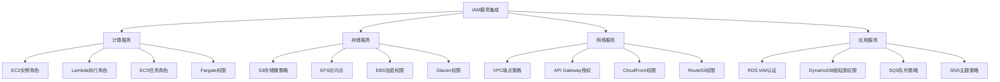

# 第8章：IAM与其他AWS服务集成

## 学习目标

1. 掌握IAM与EC2实例的集成配置
2. 学习Lambda函数的权限管理
3. 理解S3存储桶策略的配置
4. 掌握跨服务权限管理
5. 实施服务间安全通信

## 服务集成架构图



## 8.1 IAM与EC2集成

### 8.1.1 EC2实例角色配置

```python
import boto3
import json
from datetime import datetime

def configure_ec2_iam_integration():
    """
    配置EC2与IAM的集成
    """
    
    class EC2IAMIntegration:
        def __init__(self):
            self.iam = boto3.client('iam')
            self.ec2 = boto3.client('ec2')
            self.sts = boto3.client('sts')
        
        def create_ec2_service_role(self, role_name, permissions):
            """创建EC2服务角色"""
            
            # EC2信任策略
            trust_policy = {
                "Version": "2012-10-17",
                "Statement": [
                    {
                        "Effect": "Allow",
                        "Principal": {
                            "Service": "ec2.amazonaws.com"
                        },
                        "Action": "sts:AssumeRole"
                    }
                ]
            }
            
            try:
                # 创建角色
                role_response = self.iam.create_role(
                    RoleName=role_name,
                    AssumeRolePolicyDocument=json.dumps(trust_policy),
                    Description=f'Service role for EC2 instances: {role_name}',
                    Tags=[
                        {'Key': 'Service', 'Value': 'EC2'},
                        {'Key': 'ManagedBy', 'Value': 'IAM-Automation'},
                        {'Key': 'CreatedDate', 'Value': datetime.now().strftime('%Y-%m-%d')}
                    ]
                )
                
                role_arn = role_response['Role']['Arn']
                print(f"✅ EC2角色创建成功: {role_arn}")
                
                # 附加权限策略
                for permission in permissions:
                    if permission['type'] == 'managed':
                        self.iam.attach_role_policy(
                            RoleName=role_name,
                            PolicyArn=permission['arn']
                        )
                    elif permission['type'] == 'inline':
                        self.iam.put_role_policy(
                            RoleName=role_name,
                            PolicyName=permission['name'],
                            PolicyDocument=json.dumps(permission['document'])
                        )
                
                # 创建实例配置文件
                self.iam.create_instance_profile(
                    InstanceProfileName=role_name
                )
                
                # 将角色添加到实例配置文件
                self.iam.add_role_to_instance_profile(
                    InstanceProfileName=role_name,
                    RoleName=role_name
                )
                
                print(f"✅ 实例配置文件创建成功: {role_name}")
                
                return {
                    'role_arn': role_arn,
                    'instance_profile_name': role_name
                }
                
            except Exception as e:
                print(f"❌ 创建EC2角色失败: {str(e)}")
                return None
        
        def create_web_server_role(self):
            """创建Web服务器角色"""
            
            permissions = [
                {
                    'type': 'managed',
                    'arn': 'arn:aws:iam::aws:policy/CloudWatchAgentServerPolicy'
                },
                {
                    'type': 'inline',
                    'name': 'WebServerCustomPolicy',
                    'document': {
                        "Version": "2012-10-17",
                        "Statement": [
                            {
                                "Effect": "Allow",
                                "Action": [
                                    "s3:GetObject",
                                    "s3:PutObject"
                                ],
                                "Resource": "arn:aws:s3:::my-web-content/*"
                            },
                            {
                                "Effect": "Allow",
                                "Action": [
                                    "ssm:GetParameter",
                                    "ssm:GetParameters",
                                    "ssm:GetParametersByPath"
                                ],
                                "Resource": "arn:aws:ssm:*:*:parameter/webserver/*"
                            },
                            {
                                "Effect": "Allow",
                                "Action": [
                                    "secretsmanager:GetSecretValue"
                                ],
                                "Resource": "arn:aws:secretsmanager:*:*:secret:webserver/*"
                            }
                        ]
                    }
                }
            ]
            
            return self.create_ec2_service_role("WebServerRole", permissions)
        
        def create_database_server_role(self):
            """创建数据库服务器角色"""
            
            permissions = [
                {
                    'type': 'managed',
                    'arn': 'arn:aws:iam::aws:policy/CloudWatchAgentServerPolicy'
                },
                {
                    'type': 'inline',
                    'name': 'DatabaseServerPolicy',
                    'document': {
                        "Version": "2012-10-17",
                        "Statement": [
                            {
                                "Effect": "Allow",
                                "Action": [
                                    "s3:GetObject",
                                    "s3:PutObject"
                                ],
                                "Resource": [
                                    "arn:aws:s3:::database-backups/*",
                                    "arn:aws:s3:::database-logs/*"
                                ]
                            },
                            {
                                "Effect": "Allow",
                                "Action": [
                                    "kms:Encrypt",
                                    "kms:Decrypt",
                                    "kms:ReEncrypt*",
                                    "kms:GenerateDataKey*",
                                    "kms:DescribeKey"
                                ],
                                "Resource": "arn:aws:kms:*:*:key/database-encryption-key"
                            },
                            {
                                "Effect": "Allow",
                                "Action": [
                                    "ssm:GetParameter",
                                    "ssm:PutParameter"
                                ],
                                "Resource": "arn:aws:ssm:*:*:parameter/database/*"
                            }
                        ]
                    }
                }
            ]
            
            return self.create_ec2_service_role("DatabaseServerRole", permissions)
        
        def launch_instance_with_role(self, instance_profile_name, **kwargs):
            """使用IAM角色启动EC2实例"""
            
            launch_params = {
                'ImageId': kwargs.get('image_id', 'ami-0abcdef1234567890'),
                'InstanceType': kwargs.get('instance_type', 't3.micro'),
                'MinCount': 1,
                'MaxCount': 1,
                'IamInstanceProfile': {
                    'Name': instance_profile_name
                },
                'SecurityGroupIds': kwargs.get('security_groups', []),
                'SubnetId': kwargs.get('subnet_id'),
                'KeyName': kwargs.get('key_name'),
                'UserData': kwargs.get('user_data', ''),
                'TagSpecifications': [
                    {
                        'ResourceType': 'instance',
                        'Tags': [
                            {'Key': 'Name', 'Value': kwargs.get('name', 'IAM-Managed-Instance')},
                            {'Key': 'IAMRole', 'Value': instance_profile_name},
                            {'Key': 'ManagedBy', 'Value': 'IAM-Integration'}
                        ]
                    }
                ]
            }
            
            try:
                response = self.ec2.run_instances(**launch_params)
                instance_id = response['Instances'][0]['InstanceId']
                
                print(f"✅ EC2实例启动成功: {instance_id}")
                print(f"   使用IAM角色: {instance_profile_name}")
                
                return instance_id
                
            except Exception as e:
                print(f"❌ 启动EC2实例失败: {str(e)}")
                return None
        
        def test_instance_permissions(self, instance_id):
            """测试实例权限"""
            
            # 获取实例元数据中的角色信息
            test_script = f'''
            #!/bin/bash
            
            echo "=== 测试EC2实例IAM权限 ==="
            
            # 获取实例元数据
            echo "1. 获取实例IAM角色信息:"
            curl -s http://169.254.169.254/latest/meta-data/iam/security-credentials/
            
            echo -e "\\n2. 测试AWS CLI权限:"
            aws sts get-caller-identity
            
            echo -e "\\n3. 测试S3权限:"
            aws s3 ls
            
            echo -e "\\n4. 测试SSM参数访问:"
            aws ssm get-parameters-by-path --path "/webserver" --recursive
            
            echo -e "\\n5. 测试CloudWatch日志权限:"
            aws logs describe-log-groups --limit 5
            '''
            
            print(f"📋 实例权限测试脚本 (Instance ID: {instance_id}):")
            print(test_script)
            
            return test_script
    
    return EC2IAMIntegration()

# 演示EC2 IAM集成
ec2_iam = configure_ec2_iam_integration()

# 创建Web服务器角色
web_role = ec2_iam.create_web_server_role()

# 创建数据库服务器角色
db_role = ec2_iam.create_database_server_role()

print("\n📋 EC2 IAM集成配置完成:")
print("  ✅ Web服务器角色已创建")
print("  ✅ 数据库服务器角色已创建")
print("  ✅ 实例配置文件已配置")
```

## 8.2 IAM与Lambda集成

### 8.2.1 Lambda执行角色管理

```python
def configure_lambda_iam_integration():
    """
    配置Lambda与IAM的集成
    """
    
    class LambdaIAMIntegration:
        def __init__(self):
            self.iam = boto3.client('iam')
            self.lambda_client = boto3.client('lambda')
        
        def create_lambda_execution_role(self, function_name, permissions_config):
            """创建Lambda执行角色"""
            
            role_name = f"Lambda-{function_name}-ExecutionRole"
            
            # Lambda信任策略
            trust_policy = {
                "Version": "2012-10-17",
                "Statement": [
                    {
                        "Effect": "Allow",
                        "Principal": {
                            "Service": "lambda.amazonaws.com"
                        },
                        "Action": "sts:AssumeRole"
                    }
                ]
            }
            
            try:
                # 创建角色
                role_response = self.iam.create_role(
                    RoleName=role_name,
                    AssumeRolePolicyDocument=json.dumps(trust_policy),
                    Description=f'Execution role for Lambda function: {function_name}'
                )
                
                role_arn = role_response['Role']['Arn']
                print(f"✅ Lambda执行角色创建成功: {role_arn}")
                
                # 附加基本执行策略
                self.iam.attach_role_policy(
                    RoleName=role_name,
                    PolicyArn='arn:aws:iam::aws:policy/service-role/AWSLambdaBasicExecutionRole'
                )
                
                # 根据配置添加额外权限
                if permissions_config.get('vpc_access'):
                    self.iam.attach_role_policy(
                        RoleName=role_name,
                        PolicyArn='arn:aws:iam::aws:policy/service-role/AWSLambdaVPCAccessExecutionRole'
                    )
                
                # 创建自定义权限策略
                if permissions_config.get('custom_permissions'):
                    custom_policy = {
                        "Version": "2012-10-17",
                        "Statement": permissions_config['custom_permissions']
                    }
                    
                    policy_response = self.iam.create_policy(
                        PolicyName=f'Lambda-{function_name}-CustomPolicy',
                        PolicyDocument=json.dumps(custom_policy),
                        Description=f'Custom permissions for {function_name}'
                    )
                    
                    self.iam.attach_role_policy(
                        RoleName=role_name,
                        PolicyArn=policy_response['Policy']['Arn']
                    )
                
                return role_arn
                
            except Exception as e:
                print(f"❌ 创建Lambda角色失败: {str(e)}")
                return None
        
        def create_api_handler_role(self):
            """创建API处理器角色"""
            
            permissions_config = {
                'custom_permissions': [
                    {
                        "Effect": "Allow",
                        "Action": [
                            "dynamodb:GetItem",
                            "dynamodb:PutItem",
                            "dynamodb:UpdateItem",
                            "dynamodb:DeleteItem",
                            "dynamodb:Query"
                        ],
                        "Resource": "arn:aws:dynamodb:*:*:table/api-data*"
                    },
                    {
                        "Effect": "Allow",
                        "Action": [
                            "s3:GetObject",
                            "s3:PutObject"
                        ],
                        "Resource": "arn:aws:s3:::api-uploads/*"
                    },
                    {
                        "Effect": "Allow",
                        "Action": [
                            "sns:Publish"
                        ],
                        "Resource": "arn:aws:sns:*:*:api-notifications"
                    }
                ]
            }
            
            return self.create_lambda_execution_role("APIHandler", permissions_config)
        
        def create_data_processor_role(self):
            """创建数据处理器角色"""
            
            permissions_config = {
                'custom_permissions': [
                    {
                        "Effect": "Allow",
                        "Action": [
                            "s3:GetObject",
                            "s3:PutObject",
                            "s3:DeleteObject"
                        ],
                        "Resource": [
                            "arn:aws:s3:::raw-data/*",
                            "arn:aws:s3:::processed-data/*"
                        ]
                    },
                    {
                        "Effect": "Allow",
                        "Action": [
                            "dynamodb:BatchGetItem",
                            "dynamodb:BatchWriteItem",
                            "dynamodb:Query",
                            "dynamodb:Scan"
                        ],
                        "Resource": "arn:aws:dynamodb:*:*:table/processing-*"
                    },
                    {
                        "Effect": "Allow",
                        "Action": [
                            "sqs:ReceiveMessage",
                            "sqs:DeleteMessage",
                            "sqs:GetQueueAttributes"
                        ],
                        "Resource": "arn:aws:sqs:*:*:data-processing-queue"
                    },
                    {
                        "Effect": "Allow",
                        "Action": [
                            "kms:Decrypt"
                        ],
                        "Resource": "arn:aws:kms:*:*:key/*"
                    }
                ]
            }
            
            return self.create_lambda_execution_role("DataProcessor", permissions_config)
        
        def create_scheduled_task_role(self):
            """创建定时任务角色"""
            
            permissions_config = {
                'custom_permissions': [
                    {
                        "Effect": "Allow",
                        "Action": [
                            "cloudwatch:PutMetricData",
                            "cloudwatch:GetMetricStatistics"
                        ],
                        "Resource": "*"
                    },
                    {
                        "Effect": "Allow",
                        "Action": [
                            "ses:SendEmail",
                            "ses:SendRawEmail"
                        ],
                        "Resource": "*",
                        "Condition": {
                            "StringEquals": {
                                "ses:FromAddress": "noreply@company.com"
                            }
                        }
                    },
                    {
                        "Effect": "Allow",
                        "Action": [
                            "ssm:GetParameter",
                            "ssm:PutParameter"
                        ],
                        "Resource": "arn:aws:ssm:*:*:parameter/scheduled-tasks/*"
                    }
                ]
            }
            
            return self.create_lambda_execution_role("ScheduledTask", permissions_config)
        
        def deploy_lambda_with_role(self, function_name, role_arn, code_config):
            """部署Lambda函数并配置IAM角色"""
            
            try:
                # Lambda函数配置
                function_config = {
                    'FunctionName': function_name,
                    'Runtime': code_config.get('runtime', 'python3.9'),
                    'Role': role_arn,
                    'Handler': code_config.get('handler', 'lambda_function.lambda_handler'),
                    'Code': {
                        'ZipFile': code_config.get('code', self._get_default_lambda_code())
                    },
                    'Description': f'Lambda function with IAM role integration: {function_name}',
                    'Timeout': code_config.get('timeout', 300),
                    'MemorySize': code_config.get('memory', 128),
                    'Environment': {
                        'Variables': code_config.get('environment', {})
                    },
                    'Tags': {
                        'ManagedBy': 'IAM-Integration',
                        'Role': role_arn.split('/')[-1]
                    }
                }
                
                # 如果配置了VPC，添加VPC配置
                if code_config.get('vpc_config'):
                    function_config['VpcConfig'] = code_config['vpc_config']
                
                response = self.lambda_client.create_function(**function_config)
                
                print(f"✅ Lambda函数创建成功: {response['FunctionArn']}")
                print(f"   使用IAM角色: {role_arn}")
                
                return response['FunctionArn']
                
            except Exception as e:
                print(f"❌ 部署Lambda函数失败: {str(e)}")
                return None
        
        def _get_default_lambda_code(self):
            """获取默认的Lambda代码"""
            code = '''
import json
import boto3
import logging

logger = logging.getLogger()
logger.setLevel(logging.INFO)

def lambda_handler(event, context):
    """
    Default Lambda function with IAM role testing
    """
    
    # 测试IAM权限
    try:
        # 获取调用者身份
        sts = boto3.client('sts')
        identity = sts.get_caller_identity()
        
        logger.info(f"Lambda执行角色: {identity.get('Arn')}")
        
        # 测试基本权限（根据实际配置调整）
        # s3 = boto3.client('s3')
        # dynamodb = boto3.resource('dynamodb')
        
        return {
            'statusCode': 200,
            'body': json.dumps({
                'message': 'Lambda function executed successfully',
                'role_arn': identity.get('Arn'),
                'request_id': context.aws_request_id
            })
        }
        
    except Exception as e:
        logger.error(f"Lambda执行错误: {str(e)}")
        
        return {
            'statusCode': 500,
            'body': json.dumps({
                'error': str(e),
                'request_id': context.aws_request_id
            })
        }
'''
            return code.encode('utf-8')
        
        def test_lambda_permissions(self, function_name):
            """测试Lambda权限"""
            
            test_event = {
                "test": True,
                "message": "Testing Lambda IAM permissions"
            }
            
            try:
                response = self.lambda_client.invoke(
                    FunctionName=function_name,
                    InvocationType='RequestResponse',
                    Payload=json.dumps(test_event)
                )
                
                result = json.loads(response['Payload'].read())
                
                print(f"📋 Lambda权限测试结果 ({function_name}):")
                print(f"  状态码: {result.get('statusCode')}")
                print(f"  响应体: {result.get('body')}")
                
                return result
                
            except Exception as e:
                print(f"❌ Lambda权限测试失败: {str(e)}")
                return None
    
    return LambdaIAMIntegration()

# 演示Lambda IAM集成
lambda_iam = configure_lambda_iam_integration()

# 创建不同类型的Lambda角色
api_role = lambda_iam.create_api_handler_role()
processor_role = lambda_iam.create_data_processor_role()
scheduled_role = lambda_iam.create_scheduled_task_role()

print("\n📋 Lambda IAM集成配置完成:")
print("  ✅ API处理器角色已创建")
print("  ✅ 数据处理器角色已创建") 
print("  ✅ 定时任务角色已创建")
```

## 8.3 IAM与S3集成

### 8.3.1 S3存储桶策略配置

```python
def configure_s3_iam_integration():
    """
    配置S3与IAM的集成
    """
    
    class S3IAMIntegration:
        def __init__(self):
            self.s3 = boto3.client('s3')
            self.iam = boto3.client('iam')
        
        def create_bucket_with_policy(self, bucket_name, bucket_policy_config):
            """创建带有IAM策略的S3存储桶"""
            
            try:
                # 创建存储桶
                if boto3.Session().region_name != 'us-east-1':
                    self.s3.create_bucket(
                        Bucket=bucket_name,
                        CreateBucketConfiguration={
                            'LocationConstraint': boto3.Session().region_name
                        }
                    )
                else:
                    self.s3.create_bucket(Bucket=bucket_name)
                
                print(f"✅ S3存储桶创建成功: {bucket_name}")
                
                # 配置存储桶策略
                bucket_policy = self._generate_bucket_policy(bucket_name, bucket_policy_config)
                
                self.s3.put_bucket_policy(
                    Bucket=bucket_name,
                    Policy=json.dumps(bucket_policy)
                )
                
                print(f"✅ 存储桶策略配置成功")
                
                # 配置存储桶加密
                if bucket_policy_config.get('encryption'):
                    self._configure_bucket_encryption(bucket_name, bucket_policy_config['encryption'])
                
                # 配置存储桶版本控制
                if bucket_policy_config.get('versioning'):
                    self.s3.put_bucket_versioning(
                        Bucket=bucket_name,
                        VersioningConfiguration={'Status': 'Enabled'}
                    )
                
                # 配置访问日志
                if bucket_policy_config.get('logging'):
                    self._configure_bucket_logging(bucket_name, bucket_policy_config['logging'])
                
                return bucket_name
                
            except Exception as e:
                print(f"❌ 创建S3存储桶失败: {str(e)}")
                return None
        
        def _generate_bucket_policy(self, bucket_name, config):
            """生成存储桶策略"""
            
            statements = []
            
            # 拒绝非SSL请求
            if config.get('require_ssl', True):
                statements.append({
                    "Sid": "DenyInsecureConnections",
                    "Effect": "Deny",
                    "Principal": "*",
                    "Action": "s3:*",
                    "Resource": [
                        f"arn:aws:s3:::{bucket_name}",
                        f"arn:aws:s3:::{bucket_name}/*"
                    ],
                    "Condition": {
                        "Bool": {
                            "aws:SecureTransport": "false"
                        }
                    }
                })
            
            # 角色访问权限
            if config.get('role_access'):
                for role_config in config['role_access']:
                    statements.append({
                        "Sid": f"Allow{role_config['role'].replace('-', '')}Access",
                        "Effect": "Allow",
                        "Principal": {
                            "AWS": role_config['role_arn']
                        },
                        "Action": role_config['actions'],
                        "Resource": [
                            f"arn:aws:s3:::{bucket_name}",
                            f"arn:aws:s3:::{bucket_name}/*"
                        ]
                    })
            
            # 跨账户访问
            if config.get('cross_account_access'):
                for account_config in config['cross_account_access']:
                    statement = {
                        "Sid": f"AllowAccount{account_config['account_id']}",
                        "Effect": "Allow",
                        "Principal": {
                            "AWS": f"arn:aws:iam::{account_config['account_id']}:root"
                        },
                        "Action": account_config['actions'],
                        "Resource": [
                            f"arn:aws:s3:::{bucket_name}",
                            f"arn:aws:s3:::{bucket_name}/*"
                        ]
                    }
                    
                    # 添加条件
                    if account_config.get('conditions'):
                        statement['Condition'] = account_config['conditions']
                    
                    statements.append(statement)
            
            # 公共访问控制
            if config.get('public_access'):
                statements.append({
                    "Sid": "AllowPublicRead",
                    "Effect": "Allow",
                    "Principal": "*",
                    "Action": "s3:GetObject",
                    "Resource": f"arn:aws:s3:::{bucket_name}/public/*"
                })
            
            # IP地址限制
            if config.get('ip_restrictions'):
                statements.append({
                    "Sid": "RestrictByIPAddress",
                    "Effect": "Deny",
                    "Principal": "*",
                    "Action": "s3:*",
                    "Resource": [
                        f"arn:aws:s3:::{bucket_name}",
                        f"arn:aws:s3:::{bucket_name}/*"
                    ],
                    "Condition": {
                        "NotIpAddress": {
                            "aws:SourceIp": config['ip_restrictions']
                        }
                    }
                })
            
            return {
                "Version": "2012-10-17",
                "Statement": statements
            }
        
        def _configure_bucket_encryption(self, bucket_name, encryption_config):
            """配置存储桶加密"""
            
            encryption_configuration = {
                'Rules': [
                    {
                        'ApplyServerSideEncryptionByDefault': {
                            'SSEAlgorithm': encryption_config.get('algorithm', 'AES256')
                        },
                        'BucketKeyEnabled': encryption_config.get('bucket_key', True)
                    }
                ]
            }
            
            if encryption_config.get('kms_key_id'):
                encryption_configuration['Rules'][0]['ApplyServerSideEncryptionByDefault']['KMSMasterKeyID'] = encryption_config['kms_key_id']
            
            self.s3.put_bucket_encryption(
                Bucket=bucket_name,
                ServerSideEncryptionConfiguration=encryption_configuration
            )
            
            print(f"✅ 存储桶加密配置成功")
        
        def _configure_bucket_logging(self, bucket_name, logging_config):
            """配置存储桶访问日志"""
            
            logging_configuration = {
                'LoggingEnabled': {
                    'TargetBucket': logging_config['target_bucket'],
                    'TargetPrefix': logging_config.get('target_prefix', f'{bucket_name}-access-logs/')
                }
            }
            
            if logging_config.get('target_grants'):
                logging_configuration['LoggingEnabled']['TargetGrants'] = logging_config['target_grants']
            
            self.s3.put_bucket_logging(
                Bucket=bucket_name,
                BucketLoggingStatus=logging_configuration
            )
            
            print(f"✅ 存储桶访问日志配置成功")
        
        def create_web_content_bucket(self):
            """创建Web内容存储桶"""
            
            config = {
                'require_ssl': True,
                'role_access': [
                    {
                        'role': 'WebServerRole',
                        'role_arn': 'arn:aws:iam::123456789012:role/WebServerRole',
                        'actions': ['s3:GetObject', 's3:PutObject']
                    }
                ],
                'public_access': True,
                'encryption': {
                    'algorithm': 'AES256',
                    'bucket_key': True
                },
                'versioning': True
            }
            
            return self.create_bucket_with_policy('my-web-content', config)
        
        def create_backup_bucket(self):
            """创建备份存储桶"""
            
            config = {
                'require_ssl': True,
                'role_access': [
                    {
                        'role': 'BackupRole',
                        'role_arn': 'arn:aws:iam::123456789012:role/BackupRole',
                        'actions': ['s3:PutObject', 's3:GetObject', 's3:DeleteObject']
                    }
                ],
                'cross_account_access': [
                    {
                        'account_id': '111122223333',
                        'actions': ['s3:GetObject'],
                        'conditions': {
                            'StringEquals': {
                                'aws:PrincipalTag/BackupAccess': 'true'
                            }
                        }
                    }
                ],
                'encryption': {
                    'algorithm': 'aws:kms',
                    'kms_key_id': 'arn:aws:kms:us-east-1:123456789012:key/12345678-1234-1234-1234-123456789012'
                },
                'ip_restrictions': ['203.0.113.0/24', '198.51.100.0/24']
            }
            
            return self.create_bucket_with_policy('my-secure-backups', config)
        
        def test_bucket_access(self, bucket_name, test_scenarios):
            """测试存储桶访问权限"""
            
            print(f"📋 测试存储桶访问权限: {bucket_name}")
            
            for scenario in test_scenarios:
                print(f"\n测试场景: {scenario['name']}")
                
                try:
                    if scenario['action'] == 'list_objects':
                        response = self.s3.list_objects_v2(Bucket=bucket_name)
                        print(f"  ✅ 列出对象成功: {response.get('KeyCount', 0)} 个对象")
                    
                    elif scenario['action'] == 'put_object':
                        self.s3.put_object(
                            Bucket=bucket_name,
                            Key=scenario['key'],
                            Body=scenario.get('body', 'test content')
                        )
                        print(f"  ✅ 上传对象成功: {scenario['key']}")
                    
                    elif scenario['action'] == 'get_object':
                        response = self.s3.get_object(Bucket=bucket_name, Key=scenario['key'])
                        print(f"  ✅ 获取对象成功: {scenario['key']}")
                    
                except Exception as e:
                    print(f"  ❌ 测试失败: {str(e)}")
    
    return S3IAMIntegration()

# 演示S3 IAM集成
s3_iam = configure_s3_iam_integration()

print("\n📋 S3 IAM集成配置:")
print("  ✅ 存储桶策略模板已准备")
print("  ✅ 加密和日志配置已准备")
print("  ✅ 跨账户访问策略已准备")
```

## 总结

本章介绍了IAM与核心AWS服务的集成：

1. **EC2集成**: 实例角色、权限配置和服务特定策略
2. **Lambda集成**: 执行角色、自定义权限和函数部署
3. **S3集成**: 存储桶策略、加密配置和访问控制
4. **最佳实践**: 最小权限、安全配置和监控审计

通过服务集成，您可以：
- 实现安全的跨服务通信
- 配置细粒度的权限控制
- 建立完整的安全策略体系
- 实施自动化的权限管理

下一章我们将学习联合身份和单点登录配置。