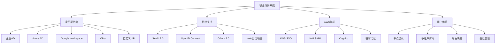

# 第9章：联合身份和单点登录

## 学习目标

1. 理解联合身份的概念和架构
2. 配置SAML 2.0身份联合
3. 实施OpenID Connect (OIDC) 集成
4. 掌握AWS SSO (Identity Center) 配置
5. 建立企业级单点登录解决方案

## 联合身份架构图



## 9.1 联合身份基础

### 9.1.1 联合身份概念和架构

```python
import boto3
import json
import xml.etree.ElementTree as ET
from datetime import datetime, timedelta
import base64
import urllib.parse

def understand_identity_federation():
    """
    理解联合身份的概念和架构
    """
    
    federation_concepts = {
        "identity_federation": {
            "definition": "联合身份允许外部身份提供商的用户访问AWS资源，无需在AWS中创建IAM用户",
            "benefits": [
                "单点登录体验",
                "集中的身份管理",
                "减少密码管理复杂性",
                "支持企业级身份提供商",
                "临时凭证提高安全性"
            ],
            "key_components": [
                "身份提供商 (IdP)",
                "服务提供商 (SP) - AWS",
                "身份断言",
                "信任关系",
                "角色映射"
            ]
        },
        "federation_types": {
            "saml_federation": {
                "description": "基于SAML 2.0协议的企业级联合",
                "use_cases": ["企业Active Directory", "ADFS", "第三方IdP"],
                "workflow": [
                    "用户在企业IdP认证",
                    "IdP生成SAML断言",
                    "用户重定向到AWS SAML端点",
                    "AWS验证断言并提供临时凭证",
                    "用户使用临时凭证访问AWS资源"
                ]
            },
            "oidc_federation": {
                "description": "基于OpenID Connect的Web身份联合",
                "use_cases": ["移动应用", "Web应用", "第三方登录"],
                "workflow": [
                    "用户通过OIDC提供商认证",
                    "获取身份令牌",
                    "使用令牌调用AWS STS",
                    "获取临时AWS凭证",
                    "访问AWS资源"
                ]
            },
            "web_identity_federation": {
                "description": "直接与Web身份提供商集成",
                "use_cases": ["Amazon Cognito", "Google", "Facebook登录"],
                "workflow": [
                    "用户通过Web IdP登录",
                    "获取身份令牌",
                    "直接使用AssumeRoleWithWebIdentity",
                    "获取AWS临时凭证"
                ]
            }
        }
    }
    
    # 联合身份的信任模型
    trust_model = {
        "trust_establishment": {
            "identity_provider_setup": "在AWS中配置身份提供商",
            "trust_policy_creation": "创建信任策略允许IdP代入角色",
            "attribute_mapping": "映射IdP属性到AWS角色",
            "condition_validation": "验证联合条件和约束"
        },
        "security_considerations": [
            "验证SAML断言的完整性和真实性",
            "使用适当的条件限制角色访问",
            "定期轮换加密密钥",
            "监控和审计联合访问",
            "实施最小权限原则"
        ]
    }
    
    print("📋 联合身份概念:")
    print(f"定义: {federation_concepts['identity_federation']['definition']}")
    
    print("\n优势:")
    for benefit in federation_concepts['identity_federation']['benefits']:
        print(f"  • {benefit}")
    
    print("\n关键组件:")
    for component in federation_concepts['identity_federation']['key_components']:
        print(f"  • {component}")
    
    print("\n📋 联合类型:")
    for fed_type, details in federation_concepts['federation_types'].items():
        print(f"\n{fed_type.replace('_', ' ').title()}:")
        print(f"  描述: {details['description']}")
        print(f"  用例: {', '.join(details['use_cases'])}")
    
    return federation_concepts, trust_model

class IdentityFederationManager:
    """联合身份管理器"""
    
    def __init__(self):
        self.iam = boto3.client('iam')
        self.sts = boto3.client('sts')
    
    def create_saml_identity_provider(self, provider_name, metadata_document):
        """创建SAML身份提供商"""
        try:
            response = self.iam.create_saml_provider(
                SAMLMetadataDocument=metadata_document,
                Name=provider_name,
                Tags=[
                    {'Key': 'Type', 'Value': 'SAML'},
                    {'Key': 'Purpose', 'Value': 'Federation'},
                    {'Key': 'CreatedDate', 'Value': datetime.now().strftime('%Y-%m-%d')}
                ]
            )
            
            provider_arn = response['SAMLProviderArn']
            print(f"✅ SAML身份提供商创建成功: {provider_arn}")
            
            return provider_arn
            
        except Exception as e:
            print(f"❌ 创建SAML身份提供商失败: {str(e)}")
            return None
    
    def create_oidc_identity_provider(self, provider_url, client_ids, thumbprints):
        """创建OIDC身份提供商"""
        try:
            response = self.iam.create_open_id_connect_provider(
                Url=provider_url,
                ClientIDList=client_ids,
                ThumbprintList=thumbprints,
                Tags=[
                    {'Key': 'Type', 'Value': 'OIDC'},
                    {'Key': 'Purpose', 'Value': 'WebIdentityFederation'}
                ]
            )
            
            provider_arn = response['OpenIDConnectProviderArn']
            print(f"✅ OIDC身份提供商创建成功: {provider_arn}")
            
            return provider_arn
            
        except Exception as e:
            print(f"❌ 创建OIDC身份提供商失败: {str(e)}")
            return None

# 演示联合身份概念
federation_concepts, trust_model = understand_identity_federation()
federation_manager = IdentityFederationManager()

print("\n📋 信任模型组件:")
for component, description in trust_model['trust_establishment'].items():
    print(f"  {component.replace('_', ' ').title()}: {description}")
```

## 9.2 SAML 2.0 联合配置

### 9.2.1 企业级SAML集成

```python
def configure_saml_federation():
    """
    配置SAML 2.0联合身份
    """
    
    class SAMLFederationManager:
        def __init__(self):
            self.iam = boto3.client('iam')
            self.sts = boto3.client('sts')
        
        def setup_enterprise_saml_federation(self, config):
            """设置企业SAML联合"""
            
            # 1. 创建SAML身份提供商
            provider_arn = self._create_saml_provider(config)
            if not provider_arn:
                return None
            
            # 2. 创建联合角色
            federation_roles = self._create_federation_roles(provider_arn, config)
            
            # 3. 配置属性映射
            attribute_mapping = self._setup_attribute_mapping(config)
            
            # 4. 生成IdP配置指南
            idp_config = self._generate_idp_configuration(provider_arn, federation_roles)
            
            return {
                'provider_arn': provider_arn,
                'federation_roles': federation_roles,
                'attribute_mapping': attribute_mapping,
                'idp_configuration': idp_config
            }
        
        def _create_saml_provider(self, config):
            """创建SAML身份提供商"""
            
            # 示例SAML元数据（简化版）
            metadata_template = f'''<?xml version="1.0" encoding="UTF-8"?>
<md:EntityDescriptor xmlns:md="urn:oasis:names:tc:SAML:2.0:metadata" 
                     entityID="{config['entity_id']}">
    <md:IDPSSODescriptor WantAuthnRequestsSigned="false" 
                         protocolSupportEnumeration="urn:oasis:names:tc:SAML:2.0:protocol">
        <md:KeyDescriptor use="signing">
            <ds:KeyInfo xmlns:ds="http://www.w3.org/2000/09/xmldsig#">
                <ds:X509Data>
                    <ds:X509Certificate>
                        {config['signing_certificate']}
                    </ds:X509Certificate>
                </ds:X509Data>
            </ds:KeyInfo>
        </md:KeyDescriptor>
        <md:SingleSignOnService Binding="urn:oasis:names:tc:SAML:2.0:bindings:HTTP-POST"
                                Location="{config['sso_url']}"/>
        <md:SingleSignOnService Binding="urn:oasis:names:tc:SAML:2.0:bindings:HTTP-Redirect"
                                Location="{config['sso_url']}"/>
    </md:IDPSSODescriptor>
</md:EntityDescriptor>'''
            
            try:
                response = self.iam.create_saml_provider(
                    SAMLMetadataDocument=metadata_template,
                    Name=config['provider_name']
                )
                
                return response['SAMLProviderArn']
                
            except Exception as e:
                print(f"❌ 创建SAML提供商失败: {str(e)}")
                return None
        
        def _create_federation_roles(self, provider_arn, config):
            """创建联合角色"""
            
            roles = {}
            
            for role_config in config['roles']:
                role_name = role_config['name']
                
                # SAML联合信任策略
                trust_policy = {
                    "Version": "2012-10-17",
                    "Statement": [
                        {
                            "Effect": "Allow",
                            "Principal": {
                                "Federated": provider_arn
                            },
                            "Action": "sts:AssumeRoleWithSAML",
                            "Condition": {
                                "StringEquals": {
                                    "SAML:aud": "https://signin.aws.amazon.com/saml"
                                }
                            }
                        }
                    ]
                }
                
                # 添加额外条件
                if role_config.get('conditions'):
                    trust_policy['Statement'][0]['Condition'].update(role_config['conditions'])
                
                try:
                    # 创建角色
                    role_response = self.iam.create_role(
                        RoleName=role_name,
                        AssumeRolePolicyDocument=json.dumps(trust_policy),
                        Description=f'SAML federated role: {role_name}',
                        MaxSessionDuration=role_config.get('session_duration', 3600)
                    )
                    
                    role_arn = role_response['Role']['Arn']
                    
                    # 附加权限策略
                    for policy in role_config.get('policies', []):
                        if policy['type'] == 'managed':
                            self.iam.attach_role_policy(
                                RoleName=role_name,
                                PolicyArn=policy['arn']
                            )
                        elif policy['type'] == 'inline':
                            self.iam.put_role_policy(
                                RoleName=role_name,
                                PolicyName=policy['name'],
                                PolicyDocument=json.dumps(policy['document'])
                            )
                    
                    roles[role_name] = {
                        'arn': role_arn,
                        'saml_role_value': f"{role_arn},{provider_arn}"
                    }
                    
                    print(f"✅ 联合角色创建成功: {role_name}")
                    
                except Exception as e:
                    print(f"❌ 创建联合角色失败 {role_name}: {str(e)}")
            
            return roles
        
        def _setup_attribute_mapping(self, config):
            """设置属性映射"""
            
            attribute_mapping = {
                "required_attributes": {
                    "https://aws.amazon.com/SAML/Attributes/Role": {
                        "description": "用户可以代入的AWS角色",
                        "format": "{RoleArn},{ProviderArn}",
                        "example": "arn:aws:iam::123456789012:role/SAMLRole,arn:aws:iam::123456789012:saml-provider/CompanySAML"
                    },
                    "https://aws.amazon.com/SAML/Attributes/RoleSessionName": {
                        "description": "角色会话名称",
                        "format": "字符串",
                        "example": "user.email"
                    }
                },
                "optional_attributes": {
                    "https://aws.amazon.com/SAML/Attributes/SessionDuration": {
                        "description": "会话持续时间（秒）",
                        "format": "数字",
                        "example": "3600"
                    },
                    "custom_attributes": config.get('custom_attributes', {})
                }
            }
            
            return attribute_mapping
        
        def _generate_idp_configuration(self, provider_arn, roles):
            """生成IdP配置指南"""
            
            config_guide = {
                "aws_saml_endpoint": "https://signin.aws.amazon.com/saml",
                "provider_arn": provider_arn,
                "attribute_mappings": {
                    "Role": "https://aws.amazon.com/SAML/Attributes/Role",
                    "RoleSessionName": "https://aws.amazon.com/SAML/Attributes/RoleSessionName"
                },
                "role_mappings": {}
            }
            
            for role_name, role_info in roles.items():
                config_guide["role_mappings"][role_name] = {
                    "role_arn": role_info['arn'],
                    "saml_attribute_value": role_info['saml_role_value']
                }
            
            return config_guide
        
        def create_adfs_integration(self):
            """创建ADFS集成示例"""
            
            adfs_config = {
                'provider_name': 'CompanyADFS',
                'entity_id': 'https://adfs.company.com/adfs/services/trust',
                'sso_url': 'https://adfs.company.com/adfs/ls/',
                'signing_certificate': 'MIICertificateDataHere...',
                'roles': [
                    {
                        'name': 'SAML-Developers',
                        'policies': [
                            {
                                'type': 'managed',
                                'arn': 'arn:aws:iam::aws:policy/PowerUserAccess'
                            }
                        ],
                        'conditions': {
                            "StringEquals": {
                                "SAML:Department": "Engineering"
                            }
                        },
                        'session_duration': 14400  # 4小时
                    },
                    {
                        'name': 'SAML-Administrators',
                        'policies': [
                            {
                                'type': 'managed',
                                'arn': 'arn:aws:iam::aws:policy/AdministratorAccess'
                            }
                        ],
                        'conditions': {
                            "StringEquals": {
                                "SAML:Role": "Administrator"
                            },
                            "Bool": {
                                "SAML:MultiFactorAuthPresent": "true"
                            }
                        },
                        'session_duration': 3600  # 1小时
                    },
                    {
                        'name': 'SAML-ReadOnly',
                        'policies': [
                            {
                                'type': 'managed',
                                'arn': 'arn:aws:iam::aws:policy/ReadOnlyAccess'
                            }
                        ]
                    }
                ]
            }
            
            return self.setup_enterprise_saml_federation(adfs_config)
        
        def test_saml_assertion(self, saml_response):
            """测试SAML断言"""
            
            try:
                # 解码SAML响应
                decoded_response = base64.b64decode(saml_response)
                
                # 解析SAML断言（简化版）
                root = ET.fromstring(decoded_response)
                
                # 提取角色信息
                roles = []
                for attr in root.iter():
                    if 'Role' in attr.tag:
                        roles.append(attr.text)
                
                # 使用STS AssumeRoleWithSAML
                if roles:
                    role_parts = roles[0].split(',')
                    role_arn = role_parts[0]
                    provider_arn = role_parts[1]
                    
                    response = self.sts.assume_role_with_saml(
                        RoleArn=role_arn,
                        PrincipalArn=provider_arn,
                        SAMLAssertion=saml_response
                    )
                    
                    print("✅ SAML断言验证成功")
                    return response['Credentials']
                
            except Exception as e:
                print(f"❌ SAML断言测试失败: {str(e)}")
                return None
    
    return SAMLFederationManager()

# 演示SAML联合配置
saml_manager = configure_saml_federation()

# 创建ADFS集成
print("🔧 配置企业ADFS集成:")
# adfs_integration = saml_manager.create_adfs_integration()

print("📋 ADFS集成配置步骤:")
print("  1. ✅ 创建SAML身份提供商")
print("  2. ✅ 配置联合角色（开发者、管理员、只读）")
print("  3. ✅ 设置属性映射")
print("  4. ✅ 生成IdP配置指南")
```

## 9.3 OpenID Connect (OIDC) 集成

### 9.3.1 Web身份联合

```python
def configure_oidc_federation():
    """
    配置OpenID Connect联合身份
    """
    
    class OIDCFederationManager:
        def __init__(self):
            self.iam = boto3.client('iam')
            self.sts = boto3.client('sts')
        
        def setup_oidc_provider(self, provider_config):
            """设置OIDC身份提供商"""
            
            try:
                # 创建OIDC提供商
                response = self.iam.create_open_id_connect_provider(
                    Url=provider_config['issuer_url'],
                    ClientIDList=provider_config['client_ids'],
                    ThumbprintList=provider_config['thumbprints'],
                    Tags=[
                        {'Key': 'Provider', 'Value': provider_config['name']},
                        {'Key': 'Type', 'Value': 'OIDC'}
                    ]
                )
                
                provider_arn = response['OpenIDConnectProviderArn']
                print(f"✅ OIDC提供商创建成功: {provider_arn}")
                
                # 创建联合角色
                roles = self._create_oidc_roles(provider_arn, provider_config)
                
                return {
                    'provider_arn': provider_arn,
                    'roles': roles,
                    'client_config': self._generate_client_config(provider_arn, roles)
                }
                
            except Exception as e:
                print(f"❌ 创建OIDC提供商失败: {str(e)}")
                return None
        
        def _create_oidc_roles(self, provider_arn, config):
            """创建OIDC联合角色"""
            
            roles = {}
            
            for role_config in config['roles']:
                role_name = role_config['name']
                
                # 构建信任策略
                conditions = {
                    "StringEquals": {
                        f"{config['issuer_url'].replace('https://', '')}:aud": config['client_ids'][0]
                    }
                }
                
                # 添加额外条件
                if role_config.get('conditions'):
                    conditions.update(role_config['conditions'])
                
                trust_policy = {
                    "Version": "2012-10-17",
                    "Statement": [
                        {
                            "Effect": "Allow",
                            "Principal": {
                                "Federated": provider_arn
                            },
                            "Action": "sts:AssumeRoleWithWebIdentity",
                            "Condition": conditions
                        }
                    ]
                }
                
                try:
                    # 创建角色
                    role_response = self.iam.create_role(
                        RoleName=role_name,
                        AssumeRolePolicyDocument=json.dumps(trust_policy),
                        Description=f'OIDC federated role: {role_name}'
                    )
                    
                    role_arn = role_response['Role']['Arn']
                    
                    # 附加权限策略
                    for policy in role_config.get('policies', []):
                        self._attach_policy_to_role(role_name, policy)
                    
                    roles[role_name] = role_arn
                    print(f"✅ OIDC角色创建成功: {role_name}")
                    
                except Exception as e:
                    print(f"❌ 创建OIDC角色失败 {role_name}: {str(e)}")
            
            return roles
        
        def _attach_policy_to_role(self, role_name, policy):
            """为角色附加策略"""
            
            if policy['type'] == 'managed':
                self.iam.attach_role_policy(
                    RoleName=role_name,
                    PolicyArn=policy['arn']
                )
            elif policy['type'] == 'inline':
                self.iam.put_role_policy(
                    RoleName=role_name,
                    PolicyName=policy['name'],
                    PolicyDocument=json.dumps(policy['document'])
                )
        
        def _generate_client_config(self, provider_arn, roles):
            """生成客户端配置"""
            
            return {
                'provider_arn': provider_arn,
                'available_roles': roles,
                'assume_role_endpoint': 'https://sts.amazonaws.com/',
                'token_usage': {
                    'id_token': '用于身份验证',
                    'access_token': '用于API访问',
                    'refresh_token': '用于刷新令牌'
                }
            }
        
        def setup_google_oidc(self):
            """设置Google OIDC集成"""
            
            google_config = {
                'name': 'GoogleOIDC',
                'issuer_url': 'https://accounts.google.com',
                'client_ids': ['your-google-client-id.apps.googleusercontent.com'],
                'thumbprints': ['1f494a0f3e59b0c9e89de97c9eac32d1ba7c6cfb'],  # Google的证书指纹
                'roles': [
                    {
                        'name': 'GoogleUser-S3Access',
                        'policies': [
                            {
                                'type': 'inline',
                                'name': 'GoogleUserS3Policy',
                                'document': {
                                    "Version": "2012-10-17",
                                    "Statement": [
                                        {
                                            "Effect": "Allow",
                                            "Action": [
                                                "s3:GetObject",
                                                "s3:PutObject"
                                            ],
                                            "Resource": "arn:aws:s3:::user-data/${accounts.google.com:sub}/*"
                                        }
                                    ]
                                }
                            }
                        ],
                        'conditions': {
                            "StringLike": {
                                "accounts.google.com:email": "*@company.com"
                            }
                        }
                    }
                ]
            }
            
            return self.setup_oidc_provider(google_config)
        
        def setup_github_actions_oidc(self):
            """设置GitHub Actions OIDC集成"""
            
            github_config = {
                'name': 'GitHubActions',
                'issuer_url': 'https://token.actions.githubusercontent.com',
                'client_ids': ['sts.amazonaws.com'],
                'thumbprints': ['6938fd4d98bab03faadb97b34396831e3780aea1'],
                'roles': [
                    {
                        'name': 'GitHubActions-DeployRole',
                        'policies': [
                            {
                                'type': 'inline',
                                'name': 'GitHubDeployPolicy',
                                'document': {
                                    "Version": "2012-10-17",
                                    "Statement": [
                                        {
                                            "Effect": "Allow",
                                            "Action": [
                                                "s3:PutObject",
                                                "s3:GetObject",
                                                "s3:DeleteObject"
                                            ],
                                            "Resource": "arn:aws:s3:::deployment-bucket/*"
                                        },
                                        {
                                            "Effect": "Allow",
                                            "Action": [
                                                "lambda:UpdateFunctionCode",
                                                "lambda:UpdateFunctionConfiguration"
                                            ],
                                            "Resource": "arn:aws:lambda:*:*:function:prod-*"
                                        }
                                    ]
                                }
                            }
                        ],
                        'conditions': {
                            "StringEquals": {
                                "token.actions.githubusercontent.com:aud": "sts.amazonaws.com"
                            },
                            "StringLike": {
                                "token.actions.githubusercontent.com:sub": "repo:company/repository:*"
                            }
                        }
                    }
                ]
            }
            
            return self.setup_oidc_provider(github_config)
        
        def test_web_identity_token(self, id_token, role_arn, session_name="WebIdentitySession"):
            """测试Web身份令牌"""
            
            try:
                response = self.sts.assume_role_with_web_identity(
                    RoleArn=role_arn,
                    RoleSessionName=session_name,
                    WebIdentityToken=id_token
                )
                
                credentials = response['Credentials']
                
                print("✅ Web身份令牌验证成功")
                print(f"   AccessKeyId: {credentials['AccessKeyId'][:10]}...")
                print(f"   过期时间: {credentials['Expiration']}")
                
                return credentials
                
            except Exception as e:
                print(f"❌ Web身份令牌验证失败: {str(e)}")
                return None
        
        def generate_client_code_examples(self, provider_config):
            """生成客户端代码示例"""
            
            examples = {
                'javascript': f'''
// JavaScript示例 - 使用OIDC令牌获取AWS凭证
const AWS = require('aws-sdk');

async function assumeRoleWithWebIdentity(idToken, roleArn) {{
    const sts = new AWS.STS();
    
    try {{
        const result = await sts.assumeRoleWithWebIdentity({{
            RoleArn: roleArn,
            RoleSessionName: 'WebSession',
            WebIdentityToken: idToken
        }}).promise();
        
        // 使用临时凭证创建AWS服务客户端
        const s3 = new AWS.S3({{
            accessKeyId: result.Credentials.AccessKeyId,
            secretAccessKey: result.Credentials.SecretAccessKey,
            sessionToken: result.Credentials.SessionToken
        }});
        
        return s3;
        
    }} catch (error) {{
        console.error('AssumeRole失败:', error);
        throw error;
    }}
}}
''',
                'python': f'''
# Python示例 - 使用OIDC令牌获取AWS凭证
import boto3

def assume_role_with_web_identity(id_token, role_arn):
    sts = boto3.client('sts')
    
    try:
        response = sts.assume_role_with_web_identity(
            RoleArn=role_arn,
            RoleSessionName='WebSession',
            WebIdentityToken=id_token
        )
        
        credentials = response['Credentials']
        
        # 使用临时凭证创建AWS服务客户端
        s3 = boto3.client(
            's3',
            aws_access_key_id=credentials['AccessKeyId'],
            aws_secret_access_key=credentials['SecretAccessKey'],
            aws_session_token=credentials['SessionToken']
        )
        
        return s3
        
    except Exception as e:
        print(f"AssumeRole失败: {{e}}")
        raise
''',
                'github_actions': '''
# GitHub Actions工作流示例
name: Deploy to AWS

on:
  push:
    branches: [main]

permissions:
  id-token: write
  contents: read

jobs:
  deploy:
    runs-on: ubuntu-latest
    steps:
      - name: Checkout
        uses: actions/checkout@v3
      
      - name: Configure AWS credentials
        uses: aws-actions/configure-aws-credentials@v2
        with:
          role-to-assume: arn:aws:iam::123456789012:role/GitHubActions-DeployRole
          role-session-name: GitHubActions-Deploy
          aws-region: us-east-1
      
      - name: Deploy to S3
        run: |
          aws s3 sync ./build s3://deployment-bucket/
'''
            }
            
            return examples
    
    return OIDCFederationManager()

# 演示OIDC联合配置
oidc_manager = configure_oidc_federation()

# 设置不同的OIDC提供商
print("🔧 配置OIDC联合身份:")

# Google OIDC集成
print("\n📱 Google OIDC集成:")
# google_integration = oidc_manager.setup_google_oidc()

# GitHub Actions集成
print("\n🔧 GitHub Actions OIDC集成:")
# github_integration = oidc_manager.setup_github_actions_oidc()

print("\n📋 OIDC集成配置完成:")
print("  ✅ Google身份提供商配置")
print("  ✅ GitHub Actions集成配置")
print("  ✅ Web身份联合角色创建")
print("  ✅ 客户端代码示例生成")

# 生成客户端代码示例
code_examples = oidc_manager.generate_client_code_examples({})
print("\n📝 客户端集成代码已生成")
```

## 9.4 AWS SSO (Identity Center) 配置

### 9.4.1 企业级单点登录解决方案

```python
def configure_aws_sso():
    """
    配置AWS SSO (Identity Center)
    """
    
    class AWSIdentityCenterManager:
        def __init__(self):
            self.sso_admin = boto3.client('sso-admin')
            self.identitystore = boto3.client('identitystore')
            self.organizations = boto3.client('organizations')
        
        def setup_identity_center(self, config):
            """设置AWS Identity Center"""
            
            try:
                # 获取SSO实例信息
                sso_instances = self.sso_admin.list_instances()
                
                if not sso_instances['Instances']:
                    print("❌ 未找到AWS SSO实例，请先启用AWS SSO")
                    return None
                
                sso_instance = sso_instances['Instances'][0]
                instance_arn = sso_instance['InstanceArn']
                identity_store_id = sso_instance['IdentityStoreId']
                
                print(f"✅ 找到SSO实例: {instance_arn}")
                
                # 配置权限集
                permission_sets = self._create_permission_sets(instance_arn, config)
                
                # 配置账户分配
                account_assignments = self._setup_account_assignments(
                    instance_arn, identity_store_id, permission_sets, config
                )
                
                # 配置外部身份源
                if config.get('external_identity_source'):
                    self._configure_external_identity_source(instance_arn, config)
                
                return {
                    'instance_arn': instance_arn,
                    'identity_store_id': identity_store_id,
                    'permission_sets': permission_sets,
                    'account_assignments': account_assignments
                }
                
            except Exception as e:
                print(f"❌ 配置Identity Center失败: {str(e)}")
                return None
        
        def _create_permission_sets(self, instance_arn, config):
            """创建权限集"""
            
            permission_sets = {}
            
            for ps_config in config['permission_sets']:
                try:
                    # 创建权限集
                    response = self.sso_admin.create_permission_set(
                        Name=ps_config['name'],
                        Description=ps_config.get('description', ''),
                        InstanceArn=instance_arn,
                        SessionDuration=ps_config.get('session_duration', 'PT1H'),  # 1小时
                        RelayState=ps_config.get('relay_state', '')
                    )
                    
                    ps_arn = response['PermissionSet']['PermissionSetArn']
                    
                    # 附加AWS管理策略
                    for policy_arn in ps_config.get('managed_policies', []):
                        self.sso_admin.attach_managed_policy_to_permission_set(
                            InstanceArn=instance_arn,
                            PermissionSetArn=ps_arn,
                            ManagedPolicyArn=policy_arn
                        )
                    
                    # 添加内联策略
                    if ps_config.get('inline_policy'):
                        self.sso_admin.put_inline_policy_to_permission_set(
                            InstanceArn=instance_arn,
                            PermissionSetArn=ps_arn,
                            InlinePolicy=json.dumps(ps_config['inline_policy'])
                        )
                    
                    # 配置权限边界
                    if ps_config.get('permissions_boundary'):
                        self.sso_admin.put_permissions_boundary_to_permission_set(
                            InstanceArn=instance_arn,
                            PermissionSetArn=ps_arn,
                            PermissionsBoundary={
                                'ManagedPolicyArn': ps_config['permissions_boundary']
                            }
                        )
                    
                    permission_sets[ps_config['name']] = ps_arn
                    print(f"✅ 权限集创建成功: {ps_config['name']}")
                    
                except Exception as e:
                    print(f"❌ 创建权限集失败 {ps_config['name']}: {str(e)}")
            
            return permission_sets
        
        def _setup_account_assignments(self, instance_arn, identity_store_id, permission_sets, config):
            """设置账户分配"""
            
            assignments = []
            
            # 获取组织中的账户
            accounts = self.organizations.list_accounts()
            account_map = {acc['Name']: acc['Id'] for acc in accounts['Accounts']}
            
            for assignment in config.get('account_assignments', []):
                try:
                    account_id = account_map.get(assignment['account_name'], assignment.get('account_id'))
                    ps_arn = permission_sets.get(assignment['permission_set'])
                    
                    if not account_id or not ps_arn:
                        print(f"⚠️ 跳过分配 - 账户或权限集未找到: {assignment}")
                        continue
                    
                    # 为用户分配
                    if assignment.get('users'):
                        for user_name in assignment['users']:
                            user_id = self._get_user_id(identity_store_id, user_name)
                            if user_id:
                                self.sso_admin.create_account_assignment(
                                    InstanceArn=instance_arn,
                                    TargetId=account_id,
                                    TargetType='AWS_ACCOUNT',
                                    PermissionSetArn=ps_arn,
                                    PrincipalType='USER',
                                    PrincipalId=user_id
                                )
                                assignments.append({
                                    'type': 'user',
                                    'principal': user_name,
                                    'account': account_id,
                                    'permission_set': assignment['permission_set']
                                })
                    
                    # 为组分配
                    if assignment.get('groups'):
                        for group_name in assignment['groups']:
                            group_id = self._get_group_id(identity_store_id, group_name)
                            if group_id:
                                self.sso_admin.create_account_assignment(
                                    InstanceArn=instance_arn,
                                    TargetId=account_id,
                                    TargetType='AWS_ACCOUNT',
                                    PermissionSetArn=ps_arn,
                                    PrincipalType='GROUP',
                                    PrincipalId=group_id
                                )
                                assignments.append({
                                    'type': 'group',
                                    'principal': group_name,
                                    'account': account_id,
                                    'permission_set': assignment['permission_set']
                                })
                    
                    print(f"✅ 账户分配配置成功: {assignment['permission_set']} -> {assignment['account_name']}")
                    
                except Exception as e:
                    print(f"❌ 账户分配失败: {str(e)}")
            
            return assignments
        
        def _get_user_id(self, identity_store_id, user_name):
            """获取用户ID"""
            try:
                response = self.identitystore.list_users(
                    IdentityStoreId=identity_store_id,
                    Filters=[
                        {
                            'AttributePath': 'UserName',
                            'AttributeValue': user_name
                        }
                    ]
                )
                
                if response['Users']:
                    return response['Users'][0]['UserId']
                
            except Exception as e:
                print(f"⚠️ 获取用户ID失败 {user_name}: {str(e)}")
            
            return None
        
        def _get_group_id(self, identity_store_id, group_name):
            """获取组ID"""
            try:
                response = self.identitystore.list_groups(
                    IdentityStoreId=identity_store_id,
                    Filters=[
                        {
                            'AttributePath': 'DisplayName',
                            'AttributeValue': group_name
                        }
                    ]
                )
                
                if response['Groups']:
                    return response['Groups'][0]['GroupId']
                
            except Exception as e:
                print(f"⚠️ 获取组ID失败 {group_name}: {str(e)}")
            
            return None
        
        def _configure_external_identity_source(self, instance_arn, config):
            """配置外部身份源"""
            
            external_config = config['external_identity_source']
            
            if external_config['type'] == 'ActiveDirectory':
                # 配置AD连接器
                print("🔗 配置Active Directory连接器...")
                # 实际实现需要调用相应的API
            
            elif external_config['type'] == 'SAML':
                # 配置SAML身份源
                print("🔗 配置SAML身份源...")
                # 实际实现需要调用相应的API
        
        def create_enterprise_sso_config(self):
            """创建企业SSO配置示例"""
            
            config = {
                'permission_sets': [
                    {
                        'name': 'AdministratorAccess',
                        'description': '完全管理员访问权限',
                        'session_duration': 'PT4H',  # 4小时
                        'managed_policies': [
                            'arn:aws:iam::aws:policy/AdministratorAccess'
                        ],
                        'permissions_boundary': 'arn:aws:iam::123456789012:policy/AdminPermissionsBoundary'
                    },
                    {
                        'name': 'DeveloperAccess',
                        'description': '开发者访问权限',
                        'session_duration': 'PT8H',  # 8小时
                        'managed_policies': [
                            'arn:aws:iam::aws:policy/PowerUserAccess'
                        ],
                        'inline_policy': {
                            "Version": "2012-10-17",
                            "Statement": [
                                {
                                    "Effect": "Deny",
                                    "Action": [
                                        "iam:CreateRole",
                                        "iam:DeleteRole",
                                        "organizations:*"
                                    ],
                                    "Resource": "*"
                                }
                            ]
                        }
                    },
                    {
                        'name': 'ReadOnlyAccess',
                        'description': '只读访问权限',
                        'session_duration': 'PT12H',  # 12小时
                        'managed_policies': [
                            'arn:aws:iam::aws:policy/ReadOnlyAccess'
                        ]
                    },
                    {
                        'name': 'DatabaseAdmin',
                        'description': '数据库管理员权限',
                        'session_duration': 'PT4H',
                        'inline_policy': {
                            "Version": "2012-10-17",
                            "Statement": [
                                {
                                    "Effect": "Allow",
                                    "Action": [
                                        "rds:*",
                                        "dynamodb:*",
                                        "elasticache:*"
                                    ],
                                    "Resource": "*"
                                },
                                {
                                    "Effect": "Allow",
                                    "Action": [
                                        "s3:GetObject",
                                        "s3:PutObject"
                                    ],
                                    "Resource": "arn:aws:s3:::database-backups/*"
                                }
                            ]
                        }
                    }
                ],
                'account_assignments': [
                    {
                        'account_name': 'Production',
                        'permission_set': 'AdministratorAccess',
                        'groups': ['Administrators']
                    },
                    {
                        'account_name': 'Production',
                        'permission_set': 'DatabaseAdmin',
                        'groups': ['DatabaseAdmins']
                    },
                    {
                        'account_name': 'Development',
                        'permission_set': 'DeveloperAccess',
                        'groups': ['Developers']
                    },
                    {
                        'account_name': 'Development',
                        'permission_set': 'ReadOnlyAccess',
                        'users': ['john.doe', 'jane.smith']
                    }
                ],
                'external_identity_source': {
                    'type': 'ActiveDirectory',
                    'domain': 'company.com',
                    'directory_id': 'd-1234567890'
                }
            }
            
            return self.setup_identity_center(config)
    
    return AWSIdentityCenterManager()

# 演示AWS SSO配置
sso_manager = configure_aws_sso()

print("🔧 配置AWS Identity Center:")
# enterprise_sso = sso_manager.create_enterprise_sso_config()

print("\n📋 Identity Center配置完成:")
print("  ✅ 权限集创建（管理员、开发者、只读、数据库管理员）")
print("  ✅ 账户分配配置")
print("  ✅ 外部身份源配置")
print("  ✅ 会话管理配置")

print("\n🔗 用户访问流程:")
print("  1. 用户访问SSO门户")
print("  2. 通过企业身份提供商认证")
print("  3. 选择要访问的AWS账户和角色")
print("  4. 获取临时凭证访问AWS资源")
```

## 总结

本章介绍了AWS联合身份和单点登录的完整解决方案：

1. **联合身份基础**: 理解联合身份概念、架构和信任模型
2. **SAML 2.0集成**: 企业级SAML联合配置和ADFS集成
3. **OIDC集成**: Web身份联合和GitHub Actions集成
4. **AWS SSO**: Identity Center配置和企业级单点登录

通过联合身份，您可以实现：
- 统一的企业身份管理
- 安全的单点登录体验
- 灵活的角色映射和权限管理
- 与现有身份基础设施的无缝集成

下一章我们将学习IAM访问分析和审计机制。