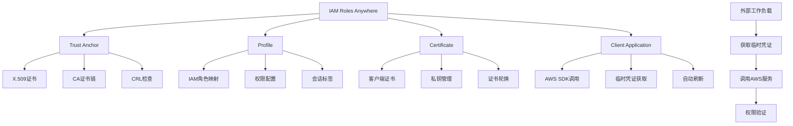

# 第11章：高级IAM功能和工具

## 学习目标

通过本章学习，你将能够：

1. 掌握IAM高级功能的配置和使用
2. 学会使用IAM Roles Anywhere进行混合云身份管理
3. 理解和实现IAM条件密钥的高级用法
4. 掌握IAM策略模拟器和评估工具
5. 学会构建自定义IAM管理工具和自动化流程
6. 实现IAM与DevOps流水线的深度集成

## 11.1 IAM Roles Anywhere

### 11.1.1 IAM Roles Anywhere概述

IAM Roles Anywhere允许您的工作负载在AWS之外使用IAM角色，为混合云和多云环境提供统一的身份管理。



### 11.1.2 IAM Roles Anywhere配置和使用

```python
import boto3
import json
import base64
import subprocess
from typing import Dict, Any, Optional
from cryptography import x509
from cryptography.hazmat.primitives import hashes
from cryptography.hazmat.primitives.asymmetric import rsa
from cryptography.hazmat.primitives import serialization
from datetime import datetime, timedelta

class IAMRolesAnywhereManager:
    """IAM Roles Anywhere管理器"""
    
    def __init__(self):
        self.rolesanywhere = boto3.client('rolesanywhere')
        self.iam = boto3.client('iam')
        
    def create_trust_anchor(self, name: str, certificate_body: str) -> Dict[str, Any]:
        """创建信任锚点"""
        try:
            response = self.rolesanywhere.create_trust_anchor(
                name=name,
                source={
                    'sourceType': 'CERTIFICATE_BUNDLE',
                    'sourceData': {
                        'x509CertificateData': certificate_body
                    }
                },
                enabled=True,
                tags=[
                    {
                        'key': 'Purpose',
                        'value': 'IAM-Roles-Anywhere'
                    },
                    {
                        'key': 'Environment',
                        'value': 'Production'
                    }
                ]
            )
            
            print(f"信任锚点创建成功: {response['trustAnchor']['trustAnchorId']}")
            return response
            
        except Exception as e:
            print(f"创建信任锚点失败: {e}")
            return {}
    
    def create_profile(self, 
                      name: str, 
                      role_arns: List[str],
                      trust_anchor_id: str,
                      session_policy: Optional[str] = None) -> Dict[str, Any]:
        """创建配置文件"""
        try:
            profile_config = {
                'name': name,
                'roleArns': role_arns,
                'enabled': True,
                'requireInstanceProperties': False,
                'tags': [
                    {
                        'key': 'TrustAnchor',
                        'value': trust_anchor_id
                    }
                ]
            }
            
            if session_policy:
                profile_config['sessionPolicy'] = session_policy
            
            response = self.rolesanywhere.create_profile(**profile_config)
            
            print(f"配置文件创建成功: {response['profile']['profileId']}")
            return response
            
        except Exception as e:
            print(f"创建配置文件失败: {e}")
            return {}
    
    def generate_client_certificate(self, 
                                   ca_cert_path: str,
                                   ca_key_path: str,
                                   client_name: str) -> Dict[str, str]:
        """生成客户端证书"""
        try:
            # 生成客户端私钥
            client_key = rsa.generate_private_key(
                public_exponent=65537,
                key_size=2048
            )
            
            # 加载CA证书和私钥
            with open(ca_cert_path, 'rb') as f:
                ca_cert = x509.load_pem_x509_certificate(f.read())
            
            with open(ca_key_path, 'rb') as f:
                ca_key = serialization.load_pem_private_key(f.read(), password=None)
            
            # 创建客户端证书请求
            subject = x509.Name([
                x509.NameAttribute(x509.NameOID.COUNTRY_NAME, "US"),
                x509.NameAttribute(x509.NameOID.STATE_OR_PROVINCE_NAME, "CA"),
                x509.NameAttribute(x509.NameOID.LOCALITY_NAME, "San Francisco"),
                x509.NameAttribute(x509.NameOID.ORGANIZATION_NAME, "Example Corp"),
                x509.NameAttribute(x509.NameOID.COMMON_NAME, client_name),
            ])
            
            # 构建客户端证书
            cert_builder = x509.CertificateBuilder()
            cert_builder = cert_builder.subject_name(subject)
            cert_builder = cert_builder.issuer_name(ca_cert.subject)
            cert_builder = cert_builder.public_key(client_key.public_key())
            cert_builder = cert_builder.serial_number(x509.random_serial_number())
            cert_builder = cert_builder.not_valid_before(datetime.utcnow())
            cert_builder = cert_builder.not_valid_after(
                datetime.utcnow() + timedelta(days=365)
            )
            
            # 添加扩展
            cert_builder = cert_builder.add_extension(
                x509.SubjectAlternativeName([
                    x509.DNSName(client_name),
                ]),
                critical=False,
            )
            
            cert_builder = cert_builder.add_extension(
                x509.KeyUsage(
                    key_encipherment=True,
                    digital_signature=True,
                    content_commitment=False,
                    data_encipherment=False,
                    key_agreement=False,
                    key_cert_sign=False,
                    crl_sign=False,
                    encipher_only=False,
                    decipher_only=False,
                ),
                critical=True,
            )
            
            # 使用CA私钥签署证书
            client_cert = cert_builder.sign(ca_key, hashes.SHA256())
            
            # 序列化证书和私钥
            cert_pem = client_cert.public_bytes(serialization.Encoding.PEM)
            key_pem = client_key.private_bytes(
                encoding=serialization.Encoding.PEM,
                format=serialization.PrivateFormat.PKCS8,
                encryption_algorithm=serialization.NoEncryption()
            )
            
            return {
                'certificate': cert_pem.decode('utf-8'),
                'private_key': key_pem.decode('utf-8'),
                'certificate_path': f"{client_name}.crt",
                'private_key_path': f"{client_name}.key"
            }
            
        except Exception as e:
            print(f"生成客户端证书失败: {e}")
            return {}
    
    def create_credentials_helper(self, 
                                profile_arn: str,
                                role_arn: str,
                                trust_anchor_arn: str,
                                certificate_path: str,
                                private_key_path: str) -> str:
        """创建凭证获取脚本"""
        
        script_content = f'''#!/usr/bin/env python3
import boto3
import json
import sys
from rolesanywhere_credential_helper import CredentialHelper

def get_credentials():
    """获取IAM Roles Anywhere临时凭证"""
    try:
        helper = CredentialHelper(
            certificate='{certificate_path}',
            private_key='{private_key_path}',
            profile_arn='{profile_arn}',
            role_arn='{role_arn}',
            trust_anchor_arn='{trust_anchor_arn}',
            region='us-east-1'
        )
        
        credentials = helper.get_credentials()
        
        # 输出格式化的凭证
        output = {{
            "Version": 1,
            "AccessKeyId": credentials["AccessKeyId"],
            "SecretAccessKey": credentials["SecretAccessKey"],
            "SessionToken": credentials["SessionToken"],
            "Expiration": credentials["Expiration"]
        }}
        
        print(json.dumps(output))
        return credentials
        
    except Exception as e:
        print(f"获取凭证失败: {{e}}", file=sys.stderr)
        sys.exit(1)

if __name__ == "__main__":
    get_credentials()
'''
        
        return script_content
    
    def setup_credential_process(self, 
                               profile_name: str,
                               script_path: str) -> str:
        """设置AWS CLI凭证流程配置"""
        
        aws_config = f'''
[profile {profile_name}]
credential_process = python3 {script_path}
region = us-east-1
'''
        
        return aws_config

# 使用示例
roles_anywhere_manager = IAMRolesAnywhereManager()

# 假设已经有CA证书
ca_certificate = """-----BEGIN CERTIFICATE-----
MIIBkTCB+wIJAMlyFqk69v+9MA0GCSqGSIb3DQEBCwUAMBQxEjAQBgNVBAMMCWxv
Y2FsaG9zdDAeFw0yNDAxMDEwMDAwMDBaFw0yNTAxMDEwMDAwMDBaMBQxEjAQBgNV
BAMMCWxvY2FsaG9zdDBcMA0GCSqGSIb3DQEBAQUAA0sAMEgCQQDTgvwjlRHZ9osN
...
-----END CERTIFICATE-----"""

# 创建信任锚点
trust_anchor = roles_anywhere_manager.create_trust_anchor(
    name="production-trust-anchor",
    certificate_body=ca_certificate
)

# 创建IAM角色 (假设已存在)
role_arn = "arn:aws:iam::123456789012:role/RolesAnywhereTestRole"

# 创建配置文件
profile = roles_anywhere_manager.create_profile(
    name="production-profile",
    role_arns=[role_arn],
    trust_anchor_id=trust_anchor.get('trustAnchor', {}).get('trustAnchorId', ''),
    session_policy=json.dumps({
        "Version": "2012-10-17",
        "Statement": [
            {
                "Effect": "Allow",
                "Action": ["s3:GetObject", "s3:PutObject"],
                "Resource": "*"
            }
        ]
    })
)

print("IAM Roles Anywhere 配置完成!")
```

## 11.2 高级条件密钥使用

### 11.2.1 条件密钥高级应用

```python
class AdvancedConditionKeys:
    """高级条件密钥管理"""
    
    def __init__(self):
        self.iam = boto3.client('iam')
        
    def create_context_aware_policy(self) -> Dict[str, Any]:
        """创建上下文感知策略"""
        
        # 基于时间、位置、设备的访问控制策略
        advanced_policy = {
            "Version": "2012-10-17",
            "Statement": [
                {
                    "Sid": "TimeBasedAccess",
                    "Effect": "Allow",
                    "Action": [
                        "s3:GetObject",
                        "s3:PutObject"
                    ],
                    "Resource": "arn:aws:s3:::sensitive-data/*",
                    "Condition": {
                        "DateGreaterThan": {
                            "aws:CurrentTime": "2024-01-01T00:00:00Z"
                        },
                        "DateLessThan": {
                            "aws:CurrentTime": "2024-12-31T23:59:59Z"
                        },
                        "ForAllValues:StringEquals": {
                            "aws:RequestedRegion": [
                                "us-east-1",
                                "us-west-2"
                            ]
                        }
                    }
                },
                {
                    "Sid": "IPBasedAccess",
                    "Effect": "Allow",
                    "Action": [
                        "ec2:DescribeInstances",
                        "ec2:StartInstances",
                        "ec2:StopInstances"
                    ],
                    "Resource": "*",
                    "Condition": {
                        "IpAddress": {
                            "aws:SourceIp": [
                                "203.0.113.0/24",  # 公司网络
                                "198.51.100.0/24"  # VPN网络
                            ]
                        }
                    }
                },
                {
                    "Sid": "MFARequiredForSensitiveActions",
                    "Effect": "Allow",
                    "Action": [
                        "iam:CreateUser",
                        "iam:DeleteUser",
                        "iam:CreateRole"
                    ],
                    "Resource": "*",
                    "Condition": {
                        "Bool": {
                            "aws:MultiFactorAuthPresent": "true"
                        },
                        "NumericLessThan": {
                            "aws:MultiFactorAuthAge": "3600"  # MFA在1小时内
                        }
                    }
                },
                {
                    "Sid": "TagBasedResourceAccess",
                    "Effect": "Allow",
                    "Action": [
                        "ec2:*"
                    ],
                    "Resource": "*",
                    "Condition": {
                        "StringEquals": {
                            "ec2:ResourceTag/Department": "${aws:PrincipalTag/Department}",
                            "ec2:ResourceTag/Project": "${aws:PrincipalTag/Project}"
                        }
                    }
                },
                {
                    "Sid": "BusinessHoursOnly",
                    "Effect": "Allow",
                    "Action": [
                        "rds:StartDBInstance",
                        "rds:StopDBInstance"
                    ],
                    "Resource": "*",
                    "Condition": {
                        "ForAllValues:StringLike": {
                            "aws:RequestedTimezone": "America/New_York"
                        },
                        "DateGreaterThan": {
                            "aws:TokenIssueTime": "${aws:CurrentTime - 28800}"  # 8小时前
                        },
                        "IpAddress": {
                            "aws:SourceIp": "10.0.0.0/8"  # 内网访问
                        }
                    }
                },
                {
                    "Sid": "SecureTransportOnly",
                    "Effect": "Deny",
                    "Action": "s3:*",
                    "Resource": [
                        "arn:aws:s3:::secure-bucket",
                        "arn:aws:s3:::secure-bucket/*"
                    ],
                    "Condition": {
                        "Bool": {
                            "aws:SecureTransport": "false"
                        }
                    }
                }
            ]
        }
        
        return advanced_policy
    
    def create_dynamic_policy_generator(self) -> str:
        """创建动态策略生成器"""
        
        generator_code = '''
import json
from datetime import datetime, timedelta
from typing import Dict, List, Any

class DynamicPolicyGenerator:
    """动态策略生成器"""
    
    def generate_temporary_access_policy(self,
                                       actions: List[str],
                                       resources: List[str],
                                       duration_hours: int = 8,
                                       source_ips: List[str] = None,
                                       require_mfa: bool = True) -> Dict[str, Any]:
        """生成临时访问策略"""
        
        # 计算过期时间
        now = datetime.utcnow()
        expiry = now + timedelta(hours=duration_hours)
        
        # 基础条件
        conditions = {
            "DateLessThan": {
                "aws:CurrentTime": expiry.strftime("%Y-%m-%dT%H:%M:%SZ")
            }
        }
        
        # 添加IP限制
        if source_ips:
            conditions["IpAddress"] = {
                "aws:SourceIp": source_ips
            }
        
        # 添加MFA要求
        if require_mfa:
            conditions["Bool"] = {
                "aws:MultiFactorAuthPresent": "true"
            }
            conditions["NumericLessThan"] = {
                "aws:MultiFactorAuthAge": "3600"
            }
        
        policy = {
            "Version": "2012-10-17",
            "Statement": [
                {
                    "Effect": "Allow",
                    "Action": actions,
                    "Resource": resources,
                    "Condition": conditions
                }
            ]
        }
        
        return policy
    
    def generate_department_scoped_policy(self,
                                        department: str,
                                        base_permissions: List[str]) -> Dict[str, Any]:
        """生成部门范围策略"""
        
        policy = {
            "Version": "2012-10-17",
            "Statement": [
                {
                    "Effect": "Allow",
                    "Action": base_permissions,
                    "Resource": "*",
                    "Condition": {
                        "StringEquals": {
                            "aws:ResourceTag/Department": department,
                            "aws:PrincipalTag/Department": department
                        }
                    }
                },
                {
                    "Effect": "Allow",
                    "Action": [
                        "tag:GetResources",
                        "tag:TagResources",
                        "tag:UntagResources"
                    ],
                    "Resource": "*",
                    "Condition": {
                        "StringEquals": {
                            "aws:RequestedTag/Department": department
                        }
                    }
                }
            ]
        }
        
        return policy
    
    def generate_cost_control_policy(self,
                                   monthly_budget: float,
                                   allowed_instance_types: List[str]) -> Dict[str, Any]:
        """生成成本控制策略"""
        
        policy = {
            "Version": "2012-10-17",
            "Statement": [
                {
                    "Sid": "AllowInstanceLaunchWithTypeRestriction",
                    "Effect": "Allow",
                    "Action": [
                        "ec2:RunInstances"
                    ],
                    "Resource": "arn:aws:ec2:*:*:instance/*",
                    "Condition": {
                        "ForAnyValue:StringEquals": {
                            "ec2:InstanceType": allowed_instance_types
                        }
                    }
                },
                {
                    "Sid": "PreventLargeInstanceLaunch",
                    "Effect": "Deny",
                    "Action": [
                        "ec2:RunInstances"
                    ],
                    "Resource": "arn:aws:ec2:*:*:instance/*",
                    "Condition": {
                        "ForAnyValue:StringLike": {
                            "ec2:InstanceType": [
                                "*.8xlarge",
                                "*.12xlarge",
                                "*.16xlarge",
                                "*.24xlarge"
                            ]
                        }
                    }
                },
                {
                    "Sid": "RequireCostAllocationTags",
                    "Effect": "Deny",
                    "NotAction": [
                        "iam:*",
                        "sts:*"
                    ],
                    "Resource": "*",
                    "Condition": {
                        "Null": {
                            "aws:RequestedTag/CostCenter": "true"
                        }
                    }
                }
            ]
        }
        
        return policy

# 使用示例
generator = DynamicPolicyGenerator()

# 生成临时访问策略
temp_policy = generator.generate_temporary_access_policy(
    actions=["s3:GetObject", "s3:PutObject"],
    resources=["arn:aws:s3:::my-bucket/*"],
    duration_hours=4,
    source_ips=["203.0.113.0/24"],
    require_mfa=True
)

print("临时访问策略:")
print(json.dumps(temp_policy, indent=2))

# 生成部门范围策略
dept_policy = generator.generate_department_scoped_policy(
    department="Engineering",
    base_permissions=["ec2:DescribeInstances", "s3:ListBucket"]
)

print("\\n部门范围策略:")
print(json.dumps(dept_policy, indent=2))
'''
        
        return generator_code

# 使用示例
condition_manager = AdvancedConditionKeys()

# 创建高级上下文感知策略
advanced_policy = condition_manager.create_context_aware_policy()
print("高级条件策略:")
print(json.dumps(advanced_policy, indent=2))

# 创建动态策略生成器
generator_code = condition_manager.create_dynamic_policy_generator()
print("\\n动态策略生成器已创建")
```

## 11.3 IAM策略模拟器和评估工具

### 11.3.1 策略模拟器使用

```python
class IAMPolicySimulator:
    """IAM策略模拟器"""
    
    def __init__(self):
        self.iam = boto3.client('iam')
        
    def simulate_principal_policy(self, 
                                principal_arn: str,
                                action_names: List[str],
                                resource_arns: List[str],
                                context_entries: List[Dict[str, Any]] = None) -> Dict[str, Any]:
        """模拟主体策略"""
        try:
            simulation_params = {
                'PolicySourceArn': principal_arn,
                'ActionNames': action_names,
                'ResourceArns': resource_arns
            }
            
            if context_entries:
                simulation_params['ContextEntries'] = context_entries
            
            response = self.iam.simulate_principal_policy(**simulation_params)
            
            # 分析模拟结果
            results = {
                'principal': principal_arn,
                'total_evaluations': len(response['EvaluationResults']),
                'allowed_actions': [],
                'denied_actions': [],
                'detailed_results': []
            }
            
            for result in response['EvaluationResults']:
                action = result['EvalActionName']
                resource = result['EvalResourceName']
                decision = result['EvalDecision']
                
                result_detail = {
                    'action': action,
                    'resource': resource,
                    'decision': decision,
                    'matched_statements': result.get('MatchedStatements', []),
                    'missing_context_values': result.get('MissingContextValues', [])
                }
                
                results['detailed_results'].append(result_detail)
                
                if decision == 'allowed':
                    results['allowed_actions'].append(f"{action} on {resource}")
                else:
                    results['denied_actions'].append(f"{action} on {resource}")
            
            return results
            
        except Exception as e:
            print(f"策略模拟失败: {e}")
            return {}
    
    def simulate_custom_policy(self, 
                             policy_input_list: List[str],
                             action_names: List[str],
                             resource_arns: List[str],
                             context_entries: List[Dict[str, Any]] = None) -> Dict[str, Any]:
        """模拟自定义策略"""
        try:
            simulation_params = {
                'PolicyInputList': policy_input_list,
                'ActionNames': action_names,
                'ResourceArns': resource_arns
            }
            
            if context_entries:
                simulation_params['ContextEntries'] = context_entries
            
            response = self.iam.simulate_custom_policy(**simulation_params)
            
            # 分析模拟结果
            results = {
                'policy_count': len(policy_input_list),
                'total_evaluations': len(response['EvaluationResults']),
                'permission_matrix': {},
                'policy_effectiveness': {}
            }
            
            # 构建权限矩阵
            for result in response['EvaluationResults']:
                action = result['EvalActionName']
                resource = result['EvalResourceName']
                decision = result['EvalDecision']
                
                if action not in results['permission_matrix']:
                    results['permission_matrix'][action] = {}
                
                results['permission_matrix'][action][resource] = {
                    'decision': decision,
                    'matched_statements': len(result.get('MatchedStatements', []))
                }
            
            return results
            
        except Exception as e:
            print(f"自定义策略模拟失败: {e}")
            return {}
    
    def batch_policy_evaluation(self, 
                              policies: List[Dict[str, Any]],
                              test_scenarios: List[Dict[str, Any]]) -> Dict[str, Any]:
        """批量策略评估"""
        
        evaluation_results = {
            'policies_tested': len(policies),
            'scenarios_tested': len(test_scenarios),
            'results': {},
            'coverage_analysis': {},
            'recommendations': []
        }
        
        for policy_info in policies:
            policy_name = policy_info['name']
            policy_document = policy_info['document']
            
            evaluation_results['results'][policy_name] = {
                'scenarios': {},
                'effectiveness_score': 0,
                'coverage_percentage': 0
            }
            
            covered_scenarios = 0
            
            for scenario in test_scenarios:
                scenario_name = scenario['name']
                actions = scenario['actions']
                resources = scenario['resources']
                context = scenario.get('context', [])
                
                # 执行模拟
                simulation = self.simulate_custom_policy(
                    policy_input_list=[json.dumps(policy_document)],
                    action_names=actions,
                    resource_arns=resources,
                    context_entries=context
                )
                
                # 分析场景覆盖
                scenario_coverage = self._analyze_scenario_coverage(
                    simulation, actions, resources
                )
                
                evaluation_results['results'][policy_name]['scenarios'][scenario_name] = {
                    'coverage': scenario_coverage,
                    'allowed_actions': scenario_coverage['allowed_count'],
                    'total_actions': scenario_coverage['total_actions']
                }
                
                if scenario_coverage['coverage_percentage'] > 50:
                    covered_scenarios += 1
            
            # 计算策略有效性分数
            coverage_percentage = (covered_scenarios / len(test_scenarios)) * 100
            evaluation_results['results'][policy_name]['coverage_percentage'] = coverage_percentage
            evaluation_results['results'][policy_name]['effectiveness_score'] = (
                coverage_percentage * 0.7 + 
                self._calculate_security_score(policy_document) * 0.3
            )
        
        # 生成建议
        evaluation_results['recommendations'] = self._generate_policy_recommendations(
            evaluation_results['results']
        )
        
        return evaluation_results
    
    def _analyze_scenario_coverage(self, 
                                 simulation: Dict[str, Any], 
                                 actions: List[str], 
                                 resources: List[str]) -> Dict[str, Any]:
        """分析场景覆盖率"""
        
        total_combinations = len(actions) * len(resources)
        allowed_count = 0
        
        for action, resource_results in simulation.get('permission_matrix', {}).items():
            for resource, result in resource_results.items():
                if result['decision'] == 'allowed':
                    allowed_count += 1
        
        coverage_percentage = (allowed_count / total_combinations * 100) if total_combinations > 0 else 0
        
        return {
            'total_actions': len(actions),
            'total_resources': len(resources),
            'total_combinations': total_combinations,
            'allowed_count': allowed_count,
            'coverage_percentage': coverage_percentage
        }
    
    def _calculate_security_score(self, policy_document: Dict[str, Any]) -> float:
        """计算策略安全分数"""
        score = 100.0
        
        statements = policy_document.get('Statement', [])
        if not isinstance(statements, list):
            statements = [statements]
        
        for statement in statements:
            # 检查通配符使用
            actions = statement.get('Action', [])
            if isinstance(actions, str):
                actions = [actions]
            
            if '*' in actions:
                score -= 20  # 使用通配符权限
            
            # 检查资源限制
            resources = statement.get('Resource', [])
            if isinstance(resources, str):
                resources = [resources]
            
            if '*' in resources:
                score -= 15  # 对所有资源授权
            
            # 检查条件使用
            if not statement.get('Condition'):
                score -= 10  # 缺少条件限制
        
        return max(score, 0)
    
    def _generate_policy_recommendations(self, results: Dict[str, Any]) -> List[str]:
        """生成策略建议"""
        recommendations = []
        
        for policy_name, policy_result in results.items():
            effectiveness = policy_result['effectiveness_score']
            
            if effectiveness < 60:
                recommendations.append(
                    f"策略 {policy_name} 有效性较低({effectiveness:.1f}%), "
                    "建议优化权限配置"
                )
            
            if policy_result['coverage_percentage'] < 70:
                recommendations.append(
                    f"策略 {policy_name} 场景覆盖率较低, "
                    "可能存在权限不足问题"
                )
        
        return recommendations

# 使用示例
simulator = IAMPolicySimulator()

# 模拟现有用户策略
user_arn = "arn:aws:iam::123456789012:user/test-user"
actions_to_test = [
    "s3:GetObject",
    "s3:PutObject", 
    "ec2:DescribeInstances",
    "ec2:StartInstances"
]
resources_to_test = [
    "arn:aws:s3:::my-bucket/*",
    "arn:aws:ec2:*:*:instance/*"
]

# 添加上下文条件
context_entries = [
    {
        'ContextKeyName': 'aws:SourceIp',
        'ContextKeyValues': ['203.0.113.0/24'],
        'ContextKeyType': 'string'
    },
    {
        'ContextKeyName': 'aws:MultiFactorAuthPresent', 
        'ContextKeyValues': ['true'],
        'ContextKeyType': 'boolean'
    }
]

simulation_result = simulator.simulate_principal_policy(
    principal_arn=user_arn,
    action_names=actions_to_test,
    resource_arns=resources_to_test,
    context_entries=context_entries
)

print("策略模拟结果:")
print(f"主体: {simulation_result.get('principal')}")
print(f"总评估数: {simulation_result.get('total_evaluations')}")
print(f"允许的操作: {len(simulation_result.get('allowed_actions', []))}")
print(f"拒绝的操作: {len(simulation_result.get('denied_actions', []))}")

print("\\n允许的操作:")
for action in simulation_result.get('allowed_actions', [])[:5]:
    print(f"  - {action}")

print("\\n拒绝的操作:")  
for action in simulation_result.get('denied_actions', [])[:5]:
    print(f"  - {action}")
```

## 11.4 自定义IAM管理工具

### 11.4.1 IAM资源管理工具

```python
import csv
import io
from concurrent.futures import ThreadPoolExecutor, as_completed

class CustomIAMManager:
    """自定义IAM管理工具"""
    
    def __init__(self):
        self.iam = boto3.client('iam')
        self.sts = boto3.client('sts')
        
    def bulk_user_management(self, operations_file: str) -> Dict[str, Any]:
        """批量用户管理"""
        results = {
            'created_users': [],
            'updated_users': [],
            'deleted_users': [],
            'errors': [],
            'total_operations': 0
        }
        
        try:
            with open(operations_file, 'r', encoding='utf-8') as file:
                csv_reader = csv.DictReader(file)
                
                for row in csv_reader:
                    results['total_operations'] += 1
                    operation = row.get('operation', '').lower()
                    username = row.get('username', '')
                    
                    try:
                        if operation == 'create':
                            result = self._create_user_with_details(row)
                            results['created_users'].append(result)
                            
                        elif operation == 'update':
                            result = self._update_user_details(row)
                            results['updated_users'].append(result)
                            
                        elif operation == 'delete':
                            result = self._delete_user_safely(username)
                            results['deleted_users'].append(result)
                            
                    except Exception as e:
                        results['errors'].append({
                            'username': username,
                            'operation': operation,
                            'error': str(e)
                        })
            
            return results
            
        except Exception as e:
            print(f"批量操作失败: {e}")
            return results
    
    def _create_user_with_details(self, user_details: Dict[str, str]) -> Dict[str, Any]:
        """创建用户及相关配置"""
        username = user_details['username']
        email = user_details.get('email', '')
        department = user_details.get('department', '')
        groups = user_details.get('groups', '').split(',')
        policies = user_details.get('policies', '').split(',')
        
        # 创建用户
        user_response = self.iam.create_user(
            UserName=username,
            Tags=[
                {'Key': 'Email', 'Value': email},
                {'Key': 'Department', 'Value': department},
                {'Key': 'CreatedBy', 'Value': 'BulkManager'},
                {'Key': 'CreatedAt', 'Value': datetime.utcnow().isoformat()}
            ]
        )
        
        # 添加到组
        for group in groups:
            if group.strip():
                try:
                    self.iam.add_user_to_group(
                        GroupName=group.strip(),
                        UserName=username
                    )
                except:
                    pass
        
        # 附加策略
        for policy in policies:
            if policy.strip():
                try:
                    self.iam.attach_user_policy(
                        UserName=username,
                        PolicyArn=policy.strip()
                    )
                except:
                    pass
        
        # 创建访问密钥（如果需要）
        access_key = None
        if user_details.get('create_access_key', '').lower() == 'true':
            key_response = self.iam.create_access_key(UserName=username)
            access_key = {
                'AccessKeyId': key_response['AccessKey']['AccessKeyId'],
                'SecretAccessKey': key_response['AccessKey']['SecretAccessKey']
            }
        
        return {
            'username': username,
            'user_arn': user_response['User']['Arn'],
            'access_key': access_key,
            'groups_added': [g.strip() for g in groups if g.strip()],
            'policies_attached': [p.strip() for p in policies if p.strip()]
        }
    
    def _update_user_details(self, user_details: Dict[str, str]) -> Dict[str, Any]:
        """更新用户详情"""
        username = user_details['username']
        updates = {}
        
        # 更新标签
        new_tags = []
        if user_details.get('email'):
            new_tags.append({'Key': 'Email', 'Value': user_details['email']})
        if user_details.get('department'):
            new_tags.append({'Key': 'Department', 'Value': user_details['department']})
        
        if new_tags:
            self.iam.tag_user(UserName=username, Tags=new_tags)
            updates['tags_updated'] = True
        
        # 更新组成员身份
        if user_details.get('groups'):
            current_groups = self.iam.get_groups_for_user(UserName=username)
            current_group_names = {g['GroupName'] for g in current_groups['Groups']}
            
            target_groups = {g.strip() for g in user_details['groups'].split(',') if g.strip()}
            
            # 移除不需要的组
            for group in current_group_names - target_groups:
                self.iam.remove_user_from_group(UserName=username, GroupName=group)
            
            # 添加新的组
            for group in target_groups - current_group_names:
                try:
                    self.iam.add_user_to_group(UserName=username, GroupName=group)
                except:
                    pass
            
            updates['groups_updated'] = True
        
        return {
            'username': username,
            'updates': updates
        }
    
    def _delete_user_safely(self, username: str) -> Dict[str, Any]:
        """安全删除用户"""
        cleanup_actions = []
        
        try:
            # 移除用户组成员身份
            groups = self.iam.get_groups_for_user(UserName=username)
            for group in groups['Groups']:
                self.iam.remove_user_from_group(
                    UserName=username,
                    GroupName=group['GroupName']
                )
                cleanup_actions.append(f"从组 {group['GroupName']} 移除")
            
            # 删除附加的策略
            attached_policies = self.iam.list_attached_user_policies(UserName=username)
            for policy in attached_policies['AttachedPolicies']:
                self.iam.detach_user_policy(
                    UserName=username,
                    PolicyArn=policy['PolicyArn']
                )
                cleanup_actions.append(f"分离策略 {policy['PolicyName']}")
            
            # 删除内联策略
            inline_policies = self.iam.list_user_policies(UserName=username)
            for policy_name in inline_policies['PolicyNames']:
                self.iam.delete_user_policy(
                    UserName=username,
                    PolicyName=policy_name
                )
                cleanup_actions.append(f"删除内联策略 {policy_name}")
            
            # 删除访问密钥
            access_keys = self.iam.list_access_keys(UserName=username)
            for key in access_keys['AccessKeyMetadata']:
                self.iam.delete_access_key(
                    UserName=username,
                    AccessKeyId=key['AccessKeyId']
                )
                cleanup_actions.append(f"删除访问密钥 {key['AccessKeyId']}")
            
            # 删除MFA设备
            mfa_devices = self.iam.list_mfa_devices(UserName=username)
            for device in mfa_devices['MFADevices']:
                self.iam.deactivate_mfa_device(
                    UserName=username,
                    SerialNumber=device['SerialNumber']
                )
                cleanup_actions.append(f"停用MFA设备 {device['SerialNumber']}")
            
            # 最后删除用户
            self.iam.delete_user(UserName=username)
            cleanup_actions.append("删除用户")
            
            return {
                'username': username,
                'deleted': True,
                'cleanup_actions': cleanup_actions
            }
            
        except Exception as e:
            return {
                'username': username,
                'deleted': False,
                'error': str(e),
                'cleanup_actions': cleanup_actions
            }
    
    def generate_access_report(self, output_format: str = 'csv') -> str:
        """生成访问报告"""
        
        # 生成凭证报告
        self.iam.generate_credential_report()
        
        # 等待报告完成
        import time
        while True:
            try:
                report = self.iam.get_credential_report()
                if report['State'] == 'COMPLETE':
                    break
            except:
                pass
            time.sleep(2)
        
        # 解析报告内容
        report_content = report['Content'].decode('utf-8')
        csv_data = list(csv.DictReader(io.StringIO(report_content)))
        
        if output_format.lower() == 'json':
            return json.dumps(csv_data, indent=2, default=str)
        elif output_format.lower() == 'html':
            return self._generate_html_report(csv_data)
        else:
            return report_content
    
    def _generate_html_report(self, data: List[Dict[str, Any]]) -> str:
        """生成HTML格式报告"""
        
        html_template = '''
        <!DOCTYPE html>
        <html>
        <head>
            <title>IAM访问报告</title>
            <style>
                table { border-collapse: collapse; width: 100%; }
                th, td { border: 1px solid #ddd; padding: 8px; text-align: left; }
                th { background-color: #f2f2f2; }
                .risk-high { background-color: #ffebee; }
                .risk-medium { background-color: #fff3e0; }
                .risk-low { background-color: #e8f5e8; }
            </style>
        </head>
        <body>
            <h1>IAM用户访问报告</h1>
            <table>
                <tr>
                    <th>用户名</th>
                    <th>创建时间</th>
                    <th>密码最后使用</th>
                    <th>访问密钥1状态</th>
                    <th>访问密钥1最后使用</th>
                    <th>MFA启用</th>
                    <th>风险等级</th>
                </tr>
        '''
        
        for user in data:
            username = user.get('user', '')
            created = user.get('user_creation_time', '')
            password_used = user.get('password_last_used', 'N/A')
            key1_active = user.get('access_key_1_active', 'false')
            key1_used = user.get('access_key_1_last_used_date', 'N/A')
            mfa_active = user.get('mfa_active', 'false')
            
            # 计算风险等级
            risk_class = self._calculate_risk_class(user)
            
            html_template += f'''
                <tr class="{risk_class}">
                    <td>{username}</td>
                    <td>{created}</td>
                    <td>{password_used}</td>
                    <td>{key1_active}</td>
                    <td>{key1_used}</td>
                    <td>{mfa_active}</td>
                    <td>{risk_class.replace('risk-', '').upper()}</td>
                </tr>
            '''
        
        html_template += '''
            </table>
        </body>
        </html>
        '''
        
        return html_template
    
    def _calculate_risk_class(self, user_data: Dict[str, str]) -> str:
        """计算用户风险等级"""
        risk_score = 0
        
        # 检查密码使用
        password_used = user_data.get('password_last_used', 'N/A')
        if password_used == 'N/A':
            risk_score += 30
        elif password_used != 'no_information':
            try:
                last_used = datetime.strptime(password_used.split('T')[0], '%Y-%m-%d')
                days_since = (datetime.now() - last_used).days
                if days_since > 90:
                    risk_score += 20
                elif days_since > 30:
                    risk_score += 10
            except:
                pass
        
        # 检查MFA状态
        if user_data.get('mfa_active', 'false').lower() != 'true':
            risk_score += 25
        
        # 检查访问密钥
        if user_data.get('access_key_1_active', 'false').lower() == 'true':
            key_used = user_data.get('access_key_1_last_used_date', 'N/A')
            if key_used == 'N/A':
                risk_score += 15
        
        if risk_score >= 50:
            return 'risk-high'
        elif risk_score >= 25:
            return 'risk-medium'
        else:
            return 'risk-low'

# 使用示例
iam_manager = CustomIAMManager()

# 创建批量操作CSV文件示例
csv_content = """operation,username,email,department,groups,policies,create_access_key
create,john.doe,john@example.com,Engineering,"Developers,TeamLead",arn:aws:iam::aws:policy/PowerUserAccess,true
create,jane.smith,jane@example.com,Marketing,"Marketing,ContentCreators",arn:aws:iam::aws:policy/ReadOnlyAccess,false
update,john.doe,john.doe@example.com,Engineering,"Developers,SeniorDev",,false
delete,old.user,,,,false"""

# 保存CSV文件
with open('bulk_operations.csv', 'w') as f:
    f.write(csv_content)

# 执行批量操作
bulk_results = iam_manager.bulk_user_management('bulk_operations.csv')
print("批量操作结果:")
print(f"创建用户: {len(bulk_results['created_users'])}")
print(f"更新用户: {len(bulk_results['updated_users'])}")
print(f"删除用户: {len(bulk_results['deleted_users'])}")
print(f"错误数量: {len(bulk_results['errors'])}")

# 生成访问报告
access_report = iam_manager.generate_access_report(output_format='json')
print("\\n访问报告已生成")
```

## 11.5 DevOps集成

### 11.5.1 CI/CD流水线IAM集成

```python
class DevOpsIAMIntegration:
    """DevOps IAM集成"""
    
    def __init__(self):
        self.iam = boto3.client('iam')
        self.sts = boto3.client('sts')
        
    def create_cicd_role_template(self) -> Dict[str, Any]:
        """创建CI/CD角色模板"""
        
        # 基础部署角色
        deployment_role = {
            "trust_policy": {
                "Version": "2012-10-17",
                "Statement": [
                    {
                        "Effect": "Allow",
                        "Principal": {
                            "Service": "codebuild.amazonaws.com"
                        },
                        "Action": "sts:AssumeRole"
                    },
                    {
                        "Effect": "Allow",
                        "Principal": {
                            "AWS": "arn:aws:iam::ACCOUNT-ID:root"
                        },
                        "Action": "sts:AssumeRole",
                        "Condition": {
                            "StringEquals": {
                                "sts:ExternalId": "unique-external-id"
                            }
                        }
                    }
                ]
            },
            "permissions_policy": {
                "Version": "2012-10-17",
                "Statement": [
                    {
                        "Effect": "Allow",
                        "Action": [
                            "s3:GetObject",
                            "s3:PutObject",
                            "s3:DeleteObject"
                        ],
                        "Resource": [
                            "arn:aws:s3:::deployment-artifacts/*",
                            "arn:aws:s3:::application-configs/*"
                        ]
                    },
                    {
                        "Effect": "Allow",
                        "Action": [
                            "lambda:UpdateFunctionCode",
                            "lambda:UpdateFunctionConfiguration",
                            "lambda:PublishVersion",
                            "lambda:CreateAlias",
                            "lambda:UpdateAlias"
                        ],
                        "Resource": "arn:aws:lambda:*:*:function:app-*"
                    },
                    {
                        "Effect": "Allow",
                        "Action": [
                            "cloudformation:CreateStack",
                            "cloudformation:UpdateStack",
                            "cloudformation:DeleteStack",
                            "cloudformation:DescribeStacks",
                            "cloudformation:DescribeStackEvents"
                        ],
                        "Resource": "arn:aws:cloudformation:*:*:stack/app-*/*"
                    }
                ]
            }
        }
        
        return deployment_role
    
    def setup_oidc_provider_github(self, github_repo: str) -> Dict[str, Any]:
        """设置GitHub Actions的OIDC提供商"""
        try:
            # 创建OIDC身份提供商
            oidc_response = self.iam.create_open_id_connect_provider(
                Url='https://token.actions.githubusercontent.com',
                ClientIDList=['sts.amazonaws.com'],
                ThumbprintList=[
                    '6938fd4d98bab03faadb97b34396831e3780aea1',
                    '1c58a3a8518e8759bf075b76b750d4f2df264fcd'
                ],
                Tags=[
                    {
                        'Key': 'Purpose',
                        'Value': 'GitHub-Actions-OIDC'
                    }
                ]
            )
            
            provider_arn = oidc_response['OpenIDConnectProviderArn']
            
            # 创建GitHub Actions角色
            trust_policy = {
                "Version": "2012-10-17",
                "Statement": [
                    {
                        "Effect": "Allow",
                        "Principal": {
                            "Federated": provider_arn
                        },
                        "Action": "sts:AssumeRoleWithWebIdentity",
                        "Condition": {
                            "StringEquals": {
                                "token.actions.githubusercontent.com:aud": "sts.amazonaws.com",
                                "token.actions.githubusercontent.com:sub": f"repo:{github_repo}:ref:refs/heads/main"
                            }
                        }
                    }
                ]
            }
            
            role_response = self.iam.create_role(
                RoleName='GitHubActionsDeploymentRole',
                AssumeRolePolicyDocument=json.dumps(trust_policy),
                Description='Role for GitHub Actions deployments',
                Tags=[
                    {
                        'Key': 'Repository',
                        'Value': github_repo
                    },
                    {
                        'Key': 'Purpose',
                        'Value': 'CICD-Deployment'
                    }
                ]
            )
            
            # 附加部署权限策略
            deployment_policy = {
                "Version": "2012-10-17",
                "Statement": [
                    {
                        "Effect": "Allow",
                        "Action": [
                            "s3:*"
                        ],
                        "Resource": [
                            "arn:aws:s3:::github-actions-*",
                            "arn:aws:s3:::github-actions-*/*"
                        ]
                    },
                    {
                        "Effect": "Allow",
                        "Action": [
                            "cloudformation:*"
                        ],
                        "Resource": "*",
                        "Condition": {
                            "StringLike": {
                                "cloudformation:TemplateURL": [
                                    "https://github.com/*/*"
                                ]
                            }
                        }
                    }
                ]
            }
            
            self.iam.put_role_policy(
                RoleName='GitHubActionsDeploymentRole',
                PolicyName='DeploymentPermissions',
                PolicyDocument=json.dumps(deployment_policy)
            )
            
            return {
                'provider_arn': provider_arn,
                'role_arn': role_response['Role']['Arn'],
                'github_workflow_config': self._generate_github_workflow_config(
                    role_response['Role']['Arn']
                )
            }
            
        except Exception as e:
            print(f"设置GitHub OIDC失败: {e}")
            return {}
    
    def _generate_github_workflow_config(self, role_arn: str) -> str:
        """生成GitHub Actions工作流配置"""
        
        workflow_config = f'''
name: Deploy to AWS

on:
  push:
    branches: [ main ]
  pull_request:
    branches: [ main ]

permissions:
  id-token: write
  contents: read

jobs:
  deploy:
    runs-on: ubuntu-latest
    
    steps:
    - name: Checkout code
      uses: actions/checkout@v3
    
    - name: Configure AWS credentials
      uses: aws-actions/configure-aws-credentials@v2
      with:
        role-to-assume: {role_arn}
        role-session-name: GitHubActionsSession
        aws-region: us-east-1
    
    - name: Deploy to AWS
      run: |
        # 部署脚本
        aws sts get-caller-identity
        aws s3 ls
        # 在这里添加您的部署命令
    
    - name: Validate deployment
      run: |
        # 验证部署
        echo "Deployment validation completed"
'''
        
        return workflow_config
    
    def create_environment_roles(self, environments: List[str]) -> Dict[str, Dict[str, Any]]:
        """为不同环境创建角色"""
        
        environment_roles = {}
        
        for env in environments:
            role_name = f"DeploymentRole-{env.title()}"
            
            # 环境特定的信任策略
            trust_policy = {
                "Version": "2012-10-17",
                "Statement": [
                    {
                        "Effect": "Allow",
                        "Principal": {
                            "AWS": f"arn:aws:iam::{self._get_account_id()}:root"
                        },
                        "Action": "sts:AssumeRole",
                        "Condition": {
                            "StringEquals": {
                                "aws:RequestedTag/Environment": env,
                                "aws:PrincipalTag/Department": ["DevOps", "Engineering"]
                            }
                        }
                    }
                ]
            }
            
            # 环境特定的权限策略
            permissions = self._generate_environment_permissions(env)
            
            try:
                # 创建角色
                role_response = self.iam.create_role(
                    RoleName=role_name,
                    AssumeRolePolicyDocument=json.dumps(trust_policy),
                    Description=f'Deployment role for {env} environment',
                    Tags=[
                        {
                            'Key': 'Environment',
                            'Value': env
                        },
                        {
                            'Key': 'Purpose',
                            'Value': 'Environment-Deployment'
                        }
                    ]
                )
                
                # 附加权限策略
                self.iam.put_role_policy(
                    RoleName=role_name,
                    PolicyName=f'{env}DeploymentPermissions',
                    PolicyDocument=json.dumps(permissions)
                )
                
                environment_roles[env] = {
                    'role_arn': role_response['Role']['Arn'],
                    'role_name': role_name,
                    'permissions': permissions
                }
                
            except Exception as e:
                print(f"创建{env}环境角色失败: {e}")
                environment_roles[env] = {'error': str(e)}
        
        return environment_roles
    
    def _generate_environment_permissions(self, environment: str) -> Dict[str, Any]:
        """生成环境特定权限"""
        
        base_permissions = {
            "Version": "2012-10-17",
            "Statement": [
                {
                    "Effect": "Allow",
                    "Action": [
                        "s3:GetObject",
                        "s3:PutObject"
                    ],
                    "Resource": f"arn:aws:s3:::app-{environment}-*/*"
                },
                {
                    "Effect": "Allow",
                    "Action": [
                        "cloudformation:CreateStack",
                        "cloudformation:UpdateStack",
                        "cloudformation:DescribeStacks"
                    ],
                    "Resource": f"arn:aws:cloudformation:*:*:stack/app-{environment}-*/*"
                }
            ]
        }
        
        # 生产环境额外限制
        if environment.lower() == 'production':
            base_permissions["Statement"].append({
                "Effect": "Deny",
                "Action": [
                    "cloudformation:DeleteStack"
                ],
                "Resource": "*",
                "Condition": {
                    "Bool": {
                        "aws:MultiFactorAuthPresent": "false"
                    }
                }
            })
        
        # 开发环境更宽松权限
        elif environment.lower() == 'development':
            base_permissions["Statement"].append({
                "Effect": "Allow",
                "Action": [
                    "cloudformation:DeleteStack"
                ],
                "Resource": f"arn:aws:cloudformation:*:*:stack/app-{environment}-*/*"
            })
        
        return base_permissions
    
    def _get_account_id(self) -> str:
        """获取当前账户ID"""
        try:
            return self.sts.get_caller_identity()['Account']
        except:
            return "123456789012"  # 默认值

# 使用示例
devops_integration = DevOpsIAMIntegration()

# 创建CI/CD角色模板
cicd_template = devops_integration.create_cicd_role_template()
print("CI/CD角色模板:")
print(f"信任策略语句数: {len(cicd_template['trust_policy']['Statement'])}")
print(f"权限策略语句数: {len(cicd_template['permissions_policy']['Statement'])}")

# 设置GitHub Actions OIDC
github_setup = devops_integration.setup_oidc_provider_github('myorg/myapp')
if github_setup:
    print(f"\\nGitHub OIDC设置完成:")
    print(f"Provider ARN: {github_setup.get('provider_arn')}")
    print(f"Role ARN: {github_setup.get('role_arn')}")

# 创建环境角色
environment_roles = devops_integration.create_environment_roles([
    'development', 
    'staging', 
    'production'
])

print("\\n环境角色创建结果:")
for env, role_info in environment_roles.items():
    if 'error' in role_info:
        print(f"  {env}: 创建失败 - {role_info['error']}")
    else:
        print(f"  {env}: {role_info['role_arn']}")
```

现在我来完成最后一章并更新todo状态。
