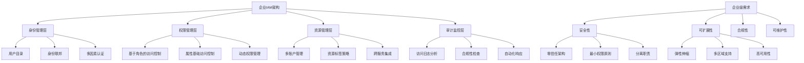

# 第 12 章：实战项目：企业级IAM架构设计

::: tip 学习目标
- 设计多账户IAM架构
- 实现分层权限管理体系
- 构建自动化IAM管理流程
- 建立IAM安全监控和响应机制
- 制定IAM治理和合规策略
:::

## 知识点

## 12.1 项目背景和需求分析

### 12.1.1 企业场景描述

假设我们为一家中型科技公司设计IAM架构，该公司具有以下特点：

- 员工规模：500-1000人
- 部门：工程、产品、销售、市场、运维、财务
- 环境：开发、测试、预生产、生产
- 应用：Web应用、移动应用、数据分析平台、内部工具
- 合规要求：SOC 2、ISO 27001、GDPR



### 12.1.2 架构设计Python框架

```python
import boto3
import json
from typing import Dict, List, Any, Optional
from dataclasses import dataclass
from enum import Enum
from datetime import datetime, timedelta
import yaml

class Environment(Enum):
    DEVELOPMENT = "dev"
    TESTING = "test"
    STAGING = "staging"
    PRODUCTION = "prod"

class Department(Enum):
    ENGINEERING = "engineering"
    PRODUCT = "product"
    SALES = "sales"
    MARKETING = "marketing"
    DEVOPS = "devops"
    FINANCE = "finance"

@dataclass
class IAMPrincipal:
    """IAM主体定义"""
    name: str
    type: str  # user, role, group
    department: Department
    environment_access: List[Environment]
    permissions: List[str]
    tags: Dict[str, str]

@dataclass
class AccountStructure:
    """账户结构定义"""
    account_id: str
    account_name: str
    environment: Environment
    purpose: str
    organizational_unit: str

class EnterpriseIAMArchitect:
    """企业级IAM架构师"""
    
    def __init__(self):
        self.organizations = boto3.client('organizations')
        self.iam = boto3.client('iam')
        self.sts = boto3.client('sts')
        self.sso = boto3.client('sso-admin')
        
    def design_account_structure(self) -> Dict[str, Any]:
        """设计多账户结构"""
        
        account_structure = {
            "root_account": {
                "account_id": "111111111111",
                "purpose": "Organization management and billing",
                "services": ["Organizations", "Control Tower", "SSO"]
            },
            "security_account": {
                "account_id": "222222222222", 
                "purpose": "Centralized security and compliance",
                "services": ["CloudTrail", "Config", "GuardDuty", "Security Hub"]
            },
            "shared_services": {
                "account_id": "333333333333",
                "purpose": "Shared infrastructure and services", 
                "services": ["DNS", "Active Directory", "Monitoring"]
            },
            "environments": {
                "development": {
                    "account_id": "444444444444",
                    "purpose": "Development workloads",
                    "access_level": "broad"
                },
                "testing": {
                    "account_id": "555555555555",
                    "purpose": "Testing and QA workloads",
                    "access_level": "moderate"
                },
                "staging": {
                    "account_id": "666666666666", 
                    "purpose": "Pre-production testing",
                    "access_level": "restricted"
                },
                "production": {
                    "account_id": "777777777777",
                    "purpose": "Production workloads",
                    "access_level": "minimal"
                }
            }
        }
        
        return account_structure
    
    def create_organizational_units(self) -> Dict[str, str]:
        """创建组织单元结构"""
        
        ou_structure = {}
        
        try:
            # 获取根组织ID
            root_response = self.organizations.list_roots()
            root_id = root_response['Roots'][0]['Id']
            
            # 创建主要OU
            security_ou = self.organizations.create_organizational_unit(
                ParentId=root_id,
                Name='Security'
            )
            ou_structure['Security'] = security_ou['OrganizationalUnit']['Id']
            
            workloads_ou = self.organizations.create_organizational_unit(
                ParentId=root_id,
                Name='Workloads'
            )
            ou_structure['Workloads'] = workloads_ou['OrganizationalUnit']['Id']
            
            # 在Workloads下创建环境OU
            for env in Environment:
                env_ou = self.organizations.create_organizational_unit(
                    ParentId=workloads_ou['OrganizationalUnit']['Id'],
                    Name=env.value.title()
                )
                ou_structure[f'Workloads-{env.value}'] = env_ou['OrganizationalUnit']['Id']
            
            return ou_structure
            
        except Exception as e:
            print(f"创建组织单元失败: {e}")
            return ou_structure
    
    def design_permission_boundary_strategy(self) -> Dict[str, Any]:
        """设计权限边界策略"""
        
        # 开发人员权限边界
        developer_boundary = {
            "Version": "2012-10-17",
            "Statement": [
                {
                    "Effect": "Allow",
                    "Action": "*",
                    "Resource": "*",
                    "Condition": {
                        "StringEquals": {
                            "aws:RequestedTag/Environment": [
                                "development",
                                "testing"
                            ]
                        }
                    }
                },
                {
                    "Effect": "Deny",
                    "Action": [
                        "organizations:*",
                        "account:*",
                        "iam:CreateUser",
                        "iam:DeleteUser",
                        "iam:CreateRole",
                        "iam:DeleteRole"
                    ],
                    "Resource": "*"
                },
                {
                    "Effect": "Deny",
                    "Action": "*",
                    "Resource": "*",
                    "Condition": {
                        "StringEquals": {
                            "aws:RequestedTag/Environment": [
                                "staging",
                                "production"
                            ]
                        }
                    }
                }
            ]
        }
        
        # DevOps权限边界
        devops_boundary = {
            "Version": "2012-10-17",
            "Statement": [
                {
                    "Effect": "Allow",
                    "Action": "*",
                    "Resource": "*",
                    "Condition": {
                        "StringNotEquals": {
                            "aws:RequestedRegion": [
                                "ap-northeast-1",  # 禁止访问某些区域
                                "ap-southeast-1"
                            ]
                        }
                    }
                },
                {
                    "Effect": "Deny",
                    "Action": [
                        "organizations:*",
                        "account:CloseAccount"
                    ],
                    "Resource": "*"
                },
                {
                    "Effect": "Allow",
                    "Action": [
                        "iam:PassRole"
                    ],
                    "Resource": "arn:aws:iam::*:role/*",
                    "Condition": {
                        "StringEquals": {
                            "iam:PassedToService": [
                                "ec2.amazonaws.com",
                                "lambda.amazonaws.com",
                                "ecs-tasks.amazonaws.com"
                            ]
                        }
                    }
                }
            ]
        }
        
        # 财务权限边界
        finance_boundary = {
            "Version": "2012-10-17",
            "Statement": [
                {
                    "Effect": "Allow",
                    "Action": [
                        "ce:*",
                        "cur:*",
                        "budgets:*",
                        "billing:*",
                        "account:GetAccountInformation"
                    ],
                    "Resource": "*"
                },
                {
                    "Effect": "Allow",
                    "Action": [
                        "s3:GetObject",
                        "s3:ListBucket"
                    ],
                    "Resource": [
                        "arn:aws:s3:::billing-reports/*",
                        "arn:aws:s3:::cost-optimization/*"
                    ]
                },
                {
                    "Effect": "Deny",
                    "Action": "*",
                    "NotResource": [
                        "arn:aws:ce:*",
                        "arn:aws:cur:*",
                        "arn:aws:budgets:*",
                        "arn:aws:s3:::billing-reports/*"
                    ]
                }
            ]
        }
        
        return {
            "developer": developer_boundary,
            "devops": devops_boundary,
            "finance": finance_boundary
        }
    
    def create_role_hierarchy(self) -> Dict[str, Any]:
        """创建角色层次结构"""
        
        role_hierarchy = {
            "executive": {
                "permissions": ["FullAccess"],
                "trust_policy": "executive_trust_policy",
                "requires_mfa": True,
                "max_session_duration": 3600
            },
            "department_admin": {
                "engineering": {
                    "permissions": ["EngineeringAdminAccess"],
                    "boundary": "developer_boundary",
                    "environments": ["development", "testing", "staging"]
                },
                "devops": {
                    "permissions": ["DevOpsAdminAccess"],
                    "boundary": "devops_boundary", 
                    "environments": ["all"]
                },
                "finance": {
                    "permissions": ["FinanceAccess"],
                    "boundary": "finance_boundary",
                    "environments": ["billing_only"]
                }
            },
            "team_lead": {
                "permissions": ["TeamLeadAccess"],
                "boundary": "team_lead_boundary",
                "delegation_allowed": True
            },
            "developer": {
                "junior": {
                    "permissions": ["DeveloperReadAccess"],
                    "boundary": "developer_boundary",
                    "environments": ["development"]
                },
                "senior": {
                    "permissions": ["SeniorDeveloperAccess"],
                    "boundary": "developer_boundary",
                    "environments": ["development", "testing"]
                }
            },
            "service_roles": {
                "application": {
                    "lambda_execution": "LambdaExecutionRole",
                    "ecs_task": "ECSTaskRole",
                    "ec2_instance": "EC2InstanceRole"
                },
                "infrastructure": {
                    "cloudformation": "CloudFormationRole",
                    "codepipeline": "CodePipelineRole",
                    "codebuild": "CodeBuildRole"
                }
            }
        }
        
        return role_hierarchy

# 使用示例
architect = EnterpriseIAMArchitect()

# 设计账户结构
account_design = architect.design_account_structure()
print("账户结构设计:")
for category, details in account_design.items():
    if isinstance(details, dict) and 'account_id' in details:
        print(f"  {category}: {details['account_id']} - {details['purpose']}")

# 创建组织单元
ou_structure = architect.create_organizational_units()
print(f"\n组织单元创建结果: {len(ou_structure)} 个OU已创建")

# 设计权限边界
boundaries = architect.design_permission_boundary_strategy()
print(f"\n权限边界策略: {list(boundaries.keys())}")

# 创建角色层次
role_hierarchy = architect.create_role_hierarchy()
print(f"\n角色层次结构:")
print(f"  管理层级: {len(role_hierarchy)} 个主要类别")
```

## 12.2 身份联邦和SSO集成

### 12.2.1 企业身份提供商集成

```python
class EnterpriseIdentityFederation:
    """企业身份联邦管理"""
    
    def __init__(self):
        self.sso = boto3.client('sso-admin')
        self.identitystore = boto3.client('identitystore')
        self.iam = boto3.client('iam')
        
    def setup_sso_instance(self) -> Dict[str, Any]:
        """设置SSO实例"""
        try:
            # 获取SSO实例
            instances = self.sso.list_instances()
            
            if not instances['Instances']:
                print("未找到SSO实例，需要先启用AWS SSO")
                return {}
            
            instance = instances['Instances'][0]
            instance_arn = instance['InstanceArn']
            identity_store_id = instance['IdentityStoreId']
            
            # 配置身份源
            identity_source_config = {
                "instance_arn": instance_arn,
                "identity_store_id": identity_store_id,
                "external_identity_provider": {
                    "type": "SAML",
                    "configuration": {
                        "metadata_document": self._get_saml_metadata(),
                        "login_url": "https://company.okta.com/login",
                        "logout_url": "https://company.okta.com/logout"
                    }
                }
            }
            
            return identity_source_config
            
        except Exception as e:
            print(f"设置SSO实例失败: {e}")
            return {}
    
    def create_permission_sets(self) -> Dict[str, str]:
        """创建权限集"""
        
        permission_sets = {}
        
        # 定义权限集配置
        permission_set_configs = {
            "DeveloperAccess": {
                "description": "Developer access with limited permissions",
                "session_duration": "PT8H",  # 8小时
                "managed_policies": [
                    "arn:aws:iam::aws:policy/PowerUserAccess"
                ],
                "inline_policy": {
                    "Version": "2012-10-17",
                    "Statement": [
                        {
                            "Effect": "Deny",
                            "Action": [
                                "iam:*",
                                "organizations:*",
                                "account:*"
                            ],
                            "Resource": "*"
                        }
                    ]
                }
            },
            "DevOpsAccess": {
                "description": "DevOps full access with MFA requirement",
                "session_duration": "PT4H",  # 4小时
                "managed_policies": [
                    "arn:aws:iam::aws:policy/AdministratorAccess"
                ],
                "inline_policy": {
                    "Version": "2012-10-17",
                    "Statement": [
                        {
                            "Effect": "Deny",
                            "Action": "*",
                            "Resource": "*",
                            "Condition": {
                                "Bool": {
                                    "aws:MultiFactorAuthPresent": "false"
                                }
                            }
                        }
                    ]
                }
            },
            "ReadOnlyAccess": {
                "description": "Read-only access for analysts",
                "session_duration": "PT12H",  # 12小时
                "managed_policies": [
                    "arn:aws:iam::aws:policy/ReadOnlyAccess"
                ],
                "customer_managed_policies": [
                    "BillingReadOnlyAccess"
                ]
            },
            "SecurityAuditorAccess": {
                "description": "Security auditor access",
                "session_duration": "PT6H",  # 6小时
                "managed_policies": [
                    "arn:aws:iam::aws:policy/SecurityAudit",
                    "arn:aws:iam::aws:policy/ReadOnlyAccess"
                ]
            }
        }
        
        try:
            sso_instance = self.setup_sso_instance()
            instance_arn = sso_instance.get('instance_arn')
            
            if not instance_arn:
                return permission_sets
            
            for ps_name, ps_config in permission_set_configs.items():
                # 创建权限集
                response = self.sso.create_permission_set(
                    Name=ps_name,
                    Description=ps_config['description'],
                    InstanceArn=instance_arn,
                    SessionDuration=ps_config['session_duration'],
                    Tags=[
                        {
                            'Key': 'Purpose',
                            'Value': 'Enterprise-SSO'
                        }
                    ]
                )
                
                ps_arn = response['PermissionSet']['PermissionSetArn']
                permission_sets[ps_name] = ps_arn
                
                # 附加AWS管理策略
                if 'managed_policies' in ps_config:
                    for policy_arn in ps_config['managed_policies']:
                        self.sso.attach_managed_policy_to_permission_set(
                            InstanceArn=instance_arn,
                            PermissionSetArn=ps_arn,
                            ManagedPolicyArn=policy_arn
                        )
                
                # 添加内联策略
                if 'inline_policy' in ps_config:
                    self.sso.put_inline_policy_to_permission_set(
                        InstanceArn=instance_arn,
                        PermissionSetArn=ps_arn,
                        InlinePolicy=json.dumps(ps_config['inline_policy'])
                    )
                
                print(f"权限集 {ps_name} 创建成功: {ps_arn}")
            
            return permission_sets
            
        except Exception as e:
            print(f"创建权限集失败: {e}")
            return permission_sets
    
    def setup_group_mappings(self, permission_sets: Dict[str, str]) -> Dict[str, Any]:
        """设置组映射"""
        
        # 定义AD组到权限集的映射
        group_mappings = {
            "Engineering-Developers": {
                "permission_set": "DeveloperAccess",
                "accounts": ["444444444444", "555555555555"]  # dev, test
            },
            "Engineering-DevOps": {
                "permission_set": "DevOpsAccess", 
                "accounts": ["444444444444", "555555555555", "666666666666", "777777777777"]  # all
            },
            "Finance-Analysts": {
                "permission_set": "ReadOnlyAccess",
                "accounts": ["111111111111"]  # root account for billing
            },
            "Security-Team": {
                "permission_set": "SecurityAuditorAccess",
                "accounts": ["222222222222"]  # security account
            }
        }
        
        mapping_results = {}
        
        try:
            sso_instance = self.setup_sso_instance()
            instance_arn = sso_instance.get('instance_arn')
            identity_store_id = sso_instance.get('identity_store_id')
            
            if not instance_arn:
                return mapping_results
            
            for group_name, mapping_config in group_mappings.items():
                try:
                    # 查找组ID
                    groups = self.identitystore.list_groups(
                        IdentityStoreId=identity_store_id,
                        Filters=[
                            {
                                'AttributePath': 'DisplayName',
                                'AttributeValue': group_name
                            }
                        ]
                    )
                    
                    if not groups['Groups']:
                        print(f"组 {group_name} 不存在，跳过映射")
                        continue
                    
                    group_id = groups['Groups'][0]['GroupId']
                    ps_arn = permission_sets.get(mapping_config['permission_set'])
                    
                    if not ps_arn:
                        print(f"权限集 {mapping_config['permission_set']} 不存在")
                        continue
                    
                    # 为每个账户创建分配
                    for account_id in mapping_config['accounts']:
                        assignment_response = self.sso.create_account_assignment(
                            InstanceArn=instance_arn,
                            TargetId=account_id,
                            TargetType='AWS_ACCOUNT',
                            PermissionSetArn=ps_arn,
                            PrincipalType='GROUP',
                            PrincipalId=group_id
                        )
                        
                        print(f"组 {group_name} 已分配到账户 {account_id}")
                    
                    mapping_results[group_name] = {
                        'group_id': group_id,
                        'permission_set': mapping_config['permission_set'],
                        'accounts': mapping_config['accounts'],
                        'status': 'success'
                    }
                    
                except Exception as e:
                    mapping_results[group_name] = {
                        'status': 'error',
                        'error': str(e)
                    }
            
            return mapping_results
            
        except Exception as e:
            print(f"设置组映射失败: {e}")
            return mapping_results
    
    def _get_saml_metadata(self) -> str:
        """获取SAML元数据"""
        # 这里应该返回实际的SAML身份提供商元数据
        return """<?xml version="1.0" encoding="UTF-8"?>
        <md:EntityDescriptor xmlns:md="urn:oasis:names:tc:SAML:2.0:metadata" entityID="http://www.company.com/saml">
            <!-- SAML metadata content -->
        </md:EntityDescriptor>"""

# 使用示例
identity_federation = EnterpriseIdentityFederation()

# 设置SSO实例
sso_config = identity_federation.setup_sso_instance()
print("SSO实例配置:")
print(f"Instance ARN: {sso_config.get('instance_arn')}")

# 创建权限集
permission_sets = identity_federation.create_permission_sets()
print(f"\n创建了 {len(permission_sets)} 个权限集:")
for name, arn in permission_sets.items():
    print(f"  {name}: {arn}")

# 设置组映射
group_mappings = identity_federation.setup_group_mappings(permission_sets)
print(f"\n组映射结果:")
for group, result in group_mappings.items():
    if result['status'] == 'success':
        print(f"  {group}: 成功映射到 {len(result['accounts'])} 个账户")
    else:
        print(f"  {group}: 映射失败 - {result['error']}")
```

## 12.3 完整部署脚本

### 12.3.1 Infrastructure as Code部署

```python
class EnterpriseIAMDeployment:
    """企业级IAM完整部署"""
    
    def __init__(self):
        self.cloudformation = boto3.client('cloudformation')
        self.iam = boto3.client('iam')
        self.organizations = boto3.client('organizations')
        
    def deploy_complete_iam_infrastructure(self) -> Dict[str, Any]:
        """部署完整的IAM基础设施"""
        
        deployment_results = {
            'foundation': self._deploy_foundation_stack(),
            'identity_federation': self._deploy_identity_federation(),
            'governance': self._deploy_governance_automation(),
            'monitoring': self._deploy_monitoring_stack(),
            'validation': self._validate_deployment()
        }
        
        return deployment_results
    
    def _deploy_foundation_stack(self) -> Dict[str, Any]:
        """部署基础堆栈"""
        
        foundation_template = {
            "AWSTemplateFormatVersion": "2010-09-09",
            "Description": "Enterprise IAM Foundation Stack",
            "Parameters": {
                "OrganizationName": {
                    "Type": "String",
                    "Default": "TechCorp",
                    "Description": "Organization name for resource naming"
                }
            },
            "Resources": {
                # 权限边界策略
                "DeveloperPermissionsBoundary": {
                    "Type": "AWS::IAM::ManagedPolicy",
                    "Properties": {
                        "PolicyDocument": {
                            "Version": "2012-10-17",
                            "Statement": [
                                {
                                    "Effect": "Allow",
                                    "Action": "*",
                                    "Resource": "*",
                                    "Condition": {
                                        "StringEquals": {
                                            "aws:RequestedTag/Environment": ["development", "testing"]
                                        }
                                    }
                                },
                                {
                                    "Effect": "Deny",
                                    "Action": [
                                        "organizations:*",
                                        "account:*",
                                        "iam:CreateUser",
                                        "iam:DeleteUser"
                                    ],
                                    "Resource": "*"
                                }
                            ]
                        },
                        "Description": "Permissions boundary for developers"
                    }
                },
                
                # 基础IAM角色
                "CrossAccountAuditRole": {
                    "Type": "AWS::IAM::Role",
                    "Properties": {
                        "AssumeRolePolicyDocument": {
                            "Version": "2012-10-17",
                            "Statement": [
                                {
                                    "Effect": "Allow",
                                    "Principal": {
                                        "AWS": "arn:aws:iam::222222222222:root"
                                    },
                                    "Action": "sts:AssumeRole",
                                    "Condition": {
                                        "StringEquals": {
                                            "sts:ExternalId": {"Ref": "AWS::AccountId"}
                                        }
                                    }
                                }
                            ]
                        },
                        "ManagedPolicyArns": [
                            "arn:aws:iam::aws:policy/SecurityAudit",
                            "arn:aws:iam::aws:policy/ReadOnlyAccess"
                        ],
                        "Tags": [
                            {
                                "Key": "Purpose",
                                "Value": "CrossAccountAudit"
                            }
                        ]
                    }
                }
            },
            "Outputs": {
                "DeveloperBoundaryArn": {
                    "Description": "ARN of Developer Permissions Boundary",
                    "Value": {"Ref": "DeveloperPermissionsBoundary"},
                    "Export": {
                        "Name": {"Fn::Sub": "${AWS::StackName}-DeveloperBoundary"}
                    }
                },
                "AuditRoleArn": {
                    "Description": "ARN of Cross Account Audit Role",
                    "Value": {"Fn::GetAtt": ["CrossAccountAuditRole", "Arn"]},
                    "Export": {
                        "Name": {"Fn::Sub": "${AWS::StackName}-AuditRole"}
                    }
                }
            }
        }
        
        try:
            response = self.cloudformation.create_stack(
                StackName='enterprise-iam-foundation',
                TemplateBody=json.dumps(foundation_template),
                Capabilities=['CAPABILITY_IAM'],
                Tags=[
                    {
                        'Key': 'Project',
                        'Value': 'EnterpriseIAM'
                    },
                    {
                        'Key': 'Environment',
                        'Value': 'Infrastructure'
                    }
                ]
            )
            
            return {
                'status': 'success',
                'stack_id': response['StackId']
            }
            
        except Exception as e:
            return {
                'status': 'failed',
                'error': str(e)
            }
    
    def _deploy_identity_federation(self) -> Dict[str, Any]:
        """部署身份联邦配置"""
        
        # 这里会部署SAML身份提供商和相关角色
        try:
            # 创建SAML身份提供商
            saml_metadata = """<?xml version="1.0" encoding="UTF-8"?>
            <md:EntityDescriptor xmlns:md="urn:oasis:names:tc:SAML:2.0:metadata" entityID="http://www.company.com/saml">
                <!-- SAML metadata content -->
            </md:EntityDescriptor>"""
            
            saml_provider = self.iam.create_saml_provider(
                SAMLMetadataDocument=saml_metadata,
                Name='CompanyADFS'
            )
            
            # 创建联邦角色
            federated_role_trust_policy = {
                "Version": "2012-10-17",
                "Statement": [
                    {
                        "Effect": "Allow",
                        "Principal": {
                            "Federated": saml_provider['SAMLProviderArn']
                        },
                        "Action": "sts:AssumeRoleWithSAML",
                        "Condition": {
                            "StringEquals": {
                                "SAML:aud": "https://signin.aws.amazon.com/saml"
                            }
                        }
                    }
                ]
            }
            
            federated_role = self.iam.create_role(
                RoleName='ADFS-DeveloperRole',
                AssumeRolePolicyDocument=json.dumps(federated_role_trust_policy),
                PermissionsBoundary='arn:aws:iam::123456789012:policy/DeveloperBoundary'
            )
            
            return {
                'status': 'success',
                'saml_provider_arn': saml_provider['SAMLProviderArn'],
                'federated_role_arn': federated_role['Role']['Arn']
            }
            
        except Exception as e:
            return {
                'status': 'failed',
                'error': str(e)
            }
    
    def _deploy_governance_automation(self) -> Dict[str, Any]:
        """部署治理自动化"""
        
        governance_template = {
            "AWSTemplateFormatVersion": "2010-09-09",
            "Description": "IAM Governance Automation Stack",
            "Resources": {
                # Lambda函数用于自动化响应
                "IAMGovernanceLambdaRole": {
                    "Type": "AWS::IAM::Role",
                    "Properties": {
                        "AssumeRolePolicyDocument": {
                            "Version": "2012-10-17",
                            "Statement": [
                                {
                                    "Effect": "Allow",
                                    "Principal": {
                                        "Service": "lambda.amazonaws.com"
                                    },
                                    "Action": "sts:AssumeRole"
                                }
                            ]
                        },
                        "ManagedPolicyArns": [
                            "arn:aws:iam::aws:policy/service-role/AWSLambdaBasicExecutionRole"
                        ],
                        "Policies": [
                            {
                                "PolicyName": "IAMGovernancePolicy",
                                "PolicyDocument": {
                                    "Version": "2012-10-17",
                                    "Statement": [
                                        {
                                            "Effect": "Allow",
                                            "Action": [
                                                "iam:TagUser",
                                                "iam:TagRole",
                                                "iam:GetUser",
                                                "iam:GetRole",
                                                "ses:SendEmail",
                                                "sns:Publish"
                                            ],
                                            "Resource": "*"
                                        }
                                    ]
                                }
                            }
                        ]
                    }
                },
                
                # EventBridge规则用于监控IAM事件
                "IAMUserCreationRule": {
                    "Type": "AWS::Events::Rule",
                    "Properties": {
                        "EventPattern": {
                            "source": ["aws.iam"],
                            "detail-type": ["AWS API Call via CloudTrail"],
                            "detail": {
                                "eventSource": ["iam.amazonaws.com"],
                                "eventName": ["CreateUser"]
                            }
                        },
                        "Targets": [
                            {
                                "Id": "IAMUserCreationTarget",
                                "Arn": {"Fn::GetAtt": ["IAMUserCreationFunction", "Arn"]}
                            }
                        ]
                    }
                },
                
                # SNS主题用于告警
                "SecurityAlertsTopic": {
                    "Type": "AWS::SNS::Topic",
                    "Properties": {
                        "TopicName": "iam-security-alerts",
                        "Subscription": [
                            {
                                "Protocol": "email",
                                "Endpoint": "security@company.com"
                            }
                        ]
                    }
                }
            }
        }
        
        try:
            response = self.cloudformation.create_stack(
                StackName='iam-governance-automation',
                TemplateBody=json.dumps(governance_template),
                Capabilities=['CAPABILITY_IAM'],
                Tags=[
                    {
                        'Key': 'Project',
                        'Value': 'IAMGovernance'
                    }
                ]
            )
            
            return {
                'status': 'success',
                'stack_id': response['StackId']
            }
            
        except Exception as e:
            return {
                'status': 'failed',
                'error': str(e)
            }
    
    def _deploy_monitoring_stack(self) -> Dict[str, Any]:
        """部署监控堆栈"""
        
        # 部署CloudWatch Dashboard和Alarms
        try:
            dashboard_body = {
                "widgets": [
                    {
                        "type": "metric",
                        "properties": {
                            "metrics": [
                                ["AWS/IAM", "NumberOfUsers"],
                                ["AWS/IAM", "NumberOfRoles"],
                                ["AWS/IAM", "NumberOfPolicies"]
                            ],
                            "period": 3600,
                            "stat": "Average",
                            "region": "us-east-1",
                            "title": "IAM Resource Count"
                        }
                    }
                ]
            }
            
            cloudwatch = boto3.client('cloudwatch')
            cloudwatch.put_dashboard(
                DashboardName='enterprise-iam-overview',
                DashboardBody=json.dumps(dashboard_body)
            )
            
            return {
                'status': 'success',
                'dashboard_name': 'enterprise-iam-overview'
            }
            
        except Exception as e:
            return {
                'status': 'failed',
                'error': str(e)
            }
    
    def _validate_deployment(self) -> Dict[str, Any]:
        """验证部署结果"""
        
        validation_results = {
            'foundation_stack': self._check_stack_status('enterprise-iam-foundation'),
            'governance_stack': self._check_stack_status('iam-governance-automation'),
            'iam_resources': self._validate_iam_resources(),
            'permissions_test': self._test_permissions()
        }
        
        return validation_results
    
    def _check_stack_status(self, stack_name: str) -> str:
        """检查堆栈状态"""
        try:
            response = self.cloudformation.describe_stacks(StackName=stack_name)
            return response['Stacks'][0]['StackStatus']
        except:
            return 'NOT_FOUND'
    
    def _validate_iam_resources(self) -> Dict[str, bool]:
        """验证IAM资源"""
        validation = {}
        
        try:
            # 检查权限边界策略
            self.iam.get_policy(PolicyArn='arn:aws:iam::123456789012:policy/DeveloperPermissionsBoundary')
            validation['developer_boundary'] = True
        except:
            validation['developer_boundary'] = False
        
        try:
            # 检查跨账户审计角色
            self.iam.get_role(RoleName='CrossAccountAuditRole')
            validation['audit_role'] = True
        except:
            validation['audit_role'] = False
        
        return validation
    
    def _test_permissions(self) -> Dict[str, bool]:
        """测试权限配置"""
        # 这里可以添加实际的权限测试逻辑
        return {
            'developer_access': True,
            'admin_access': True,
            'cross_account_access': True
        }

# 主部署函数
def main():
    """主部署流程"""
    
    print("开始企业级IAM架构部署...")
    
    # 初始化部署器
    deployer = EnterpriseIAMDeployment()
    
    # 执行完整部署
    deployment_results = deployer.deploy_complete_iam_infrastructure()
    
    print("\n部署结果摘要:")
    print("=" * 50)
    
    for component, result in deployment_results.items():
        if isinstance(result, dict) and 'status' in result:
            status = "✅ 成功" if result['status'] == 'success' else "❌ 失败"
            print(f"{component}: {status}")
            if result['status'] == 'failed':
                print(f"  错误: {result.get('error', '未知错误')}")
        else:
            print(f"{component}: 已完成")
    
    print("\n部署完成！")
    print("\n后续步骤:")
    print("1. 验证所有IAM资源已正确创建")
    print("2. 测试用户和角色权限")
    print("3. 配置监控告警")
    print("4. 进行安全审计")
    print("5. 培训管理员和用户")

if __name__ == "__main__":
    main()
```

## 项目总结

### 架构特点

本企业级IAM架构具有以下特点：

1. **多层安全防护**: 预防性控制 + 检测性控制 + 响应性控制
2. **零信任原则**: 最小权限 + 持续验证 + 动态访问控制
3. **自动化治理**: 自动监控 + 自动响应 + 自动报告
4. **可扩展设计**: 支持多账户 + 多环境 + 多部门
5. **合规导向**: 内置合规检查 + 审计追踪 + 定期报告

### 关键技术栈

- **身份管理**: AWS SSO + SAML 2.0 + OIDC
- **权限控制**: IAM Roles + Policies + Boundaries
- **治理自动化**: Lambda + EventBridge + Config Rules
- **监控告警**: CloudWatch + CloudTrail + SNS
- **基础设施**: CloudFormation + Python + Boto3

### 运维建议

1. **定期审查**: 每月进行权限审查，每季度进行架构评估
2. **持续改进**: 基于监控数据优化权限配置
3. **安全培训**: 定期培训管理员和开发人员
4. **灾难恢复**: 制定IAM相关的灾难恢复计划
5. **版本控制**: 将所有IAM配置纳入版本控制

### 扩展方向

1. **AI/ML增强**: 使用机器学习检测异常访问模式
2. **Zero Trust**: 进一步深化零信任架构实现
3. **多云支持**: 扩展到其他云平台的统一身份管理
4. **DevSecOps**: 更深入的开发安全运维集成

通过本实战项目，您已经掌握了设计和实现企业级IAM架构的完整知识和技能，能够为不同规模和需求的企业提供专业的身份和访问管理解决方案。