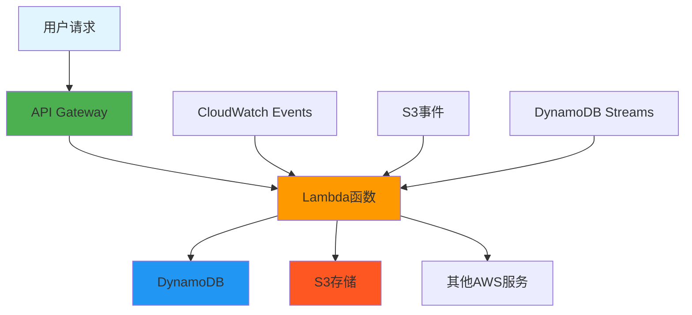
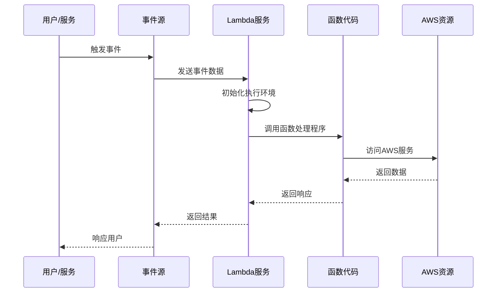
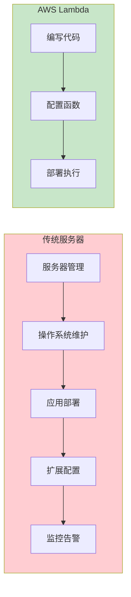

# 第 1 章：AWS Lambda 基础概念

::: tip 学习目标
- 理解什么是AWS Lambda及其核心概念
- 掌握Lambda的工作原理和执行模型  
- 了解Lambda的优势和使用场景
- 理解Serverless架构概念
:::

## 知识点

### 什么是AWS Lambda

AWS Lambda是亚马逊云服务提供的**函数即服务(FaaS)**平台，允许开发者在不管理服务器的情况下运行代码。Lambda会自动处理计算资源的分配、扩展和管理。

### 核心概念

- **函数(Function)**: Lambda的基本执行单元，包含代码和配置信息
- **事件(Event)**: 触发Lambda函数执行的数据
- **运行时(Runtime)**: 函数代码的执行环境
- **处理程序(Handler)**: 函数的入口点

### Serverless架构概念图



### Lambda工作原理



## 示例代码

### 简单的Python Lambda函数

```python
import json

def lambda_handler(event, context):
    """
    Lambda函数的基本结构
    
    Args:
        event: 包含触发事件信息的字典
        context: 运行时信息对象
    
    Returns:
        dict: 包含状态码和响应体的字典
    """
    
    # 处理输入事件
    name = event.get('name', 'World')
    
    # 执行业务逻辑
    message = f"Hello, {name}!"
    
    # 返回响应
    return {
        'statusCode': 200,
        'headers': {
            'Content-Type': 'application/json'
        },
        'body': json.dumps({
            'message': message,
            'requestId': context.aws_request_id
        })
    }
```

### 事件对象结构示例

```python
# API Gateway触发的事件示例
api_gateway_event = {
    "httpMethod": "GET",
    "path": "/hello",
    "queryStringParameters": {
        "name": "Alice"
    },
    "headers": {
        "Content-Type": "application/json"
    },
    "body": None,
    "requestContext": {
        "requestId": "12345",
        "stage": "prod"
    }
}

# S3事件触发示例
s3_event = {
    "Records": [
        {
            "eventSource": "aws:s3",
            "eventName": "ObjectCreated:Put",
            "s3": {
                "bucket": {
                    "name": "my-bucket"
                },
                "object": {
                    "key": "uploads/image.jpg"
                }
            }
        }
    ]
}
```

## Lambda优势与特点

::: note Lambda的主要优势
- **无服务器管理**: 无需管理底层基础设施
- **自动扩展**: 根据请求量自动扩缩容
- **按使用付费**: 只为代码执行时间付费
- **高可用性**: AWS自动处理故障恢复
- **快速部署**: 秒级部署和更新
:::

::: warning 注意事项
- **执行时间限制**: 最长15分钟
- **内存限制**: 128MB到10,240MB
- **冷启动延迟**: 首次调用可能有延迟
- **状态无关**: 函数应设计为无状态
:::

## 使用场景对比

| 场景类型 | 适用性 | 示例 |
|---------|--------|------|
| 数据处理 | ✅ 非常适合 | 图片处理、日志分析、ETL操作 |
| Web API | ✅ 适合 | REST API、微服务后端 |
| 实时处理 | ✅ 适合 | 流数据处理、实时分析 |
| 定时任务 | ✅ 适合 | 数据备份、报告生成 |
| 长时间运行 | ❌ 不适合 | 大数据批处理、机器学习训练 |
| 有状态应用 | ❌ 不适合 | 数据库服务、缓存服务 |

## 与传统服务器对比



::: tip 理解要点
Lambda将基础设施管理抽象化，让开发者专注于业务逻辑实现，是现代云原生应用开发的重要组成部分。
:::