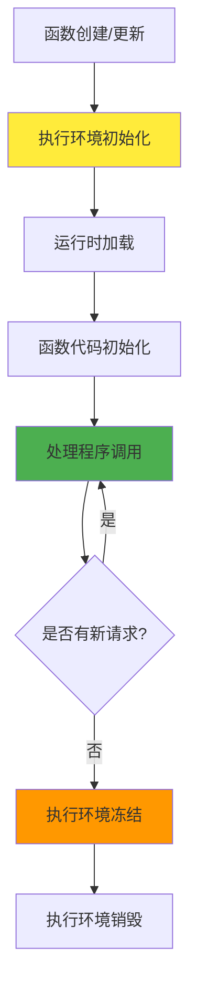
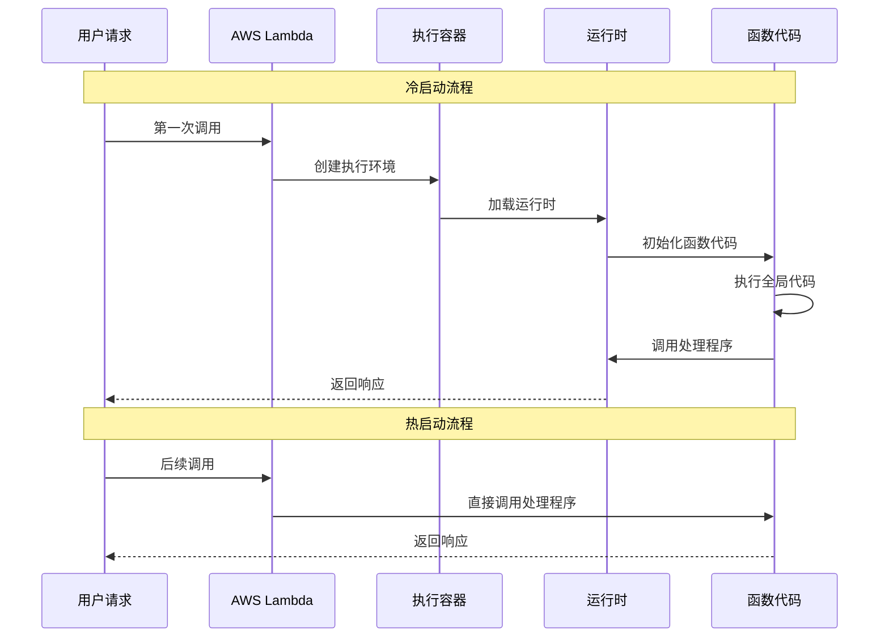
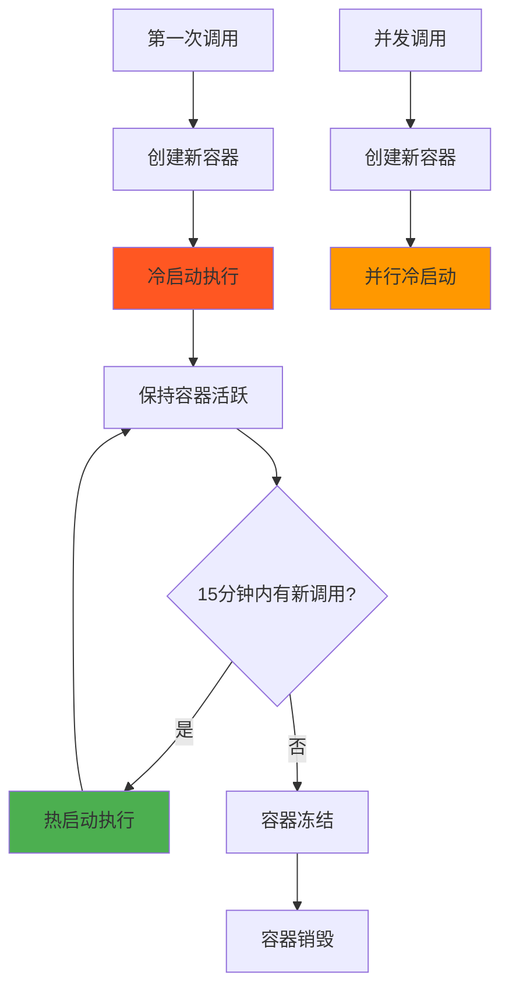

# 第 2 章：Lambda 函数生命周期与运行时

::: tip 学习目标
- 理解Lambda函数的生命周期
- 掌握不同运行时环境的特点
- 了解冷启动和热启动概念
- 理解执行上下文的重用机制
:::

## 知识点

### Lambda函数生命周期

Lambda函数的生命周期包含初始化、调用和销毁三个主要阶段：



### 运行时环境类型

AWS Lambda支持多种运行时环境：

| 运行时 | 版本 | 架构支持 | 特点 |
|-------|------|----------|------|
| Python | 3.8, 3.9, 3.10, 3.11 | x86_64, arm64 | 快速启动，丰富的库生态 |
| Node.js | 14.x, 16.x, 18.x | x86_64, arm64 | 轻量级，适合I/O密集型 |
| Java | 8, 11, 17 | x86_64, arm64 | 企业级，但冷启动较慢 |
| .NET | Core 3.1, 6 | x86_64, arm64 | 性能优秀，类型安全 |
| Go | 1.x | x86_64, arm64 | 高性能，单文件部署 |
| Ruby | 2.7, 3.2 | x86_64, arm64 | 快速开发，灵活语法 |

### 冷启动 vs 热启动



## 示例代码

### Python运行时生命周期示例

```python
import json
import time
import logging

# 全局变量 - 在冷启动时初始化一次
logger = logging.getLogger()
logger.setLevel(logging.INFO)

# 全局初始化代码 - 只在冷启动时执行
initialization_time = time.time()
logger.info(f"Function initialized at: {initialization_time}")

# 模拟数据库连接池 - 可在多次调用间重用
class ConnectionPool:
    def __init__(self):
        self.connections = []
        logger.info("Connection pool initialized")
    
    def get_connection(self):
        # 模拟获取数据库连接
        return f"connection_{len(self.connections)}"

# 全局连接池实例
pool = ConnectionPool()

def lambda_handler(event, context):
    """
    Lambda处理程序 - 每次调用都会执行
    
    Args:
        event: 事件数据
        context: 运行时上下文信息
    """
    start_time = time.time()
    
    # 获取上下文信息
    request_id = context.aws_request_id
    remaining_time = context.get_remaining_time_in_millis()
    memory_limit = context.memory_limit_in_mb
    
    logger.info(f"Request ID: {request_id}")
    logger.info(f"Remaining time: {remaining_time}ms")
    logger.info(f"Memory limit: {memory_limit}MB")
    
    # 重用全局资源
    connection = pool.get_connection()
    
    # 处理业务逻辑
    result = {
        'statusCode': 200,
        'body': json.dumps({
            'message': 'Hello from Lambda!',
            'requestId': request_id,
            'initTime': initialization_time,
            'invocationTime': start_time,
            'connection': connection,
            'memoryLimit': memory_limit
        })
    }
    
    processing_time = (time.time() - start_time) * 1000
    logger.info(f"Processing time: {processing_time:.2f}ms")
    
    return result
```

### Context对象属性详解

```python
def explore_context(event, context):
    """
    探索Lambda上下文对象的所有属性
    """
    context_info = {
        # 基本信息
        'function_name': context.function_name,
        'function_version': context.function_version,
        'invoked_function_arn': context.invoked_function_arn,
        
        # 请求信息
        'aws_request_id': context.aws_request_id,
        'log_group_name': context.log_group_name,
        'log_stream_name': context.log_stream_name,
        
        # 资源限制
        'memory_limit_in_mb': context.memory_limit_in_mb,
        'remaining_time_in_millis': context.get_remaining_time_in_millis(),
        
        # 身份信息
        'identity': getattr(context, 'identity', None),
        'client_context': getattr(context, 'client_context', None)
    }
    
    return {
        'statusCode': 200,
        'body': json.dumps(context_info, indent=2)
    }
```

### 优化冷启动的策略

```python
import json
import boto3
from functools import lru_cache

# 1. 全局初始化重要资源
s3_client = boto3.client('s3')
dynamodb = boto3.resource('dynamodb')

# 2. 使用缓存减少重复计算
@lru_cache(maxsize=128)
def get_config_value(key):
    """缓存配置值，避免重复查询"""
    # 模拟从配置服务获取值
    return f"config_value_for_{key}"

# 3. 预热重要的连接和资源
def warm_up_resources():
    """预热资源连接"""
    try:
        # 测试AWS服务连接
        s3_client.list_buckets()
        print("S3 client warmed up")
        
        # 预加载配置
        get_config_value('default')
        print("Configuration cache warmed up")
        
    except Exception as e:
        print(f"Warm-up failed: {e}")

# 在模块加载时预热
warm_up_resources()

def lambda_handler(event, context):
    """
    优化后的Lambda处理程序
    """
    # 利用预热的资源
    config = get_config_value(event.get('config_key', 'default'))
    
    # 使用预初始化的客户端
    try:
        # 示例：从S3获取数据
        bucket = event.get('bucket', 'default-bucket')
        key = event.get('key', 'default-key')
        
        response = s3_client.get_object(Bucket=bucket, Key=key)
        content = response['Body'].read().decode('utf-8')
        
        return {
            'statusCode': 200,
            'body': json.dumps({
                'message': 'Success',
                'config': config,
                'content_length': len(content)
            })
        }
        
    except Exception as e:
        return {
            'statusCode': 500,
            'body': json.dumps({
                'error': str(e)
            })
        }
```

## 运行时性能对比

::: note 不同运行时的启动性能
- **Python**: 冷启动通常100-300ms，内存效率高
- **Node.js**: 冷启动50-200ms，最快的启动速度
- **Java**: 冷启动500-2000ms，但热启动性能优秀  
- **Go**: 冷启动100-400ms，编译语言中最快
- **.NET**: 冷启动300-800ms，类型安全且性能好
:::

### 执行环境重用机制



::: warning 注意事项
- **临时文件**: `/tmp`目录在容器生命周期内保持，最大512MB
- **内存使用**: 超出配置限制会导致函数终止
- **全局变量**: 在容器重用时会保持状态
- **网络连接**: 应在全局范围建立，可重用连接池
:::

## 最佳实践

### 优化策略总结

| 策略 | 目的 | 实现方式 |
|------|------|----------|
| 全局初始化 | 减少冷启动开销 | 在处理程序外初始化资源 |
| 连接池 | 重用数据库连接 | 全局连接对象 |
| 缓存机制 | 避免重复计算 | LRU缓存、内存缓存 |
| 预热策略 | 保持容器活跃 | 定时调用、预留并发 |
| 资源清理 | 避免内存泄漏 | 及时释放临时资源 |

::: tip 理解要点
Lambda的生命周期管理是自动的，但理解其机制有助于编写更高效的函数代码。合理利用容器重用可以显著提升性能。
:::