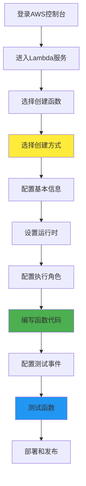
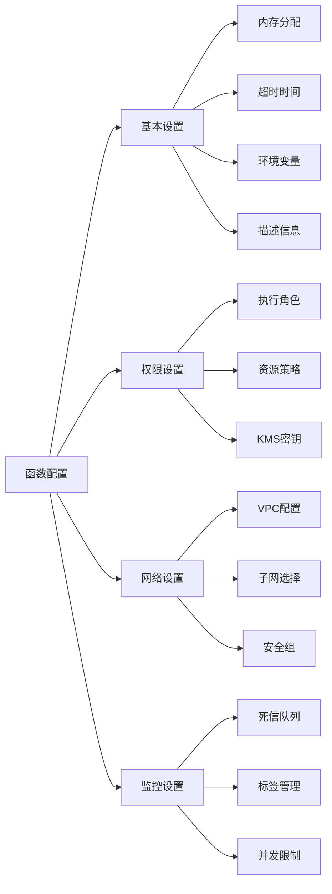

# 第 3 章：手动创建和配置Lambda函数

::: tip 学习目标
- 通过AWS控制台创建Lambda函数
- 配置函数的基本参数和环境变量
- 设置函数的权限和执行角色
- 测试和调试Lambda函数
:::

## 知识点

### 创建Lambda函数的步骤

创建Lambda函数的完整流程包括以下主要步骤：



### 函数创建方式对比

| 创建方式 | 适用场景 | 优点 | 缺点 |
|---------|----------|------|------|
| 从头开始 | 自定义需求 | 完全控制 | 需要手动配置所有内容 |
| 使用蓝图 | 常见模式 | 快速开始 | 模板有限 |
| 容器镜像 | 复杂依赖 | 灵活部署 | 镜像管理复杂 |
| 浏览器导入 | 现有代码 | 快速迁移 | 需要满足AWS应用要求 |

## 示例操作

### 1. 基本函数配置

通过AWS控制台创建一个基本的Python Lambda函数：

```python
import json
import logging

# 配置日志
logger = logging.getLogger()
logger.setLevel(logging.INFO)

def lambda_handler(event, context):
    """
    基本的Lambda函数示例
    
    Args:
        event: 输入事件数据
        context: Lambda运行时上下文
        
    Returns:
        dict: HTTP响应格式
    """
    
    # 记录事件信息
    logger.info(f"Received event: {json.dumps(event)}")
    
    # 从事件中提取参数
    name = event.get('name', 'World')
    message = event.get('message', 'Hello')
    
    # 构造响应
    response = {
        'statusCode': 200,
        'headers': {
            'Content-Type': 'application/json',
            'Access-Control-Allow-Origin': '*'
        },
        'body': json.dumps({
            'greeting': f"{message}, {name}!",
            'timestamp': context.aws_request_id,
            'function_name': context.function_name,
            'remaining_time': context.get_remaining_time_in_millis()
        })
    }
    
    logger.info(f"Returning response: {response}")
    return response
```

### 2. 环境变量配置示例

```python
import os
import json
import boto3
from botocore.exceptions import ClientError

def lambda_handler(event, context):
    """
    使用环境变量的Lambda函数示例
    """
    
    # 从环境变量获取配置
    region = os.environ.get('AWS_REGION', 'us-east-1')
    table_name = os.environ.get('DYNAMODB_TABLE', 'default-table')
    debug_mode = os.environ.get('DEBUG', 'false').lower() == 'true'
    api_key = os.environ.get('API_KEY')
    
    # 验证必需的环境变量
    if not api_key:
        return {
            'statusCode': 500,
            'body': json.dumps({
                'error': 'API_KEY environment variable not set'
            })
        }
    
    # 使用环境变量
    if debug_mode:
        print(f"Debug mode enabled")
        print(f"Region: {region}")
        print(f"Table: {table_name}")
    
    try:
        # 使用DynamoDB
        dynamodb = boto3.resource('dynamodb', region_name=region)
        table = dynamodb.Table(table_name)
        
        # 示例操作
        response = table.scan(Limit=1)
        
        return {
            'statusCode': 200,
            'body': json.dumps({
                'message': 'Configuration loaded successfully',
                'region': region,
                'table': table_name,
                'debug': debug_mode,
                'items_count': response.get('Count', 0)
            })
        }
        
    except ClientError as e:
        return {
            'statusCode': 500,
            'body': json.dumps({
                'error': f"DynamoDB error: {str(e)}"
            })
        }
```

### 3. IAM执行角色配置

```json
{
  "Version": "2012-10-17",
  "Statement": [
    {
      "Effect": "Allow",
      "Principal": {
        "Service": "lambda.amazonaws.com"
      },
      "Action": "sts:AssumeRole"
    }
  ]
}
```

```json
{
  "Version": "2012-10-17",
  "Statement": [
    {
      "Effect": "Allow",
      "Action": [
        "logs:CreateLogGroup",
        "logs:CreateLogStream",
        "logs:PutLogEvents"
      ],
      "Resource": "arn:aws:logs:*:*:*"
    },
    {
      "Effect": "Allow", 
      "Action": [
        "dynamodb:GetItem",
        "dynamodb:PutItem",
        "dynamodb:UpdateItem",
        "dynamodb:DeleteItem",
        "dynamodb:Scan",
        "dynamodb:Query"
      ],
      "Resource": "arn:aws:dynamodb:*:*:table/MyTable"
    },
    {
      "Effect": "Allow",
      "Action": [
        "s3:GetObject",
        "s3:PutObject"
      ],
      "Resource": "arn:aws:s3:::my-bucket/*"
    }
  ]
}
```

### 4. 测试事件配置

```python
# API Gateway测试事件
api_gateway_test_event = {
    "httpMethod": "POST",
    "path": "/hello",
    "headers": {
        "Content-Type": "application/json",
        "Authorization": "Bearer test-token"
    },
    "queryStringParameters": {
        "name": "Alice"
    },
    "body": json.dumps({
        "message": "Hello",
        "timestamp": "2024-01-01T00:00:00Z"
    }),
    "requestContext": {
        "requestId": "test-request-id",
        "stage": "test",
        "httpMethod": "POST",
        "path": "/hello"
    }
}

# S3事件测试事件
s3_test_event = {
    "Records": [
        {
            "eventSource": "aws:s3",
            "eventName": "ObjectCreated:Put",
            "eventVersion": "2.1",
            "eventTime": "2024-01-01T00:00:00.000Z",
            "s3": {
                "bucket": {
                    "name": "my-test-bucket",
                    "arn": "arn:aws:s3:::my-test-bucket"
                },
                "object": {
                    "key": "uploads/test-file.jpg",
                    "size": 1024,
                    "etag": "test-etag"
                }
            }
        }
    ]
}

def lambda_handler(event, context):
    """
    处理多种事件类型的Lambda函数
    """
    
    # 判断事件类型
    if 'httpMethod' in event:
        # API Gateway事件
        return handle_api_request(event, context)
    elif 'Records' in event and event['Records']:
        # S3或其他服务事件
        return handle_record_event(event, context)
    else:
        # 自定义事件
        return handle_custom_event(event, context)

def handle_api_request(event, context):
    """处理API Gateway请求"""
    method = event['httpMethod']
    path = event['path']
    
    return {
        'statusCode': 200,
        'body': json.dumps({
            'message': f'Handled {method} request to {path}',
            'requestId': context.aws_request_id
        })
    }

def handle_record_event(event, context):
    """处理Records事件"""
    processed_records = []
    
    for record in event['Records']:
        source = record.get('eventSource', 'unknown')
        processed_records.append({
            'source': source,
            'eventName': record.get('eventName', 'unknown')
        })
    
    return {
        'statusCode': 200,
        'body': json.dumps({
            'message': f'Processed {len(processed_records)} records',
            'records': processed_records
        })
    }

def handle_custom_event(event, context):
    """处理自定义事件"""
    return {
        'statusCode': 200,
        'body': json.dumps({
            'message': 'Handled custom event',
            'event': event
        })
    }
```

## 函数配置详解

### 基本配置选项



### 内存和性能配置

| 内存(MB) | CPU能力 | 适用场景 | 成本影响 |
|----------|---------|----------|----------|
| 128-512 | 低 | 简单API、文本处理 | 最低成本 |
| 512-1024 | 中 | 数据处理、API调用 | 平衡性价比 |
| 1024-3008 | 高 | 图像处理、复杂计算 | 高性能需求 |
| 3008-10240 | 极高 | 机器学习、大数据 | 最高成本 |

::: note 配置建议
- **内存配置**: 根据实际需求调整，过高浪费成本，过低影响性能
- **超时设置**: API函数建议30秒以内，批处理可设置更长时间
- **环境变量**: 敏感信息使用KMS加密，避免硬编码
- **执行角色**: 遵循最小权限原则，只授予必需的权限
:::

### 调试和监控

```python
import json
import logging
import time
from datetime import datetime

# 配置结构化日志
logging.basicConfig(
    level=logging.INFO,
    format='%(asctime)s - %(levelname)s - %(message)s'
)
logger = logging.getLogger(__name__)

def lambda_handler(event, context):
    """
    带有详细监控和调试信息的Lambda函数
    """
    
    start_time = time.time()
    
    # 记录请求开始
    logger.info({
        'event': 'function_start',
        'request_id': context.aws_request_id,
        'function_name': context.function_name,
        'memory_limit': context.memory_limit_in_mb,
        'remaining_time': context.get_remaining_time_in_millis()
    })
    
    try:
        # 业务逻辑处理
        result = process_business_logic(event, context)
        
        # 记录成功
        processing_time = (time.time() - start_time) * 1000
        logger.info({
            'event': 'function_success',
            'processing_time_ms': processing_time,
            'request_id': context.aws_request_id
        })
        
        return result
        
    except Exception as e:
        # 记录错误
        processing_time = (time.time() - start_time) * 1000
        logger.error({
            'event': 'function_error',
            'error_type': type(e).__name__,
            'error_message': str(e),
            'processing_time_ms': processing_time,
            'request_id': context.aws_request_id
        })
        
        return {
            'statusCode': 500,
            'body': json.dumps({
                'error': 'Internal server error',
                'requestId': context.aws_request_id
            })
        }

def process_business_logic(event, context):
    """
    模拟业务逻辑处理
    """
    
    # 添加业务指标
    logger.info({
        'event': 'business_logic_start',
        'input_size': len(json.dumps(event))
    })
    
    # 模拟处理时间
    time.sleep(0.1)
    
    return {
        'statusCode': 200,
        'body': json.dumps({
            'message': 'Success',
            'timestamp': datetime.utcnow().isoformat(),
            'processed_at': context.aws_request_id
        })
    }
```

::: warning 常见问题
- **权限错误**: 确保执行角色有访问所需资源的权限
- **超时问题**: 检查函数执行时间，适当调整超时设置
- **内存不足**: 监控内存使用情况，及时调整分配
- **依赖问题**: 确保所有依赖包正确打包并上传
:::

::: tip 调试技巧
- 使用CloudWatch Logs查看详细日志
- 利用AWS X-Ray进行分布式追踪
- 在本地使用SAM进行函数测试
- 使用测试事件验证不同场景
:::