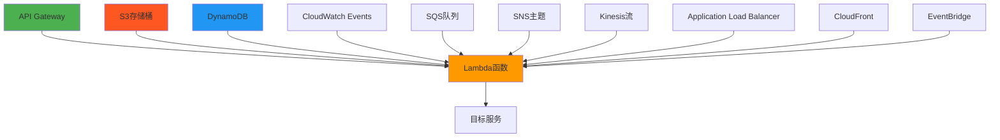
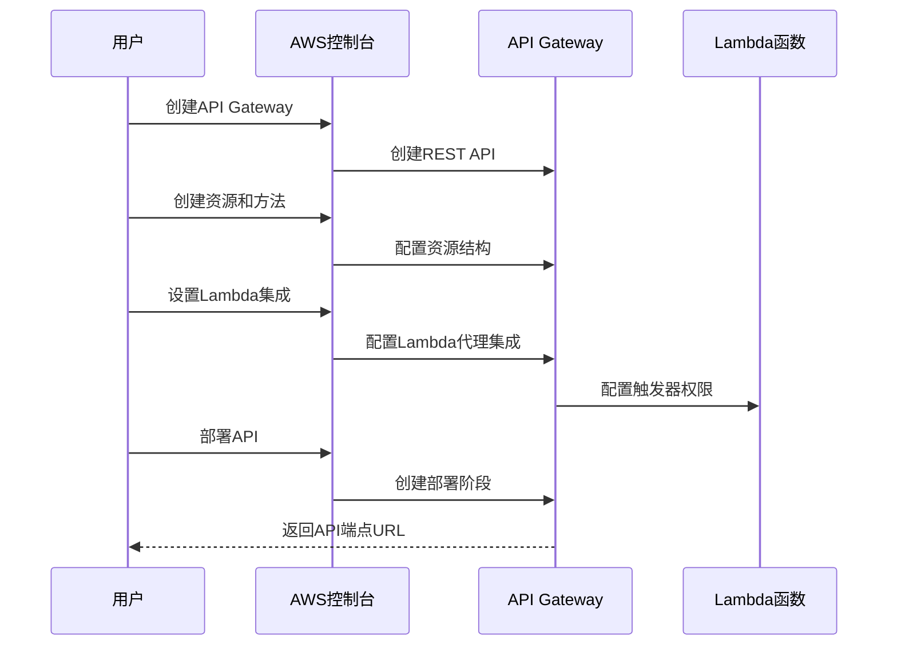

# 第 4 章：Lambda 事件源和触发器

::: tip 学习目标
- 理解各种事件源类型
- 配置API Gateway触发器
- 设置S3事件触发
- 配置定时任务(CloudWatch Events)
- 理解事件数据结构
:::

## 知识点

### Lambda事件源概览

Lambda函数可以被多种AWS服务触发，形成事件驱动的架构：



### 事件源分类

| 类型 | 事件源 | 调用模式 | 特点 |
|------|--------|----------|------|
| 同步 | API Gateway, ALB | 请求-响应 | 实时响应，有超时限制 |
| 异步 | S3, SNS, EventBridge | 事件驱动 | 无需立即响应，支持重试 |
| 流处理 | Kinesis, DynamoDB Streams | 轮询 | 批量处理，有序处理 |
| 拉模式 | SQS | 轮询 | Lambda主动拉取消息 |

## 示例代码

### 1. API Gateway事件处理

```python
import json
import logging
from urllib.parse import parse_qs

logger = logging.getLogger()
logger.setLevel(logging.INFO)

def lambda_handler(event, context):
    """
    处理API Gateway事件
    
    API Gateway事件结构：
    - httpMethod: HTTP方法
    - path: 请求路径
    - headers: 请求头
    - queryStringParameters: 查询参数
    - body: 请求体
    - requestContext: 请求上下文
    """
    
    logger.info(f"API Gateway event: {json.dumps(event)}")
    
    # 提取请求信息
    http_method = event.get('httpMethod')
    path = event.get('path')
    headers = event.get('headers', {})
    query_params = event.get('queryStringParameters') or {}
    body = event.get('body')
    
    # 处理不同HTTP方法
    if http_method == 'GET':
        return handle_get_request(query_params, headers, context)
    elif http_method == 'POST':
        return handle_post_request(body, headers, context)
    elif http_method == 'PUT':
        return handle_put_request(body, headers, context)
    elif http_method == 'DELETE':
        return handle_delete_request(query_params, headers, context)
    else:
        return {
            'statusCode': 405,
            'headers': {
                'Content-Type': 'application/json',
                'Access-Control-Allow-Origin': '*'
            },
            'body': json.dumps({
                'error': f'Method {http_method} not allowed'
            })
        }

def handle_get_request(query_params, headers, context):
    """处理GET请求"""
    
    # 获取查询参数
    user_id = query_params.get('userId')
    limit = int(query_params.get('limit', 10))
    
    return {
        'statusCode': 200,
        'headers': {
            'Content-Type': 'application/json',
            'Access-Control-Allow-Origin': '*'
        },
        'body': json.dumps({
            'message': 'GET request processed',
            'userId': user_id,
            'limit': limit,
            'requestId': context.aws_request_id
        })
    }

def handle_post_request(body, headers, context):
    """处理POST请求"""
    
    try:
        # 解析JSON请求体
        if body:
            data = json.loads(body)
        else:
            data = {}
        
        # 处理业务逻辑
        result = {
            'id': context.aws_request_id,
            'data': data,
            'created_at': context.aws_request_id
        }
        
        return {
            'statusCode': 201,
            'headers': {
                'Content-Type': 'application/json',
                'Access-Control-Allow-Origin': '*'
            },
            'body': json.dumps(result)
        }
        
    except json.JSONDecodeError:
        return {
            'statusCode': 400,
            'headers': {
                'Content-Type': 'application/json',
                'Access-Control-Allow-Origin': '*'
            },
            'body': json.dumps({
                'error': 'Invalid JSON in request body'
            })
        }

def handle_put_request(body, headers, context):
    """处理PUT请求"""
    return {
        'statusCode': 200,
        'headers': {
            'Content-Type': 'application/json',
            'Access-Control-Allow-Origin': '*'
        },
        'body': json.dumps({
            'message': 'PUT request processed',
            'requestId': context.aws_request_id
        })
    }

def handle_delete_request(query_params, headers, context):
    """处理DELETE请求"""
    resource_id = query_params.get('id')
    
    if not resource_id:
        return {
            'statusCode': 400,
            'headers': {
                'Content-Type': 'application/json',
                'Access-Control-Allow-Origin': '*'
            },
            'body': json.dumps({
                'error': 'Missing required parameter: id'
            })
        }
    
    return {
        'statusCode': 204,
        'headers': {
            'Access-Control-Allow-Origin': '*'
        },
        'body': ''
    }
```

### 2. S3事件处理

```python
import json
import boto3
from urllib.parse import unquote_plus

# 初始化AWS客户端
s3_client = boto3.client('s3')
rekognition_client = boto3.client('rekognition')

def lambda_handler(event, context):
    """
    处理S3事件，如文件上传、删除等
    
    S3事件结构：
    - Records: 事件记录数组
    - eventSource: aws:s3
    - eventName: 事件类型
    - s3.bucket: 存储桶信息
    - s3.object: 对象信息
    """
    
    logger.info(f"S3 event: {json.dumps(event)}")
    
    results = []
    
    # 处理每个S3事件记录
    for record in event['Records']:
        # 提取事件信息
        event_source = record['eventSource']
        event_name = record['eventName']
        
        if event_source == 'aws:s3':
            result = process_s3_record(record, context)
            results.append(result)
    
    return {
        'statusCode': 200,
        'body': json.dumps({
            'processed_records': len(results),
            'results': results
        })
    }

def process_s3_record(record, context):
    """
    处理单个S3记录
    """
    
    # 提取S3信息
    bucket_name = record['s3']['bucket']['name']
    object_key = unquote_plus(record['s3']['object']['key'])
    event_name = record['eventName']
    object_size = record['s3']['object']['size']
    
    logger.info(f"Processing {event_name} for {object_key} in bucket {bucket_name}")
    
    # 根据事件类型处理
    if event_name.startswith('ObjectCreated'):
        return handle_object_created(bucket_name, object_key, object_size, context)
    elif event_name.startswith('ObjectRemoved'):
        return handle_object_removed(bucket_name, object_key, context)
    else:
        return {
            'status': 'ignored',
            'event_name': event_name,
            'object_key': object_key
        }

def handle_object_created(bucket_name, object_key, object_size, context):
    """
    处理对象创建事件
    """
    
    try:
        # 检查文件类型
        if object_key.lower().endswith(('.jpg', '.jpeg', '.png')):
            # 处理图片文件
            return process_image_file(bucket_name, object_key, context)
        elif object_key.lower().endswith(('.mp4', '.avi', '.mov')):
            # 处理视频文件
            return process_video_file(bucket_name, object_key, context)
        else:
            # 处理其他文件
            return {
                'status': 'processed',
                'file_type': 'other',
                'object_key': object_key,
                'size': object_size
            }
            
    except Exception as e:
        logger.error(f"Error processing {object_key}: {str(e)}")
        return {
            'status': 'error',
            'error': str(e),
            'object_key': object_key
        }

def process_image_file(bucket_name, object_key, context):
    """
    处理图片文件 - 使用Rekognition进行分析
    """
    
    try:
        # 使用Rekognition检测标签
        response = rekognition_client.detect_labels(
            Image={
                'S3Object': {
                    'Bucket': bucket_name,
                    'Name': object_key
                }
            },
            MaxLabels=10,
            MinConfidence=80
        )
        
        # 提取标签
        labels = [{
            'name': label['Name'],
            'confidence': label['Confidence']
        } for label in response['Labels']]
        
        return {
            'status': 'analyzed',
            'file_type': 'image',
            'object_key': object_key,
            'labels': labels
        }
        
    except Exception as e:
        logger.error(f"Error analyzing image {object_key}: {str(e)}")
        return {
            'status': 'error',
            'error': str(e),
            'object_key': object_key
        }

def process_video_file(bucket_name, object_key, context):
    """
    处理视频文件 - 可以触发其他服务进行处理
    """
    
    # 这里可以触发Elastic Transcoder或MediaConvert
    return {
        'status': 'queued_for_processing',
        'file_type': 'video',
        'object_key': object_key,
        'note': 'Video processing job created'
    }

def handle_object_removed(bucket_name, object_key, context):
    """
    处理对象删除事件
    """
    
    logger.info(f"Object {object_key} was deleted from bucket {bucket_name}")
    
    # 清理相关资源或记录
    return {
        'status': 'cleaned_up',
        'object_key': object_key,
        'action': 'metadata_removed'
    }
```

### 3. CloudWatch Events/EventBridge定时任务

```python
import json
import boto3
from datetime import datetime, timezone
import logging

logger = logging.getLogger()
logger.setLevel(logging.INFO)

# 初始化AWS服务客户端
cloudwatch = boto3.client('cloudwatch')
sns = boto3.client('sns')
dynamodb = boto3.resource('dynamodb')

def lambda_handler(event, context):
    """
    处理CloudWatch Events/EventBridge事件
    
    定时任务事件结构：
    - source: aws.events
    - detail-type: Scheduled Event
    - detail: 事件详情
    - time: 事件时间
    """
    
    logger.info(f"CloudWatch event: {json.dumps(event)}")
    
    # 检查事件源
    if event.get('source') == 'aws.events':
        return handle_scheduled_event(event, context)
    else:
        return handle_custom_event(event, context)

def handle_scheduled_event(event, context):
    """
    处理定时任务事件
    """
    
    event_time = datetime.fromisoformat(event['time'].replace('Z', '+00:00'))
    detail_type = event.get('detail-type', '')
    
    logger.info(f"Processing scheduled event: {detail_type} at {event_time}")
    
    # 执行定时任务
    results = []
    
    try:
        # 1. 数据备份任务
        backup_result = perform_data_backup()
        results.append(backup_result)
        
        # 2. 系统健康检查
        health_result = perform_health_check()
        results.append(health_result)
        
        # 3. 清理过期数据
        cleanup_result = cleanup_expired_data()
        results.append(cleanup_result)
        
        # 4. 发送报告
        report_result = send_daily_report(results)
        results.append(report_result)
        
        return {
            'statusCode': 200,
            'body': json.dumps({
                'message': 'Scheduled tasks completed successfully',
                'event_time': event_time.isoformat(),
                'results': results
            })
        }
        
    except Exception as e:
        logger.error(f"Scheduled task failed: {str(e)}")
        
        # 发送失败通知
        send_failure_notification(str(e), event_time)
        
        return {
            'statusCode': 500,
            'body': json.dumps({
                'error': str(e),
                'event_time': event_time.isoformat()
            })
        }

def perform_data_backup():
    """
    执行数据备份
    """
    
    logger.info("Starting data backup...")
    
    # 模拟备份操作
    backup_tables = ['users', 'orders', 'products']
    backed_up = []
    
    for table_name in backup_tables:
        try:
            # 这里可以调用DynamoDB备份API
            logger.info(f"Backing up table: {table_name}")
            backed_up.append(table_name)
        except Exception as e:
            logger.error(f"Failed to backup {table_name}: {str(e)}")
    
    return {
        'task': 'data_backup',
        'status': 'completed',
        'backed_up_tables': backed_up
    }

def perform_health_check():
    """
    执行系统健康检查
    """
    
    logger.info("Performing health check...")
    
    health_metrics = []
    
    try:
        # 检查关键指标
        response = cloudwatch.get_metric_statistics(
            Namespace='AWS/Lambda',
            MetricName='Duration',
            Dimensions=[
                {
                    'Name': 'FunctionName',
                    'Value': context.function_name
                }
            ],
            StartTime=datetime.now(timezone.utc).replace(hour=0, minute=0, second=0),
            EndTime=datetime.now(timezone.utc),
            Period=3600,
            Statistics=['Average']
        )
        
        health_metrics.append({
            'metric': 'lambda_duration',
            'status': 'healthy',
            'datapoints': len(response['Datapoints'])
        })
        
    except Exception as e:
        logger.error(f"Health check failed: {str(e)}")
        health_metrics.append({
            'metric': 'lambda_duration',
            'status': 'unhealthy',
            'error': str(e)
        })
    
    return {
        'task': 'health_check',
        'status': 'completed',
        'metrics': health_metrics
    }

def cleanup_expired_data():
    """
    清理过期数据
    """
    
    logger.info("Cleaning up expired data...")
    
    # 模拟清理操作
    cleaned_items = 0
    
    try:
        # 这里可以查询并删除过期记录
        # table = dynamodb.Table('expired_data')
        # response = table.scan(...)
        
        cleaned_items = 42  # 模拟清理的项目数
        
    except Exception as e:
        logger.error(f"Cleanup failed: {str(e)}")
        return {
            'task': 'cleanup_expired_data',
            'status': 'failed',
            'error': str(e)
        }
    
    return {
        'task': 'cleanup_expired_data',
        'status': 'completed',
        'cleaned_items': cleaned_items
    }

def send_daily_report(results):
    """
    发送日报
    """
    
    logger.info("Sending daily report...")
    
    try:
        # 构造报告内容
        report = {
            'date': datetime.now(timezone.utc).date().isoformat(),
            'summary': {
                'total_tasks': len(results),
                'successful_tasks': len([r for r in results if r.get('status') == 'completed']),
                'failed_tasks': len([r for r in results if r.get('status') == 'failed'])
            },
            'details': results
        }
        
        # 发送SNS通知
        sns.publish(
            TopicArn='arn:aws:sns:region:account:daily-report',
            Subject='Daily System Report',
            Message=json.dumps(report, indent=2)
        )
        
        return {
            'task': 'send_daily_report',
            'status': 'completed',
            'report_sent': True
        }
        
    except Exception as e:
        logger.error(f"Failed to send report: {str(e)}")
        return {
            'task': 'send_daily_report',
            'status': 'failed',
            'error': str(e)
        }

def send_failure_notification(error_message, event_time):
    """
    发送失败通知
    """
    
    try:
        sns.publish(
            TopicArn='arn:aws:sns:region:account:system-alerts',
            Subject='Scheduled Task Failure',
            Message=f"Scheduled task failed at {event_time}\nError: {error_message}"
        )
    except Exception as e:
        logger.error(f"Failed to send failure notification: {str(e)}")

def handle_custom_event(event, context):
    """
    处理自定义事件
    """
    
    return {
        'statusCode': 200,
        'body': json.dumps({
            'message': 'Custom event processed',
            'event': event
        })
    }
```

## 事件配置流程

### API Gateway配置流程



### S3事件配置步骤

1. **创建S3存储桶**
2. **配置事件通知**
   - 选择事件类型：ObjectCreated, ObjectRemoved
   - 设置前缀/后缀过滤器
   - 指定目标Lambda函数
3. **设置Lambda权限**
4. **测试事件触发**

::: note 事件源特点对比
- **API Gateway**: 同步调用，需要立即响应，适合Web API
- **S3事件**: 异步调用，事件驱动，适合文件处理
- **定时任务**: 按计划触发，适合维护和批处理任务
- **流处理**: 持续处理，适合实时数据分析
:::

::: warning 配置注意事项
- **权限设置**: 确保Lambda有访问事件源的权限
- **并发控制**: 考虑并发执行的影响
- **错误处理**: 配置死信队列处理失败的事件
- **成本控制**: 监控调用频率和成本
:::

::: tip 最佳实践
- 使用环境变量配置事件源参数
- 实现幂等性处理，避免重复执行
- 添加详细的日志记录
- 使用批处理提高效率
- 设置适当的超时和重试策略
:::
