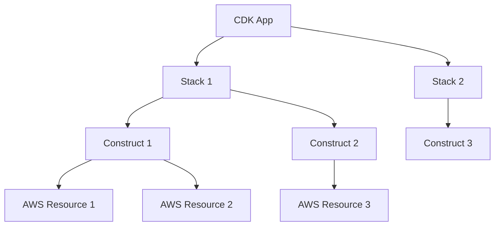

# 第5章：AWS CDK基础

::: info 章节概述
本章将介绍AWS Cloud Development Kit (CDK)的基础概念、安装配置方法，以及如何使用Python SDK进行基础开发。CDK是AWS提供的基础设施即代码(IaC)工具，能够使用熟悉的编程语言定义云资源。
:::

## 学习目标

1. 理解AWS CDK的核心概念和架构
2. 掌握CDK的安装和配置过程
3. 学会使用Python CDK SDK进行基础开发
4. 了解CDK项目结构和最佳实践
5. 能够创建和部署第一个CDK应用

## 5.1 AWS CDK概述

### 5.1.1 什么是AWS CDK

AWS Cloud Development Kit (CDK) 是一个开源软件开发框架，用于使用熟悉的编程语言定义云基础设施。CDK将您的代码编译成CloudFormation模板。

::: tip CDK的优势
- **代码化基础设施**: 使用熟悉的编程语言
- **IDE支持**: 完整的自动补全和类型检查
- **组件复用**: 通过函数和类实现代码重用
- **高级抽象**: 提供高级构造简化复杂配置
:::

### 5.1.2 CDK核心概念



| 概念 | 描述 | 示例 |
|------|------|------|
| **App** | CDK应用的根，包含一个或多个Stack | `cdk.App()` |
| **Stack** | 部署单元，对应一个CloudFormation模板 | `MyStack(app, "MyStack")` |
| **Construct** | 基本构建块，代表云组件 | `aws_lambda.Function()` |
| **Resource** | 最低级别的构造，直接映射到CloudFormation资源 | `CfnFunction` |

### 5.1.3 CDK架构模型

::: note 三层架构
1. **L1 Constructs**: CloudFormation资源的直接映射
2. **L2 Constructs**: 高级构造，包含合理的默认值
3. **L3 Constructs**: 模式构造，实现常见架构模式
:::

## 5.2 环境准备与安装

### 5.2.1 前置条件

```bash
# 检查Node.js版本（CDK CLI需要）
node --version  # 需要 >= 14.x

# 检查Python版本
python --version  # 推荐 >= 3.8

# 检查AWS CLI配置
aws configure list
```

### 5.2.2 安装CDK CLI

```bash
# 全局安装CDK CLI
npm install -g aws-cdk

# 验证安装
cdk --version

# 初始化CDK环境（首次使用）
cdk bootstrap
```

::: warning 重要提醒
`cdk bootstrap` 会在您的AWS账户中创建必要的资源（S3存储桶、IAM角色等），每个区域只需执行一次。
:::

### 5.2.3 创建Python CDK项目

```bash
# 创建新的CDK项目
mkdir my-lambda-cdk
cd my-lambda-cdk

# 初始化Python CDK项目
cdk init app --language python

# 激活虚拟环境
source .venv/bin/activate  # Linux/Mac
# .venv\Scripts\activate.bat  # Windows

# 安装依赖
pip install -r requirements.txt
```

### 5.2.4 项目结构解析

```
my-lambda-cdk/
├── app.py              # CDK应用入口点
├── my_lambda_cdk/      # 主要代码目录
│   ├── __init__.py
│   └── my_lambda_cdk_stack.py  # Stack定义
├── tests/              # 测试目录
├── requirements.txt    # Python依赖
├── cdk.json           # CDK配置文件
└── .venv/             # 虚拟环境
```

## 5.3 Python CDK SDK基础

### 5.3.1 基本导入和设置

```python
# app.py
import aws_cdk as cdk
from my_lambda_cdk.my_lambda_cdk_stack import MyLambdaCdkStack

app = cdk.App()
MyLambdaCdkStack(app, "MyLambdaCdkStack",
    env=cdk.Environment(
        account='123456789012',  # 替换为您的账户ID
        region='us-east-1'       # 替换为您的区域
    )
)

app.synth()
```

### 5.3.2 Stack基础结构

```python
# my_lambda_cdk/my_lambda_cdk_stack.py
from aws_cdk import (
    Stack,
    aws_lambda as _lambda,
    aws_iam as iam,
    Duration,
    CfnOutput
)
from constructs import Construct

class MyLambdaCdkStack(Stack):

    def __init__(self, scope: Construct, construct_id: str, **kwargs) -> None:
        super().__init__(scope, construct_id, **kwargs)

        # 在这里定义您的资源
        self.create_lambda_function()
    
    def create_lambda_function(self):
        """创建Lambda函数的示例方法"""
        # 这里将在后续章节中实现
        pass
```

### 5.3.3 常用CDK模式

#### 资源命名约定

```python
class MyLambdaCdkStack(Stack):
    def __init__(self, scope: Construct, construct_id: str, **kwargs) -> None:
        super().__init__(scope, construct_id, **kwargs)
        
        # 使用一致的命名约定
        self.lambda_function = self._create_lambda_function()
        self.api_gateway = self._create_api_gateway()
        
    def _create_lambda_function(self):
        """私有方法创建Lambda函数"""
        return _lambda.Function(
            self, "MyFunction",  # Construct ID
            # 配置参数...
        )
```

#### 环境变量和配置

```python
import os
from aws_cdk import aws_lambda as _lambda

# 从环境变量获取配置
ENVIRONMENT = os.getenv('ENVIRONMENT', 'dev')
REGION = os.getenv('AWS_REGION', 'us-east-1')

class MyLambdaCdkStack(Stack):
    def __init__(self, scope: Construct, construct_id: str, **kwargs) -> None:
        super().__init__(scope, construct_id, **kwargs)
        
        # 基于环境的资源命名
        function_name = f"my-function-{ENVIRONMENT}"
        
        self.lambda_function = _lambda.Function(
            self, "MyFunction",
            function_name=function_name,
            # 其他配置...
        )
```

## 5.4 CDK命令行工具

### 5.4.1 常用CDK命令

| 命令 | 功能 | 示例 |
|------|------|------|
| `cdk list` | 列出所有Stack | `cdk list` |
| `cdk synth` | 合成CloudFormation模板 | `cdk synth MyStack` |
| `cdk diff` | 显示与已部署版本的差异 | `cdk diff MyStack` |
| `cdk deploy` | 部署Stack | `cdk deploy MyStack` |
| `cdk destroy` | 删除Stack | `cdk destroy MyStack` |

### 5.4.2 开发工作流

```bash
# 1. 开发代码后，先检查语法
python -m py_compile my_lambda_cdk/*.py

# 2. 合成模板检查
cdk synth

# 3. 查看变更
cdk diff

# 4. 部署到开发环境
cdk deploy --profile dev

# 5. 测试完成后部署到生产环境
cdk deploy --profile prod
```

### 5.4.3 调试和故障排除

```python
# 启用调试模式
import aws_cdk as cdk

app = cdk.App()

# 添加标签用于资源管理
cdk.Tags.of(app).add("Project", "MyLambdaProject")
cdk.Tags.of(app).add("Environment", "Development")

# 输出重要信息
class MyLambdaCdkStack(Stack):
    def __init__(self, scope: Construct, construct_id: str, **kwargs) -> None:
        super().__init__(scope, construct_id, **kwargs)
        
        # 创建资源...
        
        # 输出有用信息
        CfnOutput(self, "LambdaFunctionArn",
                  value=self.lambda_function.function_arn,
                  description="Lambda Function ARN")
```

## 5.5 CDK最佳实践

### 5.5.1 项目组织

```python
# 推荐的项目结构
my_lambda_cdk/
├── stacks/                 # Stack定义
│   ├── __init__.py
│   ├── lambda_stack.py     # Lambda相关资源
│   ├── api_stack.py        # API Gateway相关
│   └── database_stack.py   # 数据库相关
├── constructs/             # 自定义构造
│   ├── __init__.py
│   └── lambda_construct.py
├── lambda_functions/       # Lambda函数代码
│   ├── function1/
│   └── function2/
└── tests/                  # 测试代码
```

### 5.5.2 配置管理

```python
# config.py
import os
from dataclasses import dataclass
from typing import Dict, Any

@dataclass
class EnvironmentConfig:
    environment: str
    lambda_memory: int
    lambda_timeout: int
    log_level: str
    
    @classmethod
    def from_environment(cls) -> 'EnvironmentConfig':
        env = os.getenv('ENVIRONMENT', 'dev')
        
        configs = {
            'dev': cls(
                environment='dev',
                lambda_memory=128,
                lambda_timeout=30,
                log_level='DEBUG'
            ),
            'prod': cls(
                environment='prod',
                lambda_memory=256,
                lambda_timeout=60,
                log_level='INFO'
            )
        }
        
        return configs.get(env, configs['dev'])
```

### 5.5.3 安全最佳实践

::: warning 安全注意事项
- 永远不要在代码中硬编码敏感信息
- 使用AWS Secrets Manager或Parameter Store存储机密
- 遵循最小权限原则
- 定期审查IAM权限
:::

```python
from aws_cdk import aws_secretsmanager as secretsmanager

class SecureStack(Stack):
    def __init__(self, scope: Construct, construct_id: str, **kwargs) -> None:
        super().__init__(scope, construct_id, **kwargs)
        
        # 创建机密
        db_secret = secretsmanager.Secret(
            self, "DatabaseSecret",
            description="Database credentials",
            generate_secret_string=secretsmanager.SecretStringGenerator(
                secret_string_template='{"username": "admin"}',
                generate_string_key="password",
                exclude_characters=" %+~`#$&*()|[]{}:;<>?!'/\\\"",
                password_length=32
            )
        )
        
        # Lambda函数使用机密
        lambda_function = _lambda.Function(
            self, "SecureFunction",
            # ... 其他配置
            environment={
                "DB_SECRET_ARN": db_secret.secret_arn
            }
        )
        
        # 授予Lambda访问机密的权限
        db_secret.grant_read(lambda_function)
```

## 5.6 实践练习

### 5.6.1 创建第一个CDK应用

创建一个简单的CDK应用，包含基本的Stack结构：

```python
# exercises/basic_app.py
import aws_cdk as cdk
from aws_cdk import Stack
from constructs import Construct

class BasicStack(Stack):
    def __init__(self, scope: Construct, construct_id: str, **kwargs) -> None:
        super().__init__(scope, construct_id, **kwargs)
        
        # 添加标签
        cdk.Tags.of(self).add("Project", "CDK-Learning")
        
        # 输出Stack信息
        cdk.CfnOutput(self, "StackName",
                      value=self.stack_name,
                      description="The name of this stack")

app = cdk.App()
BasicStack(app, "BasicStack")
app.synth()
```

### 5.6.2 练习题

1. **基础练习**: 创建一个CDK项目，包含两个Stack
2. **中级练习**: 实现配置管理，支持不同环境
3. **高级练习**: 创建自定义Construct封装常用功能

## 5.7 章节总结

::: tip 关键要点
- CDK是使用代码定义AWS基础设施的强大工具
- Python CDK提供了完整的类型支持和IDE集成
- 遵循最佳实践可以提高代码质量和可维护性
- 安全性应该从项目开始就考虑
:::

在下一章中，我们将学习如何使用CDK创建和部署Lambda函数，包括函数配置、权限管理和部署策略。

## 扩展阅读

- [AWS CDK官方文档](https://docs.aws.amazon.com/cdk/)
- [CDK Python API参考](https://docs.aws.amazon.com/cdk/api/v2/python/)
- [CDK最佳实践指南](https://docs.aws.amazon.com/cdk/v2/guide/best-practices.html)
- [CDK示例代码库](https://github.com/aws-samples/aws-cdk-examples)