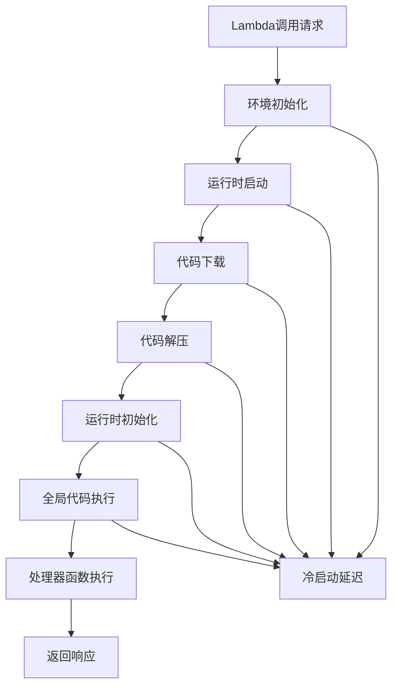

# 第9章：Lambda最佳实践与性能优化

::: info 章节概述
本章将深入探讨AWS Lambda的性能优化技巧和生产环境最佳实践。我们将学习如何优化冷启动时间、内存使用、并发处理，以及如何构建高性能、可扩展的serverless应用。
:::

## 学习目标

1. 掌握Lambda冷启动优化技术
2. 学会内存和CPU性能调优
3. 理解并发控制和预留并发策略
4. 掌握代码优化和依赖管理最佳实践
5. 学会使用监控和调试工具
6. 了解成本优化策略

## 9.1 冷启动优化

### 9.1.1 理解冷启动过程



### 9.1.2 冷启动优化策略

```python
# lambda_functions/optimized_cold_start/index.py
import json
import os
import logging
from typing import Dict, Any, Optional
from datetime import datetime

# 全局变量优化 - 在函数外部初始化
logger = logging.getLogger()
logger.setLevel(os.getenv('LOG_LEVEL', 'INFO'))

# 延迟导入和连接池
_db_connection = None
_redis_client = None
_s3_client = None

def get_db_connection():
    """延迟初始化数据库连接"""
    global _db_connection
    if _db_connection is None:
        import psycopg2
        from psycopg2 import pool
        
        _db_connection = psycopg2.pool.SimpleConnectionPool(
            1, 20,  # 最小和最大连接数
            host=os.environ['DB_HOST'],
            database=os.environ['DB_NAME'],
            user=os.environ['DB_USER'],
            password=os.environ['DB_PASSWORD']
        )
    return _db_connection

def get_redis_client():
    """延迟初始化Redis客户端"""
    global _redis_client
    if _redis_client is None:
        import redis
        _redis_client = redis.Redis(
            host=os.environ['REDIS_HOST'],
            port=int(os.environ.get('REDIS_PORT', 6379)),
            decode_responses=True,
            connection_pool_max_connections=10
        )
    return _redis_client

def get_s3_client():
    """延迟初始化S3客户端"""
    global _s3_client
    if _s3_client is None:
        import boto3
        _s3_client = boto3.client('s3')
    return _s3_client

class OptimizedLambdaHandler:
    """优化的Lambda处理器"""
    
    def __init__(self):
        self.initialization_time = datetime.utcnow()
        self.request_count = 0
        
        # 预编译正则表达式
        import re
        self.email_pattern = re.compile(r'^[a-zA-Z0-9._%+-]+@[a-zA-Z0-9.-]+\.[a-zA-Z]{2,}$')
        self.phone_pattern = re.compile(r'^\+?1?[0-9]{10,14}$')
        
        # 预加载配置
        self.config = self._load_configuration()
    
    def _load_configuration(self) -> Dict[str, Any]:
        """加载配置信息"""
        return {
            'max_retry_attempts': int(os.getenv('MAX_RETRY_ATTEMPTS', 3)),
            'timeout_seconds': int(os.getenv('TIMEOUT_SECONDS', 30)),
            'batch_size': int(os.getenv('BATCH_SIZE', 100)),
            'cache_ttl': int(os.getenv('CACHE_TTL', 300))
        }
    
    def handle_request(self, event: Dict[str, Any], context) -> Dict[str, Any]:
        """处理请求"""
        self.request_count += 1
        start_time = datetime.utcnow()
        
        try:
            # 记录容器复用信息
            is_cold_start = self.request_count == 1
            logger.info(f"Request #{self.request_count}, Cold start: {is_cold_start}")
            
            # 路由处理
            action = event.get('action', 'default')
            
            if action == 'validate_user':
                result = self._validate_user_data(event.get('data', {}))
            elif action == 'process_order':
                result = self._process_order(event.get('data', {}))
            elif action == 'fetch_data':
                result = self._fetch_cached_data(event.get('key'))
            else:
                result = {'error': f'Unknown action: {action}'}
            
            # 记录处理时间
            processing_time = (datetime.utcnow() - start_time).total_seconds()
            
            return {
                'statusCode': 200,
                'body': json.dumps({
                    'success': True,
                    'result': result,
                    'metadata': {
                        'cold_start': is_cold_start,
                        'request_count': self.request_count,
                        'processing_time_seconds': processing_time,
                        'remaining_time_ms': context.get_remaining_time_in_millis()
                    }
                }, default=str)
            }
            
        except Exception as e:
            logger.error(f"Error processing request: {str(e)}")
            return {
                'statusCode': 500,
                'body': json.dumps({
                    'success': False,
                    'error': str(e)
                })
            }
    
    def _validate_user_data(self, data: Dict[str, Any]) -> Dict[str, Any]:
        """验证用户数据（使用预编译的正则表达式）"""
        email = data.get('email', '')
        phone = data.get('phone', '')
        
        validation_result = {
            'email_valid': bool(self.email_pattern.match(email)),
            'phone_valid': bool(self.phone_pattern.match(phone)),
            'required_fields_present': all(
                data.get(field) for field in ['name', 'email']
            )
        }
        
        validation_result['overall_valid'] = all(validation_result.values())
        return validation_result
    
    def _process_order(self, order_data: Dict[str, Any]) -> Dict[str, Any]:
        """处理订单（使用连接池）"""
        try:
            db_pool = get_db_connection()
            connection = db_pool.getconn()
            
            with connection.cursor() as cursor:
                # 模拟数据库操作
                cursor.execute(
                    "INSERT INTO orders (user_id, amount, status) VALUES (%s, %s, %s) RETURNING id",
                    (order_data.get('user_id'), order_data.get('amount'), 'pending')
                )
                order_id = cursor.fetchone()[0]
                connection.commit()
            
            db_pool.putconn(connection)
            
            return {
                'order_id': order_id,
                'status': 'created',
                'amount': order_data.get('amount')
            }
            
        except Exception as e:
            logger.error(f"Database error: {str(e)}")
            raise e
    
    def _fetch_cached_data(self, key: str) -> Dict[str, Any]:
        """获取缓存数据"""
        try:
            redis_client = get_redis_client()
            
            # 尝试从缓存获取
            cached_data = redis_client.get(key)
            if cached_data:
                return {
                    'data': json.loads(cached_data),
                    'source': 'cache',
                    'cache_hit': True
                }
            
            # 缓存未命中，从数据库获取
            data = self._fetch_from_database(key)
            
            # 更新缓存
            redis_client.setex(
                key, 
                self.config['cache_ttl'], 
                json.dumps(data, default=str)
            )
            
            return {
                'data': data,
                'source': 'database',
                'cache_hit': False
            }
            
        except Exception as e:
            logger.error(f"Cache error: {str(e)}")
            # 降级到数据库查询
            return {
                'data': self._fetch_from_database(key),
                'source': 'database_fallback',
                'cache_hit': False
            }
    
    def _fetch_from_database(self, key: str) -> Dict[str, Any]:
        """从数据库获取数据"""
        # 模拟数据库查询
        return {
            'id': key,
            'value': f'data_for_{key}',
            'timestamp': datetime.utcnow().isoformat()
        }

# 全局处理器实例（在冷启动时初始化一次）
handler_instance = OptimizedLambdaHandler()

def handler(event: Dict[str, Any], context) -> Dict[str, Any]:
    """Lambda入口点"""
    return handler_instance.handle_request(event, context)
```

### 9.1.3 预置并发配置

```python
# stacks/performance_optimized_stack.py
from aws_cdk import (
    Stack,
    aws_lambda as _lambda,
    aws_applicationautoscaling as appscaling,
    Duration
)

class PerformanceOptimizedStack(Stack):
    def __init__(self, scope: Construct, construct_id: str, **kwargs) -> None:
        super().__init__(scope, construct_id, **kwargs)
        
        # 高性能Lambda函数
        self.optimized_function = _lambda.Function(
            self, "OptimizedFunction",
            runtime=_lambda.Runtime.PYTHON_3_9,
            handler="index.handler",
            code=_lambda.Code.from_asset("lambda_functions/optimized_cold_start"),
            memory_size=1024,  # 更高内存 = 更多CPU
            timeout=Duration.seconds(30),
            environment={
                'LOG_LEVEL': 'INFO',
                'MAX_RETRY_ATTEMPTS': '3',
                'CACHE_TTL': '300'
            },
            # 预留并发避免冷启动
            reserved_concurrent_executions=20
        )
        
        # 创建版本和别名
        version = self.optimized_function.current_version
        
        # 生产环境别名
        self.prod_alias = _lambda.Alias(
            self, "ProdAlias",
            alias_name="PROD",
            version=version,
            # 配置预置并发
            provisioned_concurrency_config=_lambda.ProvisionedConcurrencyConfig(
                provisioned_concurrent_executions=5
            )
        )
        
        # 配置自动伸缩
        scalable_target = appscaling.ScalableTarget(
            self, "ScalableTarget",
            service_namespace=appscaling.ServiceNamespace.LAMBDA,
            scalable_dimension="lambda:function:ProvisionedConcurrency",
            resource_id=f"function:{self.optimized_function.function_name}:PROD",
            min_capacity=5,
            max_capacity=50
        )
        
        # 基于利用率的自动伸缩
        scalable_target.scale_to_track_metric(
            "ProvisionedConcurrencyTracking",
            target_value=0.7,  # 70%利用率
            metric=appscaling.predefined_metric_specification(
                appscaling.PredefinedMetric.LAMBDA_PROVISIONED_CONCURRENCY_UTILIZATION
            ),
            scale_in_cooldown=Duration.minutes(2),
            scale_out_cooldown=Duration.minutes(1)
        )
        
        # 基于调用的自动伸缩
        scalable_target.scale_on_metric(
            "InvocationRateScaling",
            metric=self.optimized_function.metric_invocations(
                period=Duration.minutes(1)
            ),
            scaling_steps=[
                appscaling.ScalingInterval(upper=10, change=0),
                appscaling.ScalingInterval(lower=10, upper=50, change=+2),
                appscaling.ScalingInterval(lower=50, upper=100, change=+5),
                appscaling.ScalingInterval(lower=100, change=+10)
            ]
        )
```

## 9.2 内存和CPU优化

### 9.2.1 内存配置最佳实践

```python
# tools/memory_profiler.py
import json
import psutil
import os
import logging
from typing import Dict, Any, List
from datetime import datetime
import tracemalloc

class MemoryProfiler:
    """内存性能分析器"""
    
    def __init__(self):
        self.start_memory = None
        self.peak_memory = 0
        self.memory_snapshots = []
        
    def start_profiling(self):
        """开始内存分析"""
        tracemalloc.start()
        self.start_memory = self.get_current_memory()
        self.memory_snapshots = []
        
    def take_snapshot(self, label: str = ""):
        """拍摄内存快照"""
        current_memory = self.get_current_memory()
        self.peak_memory = max(self.peak_memory, current_memory)
        
        snapshot = {
            'label': label,
            'timestamp': datetime.utcnow().isoformat(),
            'memory_mb': current_memory,
            'memory_increase_mb': current_memory - self.start_memory if self.start_memory else 0
        }
        
        self.memory_snapshots.append(snapshot)
        return snapshot
    
    def get_current_memory(self) -> float:
        """获取当前内存使用量（MB）"""
        process = psutil.Process(os.getpid())
        memory_info = process.memory_info()
        return memory_info.rss / 1024 / 1024  # 转换为MB
    
    def get_memory_report(self) -> Dict[str, Any]:
        """生成内存报告"""
        current_memory = self.get_current_memory()
        
        # 获取tracemalloc统计
        snapshot = tracemalloc.take_snapshot()
        top_stats = snapshot.statistics('lineno')
        
        return {
            'start_memory_mb': self.start_memory,
            'current_memory_mb': current_memory,
            'peak_memory_mb': self.peak_memory,
            'memory_increase_mb': current_memory - self.start_memory if self.start_memory else 0,
            'snapshots': self.memory_snapshots,
            'top_memory_consumers': [
                {
                    'file': stat.traceback.format()[0] if stat.traceback else 'unknown',
                    'size_mb': stat.size / 1024 / 1024,
                    'count': stat.count
                }
                for stat in top_stats[:10]
            ]
        }

class OptimizedDataProcessor:
    """优化的数据处理器"""
    
    def __init__(self, memory_limit_mb: int = 512):
        self.memory_limit_mb = memory_limit_mb
        self.profiler = MemoryProfiler()
        
    def process_large_dataset(self, data: List[Dict[str, Any]], 
                            batch_size: int = 1000) -> Dict[str, Any]:
        """批量处理大数据集"""
        self.profiler.start_profiling()
        self.profiler.take_snapshot("processing_start")
        
        total_records = len(data)
        processed_records = 0
        results = []
        
        # 分批处理避免内存溢出
        for i in range(0, total_records, batch_size):
            batch = data[i:i + batch_size]
            
            # 处理批次
            batch_result = self._process_batch(batch)
            results.extend(batch_result)
            
            processed_records += len(batch)
            
            # 内存检查
            current_memory = self.profiler.get_current_memory()
            if current_memory > self.memory_limit_mb * 0.8:  # 80%阈值
                logging.warning(f"Memory usage high: {current_memory:.2f}MB")
                
                # 强制垃圾回收
                import gc
                gc.collect()
                
                self.profiler.take_snapshot(f"after_gc_batch_{i//batch_size}")
            
            # 定期快照
            if i % (batch_size * 10) == 0:
                self.profiler.take_snapshot(f"batch_{i//batch_size}")
        
        self.profiler.take_snapshot("processing_complete")
        
        return {
            'processed_records': processed_records,
            'total_records': total_records,
            'results_count': len(results),
            'memory_report': self.profiler.get_memory_report()
        }
    
    def _process_batch(self, batch: List[Dict[str, Any]]) -> List[Dict[str, Any]]:
        """处理单个批次"""
        results = []
        
        for record in batch:
            try:
                # 数据转换和验证
                processed_record = {
                    'id': record.get('id'),
                    'processed_at': datetime.utcnow().isoformat(),
                    'data': self._transform_data(record),
                    'validation_status': self._validate_record(record)
                }
                
                results.append(processed_record)
                
            except Exception as e:
                logging.error(f"Error processing record {record.get('id')}: {str(e)}")
                # 继续处理其他记录
                continue
        
        return results
    
    def _transform_data(self, record: Dict[str, Any]) -> Dict[str, Any]:
        """数据转换"""
        # 实施内存友好的数据转换
        return {
            'name': record.get('name', '').strip().title(),
            'email': record.get('email', '').lower(),
            'age': int(record.get('age', 0)) if record.get('age') else None,
            'score': float(record.get('score', 0.0)) if record.get('score') else 0.0
        }
    
    def _validate_record(self, record: Dict[str, Any]) -> str:
        """记录验证"""
        if not record.get('name'):
            return 'invalid_name'
        if not record.get('email') or '@' not in record.get('email', ''):
            return 'invalid_email'
        return 'valid'

# lambda_functions/memory_optimized/index.py
import json
import logging
import os
from typing import Dict, Any

logger = logging.getLogger()
logger.setLevel(os.getenv('LOG_LEVEL', 'INFO'))

# 全局优化的处理器
processor = OptimizedDataProcessor(
    memory_limit_mb=int(os.getenv('LAMBDA_MEMORY_SIZE', 512))
)

def handler(event: Dict[str, Any], context) -> Dict[str, Any]:
    """内存优化的Lambda处理器"""
    
    # 记录可用内存
    available_memory_mb = int(context.memory_limit_in_mb)
    logger.info(f"Available memory: {available_memory_mb}MB")
    
    try:
        action = event.get('action', 'process_data')
        
        if action == 'process_large_dataset':
            data = event.get('data', [])
            batch_size = event.get('batch_size', 1000)
            
            result = processor.process_large_dataset(data, batch_size)
            
            return {
                'statusCode': 200,
                'body': json.dumps(result, default=str)
            }
        
        elif action == 'memory_test':
            # 内存压力测试
            return _run_memory_test(event.get('test_size_mb', 100))
        
        else:
            return {
                'statusCode': 400,
                'body': json.dumps({'error': f'Unknown action: {action}'})
            }
            
    except Exception as e:
        logger.error(f"Error in handler: {str(e)}")
        return {
            'statusCode': 500,
            'body': json.dumps({'error': str(e)})
        }

def _run_memory_test(test_size_mb: int) -> Dict[str, Any]:
    """运行内存测试"""
    profiler = MemoryProfiler()
    profiler.start_profiling()
    
    try:
        # 分配内存
        data_size = test_size_mb * 1024 * 1024  # 转换为字节
        test_data = bytearray(data_size)
        
        profiler.take_snapshot("after_allocation")
        
        # 执行一些操作
        for i in range(0, len(test_data), 1024):
            test_data[i] = i % 256
        
        profiler.take_snapshot("after_operations")
        
        # 清理内存
        del test_data
        import gc
        gc.collect()
        
        profiler.take_snapshot("after_cleanup")
        
        return {
            'statusCode': 200,
            'body': json.dumps({
                'test_size_mb': test_size_mb,
                'memory_report': profiler.get_memory_report()
            }, default=str)
        }
        
    except MemoryError as e:
        return {
            'statusCode': 507,  # Insufficient Storage
            'body': json.dumps({
                'error': 'Out of memory',
                'test_size_mb': test_size_mb,
                'memory_report': profiler.get_memory_report()
            }, default=str)
        }
```

### 9.2.2 CPU优化策略

```python
# lambda_functions/cpu_optimized/index.py
import json
import time
import concurrent.futures
import multiprocessing
import logging
import os
from typing import Dict, Any, List, Callable
from datetime import datetime
import asyncio

logger = logging.getLogger()
logger.setLevel(os.getenv('LOG_LEVEL', 'INFO'))

class CPUOptimizer:
    """CPU性能优化器"""
    
    def __init__(self):
        # Lambda环境CPU信息
        self.cpu_count = multiprocessing.cpu_count()
        self.memory_mb = int(os.getenv('AWS_LAMBDA_FUNCTION_MEMORY_SIZE', '512'))
        
        # 根据内存大小估算CPU能力
        self.estimated_vcpus = self.memory_mb / 1769  # AWS Lambda CPU分配比例
        
        logger.info(f"CPU cores: {self.cpu_count}, Estimated vCPUs: {self.estimated_vcpus:.2f}")
    
    def optimize_cpu_bound_task(self, data: List[Any], 
                               processing_func: Callable,
                               use_multiprocessing: bool = True) -> Dict[str, Any]:
        """优化CPU密集型任务"""
        start_time = time.time()
        
        # 根据数据大小和CPU能力选择最佳策略
        data_size = len(data)
        optimal_workers = min(self.cpu_count, max(1, data_size // 100))
        
        if use_multiprocessing and data_size > 1000 and self.cpu_count > 1:
            results = self._process_with_multiprocessing(
                data, processing_func, optimal_workers
            )
        elif data_size > 100:
            results = self._process_with_threading(
                data, processing_func, optimal_workers
            )
        else:
            results = self._process_sequentially(data, processing_func)
        
        processing_time = time.time() - start_time
        
        return {
            'results': results,
            'processing_time': processing_time,
            'data_size': data_size,
            'workers_used': optimal_workers,
            'cpu_count': self.cpu_count,
            'processing_mode': self._get_processing_mode(data_size, use_multiprocessing)
        }
    
    def _process_with_multiprocessing(self, data: List[Any], 
                                    processing_func: Callable,
                                    workers: int) -> List[Any]:
        """使用多进程处理"""
        chunk_size = max(1, len(data) // workers)
        
        with multiprocessing.Pool(processes=workers) as pool:
            # 将数据分块
            chunks = [data[i:i + chunk_size] for i in range(0, len(data), chunk_size)]
            
            # 并行处理
            chunk_results = pool.map(
                lambda chunk: [processing_func(item) for item in chunk],
                chunks
            )
            
            # 合并结果
            results = []
            for chunk_result in chunk_results:
                results.extend(chunk_result)
            
            return results
    
    def _process_with_threading(self, data: List[Any],
                              processing_func: Callable,
                              workers: int) -> List[Any]:
        """使用多线程处理"""
        with concurrent.futures.ThreadPoolExecutor(max_workers=workers) as executor:
            # 提交所有任务
            future_to_item = {
                executor.submit(processing_func, item): item 
                for item in data
            }
            
            results = []
            for future in concurrent.futures.as_completed(future_to_item):
                try:
                    result = future.result()
                    results.append(result)
                except Exception as e:
                    logger.error(f"Error processing item: {str(e)}")
                    results.append(None)
            
            return results
    
    def _process_sequentially(self, data: List[Any], 
                            processing_func: Callable) -> List[Any]:
        """顺序处理"""
        return [processing_func(item) for item in data]
    
    def _get_processing_mode(self, data_size: int, use_multiprocessing: bool) -> str:
        """获取处理模式"""
        if use_multiprocessing and data_size > 1000 and self.cpu_count > 1:
            return "multiprocessing"
        elif data_size > 100:
            return "threading"
        else:
            return "sequential"

class AsyncProcessor:
    """异步处理器"""
    
    async def process_async_tasks(self, tasks: List[Dict[str, Any]]) -> Dict[str, Any]:
        """异步处理多个任务"""
        start_time = time.time()
        
        # 创建异步任务
        async_tasks = []
        for task in tasks:
            task_type = task.get('type')
            
            if task_type == 'http_request':
                async_tasks.append(self._make_http_request(task))
            elif task_type == 'database_query':
                async_tasks.append(self._execute_database_query(task))
            elif task_type == 'file_operation':
                async_tasks.append(self._perform_file_operation(task))
        
        # 并发执行所有任务
        results = await asyncio.gather(*async_tasks, return_exceptions=True)
        
        processing_time = time.time() - start_time
        
        # 分类结果
        successful_results = []
        errors = []
        
        for i, result in enumerate(results):
            if isinstance(result, Exception):
                errors.append({
                    'task_index': i,
                    'error': str(result)
                })
            else:
                successful_results.append(result)
        
        return {
            'successful_results': successful_results,
            'errors': errors,
            'total_tasks': len(tasks),
            'processing_time': processing_time
        }
    
    async def _make_http_request(self, task: Dict[str, Any]) -> Dict[str, Any]:
        """异步HTTP请求"""
        import aiohttp
        import asyncio
        
        url = task.get('url')
        timeout = task.get('timeout', 10)
        
        async with aiohttp.ClientSession() as session:
            async with session.get(url, timeout=timeout) as response:
                return {
                    'task_type': 'http_request',
                    'url': url,
                    'status_code': response.status,
                    'response_size': len(await response.text())
                }
    
    async def _execute_database_query(self, task: Dict[str, Any]) -> Dict[str, Any]:
        """异步数据库查询（模拟）"""
        await asyncio.sleep(0.1)  # 模拟数据库延迟
        
        return {
            'task_type': 'database_query',
            'query': task.get('query'),
            'result_count': 42  # 模拟结果
        }
    
    async def _perform_file_operation(self, task: Dict[str, Any]) -> Dict[str, Any]:
        """异步文件操作（模拟）"""
        await asyncio.sleep(0.05)  # 模拟文件I/O延迟
        
        return {
            'task_type': 'file_operation',
            'operation': task.get('operation'),
            'file_path': task.get('file_path'),
            'status': 'completed'
        }

# 数学密集型函数示例
def cpu_intensive_calculation(n: int) -> Dict[str, Any]:
    """CPU密集型计算"""
    # 计算斐波那契数列
    def fibonacci(num):
        if num <= 1:
            return num
        return fibonacci(num - 1) + fibonacci(num - 2)
    
    # 素数检查
    def is_prime(num):
        if num < 2:
            return False
        for i in range(2, int(num ** 0.5) + 1):
            if num % i == 0:
                return False
        return True
    
    start_time = time.time()
    
    # 执行计算
    fib_result = fibonacci(min(n, 35))  # 限制递归深度
    prime_check = is_prime(n)
    
    # 数值计算
    sum_of_squares = sum(i * i for i in range(n))
    
    processing_time = time.time() - start_time
    
    return {
        'input': n,
        'fibonacci': fib_result,
        'is_prime': prime_check,
        'sum_of_squares': sum_of_squares,
        'processing_time': processing_time
    }

# 全局优化器实例
cpu_optimizer = CPUOptimizer()
async_processor = AsyncProcessor()

def handler(event: Dict[str, Any], context) -> Dict[str, Any]:
    """CPU优化的Lambda处理器"""
    
    logger.info(f"Function memory: {context.memory_limit_in_mb}MB")
    logger.info(f"Remaining time: {context.get_remaining_time_in_millis()}ms")
    
    try:
        action = event.get('action', 'cpu_test')
        
        if action == 'cpu_intensive_batch':
            # CPU密集型批处理
            numbers = event.get('numbers', list(range(1, 101)))
            use_multiprocessing = event.get('use_multiprocessing', True)
            
            result = cpu_optimizer.optimize_cpu_bound_task(
                numbers, 
                cpu_intensive_calculation,
                use_multiprocessing
            )
            
            return {
                'statusCode': 200,
                'body': json.dumps(result, default=str)
            }
        
        elif action == 'async_tasks':
            # 异步任务处理
            tasks = event.get('tasks', [])
            
            # 在Lambda中运行异步代码
            loop = asyncio.new_event_loop()
            asyncio.set_event_loop(loop)
            
            try:
                result = loop.run_until_complete(
                    async_processor.process_async_tasks(tasks)
                )
            finally:
                loop.close()
            
            return {
                'statusCode': 200,
                'body': json.dumps(result, default=str)
            }
        
        elif action == 'performance_benchmark':
            # 性能基准测试
            return _run_performance_benchmark(event.get('test_size', 1000))
        
        else:
            return {
                'statusCode': 400,
                'body': json.dumps({'error': f'Unknown action: {action}'})
            }
            
    except Exception as e:
        logger.error(f"Error in handler: {str(e)}")
        return {
            'statusCode': 500,
            'body': json.dumps({'error': str(e)})
        }

def _run_performance_benchmark(test_size: int) -> Dict[str, Any]:
    """运行性能基准测试"""
    results = {}
    
    # 测试数据
    test_data = list(range(1, test_size + 1))
    
    # 测试不同处理模式
    for use_mp in [False, True]:
        mode_name = "multiprocessing" if use_mp else "threading"
        
        start_time = time.time()
        result = cpu_optimizer.optimize_cpu_bound_task(
            test_data[:min(50, test_size)],  # 限制测试规模
            lambda x: x * x,  # 简单计算
            use_mp
        )
        total_time = time.time() - start_time
        
        results[mode_name] = {
            'total_time': total_time,
            'items_per_second': len(test_data) / total_time if total_time > 0 else 0,
            'processing_mode': result['processing_mode']
        }
    
    return {
        'statusCode': 200,
        'body': json.dumps({
            'test_size': test_size,
            'cpu_info': {
                'cpu_count': cpu_optimizer.cpu_count,
                'estimated_vcpus': cpu_optimizer.estimated_vcpus
            },
            'benchmark_results': results
        }, default=str)
    }
```

## 9.3 并发控制策略

### 9.3.1 智能并发管理

```python
# stacks/concurrency_optimized_stack.py
from aws_cdk import (
    Stack,
    aws_lambda as _lambda,
    aws_cloudwatch as cloudwatch,
    aws_cloudwatch_actions as cw_actions,
    aws_sns as sns,
    Duration
)

class ConcurrencyOptimizedStack(Stack):
    def __init__(self, scope: Construct, construct_id: str, **kwargs) -> None:
        super().__init__(scope, construct_id, **kwargs)
        
        # 创建SNS主题用于告警
        self.alert_topic = sns.Topic(
            self, "ConcurrencyAlerts",
            topic_name="lambda-concurrency-alerts"
        )
        
        # 高优先级函数 - 预留并发
        self.critical_function = _lambda.Function(
            self, "CriticalFunction",
            runtime=_lambda.Runtime.PYTHON_3_9,
            handler="index.handler",
            code=_lambda.Code.from_asset("lambda_functions/critical_handler"),
            memory_size=512,
            timeout=Duration.seconds(30),
            reserved_concurrent_executions=50,  # 预留50个并发
            environment={
                'PRIORITY_LEVEL': 'CRITICAL',
                'MAX_PROCESSING_TIME': '25'
            }
        )
        
        # 标准函数 - 有限并发
        self.standard_function = _lambda.Function(
            self, "StandardFunction",
            runtime=_lambda.Runtime.PYTHON_3_9,
            handler="index.handler",
            code=_lambda.Code.from_asset("lambda_functions/standard_handler"),
            memory_size=256,
            timeout=Duration.seconds(60),
            reserved_concurrent_executions=20,  # 限制20个并发
            environment={
                'PRIORITY_LEVEL': 'STANDARD',
                'MAX_PROCESSING_TIME': '55'
            }
        )
        
        # 批处理函数 - 无并发限制
        self.batch_function = _lambda.Function(
            self, "BatchFunction",
            runtime=_lambda.Runtime.PYTHON_3_9,
            handler="index.handler",
            code=_lambda.Code.from_asset("lambda_functions/batch_handler"),
            memory_size=1024,
            timeout=Duration.minutes(15),
            environment={
                'PRIORITY_LEVEL': 'BATCH',
                'MAX_PROCESSING_TIME': '900'
            }
        )
        
        # 创建并发监控和告警
        self._create_concurrency_monitoring()
    
    def _create_concurrency_monitoring(self):
        """创建并发监控"""
        
        # 监控并发执行数
        for func_name, func in [
            ("Critical", self.critical_function),
            ("Standard", self.standard_function),
            ("Batch", self.batch_function)
        ]:
            
            # 并发执行告警
            concurrent_executions_alarm = cloudwatch.Alarm(
                self, f"{func_name}ConcurrentExecutionsAlarm",
                alarm_name=f"{func_name}-high-concurrency",
                alarm_description=f"High concurrent executions for {func_name} function",
                metric=func.metric_concurrent_executions(
                    period=Duration.minutes(1)
                ),
                threshold=func.reserved_concurrent_executions * 0.8 if func.reserved_concurrent_executions else 100,
                evaluation_periods=2,
                comparison_operator=cloudwatch.ComparisonOperator.GREATER_THAN_THRESHOLD
            )
            
            concurrent_executions_alarm.add_alarm_action(
                cw_actions.SnsAction(self.alert_topic)
            )
            
            # 错误率告警
            error_rate_alarm = cloudwatch.Alarm(
                self, f"{func_name}ErrorRateAlarm",
                alarm_name=f"{func_name}-high-error-rate",
                alarm_description=f"High error rate for {func_name} function",
                metric=cloudwatch.MathExpression(
                    expression="errors / invocations * 100",
                    using_metrics={
                        "errors": func.metric_errors(period=Duration.minutes(5)),
                        "invocations": func.metric_invocations(period=Duration.minutes(5))
                    }
                ),
                threshold=5,  # 5% 错误率
                evaluation_periods=2,
                comparison_operator=cloudwatch.ComparisonOperator.GREATER_THAN_THRESHOLD
            )
            
            error_rate_alarm.add_alarm_action(
                cw_actions.SnsAction(self.alert_topic)
            )
            
            # 持续时间告警
            duration_alarm = cloudwatch.Alarm(
                self, f"{func_name}DurationAlarm",
                alarm_name=f"{func_name}-long-duration",
                alarm_description=f"Long duration for {func_name} function",
                metric=func.metric_duration(
                    period=Duration.minutes(5),
                    statistic="Average"
                ),
                threshold=func.timeout.to_seconds() * 0.8,  # 80% of timeout
                evaluation_periods=3,
                comparison_operator=cloudwatch.ComparisonOperator.GREATER_THAN_THRESHOLD
            )
            
            duration_alarm.add_alarm_action(
                cw_actions.SnsAction(self.alert_topic)
            )
```

### 9.3.2 智能并发控制函数

```python
# lambda_functions/concurrency_controller/index.py
import json
import boto3
import os
import time
import logging
from typing import Dict, Any, Optional
from datetime import datetime, timedelta
from dataclasses import dataclass

logger = logging.getLogger()
logger.setLevel(os.getenv('LOG_LEVEL', 'INFO'))

# AWS客户端
cloudwatch = boto3.client('cloudwatch')
lambda_client = boto3.client('lambda')

@dataclass
class ConcurrencyMetrics:
    """并发指标数据类"""
    concurrent_executions: int
    invocations_per_minute: int
    error_rate: float
    average_duration: float
    throttles: int
    
class ConcurrencyController:
    """智能并发控制器"""
    
    def __init__(self):
        self.function_name = os.environ.get('AWS_LAMBDA_FUNCTION_NAME')
        self.max_processing_time = int(os.environ.get('MAX_PROCESSING_TIME', 30))
        self.priority_level = os.environ.get('PRIORITY_LEVEL', 'STANDARD')
        
        # 并发控制参数
        self.min_concurrency = 1
        self.max_concurrency = 100
        self.scale_up_threshold = 0.8
        self.scale_down_threshold = 0.3
        
    def get_current_metrics(self, period_minutes: int = 5) -> ConcurrencyMetrics:
        """获取当前并发指标"""
        end_time = datetime.utcnow()
        start_time = end_time - timedelta(minutes=period_minutes)
        
        try:
            # 获取CloudWatch指标
            metrics_data = cloudwatch.get_metric_statistics(
                Namespace='AWS/Lambda',
                MetricName='ConcurrentExecutions',
                Dimensions=[
                    {
                        'Name': 'FunctionName',
                        'Value': self.function_name
                    }
                ],
                StartTime=start_time,
                EndTime=end_time,
                Period=period_minutes * 60,
                Statistics=['Maximum', 'Average']
            )
            
            # 获取其他指标
            invocations = self._get_metric_value('Invocations', start_time, end_time, 'Sum')
            errors = self._get_metric_value('Errors', start_time, end_time, 'Sum') 
            duration = self._get_metric_value('Duration', start_time, end_time, 'Average')
            throttles = self._get_metric_value('Throttles', start_time, end_time, 'Sum')
            
            concurrent_executions = (
                metrics_data['Datapoints'][0]['Maximum'] 
                if metrics_data['Datapoints'] else 0
            )
            
            error_rate = (errors / invocations * 100) if invocations > 0 else 0
            
            return ConcurrencyMetrics(
                concurrent_executions=int(concurrent_executions),
                invocations_per_minute=int(invocations / period_minutes),
                error_rate=error_rate,
                average_duration=duration,
                throttles=int(throttles)
            )
            
        except Exception as e:
            logger.error(f"Error getting metrics: {str(e)}")
            return ConcurrencyMetrics(0, 0, 0.0, 0.0, 0)
    
    def _get_metric_value(self, metric_name: str, start_time: datetime, 
                         end_time: datetime, statistic: str) -> float:
        """获取单个指标值"""
        try:
            response = cloudwatch.get_metric_statistics(
                Namespace='AWS/Lambda',
                MetricName=metric_name,
                Dimensions=[
                    {
                        'Name': 'FunctionName',
                        'Value': self.function_name
                    }
                ],
                StartTime=start_time,
                EndTime=end_time,
                Period=300,  # 5分钟
                Statistics=[statistic]
            )
            
            return (
                response['Datapoints'][0][statistic] 
                if response['Datapoints'] else 0.0
            )
            
        except Exception as e:
            logger.error(f"Error getting {metric_name}: {str(e)}")
            return 0.0
    
    def analyze_performance(self, metrics: ConcurrencyMetrics) -> Dict[str, Any]:
        """分析性能并提供建议"""
        analysis = {
            'current_metrics': {
                'concurrent_executions': metrics.concurrent_executions,
                'invocations_per_minute': metrics.invocations_per_minute,
                'error_rate': metrics.error_rate,
                'average_duration': metrics.average_duration,
                'throttles': metrics.throttles
            },
            'performance_status': 'good',
            'recommendations': [],
            'alerts': []
        }
        
        # 分析并发使用率
        if metrics.concurrent_executions > 0:
            current_function_config = lambda_client.get_function_configuration(
                FunctionName=self.function_name
            )
            
            reserved_concurrency = current_function_config.get('ReservedConcurrencyConfig', {}).get('ReservedConcurrencyConfig', 1000)
            utilization = metrics.concurrent_executions / reserved_concurrency
            
            if utilization > 0.9:
                analysis['performance_status'] = 'critical'
                analysis['alerts'].append('High concurrency utilization (>90%)')
                analysis['recommendations'].append('Consider increasing reserved concurrency')
            elif utilization > 0.7:
                analysis['performance_status'] = 'warning'
                analysis['recommendations'].append('Monitor concurrency usage closely')
        
        # 分析错误率
        if metrics.error_rate > 10:
            analysis['performance_status'] = 'critical'
            analysis['alerts'].append(f'High error rate: {metrics.error_rate:.2f}%')
            analysis['recommendations'].append('Investigate error causes')
        elif metrics.error_rate > 5:
            analysis['performance_status'] = 'warning'
            analysis['recommendations'].append('Monitor error trends')
        
        # 分析执行时间
        timeout_threshold = self.max_processing_time * 0.8
        if metrics.average_duration > timeout_threshold:
            analysis['performance_status'] = 'warning'
            analysis['recommendations'].append('Consider optimizing function performance')
        
        # 分析节流
        if metrics.throttles > 0:
            analysis['performance_status'] = 'critical'
            analysis['alerts'].append(f'Function throttling detected: {metrics.throttles} throttles')
            analysis['recommendations'].append('Increase reserved concurrency or optimize function')
        
        return analysis
    
    def optimize_concurrency_settings(self, analysis: Dict[str, Any]) -> Dict[str, Any]:
        """优化并发设置"""
        metrics = analysis['current_metrics']
        recommendations = []
        
        try:
            current_config = lambda_client.get_function_configuration(
                FunctionName=self.function_name
            )
            
            current_reserved = current_config.get('ReservedConcurrencyConfig', {}).get('ReservedConcurrencyConfig')
            
            # 计算建议的并发设置
            if metrics['throttles'] > 0:
                # 有节流 - 增加并发
                suggested_concurrency = int((current_reserved or 10) * 1.5)
                recommendations.append({
                    'action': 'increase_concurrency',
                    'current': current_reserved,
                    'suggested': min(suggested_concurrency, self.max_concurrency),
                    'reason': 'Throttling detected'
                })
            
            elif metrics['error_rate'] > 10:
                # 高错误率 - 可能需要减少并发以减轻系统压力
                suggested_concurrency = int((current_reserved or 10) * 0.7)
                recommendations.append({
                    'action': 'decrease_concurrency',
                    'current': current_reserved,
                    'suggested': max(suggested_concurrency, self.min_concurrency),
                    'reason': 'High error rate detected'
                })
            
            elif metrics['concurrent_executions'] > 0:
                # 基于使用率调整
                utilization = metrics['concurrent_executions'] / (current_reserved or 1000)
                
                if utilization > 0.8:
                    suggested_concurrency = int(metrics['concurrent_executions'] * 1.25)
                    recommendations.append({
                        'action': 'increase_concurrency',
                        'current': current_reserved,
                        'suggested': min(suggested_concurrency, self.max_concurrency),
                        'reason': f'High utilization: {utilization:.2%}'
                    })
                elif utilization < 0.3 and (current_reserved or 0) > self.min_concurrency * 2:
                    suggested_concurrency = max(
                        int(metrics['concurrent_executions'] * 1.5),
                        self.min_concurrency
                    )
                    recommendations.append({
                        'action': 'decrease_concurrency',
                        'current': current_reserved,
                        'suggested': suggested_concurrency,
                        'reason': f'Low utilization: {utilization:.2%}'
                    })
            
            return {
                'optimization_available': len(recommendations) > 0,
                'recommendations': recommendations,
                'current_settings': {
                    'reserved_concurrency': current_reserved,
                    'function_name': self.function_name
                }
            }
            
        except Exception as e:
            logger.error(f"Error optimizing concurrency: {str(e)}")
            return {
                'optimization_available': False,
                'error': str(e)
            }

# 全局控制器实例
concurrency_controller = ConcurrencyController()

def handler(event: Dict[str, Any], context) -> Dict[str, Any]:
    """并发控制处理器"""
    
    start_time = time.time()
    
    # 记录函数调用信息
    logger.info(f"Function: {context.function_name}")
    logger.info(f"Memory: {context.memory_limit_in_mb}MB")
    logger.info(f"Remaining time: {context.get_remaining_time_in_millis()}ms")
    
    try:
        action = event.get('action', 'analyze_performance')
        
        if action == 'analyze_performance':
            # 分析当前性能
            period = event.get('period_minutes', 5)
            metrics = concurrency_controller.get_current_metrics(period)
            analysis = concurrency_controller.analyze_performance(metrics)
            
            return {
                'statusCode': 200,
                'body': json.dumps({
                    'action': 'performance_analysis',
                    'analysis': analysis,
                    'timestamp': datetime.utcnow().isoformat()
                }, default=str)
            }
        
        elif action == 'optimize_concurrency':
            # 优化并发设置
            period = event.get('period_minutes', 5)
            metrics = concurrency_controller.get_current_metrics(period)
            analysis = concurrency_controller.analyze_performance(metrics)
            optimization = concurrency_controller.optimize_concurrency_settings(analysis)
            
            return {
                'statusCode': 200,
                'body': json.dumps({
                    'action': 'concurrency_optimization',
                    'analysis': analysis,
                    'optimization': optimization,
                    'timestamp': datetime.utcnow().isoformat()
                }, default=str)
            }
        
        elif action == 'health_check':
            # 健康检查
            processing_time = time.time() - start_time
            
            return {
                'statusCode': 200,
                'body': json.dumps({
                    'action': 'health_check',
                    'status': 'healthy',
                    'function_name': context.function_name,
                    'processing_time': processing_time,
                    'memory_used_mb': context.memory_limit_in_mb,
                    'remaining_time_ms': context.get_remaining_time_in_millis(),
                    'timestamp': datetime.utcnow().isoformat()
                }, default=str)
            }
        
        else:
            # 模拟正常业务处理
            processing_delay = event.get('processing_delay', 0.1)
            time.sleep(processing_delay)
            
            processing_time = time.time() - start_time
            
            return {
                'statusCode': 200,
                'body': json.dumps({
                    'action': action,
                    'processing_time': processing_time,
                    'simulated_delay': processing_delay,
                    'timestamp': datetime.utcnow().isoformat()
                }, default=str)
            }
            
    except Exception as e:
        logger.error(f"Error in handler: {str(e)}")
        return {
            'statusCode': 500,
            'body': json.dumps({
                'error': str(e),
                'timestamp': datetime.utcnow().isoformat()
            })
        }
```

## 9.4 代码优化最佳实践

### 9.4.1 导入优化

```python
# lambda_functions/optimized_imports/index.py
import json
import os
import logging
from typing import Dict, Any

# 标准库导入 - 快速
from datetime import datetime
from functools import lru_cache

# 延迟导入大型库
def get_pandas():
    """延迟导入pandas"""
    import pandas as pd
    return pd

def get_numpy():
    """延迟导入numpy"""
    import numpy as np
    return np

def get_requests():
    """延迟导入requests"""
    import requests
    return requests

def get_boto3_client(service_name: str):
    """延迟导入并缓存boto3客户端"""
    import boto3
    return boto3.client(service_name)

# 缓存昂贵的计算
@lru_cache(maxsize=128)
def expensive_calculation(n: int) -> int:
    """缓存昂贵计算的结果"""
    result = 0
    for i in range(n):
        result += i * i
    return result

@lru_cache(maxsize=32)
def get_configuration(env: str) -> Dict[str, Any]:
    """缓存配置加载"""
    # 模拟从外部源加载配置
    configs = {
        'dev': {
            'api_endpoint': 'https://dev-api.example.com',
            'timeout': 10,
            'retry_count': 2
        },
        'prod': {
            'api_endpoint': 'https://api.example.com',
            'timeout': 30,
            'retry_count': 5
        }
    }
    return configs.get(env, configs['dev'])

class OptimizedProcessor:
    """优化的处理器类"""
    
    def __init__(self):
        self.logger = logging.getLogger(__name__)
        self.logger.setLevel(os.getenv('LOG_LEVEL', 'INFO'))
        
        # 预加载常用配置
        self.env = os.getenv('ENVIRONMENT', 'dev')
        self.config = get_configuration(self.env)
        
        # 延迟初始化的客户端
        self._s3_client = None
        self._dynamodb_resource = None
    
    @property
    def s3_client(self):
        """延迟初始化S3客户端"""
        if self._s3_client is None:
            self._s3_client = get_boto3_client('s3')
        return self._s3_client
    
    @property
    def dynamodb_resource(self):
        """延迟初始化DynamoDB资源"""
        if self._dynamodb_resource is None:
            import boto3
            self._dynamodb_resource = boto3.resource('dynamodb')
        return self._dynamodb_resource
    
    def process_data_analysis(self, data: Dict[str, Any]) -> Dict[str, Any]:
        """数据分析处理（延迟导入大型库）"""
        try:
            # 只在需要时导入pandas
            pd = get_pandas()
            np = get_numpy()
            
            # 转换数据
            df = pd.DataFrame(data.get('records', []))
            
            if df.empty:
                return {'error': 'No data provided'}
            
            # 执行分析
            analysis = {
                'row_count': len(df),
                'column_count': len(df.columns),
                'numeric_summary': {},
                'categorical_summary': {}
            }
            
            # 数值列分析
            numeric_columns = df.select_dtypes(include=[np.number]).columns
            for col in numeric_columns:
                analysis['numeric_summary'][col] = {
                    'mean': float(df[col].mean()),
                    'std': float(df[col].std()),
                    'min': float(df[col].min()),
                    'max': float(df[col].max())
                }
            
            # 分类列分析
            categorical_columns = df.select_dtypes(include=['object']).columns
            for col in categorical_columns:
                analysis['categorical_summary'][col] = {
                    'unique_count': int(df[col].nunique()),
                    'most_frequent': str(df[col].mode().iloc[0]) if not df[col].mode().empty else None
                }
            
            return {
                'success': True,
                'analysis': analysis
            }
            
        except Exception as e:
            self.logger.error(f"Data analysis error: {str(e)}")
            return {'success': False, 'error': str(e)}
    
    def process_http_requests(self, urls: list) -> Dict[str, Any]:
        """处理HTTP请求（延迟导入requests）"""
        try:
            requests = get_requests()
            
            results = []
            for url in urls:
                try:
                    response = requests.get(
                        url, 
                        timeout=self.config['timeout'],
                        headers={'User-Agent': 'OptimizedLambda/1.0'}
                    )
                    
                    results.append({
                        'url': url,
                        'status_code': response.status_code,
                        'response_time': response.elapsed.total_seconds(),
                        'content_length': len(response.content)
                    })
                    
                except requests.RequestException as e:
                    results.append({
                        'url': url,
                        'error': str(e)
                    })
            
            return {
                'success': True,
                'results': results,
                'total_requests': len(urls)
            }
            
        except Exception as e:
            self.logger.error(f"HTTP requests error: {str(e)}")
            return {'success': False, 'error': str(e)}
    
    def process_file_operations(self, operations: list) -> Dict[str, Any]:
        """处理文件操作"""
        results = []
        
        for operation in operations:
            op_type = operation.get('type')
            
            try:
                if op_type == 's3_upload':
                    result = self._s3_upload_operation(operation)
                elif op_type == 's3_download':
                    result = self._s3_download_operation(operation)
                elif op_type == 'dynamodb_put':
                    result = self._dynamodb_put_operation(operation)
                elif op_type == 'dynamodb_get':
                    result = self._dynamodb_get_operation(operation)
                else:
                    result = {'error': f'Unknown operation type: {op_type}'}
                
                results.append({
                    'operation': operation,
                    'result': result
                })
                
            except Exception as e:
                results.append({
                    'operation': operation,
                    'result': {'error': str(e)}
                })
        
        return {
            'success': True,
            'results': results,
            'total_operations': len(operations)
        }
    
    def _s3_upload_operation(self, operation: Dict[str, Any]) -> Dict[str, Any]:
        """S3上传操作"""
        bucket = operation.get('bucket')
        key = operation.get('key')
        content = operation.get('content', '')
        
        self.s3_client.put_object(
            Bucket=bucket,
            Key=key,
            Body=content.encode('utf-8'),
            ContentType='text/plain'
        )
        
        return {
            'success': True,
            'bucket': bucket,
            'key': key,
            'size': len(content)
        }
    
    def _s3_download_operation(self, operation: Dict[str, Any]) -> Dict[str, Any]:
        """S3下载操作"""
        bucket = operation.get('bucket')
        key = operation.get('key')
        
        response = self.s3_client.get_object(Bucket=bucket, Key=key)
        content = response['Body'].read().decode('utf-8')
        
        return {
            'success': True,
            'bucket': bucket,
            'key': key,
            'content_length': len(content),
            'last_modified': response['LastModified'].isoformat()
        }
    
    def _dynamodb_put_operation(self, operation: Dict[str, Any]) -> Dict[str, Any]:
        """DynamoDB写入操作"""
        table_name = operation.get('table')
        item = operation.get('item')
        
        table = self.dynamodb_resource.Table(table_name)
        table.put_item(Item=item)
        
        return {
            'success': True,
            'table': table_name,
            'item_id': item.get('id', 'unknown')
        }
    
    def _dynamodb_get_operation(self, operation: Dict[str, Any]) -> Dict[str, Any]:
        """DynamoDB读取操作"""
        table_name = operation.get('table')
        key = operation.get('key')
        
        table = self.dynamodb_resource.Table(table_name)
        response = table.get_item(Key=key)
        
        return {
            'success': True,
            'table': table_name,
            'item_found': 'Item' in response,
            'item': response.get('Item')
        }

# 全局处理器实例
processor = OptimizedProcessor()

def handler(event: Dict[str, Any], context) -> Dict[str, Any]:
    """优化导入的Lambda处理器"""
    
    start_time = datetime.utcnow()
    
    try:
        action = event.get('action', 'data_analysis')
        
        if action == 'data_analysis':
            result = processor.process_data_analysis(event.get('data', {}))
        
        elif action == 'http_requests':
            urls = event.get('urls', [])
            result = processor.process_http_requests(urls)
        
        elif action == 'file_operations':
            operations = event.get('operations', [])
            result = processor.process_file_operations(operations)
        
        elif action == 'cached_calculation':
            n = event.get('n', 1000)
            # 使用缓存的计算
            calc_result = expensive_calculation(n)
            result = {
                'success': True,
                'input': n,
                'result': calc_result,
                'cached': True  # 后续调用会从缓存返回
            }
        
        else:
            result = {'error': f'Unknown action: {action}'}
        
        processing_time = (datetime.utcnow() - start_time).total_seconds()
        
        return {
            'statusCode': 200,
            'body': json.dumps({
                'result': result,
                'processing_time': processing_time,
                'timestamp': start_time.isoformat(),
                'function_memory': context.memory_limit_in_mb,
                'remaining_time_ms': context.get_remaining_time_in_millis()
            }, default=str)
        }
        
    except Exception as e:
        processor.logger.error(f"Handler error: {str(e)}")
        return {
            'statusCode': 500,
            'body': json.dumps({
                'error': str(e),
                'timestamp': start_time.isoformat()
            })
        }
```

## 9.5 章节总结

::: tip 关键要点
- 冷启动优化通过连接池、延迟导入和预置并发显著提升性能
- 内存和CPU优化需要根据函数特性选择合适的配置和算法
- 智能并发控制可以自动调整函数配置以优化性能和成本
- 代码优化包括导入优化、缓存策略和高效的数据处理
- 监控和分析是持续优化的基础
- 性能优化是一个持续的过程，需要根据实际使用情况调整
:::

在下一章中，我们将通过一个完整的实战项目，综合运用本课程学到的所有知识，构建一个生产级的serverless Web应用。

## 扩展阅读

- [Lambda性能优化最佳实践](https://docs.aws.amazon.com/lambda/latest/dg/best-practices.html)
- [Lambda冷启动优化指南](https://aws.amazon.com/blogs/compute/operating-lambda-performance-optimization-part-1/)
- [Lambda并发控制详解](https://docs.aws.amazon.com/lambda/latest/dg/invocation-scaling.html)
- [Serverless性能监控](https://aws.amazon.com/blogs/compute/troubleshooting-lambda-function-performance-issues/)