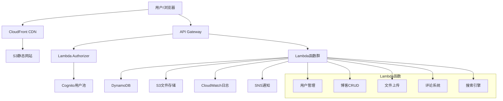

# 第10章：实战项目 - 构建Serverless Web应用

::: info 章节概述
本章将通过一个完整的实战项目，构建一个生产级的serverless博客管理系统。我们将综合运用前面学到的所有知识，包括Lambda函数、API Gateway、DynamoDB、S3、CDK部署等，展示如何构建一个完整的serverless应用。
:::

## 学习目标

1. 设计完整的serverless应用架构
2. 实现RESTful API和用户认证
3. 构建文件上传和管理功能
4. 实现数据库设计和操作
5. 配置前端集成和CDN
6. 部署和监控生产环境

## 10.1 项目架构设计

### 10.1.1 系统架构图



### 10.1.2 数据模型设计

```python
# models/data_models.py
from dataclasses import dataclass
from typing import Optional, List, Dict, Any
from datetime import datetime
from enum import Enum

class UserRole(Enum):
    ADMIN = "admin"
    AUTHOR = "author"
    READER = "reader"

class PostStatus(Enum):
    DRAFT = "draft"
    PUBLISHED = "published"
    ARCHIVED = "archived"

@dataclass
class User:
    """用户模型"""
    user_id: str
    username: str
    email: str
    role: UserRole
    profile_image_url: Optional[str] = None
    bio: Optional[str] = None
    created_at: datetime = None
    updated_at: datetime = None
    is_active: bool = True
    
    def to_dict(self) -> Dict[str, Any]:
        return {
            'user_id': self.user_id,
            'username': self.username,
            'email': self.email,
            'role': self.role.value,
            'profile_image_url': self.profile_image_url,
            'bio': self.bio,
            'created_at': self.created_at.isoformat() if self.created_at else None,
            'updated_at': self.updated_at.isoformat() if self.updated_at else None,
            'is_active': self.is_active
        }

@dataclass
class BlogPost:
    """博客文章模型"""
    post_id: str
    title: str
    content: str
    author_id: str
    status: PostStatus
    slug: str
    featured_image_url: Optional[str] = None
    tags: List[str] = None
    category: Optional[str] = None
    excerpt: Optional[str] = None
    meta_description: Optional[str] = None
    view_count: int = 0
    like_count: int = 0
    created_at: datetime = None
    updated_at: datetime = None
    published_at: Optional[datetime] = None
    
    def __post_init__(self):
        if self.tags is None:
            self.tags = []
    
    def to_dict(self) -> Dict[str, Any]:
        return {
            'post_id': self.post_id,
            'title': self.title,
            'content': self.content,
            'author_id': self.author_id,
            'status': self.status.value,
            'slug': self.slug,
            'featured_image_url': self.featured_image_url,
            'tags': self.tags,
            'category': self.category,
            'excerpt': self.excerpt,
            'meta_description': self.meta_description,
            'view_count': self.view_count,
            'like_count': self.like_count,
            'created_at': self.created_at.isoformat() if self.created_at else None,
            'updated_at': self.updated_at.isoformat() if self.updated_at else None,
            'published_at': self.published_at.isoformat() if self.published_at else None
        }

@dataclass
class Comment:
    """评论模型"""
    comment_id: str
    post_id: str
    author_id: str
    content: str
    parent_comment_id: Optional[str] = None
    created_at: datetime = None
    updated_at: datetime = None
    is_approved: bool = False
    
    def to_dict(self) -> Dict[str, Any]:
        return {
            'comment_id': self.comment_id,
            'post_id': self.post_id,
            'author_id': self.author_id,
            'content': self.content,
            'parent_comment_id': self.parent_comment_id,
            'created_at': self.created_at.isoformat() if self.created_at else None,
            'updated_at': self.updated_at.isoformat() if self.updated_at else None,
            'is_approved': self.is_approved
        }

@dataclass
class FileUpload:
    """文件上传模型"""
    file_id: str
    original_filename: str
    s3_key: str
    file_size: int
    content_type: str
    uploader_id: str
    created_at: datetime = None
    
    def to_dict(self) -> Dict[str, Any]:
        return {
            'file_id': self.file_id,
            'original_filename': self.original_filename,
            's3_key': self.s3_key,
            'file_size': self.file_size,
            'content_type': self.content_type,
            'uploader_id': self.uploader_id,
            'created_at': self.created_at.isoformat() if self.created_at else None
        }
```

### 10.1.3 CDK基础设施代码

```python
# stacks/blog_infrastructure_stack.py
from aws_cdk import (
    Stack,
    aws_lambda as _lambda,
    aws_apigateway as apigateway,
    aws_dynamodb as dynamodb,
    aws_s3 as s3,
    aws_cloudfront as cloudfront,
    aws_cognito as cognito,
    aws_s3_deployment as s3deploy,
    Duration,
    RemovalPolicy,
    CfnOutput
)
from constructs import Construct

class BlogInfrastructureStack(Stack):
    def __init__(self, scope: Construct, construct_id: str, **kwargs) -> None:
        super().__init__(scope, construct_id, **kwargs)
        
        # 创建DynamoDB表
        self._create_database_tables()
        
        # 创建S3存储桶
        self._create_storage_buckets()
        
        # 创建Cognito用户池
        self._create_user_authentication()
        
        # 创建Lambda函数
        self._create_lambda_functions()
        
        # 创建API Gateway
        self._create_api_gateway()
        
        # 创建CloudFront分发
        self._create_cloudfront_distribution()
        
        # 输出重要信息
        self._create_outputs()
    
    def _create_database_tables(self):
        """创建数据库表"""
        
        # 用户表
        self.users_table = dynamodb.Table(
            self, "UsersTable",
            table_name="blog-users",
            partition_key=dynamodb.Attribute(
                name="user_id",
                type=dynamodb.AttributeType.STRING
            ),
            billing_mode=dynamodb.BillingMode.PAY_PER_REQUEST,
            removal_policy=RemovalPolicy.DESTROY,
            global_secondary_indexes=[
                dynamodb.GlobalSecondaryIndex(
                    index_name="EmailIndex",
                    partition_key=dynamodb.Attribute(
                        name="email",
                        type=dynamodb.AttributeType.STRING
                    )
                ),
                dynamodb.GlobalSecondaryIndex(
                    index_name="UsernameIndex",
                    partition_key=dynamodb.Attribute(
                        name="username",
                        type=dynamodb.AttributeType.STRING
                    )
                )
            ]
        )
        
        # 博客文章表
        self.posts_table = dynamodb.Table(
            self, "PostsTable",
            table_name="blog-posts",
            partition_key=dynamodb.Attribute(
                name="post_id",
                type=dynamodb.AttributeType.STRING
            ),
            billing_mode=dynamodb.BillingMode.PAY_PER_REQUEST,
            removal_policy=RemovalPolicy.DESTROY,
            global_secondary_indexes=[
                dynamodb.GlobalSecondaryIndex(
                    index_name="AuthorIndex",
                    partition_key=dynamodb.Attribute(
                        name="author_id",
                        type=dynamodb.AttributeType.STRING
                    ),
                    sort_key=dynamodb.Attribute(
                        name="created_at",
                        type=dynamodb.AttributeType.STRING
                    )
                ),
                dynamodb.GlobalSecondaryIndex(
                    index_name="StatusIndex",
                    partition_key=dynamodb.Attribute(
                        name="status",
                        type=dynamodb.AttributeType.STRING
                    ),
                    sort_key=dynamodb.Attribute(
                        name="published_at",
                        type=dynamodb.AttributeType.STRING
                    )
                ),
                dynamodb.GlobalSecondaryIndex(
                    index_name="SlugIndex",
                    partition_key=dynamodb.Attribute(
                        name="slug",
                        type=dynamodb.AttributeType.STRING
                    )
                )
            ]
        )
        
        # 评论表
        self.comments_table = dynamodb.Table(
            self, "CommentsTable",
            table_name="blog-comments",
            partition_key=dynamodb.Attribute(
                name="comment_id",
                type=dynamodb.AttributeType.STRING
            ),
            billing_mode=dynamodb.BillingMode.PAY_PER_REQUEST,
            removal_policy=RemovalPolicy.DESTROY,
            global_secondary_indexes=[
                dynamodb.GlobalSecondaryIndex(
                    index_name="PostIndex",
                    partition_key=dynamodb.Attribute(
                        name="post_id",
                        type=dynamodb.AttributeType.STRING
                    ),
                    sort_key=dynamodb.Attribute(
                        name="created_at",
                        type=dynamodb.AttributeType.STRING
                    )
                )
            ]
        )
        
        # 文件上传表
        self.files_table = dynamodb.Table(
            self, "FilesTable",
            table_name="blog-files",
            partition_key=dynamodb.Attribute(
                name="file_id",
                type=dynamodb.AttributeType.STRING
            ),
            billing_mode=dynamodb.BillingMode.PAY_PER_REQUEST,
            removal_policy=RemovalPolicy.DESTROY
        )
    
    def _create_storage_buckets(self):
        """创建S3存储桶"""
        
        # 文件存储桶
        self.files_bucket = s3.Bucket(
            self, "FilesBucket",
            bucket_name=f"blog-files-{self.account}-{self.region}",
            cors=[
                s3.CorsRule(
                    allowed_origins=["*"],
                    allowed_methods=[s3.HttpMethods.GET, s3.HttpMethods.POST, s3.HttpMethods.PUT],
                    allowed_headers=["*"],
                    max_age=3600
                )
            ],
            lifecycle_rules=[
                s3.LifecycleRule(
                    id="DeleteIncompleteMultipartUploads",
                    abort_incomplete_multipart_upload_after=Duration.days(1)
                )
            ],
            removal_policy=RemovalPolicy.DESTROY
        )
        
        # 静态网站存储桶
        self.website_bucket = s3.Bucket(
            self, "WebsiteBucket",
            bucket_name=f"blog-website-{self.account}-{self.region}",
            website_index_document="index.html",
            website_error_document="error.html",
            public_read_access=True,
            removal_policy=RemovalPolicy.DESTROY
        )
    
    def _create_user_authentication(self):
        """创建用户认证"""
        
        # 用户池
        self.user_pool = cognito.UserPool(
            self, "UserPool",
            user_pool_name="blog-users",
            self_sign_up_enabled=True,
            sign_in_aliases=cognito.SignInAliases(
                email=True,
                username=True
            ),
            auto_verify=cognito.AutoVerifiedAttrs(email=True),
            password_policy=cognito.PasswordPolicy(
                min_length=8,
                require_lowercase=True,
                require_uppercase=True,
                require_digits=True,
                require_symbols=True
            ),
            account_recovery=cognito.AccountRecovery.EMAIL_ONLY,
            removal_policy=RemovalPolicy.DESTROY
        )
        
        # 用户池客户端
        self.user_pool_client = cognito.UserPoolClient(
            self, "UserPoolClient",
            user_pool=self.user_pool,
            client_name="blog-web-client",
            generate_secret=False,
            auth_flows=cognito.AuthFlow(
                user_srp=True,
                user_password=True
            ),
            o_auth=cognito.OAuthSettings(
                flows=cognito.OAuthFlows(
                    authorization_code_grant=True
                ),
                scopes=[
                    cognito.OAuthScope.EMAIL,
                    cognito.OAuthScope.OPENID,
                    cognito.OAuthScope.PROFILE
                ],
                callback_urls=["http://localhost:3000/callback"]
            )
        )
    
    def _create_lambda_functions(self):
        """创建Lambda函数"""
        
        # 通用环境变量
        common_environment = {
            'USERS_TABLE': self.users_table.table_name,
            'POSTS_TABLE': self.posts_table.table_name,
            'COMMENTS_TABLE': self.comments_table.table_name,
            'FILES_TABLE': self.files_table.table_name,
            'FILES_BUCKET': self.files_bucket.bucket_name,
            'USER_POOL_ID': self.user_pool.user_pool_id,
            'LOG_LEVEL': 'INFO'
        }
        
        # Lambda Layer for common utilities
        self.utils_layer = _lambda.LayerVersion(
            self, "UtilsLayer",
            code=_lambda.Code.from_asset("layers/utils"),
            compatible_runtimes=[_lambda.Runtime.PYTHON_3_9],
            description="Common utilities for blog application"
        )
        
        # 授权函数
        self.authorizer_function = _lambda.Function(
            self, "AuthorizerFunction",
            runtime=_lambda.Runtime.PYTHON_3_9,
            handler="index.handler",
            code=_lambda.Code.from_asset("lambda_functions/authorizer"),
            environment=common_environment,
            layers=[self.utils_layer],
            timeout=Duration.seconds(10)
        )
        
        # 用户管理函数
        self.users_function = _lambda.Function(
            self, "UsersFunction",
            runtime=_lambda.Runtime.PYTHON_3_9,
            handler="index.handler",
            code=_lambda.Code.from_asset("lambda_functions/users"),
            environment=common_environment,
            layers=[self.utils_layer],
            timeout=Duration.seconds(30)
        )
        
        # 博客文章函数
        self.posts_function = _lambda.Function(
            self, "PostsFunction",
            runtime=_lambda.Runtime.PYTHON_3_9,
            handler="index.handler",
            code=_lambda.Code.from_asset("lambda_functions/posts"),
            environment=common_environment,
            layers=[self.utils_layer],
            timeout=Duration.seconds(30)
        )
        
        # 评论函数
        self.comments_function = _lambda.Function(
            self, "CommentsFunction",
            runtime=_lambda.Runtime.PYTHON_3_9,
            handler="index.handler",
            code=_lambda.Code.from_asset("lambda_functions/comments"),
            environment=common_environment,
            layers=[self.utils_layer],
            timeout=Duration.seconds(30)
        )
        
        # 文件上传函数
        self.files_function = _lambda.Function(
            self, "FilesFunction",
            runtime=_lambda.Runtime.PYTHON_3_9,
            handler="index.handler",
            code=_lambda.Code.from_asset("lambda_functions/files"),
            environment=common_environment,
            layers=[self.utils_layer],
            timeout=Duration.minutes(5),
            memory_size=1024
        )
        
        # 搜索函数
        self.search_function = _lambda.Function(
            self, "SearchFunction",
            runtime=_lambda.Runtime.PYTHON_3_9,
            handler="index.handler",
            code=_lambda.Code.from_asset("lambda_functions/search"),
            environment=common_environment,
            layers=[self.utils_layer],
            timeout=Duration.seconds(30)
        )
        
        # 授予权限
        self._grant_permissions()
    
    def _grant_permissions(self):
        """授予Lambda函数必要的权限"""
        
        functions = [
            self.authorizer_function,
            self.users_function,
            self.posts_function,
            self.comments_function,
            self.files_function,
            self.search_function
        ]
        
        for function in functions:
            # DynamoDB权限
            self.users_table.grant_read_write_data(function)
            self.posts_table.grant_read_write_data(function)
            self.comments_table.grant_read_write_data(function)
            self.files_table.grant_read_write_data(function)
            
            # S3权限
            self.files_bucket.grant_read_write(function)
            
            # Cognito权限
            function.add_to_role_policy(
                iam.PolicyStatement(
                    effect=iam.Effect.ALLOW,
                    actions=[
                        "cognito-idp:AdminGetUser",
                        "cognito-idp:AdminListGroupsForUser",
                        "cognito-idp:GetUser"
                    ],
                    resources=[self.user_pool.user_pool_arn]
                )
            )
    
    def _create_api_gateway(self):
        """创建API Gateway"""
        
        # Lambda授权器
        authorizer = apigateway.TokenAuthorizer(
            self, "BlogAuthorizer",
            handler=self.authorizer_function,
            token_source=apigateway.IdentitySource.header("Authorization"),
            results_cache_ttl=Duration.minutes(5)
        )
        
        # API Gateway
        self.api = apigateway.RestApi(
            self, "BlogApi",
            rest_api_name="Blog API",
            description="Serverless Blog Management API",
            default_cors_preflight_options=apigateway.CorsOptions(
                allow_origins=apigateway.Cors.ALL_ORIGINS,
                allow_methods=apigateway.Cors.ALL_METHODS,
                allow_headers=[
                    "Content-Type",
                    "X-Amz-Date",
                    "Authorization",
                    "X-Api-Key",
                    "X-Amz-Security-Token"
                ]
            ),
            deploy_options=apigateway.StageOptions(
                stage_name="prod",
                throttling_rate_limit=100,
                throttling_burst_limit=200
            )
        )
        
        # 创建API资源和方法
        self._create_api_routes(authorizer)
    
    def _create_api_routes(self, authorizer):
        """创建API路由"""
        
        # /users 路由
        users_resource = self.api.root.add_resource("users")
        users_integration = apigateway.LambdaIntegration(self.users_function)
        
        users_resource.add_method("GET", users_integration)  # 获取用户列表
        users_resource.add_method("POST", users_integration)  # 创建用户
        
        # /users/{userId} 路由
        user_resource = users_resource.add_resource("{userId}")
        user_resource.add_method("GET", users_integration)
        user_resource.add_method("PUT", users_integration, authorizer=authorizer)
        user_resource.add_method("DELETE", users_integration, authorizer=authorizer)
        
        # /posts 路由
        posts_resource = self.api.root.add_resource("posts")
        posts_integration = apigateway.LambdaIntegration(self.posts_function)
        
        posts_resource.add_method("GET", posts_integration)  # 公开访问
        posts_resource.add_method("POST", posts_integration, authorizer=authorizer)
        
        # /posts/{postId} 路由
        post_resource = posts_resource.add_resource("{postId}")
        post_resource.add_method("GET", posts_integration)
        post_resource.add_method("PUT", posts_integration, authorizer=authorizer)
        post_resource.add_method("DELETE", posts_integration, authorizer=authorizer)
        
        # /posts/{postId}/comments 路由
        post_comments_resource = post_resource.add_resource("comments")
        comments_integration = apigateway.LambdaIntegration(self.comments_function)
        
        post_comments_resource.add_method("GET", comments_integration)
        post_comments_resource.add_method("POST", comments_integration, authorizer=authorizer)
        
        # /comments/{commentId} 路由
        comments_resource = self.api.root.add_resource("comments")
        comment_resource = comments_resource.add_resource("{commentId}")
        
        comment_resource.add_method("PUT", comments_integration, authorizer=authorizer)
        comment_resource.add_method("DELETE", comments_integration, authorizer=authorizer)
        
        # /files 路由
        files_resource = self.api.root.add_resource("files")
        files_integration = apigateway.LambdaIntegration(self.files_function)
        
        files_resource.add_method("POST", files_integration, authorizer=authorizer)  # 文件上传
        
        # /files/{fileId} 路由
        file_resource = files_resource.add_resource("{fileId}")
        file_resource.add_method("GET", files_integration)
        file_resource.add_method("DELETE", files_integration, authorizer=authorizer)
        
        # /search 路由
        search_resource = self.api.root.add_resource("search")
        search_integration = apigateway.LambdaIntegration(self.search_function)
        
        search_resource.add_method("GET", search_integration)
    
    def _create_cloudfront_distribution(self):
        """创建CloudFront分发"""
        
        # 源访问身份
        origin_access_identity = cloudfront.OriginAccessIdentity(
            self, "OriginAccessIdentity",
            comment="OAI for blog website"
        )
        
        # 授予CloudFront访问S3的权限
        self.website_bucket.grant_read(origin_access_identity)
        
        # CloudFront分发
        self.distribution = cloudfront.CloudFrontWebDistribution(
            self, "BlogDistribution",
            origin_configs=[
                cloudfront.SourceConfiguration(
                    s3_origin_source=cloudfront.S3OriginConfig(
                        s3_bucket_source=self.website_bucket,
                        origin_access_identity=origin_access_identity
                    ),
                    behaviors=[
                        cloudfront.Behavior(
                            is_default_behavior=True,
                            allowed_methods=cloudfront.CloudFrontAllowedMethods.GET_HEAD,
                            cached_methods=cloudfront.CloudFrontAllowedCachedMethods.GET_HEAD,
                            compress=True,
                            default_ttl=Duration.hours(24),
                            max_ttl=Duration.days(365)
                        )
                    ]
                )
            ],
            default_root_object="index.html",
            error_configurations=[
                cloudfront.CfnDistribution.CustomErrorResponseProperty(
                    error_code=404,
                    response_code=200,
                    response_page_path="/index.html"
                )
            ]
        )
    
    def _create_outputs(self):
        """创建输出"""
        
        CfnOutput(
            self, "ApiUrl",
            value=self.api.url,
            description="API Gateway URL"
        )
        
        CfnOutput(
            self, "UserPoolId",
            value=self.user_pool.user_pool_id,
            description="Cognito User Pool ID"
        )
        
        CfnOutput(
            self, "UserPoolClientId",
            value=self.user_pool_client.user_pool_client_id,
            description="Cognito User Pool Client ID"
        )
        
        CfnOutput(
            self, "WebsiteUrl",
            value=f"https://{self.distribution.distribution_domain_name}",
            description="CloudFront Distribution URL"
        )
        
        CfnOutput(
            self, "FilesBucketName",
            value=self.files_bucket.bucket_name,
            description="Files S3 Bucket Name"
        )
```

## 10.2 Lambda函数实现

### 10.2.1 通用工具Layer

```python
# layers/utils/python/blog_utils.py
import json
import boto3
import os
import logging
from typing import Dict, Any, Optional, List
from datetime import datetime
import uuid
from boto3.dynamodb.conditions import Key, Attr
import jwt
from jwt.exceptions import InvalidTokenError

logger = logging.getLogger()
logger.setLevel(os.getenv('LOG_LEVEL', 'INFO'))

class ResponseBuilder:
    """API响应构建器"""
    
    @staticmethod
    def success(data: Any, status_code: int = 200, 
               headers: Dict[str, str] = None) -> Dict[str, Any]:
        """构建成功响应"""
        default_headers = {
            'Content-Type': 'application/json',
            'Access-Control-Allow-Origin': '*',
            'Access-Control-Allow-Headers': 'Content-Type,X-Amz-Date,Authorization,X-Api-Key',
            'Access-Control-Allow-Methods': 'GET,POST,PUT,DELETE,OPTIONS'
        }
        
        if headers:
            default_headers.update(headers)
        
        return {
            'statusCode': status_code,
            'headers': default_headers,
            'body': json.dumps({
                'success': True,
                'data': data,
                'timestamp': datetime.utcnow().isoformat()
            }, default=str)
        }
    
    @staticmethod
    def error(message: str, status_code: int = 400, 
             error_code: str = None, details: Any = None) -> Dict[str, Any]:
        """构建错误响应"""
        error_data = {
            'success': False,
            'error': {
                'message': message,
                'code': error_code or 'GENERAL_ERROR',
                'timestamp': datetime.utcnow().isoformat()
            }
        }
        
        if details:
            error_data['error']['details'] = details
        
        return {
            'statusCode': status_code,
            'headers': {
                'Content-Type': 'application/json',
                'Access-Control-Allow-Origin': '*'
            },
            'body': json.dumps(error_data)
        }

class DatabaseHelper:
    """DynamoDB操作辅助类"""
    
    def __init__(self):
        self.dynamodb = boto3.resource('dynamodb')
        self.tables = {
            'users': self.dynamodb.Table(os.environ['USERS_TABLE']),
            'posts': self.dynamodb.Table(os.environ['POSTS_TABLE']),
            'comments': self.dynamodb.Table(os.environ['COMMENTS_TABLE']),
            'files': self.dynamodb.Table(os.environ['FILES_TABLE'])
        }
    
    def get_table(self, table_name: str):
        """获取DynamoDB表"""
        return self.tables.get(table_name)
    
    def put_item(self, table_name: str, item: Dict[str, Any]) -> bool:
        """插入项目"""
        try:
            table = self.get_table(table_name)
            table.put_item(Item=item)
            return True
        except Exception as e:
            logger.error(f"Error putting item to {table_name}: {str(e)}")
            return False
    
    def get_item(self, table_name: str, key: Dict[str, Any]) -> Optional[Dict[str, Any]]:
        """获取项目"""
        try:
            table = self.get_table(table_name)
            response = table.get_item(Key=key)
            return response.get('Item')
        except Exception as e:
            logger.error(f"Error getting item from {table_name}: {str(e)}")
            return None
    
    def update_item(self, table_name: str, key: Dict[str, Any], 
                   updates: Dict[str, Any]) -> bool:
        """更新项目"""
        try:
            table = self.get_table(table_name)
            
            update_expression = "SET "
            expression_values = {}
            expression_names = {}
            
            for field, value in updates.items():
                if field not in key.keys():  # 不更新键字段
                    # 处理保留字
                    if field in ['status', 'content', 'role']:
                        attr_name = f"#{field}"
                        expression_names[attr_name] = field
                        update_expression += f"{attr_name} = :{field}, "
                    else:
                        update_expression += f"{field} = :{field}, "
                    
                    expression_values[f":{field}"] = value
            
            update_expression = update_expression.rstrip(', ')
            
            kwargs = {
                'Key': key,
                'UpdateExpression': update_expression,
                'ExpressionAttributeValues': expression_values,
                'ReturnValues': 'ALL_NEW'
            }
            
            if expression_names:
                kwargs['ExpressionAttributeNames'] = expression_names
            
            response = table.update_item(**kwargs)
            return response.get('Attributes')
            
        except Exception as e:
            logger.error(f"Error updating item in {table_name}: {str(e)}")
            return None
    
    def delete_item(self, table_name: str, key: Dict[str, Any]) -> bool:
        """删除项目"""
        try:
            table = self.get_table(table_name)
            table.delete_item(Key=key)
            return True
        except Exception as e:
            logger.error(f"Error deleting item from {table_name}: {str(e)}")
            return False
    
    def query_items(self, table_name: str, index_name: str = None,
                   key_condition: Any = None, filter_expression: Any = None,
                   limit: int = None) -> List[Dict[str, Any]]:
        """查询项目"""
        try:
            table = self.get_table(table_name)
            
            kwargs = {}
            if index_name:
                kwargs['IndexName'] = index_name
            if key_condition:
                kwargs['KeyConditionExpression'] = key_condition
            if filter_expression:
                kwargs['FilterExpression'] = filter_expression
            if limit:
                kwargs['Limit'] = limit
            
            response = table.query(**kwargs)
            return response.get('Items', [])
            
        except Exception as e:
            logger.error(f"Error querying {table_name}: {str(e)}")
            return []
    
    def scan_items(self, table_name: str, filter_expression: Any = None,
                  limit: int = None) -> List[Dict[str, Any]]:
        """扫描项目"""
        try:
            table = self.get_table(table_name)
            
            kwargs = {}
            if filter_expression:
                kwargs['FilterExpression'] = filter_expression
            if limit:
                kwargs['Limit'] = limit
            
            response = table.scan(**kwargs)
            return response.get('Items', [])
            
        except Exception as e:
            logger.error(f"Error scanning {table_name}: {str(e)}")
            return []

class S3Helper:
    """S3操作辅助类"""
    
    def __init__(self):
        self.s3_client = boto3.client('s3')
        self.files_bucket = os.environ['FILES_BUCKET']
    
    def generate_presigned_url(self, key: str, expiration: int = 3600,
                             method: str = 'get_object') -> str:
        """生成预签名URL"""
        try:
            url = self.s3_client.generate_presigned_url(
                method,
                Params={'Bucket': self.files_bucket, 'Key': key},
                ExpiresIn=expiration
            )
            return url
        except Exception as e:
            logger.error(f"Error generating presigned URL: {str(e)}")
            return None
    
    def upload_file(self, file_content: bytes, key: str, 
                   content_type: str = 'application/octet-stream') -> bool:
        """上传文件"""
        try:
            self.s3_client.put_object(
                Bucket=self.files_bucket,
                Key=key,
                Body=file_content,
                ContentType=content_type
            )
            return True
        except Exception as e:
            logger.error(f"Error uploading file: {str(e)}")
            return False
    
    def delete_file(self, key: str) -> bool:
        """删除文件"""
        try:
            self.s3_client.delete_object(
                Bucket=self.files_bucket,
                Key=key
            )
            return True
        except Exception as e:
            logger.error(f"Error deleting file: {str(e)}")
            return False
    
    def get_file_info(self, key: str) -> Optional[Dict[str, Any]]:
        """获取文件信息"""
        try:
            response = self.s3_client.head_object(
                Bucket=self.files_bucket,
                Key=key
            )
            return {
                'size': response['ContentLength'],
                'content_type': response['ContentType'],
                'last_modified': response['LastModified'],
                'etag': response['ETag']
            }
        except Exception as e:
            logger.error(f"Error getting file info: {str(e)}")
            return None

class AuthHelper:
    """认证辅助类"""
    
    def __init__(self):
        self.cognito_client = boto3.client('cognito-idp')
        self.user_pool_id = os.environ['USER_POOL_ID']
    
    def decode_jwt_token(self, token: str) -> Optional[Dict[str, Any]]:
        """解码JWT令牌"""
        try:
            # 这里简化处理，实际应用中需要验证JWT签名
            # 从Authorization header中提取token
            if token.startswith('Bearer '):
                token = token[7:]
            
            # 解码不验证签名（仅用于开发）
            decoded = jwt.decode(token, options={"verify_signature": False})
            return decoded
            
        except InvalidTokenError as e:
            logger.error(f"Invalid JWT token: {str(e)}")
            return None
        except Exception as e:
            logger.error(f"Error decoding JWT: {str(e)}")
            return None
    
    def get_user_from_token(self, token: str) -> Optional[Dict[str, Any]]:
        """从令牌获取用户信息"""
        try:
            decoded = self.decode_jwt_token(token)
            if not decoded:
                return None
            
            username = decoded.get('cognito:username') or decoded.get('username')
            if not username:
                return None
            
            # 从Cognito获取用户详细信息
            response = self.cognito_client.admin_get_user(
                UserPoolId=self.user_pool_id,
                Username=username
            )
            
            # 解析用户属性
            user_attributes = {}
            for attr in response.get('UserAttributes', []):
                user_attributes[attr['Name']] = attr['Value']
            
            return {
                'username': response['Username'],
                'user_id': user_attributes.get('sub'),
                'email': user_attributes.get('email'),
                'email_verified': user_attributes.get('email_verified') == 'true',
                'status': response['UserStatus']
            }
            
        except Exception as e:
            logger.error(f"Error getting user from token: {str(e)}")
            return None

class ValidationHelper:
    """验证辅助类"""
    
    @staticmethod
    def validate_email(email: str) -> bool:
        """验证邮箱格式"""
        import re
        pattern = r'^[a-zA-Z0-9._%+-]+@[a-zA-Z0-9.-]+\.[a-zA-Z]{2,}$'
        return bool(re.match(pattern, email))
    
    @staticmethod
    def validate_slug(slug: str) -> bool:
        """验证URL slug格式"""
        import re
        pattern = r'^[a-z0-9]+(?:-[a-z0-9]+)*$'
        return bool(re.match(pattern, slug))
    
    @staticmethod
    def generate_slug(title: str) -> str:
        """从标题生成slug"""
        import re
        # 转换为小写
        slug = title.lower()
        # 替换空格和特殊字符为连字符
        slug = re.sub(r'[^a-z0-9]+', '-', slug)
        # 移除开头和结尾的连字符
        slug = slug.strip('-')
        # 移除重复的连字符
        slug = re.sub(r'-+', '-', slug)
        return slug
    
    @staticmethod
    def generate_id() -> str:
        """生成唯一ID"""
        return str(uuid.uuid4())
    
    @staticmethod
    def validate_content_length(content: str, max_length: int = 10000) -> bool:
        """验证内容长度"""
        return len(content) <= max_length
    
    @staticmethod
    def sanitize_html(content: str) -> str:
        """简单的HTML清理（实际应用中应使用专业的库）"""
        import re
        # 移除脚本标签
        content = re.sub(r'<script[^>]*>.*?</script>', '', content, flags=re.DOTALL | re.IGNORECASE)
        # 移除样式标签
        content = re.sub(r'<style[^>]*>.*?</style>', '', content, flags=re.DOTALL | re.IGNORECASE)
        # 移除危险属性
        content = re.sub(r'\son\w+\s*=\s*["\'][^"\']*["\']', '', content, flags=re.IGNORECASE)
        return content

# 全局辅助实例
response_builder = ResponseBuilder()
db_helper = DatabaseHelper()
s3_helper = S3Helper()
auth_helper = AuthHelper()
validation_helper = ValidationHelper()
```

### 10.2.2 用户管理Lambda函数

```python
# lambda_functions/users/index.py
import json
import logging
from typing import Dict, Any
from datetime import datetime
from blog_utils import (
    response_builder, db_helper, auth_helper, validation_helper
)
from boto3.dynamodb.conditions import Key, Attr

logger = logging.getLogger()
logger.setLevel(logging.INFO)

class UserManager:
    """用户管理器"""
    
    def __init__(self):
        self.table_name = 'users'
    
    def get_user_profile(self, user_id: str) -> Dict[str, Any]:
        """获取用户档案"""
        user = db_helper.get_item(self.table_name, {'user_id': user_id})
        
        if not user:
            return response_builder.error("User not found", 404, "USER_NOT_FOUND")
        
        # 移除敏感信息
        safe_user = {k: v for k, v in user.items() 
                    if k not in ['password_hash', 'salt']}
        
        return response_builder.success(safe_user)
    
    def update_user_profile(self, user_id: str, updates: Dict[str, Any],
                          current_user: Dict[str, Any]) -> Dict[str, Any]:
        """更新用户档案"""
        # 权限检查
        if current_user['user_id'] != user_id and current_user.get('role') != 'admin':
            return response_builder.error(
                "Insufficient permissions", 403, "INSUFFICIENT_PERMISSIONS"
            )
        
        # 验证更新数据
        if 'email' in updates:
            if not validation_helper.validate_email(updates['email']):
                return response_builder.error(
                    "Invalid email format", 400, "INVALID_EMAIL"
                )
            
            # 检查邮箱是否已存在
            existing_users = db_helper.query_items(
                self.table_name,
                index_name='EmailIndex',
                key_condition=Key('email').eq(updates['email'])
            )
            
            if existing_users and existing_users[0]['user_id'] != user_id:
                return response_builder.error(
                    "Email already in use", 400, "EMAIL_IN_USE"
                )
        
        # 验证用户名
        if 'username' in updates:
            if len(updates['username']) < 3 or len(updates['username']) > 30:
                return response_builder.error(
                    "Username must be 3-30 characters", 400, "INVALID_USERNAME"
                )
            
            # 检查用户名是否已存在
            existing_users = db_helper.query_items(
                self.table_name,
                index_name='UsernameIndex',
                key_condition=Key('username').eq(updates['username'])
            )
            
            if existing_users and existing_users[0]['user_id'] != user_id:
                return response_builder.error(
                    "Username already taken", 400, "USERNAME_TAKEN"
                )
        
        # 添加更新时间
        updates['updated_at'] = datetime.utcnow().isoformat()
        
        # 执行更新
        updated_user = db_helper.update_item(
            self.table_name,
            {'user_id': user_id},
            updates
        )
        
        if not updated_user:
            return response_builder.error(
                "Failed to update user", 500, "UPDATE_FAILED"
            )
        
        # 移除敏感信息
        safe_user = {k: v for k, v in updated_user.items() 
                    if k not in ['password_hash', 'salt']}
        
        return response_builder.success(safe_user)
    
    def list_users(self, limit: int = 20, last_key: str = None,
                  current_user: Dict[str, Any] = None) -> Dict[str, Any]:
        """获取用户列表（仅管理员）"""
        if not current_user or current_user.get('role') != 'admin':
            return response_builder.error(
                "Admin access required", 403, "ADMIN_REQUIRED"
            )
        
        # 扫描用户（实际应用中应该使用更高效的查询）
        users = db_helper.scan_items(
            self.table_name,
            filter_expression=Attr('is_active').eq(True),
            limit=limit
        )
        
        # 移除敏感信息
        safe_users = []
        for user in users:
            safe_user = {k: v for k, v in user.items() 
                        if k not in ['password_hash', 'salt']}
            safe_users.append(safe_user)
        
        return response_builder.success({
            'users': safe_users,
            'count': len(safe_users)
        })
    
    def create_user_profile(self, user_data: Dict[str, Any]) -> Dict[str, Any]:
        """创建用户档案（用于Cognito注册后的钩子）"""
        required_fields = ['user_id', 'username', 'email']
        
        for field in required_fields:
            if field not in user_data:
                return response_builder.error(
                    f"Missing required field: {field}", 400, "MISSING_FIELD"
                )
        
        # 验证数据
        if not validation_helper.validate_email(user_data['email']):
            return response_builder.error(
                "Invalid email format", 400, "INVALID_EMAIL"
            )
        
        # 创建用户记录
        user_record = {
            'user_id': user_data['user_id'],
            'username': user_data['username'],
            'email': user_data['email'],
            'role': user_data.get('role', 'reader'),
            'bio': user_data.get('bio', ''),
            'profile_image_url': user_data.get('profile_image_url'),
            'is_active': True,
            'created_at': datetime.utcnow().isoformat(),
            'updated_at': datetime.utcnow().isoformat()
        }
        
        success = db_helper.put_item(self.table_name, user_record)
        
        if not success:
            return response_builder.error(
                "Failed to create user profile", 500, "CREATE_FAILED"
            )
        
        return response_builder.success(user_record, 201)
    
    def delete_user(self, user_id: str, current_user: Dict[str, Any]) -> Dict[str, Any]:
        """删除用户（软删除）"""
        # 权限检查
        if current_user['user_id'] != user_id and current_user.get('role') != 'admin':
            return response_builder.error(
                "Insufficient permissions", 403, "INSUFFICIENT_PERMISSIONS"
            )
        
        # 软删除（标记为非活跃）
        updated_user = db_helper.update_item(
            self.table_name,
            {'user_id': user_id},
            {
                'is_active': False,
                'updated_at': datetime.utcnow().isoformat()
            }
        )
        
        if not updated_user:
            return response_builder.error(
                "User not found or already deleted", 404, "USER_NOT_FOUND"
            )
        
        return response_builder.success({
            'message': 'User deactivated successfully',
            'user_id': user_id
        })

# 全局用户管理器
user_manager = UserManager()

def handler(event: Dict[str, Any], context) -> Dict[str, Any]:
    """用户管理Lambda处理器"""
    
    logger.info(f"Processing users request: {event['httpMethod']} {event['path']}")
    
    try:
        method = event['httpMethod']
        path = event['path']
        body = json.loads(event.get('body', '{}')) if event.get('body') else {}
        query_params = event.get('queryStringParameters') or {}
        path_params = event.get('pathParameters') or {}
        
        # 从授权器获取当前用户
        current_user = event.get('requestContext', {}).get('authorizer', {}).get('user')
        
        # 路由处理
        if method == 'GET' and path == '/users':
            # 获取用户列表
            limit = int(query_params.get('limit', 20))
            return user_manager.list_users(limit, current_user=current_user)
        
        elif method == 'GET' and path.startswith('/users/'):
            # 获取单个用户
            user_id = path_params.get('userId')
            if not user_id:
                return response_builder.error("User ID required", 400, "MISSING_USER_ID")
            
            return user_manager.get_user_profile(user_id)
        
        elif method == 'POST' and path == '/users':
            # 创建用户档案
            return user_manager.create_user_profile(body)
        
        elif method == 'PUT' and path.startswith('/users/'):
            # 更新用户
            user_id = path_params.get('userId')
            if not user_id:
                return response_builder.error("User ID required", 400, "MISSING_USER_ID")
            
            if not current_user:
                return response_builder.error("Authentication required", 401, "AUTH_REQUIRED")
            
            return user_manager.update_user_profile(user_id, body, current_user)
        
        elif method == 'DELETE' and path.startswith('/users/'):
            # 删除用户
            user_id = path_params.get('userId')
            if not user_id:
                return response_builder.error("User ID required", 400, "MISSING_USER_ID")
            
            if not current_user:
                return response_builder.error("Authentication required", 401, "AUTH_REQUIRED")
            
            return user_manager.delete_user(user_id, current_user)
        
        else:
            return response_builder.error("Route not found", 404, "ROUTE_NOT_FOUND")
    
    except json.JSONDecodeError:
        return response_builder.error("Invalid JSON in request body", 400, "INVALID_JSON")
    
    except Exception as e:
        logger.error(f"Unexpected error: {str(e)}")
        return response_builder.error("Internal server error", 500, "INTERNAL_ERROR")
```

### 10.2.3 博客文章管理Lambda函数

```python
# lambda_functions/posts/index.py
import json
import logging
from typing import Dict, Any, List
from datetime import datetime
from blog_utils import (
    response_builder, db_helper, validation_helper
)
from boto3.dynamodb.conditions import Key, Attr

logger = logging.getLogger()
logger.setLevel(logging.INFO)

class PostManager:
    """博客文章管理器"""
    
    def __init__(self):
        self.table_name = 'posts'
        self.users_table = 'users'
    
    def create_post(self, post_data: Dict[str, Any], 
                   current_user: Dict[str, Any]) -> Dict[str, Any]:
        """创建博客文章"""
        # 权限检查
        user_role = current_user.get('role', 'reader')
        if user_role not in ['admin', 'author']:
            return response_builder.error(
                "Insufficient permissions to create posts", 403, "INSUFFICIENT_PERMISSIONS"
            )
        
        # 验证必需字段
        required_fields = ['title', 'content']
        for field in required_fields:
            if not post_data.get(field):
                return response_builder.error(
                    f"Missing required field: {field}", 400, "MISSING_FIELD"
                )
        
        # 验证内容长度
        if not validation_helper.validate_content_length(post_data['content'], 50000):
            return response_builder.error(
                "Content too long (max 50000 characters)", 400, "CONTENT_TOO_LONG"
            )
        
        # 生成slug
        title = post_data['title'].strip()
        slug = post_data.get('slug')
        if not slug:
            slug = validation_helper.generate_slug(title)
        
        if not validation_helper.validate_slug(slug):
            return response_builder.error(
                "Invalid slug format", 400, "INVALID_SLUG"
            )
        
        # 检查slug是否已存在
        existing_posts = db_helper.query_items(
            self.table_name,
            index_name='SlugIndex',
            key_condition=Key('slug').eq(slug)
        )
        
        if existing_posts:
            return response_builder.error(
                "Slug already exists", 400, "SLUG_EXISTS"
            )
        
        # 创建文章记录
        post_id = validation_helper.generate_id()
        now = datetime.utcnow().isoformat()
        
        status = post_data.get('status', 'draft')
        if status not in ['draft', 'published']:
            status = 'draft'
        
        post_record = {
            'post_id': post_id,
            'title': title,
            'content': validation_helper.sanitize_html(post_data['content']),
            'author_id': current_user['user_id'],
            'status': status,
            'slug': slug,
            'featured_image_url': post_data.get('featured_image_url'),
            'tags': post_data.get('tags', []),
            'category': post_data.get('category'),
            'excerpt': post_data.get('excerpt', ''),
            'meta_description': post_data.get('meta_description', ''),
            'view_count': 0,
            'like_count': 0,
            'created_at': now,
            'updated_at': now,
            'published_at': now if status == 'published' else None
        }
        
        success = db_helper.put_item(self.table_name, post_record)
        
        if not success:
            return response_builder.error(
                "Failed to create post", 500, "CREATE_FAILED"
            )
        
        return response_builder.success(post_record, 201)
    
    def get_post(self, post_id: str = None, slug: str = None,
                increment_view: bool = True) -> Dict[str, Any]:
        """获取单个博客文章"""
        post = None
        
        if post_id:
            post = db_helper.get_item(self.table_name, {'post_id': post_id})
        elif slug:
            posts = db_helper.query_items(
                self.table_name,
                index_name='SlugIndex',
                key_condition=Key('slug').eq(slug)
            )
            post = posts[0] if posts else None
        
        if not post:
            return response_builder.error("Post not found", 404, "POST_NOT_FOUND")
        
        # 增加浏览计数（仅对已发布的文章）
        if increment_view and post.get('status') == 'published':
            db_helper.update_item(
                self.table_name,
                {'post_id': post['post_id']},
                {'view_count': post.get('view_count', 0) + 1}
            )
            post['view_count'] = post.get('view_count', 0) + 1
        
        # 获取作者信息
        author = db_helper.get_item(self.users_table, {'user_id': post['author_id']})
        if author:
            post['author'] = {
                'user_id': author['user_id'],
                'username': author['username'],
                'profile_image_url': author.get('profile_image_url')
            }
        
        return response_builder.success(post)
    
    def update_post(self, post_id: str, updates: Dict[str, Any],
                   current_user: Dict[str, Any]) -> Dict[str, Any]:
        """更新博客文章"""
        # 获取现有文章
        post = db_helper.get_item(self.table_name, {'post_id': post_id})
        if not post:
            return response_builder.error("Post not found", 404, "POST_NOT_FOUND")
        
        # 权限检查
        user_role = current_user.get('role', 'reader')
        is_author = current_user['user_id'] == post['author_id']
        is_admin = user_role == 'admin'
        
        if not (is_author or is_admin):
            return response_builder.error(
                "Insufficient permissions", 403, "INSUFFICIENT_PERMISSIONS"
            )
        
        # 验证更新数据
        if 'content' in updates:
            if not validation_helper.validate_content_length(updates['content'], 50000):
                return response_builder.error(
                    "Content too long", 400, "CONTENT_TOO_LONG"
                )
            updates['content'] = validation_helper.sanitize_html(updates['content'])
        
        if 'slug' in updates:
            if not validation_helper.validate_slug(updates['slug']):
                return response_builder.error(
                    "Invalid slug format", 400, "INVALID_SLUG"
                )
            
            # 检查slug冲突
            if updates['slug'] != post.get('slug'):
                existing_posts = db_helper.query_items(
                    self.table_name,
                    index_name='SlugIndex',
                    key_condition=Key('slug').eq(updates['slug'])
                )
                if existing_posts:
                    return response_builder.error(
                        "Slug already exists", 400, "SLUG_EXISTS"
                    )
        
        # 处理状态变更
        if 'status' in updates:
            if updates['status'] not in ['draft', 'published', 'archived']:
                return response_builder.error(
                    "Invalid status", 400, "INVALID_STATUS"
                )
            
            # 如果从draft变为published，设置发布时间
            if updates['status'] == 'published' and post.get('status') == 'draft':
                updates['published_at'] = datetime.utcnow().isoformat()
        
        # 添加更新时间
        updates['updated_at'] = datetime.utcnow().isoformat()
        
        # 执行更新
        updated_post = db_helper.update_item(
            self.table_name,
            {'post_id': post_id},
            updates
        )
        
        if not updated_post:
            return response_builder.error(
                "Failed to update post", 500, "UPDATE_FAILED"
            )
        
        return response_builder.success(updated_post)
    
    def delete_post(self, post_id: str, current_user: Dict[str, Any]) -> Dict[str, Any]:
        """删除博客文章"""
        # 获取现有文章
        post = db_helper.get_item(self.table_name, {'post_id': post_id})
        if not post:
            return response_builder.error("Post not found", 404, "POST_NOT_FOUND")
        
        # 权限检查
        user_role = current_user.get('role', 'reader')
        is_author = current_user['user_id'] == post['author_id']
        is_admin = user_role == 'admin'
        
        if not (is_author or is_admin):
            return response_builder.error(
                "Insufficient permissions", 403, "INSUFFICIENT_PERMISSIONS"
            )
        
        # 软删除（标记为已归档）
        updated_post = db_helper.update_item(
            self.table_name,
            {'post_id': post_id},
            {
                'status': 'archived',
                'updated_at': datetime.utcnow().isoformat()
            }
        )
        
        if not updated_post:
            return response_builder.error(
                "Failed to delete post", 500, "DELETE_FAILED"
            )
        
        return response_builder.success({
            'message': 'Post archived successfully',
            'post_id': post_id
        })
    
    def list_posts(self, status: str = 'published', author_id: str = None,
                  category: str = None, limit: int = 20,
                  last_key: str = None) -> Dict[str, Any]:
        """获取文章列表"""
        
        posts = []
        
        if author_id:
            # 按作者查询
            posts = db_helper.query_items(
                self.table_name,
                index_name='AuthorIndex',
                key_condition=Key('author_id').eq(author_id),
                filter_expression=Attr('status').eq(status) if status else None,
                limit=limit
            )
        elif status:
            # 按状态查询
            posts = db_helper.query_items(
                self.table_name,
                index_name='StatusIndex',
                key_condition=Key('status').eq(status),
                limit=limit
            )
        else:
            # 扫描所有文章
            filter_expr = None
            if category:
                filter_expr = Attr('category').eq(category)
            
            posts = db_helper.scan_items(
                self.table_name,
                filter_expression=filter_expr,
                limit=limit
            )
        
        # 为每篇文章添加作者信息
        enriched_posts = []
        for post in posts:
            author = db_helper.get_item(self.users_table, {'user_id': post['author_id']})
            if author:
                post['author'] = {
                    'user_id': author['user_id'],
                    'username': author['username'],
                    'profile_image_url': author.get('profile_image_url')
                }
            
            # 移除完整内容，只保留摘要
            if 'content' in post:
                post['content_preview'] = post['content'][:200] + '...' if len(post['content']) > 200 else post['content']
                del post['content']
            
            enriched_posts.append(post)
        
        # 按发布时间排序（最新的在前）
        enriched_posts.sort(
            key=lambda x: x.get('published_at') or x.get('created_at'), 
            reverse=True
        )
        
        return response_builder.success({
            'posts': enriched_posts,
            'count': len(enriched_posts)
        })
    
    def like_post(self, post_id: str, current_user: Dict[str, Any]) -> Dict[str, Any]:
        """点赞文章"""
        if not current_user:
            return response_builder.error(
                "Authentication required", 401, "AUTH_REQUIRED"
            )
        
        # 获取文章
        post = db_helper.get_item(self.table_name, {'post_id': post_id})
        if not post:
            return response_builder.error("Post not found", 404, "POST_NOT_FOUND")
        
        # 增加点赞数
        updated_post = db_helper.update_item(
            self.table_name,
            {'post_id': post_id},
            {'like_count': post.get('like_count', 0) + 1}
        )
        
        if not updated_post:
            return response_builder.error(
                "Failed to like post", 500, "LIKE_FAILED"
            )
        
        return response_builder.success({
            'message': 'Post liked successfully',
            'like_count': updated_post['like_count']
        })

# 全局文章管理器
post_manager = PostManager()

def handler(event: Dict[str, Any], context) -> Dict[str, Any]:
    """博客文章管理Lambda处理器"""
    
    logger.info(f"Processing posts request: {event['httpMethod']} {event['path']}")
    
    try:
        method = event['httpMethod']
        path = event['path']
        body = json.loads(event.get('body', '{}')) if event.get('body') else {}
        query_params = event.get('queryStringParameters') or {}
        path_params = event.get('pathParameters') or {}
        
        # 从授权器获取当前用户
        current_user = event.get('requestContext', {}).get('authorizer', {}).get('user')
        
        # 路由处理
        if method == 'GET' and path == '/posts':
            # 获取文章列表
            status = query_params.get('status', 'published')
            author_id = query_params.get('author_id')
            category = query_params.get('category')
            limit = int(query_params.get('limit', 20))
            
            return post_manager.list_posts(status, author_id, category, limit)
        
        elif method == 'GET' and path.startswith('/posts/'):
            # 获取单个文章
            post_id = path_params.get('postId')
            slug = query_params.get('slug')
            
            if not post_id and not slug:
                return response_builder.error("Post ID or slug required", 400, "MISSING_IDENTIFIER")
            
            return post_manager.get_post(post_id, slug)
        
        elif method == 'POST' and path == '/posts':
            # 创建文章
            if not current_user:
                return response_builder.error("Authentication required", 401, "AUTH_REQUIRED")
            
            return post_manager.create_post(body, current_user)
        
        elif method == 'PUT' and path.startswith('/posts/'):
            # 更新文章
            post_id = path_params.get('postId')
            if not post_id:
                return response_builder.error("Post ID required", 400, "MISSING_POST_ID")
            
            if not current_user:
                return response_builder.error("Authentication required", 401, "AUTH_REQUIRED")
            
            return post_manager.update_post(post_id, body, current_user)
        
        elif method == 'DELETE' and path.startswith('/posts/'):
            # 删除文章
            post_id = path_params.get('postId')
            if not post_id:
                return response_builder.error("Post ID required", 400, "MISSING_POST_ID")
            
            if not current_user:
                return response_builder.error("Authentication required", 401, "AUTH_REQUIRED")
            
            return post_manager.delete_post(post_id, current_user)
        
        elif method == 'POST' and '/like' in path:
            # 点赞文章
            post_id = path_params.get('postId')
            if not post_id:
                return response_builder.error("Post ID required", 400, "MISSING_POST_ID")
            
            return post_manager.like_post(post_id, current_user)
        
        else:
            return response_builder.error("Route not found", 404, "ROUTE_NOT_FOUND")
    
    except json.JSONDecodeError:
        return response_builder.error("Invalid JSON in request body", 400, "INVALID_JSON")
    
    except Exception as e:
        logger.error(f"Unexpected error: {str(e)}")
        return response_builder.error("Internal server error", 500, "INTERNAL_ERROR")
```

## 10.3 前端集成

### 10.3.1 React前端应用配置

```typescript
// frontend/src/config/aws-config.ts
export const awsConfig = {
  apiGateway: {
    baseUrl: process.env.REACT_APP_API_BASE_URL || 'https://your-api-id.execute-api.region.amazonaws.com/prod',
    region: process.env.REACT_APP_AWS_REGION || 'us-east-1'
  },
  cognito: {
    userPoolId: process.env.REACT_APP_USER_POOL_ID || 'us-east-1_xxxxxxxxx',
    clientId: process.env.REACT_APP_USER_POOL_CLIENT_ID || 'xxxxxxxxxxxxxxxxxxxxxxxxxx',
    region: process.env.REACT_APP_AWS_REGION || 'us-east-1'
  },
  s3: {
    bucket: process.env.REACT_APP_FILES_BUCKET || 'your-files-bucket',
    region: process.env.REACT_APP_AWS_REGION || 'us-east-1'
  }
};
```

```typescript
// frontend/src/services/api.ts
import axios, { AxiosInstance, AxiosRequestConfig } from 'axios';
import { Auth } from 'aws-amplify';
import { awsConfig } from '../config/aws-config';

class ApiService {
  private client: AxiosInstance;

  constructor() {
    this.client = axios.create({
      baseURL: awsConfig.apiGateway.baseUrl,
      timeout: 30000,
      headers: {
        'Content-Type': 'application/json'
      }
    });

    // 请求拦截器 - 添加认证令牌
    this.client.interceptors.request.use(
      async (config) => {
        try {
          const session = await Auth.currentSession();
          const token = session.getIdToken().getJwtToken();
          config.headers.Authorization = `Bearer ${token}`;
        } catch (error) {
          // 用户未登录，继续请求
        }
        return config;
      },
      (error) => {
        return Promise.reject(error);
      }
    );

    // 响应拦截器 - 处理错误
    this.client.interceptors.response.use(
      (response) => response.data,
      (error) => {
        if (error.response?.status === 401) {
          // 未授权，重定向到登录页
          window.location.href = '/login';
        }
        return Promise.reject(error);
      }
    );
  }

  // 用户相关API
  async getCurrentUser() {
    return this.client.get('/users/me');
  }

  async updateUserProfile(userId: string, updates: any) {
    return this.client.put(`/users/${userId}`, updates);
  }

  // 文章相关API
  async getPosts(params?: {
    status?: string;
    author_id?: string;
    category?: string;
    limit?: number;
  }) {
    return this.client.get('/posts', { params });
  }

  async getPost(postId: string) {
    return this.client.get(`/posts/${postId}`);
  }

  async getPostBySlug(slug: string) {
    return this.client.get(`/posts/by-slug?slug=${slug}`);
  }

  async createPost(postData: any) {
    return this.client.post('/posts', postData);
  }

  async updatePost(postId: string, updates: any) {
    return this.client.put(`/posts/${postId}`, updates);
  }

  async deletePost(postId: string) {
    return this.client.delete(`/posts/${postId}`);
  }

  async likePost(postId: string) {
    return this.client.post(`/posts/${postId}/like`);
  }

  // 评论相关API
  async getComments(postId: string) {
    return this.client.get(`/posts/${postId}/comments`);
  }

  async createComment(postId: string, content: string, parentId?: string) {
    return this.client.post(`/posts/${postId}/comments`, {
      content,
      parent_comment_id: parentId
    });
  }

  async updateComment(commentId: string, content: string) {
    return this.client.put(`/comments/${commentId}`, { content });
  }

  async deleteComment(commentId: string) {
    return this.client.delete(`/comments/${commentId}`);
  }

  // 文件上传API
  async uploadFile(file: File, onProgress?: (progress: number) => void) {
    const formData = new FormData();
    formData.append('file', file);

    return this.client.post('/files', formData, {
      headers: {
        'Content-Type': 'multipart/form-data'
      },
      onUploadProgress: (progressEvent) => {
        if (onProgress && progressEvent.total) {
          const progress = (progressEvent.loaded / progressEvent.total) * 100;
          onProgress(progress);
        }
      }
    });
  }

  async deleteFile(fileId: string) {
    return this.client.delete(`/files/${fileId}`);
  }

  // 搜索API
  async searchPosts(query: string, filters?: any) {
    return this.client.get('/search', {
      params: { q: query, ...filters }
    });
  }
}

export const apiService = new ApiService();
```

```tsx
// frontend/src/components/PostEditor.tsx
import React, { useState, useEffect } from 'react';
import { useNavigate, useParams } from 'react-router-dom';
import {
  Box,
  TextField,
  Button,
  FormControl,
  InputLabel,
  Select,
  MenuItem,
  Chip,
  Typography,
  Alert,
  LinearProgress
} from '@mui/material';
import { Save as SaveIcon, Publish as PublishIcon } from '@mui/icons-material';
import { apiService } from '../services/api';

interface PostEditorProps {
  mode: 'create' | 'edit';
}

export const PostEditor: React.FC<PostEditorProps> = ({ mode }) => {
  const navigate = useNavigate();
  const { postId } = useParams();
  
  const [formData, setFormData] = useState({
    title: '',
    content: '',
    excerpt: '',
    category: '',
    tags: [] as string[],
    featured_image_url: '',
    meta_description: '',
    status: 'draft'
  });
  
  const [tagInput, setTagInput] = useState('');
  const [loading, setLoading] = useState(false);
  const [error, setError] = useState<string | null>(null);
  const [uploadProgress, setUploadProgress] = useState(0);

  useEffect(() => {
    if (mode === 'edit' && postId) {
      loadPost();
    }
  }, [mode, postId]);

  const loadPost = async () => {
    try {
      setLoading(true);
      const response = await apiService.getPost(postId!);
      if (response.success) {
        setFormData(response.data);
      }
    } catch (error) {
      setError('Failed to load post');
    } finally {
      setLoading(false);
    }
  };

  const handleSubmit = async (status: 'draft' | 'published') => {
    try {
      setLoading(true);
      setError(null);

      const postData = { ...formData, status };

      let response;
      if (mode === 'create') {
        response = await apiService.createPost(postData);
      } else {
        response = await apiService.updatePost(postId!, postData);
      }

      if (response.success) {
        navigate('/admin/posts');
      } else {
        setError(response.error?.message || 'Failed to save post');
      }
    } catch (error: any) {
      setError(error.response?.data?.error?.message || 'Failed to save post');
    } finally {
      setLoading(false);
    }
  };

  const handleImageUpload = async (event: React.ChangeEvent<HTMLInputElement>) => {
    const file = event.target.files?.[0];
    if (!file) return;

    try {
      setUploadProgress(0);
      const response = await apiService.uploadFile(file, setUploadProgress);
      
      if (response.success) {
        setFormData(prev => ({
          ...prev,
          featured_image_url: response.data.url
        }));
      }
    } catch (error) {
      setError('Failed to upload image');
    } finally {
      setUploadProgress(0);
    }
  };

  const handleAddTag = () => {
    if (tagInput.trim() && !formData.tags.includes(tagInput.trim())) {
      setFormData(prev => ({
        ...prev,
        tags: [...prev.tags, tagInput.trim()]
      }));
      setTagInput('');
    }
  };

  const handleRemoveTag = (tagToRemove: string) => {
    setFormData(prev => ({
      ...prev,
      tags: prev.tags.filter(tag => tag !== tagToRemove)
    }));
  };

  if (loading && mode === 'edit') {
    return <LinearProgress />;
  }

  return (
    <Box maxWidth="md" mx="auto" p={3}>
      <Typography variant="h4" gutterBottom>
        {mode === 'create' ? 'Create New Post' : 'Edit Post'}
      </Typography>

      {error && (
        <Alert severity="error" sx={{ mb: 2 }}>
          {error}
        </Alert>
      )}

      <Box component="form" sx={{ display: 'flex', flexDirection: 'column', gap: 3 }}>
        <TextField
          label="Title"
          value={formData.title}
          onChange={(e) => setFormData(prev => ({ ...prev, title: e.target.value }))}
          fullWidth
          required
        />

        <TextField
          label="Content"
          value={formData.content}
          onChange={(e) => setFormData(prev => ({ ...prev, content: e.target.value }))}
          multiline
          rows={15}
          fullWidth
          required
        />

        <TextField
          label="Excerpt"
          value={formData.excerpt}
          onChange={(e) => setFormData(prev => ({ ...prev, excerpt: e.target.value }))}
          multiline
          rows={3}
          fullWidth
        />

        <FormControl fullWidth>
          <InputLabel>Category</InputLabel>
          <Select
            value={formData.category}
            onChange={(e) => setFormData(prev => ({ ...prev, category: e.target.value }))}
          >
            <MenuItem value="technology">Technology</MenuItem>
            <MenuItem value="programming">Programming</MenuItem>
            <MenuItem value="tutorial">Tutorial</MenuItem>
            <MenuItem value="opinion">Opinion</MenuItem>
          </Select>
        </FormControl>

        <Box>
          <Typography variant="subtitle1" gutterBottom>
            Tags
          </Typography>
          <Box sx={{ display: 'flex', gap: 1, mb: 1, flexWrap: 'wrap' }}>
            {formData.tags.map((tag) => (
              <Chip
                key={tag}
                label={tag}
                onDelete={() => handleRemoveTag(tag)}
                size="small"
              />
            ))}
          </Box>
          <Box sx={{ display: 'flex', gap: 1 }}>
            <TextField
              label="Add tag"
              value={tagInput}
              onChange={(e) => setTagInput(e.target.value)}
              onKeyPress={(e) => e.key === 'Enter' && handleAddTag()}
              size="small"
            />
            <Button onClick={handleAddTag} variant="outlined" size="small">
              Add
            </Button>
          </Box>
        </Box>

        <Box>
          <Typography variant="subtitle1" gutterBottom>
            Featured Image
          </Typography>
          <input
            type="file"
            accept="image/*"
            onChange={handleImageUpload}
            style={{ marginBottom: 16 }}
          />
          {uploadProgress > 0 && (
            <LinearProgress variant="determinate" value={uploadProgress} />
          )}
          {formData.featured_image_url && (
            
          )}
        </Box>

        <TextField
          label="Meta Description"
          value={formData.meta_description}
          onChange={(e) => setFormData(prev => ({ ...prev, meta_description: e.target.value }))}
          multiline
          rows={2}
          fullWidth
        />

        <Box sx={{ display: 'flex', gap: 2 }}>
          <Button
            variant="outlined"
            onClick={() => handleSubmit('draft')}
            disabled={loading}
            startIcon={<SaveIcon />}
          >
            Save as Draft
          </Button>
          <Button
            variant="contained"
            onClick={() => handleSubmit('published')}
            disabled={loading}
            startIcon={<PublishIcon />}
          >
            Publish
          </Button>
        </Box>
      </Box>
    </Box>
  );
};
```

## 10.4 部署和监控

### 10.4.1 自动化部署脚本

```bash
#!/bin/bash
# deploy.sh

set -e

echo "🚀 Starting deployment of Serverless Blog Application..."

# 检查环境变量
if [ -z "$AWS_ACCOUNT_ID" ] || [ -z "$AWS_REGION" ]; then
    echo "❌ Please set AWS_ACCOUNT_ID and AWS_REGION environment variables"
    exit 1
fi

# 安装依赖
echo "📦 Installing dependencies..."
npm install

# 构建前端应用
echo "🏗️ Building frontend application..."
cd frontend
npm install
npm run build
cd ..

# 部署CDK栈
echo "☁️ Deploying CDK stacks..."
npx cdk bootstrap --require-approval never
npx cdk deploy BlogInfrastructureStack --require-approval never

# 获取部署输出
echo "📝 Getting deployment outputs..."
OUTPUTS=$(aws cloudformation describe-stacks \
    --stack-name BlogInfrastructureStack \
    --query 'Stacks[0].Outputs' \
    --output json)

API_URL=$(echo $OUTPUTS | jq -r '.[] | select(.OutputKey=="ApiUrl") | .OutputValue')
WEBSITE_URL=$(echo $OUTPUTS | jq -r '.[] | select(.OutputKey=="WebsiteUrl") | .OutputValue')
USER_POOL_ID=$(echo $OUTPUTS | jq -r '.[] | select(.OutputKey=="UserPoolId") | .OutputValue')
CLIENT_ID=$(echo $OUTPUTS | jq -r '.[] | select(.OutputKey=="UserPoolClientId") | .OutputValue')

echo "✅ Deployment completed successfully!"
echo "🌐 Website URL: $WEBSITE_URL"
echo "🔗 API URL: $API_URL"
echo "👤 User Pool ID: $USER_POOL_ID"
echo "🔑 Client ID: $CLIENT_ID"

# 创建环境配置文件
cat > frontend/.env.production <<EOF
REACT_APP_API_BASE_URL=$API_URL
REACT_APP_USER_POOL_ID=$USER_POOL_ID
REACT_APP_USER_POOL_CLIENT_ID=$CLIENT_ID
REACT_APP_AWS_REGION=$AWS_REGION
EOF

echo "📄 Environment configuration saved to frontend/.env.production"
```

### 10.4.2 监控和告警配置

```python
# stacks/monitoring_stack.py
from aws_cdk import (
    Stack,
    aws_cloudwatch as cloudwatch,
    aws_cloudwatch_actions as cw_actions,
    aws_sns as sns,
    aws_logs as logs,
    Duration
)
from constructs import Construct

class MonitoringStack(Stack):
    def __init__(self, scope: Construct, construct_id: str,
                 lambda_functions: dict, api_gateway, **kwargs) -> None:
        super().__init__(scope, construct_id, **kwargs)
        
        self.lambda_functions = lambda_functions
        self.api_gateway = api_gateway
        
        # 创建SNS主题用于告警
        self.alert_topic = sns.Topic(
            self, "BlogAlerts",
            topic_name="blog-application-alerts"
        )
        
        # 添加邮件订阅
        self.alert_topic.add_subscription(
            sns_subscriptions.EmailSubscription("admin@yourdomain.com")
        )
        
        # 创建仪表板
        self._create_dashboard()
        
        # 创建告警
        self._create_alarms()
        
        # 创建日志洞察查询
        self._create_log_insights()
    
    def _create_dashboard(self):
        """创建CloudWatch仪表板"""
        
        self.dashboard = cloudwatch.Dashboard(
            self, "BlogDashboard",
            dashboard_name="ServerlessBlogMonitoring"
        )
        
        # API Gateway指标
        api_widgets = [
            cloudwatch.GraphWidget(
                title="API Gateway Requests",
                left=[
                    self.api_gateway.metric_count(period=Duration.minutes(5)),
                    self.api_gateway.metric_error_count(period=Duration.minutes(5))
                ],
                width=12,
                height=6
            ),
            cloudwatch.GraphWidget(
                title="API Gateway Latency",
                left=[
                    self.api_gateway.metric_latency(period=Duration.minutes(5))
                ],
                width=12,
                height=6
            )
        ]
        
        # Lambda函数指标
        lambda_widgets = []
        for name, function in self.lambda_functions.items():
            lambda_widgets.extend([
                cloudwatch.GraphWidget(
                    title=f"{name} Function Metrics",
                    left=[
                        function.metric_invocations(period=Duration.minutes(5)),
                        function.metric_errors(period=Duration.minutes(5)),
                        function.metric_throttles(period=Duration.minutes(5))
                    ],
                    width=8,
                    height=6
                ),
                cloudwatch.GraphWidget(
                    title=f"{name} Function Duration",
                    left=[
                        function.metric_duration(period=Duration.minutes(5))
                    ],
                    width=4,
                    height=6
                )
            ])
        
        # 添加小部件到仪表板
        self.dashboard.add_widgets(*api_widgets)
        self.dashboard.add_widgets(*lambda_widgets)
        
        # 自定义业务指标
        self.dashboard.add_widgets(
            cloudwatch.GraphWidget(
                title="Business Metrics",
                left=[
                    cloudwatch.Metric(
                        namespace="BlogApp",
                        metric_name="PostsCreated",
                        period=Duration.hours(1)
                    ),
                    cloudwatch.Metric(
                        namespace="BlogApp", 
                        metric_name="UsersSignedUp",
                        period=Duration.hours(1)
                    )
                ],
                width=12,
                height=6
            )
        )
    
    def _create_alarms(self):
        """创建告警"""
        
        # API Gateway告警
        api_error_alarm = cloudwatch.Alarm(
            self, "ApiGatewayErrors",
            alarm_name="blog-api-high-error-rate",
            alarm_description="High error rate in API Gateway",
            metric=cloudwatch.MathExpression(
                expression="errors / requests * 100",
                using_metrics={
                    "errors": self.api_gateway.metric_client_error(
                        period=Duration.minutes(5)
                    ),
                    "requests": self.api_gateway.metric_count(
                        period=Duration.minutes(5)
                    )
                }
            ),
            threshold=5,  # 5% 错误率
            evaluation_periods=2,
            comparison_operator=cloudwatch.ComparisonOperator.GREATER_THAN_THRESHOLD
        )
        
        api_error_alarm.add_alarm_action(
            cw_actions.SnsAction(self.alert_topic)
        )
        
        # Lambda函数告警
        for name, function in self.lambda_functions.items():
            # 错误率告警
            error_alarm = cloudwatch.Alarm(
                self, f"{name}ErrorAlarm",
                alarm_name=f"blog-{name.lower()}-errors",
                alarm_description=f"High error rate in {name} function",
                metric=function.metric_errors(period=Duration.minutes(5)),
                threshold=5,
                evaluation_periods=2,
                comparison_operator=cloudwatch.ComparisonOperator.GREATER_THAN_THRESHOLD
            )
            
            error_alarm.add_alarm_action(
                cw_actions.SnsAction(self.alert_topic)
            )
            
            # 持续时间告警
            duration_alarm = cloudwatch.Alarm(
                self, f"{name}DurationAlarm",
                alarm_name=f"blog-{name.lower()}-duration",
                alarm_description=f"High duration in {name} function",
                metric=function.metric_duration(
                    period=Duration.minutes(5),
                    statistic="Average"
                ),
                threshold=function.timeout.to_seconds() * 0.8,
                evaluation_periods=3,
                comparison_operator=cloudwatch.ComparisonOperator.GREATER_THAN_THRESHOLD
            )
            
            duration_alarm.add_alarm_action(
                cw_actions.SnsAction(self.alert_topic)
            )
            
            # 节流告警
            throttle_alarm = cloudwatch.Alarm(
                self, f"{name}ThrottleAlarm", 
                alarm_name=f"blog-{name.lower()}-throttles",
                alarm_description=f"Throttling detected in {name} function",
                metric=function.metric_throttles(period=Duration.minutes(5)),
                threshold=1,
                evaluation_periods=1,
                comparison_operator=cloudwatch.ComparisonOperator.GREATER_THAN_OR_EQUAL_TO_THRESHOLD
            )
            
            throttle_alarm.add_alarm_action(
                cw_actions.SnsAction(self.alert_topic)
            )
    
    def _create_log_insights(self):
        """创建常用的日志洞察查询"""
        
        # 为每个Lambda函数创建日志组
        for name, function in self.lambda_functions.items():
            log_group = logs.LogGroup.from_log_group_name(
                self, f"{name}LogGroup",
                log_group_name=f"/aws/lambda/{function.function_name}"
            )
            
            # 常用查询模板可以在这里定义
            # 实际的查询需要在控制台中手动创建或通过CLI
```

## 10.5 章节总结

::: tip 项目总结
通过这个完整的实战项目，我们成功构建了一个生产级的serverless博客管理系统，包含：

**架构特点**：
- 完全serverless架构，自动扩展
- 事件驱动的设计模式
- 微服务化的Lambda函数
- RESTful API设计

**核心功能**：
- 用户认证和授权
- 博客文章CRUD操作
- 文件上传和管理
- 评论系统
- 搜索功能

**技术栈**：
- AWS Lambda + Python
- API Gateway + Cognito
- DynamoDB + S3
- CloudFront + React
- CDK基础设施即代码

**最佳实践**：
- 安全的认证授权
- 完善的错误处理
- 性能优化配置
- 监控和告警
- 自动化部署
:::

这个项目展示了如何将前面学到的所有Lambda知识点综合运用到实际项目中，为构建更复杂的serverless应用奠定了坚实基础。

在下一章中，我们将学习Lambda的监控、调试和故障排除技术，确保应用在生产环境中稳定运行。

## 扩展阅读

- [Serverless应用架构最佳实践](https://aws.amazon.com/serverless/patterns/)
- [AWS Well-Architected Serverless Lens](https://docs.aws.amazon.com/wellarchitected/latest/serverless-applications-lens/)
- [Lambda应用示例库](https://github.com/aws-samples/serverless-application-examples)