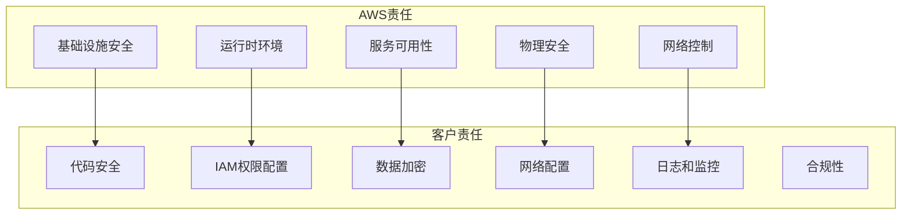

# 第12章：Lambda安全与合规

::: info 章节概述
本章将深入探讨AWS Lambda的安全模型、权限控制、数据加密、安全审计等关键安全主题。我们将学习如何构建安全的serverless应用，遵循安全最佳实践，并满足各种合规要求。
:::

## 学习目标

1. 理解Lambda的安全模型和责任共担模式
2. 掌握IAM权限的精细化控制
3. 学会实施数据加密和密钥管理
4. 了解网络安全和VPC配置
5. 掌握安全审计和合规检查
6. 学会安全事件响应和威胁检测

## 12.1 Lambda安全模型

### 12.1.1 责任共担模式



### 12.1.2 安全检查清单

```python
# security/security_checker.py
import json
import boto3
import re
from typing import Dict, Any, List
from datetime import datetime, timedelta

class LambdaSecurityChecker:
    """Lambda安全检查器"""
    
    def __init__(self, region: str = 'us-east-1'):
        self.region = region
        self.lambda_client = boto3.client('lambda', region_name=region)
        self.iam_client = boto3.client('iam')
        self.kms_client = boto3.client('kms', region_name=region)
        self.cloudtrail_client = boto3.client('cloudtrail', region_name=region)
    
    def comprehensive_security_audit(self, function_name: str) -> Dict[str, Any]:
        """全面安全审计"""
        audit_report = {
            'function_name': function_name,
            'audit_timestamp': datetime.utcnow().isoformat(),
            'security_score': 0,
            'findings': [],
            'recommendations': [],
            'checks_performed': []
        }
        
        try:
            # 获取函数配置
            function_config = self._get_function_config(function_name)
            
            # 执行各项安全检查
            checks = [
                self._check_iam_permissions,
                self._check_environment_variables,
                self._check_vpc_configuration,
                self._check_encryption_settings,
                self._check_function_configuration,
                self._check_code_security,
                self._check_logging_configuration,
                self._check_network_access
            ]
            
            total_score = 0
            max_score = len(checks) * 10
            
            for check in checks:
                check_result = check(function_name, function_config)
                audit_report['findings'].extend(check_result['findings'])
                audit_report['recommendations'].extend(check_result['recommendations'])
                audit_report['checks_performed'].append(check_result['check_name'])
                total_score += check_result['score']
            
            audit_report['security_score'] = int((total_score / max_score) * 100)
            
        except Exception as e:
            audit_report['findings'].append({
                'severity': 'HIGH',
                'category': 'AUDIT_ERROR',
                'message': f"Failed to perform security audit: {str(e)}"
            })
        
        return audit_report
    
    def _get_function_config(self, function_name: str) -> Dict[str, Any]:
        """获取函数配置"""
        response = self.lambda_client.get_function(FunctionName=function_name)
        return response['Configuration']
    
    def _check_iam_permissions(self, function_name: str, config: Dict[str, Any]) -> Dict[str, Any]:
        """检查IAM权限配置"""
        findings = []
        recommendations = []
        score = 10
        
        try:
            role_arn = config.get('Role')
            role_name = role_arn.split('/')[-1] if role_arn else None
            
            if role_name:
                # 获取角色策略
                policies = self._get_role_policies(role_name)
                
                # 检查过度权限
                overprivileged_actions = self._check_overprivileged_actions(policies)
                if overprivileged_actions:
                    findings.append({
                        'severity': 'HIGH',
                        'category': 'IAM_PERMISSIONS',
                        'message': f"Function has overprivileged permissions: {', '.join(overprivileged_actions)}",
                        'details': overprivileged_actions
                    })
                    recommendations.append({
                        'category': 'IAM',
                        'action': 'REDUCE_PERMISSIONS',
                        'description': 'Apply principle of least privilege to IAM role'
                    })
                    score -= 3
                
                # 检查通配符权限
                wildcard_permissions = self._check_wildcard_permissions(policies)
                if wildcard_permissions:
                    findings.append({
                        'severity': 'MEDIUM',
                        'category': 'IAM_PERMISSIONS',
                        'message': f"Function uses wildcard permissions: {len(wildcard_permissions)} found",
                        'details': wildcard_permissions
                    })
                    recommendations.append({
                        'category': 'IAM',
                        'action': 'SPECIFY_RESOURCES',
                        'description': 'Replace wildcard resources with specific ARNs'
                    })
                    score -= 2
                
                # 检查内联策略
                inline_policies = self._check_inline_policies(role_name)
                if inline_policies:
                    findings.append({
                        'severity': 'LOW',
                        'category': 'IAM_PERMISSIONS',
                        'message': f"Function role uses inline policies: {len(inline_policies)} found",
                        'details': inline_policies
                    })
                    recommendations.append({
                        'category': 'IAM',
                        'action': 'USE_MANAGED_POLICIES',
                        'description': 'Consider using managed policies instead of inline policies'
                    })
                    score -= 1
            
        except Exception as e:
            findings.append({
                'severity': 'MEDIUM',
                'category': 'IAM_CHECK_ERROR',
                'message': f"Failed to check IAM permissions: {str(e)}"
            })
            score -= 5
        
        return {
            'check_name': 'IAM Permissions Check',
            'findings': findings,
            'recommendations': recommendations,
            'score': max(0, score)
        }
    
    def _check_environment_variables(self, function_name: str, config: Dict[str, Any]) -> Dict[str, Any]:
        """检查环境变量安全"""
        findings = []
        recommendations = []
        score = 10
        
        env_vars = config.get('Environment', {}).get('Variables', {})
        
        # 检查敏感信息
        sensitive_patterns = [
            (r'(?i)(password|pwd|secret|key|token)', 'Potential password/secret'),
            (r'(?i)(api[_-]?key)', 'API key'),
            (r'(?i)(access[_-]?key)', 'Access key'),
            (r'(?i)(private[_-]?key)', 'Private key'),
            (r'AKIA[0-9A-Z]{16}', 'AWS Access Key ID'),
            (r'[0-9a-zA-Z/+]{40}', 'Potential AWS Secret Key')
        ]
        
        for var_name, var_value in env_vars.items():
            for pattern, description in sensitive_patterns:
                if re.search(pattern, var_name) or re.search(pattern, str(var_value)):
                    findings.append({
                        'severity': 'HIGH',
                        'category': 'ENVIRONMENT_VARIABLES',
                        'message': f"Potential sensitive data in environment variable: {var_name}",
                        'details': {'variable': var_name, 'pattern': description}
                    })
                    recommendations.append({
                        'category': 'SECRETS_MANAGEMENT',
                        'action': 'USE_SECRETS_MANAGER',
                        'description': f'Move {var_name} to AWS Secrets Manager or Parameter Store'
                    })
                    score -= 2
        
        # 检查环境变量加密
        kms_key_arn = config.get('KMSKeyArn')
        if not kms_key_arn and env_vars:
            findings.append({
                'severity': 'MEDIUM',
                'category': 'ENCRYPTION',
                'message': 'Environment variables are not encrypted with customer-managed KMS key'
            })
            recommendations.append({
                'category': 'ENCRYPTION',
                'action': 'ENABLE_ENV_ENCRYPTION',
                'description': 'Enable environment variable encryption with KMS'
            })
            score -= 2
        
        return {
            'check_name': 'Environment Variables Check',
            'findings': findings,
            'recommendations': recommendations,
            'score': max(0, score)
        }
    
    def _check_vpc_configuration(self, function_name: str, config: Dict[str, Any]) -> Dict[str, Any]:
        """检查VPC配置"""
        findings = []
        recommendations = []
        score = 10
        
        vpc_config = config.get('VpcConfig')
        
        if vpc_config:
            # 检查安全组配置
            security_groups = vpc_config.get('SecurityGroupIds', [])
            if not security_groups:
                findings.append({
                    'severity': 'HIGH',
                    'category': 'VPC_SECURITY',
                    'message': 'Function in VPC but no security groups configured'
                })
                score -= 5
            else:
                # 这里可以添加更详细的安全组检查
                # 检查是否有过于宽松的规则
                pass
            
            # 检查子网配置
            subnets = vpc_config.get('SubnetIds', [])
            if len(subnets) < 2:
                findings.append({
                    'severity': 'MEDIUM',
                    'category': 'VPC_AVAILABILITY',
                    'message': 'Function configured with fewer than 2 subnets, may impact availability'
                })
                recommendations.append({
                    'category': 'VPC',
                    'action': 'ADD_SUBNETS',
                    'description': 'Configure function with subnets in multiple AZs'
                })
                score -= 1
        else:
            # 函数不在VPC中，检查是否需要
            findings.append({
                'severity': 'LOW',
                'category': 'VPC_CONFIGURATION',
                'message': 'Function not configured to run in VPC'
            })
            recommendations.append({
                'category': 'VPC',
                'action': 'CONSIDER_VPC',
                'description': 'Consider running function in VPC if it accesses private resources'
            })
        
        return {
            'check_name': 'VPC Configuration Check',
            'findings': findings,
            'recommendations': recommendations,
            'score': max(0, score)
        }
    
    def _check_encryption_settings(self, function_name: str, config: Dict[str, Any]) -> Dict[str, Any]:
        """检查加密设置"""
        findings = []
        recommendations = []
        score = 10
        
        # 检查代码加密
        kms_key_arn = config.get('KMSKeyArn')
        if not kms_key_arn:
            findings.append({
                'severity': 'MEDIUM',
                'category': 'ENCRYPTION',
                'message': 'Function code not encrypted with customer-managed KMS key'
            })
            recommendations.append({
                'category': 'ENCRYPTION',
                'action': 'ENABLE_CODE_ENCRYPTION',
                'description': 'Use customer-managed KMS key for function code encryption'
            })
            score -= 2
        
        # 检查环境变量加密
        env_vars = config.get('Environment', {}).get('Variables', {})
        if env_vars and not kms_key_arn:
            findings.append({
                'severity': 'MEDIUM',
                'category': 'ENCRYPTION',
                'message': 'Environment variables not encrypted with customer-managed KMS key'
            })
            score -= 1
        
        return {
            'check_name': 'Encryption Settings Check',
            'findings': findings,
            'recommendations': recommendations,
            'score': max(0, score)
        }
    
    def _check_function_configuration(self, function_name: str, config: Dict[str, Any]) -> Dict[str, Any]:
        """检查函数配置"""
        findings = []
        recommendations = []
        score = 10
        
        # 检查运行时版本
        runtime = config.get('Runtime', '')
        deprecated_runtimes = [
            'python2.7', 'python3.6', 'nodejs8.10', 'nodejs10.x',
            'dotnetcore2.1', 'go1.x', 'ruby2.5'
        ]
        
        if runtime in deprecated_runtimes:
            findings.append({
                'severity': 'HIGH',
                'category': 'RUNTIME_SECURITY',
                'message': f'Function uses deprecated runtime: {runtime}'
            })
            recommendations.append({
                'category': 'RUNTIME',
                'action': 'UPDATE_RUNTIME',
                'description': 'Update to latest supported runtime version'
            })
            score -= 3
        
        # 检查函数超时
        timeout = config.get('Timeout', 3)
        if timeout > 300:  # 5分钟
            findings.append({
                'severity': 'MEDIUM',
                'category': 'FUNCTION_CONFIG',
                'message': f'Function timeout is very high: {timeout}s'
            })
            recommendations.append({
                'category': 'CONFIGURATION',
                'action': 'OPTIMIZE_TIMEOUT',
                'description': 'Review and optimize function timeout'
            })
            score -= 1
        
        # 检查预留并发
        reserved_concurrency = config.get('ReservedConcurrencyConfig')
        if not reserved_concurrency:
            findings.append({
                'severity': 'LOW',
                'category': 'FUNCTION_CONFIG',
                'message': 'Function does not have reserved concurrency configured'
            })
            recommendations.append({
                'category': 'CONFIGURATION',
                'action': 'SET_CONCURRENCY_LIMITS',
                'description': 'Configure reserved concurrency to prevent resource exhaustion'
            })
        
        return {
            'check_name': 'Function Configuration Check',
            'findings': findings,
            'recommendations': recommendations,
            'score': max(0, score)
        }
    
    def _check_code_security(self, function_name: str, config: Dict[str, Any]) -> Dict[str, Any]:
        """检查代码安全（基础检查）"""
        findings = []
        recommendations = []
        score = 10
        
        # 这里只能做有限的代码安全检查，因为无法直接访问源代码
        # 在实际应用中，应该集成代码扫描工具
        
        # 检查代码包大小
        code_size = config.get('CodeSize', 0)
        if code_size > 50 * 1024 * 1024:  # 50MB
            findings.append({
                'severity': 'MEDIUM',
                'category': 'CODE_SECURITY',
                'message': f'Function code package is large: {code_size / (1024*1024):.1f}MB'
            })
            recommendations.append({
                'category': 'CODE',
                'action': 'OPTIMIZE_PACKAGE_SIZE',
                'description': 'Optimize code package size and remove unnecessary dependencies'
            })
            score -= 1
        
        # 检查Layer使用
        layers = config.get('Layers', [])
        if len(layers) > 5:
            findings.append({
                'severity': 'LOW',
                'category': 'CODE_SECURITY',
                'message': f'Function uses many layers: {len(layers)}'
            })
            recommendations.append({
                'category': 'CODE',
                'action': 'REVIEW_LAYERS',
                'description': 'Review and consolidate Lambda layers'
            })
        
        return {
            'check_name': 'Code Security Check',
            'findings': findings,
            'recommendations': recommendations,
            'score': max(0, score)
        }
    
    def _check_logging_configuration(self, function_name: str, config: Dict[str, Any]) -> Dict[str, Any]:
        """检查日志配置"""
        findings = []
        recommendations = []
        score = 10
        
        try:
            # 检查CloudWatch日志组
            logs_client = boto3.client('logs', region_name=self.region)
            log_group_name = f"/aws/lambda/{function_name}"
            
            try:
                log_group = logs_client.describe_log_groups(
                    logGroupNamePrefix=log_group_name
                )['logGroups']
                
                if log_group:
                    log_group = log_group[0]
                    
                    # 检查日志保留期
                    retention_days = log_group.get('retentionInDays')
                    if not retention_days:
                        findings.append({
                            'severity': 'MEDIUM',
                            'category': 'LOGGING',
                            'message': 'Log group has no retention policy (logs kept indefinitely)'
                        })
                        recommendations.append({
                            'category': 'LOGGING',
                            'action': 'SET_LOG_RETENTION',
                            'description': 'Set appropriate log retention period'
                        })
                        score -= 2
                    elif retention_days > 365:
                        findings.append({
                            'severity': 'LOW',
                            'category': 'LOGGING',
                            'message': f'Log retention period is very long: {retention_days} days'
                        })
                        score -= 1
                    
                    # 检查日志加密
                    kms_key_id = log_group.get('kmsKeyId')
                    if not kms_key_id:
                        findings.append({
                            'severity': 'MEDIUM',
                            'category': 'LOGGING',
                            'message': 'CloudWatch logs not encrypted with KMS'
                        })
                        recommendations.append({
                            'category': 'ENCRYPTION',
                            'action': 'ENCRYPT_LOGS',
                            'description': 'Enable KMS encryption for CloudWatch logs'
                        })
                        score -= 2
                
            except Exception:
                findings.append({
                    'severity': 'LOW',
                    'category': 'LOGGING',
                    'message': 'Could not verify log group configuration'
                })
                score -= 1
        
        except Exception as e:
            findings.append({
                'severity': 'LOW',
                'category': 'LOGGING_CHECK_ERROR',
                'message': f'Failed to check logging configuration: {str(e)}'
            })
            score -= 1
        
        return {
            'check_name': 'Logging Configuration Check',
            'findings': findings,
            'recommendations': recommendations,
            'score': max(0, score)
        }
    
    def _check_network_access(self, function_name: str, config: Dict[str, Any]) -> Dict[str, Any]:
        """检查网络访问配置"""
        findings = []
        recommendations = []
        score = 10
        
        # 检查函数URL配置
        try:
            url_config = self.lambda_client.get_function_url_config(
                FunctionName=function_name
            )
            
            auth_type = url_config.get('AuthType', '')
            if auth_type == 'NONE':
                findings.append({
                    'severity': 'HIGH',
                    'category': 'NETWORK_SECURITY',
                    'message': 'Function URL configured with no authentication'
                })
                recommendations.append({
                    'category': 'AUTHENTICATION',
                    'action': 'ENABLE_AUTH',
                    'description': 'Enable authentication for function URL'
                })
                score -= 5
            
            # 检查CORS配置
            cors = url_config.get('Cors', {})
            allow_origins = cors.get('AllowOrigins', [])
            if '*' in allow_origins:
                findings.append({
                    'severity': 'MEDIUM',
                    'category': 'NETWORK_SECURITY',
                    'message': 'Function URL allows all origins (*)'
                })
                recommendations.append({
                    'category': 'CORS',
                    'action': 'RESTRICT_ORIGINS',
                    'description': 'Restrict CORS origins to specific domains'
                })
                score -= 2
        
        except self.lambda_client.exceptions.ResourceNotFoundException:
            # 函数没有配置URL，这是好的
            pass
        except Exception as e:
            findings.append({
                'severity': 'LOW',
                'category': 'NETWORK_CHECK_ERROR',
                'message': f'Failed to check function URL configuration: {str(e)}'
            })
        
        return {
            'check_name': 'Network Access Check',
            'findings': findings,
            'recommendations': recommendations,
            'score': max(0, score)
        }
    
    def _get_role_policies(self, role_name: str) -> List[Dict[str, Any]]:
        """获取角色策略"""
        policies = []
        
        try:
            # 获取附加的托管策略
            attached_policies = self.iam_client.list_attached_role_policies(
                RoleName=role_name
            )['AttachedPolicies']
            
            for policy in attached_policies:
                policy_doc = self.iam_client.get_policy_version(
                    PolicyArn=policy['PolicyArn'],
                    VersionId=self.iam_client.get_policy(
                        PolicyArn=policy['PolicyArn']
                    )['Policy']['DefaultVersionId']
                )
                
                policies.append({
                    'type': 'managed',
                    'name': policy['PolicyName'],
                    'arn': policy['PolicyArn'],
                    'document': policy_doc['PolicyVersion']['Document']
                })
            
            # 获取内联策略
            inline_policies = self.iam_client.list_role_policies(
                RoleName=role_name
            )['PolicyNames']
            
            for policy_name in inline_policies:
                policy_doc = self.iam_client.get_role_policy(
                    RoleName=role_name,
                    PolicyName=policy_name
                )
                
                policies.append({
                    'type': 'inline',
                    'name': policy_name,
                    'document': policy_doc['PolicyDocument']
                })
        
        except Exception as e:
            print(f"Error getting role policies: {str(e)}")
        
        return policies
    
    def _check_overprivileged_actions(self, policies: List[Dict[str, Any]]) -> List[str]:
        """检查过度权限的操作"""
        dangerous_actions = [
            '*',
            'iam:*',
            'sts:AssumeRole',
            'lambda:InvokeFunction',
            's3:*',
            'dynamodb:*',
            'rds:*',
            'ec2:*'
        ]
        
        found_actions = []
        
        for policy in policies:
            statements = policy['document'].get('Statement', [])
            if not isinstance(statements, list):
                statements = [statements]
            
            for statement in statements:
                if statement.get('Effect') == 'Allow':
                    actions = statement.get('Action', [])
                    if isinstance(actions, str):
                        actions = [actions]
                    
                    for action in actions:
                        if action in dangerous_actions:
                            found_actions.append(action)
        
        return list(set(found_actions))
    
    def _check_wildcard_permissions(self, policies: List[Dict[str, Any]]) -> List[str]:
        """检查通配符权限"""
        wildcard_resources = []
        
        for policy in policies:
            statements = policy['document'].get('Statement', [])
            if not isinstance(statements, list):
                statements = [statements]
            
            for statement in statements:
                if statement.get('Effect') == 'Allow':
                    resources = statement.get('Resource', [])
                    if isinstance(resources, str):
                        resources = [resources]
                    
                    for resource in resources:
                        if resource == '*':
                            wildcard_resources.append(f"Policy: {policy['name']}")
        
        return wildcard_resources
    
    def _check_inline_policies(self, role_name: str) -> List[str]:
        """检查内联策略"""
        try:
            inline_policies = self.iam_client.list_role_policies(
                RoleName=role_name
            )['PolicyNames']
            return inline_policies
        except Exception:
            return []
    
    def generate_security_report(self, audit_report: Dict[str, Any]) -> str:
        """生成安全报告"""
        report = f"""
AWS LAMBDA SECURITY AUDIT REPORT
================================

Function: {audit_report['function_name']}
Audit Date: {audit_report['audit_timestamp']}
Security Score: {audit_report['security_score']}/100

"""
        
        # 高危问题
        high_severity = [f for f in audit_report['findings'] if f['severity'] == 'HIGH']
        if high_severity:
            report += f"🔴 HIGH SEVERITY ISSUES ({len(high_severity)}):\n"
            for finding in high_severity:
                report += f"  • {finding['category']}: {finding['message']}\n"
            report += "\n"
        
        # 中危问题
        medium_severity = [f for f in audit_report['findings'] if f['severity'] == 'MEDIUM']
        if medium_severity:
            report += f"🟡 MEDIUM SEVERITY ISSUES ({len(medium_severity)}):\n"
            for finding in medium_severity:
                report += f"  • {finding['category']}: {finding['message']}\n"
            report += "\n"
        
        # 建议
        if audit_report['recommendations']:
            report += "💡 RECOMMENDATIONS:\n"
            for rec in audit_report['recommendations'][:10]:  # 显示前10个建议
                report += f"  • {rec['action']}: {rec['description']}\n"
            report += "\n"
        
        # 检查摘要
        report += f"CHECKS PERFORMED:\n"
        for check in audit_report['checks_performed']:
            report += f"  ✓ {check}\n"
        
        return report

def main():
    """主安全检查函数"""
    function_name = input("Enter Lambda function name for security audit: ").strip()
    
    checker = LambdaSecurityChecker()
    audit_report = checker.comprehensive_security_audit(function_name)
    
    # 打印报告
    report_text = checker.generate_security_report(audit_report)
    print(report_text)
    
    # 保存详细报告
    with open(f"{function_name}_security_audit.json", 'w') as f:
        json.dump(audit_report, f, indent=2, default=str)
    
    print(f"\nDetailed security audit saved to {function_name}_security_audit.json")

if __name__ == "__main__":
    main()
```

## 12.2 数据加密和密钥管理

### 12.2.1 端到端加密实现

```python
# security/encryption_manager.py
import json
import boto3
import base64
import os
from typing import Dict, Any, Optional
from cryptography.fernet import Fernet
from cryptography.hazmat.primitives import hashes
from cryptography.hazmat.primitives.kdf.pbkdf2 import PBKDF2HMAC
import logging

logger = logging.getLogger()
logger.setLevel(logging.INFO)

class LambdaEncryptionManager:
    """Lambda加密管理器"""
    
    def __init__(self, kms_key_id: str = None, region: str = 'us-east-1'):
        self.kms_key_id = kms_key_id
        self.region = region
        self.kms_client = boto3.client('kms', region_name=region)
        self.secrets_client = boto3.client('secretsmanager', region_name=region)
        self.ssm_client = boto3.client('ssm', region_name=region)
    
    def encrypt_data(self, plaintext: str, context: Dict[str, str] = None) -> Dict[str, Any]:
        """使用KMS加密数据"""
        try:
            encrypt_kwargs = {
                'KeyId': self.kms_key_id or 'alias/aws/lambda',
                'Plaintext': plaintext.encode('utf-8')
            }
            
            if context:
                encrypt_kwargs['EncryptionContext'] = context
            
            response = self.kms_client.encrypt(**encrypt_kwargs)
            
            return {
                'ciphertext': base64.b64encode(response['CiphertextBlob']).decode('utf-8'),
                'key_id': response['KeyId'],
                'encryption_context': context or {}
            }
            
        except Exception as e:
            logger.error(f"Encryption failed: {str(e)}")
            raise
    
    def decrypt_data(self, ciphertext: str, context: Dict[str, str] = None) -> str:
        """使用KMS解密数据"""
        try:
            decrypt_kwargs = {
                'CiphertextBlob': base64.b64decode(ciphertext.encode('utf-8'))
            }
            
            if context:
                decrypt_kwargs['EncryptionContext'] = context
            
            response = self.kms_client.decrypt(**decrypt_kwargs)
            
            return response['Plaintext'].decode('utf-8')
            
        except Exception as e:
            logger.error(f"Decryption failed: {str(e)}")
            raise
    
    def create_data_key(self, key_spec: str = 'AES_256') -> Dict[str, Any]:
        """创建数据密钥"""
        try:
            response = self.kms_client.generate_data_key(
                KeyId=self.kms_key_id or 'alias/aws/lambda',
                KeySpec=key_spec
            )
            
            return {
                'plaintext_key': response['Plaintext'],
                'encrypted_key': base64.b64encode(response['CiphertextBlob']).decode('utf-8')
            }
            
        except Exception as e:
            logger.error(f"Data key creation failed: {str(e)}")
            raise
    
    def envelope_encrypt(self, data: Dict[str, Any]) -> Dict[str, Any]:
        """信封加密大型数据"""
        try:
            # 创建数据密钥
            data_key_response = self.create_data_key()
            plaintext_key = data_key_response['plaintext_key']
            encrypted_key = data_key_response['encrypted_key']
            
            # 使用数据密钥加密数据
            fernet = Fernet(base64.urlsafe_b64encode(plaintext_key[:32]))
            encrypted_data = fernet.encrypt(json.dumps(data).encode('utf-8'))
            
            return {
                'encrypted_data': base64.b64encode(encrypted_data).decode('utf-8'),
                'encrypted_data_key': encrypted_key
            }
            
        except Exception as e:
            logger.error(f"Envelope encryption failed: {str(e)}")
            raise
    
    def envelope_decrypt(self, encrypted_data: str, encrypted_data_key: str) -> Dict[str, Any]:
        """信封解密大型数据"""
        try:
            # 解密数据密钥
            data_key_response = self.kms_client.decrypt(
                CiphertextBlob=base64.b64decode(encrypted_data_key.encode('utf-8'))
            )
            plaintext_key = data_key_response['Plaintext']
            
            # 使用数据密钥解密数据
            fernet = Fernet(base64.urlsafe_b64encode(plaintext_key[:32]))
            decrypted_data = fernet.decrypt(base64.b64decode(encrypted_data.encode('utf-8')))
            
            return json.loads(decrypted_data.decode('utf-8'))
            
        except Exception as e:
            logger.error(f"Envelope decryption failed: {str(e)}")
            raise
    
    def store_encrypted_secret(self, secret_name: str, secret_value: str,
                             description: str = None) -> str:
        """存储加密的密钥到Secrets Manager"""
        try:
            create_kwargs = {
                'Name': secret_name,
                'SecretString': secret_value
            }
            
            if self.kms_key_id:
                create_kwargs['KmsKeyId'] = self.kms_key_id
            
            if description:
                create_kwargs['Description'] = description
            
            response = self.secrets_client.create_secret(**create_kwargs)
            
            return response['ARN']
            
        except self.secrets_client.exceptions.ResourceExistsException:
            # 如果密钥已存在，更新它
            response = self.secrets_client.update_secret(
                SecretId=secret_name,
                SecretString=secret_value,
                KmsKeyId=self.kms_key_id
            )
            return response['ARN']
        
        except Exception as e:
            logger.error(f"Failed to store secret: {str(e)}")
            raise
    
    def retrieve_secret(self, secret_name: str) -> str:
        """从Secrets Manager检索密钥"""
        try:
            response = self.secrets_client.get_secret_value(SecretId=secret_name)
            return response['SecretString']
            
        except Exception as e:
            logger.error(f"Failed to retrieve secret: {str(e)}")
            raise
    
    def store_encrypted_parameter(self, parameter_name: str, parameter_value: str,
                                 description: str = None, parameter_type: str = 'SecureString') -> str:
        """存储加密参数到Parameter Store"""
        try:
            put_kwargs = {
                'Name': parameter_name,
                'Value': parameter_value,
                'Type': parameter_type,
                'Overwrite': True
            }
            
            if self.kms_key_id and parameter_type == 'SecureString':
                put_kwargs['KeyId'] = self.kms_key_id
            
            if description:
                put_kwargs['Description'] = description
            
            response = self.ssm_client.put_parameter(**put_kwargs)
            
            return parameter_name
            
        except Exception as e:
            logger.error(f"Failed to store parameter: {str(e)}")
            raise
    
    def retrieve_parameter(self, parameter_name: str, decrypt: bool = True) -> str:
        """从Parameter Store检索参数"""
        try:
            response = self.ssm_client.get_parameter(
                Name=parameter_name,
                WithDecryption=decrypt
            )
            return response['Parameter']['Value']
            
        except Exception as e:
            logger.error(f"Failed to retrieve parameter: {str(e)}")
            raise

class SecureDataProcessor:
    """安全数据处理器"""
    
    def __init__(self, encryption_manager: LambdaEncryptionManager):
        self.encryption_manager = encryption_manager
    
    def process_sensitive_data(self, data: Dict[str, Any]) -> Dict[str, Any]:
        """处理敏感数据"""
        try:
            # 识别敏感字段
            sensitive_fields = self._identify_sensitive_fields(data)
            
            # 创建处理结果
            processed_data = data.copy()
            encrypted_fields = {}
            
            # 加密敏感字段
            for field in sensitive_fields:
                if field in processed_data:
                    field_value = str(processed_data[field])
                    
                    # 使用字段名作为加密上下文
                    context = {
                        'field_name': field,
                        'data_type': 'sensitive'
                    }
                    
                    encrypted_value = self.encryption_manager.encrypt_data(
                        field_value, context
                    )
                    
                    # 替换原始值
                    processed_data[field] = f"ENCRYPTED:{encrypted_value['ciphertext']}"
                    encrypted_fields[field] = encrypted_value
            
            return {
                'processed_data': processed_data,
                'encrypted_fields': encrypted_fields,
                'encryption_metadata': {
                    'encrypted_field_count': len(encrypted_fields),
                    'encryption_timestamp': datetime.utcnow().isoformat()
                }
            }
            
        except Exception as e:
            logger.error(f"Sensitive data processing failed: {str(e)}")
            raise
    
    def restore_sensitive_data(self, processed_data: Dict[str, Any],
                             encrypted_fields: Dict[str, Any]) -> Dict[str, Any]:
        """恢复敏感数据"""
        try:
            restored_data = processed_data.copy()
            
            for field, encryption_info in encrypted_fields.items():
                if field in restored_data:
                    ciphertext = encryption_info['ciphertext']
                    context = encryption_info['encryption_context']
                    
                    # 解密字段值
                    decrypted_value = self.encryption_manager.decrypt_data(
                        ciphertext, context
                    )
                    
                    # 恢复原始值
                    restored_data[field] = decrypted_value
            
            return restored_data
            
        except Exception as e:
            logger.error(f"Data restoration failed: {str(e)}")
            raise
    
    def _identify_sensitive_fields(self, data: Dict[str, Any]) -> List[str]:
        """识别敏感字段"""
        sensitive_patterns = [
            'password', 'pwd', 'secret', 'key', 'token',
            'ssn', 'social_security', 'credit_card', 'cc_number',
            'phone', 'email', 'address', 'birth_date'
        ]
        
        sensitive_fields = []
        
        for field_name in data.keys():
            field_lower = field_name.lower()
            for pattern in sensitive_patterns:
                if pattern in field_lower:
                    sensitive_fields.append(field_name)
                    break
        
        return sensitive_fields

def handler(event: Dict[str, Any], context) -> Dict[str, Any]:
    """安全数据处理Lambda处理器"""
    
    logger.info(f"Processing secure data operation: {event.get('action', 'unknown')}")
    
    try:
        # 初始化加密管理器
        kms_key_id = os.environ.get('KMS_KEY_ID')
        encryption_manager = LambdaEncryptionManager(kms_key_id)
        secure_processor = SecureDataProcessor(encryption_manager)
        
        action = event.get('action', 'process')
        
        if action == 'encrypt_data':
            # 加密数据
            plaintext = event.get('data', '')
            context = event.get('context', {})
            
            result = encryption_manager.encrypt_data(plaintext, context)
            
            return {
                'statusCode': 200,
                'body': json.dumps({
                    'success': True,
                    'result': result
                })
            }
        
        elif action == 'decrypt_data':
            # 解密数据
            ciphertext = event.get('ciphertext', '')
            context = event.get('context', {})
            
            result = encryption_manager.decrypt_data(ciphertext, context)
            
            return {
                'statusCode': 200,
                'body': json.dumps({
                    'success': True,
                    'result': result
                })
            }
        
        elif action == 'process_sensitive':
            # 处理敏感数据
            data = event.get('data', {})
            
            result = secure_processor.process_sensitive_data(data)
            
            return {
                'statusCode': 200,
                'body': json.dumps({
                    'success': True,
                    'result': result
                }, default=str)
            }
        
        elif action == 'envelope_encrypt':
            # 信封加密
            data = event.get('data', {})
            
            result = encryption_manager.envelope_encrypt(data)
            
            return {
                'statusCode': 200,
                'body': json.dumps({
                    'success': True,
                    'result': result
                })
            }
        
        elif action == 'envelope_decrypt':
            # 信封解密
            encrypted_data = event.get('encrypted_data', '')
            encrypted_data_key = event.get('encrypted_data_key', '')
            
            result = encryption_manager.envelope_decrypt(encrypted_data, encrypted_data_key)
            
            return {
                'statusCode': 200,
                'body': json.dumps({
                    'success': True,
                    'result': result
                }, default=str)
            }
        
        elif action == 'store_secret':
            # 存储密钥
            secret_name = event.get('secret_name', '')
            secret_value = event.get('secret_value', '')
            description = event.get('description')
            
            result = encryption_manager.store_encrypted_secret(
                secret_name, secret_value, description
            )
            
            return {
                'statusCode': 200,
                'body': json.dumps({
                    'success': True,
                    'secret_arn': result
                })
            }
        
        elif action == 'retrieve_secret':
            # 检索密钥
            secret_name = event.get('secret_name', '')
            
            result = encryption_manager.retrieve_secret(secret_name)
            
            return {
                'statusCode': 200,
                'body': json.dumps({
                    'success': True,
                    'secret_value': result
                })
            }
        
        else:
            return {
                'statusCode': 400,
                'body': json.dumps({
                    'success': False,
                    'error': f'Unknown action: {action}'
                })
            }
    
    except Exception as e:
        logger.error(f"Error processing request: {str(e)}")
        return {
            'statusCode': 500,
            'body': json.dumps({
                'success': False,
                'error': str(e)
            })
        }
```

## 12.3 网络安全

### 12.3.1 VPC安全配置

```python
# stacks/secure_vpc_stack.py
from aws_cdk import (
    Stack,
    aws_ec2 as ec2,
    aws_lambda as _lambda,
    aws_logs as logs,
    Duration,
    RemovalPolicy
)
from constructs import Construct

class SecureVpcStack(Stack):
    def __init__(self, scope: Construct, construct_id: str, **kwargs) -> None:
        super().__init__(scope, construct_id, **kwargs)
        
        # 创建安全的VPC
        self._create_secure_vpc()
        
        # 创建安全组
        self._create_security_groups()
        
        # 创建网络ACL
        self._create_network_acls()
        
        # 创建VPC Flow Logs
        self._create_vpc_flow_logs()
        
        # 创建NAT网关
        self._create_nat_gateways()
        
        # 创建VPC端点
        self._create_vpc_endpoints()
    
    def _create_secure_vpc(self):
        """创建安全VPC"""
        self.vpc = ec2.Vpc(
            self, "SecureVpc",
            max_azs=2,
            cidr="10.0.0.0/16",
            subnet_configuration=[
                # 公共子网（仅用于NAT网关）
                ec2.SubnetConfiguration(
                    name="Public",
                    subnet_type=ec2.SubnetType.PUBLIC,
                    cidr_mask=24
                ),
                # 私有子网（Lambda函数）
                ec2.SubnetConfiguration(
                    name="Private",
                    subnet_type=ec2.SubnetType.PRIVATE_WITH_EGRESS,
                    cidr_mask=24
                ),
                # 隔离子网（数据库等）
                ec2.SubnetConfiguration(
                    name="Isolated",
                    subnet_type=ec2.SubnetType.PRIVATE_ISOLATED,
                    cidr_mask=24
                )
            ],
            enable_dns_hostnames=True,
            enable_dns_support=True
        )
    
    def _create_security_groups(self):
        """创建安全组"""
        
        # Lambda函数安全组
        self.lambda_sg = ec2.SecurityGroup(
            self, "LambdaSecurityGroup",
            vpc=self.vpc,
            description="Security group for Lambda functions",
            allow_all_outbound=False  # 明确控制出站流量
        )
        
        # 允许HTTPS出站流量
        self.lambda_sg.add_egress_rule(
            peer=ec2.Peer.any_ipv4(),
            connection=ec2.Port.tcp(443),
            description="HTTPS outbound for API calls"
        )
        
        # 允许HTTP出站流量（仅在必要时）
        self.lambda_sg.add_egress_rule(
            peer=ec2.Peer.any_ipv4(),
            connection=ec2.Port.tcp(80),
            description="HTTP outbound for specific services"
        )
        
        # 数据库安全组
        self.database_sg = ec2.SecurityGroup(
            self, "DatabaseSecurityGroup",
            vpc=self.vpc,
            description="Security group for databases",
            allow_all_outbound=False
        )
        
        # 只允许Lambda安全组访问数据库
        self.database_sg.add_ingress_rule(
            peer=self.lambda_sg,
            connection=ec2.Port.tcp(5432),  # PostgreSQL
            description="Allow Lambda access to PostgreSQL"
        )
        
        self.database_sg.add_ingress_rule(
            peer=self.lambda_sg,
            connection=ec2.Port.tcp(3306),  # MySQL
            description="Allow Lambda access to MySQL"
        )
        
        # 缓存安全组
        self.cache_sg = ec2.SecurityGroup(
            self, "CacheSecurityGroup",
            vpc=self.vpc,
            description="Security group for cache services",
            allow_all_outbound=False
        )
        
        # 允许Lambda访问Redis
        self.cache_sg.add_ingress_rule(
            peer=self.lambda_sg,
            connection=ec2.Port.tcp(6379),
            description="Allow Lambda access to Redis"
        )
    
    def _create_network_acls(self):
        """创建网络ACL"""
        
        # 私有子网ACL
        self.private_nacl = ec2.NetworkAcl(
            self, "PrivateNetworkAcl",
            vpc=self.vpc,
            subnet_selection=ec2.SubnetSelection(
                subnet_type=ec2.SubnetType.PRIVATE_WITH_EGRESS
            )
        )
        
        # 入站规则
        self.private_nacl.add_entry(
            "AllowInboundHTTPS",
            rule_number=100,
            cidr=ec2.AclCidr.any_ipv4(),
            traffic=ec2.AclTraffic.tcp_port(443),
            direction=ec2.TrafficDirection.INGRESS,
            rule_action=ec2.Action.ALLOW
        )
        
        self.private_nacl.add_entry(
            "AllowInboundEphemeral",
            rule_number=110,
            cidr=ec2.AclCidr.any_ipv4(),
            traffic=ec2.AclTraffic.tcp_port_range(1024, 65535),
            direction=ec2.TrafficDirection.INGRESS,
            rule_action=ec2.Action.ALLOW
        )
        
        # 出站规则
        self.private_nacl.add_entry(
            "AllowOutboundHTTPS",
            rule_number=100,
            cidr=ec2.AclCidr.any_ipv4(),
            traffic=ec2.AclTraffic.tcp_port(443),
            direction=ec2.TrafficDirection.EGRESS,
            rule_action=ec2.Action.ALLOW
        )
        
        self.private_nacl.add_entry(
            "AllowOutboundEphemeral",
            rule_number=110,
            cidr=ec2.AclCidr.any_ipv4(),
            traffic=ec2.AclTraffic.tcp_port_range(1024, 65535),
            direction=ec2.TrafficDirection.EGRESS,
            rule_action=ec2.Action.ALLOW
        )
        
        # 隔离子网ACL（更严格）
        self.isolated_nacl = ec2.NetworkAcl(
            self, "IsolatedNetworkAcl",
            vpc=self.vpc,
            subnet_selection=ec2.SubnetSelection(
                subnet_type=ec2.SubnetType.PRIVATE_ISOLATED
            )
        )
        
        # 只允许VPC内部流量
        self.isolated_nacl.add_entry(
            "AllowInboundVPC",
            rule_number=100,
            cidr=ec2.AclCidr.ipv4("10.0.0.0/16"),
            traffic=ec2.AclTraffic.all_traffic(),
            direction=ec2.TrafficDirection.INGRESS,
            rule_action=ec2.Action.ALLOW
        )
        
        self.isolated_nacl.add_entry(
            "AllowOutboundVPC",
            rule_number=100,
            cidr=ec2.AclCidr.ipv4("10.0.0.0/16"),
            traffic=ec2.AclTraffic.all_traffic(),
            direction=ec2.TrafficDirection.EGRESS,
            rule_action=ec2.Action.ALLOW
        )
    
    def _create_vpc_flow_logs(self):
        """创建VPC流量日志"""
        
        # 创建CloudWatch日志组
        self.flow_log_group = logs.LogGroup(
            self, "VpcFlowLogGroup",
            log_group_name="/aws/vpc/flowlogs",
            retention=logs.RetentionDays.ONE_MONTH,
            removal_policy=RemovalPolicy.DESTROY
        )
        
        # 创建流量日志
        self.vpc.add_flow_log(
            "VpcFlowLog",
            destination=ec2.FlowLogDestination.to_cloud_watch_logs(
                self.flow_log_group
            ),
            traffic_type=ec2.FlowLogTrafficType.ALL
        )
    
    def _create_nat_gateways(self):
        """创建NAT网关（已由CDK自动创建）"""
        # NAT网关由CDK在PRIVATE_WITH_EGRESS子网配置中自动创建
        pass
    
    def _create_vpc_endpoints(self):
        """创建VPC端点"""
        
        # S3网关端点
        self.vpc.add_gateway_endpoint(
            "S3Endpoint",
            service=ec2.GatewayVpcEndpointAwsService.S3,
            subnets=[
                ec2.SubnetSelection(subnet_type=ec2.SubnetType.PRIVATE_WITH_EGRESS),
                ec2.SubnetSelection(subnet_type=ec2.SubnetType.PRIVATE_ISOLATED)
            ]
        )
        
        # DynamoDB网关端点
        self.vpc.add_gateway_endpoint(
            "DynamoDbEndpoint",
            service=ec2.GatewayVpcEndpointAwsService.DYNAMODB,
            subnets=[
                ec2.SubnetSelection(subnet_type=ec2.SubnetType.PRIVATE_WITH_EGRESS),
                ec2.SubnetSelection(subnet_type=ec2.SubnetType.PRIVATE_ISOLATED)
            ]
        )
        
        # Lambda接口端点
        self.vpc.add_interface_endpoint(
            "LambdaEndpoint",
            service=ec2.InterfaceVpcEndpointAwsService.LAMBDA_,
            subnets=ec2.SubnetSelection(
                subnet_type=ec2.SubnetType.PRIVATE_WITH_EGRESS
            ),
            security_groups=[self.lambda_sg]
        )
        
        # Secrets Manager接口端点
        self.vpc.add_interface_endpoint(
            "SecretsManagerEndpoint",
            service=ec2.InterfaceVpcEndpointAwsService.SECRETS_MANAGER,
            subnets=ec2.SubnetSelection(
                subnet_type=ec2.SubnetType.PRIVATE_WITH_EGRESS
            ),
            security_groups=[self.lambda_sg]
        )
        
        # KMS接口端点
        self.vpc.add_interface_endpoint(
            "KmsEndpoint",
            service=ec2.InterfaceVpcEndpointAwsService.KMS,
            subnets=ec2.SubnetSelection(
                subnet_type=ec2.SubnetType.PRIVATE_WITH_EGRESS
            ),
            security_groups=[self.lambda_sg]
        )

class SecureLambdaStack(Stack):
    def __init__(self, scope: Construct, construct_id: str, 
                 vpc_stack: SecureVpcStack, **kwargs) -> None:
        super().__init__(scope, construct_id, **kwargs)
        
        self.vpc_stack = vpc_stack
        
        # 创建安全的Lambda函数
        self._create_secure_lambda_function()
    
    def _create_secure_lambda_function(self):
        """创建安全的Lambda函数"""
        
        self.secure_function = _lambda.Function(
            self, "SecureFunction",
            runtime=_lambda.Runtime.PYTHON_3_9,
            handler="index.handler",
            code=_lambda.Code.from_asset("lambda_functions/secure_function"),
            vpc=self.vpc_stack.vpc,
            vpc_subnets=ec2.SubnetSelection(
                subnet_type=ec2.SubnetType.PRIVATE_WITH_EGRESS
            ),
            security_groups=[self.vpc_stack.lambda_sg],
            timeout=Duration.minutes(5),
            memory_size=512,
            environment={
                'VPC_ENABLED': 'true',
                'ENVIRONMENT': 'production'
            },
            # 启用X-Ray跟踪
            tracing=_lambda.Tracing.ACTIVE,
            # 设置预留并发
            reserved_concurrent_executions=10
        )
```

## 12.4 安全审计和合规

### 12.4.1 合规检查框架

```python
# security/compliance_checker.py
import json
import boto3
from typing import Dict, Any, List
from datetime import datetime, timedelta
import re

class ComplianceChecker:
    """合规检查器"""
    
    def __init__(self, region: str = 'us-east-1'):
        self.region = region
        self.lambda_client = boto3.client('lambda', region_name=region)
        self.iam_client = boto3.client('iam')
        self.cloudtrail_client = boto3.client('cloudtrail', region_name=region)
        self.config_client = boto3.client('config', region_name=region)
        
        # 合规框架定义
        self.compliance_frameworks = {
            'SOC2': self._soc2_checks,
            'GDPR': self._gdpr_checks,
            'HIPAA': self._hipaa_checks,
            'PCI_DSS': self._pci_dss_checks,
            'ISO27001': self._iso27001_checks
        }
    
    def comprehensive_compliance_check(self, function_name: str,
                                     frameworks: List[str] = None) -> Dict[str, Any]:
        """全面合规检查"""
        if frameworks is None:
            frameworks = list(self.compliance_frameworks.keys())
        
        compliance_report = {
            'function_name': function_name,
            'check_timestamp': datetime.utcnow().isoformat(),
            'frameworks_checked': frameworks,
            'compliance_status': {},
            'recommendations': [],
            'audit_trail': []
        }
        
        # 获取函数配置
        function_config = self._get_function_config(function_name)
        
        # 执行每个框架的检查
        for framework in frameworks:
            if framework in self.compliance_frameworks:
                check_func = self.compliance_frameworks[framework]
                framework_result = check_func(function_name, function_config)
                compliance_report['compliance_status'][framework] = framework_result
        
        # 生成综合建议
        compliance_report['recommendations'] = self._generate_compliance_recommendations(
            compliance_report['compliance_status']
        )
        
        # 获取审计线索
        compliance_report['audit_trail'] = self._get_audit_trail(function_name)
        
        return compliance_report
    
    def _get_function_config(self, function_name: str) -> Dict[str, Any]:
        """获取函数配置"""
        response = self.lambda_client.get_function(FunctionName=function_name)
        return response['Configuration']
    
    def _soc2_checks(self, function_name: str, config: Dict[str, Any]) -> Dict[str, Any]:
        """SOC 2合规检查"""
        findings = []
        recommendations = []
        score = 0
        total_checks = 8
        
        # Trust Services Criteria检查
        
        # Security - 安全性
        if config.get('VpcConfig'):
            score += 1
            findings.append({
                'criterion': 'Security',
                'check': 'VPC Configuration',
                'status': 'PASS',
                'message': 'Function is configured to run in VPC'
            })
        else:
            findings.append({
                'criterion': 'Security',
                'check': 'VPC Configuration',
                'status': 'FAIL',
                'message': 'Function is not configured to run in VPC'
            })
            recommendations.append('Configure function to run in VPC for network isolation')
        
        # Availability - 可用性
        reserved_concurrency = config.get('ReservedConcurrencyConfig')
        if reserved_concurrency:
            score += 1
            findings.append({
                'criterion': 'Availability',
                'check': 'Concurrency Limits',
                'status': 'PASS',
                'message': 'Reserved concurrency configured'
            })
        else:
            findings.append({
                'criterion': 'Availability',
                'check': 'Concurrency Limits',
                'status': 'FAIL',
                'message': 'No reserved concurrency configured'
            })
            recommendations.append('Configure reserved concurrency to ensure availability')
        
        # Processing Integrity - 处理完整性
        if config.get('TracingConfig', {}).get('Mode') == 'Active':
            score += 1
            findings.append({
                'criterion': 'Processing Integrity',
                'check': 'Tracing Configuration',
                'status': 'PASS',
                'message': 'X-Ray tracing is enabled'
            })
        else:
            findings.append({
                'criterion': 'Processing Integrity',
                'check': 'Tracing Configuration',
                'status': 'FAIL',
                'message': 'X-Ray tracing is not enabled'
            })
            recommendations.append('Enable X-Ray tracing for processing integrity')
        
        # Confidentiality - 机密性
        if config.get('KMSKeyArn'):
            score += 1
            findings.append({
                'criterion': 'Confidentiality',
                'check': 'Encryption at Rest',
                'status': 'PASS',
                'message': 'Function uses customer-managed KMS key'
            })
        else:
            findings.append({
                'criterion': 'Confidentiality',
                'check': 'Encryption at Rest',
                'status': 'FAIL',
                'message': 'Function does not use customer-managed KMS key'
            })
            recommendations.append('Configure customer-managed KMS key for encryption')
        
        # 更多SOC 2检查...
        
        compliance_percentage = (score / total_checks) * 100
        
        return {
            'framework': 'SOC2',
            'compliance_percentage': compliance_percentage,
            'findings': findings,
            'recommendations': recommendations,
            'status': 'COMPLIANT' if compliance_percentage >= 80 else 'NON_COMPLIANT'
        }
    
    def _gdpr_checks(self, function_name: str, config: Dict[str, Any]) -> Dict[str, Any]:
        """GDPR合规检查"""
        findings = []
        recommendations = []
        score = 0
        total_checks = 6
        
        # 数据保护原则检查
        
        # 数据加密
        if config.get('KMSKeyArn'):
            score += 1
            findings.append({
                'article': 'Article 32',
                'check': 'Data Encryption',
                'status': 'PASS',
                'message': 'Personal data is encrypted at rest'
            })
        else:
            findings.append({
                'article': 'Article 32',
                'check': 'Data Encryption',
                'status': 'FAIL',
                'message': 'Personal data may not be properly encrypted'
            })
            recommendations.append('Implement encryption for personal data protection')
        
        # 数据处理记录
        try:
            # 检查CloudTrail日志
            trail_response = self.cloudtrail_client.describe_trails()
            trails = trail_response.get('trailList', [])
            
            if trails:
                score += 1
                findings.append({
                    'article': 'Article 30',
                    'check': 'Records of Processing',
                    'status': 'PASS',
                    'message': 'CloudTrail logging is configured'
                })
            else:
                findings.append({
                    'article': 'Article 30',
                    'check': 'Records of Processing',
                    'status': 'FAIL',
                    'message': 'No CloudTrail logging detected'
                })
                recommendations.append('Enable CloudTrail for processing activity records')
        except Exception:
            findings.append({
                'article': 'Article 30',
                'check': 'Records of Processing',
                'status': 'UNKNOWN',
                'message': 'Could not verify CloudTrail configuration'
            })
        
        # 数据最小化
        timeout = config.get('Timeout', 3)
        if timeout <= 300:  # 5分钟或更少
            score += 1
            findings.append({
                'article': 'Article 5',
                'check': 'Data Minimization',
                'status': 'PASS',
                'message': 'Function timeout supports data minimization principle'
            })
        else:
            findings.append({
                'article': 'Article 5',
                'check': 'Data Minimization',
                'status': 'FAIL',
                'message': 'Long timeout may indicate excessive data processing'
            })
            recommendations.append('Review function timeout to ensure data minimization')
        
        # 更多GDPR检查...
        
        compliance_percentage = (score / total_checks) * 100
        
        return {
            'framework': 'GDPR',
            'compliance_percentage': compliance_percentage,
            'findings': findings,
            'recommendations': recommendations,
            'status': 'COMPLIANT' if compliance_percentage >= 80 else 'NON_COMPLIANT'
        }
    
    def _hipaa_checks(self, function_name: str, config: Dict[str, Any]) -> Dict[str, Any]:
        """HIPAA合规检查"""
        findings = []
        recommendations = []
        score = 0
        total_checks = 5
        
        # HIPAA Safeguards检查
        
        # Administrative Safeguards
        role_arn = config.get('Role', '')
        if role_arn:
            # 检查角色是否有适当的权限限制
            score += 1
            findings.append({
                'safeguard': 'Administrative',
                'check': 'Access Control',
                'status': 'PASS',
                'message': 'Function has dedicated IAM role'
            })
        
        # Physical Safeguards (AWS责任)
        score += 1
        findings.append({
            'safeguard': 'Physical',
            'check': 'Facility Controls',
            'status': 'PASS',
            'message': 'AWS provides physical safeguards for infrastructure'
        })
        
        # Technical Safeguards
        if config.get('KMSKeyArn'):
            score += 1
            findings.append({
                'safeguard': 'Technical',
                'check': 'Encryption',
                'status': 'PASS',
                'message': 'PHI is encrypted at rest'
            })
        else:
            findings.append({
                'safeguard': 'Technical',
                'check': 'Encryption',
                'status': 'FAIL',
                'message': 'PHI may not be properly encrypted'
            })
            recommendations.append('Implement encryption for PHI protection')
        
        # Audit Controls
        if config.get('TracingConfig', {}).get('Mode') == 'Active':
            score += 1
            findings.append({
                'safeguard': 'Technical',
                'check': 'Audit Controls',
                'status': 'PASS',
                'message': 'X-Ray tracing provides audit capabilities'
            })
        else:
            findings.append({
                'safeguard': 'Technical',
                'check': 'Audit Controls',
                'status': 'FAIL',
                'message': 'Insufficient audit controls'
            })
            recommendations.append('Enable X-Ray tracing for audit controls')
        
        # Data Integrity
        if config.get('VpcConfig'):
            score += 1
            findings.append({
                'safeguard': 'Technical',
                'check': 'Data Integrity',
                'status': 'PASS',
                'message': 'VPC configuration supports data integrity'
            })
        else:
            findings.append({
                'safeguard': 'Technical',
                'check': 'Data Integrity',
                'status': 'FAIL',
                'message': 'No network isolation configured'
            })
            recommendations.append('Configure VPC for network isolation')
        
        compliance_percentage = (score / total_checks) * 100
        
        return {
            'framework': 'HIPAA',
            'compliance_percentage': compliance_percentage,
            'findings': findings,
            'recommendations': recommendations,
            'status': 'COMPLIANT' if compliance_percentage >= 80 else 'NON_COMPLIANT'
        }
    
    def _pci_dss_checks(self, function_name: str, config: Dict[str, Any]) -> Dict[str, Any]:
        """PCI DSS合规检查"""
        findings = []
        recommendations = []
        score = 0
        total_checks = 4
        
        # PCI DSS Requirements检查
        
        # Requirement 3: Protect stored cardholder data
        if config.get('KMSKeyArn'):
            score += 1
            findings.append({
                'requirement': '3',
                'check': 'Data Encryption',
                'status': 'PASS',
                'message': 'Cardholder data is encrypted at rest'
            })
        else:
            findings.append({
                'requirement': '3',
                'check': 'Data Encryption',
                'status': 'FAIL',
                'message': 'Cardholder data may not be encrypted'
            })
            recommendations.append('Encrypt cardholder data at rest using KMS')
        
        # Requirement 4: Encrypt transmission of cardholder data
        if config.get('VpcConfig'):
            score += 1
            findings.append({
                'requirement': '4',
                'check': 'Network Security',
                'status': 'PASS',
                'message': 'VPC provides network isolation'
            })
        else:
            findings.append({
                'requirement': '4',
                'check': 'Network Security',
                'status': 'FAIL',
                'message': 'No network isolation configured'
            })
            recommendations.append('Configure VPC for secure data transmission')
        
        # Requirement 7: Restrict access to cardholder data
        reserved_concurrency = config.get('ReservedConcurrencyConfig')
        if reserved_concurrency:
            score += 1
            findings.append({
                'requirement': '7',
                'check': 'Access Control',
                'status': 'PASS',
                'message': 'Concurrency limits restrict access'
            })
        else:
            findings.append({
                'requirement': '7',
                'check': 'Access Control',
                'status': 'FAIL',
                'message': 'No access restrictions configured'
            })
            recommendations.append('Configure access restrictions')
        
        # Requirement 10: Track and monitor access
        if config.get('TracingConfig', {}).get('Mode') == 'Active':
            score += 1
            findings.append({
                'requirement': '10',
                'check': 'Monitoring',
                'status': 'PASS',
                'message': 'X-Ray tracing enables monitoring'
            })
        else:
            findings.append({
                'requirement': '10',
                'check': 'Monitoring',
                'status': 'FAIL',
                'message': 'Insufficient monitoring configured'
            })
            recommendations.append('Enable comprehensive monitoring and logging')
        
        compliance_percentage = (score / total_checks) * 100
        
        return {
            'framework': 'PCI_DSS',
            'compliance_percentage': compliance_percentage,
            'findings': findings,
            'recommendations': recommendations,
            'status': 'COMPLIANT' if compliance_percentage >= 80 else 'NON_COMPLIANT'
        }
    
    def _iso27001_checks(self, function_name: str, config: Dict[str, Any]) -> Dict[str, Any]:
        """ISO 27001合规检查"""
        findings = []
        recommendations = []
        score = 0
        total_checks = 6
        
        # ISO 27001 Controls检查
        
        # A.9.1 Business requirements for access control
        if config.get('Role'):
            score += 1
            findings.append({
                'control': 'A.9.1',
                'check': 'Access Control Policy',
                'status': 'PASS',
                'message': 'IAM role implements access control'
            })
        
        # A.10.1 Cryptographic controls
        if config.get('KMSKeyArn'):
            score += 1
            findings.append({
                'control': 'A.10.1',
                'check': 'Cryptographic Controls',
                'status': 'PASS',
                'message': 'Cryptographic controls implemented'
            })
        else:
            findings.append({
                'control': 'A.10.1',
                'check': 'Cryptographic Controls',
                'status': 'FAIL',
                'message': 'No cryptographic controls detected'
            })
            recommendations.append('Implement cryptographic controls')
        
        # A.12.4 Logging and monitoring
        if config.get('TracingConfig', {}).get('Mode') == 'Active':
            score += 1
            findings.append({
                'control': 'A.12.4',
                'check': 'Logging and Monitoring',
                'status': 'PASS',
                'message': 'Logging and monitoring implemented'
            })
        else:
            findings.append({
                'control': 'A.12.4',
                'check': 'Logging and Monitoring',
                'status': 'FAIL',
                'message': 'Insufficient logging and monitoring'
            })
            recommendations.append('Implement comprehensive logging and monitoring')
        
        # A.13.1 Network security management
        if config.get('VpcConfig'):
            score += 1
            findings.append({
                'control': 'A.13.1',
                'check': 'Network Security',
                'status': 'PASS',
                'message': 'Network security controls implemented'
            })
        else:
            findings.append({
                'control': 'A.13.1',
                'check': 'Network Security',
                'status': 'FAIL',
                'message': 'No network security controls'
            })
            recommendations.append('Implement network security controls')
        
        # A.14.1 Security requirements analysis
        runtime = config.get('Runtime', '')
        deprecated_runtimes = ['python2.7', 'python3.6', 'nodejs8.10']
        if runtime not in deprecated_runtimes:
            score += 1
            findings.append({
                'control': 'A.14.1',
                'check': 'Security Requirements',
                'status': 'PASS',
                'message': 'Using supported runtime version'
            })
        else:
            findings.append({
                'control': 'A.14.1',
                'check': 'Security Requirements',
                'status': 'FAIL',
                'message': 'Using deprecated runtime version'
            })
            recommendations.append('Update to supported runtime version')
        
        # A.17.1 Information security continuity
        reserved_concurrency = config.get('ReservedConcurrencyConfig')
        if reserved_concurrency:
            score += 1
            findings.append({
                'control': 'A.17.1',
                'check': 'Continuity Planning',
                'status': 'PASS',
                'message': 'Continuity measures implemented'
            })
        else:
            findings.append({
                'control': 'A.17.1',
                'check': 'Continuity Planning',
                'status': 'FAIL',
                'message': 'No continuity measures detected'
            })
            recommendations.append('Implement business continuity measures')
        
        compliance_percentage = (score / total_checks) * 100
        
        return {
            'framework': 'ISO27001',
            'compliance_percentage': compliance_percentage,
            'findings': findings,
            'recommendations': recommendations,
            'status': 'COMPLIANT' if compliance_percentage >= 80 else 'NON_COMPLIANT'
        }
    
    def _generate_compliance_recommendations(self, compliance_status: Dict[str, Any]) -> List[Dict[str, Any]]:
        """生成合规建议"""
        all_recommendations = []
        
        for framework, status in compliance_status.items():
            for rec in status.get('recommendations', []):
                all_recommendations.append({
                    'framework': framework,
                    'recommendation': rec,
                    'priority': 'HIGH' if status['compliance_percentage'] < 50 else 'MEDIUM'
                })
        
        return all_recommendations
    
    def _get_audit_trail(self, function_name: str, days: int = 30) -> List[Dict[str, Any]]:
        """获取审计线索"""
        audit_events = []
        
        try:
            end_time = datetime.utcnow()
            start_time = end_time - timedelta(days=days)
            
            # 查找CloudTrail事件
            response = self.cloudtrail_client.lookup_events(
                LookupAttributes=[
                    {
                        'AttributeKey': 'ResourceName',
                        'AttributeValue': function_name
                    }
                ],
                StartTime=start_time,
                EndTime=end_time,
                MaxItems=50
            )
            
            for event in response.get('Events', []):
                audit_events.append({
                    'event_time': event['EventTime'].isoformat(),
                    'event_name': event['EventName'],
                    'user_name': event.get('Username', 'Unknown'),
                    'source_ip': event.get('SourceIPAddress', 'Unknown'),
                    'user_agent': event.get('UserAgent', 'Unknown')
                })
        
        except Exception as e:
            audit_events.append({
                'error': f'Failed to retrieve audit trail: {str(e)}'
            })
        
        return audit_events
    
    def generate_compliance_report(self, compliance_result: Dict[str, Any]) -> str:
        """生成合规报告"""
        report = f"""
LAMBDA COMPLIANCE AUDIT REPORT
==============================

Function: {compliance_result['function_name']}
Audit Date: {compliance_result['check_timestamp']}
Frameworks Checked: {', '.join(compliance_result['frameworks_checked'])}

COMPLIANCE STATUS:
"""
        
        for framework, status in compliance_result['compliance_status'].items():
            status_icon = "✅" if status['status'] == 'COMPLIANT' else "❌"
            report += f"  {status_icon} {framework}: {status['compliance_percentage']:.1f}% ({status['status']})\n"
        
        # 高优先级建议
        high_priority_recs = [r for r in compliance_result['recommendations'] if r['priority'] == 'HIGH']
        if high_priority_recs:
            report += f"\nHIGH PRIORITY RECOMMENDATIONS:\n"
            for rec in high_priority_recs[:5]:
                report += f"  🔴 [{rec['framework']}] {rec['recommendation']}\n"
        
        # 审计活动摘要
        audit_trail = compliance_result['audit_trail']
        if audit_trail and not any('error' in event for event in audit_trail):
            report += f"\nRECENT AUDIT ACTIVITIES ({len(audit_trail)}):\n"
            for event in audit_trail[-5:]:
                report += f"  • {event['event_time']}: {event['event_name']} by {event['user_name']}\n"
        
        return report

def main():
    """主合规检查函数"""
    function_name = input("Enter Lambda function name for compliance check: ").strip()
    frameworks = input("Enter frameworks to check (comma-separated, or 'all' for all): ").strip()
    
    if frameworks.lower() == 'all':
        frameworks = None
    else:
        frameworks = [f.strip().upper() for f in frameworks.split(',')]
    
    checker = ComplianceChecker()
    compliance_result = checker.comprehensive_compliance_check(function_name, frameworks)
    
    # 打印报告
    report_text = checker.generate_compliance_report(compliance_result)
    print(report_text)
    
    # 保存详细报告
    with open(f"{function_name}_compliance_report.json", 'w') as f:
        json.dump(compliance_result, f, indent=2, default=str)
    
    print(f"\nDetailed compliance report saved to {function_name}_compliance_report.json")

if __name__ == "__main__":
    main()
```

## 12.5 章节总结

::: tip 关键要点
**安全模型**：
- 理解AWS责任共担模式
- 实施深度防御策略
- 定期进行安全审计

**数据保护**：
- 使用KMS进行端到端加密
- 实施密钥轮换策略
- 保护敏感数据传输

**网络安全**：
- 正确配置VPC和安全组
- 使用网络ACL加强防护
- 启用VPC Flow Logs监控

**合规管理**：
- 了解各种合规框架要求
- 实施自动化合规检查
- 维护完整的审计线索

**最佳实践**：
- 遵循最小权限原则
- 定期更新运行时版本
- 实施持续安全监控
- 建立事件响应流程
:::

Lambda安全是一个持续的过程，需要在整个开发生命周期中集成安全考虑。通过本章学到的安全技术和合规框架，您可以构建安全、合规的serverless应用，保护业务数据和用户隐私。

这也是AWS Lambda完整课程的最后一章。通过这12章的学习，您已经掌握了从Lambda基础概念到高级安全实践的全面知识，可以在实际项目中构建高质量的serverless应用。

## 扩展阅读

- [AWS Lambda安全最佳实践](https://docs.aws.amazon.com/lambda/latest/dg/lambda-security.html)
- [AWS安全合规中心](https://aws.amazon.com/compliance/)
- [OWASP Serverless安全指南](https://owasp.org/www-project-serverless-top-10/)
- [AWS Well-Architected安全支柱](https://docs.aws.amazon.com/wellarchitected/latest/security-pillar/)