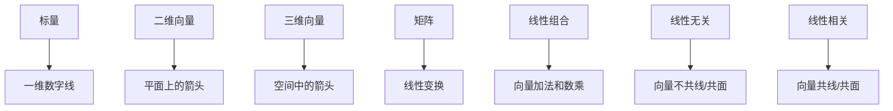

# 第1章：线性代数基础入门

::: tip 学习目标
- 理解线性代数的基本概念和重要性
- 掌握标量、向量、矩阵的基本定义
- 理解线性组合和线性相关性的直观含义
- 建立几何直观理解
:::

## 线性代数的重要性

线性代数是现代数学的核心分支之一，在数据科学、机器学习、计算机图形学、物理学、工程学等众多领域都有重要应用。它提供了处理多维数据和线性关系的强大工具。

::: note 应用领域
- **数据科学**: 主成分分析、降维、数据变换
- **机器学习**: 神经网络权重、特征空间变换
- **计算机图形学**: 3D变换、旋转、缩放
- **物理学**: 量子力学状态描述、力学系统
- **经济学**: 投入产出模型、最优化问题
:::

## 基本概念定义

### 标量 (Scalar)

标量是单一的数值，通常用小写字母表示，如 $a$、$b$、$c$ 等。

```python
import numpy as np

# 标量示例
scalar_a = 5
scalar_b = -2.5
scalar_c = 3.14159

print(f"标量 a = {scalar_a}")
print(f"标量 b = {scalar_b}")
print(f"标量 c = {scalar_c}")
```

### 向量 (Vector)

向量是有序数组，通常用粗体小写字母或带箭头的字母表示，如 $\mathbf{v}$ 或 $\vec{v}$。

```python
# 向量示例
vector_2d = np.array([3, 4])  # 二维向量
vector_3d = np.array([1, -2, 5])  # 三维向量
vector_nd = np.array([2, -1, 0, 3, 7])  # n维向量

print(f"二维向量: {vector_2d}")
print(f"三维向量: {vector_3d}")
print(f"五维向量: {vector_nd}")

# 向量的模长（范数）
magnitude_2d = np.linalg.norm(vector_2d)
print(f"二维向量的模长: {magnitude_2d}")
```

::: tip 向量的几何意义
- **二维向量**: 可以表示平面上从原点到某点的有向线段
- **三维向量**: 可以表示空间中的位置、速度、力等
- **高维向量**: 在数据科学中可以表示特征向量、数据点等
:::

### 矩阵 (Matrix)

矩阵是二维数组，通常用大写字母表示，如 $A$、$B$、$C$ 等。

```python
# 矩阵示例
matrix_2x2 = np.array([[1, 2],
                       [3, 4]])

matrix_3x3 = np.array([[1, 0, 2],
                       [0, 1, -1],
                       [2, -1, 0]])

matrix_2x3 = np.array([[1, 2, 3],
                       [4, 5, 6]])

print("2×2 矩阵:")
print(matrix_2x2)
print("\n3×3 矩阵:")
print(matrix_3x3)
print("\n2×3 矩阵:")
print(matrix_2x3)

# 矩阵的形状
print(f"\n矩阵形状: {matrix_2x3.shape}")  # (行数, 列数)
```

## 线性组合的概念

线性组合是线性代数中最基础的概念之一。给定向量 $\mathbf{v_1}, \mathbf{v_2}, ..., \mathbf{v_n}$ 和标量 $c_1, c_2, ..., c_n$，则：

$$\mathbf{w} = c_1\mathbf{v_1} + c_2\mathbf{v_2} + ... + c_n\mathbf{v_n}$$

称为这些向量的线性组合。

```python
# 线性组合示例
v1 = np.array([1, 2])
v2 = np.array([3, 1])

# 系数
c1 = 2
c2 = -1

# 计算线性组合
linear_combination = c1 * v1 + c2 * v2
print(f"v1 = {v1}")
print(f"v2 = {v2}")
print(f"线性组合 {c1}*v1 + {c2}*v2 = {linear_combination}")

# 可视化线性组合
import matplotlib.pyplot as plt

plt.figure(figsize=(8, 6))
plt.arrow(0, 0, v1[0], v1[1], head_width=0.1, head_length=0.1, fc='blue', ec='blue', label='v1')
plt.arrow(0, 0, v2[0], v2[1], head_width=0.1, head_length=0.1, fc='red', ec='red', label='v2')
plt.arrow(0, 0, linear_combination[0], linear_combination[1],
          head_width=0.1, head_length=0.1, fc='green', ec='green', label='2v1 - v2')

plt.grid(True, alpha=0.3)
plt.axis('equal')
plt.legend()
plt.title('向量的线性组合')
plt.xlabel('x')
plt.ylabel('y')
plt.show()
```

## 线性相关性的直观理解

### 线性无关 (Linearly Independent)

如果向量组中没有任何一个向量可以表示为其他向量的线性组合，则称这组向量线性无关。

```python
# 线性无关的向量组
v1 = np.array([1, 0])  # x轴方向单位向量
v2 = np.array([0, 1])  # y轴方向单位向量

print("线性无关的向量组:")
print(f"v1 = {v1}")
print(f"v2 = {v2}")
print("这两个向量线性无关，因为它们不在同一条直线上")
```

### 线性相关 (Linearly Dependent)

如果向量组中至少有一个向量可以表示为其他向量的线性组合，则称这组向量线性相关。

```python
# 线性相关的向量组
v1 = np.array([2, 1])
v2 = np.array([4, 2])  # v2 = 2 * v1
v3 = np.array([6, 3])  # v3 = 3 * v1

print("线性相关的向量组:")
print(f"v1 = {v1}")
print(f"v2 = {v2} = 2 * v1")
print(f"v3 = {v3} = 3 * v1")
print("这三个向量线性相关，因为它们都在同一条直线上")
```

## 几何直观理解



::: warning 注意事项
- 向量的表示方式可能因上下文而异（行向量或列向量）
- 矩阵的索引通常从1开始（数学）或从0开始（编程）
- 线性相关性的判断在实际计算中可能受到数值误差影响
:::

## 本章小结

本章介绍了线性代数的基础概念：

| 概念 | 定义 | 几何意义 | 应用 |
|------|------|----------|------|
| 标量 | 单一数值 | 数轴上的点 | 系数、权重 |
| 向量 | 有序数组 | 有向线段 | 位置、方向、特征 |
| 矩阵 | 二维数组 | 线性变换 | 数据表、变换矩阵 |
| 线性组合 | 向量的加权和 | 向量空间中的点 | 表示任意向量 |
| 线性相关性 | 向量间的依赖关系 | 共线/共面性 | 维数判断 |

这些基础概念为后续学习向量空间、矩阵运算、线性变换等内容奠定了坚实基础。理解它们的几何意义有助于建立直观的数学思维。