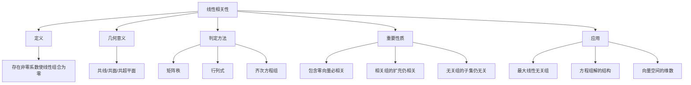

# 第3章：线性相关性与线性无关性

::: tip 学习目标
- 深入理解线性相关和线性无关的定义
- 掌握线性相关性的几何解释
- 学会判断向量组线性相关性的方法
- 理解线性相关性与方程组解的关系
- 掌握最大线性无关组的求法
:::

## 线性相关性的精确定义

### 数学定义

给定向量组 $\{\mathbf{v_1}, \mathbf{v_2}, \ldots, \mathbf{v_n}\}$，如果存在**不全为零**的标量 $c_1, c_2, \ldots, c_n$，使得：

$$c_1\mathbf{v_1} + c_2\mathbf{v_2} + \cdots + c_n\mathbf{v_n} = \mathbf{0}$$

则称这组向量**线性相关**。

如果只有当 $c_1 = c_2 = \cdots = c_n = 0$ 时上式才成立，则称这组向量**线性无关**。

::: warning 关键理解
"不全为零"意味着至少有一个系数不等于零。这是区分线性相关和线性无关的关键。
:::

```python
import numpy as np
import matplotlib.pyplot as plt
from scipy.linalg import null_space

# 线性相关的例子
def demonstrate_linear_dependence():
    print("线性相关性示例:")
    print("=" * 50)

    # 示例1: 明显线性相关的向量组
    v1 = np.array([1, 2])
    v2 = np.array([2, 4])  # v2 = 2*v1
    v3 = np.array([3, 6])  # v3 = 3*v1

    print(f"向量组: v1={v1}, v2={v2}, v3={v3}")
    print(f"观察: v2 = 2*v1, v3 = 3*v1")
    print(f"线性组合: 1*v1 - 0.5*v2 + 0*v3 = {1*v1 - 0.5*v2 + 0*v3}")

    # 示例2: 线性无关的向量组
    u1 = np.array([1, 0])
    u2 = np.array([0, 1])

    print(f"\n向量组: u1={u1}, u2={u2}")
    print("这两个向量线性无关，因为除了零系数外，没有其他系数使线性组合为零")

demonstrate_linear_dependence()
```

## 几何直观理解

### 二维空间中的线性相关性

```python
def visualize_2d_linear_dependence():
    fig, axes = plt.subplots(1, 3, figsize=(15, 5))

    # 情况1: 线性无关（两个向量不共线）
    v1 = np.array([3, 1])
    v2 = np.array([1, 2])

    axes[0].arrow(0, 0, v1[0], v1[1], head_width=0.2, head_length=0.2,
                  fc='blue', ec='blue', label='v1')
    axes[0].arrow(0, 0, v2[0], v2[1], head_width=0.2, head_length=0.2,
                  fc='red', ec='red', label='v2')
    axes[0].set_xlim(-1, 4)
    axes[0].set_ylim(-1, 3)
    axes[0].grid(True, alpha=0.3)
    axes[0].legend()
    axes[0].set_title('线性无关\n(不共线)')
    axes[0].set_aspect('equal')

    # 情况2: 线性相关（两个向量共线）
    w1 = np.array([2, 1])
    w2 = np.array([4, 2])  # w2 = 2*w1

    axes[1].arrow(0, 0, w1[0], w1[1], head_width=0.2, head_length=0.2,
                  fc='blue', ec='blue', label='w1')
    axes[1].arrow(0, 0, w2[0], w2[1], head_width=0.2, head_length=0.2,
                  fc='red', ec='red', label='w2=2w1')
    axes[1].set_xlim(-1, 5)
    axes[1].set_ylim(-1, 3)
    axes[1].grid(True, alpha=0.3)
    axes[1].legend()
    axes[1].set_title('线性相关\n(共线)')
    axes[1].set_aspect('equal')

    # 情况3: 三个向量的线性相关性
    x1 = np.array([2, 1])
    x2 = np.array([1, 2])
    x3 = np.array([3, 3])  # x3 = x1 + x2

    axes[2].arrow(0, 0, x1[0], x1[1], head_width=0.2, head_length=0.2,
                  fc='blue', ec='blue', label='x1')
    axes[2].arrow(0, 0, x2[0], x2[1], head_width=0.2, head_length=0.2,
                  fc='red', ec='red', label='x2')
    axes[2].arrow(0, 0, x3[0], x3[1], head_width=0.2, head_length=0.2,
                  fc='green', ec='green', label='x3=x1+x2')

    # 显示x3是x1和x2的线性组合
    axes[2].arrow(x1[0], x1[1], x2[0], x2[1], head_width=0.1, head_length=0.1,
                  fc='orange', ec='orange', linestyle='--', alpha=0.7)

    axes[2].set_xlim(-1, 4)
    axes[2].set_ylim(-1, 4)
    axes[2].grid(True, alpha=0.3)
    axes[2].legend()
    axes[2].set_title('线性相关\n(三个向量)')
    axes[2].set_aspect('equal')

    plt.tight_layout()
    plt.show()

visualize_2d_linear_dependence()
```

### 三维空间中的线性相关性

```python
def visualize_3d_linear_dependence():
    fig = plt.figure(figsize=(15, 5))

    # 三维线性无关向量组
    ax1 = fig.add_subplot(131, projection='3d')
    v1 = np.array([1, 0, 0])
    v2 = np.array([0, 1, 0])
    v3 = np.array([0, 0, 1])

    ax1.quiver(0, 0, 0, v1[0], v1[1], v1[2], color='red', label='e1')
    ax1.quiver(0, 0, 0, v2[0], v2[1], v2[2], color='green', label='e2')
    ax1.quiver(0, 0, 0, v3[0], v3[1], v3[2], color='blue', label='e3')
    ax1.set_xlim([0, 1.2])
    ax1.set_ylim([0, 1.2])
    ax1.set_zlim([0, 1.2])
    ax1.set_title('线性无关\n(标准基)')
    ax1.legend()

    # 三维线性相关向量组（共面）
    ax2 = fig.add_subplot(132, projection='3d')
    u1 = np.array([1, 0, 0])
    u2 = np.array([0, 1, 0])
    u3 = np.array([1, 1, 0])  # u3 = u1 + u2

    ax2.quiver(0, 0, 0, u1[0], u1[1], u1[2], color='red', label='u1')
    ax2.quiver(0, 0, 0, u2[0], u2[1], u2[2], color='green', label='u2')
    ax2.quiver(0, 0, 0, u3[0], u3[1], u3[2], color='blue', label='u3=u1+u2')
    ax2.set_xlim([0, 1.2])
    ax2.set_ylim([0, 1.2])
    ax2.set_zlim([0, 1.2])
    ax2.set_title('线性相关\n(共面)')
    ax2.legend()

    # 三维线性相关向量组（共线）
    ax3 = fig.add_subplot(133, projection='3d')
    w1 = np.array([1, 1, 1])
    w2 = np.array([2, 2, 2])  # w2 = 2*w1
    w3 = np.array([0.5, 0.5, 0.5])  # w3 = 0.5*w1

    ax3.quiver(0, 0, 0, w1[0], w1[1], w1[2], color='red', label='w1')
    ax3.quiver(0, 0, 0, w2[0], w2[1], w2[2], color='green', label='w2=2w1')
    ax3.quiver(0, 0, 0, w3[0], w3[1], w3[2], color='blue', label='w3=0.5w1')
    ax3.set_xlim([0, 2.5])
    ax3.set_ylim([0, 2.5])
    ax3.set_zlim([0, 2.5])
    ax3.set_title('线性相关\n(共线)')
    ax3.legend()

    plt.tight_layout()
    plt.show()

visualize_3d_linear_dependence()
```

## 线性相关性的判定方法

### 方法1：齐次线性方程组

判断向量组 $\{\mathbf{v_1}, \mathbf{v_2}, \ldots, \mathbf{v_n}\}$ 的线性相关性等价于求解齐次线性方程组：

$$\begin{bmatrix} | & | & \cdots & | \\ \mathbf{v_1} & \mathbf{v_2} & \cdots & \mathbf{v_n} \\ | & | & \cdots & | \end{bmatrix} \begin{bmatrix} c_1 \\ c_2 \\ \vdots \\ c_n \end{bmatrix} = \begin{bmatrix} 0 \\ 0 \\ \vdots \\ 0 \end{bmatrix}$$

```python
def check_linear_dependence_matrix_method(vectors):
    """
    使用矩阵方法检查线性相关性
    """
    # 将向量作为列构成矩阵
    A = np.column_stack(vectors)
    print(f"向量矩阵 A:")
    print(A)

    # 计算矩阵的秩
    rank = np.linalg.matrix_rank(A)
    n_vectors = len(vectors)

    print(f"矩阵的秩: {rank}")
    print(f"向量个数: {n_vectors}")

    if rank < n_vectors:
        print("向量组线性相关")

        # 寻找线性相关关系
        # 计算零空间
        null_sp = null_space(A)
        if null_sp.size > 0:
            coeffs = null_sp[:, 0]  # 取第一个零空间向量
            print(f"线性相关关系的系数: {coeffs}")

            # 验证线性组合
            linear_combination = sum(c * v for c, v in zip(coeffs, vectors))
            print(f"验证: {' + '.join([f'{c:.3f}*v{i+1}' for i, c in enumerate(coeffs)])} = {linear_combination}")

    else:
        print("向量组线性无关")

    return rank < n_vectors

# 测试示例
print("示例1: 线性相关的向量组")
vectors1 = [np.array([1, 2, 3]), np.array([2, 4, 6]), np.array([1, 1, 1])]
check_linear_dependence_matrix_method(vectors1)

print("\n" + "="*60 + "\n")

print("示例2: 线性无关的向量组")
vectors2 = [np.array([1, 0, 0]), np.array([0, 1, 0]), np.array([0, 0, 1])]
check_linear_dependence_matrix_method(vectors2)
```

### 方法2：行列式方法（方阵情况）

对于 $n$ 个 $n$ 维向量，可以使用行列式判断：

```python
def check_dependence_determinant(vectors):
    """
    使用行列式方法检查方阵的线性相关性
    """
    A = np.column_stack(vectors)

    if A.shape[0] != A.shape[1]:
        print("不是方阵，无法使用行列式方法")
        return None

    det = np.linalg.det(A)
    print(f"矩阵 A:")
    print(A)
    print(f"行列式值: {det:.6f}")

    if abs(det) < 1e-10:  # 考虑数值误差
        print("行列式为0，向量组线性相关")
        return True
    else:
        print("行列式非0，向量组线性无关")
        return False

# 测试示例
print("使用行列式方法:")
vectors_square = [np.array([1, 2]), np.array([3, 4])]
check_dependence_determinant(vectors_square)

print("\n")
vectors_dependent = [np.array([1, 2]), np.array([2, 4])]
check_dependence_determinant(vectors_dependent)
```

## 线性相关性的重要性质

### 性质定理

```python
def demonstrate_linear_dependence_properties():
    print("线性相关性的重要性质:")
    print("=" * 50)

    # 性质1: 包含零向量的向量组必线性相关
    print("性质1: 包含零向量的向量组线性相关")
    v1 = np.array([1, 2])
    v2 = np.array([0, 0])  # 零向量
    v3 = np.array([3, 4])

    print(f"向量组: {v1}, {v2}, {v3}")
    print(f"因为包含零向量，所以线性相关")
    print(f"例如: 0*{v1} + 1*{v2} + 0*{v3} = {0*v1 + 1*v2 + 0*v3}")

    print("\n" + "-"*40)

    # 性质2: 两个向量线性相关当且仅当一个是另一个的倍数
    print("性质2: 两个向量线性相关 ⟺ 一个是另一个的倍数")
    u1 = np.array([3, 6])
    u2 = np.array([1, 2])  # u1 = 3*u2

    print(f"向量 u1: {u1}")
    print(f"向量 u2: {u2}")
    print(f"u1 = 3*u2: {np.array_equal(u1, 3*u2)}")

    print("\n" + "-"*40)

    # 性质3: 如果向量组线性无关，那么其任意子集也线性无关
    print("性质3: 线性无关组的子集仍然线性无关")
    basis = [np.array([1, 0, 0]), np.array([0, 1, 0]), np.array([0, 0, 1])]
    subset = [np.array([1, 0, 0]), np.array([0, 1, 0])]

    print("三维标准基是线性无关的")
    print("其任意两个向量的子集也是线性无关的")

    print("\n" + "-"*40)

    # 性质4: 如果向量组线性相关，那么至少有一个向量可以表示为其他向量的线性组合
    print("性质4: 线性相关 ⟺ 至少一个向量可表示为其他向量的线性组合")
    w1 = np.array([1, 2])
    w2 = np.array([2, 1])
    w3 = np.array([3, 3])  # w3 = w1 + w2

    print(f"向量组: {w1}, {w2}, {w3}")
    print(f"w3 = w1 + w2: {np.array_equal(w3, w1 + w2)}")
    print("所以向量组线性相关")

demonstrate_linear_dependence_properties()
```

## 最大线性无关组

### 定义与求法

```python
def find_maximal_linearly_independent_set(vectors):
    """
    寻找向量组的最大线性无关组
    """
    vectors = [np.array(v) for v in vectors]
    n = len(vectors)

    print(f"原向量组: {vectors}")

    # 逐步添加向量，检查线性无关性
    independent_set = []
    independent_indices = []

    for i, v in enumerate(vectors):
        # 将当前向量加入测试集
        test_set = independent_set + [v]

        # 检查是否仍然线性无关
        if len(test_set) == 1:
            # 单个非零向量总是线性无关的
            if not np.allclose(v, 0):
                independent_set.append(v)
                independent_indices.append(i)
        else:
            A = np.column_stack(test_set)
            rank = np.linalg.matrix_rank(A)

            if rank == len(test_set):
                # 仍然线性无关，添加这个向量
                independent_set.append(v)
                independent_indices.append(i)
            else:
                print(f"向量 v{i+1} = {v} 可以表示为前面向量的线性组合，跳过")

    print(f"最大线性无关组的向量索引: {[i+1 for i in independent_indices]}")
    print(f"最大线性无关组: {independent_set}")
    print(f"最大线性无关组的秩: {len(independent_set)}")

    return independent_set, independent_indices

# 测试示例
print("寻找最大线性无关组:")
test_vectors = [
    [1, 2, 3],   # v1
    [2, 4, 6],   # v2 = 2*v1 (线性相关)
    [1, 0, 1],   # v3 (可能无关)
    [0, 1, 1],   # v4 (可能无关)
    [1, 1, 2]    # v5 = v3 + v4 (线性相关)
]

maximal_set, indices = find_maximal_linearly_independent_set(test_vectors)
```

## 线性相关性与方程组解的关系

### 齐次方程组

```python
def analyze_homogeneous_system():
    """
    分析齐次方程组解与线性相关性的关系
    """
    print("齐次方程组 Ax = 0 与线性相关性:")
    print("=" * 50)

    # 系数矩阵A的列向量线性相关 ⟺ Ax = 0有非零解
    A1 = np.array([[1, 2, 3],
                   [2, 4, 6],
                   [1, 1, 2]])

    print("矩阵 A1:")
    print(A1)

    # 检查列向量的线性相关性
    rank_A1 = np.linalg.matrix_rank(A1)
    print(f"A1的秩: {rank_A1}")
    print(f"A1的列数: {A1.shape[1]}")

    if rank_A1 < A1.shape[1]:
        print("列向量线性相关，齐次方程组有非零解")

        # 求零空间
        null_sp = null_space(A1)
        print("零空间的基:")
        print(null_sp)

        # 验证解
        if null_sp.size > 0:
            solution = null_sp[:, 0]
            result = A1 @ solution
            print(f"验证: A1 * {solution} = {result}")
    else:
        print("列向量线性无关，齐次方程组只有零解")

analyze_homogeneous_system()
```

### 非齐次方程组

```python
def analyze_nonhomogeneous_system():
    """
    分析非齐次方程组解的情况
    """
    print("\n非齐次方程组 Ax = b:")
    print("=" * 40)

    A = np.array([[1, 2],
                  [2, 4]])  # 秩亏矩阵
    b1 = np.array([3, 6])   # 有解的情况
    b2 = np.array([3, 7])   # 无解的情况

    print("矩阵 A:")
    print(A)

    # 情况1: 有解
    print(f"\n情况1: b = {b1}")
    augmented1 = np.column_stack([A, b1])
    rank_A = np.linalg.matrix_rank(A)
    rank_aug1 = np.linalg.matrix_rank(augmented1)

    print(f"rank(A) = {rank_A}")
    print(f"rank([A|b]) = {rank_aug1}")

    if rank_A == rank_aug1:
        print("有解！")
        # 求特解
        try:
            x = np.linalg.lstsq(A, b1, rcond=None)[0]
            print(f"一个特解: {x}")
        except:
            print("使用伪逆求解")
            x = np.linalg.pinv(A) @ b1
            print(f"一个特解: {x}")
    else:
        print("无解")

    # 情况2: 无解
    print(f"\n情况2: b = {b2}")
    augmented2 = np.column_stack([A, b2])
    rank_aug2 = np.linalg.matrix_rank(augmented2)

    print(f"rank(A) = {rank_A}")
    print(f"rank([A|b]) = {rank_aug2}")

    if rank_A == rank_aug2:
        print("有解")
    else:
        print("无解！")

analyze_nonhomogeneous_system()
```

## 线性相关性的应用

### 应用1：向量组的张成空间

```python
def analyze_span():
    """
    分析向量组张成的空间
    """
    print("向量组的张成空间:")
    print("=" * 40)

    # 二维空间中的情况
    v1 = np.array([1, 2])
    v2 = np.array([2, 4])  # v2 = 2*v1

    print(f"向量组: {v1}, {v2}")
    print("这两个向量线性相关，它们张成一条通过原点的直线")

    # 三维空间中的情况
    u1 = np.array([1, 0, 0])
    u2 = np.array([0, 1, 0])
    u3 = np.array([1, 1, 0])  # u3 = u1 + u2

    print(f"\n向量组: {u1}, {u2}, {u3}")
    print("这三个向量中有两个线性无关，它们张成xy平面")

    # 可视化张成空间
    fig = plt.figure(figsize=(12, 5))

    # 二维情况
    ax1 = fig.add_subplot(121)
    t = np.linspace(-3, 3, 100)
    line_points = np.outer(t, v1)

    ax1.plot(line_points[:, 0], line_points[:, 1], 'b-', alpha=0.3, linewidth=3,
             label='span{v1, v2}')
    ax1.arrow(0, 0, v1[0], v1[1], head_width=0.2, head_length=0.2,
              fc='red', ec='red', label='v1')
    ax1.arrow(0, 0, v2[0], v2[1], head_width=0.2, head_length=0.2,
              fc='blue', ec='blue', label='v2=2v1')

    ax1.set_xlim(-4, 4)
    ax1.set_ylim(-4, 4)
    ax1.grid(True, alpha=0.3)
    ax1.legend()
    ax1.set_title('线性相关向量组的张成空间\n(直线)')
    ax1.set_aspect('equal')

    # 三维情况的投影视图
    ax2 = fig.add_subplot(122, projection='3d')

    # 创建网格表示平面
    x = np.linspace(-2, 2, 10)
    y = np.linspace(-2, 2, 10)
    X, Y = np.meshgrid(x, y)
    Z = np.zeros_like(X)  # z = 0 平面

    ax2.plot_surface(X, Y, Z, alpha=0.3, color='lightblue')
    ax2.quiver(0, 0, 0, u1[0], u1[1], u1[2], color='red', label='u1')
    ax2.quiver(0, 0, 0, u2[0], u2[1], u2[2], color='green', label='u2')
    ax2.quiver(0, 0, 0, u3[0], u3[1], u3[2], color='blue', label='u3=u1+u2')

    ax2.set_xlim([-2, 2])
    ax2.set_ylim([-2, 2])
    ax2.set_zlim([-1, 1])
    ax2.legend()
    ax2.set_title('线性相关向量组的张成空间\n(平面)')

    plt.tight_layout()
    plt.show()

analyze_span()
```

## 本章小结



本章深入探讨了线性代数中最核心的概念之一——线性相关性：

| 概念 | 核心内容 | 判定条件 | 几何意义 |
|------|----------|----------|----------|
| 线性无关 | 只有零系数使线性组合为零 | $\text{rank}(A) = n$ | 向量不共线/共面 |
| 线性相关 | 存在非零系数使线性组合为零 | $\text{rank}(A) < n$ | 向量共线/共面 |
| 最大线性无关组 | 最大的线性无关子集 | 贪心算法构造 | 张成空间的基 |

::: tip 重要结论
- 线性相关性是向量空间维数的基础
- 理解几何直观有助于掌握抽象概念
- 线性相关性与方程组解的结构密切相关
- 最大线性无关组为后续学习基和维数做准备
:::

通过本章学习，我们深入理解了向量组之间的依赖关系，为下一章学习基与维数理论奠定了坚实基础。