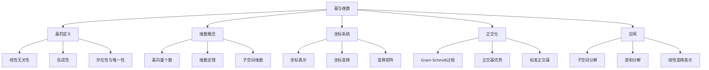

# 第4章：基与维数理论

::: tip 学习目标
- 理解基的定义和重要性
- 掌握基的存在性和唯一性
- 理解维数的概念和计算方法
- 掌握坐标变换的原理
- 理解有限维向量空间的结构
:::

## 基的定义与性质

### 基的数学定义

向量空间 $V$ 的一个子集 $\mathcal{B} = \{\mathbf{v_1}, \mathbf{v_2}, \ldots, \mathbf{v_n}\}$ 称为 $V$ 的一个**基**，如果：

1. **线性无关性**：$\mathcal{B}$ 中的向量线性无关
2. **张成性**：$\text{span}(\mathcal{B}) = V$

::: note 基的直观理解
基是向量空间的"坐标系"，任何向量都可以唯一地表示为基向量的线性组合。
:::

```python
import numpy as np
import matplotlib.pyplot as plt
from mpl_toolkits.mplot3d import Axes3D

def demonstrate_basis_concept():
    """
    演示基的概念
    """
    print("基的概念演示:")
    print("=" * 50)

    # R^2的标准基
    e1 = np.array([1, 0])
    e2 = np.array([0, 1])
    standard_basis = [e1, e2]

    print("R^2 的标准基:")
    print(f"e1 = {e1}")
    print(f"e2 = {e2}")

    # 验证线性无关性
    A = np.column_stack(standard_basis)
    rank = np.linalg.matrix_rank(A)
    print(f"矩阵的秩: {rank}")
    print(f"向量个数: {len(standard_basis)}")
    print(f"线性无关: {rank == len(standard_basis)}")

    # 验证张成性：任意向量都可以表示为基的线性组合
    arbitrary_vector = np.array([3, 4])
    coefficients = arbitrary_vector  # 对于标准基，系数就是向量本身
    reconstructed = coefficients[0] * e1 + coefficients[1] * e2

    print(f"\n任意向量 v = {arbitrary_vector}")
    print(f"基的表示: v = {coefficients[0]}*e1 + {coefficients[1]}*e2")
    print(f"重构结果: {reconstructed}")
    print(f"验证正确: {np.array_equal(arbitrary_vector, reconstructed)}")

demonstrate_basis_concept()
```

### 基的几何可视化

```python
def visualize_different_bases():
    """
    可视化不同的基
    """
    fig, axes = plt.subplots(1, 3, figsize=(15, 5))

    # 标准基
    e1 = np.array([1, 0])
    e2 = np.array([0, 1])

    axes[0].arrow(0, 0, e1[0], e1[1], head_width=0.1, head_length=0.1,
                  fc='red', ec='red', label='e1', width=0.02)
    axes[0].arrow(0, 0, e2[0], e2[1], head_width=0.1, head_length=0.1,
                  fc='blue', ec='blue', label='e2', width=0.02)

    # 绘制网格
    for i in range(-2, 3):
        for j in range(-2, 3):
            point = i * e1 + j * e2
            axes[0].plot(point[0], point[1], 'ko', markersize=3, alpha=0.5)

    axes[0].set_xlim(-2.5, 2.5)
    axes[0].set_ylim(-2.5, 2.5)
    axes[0].grid(True, alpha=0.3)
    axes[0].legend()
    axes[0].set_title('标准基')
    axes[0].set_aspect('equal')

    # 另一组基
    v1 = np.array([1, 1])
    v2 = np.array([1, -1])

    axes[1].arrow(0, 0, v1[0], v1[1], head_width=0.1, head_length=0.1,
                  fc='red', ec='red', label='v1', width=0.02)
    axes[1].arrow(0, 0, v2[0], v2[1], head_width=0.1, head_length=0.1,
                  fc='blue', ec='blue', label='v2', width=0.02)

    # 绘制新基对应的网格
    for i in range(-2, 3):
        for j in range(-2, 3):
            point = i * v1 + j * v2
            if np.linalg.norm(point) <= 3:  # 只绘制范围内的点
                axes[1].plot(point[0], point[1], 'go', markersize=3, alpha=0.5)

    axes[1].set_xlim(-2.5, 2.5)
    axes[1].set_ylim(-2.5, 2.5)
    axes[1].grid(True, alpha=0.3)
    axes[1].legend()
    axes[1].set_title('另一组基')
    axes[1].set_aspect('equal')

    # 非正交基
    u1 = np.array([2, 0])
    u2 = np.array([1, 1])

    axes[2].arrow(0, 0, u1[0], u1[1], head_width=0.1, head_length=0.1,
                  fc='red', ec='red', label='u1', width=0.02)
    axes[2].arrow(0, 0, u2[0], u2[1], head_width=0.1, head_length=0.1,
                  fc='blue', ec='blue', label='u2', width=0.02)

    # 绘制斜坐标系
    for i in range(-1, 2):
        for j in range(-2, 3):
            point = i * u1 + j * u2
            if abs(point[0]) <= 3 and abs(point[1]) <= 3:
                axes[2].plot(point[0], point[1], 'mo', markersize=3, alpha=0.5)

    axes[2].set_xlim(-2.5, 2.5)
    axes[2].set_ylim(-2.5, 2.5)
    axes[2].grid(True, alpha=0.3)
    axes[2].legend()
    axes[2].set_title('非正交基')
    axes[2].set_aspect('equal')

    plt.tight_layout()
    plt.show()

visualize_different_bases()
```

## 基的存在性与唯一性

### 基的存在性定理

::: note 重要定理
每个有限维向量空间都有基，且任意两个基包含相同数量的向量。
:::

```python
def find_basis_from_spanning_set(vectors):
    """
    从张成集中提取基
    """
    print("从张成集提取基:")
    print("=" * 40)

    vectors = [np.array(v) for v in vectors]
    print(f"原向量组: {vectors}")

    # 构造矩阵并进行行简化
    A = np.column_stack(vectors)
    print(f"\n向量矩阵 A:")
    print(A)

    # 使用QR分解找到线性无关的列
    Q, R = np.linalg.qr(A)
    rank = np.linalg.matrix_rank(A)

    print(f"矩阵的秩: {rank}")

    # 找到主元列
    _, pivot_cols = np.linalg.qr(A.T, pivoting=True)
    pivot_indices = pivot_cols[:rank]

    basis_vectors = [vectors[i] for i in sorted(pivot_indices)]
    print(f"基的向量索引: {sorted(pivot_indices)}")
    print(f"提取的基: {basis_vectors}")

    # 验证这些向量确实构成基
    basis_matrix = np.column_stack(basis_vectors)
    basis_rank = np.linalg.matrix_rank(basis_matrix)
    print(f"基矩阵的秩: {basis_rank}")
    print(f"基向量个数: {len(basis_vectors)}")
    print(f"确实是基: {basis_rank == len(basis_vectors)}")

    return basis_vectors

# 测试示例
test_vectors = [
    [1, 2, 3],
    [2, 4, 6],  # 这个与第一个线性相关
    [1, 0, 1],
    [0, 1, 1],
    [2, 1, 4]   # 这个可能与前面的线性相关
]

basis = find_basis_from_spanning_set(test_vectors)
```

### 基变换的存在性

```python
def demonstrate_basis_transformation():
    """
    演示基变换
    """
    print("\n基变换演示:")
    print("=" * 30)

    # 定义两组基
    # 标准基
    B1 = [np.array([1, 0]), np.array([0, 1])]

    # 新基
    B2 = [np.array([1, 1]), np.array([1, -1])]

    print(f"标准基 B1: {B1}")
    print(f"新基 B2: {B2}")

    # 基变换矩阵：从B1到B2
    # 新基的向量在标准基下的坐标
    P = np.column_stack(B2)
    print(f"\n基变换矩阵 P (B1 → B2):")
    print(P)

    # 逆变换矩阵：从B2到B1
    P_inv = np.linalg.inv(P)
    print(f"逆变换矩阵 P^(-1) (B2 → B1):")
    print(P_inv)

    # 测试向量在不同基下的坐标
    v = np.array([3, 1])  # 在标准基下的坐标
    print(f"\n向量 v 在标准基下: {v}")

    # v在新基B2下的坐标
    v_B2 = P_inv @ v
    print(f"向量 v 在新基B2下: {v_B2}")

    # 验证：从新基坐标重构原向量
    v_reconstructed = P @ v_B2
    print(f"从新基坐标重构: {v_reconstructed}")
    print(f"重构正确: {np.allclose(v, v_reconstructed)}")

    # 几何验证
    print(f"\n几何验证:")
    print(f"v = {v_B2[0]} * {B2[0]} + {v_B2[1]} * {B2[1]}")
    manual_reconstruction = v_B2[0] * B2[0] + v_B2[1] * B2[1]
    print(f"手动重构: {manual_reconstruction}")

demonstrate_basis_transformation()
```

## 维数的定义与性质

### 维数的数学定义

向量空间 $V$ 的**维数**（记作 $\dim(V)$）是其任一基所包含的向量个数。

::: tip 维数的重要性质
1. 维数与基的选择无关
2. $\dim(V) = 0$ 当且仅当 $V = \{\mathbf{0}\}$
3. 有限维空间中，任何线性无关组都可以扩充为基
4. 任何张成集都包含一个基
:::

```python
def calculate_dimension():
    """
    计算不同向量空间的维数
    """
    print("向量空间的维数计算:")
    print("=" * 40)

    # 例1: R^n的标准子空间
    spaces = {
        "R^1": [np.array([1])],
        "R^2": [np.array([1, 0]), np.array([0, 1])],
        "R^3": [np.array([1, 0, 0]), np.array([0, 1, 0]), np.array([0, 0, 1])]
    }

    for name, basis in spaces.items():
        A = np.column_stack(basis) if len(basis) > 1 else np.array(basis).reshape(-1, 1)
        dim = np.linalg.matrix_rank(A)
        print(f"{name}: 维数 = {dim}, 基 = {basis}")

    # 例2: 子空间的维数
    print(f"\n子空间维数示例:")

    # R^3中通过原点的直线
    line_basis = [np.array([1, 2, 3])]
    line_dim = 1
    print(f"直线子空间: 维数 = {line_dim}, 基 = {line_basis}")

    # R^3中通过原点的平面
    plane_basis = [np.array([1, 0, 0]), np.array([0, 1, 0])]
    plane_matrix = np.column_stack(plane_basis)
    plane_dim = np.linalg.matrix_rank(plane_matrix)
    print(f"平面子空间: 维数 = {plane_dim}, 基 = {plane_basis}")

    # 例3: 由向量组张成的子空间
    spanning_vectors = [
        np.array([1, 2, 1]),
        np.array([2, 1, 3]),
        np.array([1, -1, 2]),
        np.array([3, 3, 4])  # 这个可能线性相关
    ]

    spanning_matrix = np.column_stack(spanning_vectors)
    subspace_dim = np.linalg.matrix_rank(spanning_matrix)

    print(f"\n由向量组张成的子空间:")
    print(f"张成向量组: {spanning_vectors}")
    print(f"子空间维数: {subspace_dim}")

calculate_dimension()
```

### 维数定理

```python
def dimension_theorems():
    """
    演示重要的维数定理
    """
    print("\n维数定理演示:")
    print("=" * 30)

    # 定理1: 线性无关组可以扩充为基
    print("定理1: 线性无关组的扩充")

    # R^3中的线性无关组
    independent_set = [np.array([1, 0, 0]), np.array([0, 1, 0])]
    print(f"线性无关组: {independent_set}")

    # 需要再添加一个向量形成R^3的基
    candidate = np.array([0, 0, 1])
    extended_set = independent_set + [candidate]

    extended_matrix = np.column_stack(extended_set)
    extended_rank = np.linalg.matrix_rank(extended_matrix)
    print(f"扩充后的向量组: {extended_set}")
    print(f"扩充后的秩: {extended_rank}")
    print(f"形成R^3的基: {extended_rank == 3}")

    # 定理2: 子空间的维数不超过包含空间的维数
    print(f"\n定理2: 子空间维数 ≤ 包含空间维数")

    # R^3的各种子空间
    subspaces = {
        "零子空间": 0,
        "直线子空间": 1,
        "平面子空间": 2,
        "整个R^3": 3
    }

    for name, dim in subspaces.items():
        print(f"{name}: 维数 = {dim} ≤ 3")

dimension_theorems()
```

## 坐标与坐标变换

### 坐标的定义

给定向量空间 $V$ 的基 $\mathcal{B} = \{\mathbf{v_1}, \mathbf{v_2}, \ldots, \mathbf{v_n}\}$，任意向量 $\mathbf{x} \in V$ 都可以唯一地表示为：

$$\mathbf{x} = c_1\mathbf{v_1} + c_2\mathbf{v_2} + \cdots + c_n\mathbf{v_n}$$

称 $[c_1, c_2, \ldots, c_n]^T$ 为 $\mathbf{x}$ 在基 $\mathcal{B}$ 下的**坐标**。

```python
def coordinate_representation():
    """
    演示坐标表示
    """
    print("坐标表示演示:")
    print("=" * 30)

    # 定义基
    basis = [np.array([1, 1]), np.array([1, -1])]
    print(f"基向量: {basis}")

    # 给定向量
    x = np.array([3, 1])
    print(f"向量 x: {x}")

    # 求坐标：解方程 c1*v1 + c2*v2 = x
    basis_matrix = np.column_stack(basis)
    coordinates = np.linalg.solve(basis_matrix, x)

    print(f"在给定基下的坐标: {coordinates}")

    # 验证
    reconstructed = coordinates[0] * basis[0] + coordinates[1] * basis[1]
    print(f"重构向量: {reconstructed}")
    print(f"验证正确: {np.allclose(x, reconstructed)}")

    # 可视化坐标表示
    plt.figure(figsize=(8, 6))

    # 绘制基向量
    plt.arrow(0, 0, basis[0][0], basis[0][1], head_width=0.1, head_length=0.1,
              fc='red', ec='red', label='v1', width=0.02)
    plt.arrow(0, 0, basis[1][0], basis[1][1], head_width=0.1, head_length=0.1,
              fc='blue', ec='blue', label='v2', width=0.02)

    # 绘制目标向量
    plt.arrow(0, 0, x[0], x[1], head_width=0.1, head_length=0.1,
              fc='green', ec='green', label='x', width=0.03)

    # 绘制坐标分解
    component1 = coordinates[0] * basis[0]
    component2 = coordinates[1] * basis[1]

    plt.arrow(0, 0, component1[0], component1[1], head_width=0.05, head_length=0.05,
              fc='red', ec='red', alpha=0.5, linestyle='--', width=0.01)
    plt.arrow(component1[0], component1[1], component2[0], component2[1],
              head_width=0.05, head_length=0.05, fc='blue', ec='blue',
              alpha=0.5, linestyle='--', width=0.01)

    plt.grid(True, alpha=0.3)
    plt.legend()
    plt.axis('equal')
    plt.xlim(-0.5, 3.5)
    plt.ylim(-1.5, 2)
    plt.title(f'坐标表示: x = {coordinates[0]:.2f}*v1 + {coordinates[1]:.2f}*v2')
    plt.show()

coordinate_representation()
```

### 坐标变换矩阵

```python
def coordinate_transformation_matrix():
    """
    详细演示坐标变换矩阵
    """
    print("\n坐标变换矩阵:")
    print("=" * 35)

    # 定义两组基
    B1 = [np.array([1, 0]), np.array([0, 1])]  # 标准基
    B2 = [np.array([2, 1]), np.array([1, 2])]  # 新基

    print(f"旧基 B1: {B1}")
    print(f"新基 B2: {B2}")

    # 从B1到B2的变换矩阵
    # P的列是新基向量在旧基下的坐标
    P_B1_to_B2 = np.column_stack(B2)
    print(f"\n变换矩阵 P (B1 → B2):")
    print(P_B1_to_B2)

    # 从B2到B1的变换矩阵
    P_B2_to_B1 = np.linalg.inv(P_B1_to_B2)
    print(f"逆变换矩阵 P^(-1) (B2 → B1):")
    print(P_B2_to_B1)

    # 测试向量
    x_B1 = np.array([5, 3])  # 在B1下的坐标
    print(f"\n向量在B1下的坐标: {x_B1}")

    # 转换到B2坐标系
    x_B2 = P_B2_to_B1 @ x_B1
    print(f"向量在B2下的坐标: {x_B2}")

    # 验证：两种表示应该给出相同的向量
    vector_from_B1 = x_B1[0] * B1[0] + x_B1[1] * B1[1]
    vector_from_B2 = x_B2[0] * B2[0] + x_B2[1] * B2[1]

    print(f"\n验证:")
    print(f"从B1坐标重构: {vector_from_B1}")
    print(f"从B2坐标重构: {vector_from_B2}")
    print(f"两者相等: {np.allclose(vector_from_B1, vector_from_B2)}")

    # 坐标变换的链式法则
    print(f"\n坐标变换链式法则验证:")
    identity_check = P_B1_to_B2 @ P_B2_to_B1
    print(f"P * P^(-1) = {identity_check}")
    print(f"是否为单位矩阵: {np.allclose(identity_check, np.eye(2))}")

coordinate_transformation_matrix()
```

## 基的标准化：Gram-Schmidt过程

### Gram-Schmidt正交化

```python
def gram_schmidt_process(vectors):
    """
    Gram-Schmidt正交化过程
    """
    print("Gram-Schmidt正交化过程:")
    print("=" * 40)

    vectors = [np.array(v, dtype=float) for v in vectors]
    print(f"输入向量组: {vectors}")

    orthogonal_vectors = []
    orthonormal_vectors = []

    for i, v in enumerate(vectors):
        print(f"\n处理向量 v{i+1} = {v}")

        # 正交化：减去在前面向量上的投影
        u = v.copy()
        for j, prev_u in enumerate(orthogonal_vectors):
            projection = np.dot(v, prev_u) / np.dot(prev_u, prev_u) * prev_u
            u = u - projection
            print(f"  减去在u{j+1}上的投影: {projection}")

        orthogonal_vectors.append(u)
        print(f"  正交化结果: u{i+1} = {u}")

        # 标准化
        norm = np.linalg.norm(u)
        if norm > 1e-10:  # 避免除零
            e = u / norm
            orthonormal_vectors.append(e)
            print(f"  标准化结果: e{i+1} = {e}, ||e{i+1}|| = {np.linalg.norm(e):.6f}")
        else:
            print(f"  向量u{i+1}接近零向量，跳过")

    print(f"\n最终正交基: {orthogonal_vectors}")
    print(f"最终标准正交基: {orthonormal_vectors}")

    # 验证正交性
    print(f"\n验证正交性:")
    for i in range(len(orthonormal_vectors)):
        for j in range(i+1, len(orthonormal_vectors)):
            dot_product = np.dot(orthonormal_vectors[i], orthonormal_vectors[j])
            print(f"e{i+1} · e{j+1} = {dot_product:.6f}")

    return orthogonal_vectors, orthonormal_vectors

# 测试Gram-Schmidt过程
test_vectors = [
    [1, 1, 0],
    [1, 0, 1],
    [0, 1, 1]
]

orthogonal, orthonormal = gram_schmidt_process(test_vectors)
```

### 正交基的优势

```python
def demonstrate_orthogonal_basis_advantages():
    """
    演示正交基的优势
    """
    print("\n正交基的优势:")
    print("=" * 25)

    # 创建正交基和非正交基
    orthogonal_basis = [np.array([1, 0]), np.array([0, 1])]  # 标准正交基
    non_orthogonal_basis = [np.array([1, 1]), np.array([1, -0.5])]

    # 测试向量
    x = np.array([3, 4])

    print(f"测试向量: x = {x}")

    # 在正交基下求坐标（简单的投影）
    print(f"\n在正交基下:")
    orth_coords = [np.dot(x, b) / np.dot(b, b) for b in orthogonal_basis]
    print(f"坐标计算: {orth_coords}")

    # 在非正交基下求坐标（需要解线性方程组）
    print(f"在非正交基下:")
    non_orth_matrix = np.column_stack(non_orthogonal_basis)
    non_orth_coords = np.linalg.solve(non_orth_matrix, x)
    print(f"坐标计算: {non_orth_coords}")

    # 验证
    orth_reconstruction = sum(c * b for c, b in zip(orth_coords, orthogonal_basis))
    non_orth_reconstruction = sum(c * b for c, b in zip(non_orth_coords, non_orthogonal_basis))

    print(f"\n验证重构:")
    print(f"正交基重构: {orth_reconstruction}")
    print(f"非正交基重构: {non_orth_reconstruction}")
    print(f"原向量: {x}")

demonstrate_orthogonal_basis_advantages()
```

## 有限维向量空间的结构

### 子空间的基与维数

```python
def analyze_subspace_structure():
    """
    分析子空间的结构
    """
    print("\n子空间结构分析:")
    print("=" * 30)

    # R^4中的子空间例子
    print("R^4中的子空间层次:")

    subspaces = {
        "零子空间": {"dim": 0, "example": "span{}"},
        "直线子空间": {"dim": 1, "example": "span{(1,0,0,0)}"},
        "平面子空间": {"dim": 2, "example": "span{(1,0,0,0), (0,1,0,0)}"},
        "三维子空间": {"dim": 3, "example": "span{(1,0,0,0), (0,1,0,0), (0,0,1,0)}"},
        "整个R^4": {"dim": 4, "example": "span{(1,0,0,0), (0,1,0,0), (0,0,1,0), (0,0,0,1)}"}
    }

    for name, info in subspaces.items():
        print(f"{name}: 维数 = {info['dim']}, 示例 = {info['example']}")

    # 实际构造一个3维子空间
    print(f"\n具体构造R^4中的3维子空间:")
    subspace_generators = [
        np.array([1, 0, 0, 1]),
        np.array([0, 1, 0, 1]),
        np.array([0, 0, 1, 1]),
        np.array([1, 1, 1, 0])  # 这个可能依赖于前面的
    ]

    A = np.column_stack(subspace_generators)
    rank = np.linalg.matrix_rank(A)
    print(f"生成向量组: {subspace_generators}")
    print(f"张成子空间的维数: {rank}")

    # 找到这个子空间的一组基
    Q, R = np.linalg.qr(A)
    independent_cols = np.where(np.abs(np.diag(R)) > 1e-10)[0]
    basis_vectors = [subspace_generators[i] for i in independent_cols]

    print(f"子空间的基: {basis_vectors}")

analyze_subspace_structure()
```

### 直和分解

```python
def demonstrate_direct_sum():
    """
    演示向量空间的直和分解
    """
    print("\n向量空间的直和分解:")
    print("=" * 35)

    # R^3 = span{e1} ⊕ span{e2, e3} 的例子
    print("R^3的直和分解示例:")

    e1 = np.array([1, 0, 0])
    e2 = np.array([0, 1, 0])
    e3 = np.array([0, 0, 1])

    subspace1_basis = [e1]  # 1维子空间
    subspace2_basis = [e2, e3]  # 2维子空间

    print(f"子空间1的基: {subspace1_basis} (维数: 1)")
    print(f"子空间2的基: {subspace2_basis} (维数: 2)")
    print(f"总维数: 1 + 2 = 3 = dim(R^3)")

    # 验证任意向量都可以唯一分解
    test_vector = np.array([2, 3, 4])
    print(f"\n测试向量: {test_vector}")

    # 分解到两个子空间
    component1 = test_vector[0] * e1  # 在子空间1中的分量
    component2 = test_vector[1] * e2 + test_vector[2] * e3  # 在子空间2中的分量

    print(f"在子空间1中的分量: {component1}")
    print(f"在子空间2中的分量: {component2}")
    print(f"重构: {component1 + component2}")
    print(f"验证: {np.array_equal(test_vector, component1 + component2)}")

demonstrate_direct_sum()
```

## 本章小结



本章深入探讨了向量空间的结构理论：

| 概念 | 定义 | 重要性质 | 计算方法 |
|------|------|----------|----------|
| 基 | 线性无关的张成集 | 唯一表示任意向量 | QR分解提取 |
| 维数 | 基向量的个数 | 与基的选择无关 | 矩阵的秩 |
| 坐标 | 向量在基下的系数 | 一一对应关系 | 解线性方程组 |
| 坐标变换 | 不同基间的转换 | 线性变换 | 变换矩阵 |
| 正交基 | 相互垂直的基 | 简化计算 | Gram-Schmidt过程 |

::: tip 核心思想
- 基是向量空间的"坐标系"，提供了表示和计算的框架
- 维数是向量空间最重要的不变量
- 坐标变换允许我们在不同的观察角度之间转换
- 正交基在实际应用中具有重要优势
:::

通过本章学习，我们建立了完整的向量空间结构理论，为后续学习矩阵运算、线性变换等内容奠定了坚实基础。