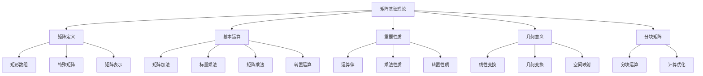

# 第5章：矩阵基础理论与运算

::: tip 学习目标
- 理解矩阵的定义和几何意义
- 掌握矩阵的基本运算（加法、数乘、乘法）
- 理解矩阵乘法的几何解释
- 掌握转置矩阵的性质
- 理解分块矩阵的运算规则
:::

## 矩阵的定义与表示

### 矩阵的数学定义

**矩阵**是一个由数值排列成的矩形数组。一个 $m \times n$ 矩阵 $A$ 可以表示为：

$$A = \begin{bmatrix}
a_{11} & a_{12} & \cdots & a_{1n} \\
a_{21} & a_{22} & \cdots & a_{2n} \\
\vdots & \vdots & \ddots & \vdots \\
a_{m1} & a_{m2} & \cdots & a_{mn}
\end{bmatrix}$$

其中 $a_{ij}$ 表示第 $i$ 行第 $j$ 列的元素。

```python
import numpy as np
import matplotlib.pyplot as plt

def matrix_basics():
    """
    矩阵基础概念演示
    """
    print("矩阵基础概念:")
    print("=" * 30)

    # 创建不同类型的矩阵
    A = np.array([[1, 2, 3],
                  [4, 5, 6]])  # 2×3 矩阵

    B = np.array([[1, 0],
                  [0, 1]])     # 2×2 单位矩阵

    C = np.array([[1, 2, 3]])  # 1×3 行矩阵

    D = np.array([[1],
                  [2],
                  [3]])        # 3×1 列矩阵

    matrices = {
        "矩阵A (2×3)": A,
        "单位矩阵B (2×2)": B,
        "行矩阵C (1×3)": C,
        "列矩阵D (3×1)": D
    }

    for name, matrix in matrices.items():
        print(f"\n{name}:")
        print(matrix)
        print(f"形状: {matrix.shape}")
        print(f"元素总数: {matrix.size}")

    return matrices

matrices = matrix_basics()
```

### 特殊矩阵类型

```python
def special_matrices():
    """
    特殊矩阵类型
    """
    print("\n特殊矩阵类型:")
    print("=" * 25)

    # 零矩阵
    zero_matrix = np.zeros((3, 3))
    print("零矩阵:")
    print(zero_matrix)

    # 单位矩阵
    identity_matrix = np.eye(3)
    print("\n单位矩阵:")
    print(identity_matrix)

    # 对角矩阵
    diagonal_matrix = np.diag([1, 2, 3])
    print("\n对角矩阵:")
    print(diagonal_matrix)

    # 上三角矩阵
    upper_triangular = np.array([[1, 2, 3],
                                 [0, 4, 5],
                                 [0, 0, 6]])
    print("\n上三角矩阵:")
    print(upper_triangular)

    # 下三角矩阵
    lower_triangular = np.array([[1, 0, 0],
                                 [2, 3, 0],
                                 [4, 5, 6]])
    print("\n下三角矩阵:")
    print(lower_triangular)

    # 对称矩阵
    symmetric_matrix = np.array([[1, 2, 3],
                                 [2, 4, 5],
                                 [3, 5, 6]])
    print("\n对称矩阵:")
    print(symmetric_matrix)
    print(f"验证对称性: {np.allclose(symmetric_matrix, symmetric_matrix.T)}")

    return {
        "零矩阵": zero_matrix,
        "单位矩阵": identity_matrix,
        "对角矩阵": diagonal_matrix,
        "上三角矩阵": upper_triangular,
        "下三角矩阵": lower_triangular,
        "对称矩阵": symmetric_matrix
    }

special_mats = special_matrices()
```

## 矩阵的基本运算

### 矩阵加法

两个同型矩阵的加法定义为对应元素相加：
$$(A + B)_{ij} = a_{ij} + b_{ij}$$

```python
def matrix_addition():
    """
    矩阵加法演示
    """
    print("\n矩阵加法:")
    print("=" * 15)

    A = np.array([[1, 2],
                  [3, 4]])

    B = np.array([[5, 6],
                  [7, 8]])

    print("矩阵A:")
    print(A)
    print("\n矩阵B:")
    print(B)

    # 矩阵加法
    C = A + B
    print("\nA + B =")
    print(C)

    # 验证加法性质
    print("\n验证矩阵加法性质:")

    # 交换律
    print(f"交换律 A + B = B + A: {np.array_equal(A + B, B + A)}")

    # 结合律
    D = np.array([[1, 1],
                  [1, 1]])
    print(f"结合律 (A + B) + D = A + (B + D): {np.array_equal((A + B) + D, A + (B + D))}")

    # 零矩阵的作用
    zero = np.zeros_like(A)
    print(f"零矩阵 A + 0 = A: {np.array_equal(A + zero, A)}")

    return A, B, C

matrix_addition()
```

### 标量乘法

标量与矩阵的乘法定义为标量与每个元素相乘：
$$(cA)_{ij} = c \cdot a_{ij}$$

```python
def scalar_multiplication():
    """
    标量乘法演示
    """
    print("\n标量乘法:")
    print("=" * 15)

    A = np.array([[1, 2],
                  [3, 4]])

    scalars = [0, 1, 2, -1, 0.5]

    print("原矩阵A:")
    print(A)

    for c in scalars:
        result = c * A
        print(f"\n{c} * A =")
        print(result)

    # 验证标量乘法性质
    print("\n验证标量乘法性质:")
    c1, c2 = 2, 3

    # 分配律1: c(A + B) = cA + cB
    B = np.array([[5, 6], [7, 8]])
    left = c1 * (A + B)
    right = c1 * A + c1 * B
    print(f"分配律1 c(A + B) = cA + cB: {np.allclose(left, right)}")

    # 分配律2: (c1 + c2)A = c1*A + c2*A
    left = (c1 + c2) * A
    right = c1 * A + c2 * A
    print(f"分配律2 (c1 + c2)A = c1*A + c2*A: {np.allclose(left, right)}")

    # 结合律: c1(c2*A) = (c1*c2)A
    left = c1 * (c2 * A)
    right = (c1 * c2) * A
    print(f"结合律 c1(c2*A) = (c1*c2)A: {np.allclose(left, right)}")

scalar_multiplication()
```

### 矩阵乘法

矩阵乘法是线性代数中最重要的运算之一。对于 $m \times p$ 矩阵 $A$ 和 $p \times n$ 矩阵 $B$，它们的乘积是 $m \times n$ 矩阵 $C$，其中：

$$(AB)_{ij} = \sum_{k=1}^{p} a_{ik}b_{kj}$$

```python
def matrix_multiplication():
    """
    矩阵乘法详细演示
    """
    print("\n矩阵乘法:")
    print("=" * 15)

    # 定义两个可以相乘的矩阵
    A = np.array([[1, 2, 3],
                  [4, 5, 6]])  # 2×3

    B = np.array([[7, 8],
                  [9, 10],
                  [11, 12]])   # 3×2

    print("矩阵A (2×3):")
    print(A)
    print("\n矩阵B (3×2):")
    print(B)

    # 矩阵乘法
    C = A @ B  # 或者 np.dot(A, B)
    print(f"\nA × B (结果: 2×2):")
    print(C)

    # 手动计算第一个元素验证
    c11_manual = A[0, 0] * B[0, 0] + A[0, 1] * B[1, 0] + A[0, 2] * B[2, 0]
    print(f"\n手动计算 C[0,0]: {A[0, 0]}×{B[0, 0]} + {A[0, 1]}×{B[1, 0]} + {A[0, 2]}×{B[2, 0]} = {c11_manual}")
    print(f"实际结果 C[0,0]: {C[0, 0]}")

    # 展示矩阵乘法的非交换性
    print(f"\n矩阵乘法的非交换性:")
    print(f"A的形状: {A.shape}, B的形状: {B.shape}")
    print(f"A × B 的形状: {C.shape}")

    try:
        BA = B @ A
        print(f"B × A 的形状: {BA.shape}")
        print("B × A =")
        print(BA)
        print(f"A × B ≠ B × A: {not np.array_equal(C, BA)}")
    except ValueError as e:
        print(f"B × A 无法计算，因为维度不匹配")

    return A, B, C

matrix_multiplication()
```

### 矩阵乘法的几何解释

```python
def geometric_interpretation_matrix_mult():
    """
    矩阵乘法的几何解释
    """
    print("\n矩阵乘法的几何解释:")
    print("=" * 30)

    # 2D变换矩阵示例
    # 旋转矩阵
    theta = np.pi / 4  # 45度
    rotation_matrix = np.array([[np.cos(theta), -np.sin(theta)],
                                [np.sin(theta), np.cos(theta)]])

    # 缩放矩阵
    scaling_matrix = np.array([[2, 0],
                               [0, 1.5]])

    print(f"旋转矩阵 (45度):")
    print(rotation_matrix)
    print(f"\n缩放矩阵 (x轴2倍, y轴1.5倍):")
    print(scaling_matrix)

    # 原始向量
    original_vectors = np.array([[1, 0, 1, 0],    # x坐标
                                 [0, 1, 1, 1]])   # y坐标

    print(f"\n原始向量组:")
    print(original_vectors)

    # 应用变换
    rotated = rotation_matrix @ original_vectors
    scaled = scaling_matrix @ original_vectors
    combined = scaling_matrix @ rotation_matrix @ original_vectors

    # 可视化变换
    fig, axes = plt.subplots(2, 2, figsize=(12, 10))

    # 原始向量
    axes[0, 0].scatter(original_vectors[0], original_vectors[1], c='blue', s=100, label='原始点')
    axes[0, 0].set_xlim(-3, 3)
    axes[0, 0].set_ylim(-3, 3)
    axes[0, 0].grid(True, alpha=0.3)
    axes[0, 0].set_title('原始向量')
    axes[0, 0].legend()
    axes[0, 0].set_aspect('equal')

    # 旋转后
    axes[0, 1].scatter(rotated[0], rotated[1], c='red', s=100, label='旋转后')
    axes[0, 1].scatter(original_vectors[0], original_vectors[1], c='blue', s=50, alpha=0.5, label='原始')
    axes[0, 1].set_xlim(-3, 3)
    axes[0, 1].set_ylim(-3, 3)
    axes[0, 1].grid(True, alpha=0.3)
    axes[0, 1].set_title('旋转变换')
    axes[0, 1].legend()
    axes[0, 1].set_aspect('equal')

    # 缩放后
    axes[1, 0].scatter(scaled[0], scaled[1], c='green', s=100, label='缩放后')
    axes[1, 0].scatter(original_vectors[0], original_vectors[1], c='blue', s=50, alpha=0.5, label='原始')
    axes[1, 0].set_xlim(-3, 3)
    axes[1, 0].set_ylim(-3, 3)
    axes[1, 0].grid(True, alpha=0.3)
    axes[1, 0].set_title('缩放变换')
    axes[1, 0].legend()
    axes[1, 0].set_aspect('equal')

    # 组合变换
    axes[1, 1].scatter(combined[0], combined[1], c='purple', s=100, label='先旋转后缩放')
    axes[1, 1].scatter(original_vectors[0], original_vectors[1], c='blue', s=50, alpha=0.5, label='原始')
    axes[1, 1].set_xlim(-3, 3)
    axes[1, 1].set_ylim(-3, 3)
    axes[1, 1].grid(True, alpha=0.3)
    axes[1, 1].set_title('组合变换')
    axes[1, 1].legend()
    axes[1, 1].set_aspect('equal')

    plt.tight_layout()
    plt.show()

    print(f"\n变换结果:")
    print(f"旋转后: {rotated}")
    print(f"缩放后: {scaled}")
    print(f"组合变换 (先旋转后缩放): {combined}")

geometric_interpretation_matrix_mult()
```

## 矩阵乘法的性质

### 重要性质

```python
def matrix_multiplication_properties():
    """
    矩阵乘法性质验证
    """
    print("\n矩阵乘法性质验证:")
    print("=" * 30)

    A = np.array([[1, 2], [3, 4]])
    B = np.array([[5, 6], [7, 8]])
    C = np.array([[9, 10], [11, 12]])
    I = np.eye(2)  # 单位矩阵

    print("测试矩阵:")
    print(f"A = \n{A}")
    print(f"B = \n{B}")
    print(f"C = \n{C}")
    print(f"I = \n{I}")

    # 1. 结合律: (AB)C = A(BC)
    left = (A @ B) @ C
    right = A @ (B @ C)
    print(f"\n1. 结合律 (AB)C = A(BC): {np.allclose(left, right)}")

    # 2. 单位矩阵的性质: AI = IA = A
    print(f"2. 单位矩阵 AI = A: {np.allclose(A @ I, A)}")
    print(f"   单位矩阵 IA = A: {np.allclose(I @ A, A)}")

    # 3. 分配律: A(B + C) = AB + AC
    left = A @ (B + C)
    right = (A @ B) + (A @ C)
    print(f"3. 左分配律 A(B + C) = AB + AC: {np.allclose(left, right)}")

    # (B + C)A = BA + CA
    left = (B + C) @ A
    right = (B @ A) + (C @ A)
    print(f"   右分配律 (B + C)A = BA + CA: {np.allclose(left, right)}")

    # 4. 标量乘法的兼容性: c(AB) = (cA)B = A(cB)
    c = 3
    result1 = c * (A @ B)
    result2 = (c * A) @ B
    result3 = A @ (c * B)
    print(f"4. 标量兼容性 c(AB) = (cA)B = A(cB): {np.allclose(result1, result2) and np.allclose(result2, result3)}")

    # 5. 零矩阵的性质
    zero = np.zeros_like(A)
    print(f"5. 零矩阵 A × 0 = 0: {np.allclose(A @ zero, zero)}")
    print(f"   零矩阵 0 × A = 0: {np.allclose(zero @ A, zero)}")

matrix_multiplication_properties()
```

### 矩阵乘法的计算复杂度

```python
def matrix_multiplication_complexity():
    """
    矩阵乘法计算复杂度分析
    """
    print("\n矩阵乘法计算复杂度:")
    print("=" * 30)

    import time

    # 测试不同大小矩阵的乘法时间
    sizes = [10, 50, 100, 200]
    times = []

    for n in sizes:
        A = np.random.rand(n, n)
        B = np.random.rand(n, n)

        start_time = time.time()
        C = A @ B
        end_time = time.time()

        elapsed = end_time - start_time
        times.append(elapsed)

        operations = 2 * n**3  # 近似操作数 (n^3次乘法和n^3次加法)
        print(f"矩阵大小 {n}×{n}: 时间 {elapsed:.4f}s, 操作数 ≈ {operations:,}")

    # 绘制复杂度图
    plt.figure(figsize=(10, 6))
    plt.plot(sizes, times, 'bo-', label='实际时间')

    # 理论O(n^3)曲线（归一化）
    theoretical = [(n/sizes[0])**3 * times[0] for n in sizes]
    plt.plot(sizes, theoretical, 'r--', label='理论 O(n³)')

    plt.xlabel('矩阵大小 n')
    plt.ylabel('计算时间 (秒)')
    plt.title('矩阵乘法时间复杂度')
    plt.legend()
    plt.grid(True, alpha=0.3)
    plt.show()

    print(f"\n矩阵乘法的时间复杂度为 O(n³)")
    print(f"空间复杂度为 O(n²)")

matrix_multiplication_complexity()
```

## 转置矩阵

### 转置的定义与性质

转置矩阵 $A^T$ 是将矩阵 $A$ 的行和列互换得到的矩阵：
$$(A^T)_{ij} = a_{ji}$$

```python
def matrix_transpose():
    """
    矩阵转置演示
    """
    print("\n矩阵转置:")
    print("=" * 15)

    A = np.array([[1, 2, 3],
                  [4, 5, 6]])

    print("原矩阵A:")
    print(A)
    print(f"形状: {A.shape}")

    A_T = A.T
    print("\n转置矩阵A^T:")
    print(A_T)
    print(f"形状: {A_T.shape}")

    # 验证转置的性质
    B = np.array([[7, 8],
                  [9, 10],
                  [11, 12]])

    print("\n转置性质验证:")

    # 1. (A^T)^T = A
    print(f"1. (A^T)^T = A: {np.array_equal((A.T).T, A)}")

    # 2. (A + B)^T = A^T + B^T (需要同型矩阵)
    C = np.array([[1, 2, 3],
                  [4, 5, 6]])
    D = np.array([[7, 8, 9],
                  [10, 11, 12]])

    left = (C + D).T
    right = C.T + D.T
    print(f"2. (A + B)^T = A^T + B^T: {np.array_equal(left, right)}")

    # 3. (cA)^T = cA^T
    c = 3
    left = (c * A).T
    right = c * A.T
    print(f"3. (cA)^T = cA^T: {np.array_equal(left, right)}")

    # 4. (AB)^T = B^T A^T
    E = np.array([[1, 2],
                  [3, 4]])
    F = np.array([[5, 6],
                  [7, 8]])

    left = (E @ F).T
    right = F.T @ E.T
    print(f"4. (AB)^T = B^T A^T: {np.array_equal(left, right)}")

    return A, A_T

matrix_transpose()
```

### 对称矩阵与反对称矩阵

```python
def symmetric_matrices():
    """
    对称矩阵和反对称矩阵
    """
    print("\n对称矩阵和反对称矩阵:")
    print("=" * 35)

    # 对称矩阵: A = A^T
    symmetric = np.array([[1, 2, 3],
                          [2, 4, 5],
                          [3, 5, 6]])

    print("对称矩阵:")
    print(symmetric)
    print(f"验证对称性 A = A^T: {np.allclose(symmetric, symmetric.T)}")

    # 反对称矩阵: A = -A^T
    antisymmetric = np.array([[0, 1, -2],
                              [-1, 0, 3],
                              [2, -3, 0]])

    print(f"\n反对称矩阵:")
    print(antisymmetric)
    print(f"验证反对称性 A = -A^T: {np.allclose(antisymmetric, -antisymmetric.T)}")

    # 任意矩阵可以分解为对称和反对称部分
    A = np.array([[1, 2, 3],
                  [4, 5, 6],
                  [7, 8, 9]])

    symmetric_part = (A + A.T) / 2
    antisymmetric_part = (A - A.T) / 2

    print(f"\n任意矩阵的分解:")
    print(f"原矩阵A:")
    print(A)
    print(f"\n对称部分 (A + A^T)/2:")
    print(symmetric_part)
    print(f"\n反对称部分 (A - A^T)/2:")
    print(antisymmetric_part)
    print(f"\n验证分解 A = 对称部分 + 反对称部分:")
    print(f"重构矩阵:")
    print(symmetric_part + antisymmetric_part)
    print(f"分解正确: {np.allclose(A, symmetric_part + antisymmetric_part)}")

symmetric_matrices()
```

## 分块矩阵

### 分块矩阵的概念

```python
def block_matrices():
    """
    分块矩阵演示
    """
    print("\n分块矩阵:")
    print("=" * 15)

    # 创建一个大矩阵，然后分块
    A = np.array([[1, 2, 5, 6],
                  [3, 4, 7, 8],
                  [9, 10, 13, 14],
                  [11, 12, 15, 16]])

    print("原矩阵A (4×4):")
    print(A)

    # 分块为2×2的子矩阵
    A11 = A[:2, :2]
    A12 = A[:2, 2:]
    A21 = A[2:, :2]
    A22 = A[2:, 2:]

    print(f"\n分块矩阵:")
    print(f"A11 = \n{A11}")
    print(f"A12 = \n{A12}")
    print(f"A21 = \n{A21}")
    print(f"A22 = \n{A22}")

    # 验证分块表示
    reconstructed = np.block([[A11, A12],
                              [A21, A22]])
    print(f"\n重构矩阵:")
    print(reconstructed)
    print(f"重构正确: {np.array_equal(A, reconstructed)}")

    return A11, A12, A21, A22

block_matrices()
```

### 分块矩阵运算

```python
def block_matrix_operations():
    """
    分块矩阵运算
    """
    print("\n分块矩阵运算:")
    print("=" * 20)

    # 定义两个分块矩阵
    A11 = np.array([[1, 2], [3, 4]])
    A12 = np.array([[5, 6], [7, 8]])
    A21 = np.array([[9, 10], [11, 12]])
    A22 = np.array([[13, 14], [15, 16]])

    B11 = np.array([[1, 0], [0, 1]])
    B12 = np.array([[2, 1], [1, 2]])
    B21 = np.array([[1, 1], [1, 1]])
    B22 = np.array([[3, 2], [2, 3]])

    # 构造完整矩阵
    A = np.block([[A11, A12],
                  [A21, A22]])

    B = np.block([[B11, B12],
                  [B21, B22]])

    print(f"矩阵A:")
    print(A)
    print(f"\n矩阵B:")
    print(B)

    # 分块矩阵乘法
    # (A11 A12) × (B11 B12) = (A11B11 + A12B21  A11B12 + A12B22)
    # (A21 A22)   (B21 B22)   (A21B11 + A22B21  A21B12 + A22B22)

    C11_block = A11 @ B11 + A12 @ B21
    C12_block = A11 @ B12 + A12 @ B22
    C21_block = A21 @ B11 + A22 @ B21
    C22_block = A21 @ B12 + A22 @ B22

    C_block = np.block([[C11_block, C12_block],
                        [C21_block, C22_block]])

    # 直接矩阵乘法
    C_direct = A @ B

    print(f"\n分块乘法结果:")
    print(C_block)
    print(f"\n直接乘法结果:")
    print(C_direct)
    print(f"\n结果一致: {np.allclose(C_block, C_direct)}")

    # 分块矩阵的优势：处理大型稀疏矩阵
    print(f"\n分块矩阵的优势:")
    print(f"- 处理大型矩阵时节省内存")
    print(f"- 利用稀疏结构提高计算效率")
    print(f"- 并行计算友好")

block_matrix_operations()
```

## 矩阵的几何意义

### 矩阵作为线性变换

```python
def matrix_as_linear_transformation():
    """
    矩阵作为线性变换的几何意义
    """
    print("\n矩阵作为线性变换:")
    print("=" * 25)

    # 定义几种常见的2D线性变换
    transformations = {
        "恒等变换": np.array([[1, 0], [0, 1]]),
        "水平翻转": np.array([[-1, 0], [0, 1]]),
        "垂直翻转": np.array([[1, 0], [0, -1]]),
        "旋转90度": np.array([[0, -1], [1, 0]]),
        "缩放": np.array([[2, 0], [0, 0.5]]),
        "切变": np.array([[1, 1], [0, 1]]),
        "投影到x轴": np.array([[1, 0], [0, 0]])
    }

    # 原始向量（正方形的顶点）
    original_points = np.array([[0, 1, 1, 0, 0],
                                [0, 0, 1, 1, 0]])

    fig, axes = plt.subplots(2, 4, figsize=(16, 8))
    axes = axes.flatten()

    for i, (name, transform) in enumerate(transformations.items()):
        if i >= len(axes):
            break

        # 应用变换
        transformed_points = transform @ original_points

        axes[i].plot(original_points[0], original_points[1], 'b-o', label='原始', alpha=0.7)
        axes[i].plot(transformed_points[0], transformed_points[1], 'r-s', label='变换后')

        axes[i].set_xlim(-2.5, 2.5)
        axes[i].set_ylim(-2.5, 2.5)
        axes[i].grid(True, alpha=0.3)
        axes[i].set_aspect('equal')
        axes[i].set_title(name)
        axes[i].legend()

        print(f"{name}矩阵:")
        print(transform)
        print()

    plt.tight_layout()
    plt.show()

matrix_as_linear_transformation()
```

### 列空间和行空间

```python
def column_and_row_spaces():
    """
    矩阵的列空间和行空间
    """
    print("\n矩阵的列空间和行空间:")
    print("=" * 30)

    A = np.array([[1, 2, 3],
                  [4, 5, 6],
                  [7, 8, 9]])

    print("矩阵A:")
    print(A)

    # 列空间：矩阵各列的线性组合
    print(f"\n列向量:")
    for i in range(A.shape[1]):
        print(f"第{i+1}列: {A[:, i]}")

    # 行空间：矩阵各行的线性组合
    print(f"\n行向量:")
    for i in range(A.shape[0]):
        print(f"第{i+1}行: {A[i, :]}")

    # 计算矩阵的秩
    rank = np.linalg.matrix_rank(A)
    print(f"\n矩阵的秩: {rank}")
    print(f"列空间的维数: {rank}")
    print(f"行空间的维数: {rank}")

    # 对于这个特殊的矩阵，第三行 = 2×第二行 - 第一行
    row3_check = 2 * A[1, :] - A[0, :]
    print(f"\n线性相关性检查:")
    print(f"2×第2行 - 第1行 = {row3_check}")
    print(f"第3行 = {A[2, :]}")
    print(f"第3行线性相关: {np.allclose(row3_check, A[2, :])}")

column_and_row_spaces()
```

## 本章小结



本章系统学习了矩阵的基础理论和运算：

| 概念 | 核心内容 | 重要性质 | 应用场景 |
|------|----------|----------|----------|
| 矩阵加法 | 对应元素相加 | 交换律、结合律 | 向量空间运算 |
| 标量乘法 | 每个元素乘标量 | 分配律、结合律 | 线性组合 |
| 矩阵乘法 | 行列内积 | 结合律、分配律 | 线性变换复合 |
| 转置 | 行列互换 | $(AB)^T = B^TA^T$ | 对称性分析 |
| 分块矩阵 | 子矩阵运算 | 分块运算法则 | 大规模计算 |

::: tip 关键理解
- 矩阵不仅是数的排列，更是线性变换的表示
- 矩阵乘法对应线性变换的复合
- 转置运算揭示了行空间和列空间的对偶性
- 分块矩阵提供了处理大型矩阵的有效方法
:::

::: warning 注意事项
- 矩阵乘法不满足交换律：$AB \neq BA$（一般情况）
- 矩阵乘法的维度要求：$(m \times p) \times (p \times n) = (m \times n)$
- 转置运算的顺序：$(AB)^T = B^TA^T$（注意顺序颠倒）
:::

通过本章学习，我们掌握了矩阵运算的基本技能，为后续学习线性方程组、行列式、线性变换等内容奠定了坚实基础。矩阵理论是线性代数的核心工具，在数据科学、机器学习、工程计算等领域都有广泛应用。