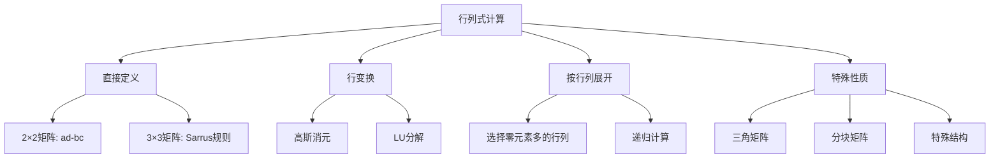

# 第8章：行列式深入理论

::: tip 学习目标
- 深入理解行列式的性质
- 掌握行列式按行按列展开
- 理解行列式的代数余子式
- 掌握克拉默法则
- 理解行列式与体积的关系
:::

## 行列式的几何意义

### 二维情况：面积
对于 $2 \times 2$ 矩阵：
$$A = \begin{pmatrix} a & b \\ c & d \end{pmatrix}$$

行列式 $\det(A) = ad - bc$ 表示由向量 $(a,c)$ 和 $(b,d)$ 构成的平行四边形的**有向面积**。

### 三维情况：体积
对于 $3 \times 3$ 矩阵，行列式表示由三个向量构成的平行六面体的**有向体积**。

```python
import numpy as np
import matplotlib.pyplot as plt
from mpl_toolkits.mplot3d import Axes3D
import matplotlib.patches as patches

# 演示行列式的几何意义
fig = plt.figure(figsize=(15, 5))

# 2D情况：平行四边形面积
ax1 = fig.add_subplot(131)
A = np.array([[3, 1], [1, 2]])
det_A = np.linalg.det(A)

# 绘制向量和平行四边形
origin = [0, 0]
v1 = A[:, 0]  # [3, 1]
v2 = A[:, 1]  # [1, 2]

# 平行四边形的四个顶点
vertices = np.array([[0, 0], v1, v1 + v2, v2, [0, 0]])

ax1.plot(vertices[:, 0], vertices[:, 1], 'b-', linewidth=2)
ax1.fill(vertices[:-1, 0], vertices[:-1, 1], alpha=0.3, color='lightblue')
ax1.arrow(0, 0, v1[0], v1[1], head_width=0.1, head_length=0.1, fc='red', ec='red')
ax1.arrow(0, 0, v2[0], v2[1], head_width=0.1, head_length=0.1, fc='green', ec='green')
ax1.set_xlim(-1, 5)
ax1.set_ylim(-1, 4)
ax1.grid(True)
ax1.set_title(f'2D: 面积 = det(A) = {det_A:.2f}')
ax1.set_xlabel('x')
ax1.set_ylabel('y')

# 3D情况：平行六面体体积
ax2 = fig.add_subplot(132, projection='3d')
B = np.array([[2, 1, 0], [0, 2, 1], [1, 0, 2]])
det_B = np.linalg.det(B)

# 绘制三个向量
origin = [0, 0, 0]
v1_3d = B[:, 0]
v2_3d = B[:, 1]
v3_3d = B[:, 2]

ax2.quiver(0, 0, 0, v1_3d[0], v1_3d[1], v1_3d[2], color='red', arrow_length_ratio=0.1)
ax2.quiver(0, 0, 0, v2_3d[0], v2_3d[1], v2_3d[2], color='green', arrow_length_ratio=0.1)
ax2.quiver(0, 0, 0, v3_3d[0], v3_3d[1], v3_3d[2], color='blue', arrow_length_ratio=0.1)

ax2.set_xlim(0, 3)
ax2.set_ylim(0, 3)
ax2.set_zlim(0, 3)
ax2.set_title(f'3D: 体积 = |det(B)| = {abs(det_B):.2f}')

# 行列式的符号意义
ax3 = fig.add_subplot(133)
# 正向和反向的例子
A_pos = np.array([[2, 1], [1, 3]])
A_neg = np.array([[2, 1], [3, 1]])

det_pos = np.linalg.det(A_pos)
det_neg = np.linalg.det(A_neg)

x = ['正向排列', '反向排列']
y = [det_pos, det_neg]
colors = ['green' if d > 0 else 'red' for d in y]

ax3.bar(x, y, color=colors, alpha=0.7)
ax3.axhline(y=0, color='black', linestyle='-', linewidth=0.5)
ax3.set_ylabel('行列式值')
ax3.set_title('行列式的符号意义')
ax3.grid(True, alpha=0.3)

plt.tight_layout()
plt.show()

print(f"2×2矩阵行列式 = {det_A:.2f}")
print(f"3×3矩阵行列式 = {det_B:.2f}")
print(f"正向排列行列式 = {det_pos:.2f}")
print(f"反向排列行列式 = {det_neg:.2f}")
```

## 行列式的性质

### 基本性质
1. **转置性质**：$\det(A^T) = \det(A)$
2. **乘积性质**：$\det(AB) = \det(A)\det(B)$
3. **逆矩阵性质**：$\det(A^{-1}) = \frac{1}{\det(A)}$（当 $A$ 可逆时）
4. **三角矩阵**：上三角或下三角矩阵的行列式等于对角元素的乘积

### 行列式的行变换性质

```python
import numpy as np

def demonstrate_determinant_properties():
    """演示行列式的各种性质"""

    # 原始矩阵
    A = np.array([[2, 1, 3],
                  [1, 4, 2],
                  [3, 2, 1]], dtype=float)

    print("原始矩阵 A:")
    print(A)
    print(f"det(A) = {np.linalg.det(A):.4f}")
    print()

    # 性质1：交换两行，行列式变号
    A1 = A.copy()
    A1[[0, 1]] = A1[[1, 0]]  # 交换第1行和第2行
    print("交换第1行和第2行:")
    print(A1)
    print(f"det(A1) = {np.linalg.det(A1):.4f}")
    print(f"det(A1) = -det(A)? {np.isclose(np.linalg.det(A1), -np.linalg.det(A))}")
    print()

    # 性质2：某一行乘以常数k，行列式也乘以k
    A2 = A.copy()
    k = 3
    A2[0] = k * A2[0]  # 第1行乘以3
    print(f"第1行乘以{k}:")
    print(A2)
    print(f"det(A2) = {np.linalg.det(A2):.4f}")
    print(f"det(A2) = {k} × det(A)? {np.isclose(np.linalg.det(A2), k * np.linalg.det(A))}")
    print()

    # 性质3：某一行加上另一行的k倍，行列式不变
    A3 = A.copy()
    A3[1] = A3[1] + 2 * A3[0]  # 第2行加上第1行的2倍
    print("第2行加上第1行的2倍:")
    print(A3)
    print(f"det(A3) = {np.linalg.det(A3):.4f}")
    print(f"det(A3) = det(A)? {np.isclose(np.linalg.det(A3), np.linalg.det(A))}")
    print()

    # 性质4：如果有两行相同，行列式为0
    A4 = A.copy()
    A4[1] = A4[0]  # 第2行等于第1行
    print("第2行等于第1行:")
    print(A4)
    print(f"det(A4) = {np.linalg.det(A4):.4f}")

demonstrate_determinant_properties()
```

## 代数余子式与余因子

### 定义
对于 $n \times n$ 矩阵 $A$，元素 $a_{ij}$ 的**代数余子式** $A_{ij}$ 定义为：
$$A_{ij} = (-1)^{i+j} M_{ij}$$

其中 $M_{ij}$ 是删除第 $i$ 行第 $j$ 列后得到的 $(n-1) \times (n-1)$ 子矩阵的行列式。

### 按行展开公式
$$\det(A) = \sum_{j=1}^n a_{ij} A_{ij} \quad \text{(按第i行展开)}$$

### 按列展开公式
$$\det(A) = \sum_{i=1}^n a_{ij} A_{ij} \quad \text{(按第j列展开)}$$

```python
def cofactor_expansion_demo():
    """演示代数余子式和按行列展开"""

    A = np.array([[2, 1, 3],
                  [0, 4, 2],
                  [1, 2, 1]])

    print("矩阵 A:")
    print(A)
    print(f"标准计算: det(A) = {np.linalg.det(A):.4f}")
    print()

    # 按第1行展开
    print("按第1行展开:")
    det_row1 = 0
    for j in range(3):
        # 计算代数余子式
        minor = np.delete(np.delete(A, 0, axis=0), j, axis=1)
        cofactor = ((-1)**(0+j)) * np.linalg.det(minor)
        term = A[0, j] * cofactor
        det_row1 += term
        print(f"a_{1}{j+1} × A_{1}{j+1} = {A[0, j]} × {cofactor:.4f} = {term:.4f}")

    print(f"按第1行展开结果: {det_row1:.4f}")
    print()

    # 按第2列展开（包含更多零元素的列）
    print("按第2列展开:")
    det_col2 = 0
    for i in range(3):
        minor = np.delete(np.delete(A, i, axis=0), 1, axis=1)
        cofactor = ((-1)**(i+1)) * np.linalg.det(minor)
        term = A[i, 1] * cofactor
        det_col2 += term
        print(f"a_{i+1}2 × A_{i+1}2 = {A[i, 1]} × {cofactor:.4f} = {term:.4f}")

    print(f"按第2列展开结果: {det_col2:.4f}")

cofactor_expansion_demo()
```

## 克拉默法则

对于线性方程组 $Ax = b$，当 $\det(A) \neq 0$ 时，方程组有唯一解：
$$x_i = \frac{\det(A_i)}{\det(A)}$$

其中 $A_i$ 是将矩阵 $A$ 的第 $i$ 列替换为向量 $b$ 得到的矩阵。

```python
def cramers_rule_demo():
    """演示克拉默法则"""

    # 线性方程组: 2x + y + 3z = 9
    #            x + 4y + 2z = 16
    #            3x + 2y + z = 10

    A = np.array([[2, 1, 3],
                  [1, 4, 2],
                  [3, 2, 1]], dtype=float)

    b = np.array([9, 16, 10])

    print("线性方程组 Ax = b:")
    print("2x + y + 3z = 9")
    print("x + 4y + 2z = 16")
    print("3x + 2y + z = 10")
    print()

    det_A = np.linalg.det(A)
    print(f"det(A) = {det_A:.4f}")

    if abs(det_A) > 1e-10:
        print("det(A) ≠ 0，方程组有唯一解")
        print()

        # 使用克拉默法则求解
        solution_cramer = np.zeros(3)

        for i in range(3):
            # 构造矩阵A_i
            A_i = A.copy()
            A_i[:, i] = b

            det_A_i = np.linalg.det(A_i)
            solution_cramer[i] = det_A_i / det_A

            print(f"A_{i+1} (第{i+1}列替换为b):")
            print(A_i)
            print(f"det(A_{i+1}) = {det_A_i:.4f}")
            print(f"x_{i+1} = det(A_{i+1})/det(A) = {solution_cramer[i]:.4f}")
            print()

        # 验证解
        solution_numpy = np.linalg.solve(A, b)

        print("克拉默法则解:", solution_cramer)
        print("NumPy求解结果:", solution_numpy)
        print("验证 Ax =", A @ solution_cramer)
        print("原始 b =", b)

    else:
        print("det(A) = 0，方程组无唯一解")

cramers_rule_demo()
```

## 特殊矩阵的行列式

### 分块矩阵的行列式

```python
def block_matrix_determinant():
    """分块矩阵行列式的计算"""

    # 对于分块矩阵 [[A, B], [0, D]]，det = det(A) × det(D)
    A = np.array([[2, 1], [1, 3]])
    B = np.array([[1, 2], [0, 1]])
    C = np.array([[0, 0], [0, 0]])  # 零矩阵
    D = np.array([[4, 1], [2, 3]])

    # 构造分块矩阵
    block_matrix = np.block([[A, B], [C, D]])

    print("分块矩阵:")
    print(block_matrix)
    print()

    det_full = np.linalg.det(block_matrix)
    det_A = np.linalg.det(A)
    det_D = np.linalg.det(D)

    print(f"完整矩阵行列式: {det_full:.4f}")
    print(f"det(A) = {det_A:.4f}")
    print(f"det(D) = {det_D:.4f}")
    print(f"det(A) × det(D) = {det_A * det_D:.4f}")
    print(f"验证公式: {np.isclose(det_full, det_A * det_D)}")

block_matrix_determinant()
```

## 行列式的计算技巧

### 利用行变换简化计算

```python
def efficient_determinant_calculation():
    """高效计算行列式的方法"""

    A = np.array([[1, 2, 3, 4],
                  [2, 1, 4, 3],
                  [3, 4, 1, 2],
                  [4, 3, 2, 1]], dtype=float)

    print("原始矩阵:")
    print(A)
    print(f"直接计算: det(A) = {np.linalg.det(A):.4f}")
    print()

    # 手动高斯消元过程
    A_work = A.copy()
    det_multiplier = 1  # 记录行变换对行列式的影响

    print("高斯消元过程:")
    for i in range(4):
        # 选择主元
        pivot_row = i + np.argmax(np.abs(A_work[i:, i]))

        if pivot_row != i:
            # 交换行
            A_work[[i, pivot_row]] = A_work[[pivot_row, i]]
            det_multiplier *= -1  # 交换行，行列式变号
            print(f"交换第{i+1}行和第{pivot_row+1}行，行列式变号")

        # 消元
        for j in range(i+1, 4):
            if A_work[i, i] != 0:
                factor = A_work[j, i] / A_work[i, i]
                A_work[j] = A_work[j] - factor * A_work[i]

        print(f"第{i+1}步消元后:")
        print(A_work)
        print()

    # 上三角矩阵的行列式是对角元的乘积
    det_triangular = np.prod(np.diag(A_work)) * det_multiplier

    print(f"上三角矩阵对角元乘积: {np.prod(np.diag(A_work)):.4f}")
    print(f"考虑行交换后的行列式: {det_triangular:.4f}")

    # 使用LU分解验证
    from scipy.linalg import lu
    P, L, U = lu(A)
    det_lu = np.linalg.det(P) * np.prod(np.diag(U))
    print(f"LU分解计算结果: {det_lu:.4f}")

efficient_determinant_calculation()
```

## 行列式的应用实例

### 面积和体积计算

```python
def area_volume_applications():
    """行列式在面积体积计算中的应用"""

    # 1. 三角形面积
    # 三个顶点: A(1,2), B(4,6), C(7,2)
    vertices = np.array([[1, 2, 1],
                         [4, 6, 1],
                         [7, 2, 1]])

    triangle_area = 0.5 * abs(np.linalg.det(vertices))
    print(f"三角形面积 = 1/2 × |det| = {triangle_area:.2f}")

    # 2. 四面体体积
    # 四个顶点: O(0,0,0), A(1,2,1), B(2,1,3), C(1,3,2)
    tetrahedron = np.array([[1, 2, 1],
                           [2, 1, 3],
                           [1, 3, 2]])

    tetrahedron_volume = abs(np.linalg.det(tetrahedron)) / 6
    print(f"四面体体积 = |det|/6 = {tetrahedron_volume:.2f}")

    # 3. 可视化
    fig = plt.figure(figsize=(12, 5))

    # 三角形
    ax1 = fig.add_subplot(121)
    triangle_x = [1, 4, 7, 1]
    triangle_y = [2, 6, 2, 2]
    ax1.plot(triangle_x, triangle_y, 'b-o', linewidth=2, markersize=8)
    ax1.fill(triangle_x[:-1], triangle_y[:-1], alpha=0.3, color='lightblue')
    ax1.set_title(f'三角形面积 = {triangle_area:.2f}')
    ax1.grid(True)
    ax1.set_xlabel('x')
    ax1.set_ylabel('y')

    # 向量叉积的几何意义
    ax2 = fig.add_subplot(122)
    v1 = np.array([3, 2])  # 从A到B的向量
    v2 = np.array([2, -1])  # 从某点出发的另一个向量

    # 绘制向量
    ax2.quiver(0, 0, v1[0], v1[1], angles='xy', scale_units='xy', scale=1, color='red', width=0.005)
    ax2.quiver(0, 0, v2[0], v2[1], angles='xy', scale_units='xy', scale=1, color='blue', width=0.005)

    # 叉积的大小等于平行四边形面积
    cross_product = v1[0] * v2[1] - v1[1] * v2[0]
    vertices_para = np.array([[0, 0], v1, v1 + v2, v2, [0, 0]])
    ax2.plot(vertices_para[:, 0], vertices_para[:, 1], 'g-', alpha=0.7)
    ax2.fill(vertices_para[:-1, 0], vertices_para[:-1, 1], alpha=0.2, color='green')

    ax2.set_title(f'叉积 = {cross_product:.2f}')
    ax2.grid(True)
    ax2.set_xlabel('x')
    ax2.set_ylabel('y')
    ax2.set_xlim(-1, 4)
    ax2.set_ylim(-2, 3)

    plt.tight_layout()
    plt.show()

area_volume_applications()
```

## 本章总结

### 重要概念回顾

| 概念 | 定义 | 几何意义 |
|------|------|----------|
| 行列式 | $\det(A)$ | n维平行多面体的有向体积 |
| 代数余子式 | $A_{ij} = (-1)^{i+j}M_{ij}$ | 用于按行列展开 |
| 克拉默法则 | $x_i = \frac{\det(A_i)}{\det(A)}$ | 线性方程组的显式解 |

### 计算方法总结



### 应用领域

1. **几何应用**：面积、体积、叉积计算
2. **线性方程组**：克拉默法则求解
3. **矩阵理论**：可逆性判定、特征值计算
4. **微积分**：雅可比行列式、变量替换
5. **物理学**：角动量、磁场、流体力学

行列式是线性代数中的核心概念，它不仅提供了计算工具，更重要的是揭示了线性变换的本质特征。掌握行列式理论为后续学习特征值、线性变换等高级主题奠定了坚实基础。