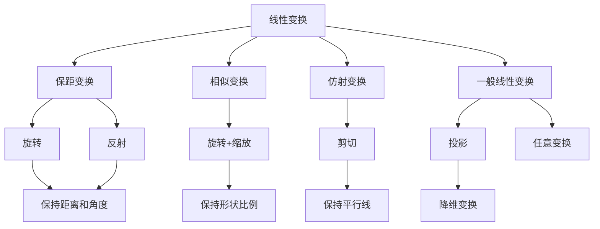

# 第9章：线性变换基础

::: tip 学习目标
- 理解线性变换的定义和性质
- 掌握线性变换的矩阵表示
- 理解线性变换的几何意义
- 掌握线性变换的核和像
- 理解线性变换与矩阵的对应关系
:::

## 线性变换的定义

### 函数视角
线性变换是一种特殊的函数，它将一个向量空间中的向量映射到另一个（或同一个）向量空间中的向量。

设 $T: V \rightarrow W$ 是从向量空间 $V$ 到向量空间 $W$ 的映射，如果对于所有 $\mathbf{u}, \mathbf{v} \in V$ 和标量 $c$，满足：

1. **加法保持性**：$T(\mathbf{u} + \mathbf{v}) = T(\mathbf{u}) + T(\mathbf{v})$
2. **标量乘法保持性**：$T(c\mathbf{v}) = cT(\mathbf{v})$

则称 $T$ 为**线性变换**（或线性映射）。

### 等价条件
线性变换可以用一个条件表示：
$$T(c_1\mathbf{v}_1 + c_2\mathbf{v}_2) = c_1T(\mathbf{v}_1) + c_2T(\mathbf{v}_2)$$

```python
import numpy as np
import matplotlib.pyplot as plt
from mpl_toolkits.mplot3d import Axes3D

def verify_linearity():
    """验证变换的线性性"""

    # 定义一个线性变换矩阵（旋转+缩放）
    A = np.array([[2, -1],
                  [1, 2]])

    # 测试向量
    v1 = np.array([1, 2])
    v2 = np.array([3, 1])
    c1, c2 = 2, -1

    # 线性组合
    linear_combination = c1 * v1 + c2 * v2

    # 方法1：先做线性组合，再变换
    T_combination = A @ linear_combination

    # 方法2：先分别变换，再做线性组合
    combination_T = c1 * (A @ v1) + c2 * (A @ v2)

    print("验证线性变换性质:")
    print(f"v1 = {v1}")
    print(f"v2 = {v2}")
    print(f"c1 = {c1}, c2 = {c2}")
    print()
    print(f"c1*v1 + c2*v2 = {linear_combination}")
    print(f"T(c1*v1 + c2*v2) = {T_combination}")
    print(f"c1*T(v1) + c2*T(v2) = {combination_T}")
    print()
    print(f"线性性验证: {np.allclose(T_combination, combination_T)}")

    return A, v1, v2

# 执行验证
A, v1, v2 = verify_linearity()
```

## 常见的线性变换

### 二维平面中的基本线性变换

```python
def basic_2d_transformations():
    """演示二维平面中的基本线性变换"""

    # 原始向量
    original_vectors = np.array([[1, 0, 2, 1],
                                [0, 1, 1, 2]])

    # 定义各种变换矩阵
    transformations = {
        '恒等变换': np.array([[1, 0], [0, 1]]),
        '水平反射': np.array([[1, 0], [0, -1]]),
        '垂直反射': np.array([[-1, 0], [0, 1]]),
        '旋转90°': np.array([[0, -1], [1, 0]]),
        '旋转45°': np.array([[np.cos(np.pi/4), -np.sin(np.pi/4)],
                           [np.sin(np.pi/4), np.cos(np.pi/4)]]),
        '缩放': np.array([[2, 0], [0, 0.5]]),
        '剪切': np.array([[1, 0.5], [0, 1]]),
        '投影到x轴': np.array([[1, 0], [0, 0]])
    }

    fig, axes = plt.subplots(2, 4, figsize=(16, 8))
    axes = axes.flatten()

    for i, (name, matrix) in enumerate(transformations.items()):
        ax = axes[i]

        # 变换后的向量
        transformed = matrix @ original_vectors

        # 绘制原始向量
        for j in range(original_vectors.shape[1]):
            ax.arrow(0, 0, original_vectors[0, j], original_vectors[1, j],
                    head_width=0.1, head_length=0.1, fc='blue', ec='blue',
                    alpha=0.5, linestyle='--')

        # 绘制变换后的向量
        for j in range(transformed.shape[1]):
            ax.arrow(0, 0, transformed[0, j], transformed[1, j],
                    head_width=0.1, head_length=0.1, fc='red', ec='red')

        ax.set_xlim(-3, 3)
        ax.set_ylim(-3, 3)
        ax.grid(True, alpha=0.3)
        ax.set_aspect('equal')
        ax.set_title(name)

        # 显示变换矩阵
        ax.text(0.02, 0.98, f'$\\begin{{bmatrix}} {matrix[0,0]:.2f} & {matrix[0,1]:.2f} \\\\ {matrix[1,0]:.2f} & {matrix[1,1]:.2f} \\end{{bmatrix}}$',
                transform=ax.transAxes, fontsize=8, verticalalignment='top',
                bbox=dict(boxstyle='round', facecolor='white', alpha=0.8))

    plt.tight_layout()
    plt.show()

basic_2d_transformations()
```

### 三维空间中的线性变换

```python
def visualize_3d_transformation():
    """可视化三维线性变换"""

    # 创建一个立方体的顶点
    cube_vertices = np.array([
        [0, 1, 1, 0, 0, 1, 1, 0],  # x坐标
        [0, 0, 1, 1, 0, 0, 1, 1],  # y坐标
        [0, 0, 0, 0, 1, 1, 1, 1]   # z坐标
    ])

    # 定义一个3D变换矩阵（旋转+缩放）
    theta = np.pi/6  # 30度
    transform_matrix = np.array([
        [2*np.cos(theta), -np.sin(theta), 0],
        [np.sin(theta), np.cos(theta), 0.5],
        [0, 0, 1.5]
    ])

    # 应用变换
    transformed_vertices = transform_matrix @ cube_vertices

    # 可视化
    fig = plt.figure(figsize=(15, 6))

    # 原始立方体
    ax1 = fig.add_subplot(121, projection='3d')
    ax1.scatter(cube_vertices[0], cube_vertices[1], cube_vertices[2],
               c='blue', s=100, alpha=0.7)

    # 绘制立方体的边
    edges = [
        [0, 1], [1, 2], [2, 3], [3, 0],  # 底面
        [4, 5], [5, 6], [6, 7], [7, 4],  # 顶面
        [0, 4], [1, 5], [2, 6], [3, 7]   # 垂直边
    ]

    for edge in edges:
        points = cube_vertices[:, edge]
        ax1.plot3D(points[0], points[1], points[2], 'b-', alpha=0.6)

    ax1.set_title('原始立方体')
    ax1.set_xlabel('X')
    ax1.set_ylabel('Y')
    ax1.set_zlabel('Z')

    # 变换后的立方体
    ax2 = fig.add_subplot(122, projection='3d')
    ax2.scatter(transformed_vertices[0], transformed_vertices[1], transformed_vertices[2],
               c='red', s=100, alpha=0.7)

    for edge in edges:
        points = transformed_vertices[:, edge]
        ax2.plot3D(points[0], points[1], points[2], 'r-', alpha=0.6)

    ax2.set_title('变换后的形状')
    ax2.set_xlabel('X')
    ax2.set_ylabel('Y')
    ax2.set_zlabel('Z')

    plt.tight_layout()
    plt.show()

    print("变换矩阵:")
    print(transform_matrix)
    print(f"\n行列式: {np.linalg.det(transform_matrix):.3f}")
    print("(行列式表示体积的缩放因子)")

visualize_3d_transformation()
```

## 线性变换的矩阵表示

### 标准基下的矩阵表示
给定线性变换 $T: \mathbb{R}^n \rightarrow \mathbb{R}^m$，其矩阵表示 $A$ 由变换作用在标准基向量上的结果构成：

$$A = [T(\mathbf{e}_1) \quad T(\mathbf{e}_2) \quad \cdots \quad T(\mathbf{e}_n)]$$

其中 $\mathbf{e}_i$ 是第 $i$ 个标准基向量。

```python
def matrix_representation_demo():
    """演示线性变换的矩阵表示"""

    # 定义一个线性变换：旋转θ角度
    theta = np.pi/3  # 60度

    def rotation_transform(vector, angle):
        """旋转变换函数"""
        cos_theta = np.cos(angle)
        sin_theta = np.sin(angle)
        rotation_matrix = np.array([[cos_theta, -sin_theta],
                                   [sin_theta, cos_theta]])
        return rotation_matrix @ vector

    # 标准基向量
    e1 = np.array([1, 0])
    e2 = np.array([0, 1])

    # 计算变换后的基向量
    T_e1 = rotation_transform(e1, theta)
    T_e2 = rotation_transform(e2, theta)

    # 构造变换矩阵
    A = np.column_stack([T_e1, T_e2])

    print("旋转变换的矩阵表示:")
    print("标准基向量:")
    print(f"e1 = {e1}")
    print(f"e2 = {e2}")
    print()
    print("变换后的基向量:")
    print(f"T(e1) = {T_e1}")
    print(f"T(e2) = {T_e2}")
    print()
    print("变换矩阵:")
    print(A)

    # 验证：任意向量的变换
    test_vector = np.array([3, 2])
    direct_transform = rotation_transform(test_vector, theta)
    matrix_transform = A @ test_vector

    print(f"\n验证向量 {test_vector}:")
    print(f"直接变换结果: {direct_transform}")
    print(f"矩阵变换结果: {matrix_transform}")
    print(f"结果一致: {np.allclose(direct_transform, matrix_transform)}")

    # 可视化
    fig, (ax1, ax2) = plt.subplots(1, 2, figsize=(12, 5))

    # 原始基向量和测试向量
    ax1.arrow(0, 0, e1[0], e1[1], head_width=0.1, head_length=0.1,
             fc='blue', ec='blue', linewidth=2, label='e1')
    ax1.arrow(0, 0, e2[0], e2[1], head_width=0.1, head_length=0.1,
             fc='green', ec='green', linewidth=2, label='e2')
    ax1.arrow(0, 0, test_vector[0], test_vector[1], head_width=0.1, head_length=0.1,
             fc='red', ec='red', linewidth=2, label='test vector')

    ax1.set_xlim(-0.5, 3.5)
    ax1.set_ylim(-0.5, 2.5)
    ax1.grid(True, alpha=0.3)
    ax1.set_aspect('equal')
    ax1.legend()
    ax1.set_title('原始向量')

    # 变换后的向量
    ax2.arrow(0, 0, T_e1[0], T_e1[1], head_width=0.1, head_length=0.1,
             fc='blue', ec='blue', linewidth=2, label='T(e1)')
    ax2.arrow(0, 0, T_e2[0], T_e2[1], head_width=0.1, head_length=0.1,
             fc='green', ec='green', linewidth=2, label='T(e2)')
    ax2.arrow(0, 0, matrix_transform[0], matrix_transform[1], head_width=0.1, head_length=0.1,
             fc='red', ec='red', linewidth=2, label='T(test vector)')

    ax2.set_xlim(-2, 2)
    ax2.set_ylim(-1, 3)
    ax2.grid(True, alpha=0.3)
    ax2.set_aspect('equal')
    ax2.legend()
    ax2.set_title(f'旋转{theta*180/np.pi:.0f}°后')

    plt.tight_layout()
    plt.show()

matrix_representation_demo()
```

## 核（Kernel）和像（Image）

### 核的定义
线性变换 $T: V \rightarrow W$ 的**核**（或零空间）定义为：
$$\ker(T) = \{\mathbf{v} \in V : T(\mathbf{v}) = \mathbf{0}\}$$

### 像的定义
线性变换 $T: V \rightarrow W$ 的**像**（或值域）定义为：
$$\text{Im}(T) = \{T(\mathbf{v}) : \mathbf{v} \in V\}$$

```python
def kernel_image_analysis():
    """分析线性变换的核和像"""

    # 定义一个变换矩阵（投影变换）
    A = np.array([[1, 2, 1],
                  [2, 4, 2],
                  [1, 2, 1]], dtype=float)

    print("变换矩阵 A:")
    print(A)
    print()

    # 计算核（零空间）
    U, s, Vt = np.linalg.svd(A)
    null_space = Vt[s < 1e-10]  # 奇异值接近0对应的右奇异向量

    print("核（零空间）的基:")
    if null_space.size > 0:
        for i, vec in enumerate(null_space):
            print(f"核向量 {i+1}: {vec}")
            # 验证
            result = A @ vec
            print(f"A × 核向量 = {result} (应该接近0)")
    else:
        print("核只包含零向量")

    print()

    # 计算像（列空间）
    rank = np.linalg.matrix_rank(A)
    print(f"矩阵的秩: {rank}")
    print("像空间（列空间）的维数等于矩阵的秩")

    # 找到列空间的基
    Q, R, P = scipy.linalg.qr(A, pivoting=True)
    column_basis = A[:, P[:rank]]

    print("\n像空间的基:")
    for i in range(rank):
        print(f"基向量 {i+1}: {column_basis[:, i]}")

    print()

    # 维数定理验证
    n = A.shape[1]  # 定义域的维数
    dim_kernel = null_space.shape[0] if null_space.size > 0 else 0
    dim_image = rank

    print("维数定理验证:")
    print(f"定义域维数: {n}")
    print(f"核的维数: {dim_kernel}")
    print(f"像的维数: {dim_image}")
    print(f"dim(V) = dim(ker(T)) + dim(Im(T)): {n} = {dim_kernel} + {dim_image}")

kernel_image_analysis()
```

## 线性变换的复合

### 复合变换的矩阵表示
如果 $T_1: V \rightarrow W$ 和 $T_2: W \rightarrow U$ 是两个线性变换，那么复合变换 $T_2 \circ T_1$ 的矩阵表示是：
$$[T_2 \circ T_1] = [T_2][T_1]$$

```python
def transformation_composition():
    """演示线性变换的复合"""

    # 定义两个变换
    # T1: 旋转45度
    theta1 = np.pi/4
    T1 = np.array([[np.cos(theta1), -np.sin(theta1)],
                   [np.sin(theta1), np.cos(theta1)]])

    # T2: 在x方向缩放2倍
    T2 = np.array([[2, 0],
                   [0, 1]])

    # 复合变换 T2 ∘ T1
    T_composite = T2 @ T1

    print("变换 T1 (旋转45°):")
    print(T1)
    print("\n变换 T2 (x方向缩放2倍):")
    print(T2)
    print("\n复合变换 T2 ∘ T1:")
    print(T_composite)

    # 测试向量
    test_vectors = np.array([[1, 0, 2, 1],
                            [0, 1, 1, 2]])

    # 分步应用变换
    step1 = T1 @ test_vectors  # 先应用T1
    step2 = T2 @ step1         # 再应用T2

    # 直接应用复合变换
    direct = T_composite @ test_vectors

    print(f"\n验证复合变换:")
    print(f"分步计算结果:\n{step2}")
    print(f"直接计算结果:\n{direct}")
    print(f"结果一致: {np.allclose(step2, direct)}")

    # 可视化
    fig, axes = plt.subplots(1, 4, figsize=(16, 4))

    stages = [
        (test_vectors, "原始向量", 'blue'),
        (step1, "旋转45°后", 'green'),
        (step2, "再缩放后", 'red'),
        (direct, "直接复合变换", 'purple')
    ]

    for i, (vectors, title, color) in enumerate(stages):
        ax = axes[i]
        for j in range(vectors.shape[1]):
            ax.arrow(0, 0, vectors[0, j], vectors[1, j],
                    head_width=0.1, head_length=0.1, fc=color, ec=color)

        ax.set_xlim(-3, 3)
        ax.set_ylim(-3, 3)
        ax.grid(True, alpha=0.3)
        ax.set_aspect('equal')
        ax.set_title(title)

    plt.tight_layout()
    plt.show()

transformation_composition()
```

## 可逆线性变换

### 可逆性条件
线性变换 $T: V \rightarrow V$ 可逆当且仅当：
1. $T$ 是双射（一一对应）
2. $\det([T]) \neq 0$
3. $\ker(T) = \{\mathbf{0}\}$

```python
def invertible_transformations():
    """分析可逆线性变换"""

    # 可逆变换示例
    A_invertible = np.array([[2, 1],
                            [1, 1]], dtype=float)

    # 不可逆变换示例（奇异矩阵）
    A_singular = np.array([[2, 4],
                          [1, 2]], dtype=float)

    transformations = {
        "可逆变换": A_invertible,
        "不可逆变换": A_singular
    }

    for name, A in transformations.items():
        print(f"\n{name}:")
        print(f"矩阵:\n{A}")

        det_A = np.linalg.det(A)
        print(f"行列式: {det_A:.4f}")

        if abs(det_A) > 1e-10:
            print("矩阵可逆")
            A_inv = np.linalg.inv(A)
            print(f"逆矩阵:\n{A_inv}")

            # 验证 AA^(-1) = I
            identity_check = A @ A_inv
            print(f"AA^(-1) =\n{identity_check}")
            print(f"是否为单位矩阵: {np.allclose(identity_check, np.eye(2))}")

        else:
            print("矩阵不可逆（奇异）")

            # 分析零空间
            U, s, Vt = np.linalg.svd(A)
            null_space = Vt[s < 1e-10]
            print(f"零空间维数: {null_space.shape[0]}")
            if null_space.shape[0] > 0:
                print(f"零空间的基: {null_space[0]}")

    # 可视化单位圆的变换
    fig, axes = plt.subplots(1, 3, figsize=(15, 5))

    # 创建单位圆
    theta = np.linspace(0, 2*np.pi, 100)
    unit_circle = np.array([np.cos(theta), np.sin(theta)])

    # 原始单位圆
    axes[0].plot(unit_circle[0], unit_circle[1], 'b-', linewidth=2)
    axes[0].set_xlim(-3, 3)
    axes[0].set_ylim(-3, 3)
    axes[0].grid(True, alpha=0.3)
    axes[0].set_aspect('equal')
    axes[0].set_title('原始单位圆')

    # 可逆变换
    transformed_invertible = A_invertible @ unit_circle
    axes[1].plot(transformed_invertible[0], transformed_invertible[1], 'g-', linewidth=2)
    axes[1].set_xlim(-3, 3)
    axes[1].set_ylim(-3, 3)
    axes[1].grid(True, alpha=0.3)
    axes[1].set_aspect('equal')
    axes[1].set_title(f'可逆变换\n(det = {det_A:.2f})')

    # 不可逆变换
    transformed_singular = A_singular @ unit_circle
    axes[2].plot(transformed_singular[0], transformed_singular[1], 'r-', linewidth=2)
    axes[2].set_xlim(-3, 3)
    axes[2].set_ylim(-3, 3)
    axes[2].grid(True, alpha=0.3)
    axes[2].set_aspect('equal')
    axes[2].set_title(f'不可逆变换\n(det = 0, 压缩到直线)')

    plt.tight_layout()
    plt.show()

invertible_transformations()
```

## 线性变换在不同基下的表示

### 坐标变换
当改变基时，线性变换的矩阵表示也会改变。如果 $P$ 是从基 $\mathcal{B}$ 到标准基的变换矩阵，那么：
$$[T]_{\mathcal{B}} = P^{-1}[T]_{\text{标准}}P$$

```python
def change_of_basis_demo():
    """演示基变换对线性变换矩阵表示的影响"""

    # 定义线性变换（在标准基下）
    T_standard = np.array([[3, 1],
                          [1, 2]], dtype=float)

    # 定义新的基
    v1 = np.array([1, 1])   # 新基的第一个向量
    v2 = np.array([1, -1])  # 新基的第二个向量
    P = np.column_stack([v1, v2])  # 变换矩阵

    print("标准基下的变换矩阵:")
    print(T_standard)
    print()

    print("新基的向量:")
    print(f"v1 = {v1}")
    print(f"v2 = {v2}")
    print(f"变换矩阵 P = {P}")
    print()

    # 计算新基下的变换矩阵
    P_inv = np.linalg.inv(P)
    T_new_basis = P_inv @ T_standard @ P

    print("新基下的变换矩阵:")
    print(f"T_new = P^(-1) × T × P =")
    print(T_new_basis)
    print()

    # 验证：对同一个向量应用变换
    test_vector_standard = np.array([2, 3])  # 标准基下的坐标

    # 标准基下的变换
    result_standard = T_standard @ test_vector_standard

    # 转换到新基下的坐标
    test_vector_new_basis = P_inv @ test_vector_standard
    result_new_basis = T_new_basis @ test_vector_new_basis

    # 转换回标准基
    result_converted_back = P @ result_new_basis

    print("验证变换结果:")
    print(f"原向量（标准基）: {test_vector_standard}")
    print(f"原向量（新基）: {test_vector_new_basis}")
    print(f"标准基下变换结果: {result_standard}")
    print(f"新基下变换后转回标准基: {result_converted_back}")
    print(f"结果一致: {np.allclose(result_standard, result_converted_back)}")

    # 可视化
    fig, (ax1, ax2) = plt.subplots(1, 2, figsize=(12, 5))

    # 标准基下的可视化
    ax1.arrow(0, 0, v1[0], v1[1], head_width=0.1, head_length=0.1,
             fc='red', ec='red', linewidth=2, label='新基 v1')
    ax1.arrow(0, 0, v2[0], v2[1], head_width=0.1, head_length=0.1,
             fc='blue', ec='blue', linewidth=2, label='新基 v2')
    ax1.arrow(0, 0, test_vector_standard[0], test_vector_standard[1],
             head_width=0.1, head_length=0.1, fc='green', ec='green',
             linewidth=2, label='测试向量')
    ax1.arrow(0, 0, result_standard[0], result_standard[1],
             head_width=0.1, head_length=0.1, fc='purple', ec='purple',
             linewidth=2, label='变换结果')

    ax1.set_xlim(-1, 8)
    ax1.set_ylim(-2, 6)
    ax1.grid(True, alpha=0.3)
    ax1.legend()
    ax1.set_title('标准基下的变换')

    # 新基下的坐标系
    ax2.arrow(0, 0, 1, 0, head_width=0.1, head_length=0.1,
             fc='red', ec='red', linewidth=2, label='新基坐标轴1')
    ax2.arrow(0, 0, 0, 1, head_width=0.1, head_length=0.1,
             fc='blue', ec='blue', linewidth=2, label='新基坐标轴2')
    ax2.arrow(0, 0, test_vector_new_basis[0], test_vector_new_basis[1],
             head_width=0.1, head_length=0.1, fc='green', ec='green',
             linewidth=2, label='测试向量（新基坐标）')
    ax2.arrow(0, 0, result_new_basis[0], result_new_basis[1],
             head_width=0.1, head_length=0.1, fc='purple', ec='purple',
             linewidth=2, label='变换结果（新基坐标）')

    ax2.set_xlim(-2, 3)
    ax2.set_ylim(-2, 3)
    ax2.grid(True, alpha=0.3)
    ax2.legend()
    ax2.set_title('新基下的变换')

    plt.tight_layout()
    plt.show()

change_of_basis_demo()
```

## 线性变换的分类

### 几何变换的分类



### 变换性质总结表

| 变换类型 | 矩阵特征 | 几何性质 | 行列式 |
|----------|----------|----------|--------|
| 旋转 | 正交矩阵，det=1 | 保持距离和角度 | 1 |
| 反射 | 正交矩阵，det=-1 | 保持距离，改变方向 | -1 |
| 缩放 | 对角矩阵 | 改变大小，保持方向 | 缩放因子乘积 |
| 剪切 | 下/上三角 | 保持面积，改变形状 | 1 |
| 投影 | 奇异矩阵 | 降维，det=0 | 0 |

## 本章总结

### 核心概念

```python
def chapter_summary():
    """本章核心概念总结"""

    concepts = {
        "线性变换定义": "T(au + bv) = aT(u) + bT(v)",
        "矩阵表示": "A = [T(e1) T(e2) ... T(en)]",
        "核": "ker(T) = {v : T(v) = 0}",
        "像": "Im(T) = {T(v) : v ∈ V}",
        "维数定理": "dim(V) = dim(ker(T)) + dim(Im(T))",
        "可逆性": "T可逆 ⟺ det(A) ≠ 0 ⟺ ker(T) = {0}"
    }

    print("线性变换核心概念:")
    print("=" * 50)
    for concept, definition in concepts.items():
        print(f"{concept}: {definition}")
        print("-" * 30)

    # 实际应用示例
    print("\n实际应用领域:")
    applications = [
        "计算机图形学：3D旋转、缩放、投影",
        "图像处理：滤波、变换、特效",
        "机器学习：主成分分析、降维",
        "物理学：坐标变换、对称性",
        "工程学：振动分析、信号处理"
    ]

    for i, app in enumerate(applications, 1):
        print(f"{i}. {app}")

chapter_summary()
```

线性变换是线性代数的核心概念之一，它将抽象的矩阵运算与几何直观完美结合。理解线性变换不仅有助于掌握后续的特征值、对角化等理论，更为实际应用提供了强大的数学工具。通过本章的学习，我们建立了从函数角度理解线性代数的重要思维方式。