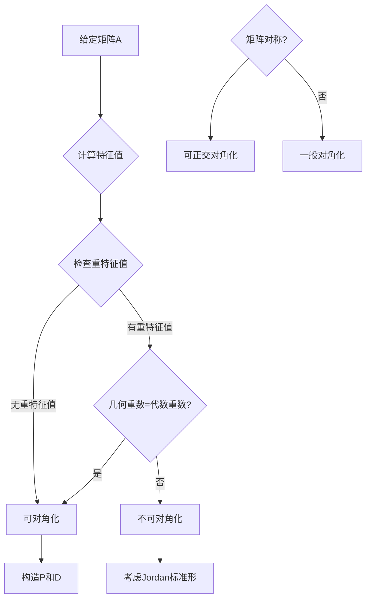

# 第11章：矩阵对角化理论

::: tip 学习目标
- 理解矩阵对角化的条件
- 掌握矩阵对角化的方法
- 理解相似矩阵的性质
- 掌握Jordan标准形的基本概念
- 理解对角化的几何意义
:::

## 矩阵对角化的基本概念

### 定义
对于 $n \times n$ 矩阵 $A$，如果存在可逆矩阵 $P$ 和对角矩阵 $D$，使得：
$$P^{-1}AP = D$$

则称矩阵 $A$ **可对角化**，$P$ 称为**对角化矩阵**。

### 对角化的等价条件
矩阵 $A$ 可对角化当且仅当：
1. $A$ 有 $n$ 个线性无关的特征向量
2. 对于每个特征值，其几何重数等于代数重数
3. $A$ 与某个对角矩阵相似

```python
import numpy as np
import matplotlib.pyplot as plt
from scipy.linalg import eig, inv
import matplotlib.patches as patches

def diagonalization_demo():
    """演示矩阵对角化过程"""

    # 可对角化矩阵示例
    A = np.array([[4, 1],
                  [2, 3]], dtype=float)

    print("原矩阵 A:")
    print(A)

    # 计算特征值和特征向量
    eigenvals, eigenvecs = eig(A)

    print(f"\n特征值: {eigenvals}")
    print(f"特征向量矩阵 P:\n{eigenvecs}")

    # 构造对角矩阵
    D = np.diag(eigenvals)
    P = eigenvecs
    P_inv = inv(P)

    print(f"\n对角矩阵 D:\n{D}")

    # 验证对角化
    result = P_inv @ A @ P
    print(f"\nP^(-1)AP =\n{result}")
    print(f"是否等于D: {np.allclose(result, D)}")

    # 验证逆变换
    reconstructed_A = P @ D @ P_inv
    print(f"\nPDP^(-1) =\n{reconstructed_A}")
    print(f"是否等于原矩阵A: {np.allclose(reconstructed_A, A)}")

    return A, P, D

A, P, D = diagonalization_demo()
```

## 相似矩阵的性质

### 相似矩阵的定义
如果存在可逆矩阵 $P$ 使得 $B = P^{-1}AP$，则称矩阵 $A$ 和 $B$ **相似**，记作 $A \sim B$。

### 相似矩阵的重要性质
相似矩阵具有相同的：
1. **特征值**
2. **行列式**
3. **迹**（对角元素之和）
4. **秩**
5. **特征多项式**

```python
def similarity_properties_demo():
    """演示相似矩阵的性质"""

    # 原矩阵
    A = np.array([[2, 1, 0],
                  [1, 2, 1],
                  [0, 1, 2]], dtype=float)

    # 随机可逆变换矩阵
    np.random.seed(42)
    P = np.random.randn(3, 3)
    while np.abs(np.linalg.det(P)) < 0.1:  # 确保P可逆
        P = np.random.randn(3, 3)

    P_inv = inv(P)

    # 计算相似矩阵
    B = P_inv @ A @ P

    print("原矩阵 A:")
    print(A)
    print(f"\n变换矩阵 P:\n{P}")
    print(f"\n相似矩阵 B = P^(-1)AP:\n{B}")

    # 验证相似矩阵的性质
    properties = {
        "特征值": (np.sort(eig(A)[0]), np.sort(eig(B)[0])),
        "行列式": (np.linalg.det(A), np.linalg.det(B)),
        "迹": (np.trace(A), np.trace(B)),
        "秩": (np.linalg.matrix_rank(A), np.linalg.matrix_rank(B))
    }

    print(f"\n相似矩阵性质验证:")
    print("=" * 50)
    for prop_name, (val_A, val_B) in properties.items():
        if prop_name == "特征值":
            equal = np.allclose(val_A, val_B)
            print(f"{prop_name}:")
            print(f"  A: {val_A}")
            print(f"  B: {val_B}")
        else:
            equal = np.isclose(val_A, val_B)
            print(f"{prop_name}: A={val_A:.4f}, B={val_B:.4f}")
        print(f"  相等: {equal}")
        print("-" * 30)

similarity_properties_demo()
```

## 对角化算法

### 标准对角化步骤
1. 计算特征值：求解 $\det(A - \lambda I) = 0$
2. 对每个特征值，求对应的特征向量
3. 检查是否有足够的线性无关特征向量
4. 构造矩阵 $P = [v_1, v_2, \ldots, v_n]$
5. 验证 $P^{-1}AP = D$

```python
def diagonalization_algorithm():
    """完整的矩阵对角化算法"""

    def diagonalize_matrix(A):
        """
        矩阵对角化算法
        返回: (is_diagonalizable, P, D)
        """
        n = A.shape[0]

        # 步骤1: 计算特征值和特征向量
        eigenvals, eigenvecs = eig(A)

        # 步骤2: 检查特征向量的线性无关性
        rank_eigenvecs = np.linalg.matrix_rank(eigenvecs)

        if rank_eigenvecs == n:
            # 可对角化
            P = eigenvecs
            D = np.diag(eigenvals)
            return True, P, D
        else:
            # 不可对角化
            return False, None, None

    # 测试矩阵1: 可对角化矩阵
    print("测试矩阵1: 可对角化矩阵")
    A1 = np.array([[3, 1],
                   [0, 2]], dtype=float)

    print(f"矩阵 A1:\n{A1}")

    is_diag1, P1, D1 = diagonalize_matrix(A1)

    if is_diag1:
        print("矩阵可对角化!")
        print(f"对角化矩阵 P:\n{P1}")
        print(f"对角矩阵 D:\n{D1}")

        # 验证
        verification = inv(P1) @ A1 @ P1
        print(f"验证 P^(-1)AP:\n{verification}")
        print(f"误差: {np.linalg.norm(verification - D1):.2e}")
    else:
        print("矩阵不可对角化")

    print("\n" + "="*50 + "\n")

    # 测试矩阵2: 不可对角化矩阵（有重特征值但几何重数不足）
    print("测试矩阵2: 不可对角化矩阵")
    A2 = np.array([[2, 1],
                   [0, 2]], dtype=float)

    print(f"矩阵 A2:\n{A2}")

    is_diag2, P2, D2 = diagonalize_matrix(A2)

    if is_diag2:
        print("矩阵可对角化!")
        print(f"对角化矩阵 P:\n{P2}")
        print(f"对角矩阵 D:\n{D2}")
    else:
        print("矩阵不可对角化")

        # 分析原因
        eigenvals2, eigenvecs2 = eig(A2)
        print(f"特征值: {eigenvals2}")
        print(f"特征向量矩阵的秩: {np.linalg.matrix_rank(eigenvecs2)}")
        print("原因: 重特征值的几何重数小于代数重数")

    print("\n" + "="*50 + "\n")

    # 测试矩阵3: 对称矩阵（总是可对角化）
    print("测试矩阵3: 对称矩阵")
    A3 = np.array([[1, 2, 3],
                   [2, 4, 5],
                   [3, 5, 6]], dtype=float)

    print(f"矩阵 A3:\n{A3}")
    print(f"是否对称: {np.allclose(A3, A3.T)}")

    is_diag3, P3, D3 = diagonalize_matrix(A3)

    if is_diag3:
        print("对称矩阵可对角化!")
        print(f"特征值: {np.diag(D3)}")

        # 验证特征向量的正交性（对于对称矩阵）
        dot_products = []
        for i in range(3):
            for j in range(i+1, 3):
                dot_prod = np.dot(P3[:, i], P3[:, j])
                dot_products.append(dot_prod)
                print(f"v{i+1} · v{j+1} = {dot_prod:.2e}")

        print(f"特征向量正交: {np.allclose(dot_products, 0, atol=1e-10)}")

diagonalization_algorithm()
```

## 对角化的几何意义

### 坐标变换视角
对角化本质上是找到一组**特征向量基**，在这组基下，线性变换表现为简单的坐标缩放。

```python
def geometric_interpretation():
    """对角化的几何解释"""

    # 定义可对角化矩阵
    A = np.array([[3, 1],
                  [1, 2]], dtype=float)

    # 对角化
    eigenvals, eigenvecs = eig(A)
    P = eigenvecs
    D = np.diag(eigenvals)

    print("原矩阵 A:")
    print(A)
    print(f"特征值: {eigenvals}")

    # 创建测试向量
    test_vectors = np.array([[1, 0, 1, 1],
                            [0, 1, 1, -1]])

    fig, axes = plt.subplots(2, 3, figsize=(15, 10))

    # 第一行：标准基下的变换
    ax1, ax2, ax3 = axes[0]

    # 原始向量（标准基）
    for i in range(test_vectors.shape[1]):
        ax1.arrow(0, 0, test_vectors[0, i], test_vectors[1, i],
                 head_width=0.1, head_length=0.1, fc='blue', ec='blue',
                 alpha=0.7, label=f'v{i+1}' if i < 2 else None)

    # 绘制标准基
    ax1.arrow(0, 0, 1, 0, head_width=0.05, head_length=0.05,
             fc='red', ec='red', linewidth=2, label='e1')
    ax1.arrow(0, 0, 0, 1, head_width=0.05, head_length=0.05,
             fc='green', ec='green', linewidth=2, label='e2')

    ax1.set_xlim(-1.5, 2)
    ax1.set_ylim(-1.5, 2)
    ax1.grid(True, alpha=0.3)
    ax1.set_aspect('equal')
    ax1.legend()
    ax1.set_title('原始向量（标准基）')

    # 变换后的向量（标准基）
    transformed_vectors = A @ test_vectors

    for i in range(test_vectors.shape[1]):
        ax2.arrow(0, 0, test_vectors[0, i], test_vectors[1, i],
                 head_width=0.1, head_length=0.1, fc='blue', ec='blue',
                 alpha=0.3, linestyle='--')
        ax2.arrow(0, 0, transformed_vectors[0, i], transformed_vectors[1, i],
                 head_width=0.1, head_length=0.1, fc='red', ec='red',
                 alpha=0.7)

    # 绘制特征向量
    for i, (val, vec) in enumerate(zip(eigenvals, eigenvecs.T)):
        length = 1.5
        ax2.arrow(0, 0, vec[0]*length, vec[1]*length,
                 head_width=0.1, head_length=0.1, fc=f'C{i+2}', ec=f'C{i+2}',
                 linewidth=3, label=f'特征向量{i+1}')

    ax2.set_xlim(-1, 4)
    ax2.set_ylim(-1, 3)
    ax2.grid(True, alpha=0.3)
    ax2.set_aspect('equal')
    ax2.legend()
    ax2.set_title('变换后（标准基）')

    # 特征向量基下的表示
    P_inv = inv(P)
    coords_in_eigenbasis = P_inv @ test_vectors

    for i in range(test_vectors.shape[1]):
        ax3.arrow(0, 0, coords_in_eigenbasis[0, i], coords_in_eigenbasis[1, i],
                 head_width=0.1, head_length=0.1, fc='blue', ec='blue',
                 alpha=0.7)

    # 绘制特征向量基（在特征向量坐标系下为单位向量）
    ax3.arrow(0, 0, 1, 0, head_width=0.05, head_length=0.05,
             fc='purple', ec='purple', linewidth=2, label='特征基1')
    ax3.arrow(0, 0, 0, 1, head_width=0.05, head_length=0.05,
             fc='orange', ec='orange', linewidth=2, label='特征基2')

    ax3.set_xlim(-2, 2)
    ax3.set_ylim(-2, 2)
    ax3.grid(True, alpha=0.3)
    ax3.set_aspect('equal')
    ax3.legend()
    ax3.set_title('特征向量坐标系')

    # 第二行：特征向量基下的变换
    ax4, ax5, ax6 = axes[1]

    # 特征向量基下的变换（对角矩阵作用）
    transformed_coords = D @ coords_in_eigenbasis

    for i in range(test_vectors.shape[1]):
        ax4.arrow(0, 0, coords_in_eigenbasis[0, i], coords_in_eigenbasis[1, i],
                 head_width=0.1, head_length=0.1, fc='blue', ec='blue',
                 alpha=0.3, linestyle='--')
        ax4.arrow(0, 0, transformed_coords[0, i], transformed_coords[1, i],
                 head_width=0.1, head_length=0.1, fc='red', ec='red',
                 alpha=0.7)

    ax4.arrow(0, 0, 1, 0, head_width=0.05, head_length=0.05,
             fc='purple', ec='purple', linewidth=2)
    ax4.arrow(0, 0, 0, 1, head_width=0.05, head_length=0.05,
             fc='orange', ec='orange', linewidth=2)

    ax4.set_xlim(-2, 4)
    ax4.set_ylim(-2, 3)
    ax4.grid(True, alpha=0.3)
    ax4.set_aspect('equal')
    ax4.set_title(f'特征基下变换\\nD = diag({eigenvals[0]:.2f}, {eigenvals[1]:.2f})')

    # 显示对角化分解
    ax5.text(0.1, 0.8, r'$A = PDP^{-1}$', fontsize=16, transform=ax5.transAxes)
    ax5.text(0.1, 0.6, r'$P = $ 特征向量矩阵', fontsize=12, transform=ax5.transAxes)
    ax5.text(0.1, 0.4, r'$D = $ 对角矩阵', fontsize=12, transform=ax5.transAxes)
    ax5.text(0.1, 0.2, r'$P^{-1} = $ 坐标变换', fontsize=12, transform=ax5.transAxes)

    ax5.text(0.1, 0.1, f'P = \n{P}', fontsize=10, transform=ax5.transAxes,
             fontfamily='monospace')

    ax5.set_xlim(0, 1)
    ax5.set_ylim(0, 1)
    ax5.axis('off')
    ax5.set_title('对角化分解')

    # 变换过程示意图
    ax6.text(0.5, 0.9, '对角化的三步过程:', fontsize=14, ha='center',
             transform=ax6.transAxes, weight='bold')

    steps = [
        '1. 标准基 → 特征基',
        '   (乘以 P⁻¹)',
        '2. 特征基下缩放',
        '   (乘以 D)',
        '3. 特征基 → 标准基',
        '   (乘以 P)'
    ]

    for i, step in enumerate(steps):
        y_pos = 0.75 - i * 0.1
        color = 'blue' if i % 2 == 0 else 'gray'
        weight = 'bold' if i % 2 == 0 else 'normal'
        ax6.text(0.1, y_pos, step, fontsize=11, transform=ax6.transAxes,
                color=color, weight=weight)

    ax6.set_xlim(0, 1)
    ax6.set_ylim(0, 1)
    ax6.axis('off')
    ax6.set_title('变换步骤')

    plt.tight_layout()
    plt.show()

geometric_interpretation()
```

## 对角化的应用：矩阵幂

### 快速计算矩阵幂
如果 $A = PDP^{-1}$，则：
$$A^n = PD^nP^{-1}$$

这大大简化了矩阵幂的计算。

```python
def matrix_power_application():
    """矩阵对角化在计算矩阵幂中的应用"""

    # 定义矩阵
    A = np.array([[2, 1],
                  [1, 2]], dtype=float)

    print("原矩阵 A:")
    print(A)

    # 对角化
    eigenvals, eigenvecs = eig(A)
    P = eigenvecs
    P_inv = inv(P)
    D = np.diag(eigenvals)

    print(f"\n对角化: A = PDP^(-1)")
    print(f"P = \n{P}")
    print(f"D = \n{D}")

    # 计算不同次幂
    powers = [2, 5, 10, 20]

    print(f"\n矩阵幂计算比较:")
    print("="*60)

    for n in powers:
        # 方法1: 直接计算（低效）
        A_power_direct = np.linalg.matrix_power(A, n)

        # 方法2: 使用对角化（高效）
        D_power = np.diag(eigenvals**n)
        A_power_diag = P @ D_power @ P_inv

        print(f"\nA^{n}:")
        print("直接计算:")
        print(A_power_direct)
        print("对角化计算:")
        print(A_power_diag)
        print(f"误差: {np.linalg.norm(A_power_direct - A_power_diag):.2e}")

    # 可视化特征值的幂次增长
    n_values = np.arange(1, 11)
    eigenval_powers = np.array([eigenvals**n for n in n_values])

    plt.figure(figsize=(12, 5))

    plt.subplot(1, 2, 1)
    for i, eigenval in enumerate(eigenvals):
        plt.plot(n_values, eigenval_powers[:, i], 'o-',
                label=f'λ{i+1} = {eigenval:.2f}', linewidth=2)

    plt.xlabel('n')
    plt.ylabel('λⁿ')
    plt.title('特征值的幂次')
    plt.legend()
    plt.grid(True, alpha=0.3)

    plt.subplot(1, 2, 2)
    for i, eigenval in enumerate(eigenvals):
        plt.semilogy(n_values, eigenval_powers[:, i], 'o-',
                    label=f'λ{i+1} = {eigenval:.2f}', linewidth=2)

    plt.xlabel('n')
    plt.ylabel('λⁿ (对数尺度)')
    plt.title('特征值幂次（对数尺度）')
    plt.legend()
    plt.grid(True, alpha=0.3)

    plt.tight_layout()
    plt.show()

    # 斐波那契数列应用
    print(f"\n应用案例：斐波那契数列")
    print("斐波那契递推关系可以写成矩阵形式:")
    print("[ F(n+1) ]   [ 1  1 ] [ F(n)   ]")
    print("[ F(n)   ] = [ 1  0 ] [ F(n-1) ]")

    fib_matrix = np.array([[1, 1],
                          [1, 0]], dtype=float)

    # 对角化斐波那契矩阵
    fib_eigenvals, fib_eigenvecs = eig(fib_matrix)
    fib_P = fib_eigenvecs
    fib_P_inv = inv(fib_P)

    print(f"\n斐波那契矩阵的特征值: {fib_eigenvals}")
    print("这些是黄金比例φ和-1/φ!")

    phi = (1 + np.sqrt(5)) / 2
    print(f"黄金比例 φ = {phi:.6f}")
    print(f"特征值1 = {fib_eigenvals[0]:.6f}")
    print(f"特征值2 = {fib_eigenvals[1]:.6f}")

    # 计算第n个斐波那契数
    def fibonacci_formula(n):
        """使用特征值公式计算斐波那契数"""
        phi = (1 + np.sqrt(5)) / 2
        psi = (1 - np.sqrt(5)) / 2
        return int((phi**n - psi**n) / np.sqrt(5))

    print(f"\n前15个斐波那契数:")
    for i in range(1, 16):
        fib_n = fibonacci_formula(i)
        print(f"F({i}) = {fib_n}")

matrix_power_application()
```

## Jordan标准形简介

### 不可对角化矩阵的标准形
不是所有矩阵都可对角化，但每个矩阵都相似于一个**Jordan标准形**矩阵。

### Jordan块的结构
Jordan块是形如下面的矩阵：
$$J_k(\lambda) = \begin{pmatrix}
\lambda & 1 & 0 & \cdots & 0 \\
0 & \lambda & 1 & \cdots & 0 \\
\vdots & \vdots & \ddots & \ddots & \vdots \\
0 & 0 & 0 & \lambda & 1 \\
0 & 0 & 0 & 0 & \lambda
\end{pmatrix}$$

```python
def jordan_form_introduction():
    """Jordan标准形简介"""

    # 不可对角化矩阵示例
    A = np.array([[2, 1, 0],
                  [0, 2, 1],
                  [0, 0, 2]], dtype=float)

    print("不可对角化矩阵 A:")
    print(A)

    # 计算特征值
    eigenvals, eigenvecs = eig(A)
    print(f"\n特征值: {eigenvals}")
    print(f"特征值重数: 3 (代数重数)")

    # 计算特征空间的维数
    lambda_val = eigenvals[0]  # 所有特征值都是2
    null_space_matrix = A - lambda_val * np.eye(3)
    rank_null = 3 - np.linalg.matrix_rank(null_space_matrix)
    print(f"特征空间维数: {rank_null} (几何重数)")

    print(f"\n因为几何重数 < 代数重数，矩阵不可对角化")

    # 构造Jordan标准形
    print(f"\nJordan标准形 (3×3 Jordan块):")
    J = np.array([[2, 1, 0],
                  [0, 2, 1],
                  [0, 0, 2]])
    print(J)

    print(f"\n矩阵A已经是Jordan标准形!")

    # 演示Jordan块的性质
    print(f"\nJordan块的幂次:")
    for n in [2, 3, 4, 5]:
        J_power = np.linalg.matrix_power(J, n)
        print(f"\nJ^{n} =")
        print(J_power)

    # 可视化Jordan块结构
    fig, axes = plt.subplots(1, 4, figsize=(16, 4))

    jordan_blocks = [
        (np.array([[2]]), "1×1 Jordan块"),
        (np.array([[2, 1], [0, 2]]), "2×2 Jordan块"),
        (np.array([[2, 1, 0], [0, 2, 1], [0, 0, 2]]), "3×3 Jordan块"),
        (np.array([[2, 1, 0, 0], [0, 2, 1, 0], [0, 0, 2, 1], [0, 0, 0, 2]]), "4×4 Jordan块")
    ]

    for i, (block, title) in enumerate(jordan_blocks):
        ax = axes[i]
        im = ax.imshow(block, cmap='RdYlBu', aspect='equal')

        # 添加数值标注
        for row in range(block.shape[0]):
            for col in range(block.shape[1]):
                value = block[row, col]
                if value != 0:
                    ax.text(col, row, f'{value:.0f}', ha='center', va='center',
                           fontsize=12, weight='bold')

        ax.set_title(title)
        ax.set_xticks([])
        ax.set_yticks([])

        # 添加边框
        for row in range(block.shape[0]):
            for col in range(block.shape[1]):
                rect = patches.Rectangle((col-0.5, row-0.5), 1, 1,
                                       linewidth=1, edgecolor='black', facecolor='none')
                ax.add_patch(rect)

    plt.tight_layout()
    plt.show()

    # Jordan标准形的一般结构
    print(f"\nJordan标准形的一般结构:")
    print("J = diag(J₁, J₂, ..., Jₖ)")
    print("其中每个Jᵢ是Jordan块")
    print("\n重要性质:")
    print("1. 每个Jordan块对应一个特征值")
    print("2. Jordan块的大小决定了特征值的几何重数")
    print("3. 每个矩阵都相似于唯一的Jordan标准形")

jordan_form_introduction()
```

## 对称矩阵的对角化

### 谱定理
对称矩阵总是可以**正交对角化**，即存在正交矩阵 $Q$ 使得：
$$Q^TAQ = D$$

```python
def symmetric_matrix_diagonalization():
    """对称矩阵的正交对角化"""

    # 构造对称矩阵
    A = np.array([[3, 1, 2],
                  [1, 4, 0],
                  [2, 0, 5]], dtype=float)

    print("对称矩阵 A:")
    print(A)
    print(f"是否对称: {np.allclose(A, A.T)}")

    # 计算特征值和特征向量
    eigenvals, eigenvecs = eig(A)

    # 对特征值排序
    idx = np.argsort(eigenvals)[::-1]
    eigenvals = eigenvals[idx]
    eigenvecs = eigenvecs[:, idx]

    print(f"\n特征值: {eigenvals}")
    print("所有特征值都是实数:", np.all(np.isreal(eigenvals)))

    # 检查特征向量的正交性
    print(f"\n特征向量正交性检查:")
    for i in range(3):
        for j in range(i+1, 3):
            dot_product = np.dot(eigenvecs[:, i], eigenvecs[:, j])
            print(f"v{i+1} · v{j+1} = {dot_product:.2e}")

    # 归一化特征向量得到正交矩阵
    Q = eigenvecs / np.linalg.norm(eigenvecs, axis=0)
    D = np.diag(eigenvals)

    print(f"\n正交矩阵 Q:")
    print(Q)

    # 验证正交性 Q^T Q = I
    QTQ = Q.T @ Q
    print(f"\nQ^T Q =")
    print(QTQ)
    print(f"是否为单位矩阵: {np.allclose(QTQ, np.eye(3))}")

    # 验证对角化 Q^T A Q = D
    QTAQ = Q.T @ A @ Q
    print(f"\nQ^T A Q =")
    print(QTAQ)
    print(f"对角矩阵 D =")
    print(D)
    print(f"对角化成功: {np.allclose(QTAQ, D)}")

    # 可视化对称矩阵的二次型
    fig = plt.figure(figsize=(15, 5))

    # 1. 原始坐标系下的等高线
    ax1 = fig.add_subplot(131)
    x = np.linspace(-2, 2, 100)
    y = np.linspace(-2, 2, 100)
    X, Y = np.meshgrid(x, y)

    # 二次型 x^T A x
    Z = A[0,0]*X**2 + A[1,1]*Y**2 + 2*A[0,1]*X*Y
    contours1 = ax1.contour(X, Y, Z, levels=[1, 4, 9, 16], colors='blue')
    ax1.clabel(contours1, inline=True, fontsize=8)

    # 绘制特征向量
    for i, vec in enumerate(eigenvecs.T):
        ax1.arrow(0, 0, vec[0], vec[1], head_width=0.1, head_length=0.1,
                 fc=f'C{i}', ec=f'C{i}', linewidth=3, label=f'特征向量{i+1}')

    ax1.set_xlim(-2, 2)
    ax1.set_ylim(-2, 2)
    ax1.set_aspect('equal')
    ax1.grid(True, alpha=0.3)
    ax1.legend()
    ax1.set_title('原坐标系')

    # 2. 主轴坐标系
    ax2 = fig.add_subplot(132)

    # 在主轴坐标系下，二次型变为对角形式
    u = np.linspace(-2, 2, 100)
    v = np.linspace(-2, 2, 100)
    U, V = np.meshgrid(u, v)

    Z_diag = eigenvals[0]*U**2 + eigenvals[1]*V**2
    contours2 = ax2.contour(U, V, Z_diag, levels=[1, 4, 9, 16], colors='red')
    ax2.clabel(contours2, inline=True, fontsize=8)

    # 坐标轴
    ax2.arrow(0, 0, 1.5, 0, head_width=0.1, head_length=0.1,
             fc='red', ec='red', linewidth=3, label='主轴1')
    ax2.arrow(0, 0, 0, 1.5, head_width=0.1, head_length=0.1,
             fc='green', ec='green', linewidth=3, label='主轴2')

    ax2.set_xlim(-2, 2)
    ax2.set_ylim(-2, 2)
    ax2.set_aspect('equal')
    ax2.grid(True, alpha=0.3)
    ax2.legend()
    ax2.set_title('主轴坐标系')

    # 3. 特征值谱
    ax3 = fig.add_subplot(133)
    bars = ax3.bar(range(1, 4), eigenvals, color=['red', 'green', 'blue'], alpha=0.7)
    ax3.set_xlabel('特征值编号')
    ax3.set_ylabel('特征值大小')
    ax3.set_title('特征值谱')
    ax3.grid(True, alpha=0.3)

    # 添加数值标签
    for i, (bar, val) in enumerate(zip(bars, eigenvals)):
        ax3.text(bar.get_x() + bar.get_width()/2, bar.get_height() + 0.1,
                f'{val:.2f}', ha='center', va='bottom')

    plt.tight_layout()
    plt.show()

symmetric_matrix_diagonalization()
```

## 应用：二次型的对角化

### 二次型的标准化
通过正交变换可以将二次型化为标准形：
$$f(x_1, x_2, \ldots, x_n) = \lambda_1 y_1^2 + \lambda_2 y_2^2 + \cdots + \lambda_n y_n^2$$

```python
def quadratic_form_diagonalization():
    """二次型的对角化应用"""

    # 定义二次型的矩阵
    A = np.array([[2, 1, 0],
                  [1, 2, 1],
                  [0, 1, 2]], dtype=float)

    print("二次型矩阵 A:")
    print(A)

    # 对应的二次型
    print("\n对应的二次型:")
    print("f(x₁,x₂,x₃) = 2x₁² + 2x₂² + 2x₃² + 2x₁x₂ + 2x₂x₃")

    # 正交对角化
    eigenvals, eigenvecs = eig(A)

    # 排序
    idx = np.argsort(eigenvals)[::-1]
    eigenvals = eigenvals[idx]
    eigenvecs = eigenvecs[:, idx]

    # 正交化（已经正交，只需归一化）
    Q = eigenvecs / np.linalg.norm(eigenvecs, axis=0)

    print(f"\n特征值: {eigenvals}")
    print(f"正交变换矩阵 Q:\n{Q}")

    # 标准形
    print(f"\n经过正交变换 x = Qy 后的标准形:")
    print(f"f = {eigenvals[0]:.3f}y₁² + {eigenvals[1]:.3f}y₂² + {eigenvals[2]:.3f}y₃²")

    # 判断二次型的符号
    positive_eigenvals = np.sum(eigenvals > 0)
    negative_eigenvals = np.sum(eigenvals < 0)
    zero_eigenvals = np.sum(np.abs(eigenvals) < 1e-10)

    print(f"\n二次型的符号特征:")
    print(f"正特征值个数: {positive_eigenvals}")
    print(f"负特征值个数: {negative_eigenvals}")
    print(f"零特征值个数: {zero_eigenvals}")

    if negative_eigenvals == 0 and zero_eigenvals == 0:
        quadratic_type = "正定"
    elif positive_eigenvals == 0 and zero_eigenvals == 0:
        quadratic_type = "负定"
    elif negative_eigenvals == 0:
        quadratic_type = "半正定"
    elif positive_eigenvals == 0:
        quadratic_type = "半负定"
    else:
        quadratic_type = "不定"

    print(f"二次型类型: {quadratic_type}")

    # 可视化不同二次型
    fig, axes = plt.subplots(2, 3, figsize=(15, 10))

    quadratic_examples = [
        (np.array([[1, 0], [0, 1]]), "正定", [1, 4, 9]),
        (np.array([[-1, 0], [0, -1]]), "负定", [1, 4, 9]),
        (np.array([[1, 0], [0, 0]]), "半正定", [0, 1, 4]),
        (np.array([[1, 0], [0, -1]]), "不定", [-4, -1, 1, 4]),
        (np.array([[2, 1], [1, 1]]), "正定（非对角）", [1, 4, 9]),
        (np.array([[1, 2], [2, -1]]), "不定（非对角）", [-4, -1, 1, 4])
    ]

    for i, (matrix, title, levels) in enumerate(quadratic_examples):
        ax = axes[i//3, i%3]

        x = np.linspace(-3, 3, 100)
        y = np.linspace(-3, 3, 100)
        X, Y = np.meshgrid(x, y)

        Z = matrix[0,0]*X**2 + matrix[1,1]*Y**2 + 2*matrix[0,1]*X*Y

        if "负定" in title:
            contours = ax.contour(X, Y, Z, levels=[-l for l in levels], colors='red')
        else:
            contours = ax.contour(X, Y, Z, levels=levels, colors='blue')

        ax.clabel(contours, inline=True, fontsize=8)

        # 绘制特征向量
        evals, evecs = eig(matrix)
        for j, vec in enumerate(evecs.T):
            if np.abs(evals[j]) > 1e-10:  # 非零特征值
                length = 1.5 if evals[j] > 0 else 1.0
                ax.arrow(0, 0, vec[0]*length, vec[1]*length,
                        head_width=0.1, head_length=0.1, fc=f'C{j}', ec=f'C{j}',
                        linewidth=2, alpha=0.7)

        ax.set_xlim(-3, 3)
        ax.set_ylim(-3, 3)
        ax.set_aspect('equal')
        ax.grid(True, alpha=0.3)
        ax.set_title(title)

    plt.tight_layout()
    plt.show()

quadratic_form_diagonalization()
```

## 本章总结

### 核心概念总结

| 概念 | 定义 | 条件 | 应用 |
|------|------|------|------|
| 矩阵对角化 | $P^{-1}AP = D$ | 有n个线性无关特征向量 | 矩阵幂、微分方程 |
| 相似矩阵 | $B = P^{-1}AP$ | 存在可逆矩阵P | 不变量保持 |
| Jordan标准形 | 准对角形式 | 所有矩阵都有 | 不可对角化矩阵分析 |
| 正交对角化 | $Q^TAQ = D$ | 对称矩阵 | 二次型、主成分分析 |

### 对角化判定流程



### 重要应用领域

```python
def applications_summary():
    """对角化的重要应用总结"""

    applications = {
        "矩阵幂计算": {
            "公式": "A^n = PD^nP^(-1)",
            "优势": "复杂度从O(n³)降到O(n)",
            "应用": "斐波那契数列、马尔可夫链"
        },
        "微分方程组": {
            "公式": "x' = Ax 的解为 x(t) = Pe^(Dt)P^(-1)x₀",
            "优势": "解耦变量",
            "应用": "动力系统、振动分析"
        },
        "二次型分析": {
            "公式": "x^TAx = y^TDy (通过正交变换)",
            "优势": "消除交叉项",
            "应用": "优化问题、椭圆分析"
        },
        "主成分分析": {
            "公式": "协方差矩阵的特征向量为主成分",
            "优势": "降维、去相关",
            "应用": "数据分析、机器学习"
        },
        "图论应用": {
            "公式": "邻接矩阵的特征值反映图的性质",
            "优势": "谱图理论",
            "应用": "网络分析、聚类"
        }
    }

    print("矩阵对角化的重要应用:")
    print("=" * 60)
    for app_name, details in applications.items():
        print(f"\n{app_name}:")
        for key, value in details.items():
            print(f"  {key}: {value}")
        print("-" * 40)

applications_summary()
```

矩阵对角化是线性代数最重要的理论成果之一，它不仅提供了理解线性变换本质的强大工具，更在科学计算、工程应用、数据分析等领域发挥着关键作用。掌握对角化理论为后续学习内积空间、二次型等高级主题，以及在实际问题中应用线性代数方法奠定了坚实基础。