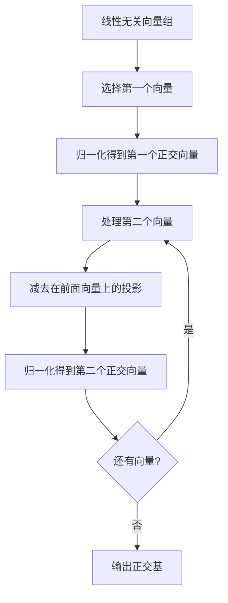

# 第12章：内积空间与正交性

::: tip 学习目标
- 理解内积的定义和性质
- 掌握正交和标准正交的概念
- 理解施密特正交化过程
- 掌握正交矩阵的性质
- 理解最小二乘法的原理
:::

## 内积的定义与性质

### 内积的公理化定义
在实向量空间 $V$ 中，内积是一个函数 $\langle \cdot, \cdot \rangle: V \times V \rightarrow \mathbb{R}$，满足：

1. **对称性**：$\langle \mathbf{u}, \mathbf{v} \rangle = \langle \mathbf{v}, \mathbf{u} \rangle$
2. **线性性**：$\langle a\mathbf{u} + b\mathbf{v}, \mathbf{w} \rangle = a\langle \mathbf{u}, \mathbf{w} \rangle + b\langle \mathbf{v}, \mathbf{w} \rangle$
3. **正定性**：$\langle \mathbf{v}, \mathbf{v} \rangle \geq 0$，且 $\langle \mathbf{v}, \mathbf{v} \rangle = 0$ 当且仅当 $\mathbf{v} = \mathbf{0}$

### 标准内积
在 $\mathbb{R}^n$ 中的标准内积：
$$\langle \mathbf{u}, \mathbf{v} \rangle = \mathbf{u}^T\mathbf{v} = u_1v_1 + u_2v_2 + \cdots + u_nv_n$$

```python
import numpy as np
import matplotlib.pyplot as plt
from scipy.linalg import qr, svd
from mpl_toolkits.mplot3d import Axes3D

def inner_product_basics():
    """内积的基本概念和性质"""

    # 定义向量
    u = np.array([3, 4])
    v = np.array([1, 2])
    w = np.array([-2, 1])

    print("向量:")
    print(f"u = {u}")
    print(f"v = {v}")
    print(f"w = {w}")

    # 计算内积
    uv = np.dot(u, v)
    uw = np.dot(u, w)
    vw = np.dot(v, w)

    print(f"\n内积计算:")
    print(f"<u, v> = {uv}")
    print(f"<u, w> = {uw}")
    print(f"<v, w> = {vw}")

    # 验证内积性质
    print(f"\n内积性质验证:")

    # 对称性
    print(f"对称性: <u, v> = <v, u>")
    print(f"  {np.dot(u, v)} = {np.dot(v, u)}: {np.dot(u, v) == np.dot(v, u)}")

    # 线性性
    a, b = 2, -3
    linear_left = np.dot(a*u + b*v, w)
    linear_right = a*np.dot(u, w) + b*np.dot(v, w)
    print(f"线性性: <au + bv, w> = a<u, w> + b<v, w>")
    print(f"  {linear_left} = {linear_right}: {np.isclose(linear_left, linear_right)}")

    # 正定性
    print(f"正定性: <u, u> = {np.dot(u, u)} > 0")

    # 由内积导出的范数
    norm_u = np.sqrt(np.dot(u, u))
    norm_v = np.sqrt(np.dot(v, v))
    norm_w = np.sqrt(np.dot(w, w))

    print(f"\n由内积导出的范数:")
    print(f"||u|| = √<u, u> = {norm_u:.3f}")
    print(f"||v|| = √<v, v> = {norm_v:.3f}")
    print(f"||w|| = √<w, w> = {norm_w:.3f}")

    # 可视化
    plt.figure(figsize=(12, 5))

    # 内积的几何意义
    plt.subplot(1, 2, 1)
    plt.arrow(0, 0, u[0], u[1], head_width=0.2, head_length=0.2,
              fc='red', ec='red', linewidth=2, label='u')
    plt.arrow(0, 0, v[0], v[1], head_width=0.2, head_length=0.2,
              fc='blue', ec='blue', linewidth=2, label='v')

    # 投影
    proj_v_on_u = (np.dot(v, u) / np.dot(u, u)) * u
    plt.arrow(0, 0, proj_v_on_u[0], proj_v_on_u[1], head_width=0.1, head_length=0.1,
              fc='green', ec='green', linewidth=2, linestyle='--', label='proj_u(v)')

    # 角度
    cos_theta = np.dot(u, v) / (np.linalg.norm(u) * np.linalg.norm(v))
    theta = np.arccos(cos_theta)

    plt.xlim(-1, 4)
    plt.ylim(-1, 5)
    plt.grid(True, alpha=0.3)
    plt.legend()
    plt.title(f'内积几何意义\n<u,v> = ||u||||v||cos(θ) = {uv:.1f}\nθ = {theta*180/np.pi:.1f}°')
    plt.xlabel('x')
    plt.ylabel('y')

    # 不同向量的内积
    plt.subplot(1, 2, 2)
    vectors = [u, v, w]
    labels = ['u', 'v', 'w']
    colors = ['red', 'blue', 'green']

    for vec, label, color in zip(vectors, labels, colors):
        plt.arrow(0, 0, vec[0], vec[1], head_width=0.2, head_length=0.2,
                 fc=color, ec=color, linewidth=2, label=label)

    plt.xlim(-3, 4)
    plt.ylim(-1, 5)
    plt.grid(True, alpha=0.3)
    plt.legend()
    plt.title('向量及其内积关系')
    plt.xlabel('x')
    plt.ylabel('y')

    plt.tight_layout()
    plt.show()

inner_product_basics()
```

## 正交性与正交补

### 正交性定义
两个向量 $\mathbf{u}$ 和 $\mathbf{v}$ **正交**，记作 $\mathbf{u} \perp \mathbf{v}$，当且仅当：
$$\langle \mathbf{u}, \mathbf{v} \rangle = 0$$

### 正交补
集合 $S$ 的**正交补** $S^{\perp}$ 定义为：
$$S^{\perp} = \{\mathbf{v} \in V : \langle \mathbf{v}, \mathbf{s} \rangle = 0 \text{ 对所有 } \mathbf{s} \in S\}$$

```python
def orthogonality_demo():
    """正交性的概念和应用"""

    # 三维空间中的正交向量
    v1 = np.array([1, 2, 1])
    v2 = np.array([2, -1, 0])
    v3 = np.array([1, 0, -2])

    print("三维空间中的向量:")
    print(f"v1 = {v1}")
    print(f"v2 = {v2}")
    print(f"v3 = {v3}")

    # 检查正交性
    dot_products = [
        (np.dot(v1, v2), "v1·v2"),
        (np.dot(v1, v3), "v1·v3"),
        (np.dot(v2, v3), "v2·v3")
    ]

    print(f"\n正交性检查:")
    for dot_prod, desc in dot_products:
        orthogonal = abs(dot_prod) < 1e-10
        print(f"{desc} = {dot_prod:.3f} {'(正交)' if orthogonal else '(不正交)'}")

    # 构造一个正交基
    print(f"\n构造正交基:")

    # 以v1为起点
    u1 = v1 / np.linalg.norm(v1)
    print(f"u1 = v1/||v1|| = {u1}")

    # 使v2正交于u1
    proj_v2_u1 = np.dot(v2, u1) * u1
    u2_unnorm = v2 - proj_v2_u1
    u2 = u2_unnorm / np.linalg.norm(u2_unnorm)
    print(f"u2 = (v2 - proj_u1(v2))/||v2 - proj_u1(v2)|| = {u2}")

    # 使v3正交于u1和u2
    proj_v3_u1 = np.dot(v3, u1) * u1
    proj_v3_u2 = np.dot(v3, u2) * u2
    u3_unnorm = v3 - proj_v3_u1 - proj_v3_u2
    u3 = u3_unnorm / np.linalg.norm(u3_unnorm)
    print(f"u3 = {u3}")

    # 验证正交性
    orthogonal_basis = np.column_stack([u1, u2, u3])
    gram_matrix = orthogonal_basis.T @ orthogonal_basis

    print(f"\n正交基验证:")
    print(f"Gram矩阵 U^T U = \n{gram_matrix}")
    print(f"是否为单位矩阵: {np.allclose(gram_matrix, np.eye(3))}")

    # 可视化三维正交向量
    fig = plt.figure(figsize=(12, 5))

    # 原始向量
    ax1 = fig.add_subplot(121, projection='3d')
    origin = [0, 0, 0]

    vectors = [v1, v2, v3]
    labels = ['v1', 'v2', 'v3']
    colors = ['red', 'green', 'blue']

    for vec, label, color in zip(vectors, labels, colors):
        ax1.quiver(origin[0], origin[1], origin[2], vec[0], vec[1], vec[2],
                  color=color, arrow_length_ratio=0.1, linewidth=3, label=label)

    ax1.set_xlim(-2, 3)
    ax1.set_ylim(-2, 3)
    ax1.set_zlim(-2, 2)
    ax1.legend()
    ax1.set_title('原始向量')

    # 正交基
    ax2 = fig.add_subplot(122, projection='3d')

    orthogonal_vectors = [u1, u2, u3]
    labels = ['u1', 'u2', 'u3']

    for vec, label, color in zip(orthogonal_vectors, labels, colors):
        ax2.quiver(origin[0], origin[1], origin[2], vec[0], vec[1], vec[2],
                  color=color, arrow_length_ratio=0.1, linewidth=3, label=label)

    ax2.set_xlim(-1, 1)
    ax2.set_ylim(-1, 1)
    ax2.set_zlim(-1, 1)
    ax2.legend()
    ax2.set_title('正交基')

    plt.tight_layout()
    plt.show()

orthogonality_demo()
```

## Gram-Schmidt正交化过程

### 算法步骤
给定线性无关向量组 $\{v_1, v_2, \ldots, v_k\}$，Gram-Schmidt过程构造正交向量组 $\{u_1, u_2, \ldots, u_k\}$：

1. $u_1 = v_1$
2. $u_2 = v_2 - \text{proj}_{u_1}(v_2)$
3. $u_3 = v_3 - \text{proj}_{u_1}(v_3) - \text{proj}_{u_2}(v_3)$
4. $\vdots$

其中投影公式为：$\text{proj}_u(v) = \frac{\langle v, u \rangle}{\langle u, u \rangle}u$

```python
def gram_schmidt_process():
    """Gram-Schmidt正交化过程"""

    def gram_schmidt(vectors):
        """
        Gram-Schmidt正交化算法
        输入: 线性无关向量组 (列向量)
        输出: 正交向量组, 标准正交向量组
        """
        V = vectors.copy()
        n, k = V.shape

        # 正交向量组
        U = np.zeros_like(V)
        # 标准正交向量组
        Q = np.zeros_like(V)

        for i in range(k):
            # 当前向量
            ui = V[:, i].copy()

            # 减去在前面正交向量上的投影
            for j in range(i):
                proj = np.dot(V[:, i], U[:, j]) / np.dot(U[:, j], U[:, j]) * U[:, j]
                ui = ui - proj

            U[:, i] = ui
            Q[:, i] = ui / np.linalg.norm(ui)

        return U, Q

    # 测试向量组
    A = np.array([[1, 1, 0],
                  [1, 0, 1],
                  [0, 1, 1]], dtype=float)

    print("原始向量组 A:")
    print(A)
    print(f"列向量: v1={A[:,0]}, v2={A[:,1]}, v3={A[:,2]}")

    # 应用Gram-Schmidt过程
    U, Q = gram_schmidt(A)

    print(f"\n正交化后的向量组 U:")
    print(U)

    print(f"\n标准正交化后的向量组 Q:")
    print(Q)

    # 验证正交性
    print(f"\n验证正交性:")
    U_dot = U.T @ U
    print(f"U^T U = \n{U_dot}")

    print(f"\n验证标准正交性:")
    Q_dot = Q.T @ Q
    print(f"Q^T Q = \n{Q_dot}")
    print(f"是否为单位矩阵: {np.allclose(Q_dot, np.eye(3))}")

    # 与NumPy的QR分解比较
    Q_numpy, R_numpy = qr(A)
    print(f"\nNumPy QR分解的Q矩阵:")
    print(Q_numpy)

    # 注意：符号可能不同，但张成的空间相同
    print(f"\n我们的Q和NumPy的Q是否张成相同空间:")
    for i in range(3):
        # 检查是否Q[:, i] = ±Q_numpy[:, i]
        same_or_opposite = np.allclose(Q[:, i], Q_numpy[:, i]) or np.allclose(Q[:, i], -Q_numpy[:, i])
        print(f"列{i+1}: {same_or_opposite}")

    # 可视化过程
    fig = plt.figure(figsize=(15, 5))

    # 原始向量
    ax1 = fig.add_subplot(131, projection='3d')
    origin = [0, 0, 0]
    colors = ['red', 'green', 'blue']

    for i in range(3):
        ax1.quiver(origin[0], origin[1], origin[2],
                  A[0,i], A[1,i], A[2,i],
                  color=colors[i], arrow_length_ratio=0.1,
                  linewidth=3, label=f'v{i+1}')

    ax1.set_xlim(-0.5, 1.5)
    ax1.set_ylim(-0.5, 1.5)
    ax1.set_zlim(-0.5, 1.5)
    ax1.legend()
    ax1.set_title('原始向量组')

    # 正交向量
    ax2 = fig.add_subplot(132, projection='3d')

    for i in range(3):
        ax2.quiver(origin[0], origin[1], origin[2],
                  U[0,i], U[1,i], U[2,i],
                  color=colors[i], arrow_length_ratio=0.1,
                  linewidth=3, label=f'u{i+1}')

    ax2.set_xlim(-1, 1)
    ax2.set_ylim(-1, 1)
    ax2.set_zlim(-1, 1)
    ax2.legend()
    ax2.set_title('正交向量组')

    # 标准正交向量
    ax3 = fig.add_subplot(133, projection='3d')

    for i in range(3):
        ax3.quiver(origin[0], origin[1], origin[2],
                  Q[0,i], Q[1,i], Q[2,i],
                  color=colors[i], arrow_length_ratio=0.1,
                  linewidth=3, label=f'q{i+1}')

    ax3.set_xlim(-1, 1)
    ax3.set_ylim(-1, 1)
    ax3.set_zlim(-1, 1)
    ax3.legend()
    ax3.set_title('标准正交向量组')

    plt.tight_layout()
    plt.show()

    return U, Q

gram_schmidt_process()
```

## 正交矩阵

### 定义与性质
矩阵 $Q$ 是**正交矩阵**当且仅当：
$$Q^TQ = QQ^T = I$$

正交矩阵的重要性质：
1. $\det(Q) = \pm 1$
2. 保持向量长度：$\|Q\mathbf{x}\| = \|\mathbf{x}\|$
3. 保持角度：$\langle Q\mathbf{u}, Q\mathbf{v} \rangle = \langle \mathbf{u}, \mathbf{v} \rangle$

```python
def orthogonal_matrices():
    """正交矩阵的性质和应用"""

    # 构造旋转矩阵（正交矩阵的典型例子）
    theta = np.pi/6  # 30度
    rotation_2d = np.array([[np.cos(theta), -np.sin(theta)],
                           [np.sin(theta), np.cos(theta)]])

    print("2D旋转矩阵 (30度):")
    print(rotation_2d)

    # 验证正交性
    print(f"\nR^T R = \n{rotation_2d.T @ rotation_2d}")
    print(f"是否为单位矩阵: {np.allclose(rotation_2d.T @ rotation_2d, np.eye(2))}")
    print(f"行列式: {np.linalg.det(rotation_2d):.6f}")

    # 3D旋转矩阵（绕z轴）
    phi = np.pi/4  # 45度
    rotation_3d = np.array([[np.cos(phi), -np.sin(phi), 0],
                           [np.sin(phi), np.cos(phi), 0],
                           [0, 0, 1]])

    print(f"\n3D旋转矩阵 (绕z轴45度):")
    print(rotation_3d)
    print(f"是否正交: {np.allclose(rotation_3d.T @ rotation_3d, np.eye(3))}")

    # 反射矩阵
    reflection = np.array([[1, 0],
                          [0, -1]])  # 关于x轴反射

    print(f"\n反射矩阵 (关于x轴):")
    print(reflection)
    print(f"是否正交: {np.allclose(reflection.T @ reflection, np.eye(2))}")
    print(f"行列式: {np.linalg.det(reflection):.0f}")

    # 正交矩阵保持长度和角度
    print(f"\n正交变换的保持性质:")

    # 测试向量
    u = np.array([3, 4])
    v = np.array([1, 2])

    # 变换后的向量
    u_rot = rotation_2d @ u
    v_rot = rotation_2d @ v

    # 检查长度保持
    print(f"原始长度: ||u|| = {np.linalg.norm(u):.3f}, ||v|| = {np.linalg.norm(v):.3f}")
    print(f"变换后长度: ||Ru|| = {np.linalg.norm(u_rot):.3f}, ||Rv|| = {np.linalg.norm(v_rot):.3f}")

    # 检查角度保持
    angle_original = np.arccos(np.dot(u, v) / (np.linalg.norm(u) * np.linalg.norm(v)))
    angle_transformed = np.arccos(np.dot(u_rot, v_rot) / (np.linalg.norm(u_rot) * np.linalg.norm(v_rot)))

    print(f"原始角度: {angle_original * 180/np.pi:.1f}度")
    print(f"变换后角度: {angle_transformed * 180/np.pi:.1f}度")

    # 可视化正交变换
    fig, axes = plt.subplots(2, 3, figsize=(15, 10))

    # 第一行：2D变换
    # 原始向量
    ax1 = axes[0, 0]
    ax1.arrow(0, 0, u[0], u[1], head_width=0.2, head_length=0.2,
              fc='red', ec='red', linewidth=2, label='u')
    ax1.arrow(0, 0, v[0], v[1], head_width=0.2, head_length=0.2,
              fc='blue', ec='blue', linewidth=2, label='v')

    # 绘制单位圆
    theta_circle = np.linspace(0, 2*np.pi, 100)
    circle = np.array([np.cos(theta_circle), np.sin(theta_circle)])
    ax1.plot(circle[0], circle[1], 'k--', alpha=0.5, label='单位圆')

    ax1.set_xlim(-5, 5)
    ax1.set_ylim(-5, 5)
    ax1.set_aspect('equal')
    ax1.grid(True, alpha=0.3)
    ax1.legend()
    ax1.set_title('原始向量')

    # 旋转后
    ax2 = axes[0, 1]
    ax2.arrow(0, 0, u_rot[0], u_rot[1], head_width=0.2, head_length=0.2,
              fc='red', ec='red', linewidth=2, label='Ru')
    ax2.arrow(0, 0, v_rot[0], v_rot[1], head_width=0.2, head_length=0.2,
              fc='blue', ec='blue', linewidth=2, label='Rv')

    # 旋转后的单位圆（仍是单位圆）
    circle_rot = rotation_2d @ circle
    ax2.plot(circle_rot[0], circle_rot[1], 'k--', alpha=0.5, label='旋转后单位圆')

    ax2.set_xlim(-5, 5)
    ax2.set_ylim(-5, 5)
    ax2.set_aspect('equal')
    ax2.grid(True, alpha=0.3)
    ax2.legend()
    ax2.set_title(f'旋转{theta*180/np.pi:.0f}度后')

    # 反射后
    u_ref = reflection @ u
    v_ref = reflection @ v

    ax3 = axes[0, 2]
    ax3.arrow(0, 0, u_ref[0], u_ref[1], head_width=0.2, head_length=0.2,
              fc='red', ec='red', linewidth=2, label='Su')
    ax3.arrow(0, 0, v_ref[0], v_ref[1], head_width=0.2, head_length=0.2,
              fc='blue', ec='blue', linewidth=2, label='Sv')

    circle_ref = reflection @ circle
    ax3.plot(circle_ref[0], circle_ref[1], 'k--', alpha=0.5, label='反射后单位圆')

    ax3.set_xlim(-5, 5)
    ax3.set_ylim(-5, 5)
    ax3.set_aspect('equal')
    ax3.grid(True, alpha=0.3)
    ax3.legend()
    ax3.set_title('关于x轴反射后')

    # 第二行：3D情况（投影到2D显示）
    u3d = np.array([2, 3, 1])
    v3d = np.array([1, 1, 2])

    u3d_rot = rotation_3d @ u3d
    v3d_rot = rotation_3d @ v3d

    for i, (ax, title, vecs) in enumerate([(axes[1,0], '3D原始(xy投影)', [u3d, v3d]),
                                           (axes[1,1], '3D旋转后(xy投影)', [u3d_rot, v3d_rot])]):
        for j, (vec, color, label) in enumerate(zip(vecs, ['red', 'blue'], ['u3d', 'v3d'])):
            ax.arrow(0, 0, vec[0], vec[1], head_width=0.1, head_length=0.1,
                    fc=color, ec=color, linewidth=2, label=f'{label}(xy)')

        ax.set_xlim(-4, 4)
        ax.set_ylim(-4, 4)
        ax.set_aspect('equal')
        ax.grid(True, alpha=0.3)
        ax.legend()
        ax.set_title(title)

    # 正交矩阵分类
    ax_class = axes[1, 2]
    ax_class.text(0.5, 0.8, '正交矩阵分类', fontsize=14, ha='center', weight='bold',
                  transform=ax_class.transAxes)

    classification = [
        'det(Q) = +1: 旋转矩阵',
        '• 保持方向',
        '• 保持手性',
        '',
        'det(Q) = -1: 反射矩阵',
        '• 改变方向',
        '• 改变手性'
    ]

    for i, text in enumerate(classification):
        y_pos = 0.65 - i * 0.08
        weight = 'bold' if text.startswith('det') else 'normal'
        ax_class.text(0.1, y_pos, text, fontsize=10, transform=ax_class.transAxes, weight=weight)

    ax_class.set_xlim(0, 1)
    ax_class.set_ylim(0, 1)
    ax_class.axis('off')

    plt.tight_layout()
    plt.show()

orthogonal_matrices()
```

## 最小二乘法

### 问题设置
对于超定方程组 $A\mathbf{x} = \mathbf{b}$（$m > n$），通常无精确解。最小二乘法寻找使 $\|A\mathbf{x} - \mathbf{b}\|^2$ 最小的解。

### 法方程
最小二乘解满足**法方程**：
$$A^TA\mathbf{x} = A^T\mathbf{b}$$

### 几何解释
最小二乘解 $\mathbf{x}^*$ 使得 $A\mathbf{x}^*$ 是 $\mathbf{b}$ 在 $A$ 的列空间上的**正交投影**。

```python
def least_squares_method():
    """最小二乘法的理论和应用"""

    # 生成超定方程组的例子
    np.random.seed(42)
    m, n = 6, 3  # 6个方程，3个未知数

    A = np.random.randn(m, n)
    x_true = np.array([2, -1, 3])  # 真实解（假设存在）
    b_exact = A @ x_true

    # 添加噪声，使系统变为超定
    noise = 0.1 * np.random.randn(m)
    b = b_exact + noise

    print(f"超定方程组 Ax = b:")
    print(f"A 的形状: {A.shape}")
    print(f"A = \n{A}")
    print(f"b = {b}")

    # 方法1: 法方程
    ATA = A.T @ A
    ATb = A.T @ b
    x_normal = np.linalg.solve(ATA, ATb)

    print(f"\n方法1 - 法方程 (A^T A)x = A^T b:")
    print(f"A^T A = \n{ATA}")
    print(f"A^T b = {ATb}")
    print(f"最小二乘解: x = {x_normal}")

    # 方法2: QR分解
    Q, R = qr(A)
    x_qr = np.linalg.solve(R, Q.T @ b)

    print(f"\n方法2 - QR分解:")
    print(f"Q 的形状: {Q.shape}")
    print(f"R 的形状: {R.shape}")
    print(f"最小二乘解: x = {x_qr}")

    # 方法3: SVD分解
    U, s, Vt = svd(A)
    x_svd = Vt.T @ (np.diag(1/s) @ (U.T @ b))

    print(f"\n方法3 - SVD分解:")
    print(f"奇异值: {s}")
    print(f"最小二乘解: x = {x_svd}")

    # 方法4: NumPy的lstsq
    x_numpy, residuals, rank, singular_values = np.linalg.lstsq(A, b, rcond=None)

    print(f"\n方法4 - NumPy lstsq:")
    print(f"最小二乘解: x = {x_numpy}")
    print(f"残差平方和: {residuals}")

    # 验证所有方法给出相同结果
    print(f"\n验证不同方法的一致性:")
    print(f"法方程 vs QR: {np.allclose(x_normal, x_qr)}")
    print(f"法方程 vs SVD: {np.allclose(x_normal, x_svd)}")
    print(f"法方程 vs NumPy: {np.allclose(x_normal, x_numpy)}")

    # 几何解释：投影
    print(f"\n几何解释 - 正交投影:")

    # b在A的列空间上的投影
    proj_b = A @ x_normal
    residual = b - proj_b

    print(f"投影 proj_A(b) = {proj_b}")
    print(f"残差 r = b - proj_A(b) = {residual}")
    print(f"残差长度: ||r|| = {np.linalg.norm(residual):.6f}")

    # 验证残差与列空间正交
    print(f"\n验证残差与列空间的正交性:")
    for i in range(n):
        dot_product = np.dot(A[:, i], residual)
        print(f"A的第{i+1}列与残差的内积: {dot_product:.2e}")

    # 线性回归应用示例
    print(f"\n应用示例：线性回归")

    # 生成数据点
    x_data = np.linspace(0, 10, 20)
    y_true = 2*x_data + 1  # 真实关系：y = 2x + 1
    y_data = y_true + 0.5*np.random.randn(20)  # 添加噪声

    # 构造设计矩阵（包含常数项）
    A_reg = np.column_stack([np.ones(len(x_data)), x_data])

    # 最小二乘拟合
    coeffs = np.linalg.solve(A_reg.T @ A_reg, A_reg.T @ y_data)

    print(f"数据拟合：y = ax + b")
    print(f"估计的系数：b = {coeffs[0]:.3f}, a = {coeffs[1]:.3f}")
    print(f"真实的系数：b = 1.000, a = 2.000")

    # 可视化
    fig, axes = plt.subplots(2, 2, figsize=(12, 10))

    # 残差分析
    ax1 = axes[0, 0]
    residuals_all = b - A @ x_normal
    ax1.stem(range(len(residuals_all)), residuals_all, basefmt=' ')
    ax1.axhline(y=0, color='red', linestyle='--', alpha=0.7)
    ax1.set_xlabel('方程编号')
    ax1.set_ylabel('残差')
    ax1.set_title('残差分布')
    ax1.grid(True, alpha=0.3)

    # 几何解释（2D投影）
    ax2 = axes[0, 1]

    # 只显示前两个分量
    b_2d = b[:2]
    A_2d = A[:2, :2]
    proj_2d = A_2d @ np.linalg.solve(A_2d.T @ A_2d, A_2d.T @ b_2d)
    residual_2d = b_2d - proj_2d

    ax2.arrow(0, 0, b_2d[0], b_2d[1], head_width=0.1, head_length=0.1,
              fc='blue', ec='blue', linewidth=2, label='b (原始)')
    ax2.arrow(0, 0, proj_2d[0], proj_2d[1], head_width=0.1, head_length=0.1,
              fc='green', ec='green', linewidth=2, label='投影')
    ax2.arrow(proj_2d[0], proj_2d[1], residual_2d[0], residual_2d[1],
              head_width=0.1, head_length=0.1, fc='red', ec='red',
              linewidth=2, label='残差')

    # 绘制列空间（简化为平行四边形）
    col1, col2 = A_2d[:, 0], A_2d[:, 1]
    vertices = np.array([[0, 0], col1, col1+col2, col2, [0, 0]])
    ax2.fill(vertices[:, 0], vertices[:, 1], alpha=0.2, color='gray', label='列空间')

    ax2.set_xlim(-3, 4)
    ax2.set_ylim(-3, 4)
    ax2.set_aspect('equal')
    ax2.grid(True, alpha=0.3)
    ax2.legend()
    ax2.set_title('几何解释（2D投影）')

    # 线性回归结果
    ax3 = axes[1, 0]
    ax3.scatter(x_data, y_data, alpha=0.7, label='数据点')
    ax3.plot(x_data, y_true, 'g--', linewidth=2, label='真实关系')
    ax3.plot(x_data, A_reg @ coeffs, 'r-', linewidth=2, label='拟合直线')
    ax3.set_xlabel('x')
    ax3.set_ylabel('y')
    ax3.legend()
    ax3.grid(True, alpha=0.3)
    ax3.set_title('线性回归示例')

    # 条件数分析
    ax4 = axes[1, 1]

    cond_number = np.linalg.cond(A)
    cond_ATA = np.linalg.cond(ATA)

    methods = ['原矩阵A', 'A^T A']
    cond_numbers = [cond_number, cond_ATA]

    bars = ax4.bar(methods, cond_numbers, color=['blue', 'red'], alpha=0.7)
    ax4.set_ylabel('条件数')
    ax4.set_title('数值稳定性比较')
    ax4.set_yscale('log')

    for bar, cond in zip(bars, cond_numbers):
        ax4.text(bar.get_x() + bar.get_width()/2, bar.get_height(),
                f'{cond:.1e}', ha='center', va='bottom')

    ax4.grid(True, alpha=0.3)

    plt.tight_layout()
    plt.show()

least_squares_method()
```

## 本章总结

### 核心概念总结表

| 概念 | 定义 | 重要性质 | 应用 |
|------|------|----------|------|
| 内积 | $\langle u, v \rangle$ | 对称性、线性性、正定性 | 定义角度和长度 |
| 正交性 | $\langle u, v \rangle = 0$ | 勾股定理成立 | 简化计算 |
| 正交基 | 两两正交的基 | 投影公式简单 | 坐标计算 |
| 标准正交基 | 正交且单位长度 | $\langle e_i, e_j \rangle = \delta_{ij}$ | 最优基 |
| 正交矩阵 | $Q^TQ = I$ | 保持长度和角度 | 旋转反射 |

### Gram-Schmidt算法流程



内积空间与正交性理论为线性代数提供了几何直观，使我们能够在抽象的向量空间中讨论角度、长度、距离等几何概念。这些理论不仅在数学上重要，在工程应用、数据分析、信号处理等领域也有广泛应用。正交性是简化复杂问题的强大工具，而最小二乘法则是处理超定系统和数据拟合的标准方法。