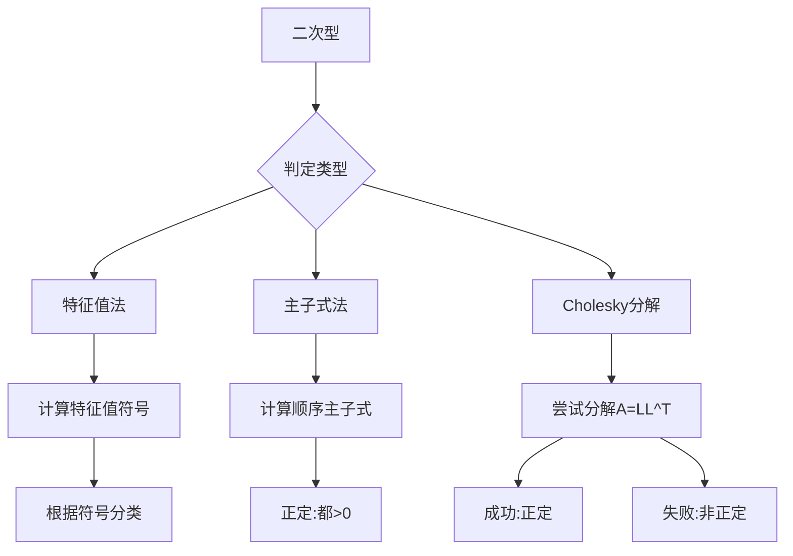

# 第13章：二次型理论

::: tip 学习目标
- 理解二次型的定义和矩阵表示
- 掌握二次型的标准化方法
- 理解二次型的分类
- 掌握正定二次型的判定
- 理解二次型的几何意义
:::

## 二次型的基本概念

### 定义
含有 $n$ 个变量 $x_1, x_2, \ldots, x_n$ 的**二次型**是形如：
$$f(x_1, x_2, \ldots, x_n) = \sum_{i=1}^n \sum_{j=1}^n a_{ij}x_ix_j$$

的二次齐次多项式。

### 矩阵表示
二次型可以写成矩阵形式：
$$f(\mathbf{x}) = \mathbf{x}^T A \mathbf{x}$$

其中 $A = (a_{ij})$ 是对称矩阵。

```python
import numpy as np
import matplotlib.pyplot as plt
from mpl_toolkits.mplot3d import Axes3D
from scipy.linalg import eig, cholesky

def quadratic_forms_basics():
    """二次型的基本概念和表示"""

    print("二次型基础概念演示")
    print("=" * 50)

    # 二维二次型示例
    print("1. 二维二次型示例")

    # 定义二次型矩阵
    A1 = np.array([[2, 1],
                   [1, 3]], dtype=float)

    A2 = np.array([[1, 0],
                   [0, -1]], dtype=float)

    A3 = np.array([[1, 2],
                   [2, 1]], dtype=float)

    quadratic_forms = [
        (A1, "2x₁² + 2x₁x₂ + 3x₂²"),
        (A2, "x₁² - x₂²"),
        (A3, "x₁² + 4x₁x₂ + x₂²")
    ]

    fig, axes = plt.subplots(2, 3, figsize=(15, 10))

    for i, (A, formula) in enumerate(quadratic_forms):
        # 计算特征值
        eigenvals, eigenvecs = eig(A)

        print(f"\n二次型 {i+1}: {formula}")
        print(f"矩阵 A:\n{A}")
        print(f"特征值: {eigenvals}")

        # 绘制等高线
        ax1 = axes[0, i]
        x = np.linspace(-3, 3, 100)
        y = np.linspace(-3, 3, 100)
        X, Y = np.meshgrid(x, y)

        # 计算二次型的值
        Z = A[0,0]*X**2 + 2*A[0,1]*X*Y + A[1,1]*Y**2

        # 根据特征值确定等高线级别
        if np.all(eigenvals > 0):
            levels = [1, 4, 9, 16]
            colors = 'blue'
        elif np.all(eigenvals < 0):
            levels = [-16, -9, -4, -1]
            colors = 'red'
        else:
            levels = [-4, -1, 1, 4]
            colors = 'purple'

        contours = ax1.contour(X, Y, Z, levels=levels, colors=colors)
        ax1.clabel(contours, inline=True, fontsize=8)

        # 绘制特征向量
        for j, (val, vec) in enumerate(zip(eigenvals, eigenvecs.T)):
            length = 1.5
            ax1.arrow(0, 0, vec[0]*length, vec[1]*length,
                     head_width=0.1, head_length=0.1, fc=f'C{j}', ec=f'C{j}',
                     linewidth=2, alpha=0.7)

        ax1.set_xlim(-3, 3)
        ax1.set_ylim(-3, 3)
        ax1.set_aspect('equal')
        ax1.grid(True, alpha=0.3)
        ax1.set_title(f'{formula}\n特征值: {eigenvals[0]:.1f}, {eigenvals[1]:.1f}')

        # 3D表面图
        ax2 = axes[1, i]
        x_3d = np.linspace(-2, 2, 30)
        y_3d = np.linspace(-2, 2, 30)
        X_3d, Y_3d = np.meshgrid(x_3d, y_3d)
        Z_3d = A[0,0]*X_3d**2 + 2*A[0,1]*X_3d*Y_3d + A[1,1]*Y_3d**2

        # 限制Z的范围以便可视化
        Z_3d = np.clip(Z_3d, -20, 20)

        if np.all(eigenvals > 0):
            ax2.contourf(X_3d, Y_3d, Z_3d, levels=20, cmap='Blues')
            type_name = "正定"
        elif np.all(eigenvals < 0):
            ax2.contourf(X_3d, Y_3d, Z_3d, levels=20, cmap='Reds')
            type_name = "负定"
        else:
            ax2.contourf(X_3d, Y_3d, Z_3d, levels=20, cmap='RdBu')
            type_name = "不定"

        ax2.set_title(f'{type_name}二次型')
        ax2.set_xlabel('x₁')
        ax2.set_ylabel('x₂')

    plt.tight_layout()
    plt.show()

quadratic_forms_basics()
```

## 二次型的标准化

### 配方法
通过配方将二次型化为标准形：
$$f(x_1, x_2, \ldots, x_n) = \lambda_1 y_1^2 + \lambda_2 y_2^2 + \cdots + \lambda_n y_n^2$$

### 正交变换法
利用对称矩阵的正交对角化：
$$A = Q\Lambda Q^T$$

其中 $Q$ 是正交矩阵，$\Lambda$ 是对角矩阵。

```python
def quadratic_form_standardization():
    """二次型的标准化方法"""

    print("二次型标准化演示")
    print("=" * 50)

    # 定义三维二次型
    A = np.array([[1, 1, 0],
                  [1, 2, 1],
                  [0, 1, 1]], dtype=float)

    print("原二次型矩阵:")
    print(A)

    # 对应的二次型
    print("\n对应的二次型:")
    print("f(x₁,x₂,x₃) = x₁² + 2x₁x₂ + 2x₂² + 2x₂x₃ + x₃²")

    # 方法1: 配方法（手动演示）
    print("\n方法1: 配方法")
    print("f = x₁² + 2x₁x₂ + 2x₂² + 2x₂x₃ + x₃²")
    print("  = (x₁ + x₂)² - x₂² + 2x₂² + 2x₂x₃ + x₃²")
    print("  = (x₁ + x₂)² + x₂² + 2x₂x₃ + x₃²")
    print("  = (x₁ + x₂)² + (x₂ + x₃)² - x₃² + x₃²")
    print("  = (x₁ + x₂)² + (x₂ + x₃)² + 0·x₃²")

    # 方法2: 正交对角化
    print("\n方法2: 正交对角化")

    # 计算特征值和特征向量
    eigenvals, eigenvecs = eig(A)

    # 排序
    idx = np.argsort(eigenvals)[::-1]
    eigenvals = eigenvals[idx]
    eigenvecs = eigenvecs[:, idx]

    # 正交矩阵
    Q = eigenvecs
    Lambda = np.diag(eigenvals)

    print(f"特征值: {eigenvals}")
    print(f"正交矩阵 Q:\n{Q}")
    print(f"对角矩阵 Λ:\n{Lambda}")

    # 验证对角化
    reconstructed = Q @ Lambda @ Q.T
    print(f"\n验证: Q Λ Q^T =\n{reconstructed}")
    print(f"误差: {np.linalg.norm(A - reconstructed):.2e}")

    # 标准形
    print(f"\n标准形: f = {eigenvals[0]:.3f}y₁² + {eigenvals[1]:.3f}y₂² + {eigenvals[2]:.3f}y₃²")

    # 坐标变换
    print(f"\n坐标变换: x = Qy，即")
    for i in range(3):
        coeffs = Q[:, i]
        terms = []
        for j, coeff in enumerate(coeffs):
            if abs(coeff) > 1e-10:
                terms.append(f"{coeff:.3f}y_{j+1}")
        print(f"x_{i+1} = {' + '.join(terms)}")

    # 惯性定理
    positive_eigenvals = np.sum(eigenvals > 1e-10)
    negative_eigenvals = np.sum(eigenvals < -1e-10)
    zero_eigenvals = np.sum(np.abs(eigenvals) <= 1e-10)

    print(f"\n惯性定理:")
    print(f"正惯性指数: {positive_eigenvals}")
    print(f"负惯性指数: {negative_eigenvals}")
    print(f"零特征值个数: {zero_eigenvals}")

    return eigenvals, Q

eigenvals, Q = quadratic_form_standardization()
```

## 二次型的分类

### 按符号分类
根据特征值的符号，二次型可分为：

1. **正定**：所有特征值都为正
2. **负定**：所有特征值都为负
3. **半正定**：特征值非负，至少有一个为零
4. **半负定**：特征值非正，至少有一个为零
5. **不定**：既有正特征值又有负特征值

```python
def quadratic_form_classification():
    """二次型的分类和性质"""

    print("二次型分类演示")
    print("=" * 50)

    # 构造不同类型的二次型
    matrices = {
        "正定": np.array([[2, 0, 0], [0, 1, 0], [0, 0, 3]]),
        "负定": np.array([[-2, 0, 0], [0, -1, 0], [0, 0, -3]]),
        "半正定": np.array([[1, 0, 0], [0, 2, 0], [0, 0, 0]]),
        "半负定": np.array([[-1, 0, 0], [0, -2, 0], [0, 0, 0]]),
        "不定": np.array([[1, 0, 0], [0, -1, 0], [0, 0, 2]])
    }

    # 添加非对角情况
    matrices["正定(非对角)"] = np.array([[2, 1, 0], [1, 2, 1], [0, 1, 2]])
    matrices["不定(非对角)"] = np.array([[1, 2, 0], [2, -1, 1], [0, 1, 1]])

    results = {}

    for name, A in matrices.items():
        eigenvals = eig(A)[0]
        eigenvals = np.real(eigenvals)  # 对称矩阵特征值是实数

        print(f"\n{name}:")
        print(f"矩阵:\n{A}")
        print(f"特征值: {eigenvals}")

        # 分类判定
        pos = np.sum(eigenvals > 1e-10)
        neg = np.sum(eigenvals < -1e-10)
        zero = np.sum(np.abs(eigenvals) <= 1e-10)

        print(f"正特征值个数: {pos}")
        print(f"负特征值个数: {neg}")
        print(f"零特征值个数: {zero}")

        # 确定类型
        if pos == len(eigenvals) and zero == 0:
            qtype = "正定"
        elif neg == len(eigenvals) and zero == 0:
            qtype = "负定"
        elif pos > 0 and neg == 0:
            qtype = "半正定"
        elif neg > 0 and pos == 0:
            qtype = "半负定"
        elif pos > 0 and neg > 0:
            qtype = "不定"
        else:
            qtype = "零形式"

        print(f"判定结果: {qtype}")

        results[name] = {
            'matrix': A,
            'eigenvals': eigenvals,
            'type': qtype,
            'positive': pos,
            'negative': neg,
            'zero': zero
        }

    # 可视化不同类型的二次型（二维情况）
    fig, axes = plt.subplots(2, 3, figsize=(15, 10))
    axes = axes.flatten()

    # 二维例子
    matrices_2d = {
        "正定": np.array([[2, 0], [0, 1]]),
        "负定": np.array([[-2, 0], [0, -1]]),
        "半正定": np.array([[1, 0], [0, 0]]),
        "半负定": np.array([[-1, 0], [0, 0]]),
        "不定": np.array([[1, 0], [0, -1]]),
        "正定(相关)": np.array([[2, 1], [1, 2]])
    }

    for i, (name, A) in enumerate(matrices_2d.items()):
        ax = axes[i]

        x = np.linspace(-3, 3, 100)
        y = np.linspace(-3, 3, 100)
        X, Y = np.meshgrid(x, y)

        Z = A[0,0]*X**2 + 2*A[0,1]*X*Y + A[1,1]*Y**2

        eigenvals_2d = eig(A)[0]

        # 根据类型选择等高线
        if name == "正定" or name == "正定(相关)":
            levels = [0.5, 1, 2, 4, 8]
            colors = 'blue'
        elif name == "负定":
            levels = [-8, -4, -2, -1, -0.5]
            colors = 'red'
        elif name == "半正定":
            levels = [0, 0.5, 1, 2, 4]
            colors = 'green'
        elif name == "半负定":
            levels = [-4, -2, -1, -0.5, 0]
            colors = 'orange'
        else:  # 不定
            levels = [-4, -2, -1, 0, 1, 2, 4]
            colors = 'purple'

        try:
            contours = ax.contour(X, Y, Z, levels=levels, colors=colors)
            ax.clabel(contours, inline=True, fontsize=8)
        except:
            # 如果等高线绘制失败，使用填充图
            ax.contourf(X, Y, Z, levels=50, alpha=0.7)

        ax.set_xlim(-3, 3)
        ax.set_ylim(-3, 3)
        ax.set_aspect('equal')
        ax.grid(True, alpha=0.3)
        ax.set_title(f'{name}\nλ = {eigenvals_2d[0]:.1f}, {eigenvals_2d[1]:.1f}')

    plt.tight_layout()
    plt.show()

    return results

classification_results = quadratic_form_classification()
```

## 正定二次型的判定

### 判定方法

1. **特征值判定法**：所有特征值都为正
2. **主子式判定法**：所有顺序主子式都为正
3. **Cholesky分解**：矩阵可以进行Cholesky分解

```python
def positive_definite_tests():
    """正定二次型的各种判定方法"""

    print("正定二次型判定方法比较")
    print("=" * 50)

    # 测试矩阵
    test_matrices = {
        "正定矩阵1": np.array([[2, 1], [1, 2]]),
        "正定矩阵2": np.array([[4, 2, 1], [2, 3, 1], [1, 1, 2]]),
        "非正定矩阵1": np.array([[1, 2], [2, 1]]),
        "非正定矩阵2": np.array([[1, 0, 0], [0, 0, 1], [0, 1, 0]]),
        "边界情况": np.array([[1, 1], [1, 1]])
    }

    for name, A in test_matrices.items():
        print(f"\n{name}:")
        print(f"矩阵 A:\n{A}")

        # 方法1: 特征值判定
        eigenvals = eig(A)[0]
        eigenvals = np.real(eigenvals)
        all_positive = np.all(eigenvals > 1e-10)

        print(f"\n方法1 - 特征值判定:")
        print(f"特征值: {eigenvals}")
        print(f"是否正定: {all_positive}")

        # 方法2: 主子式判定
        print(f"\n方法2 - 主子式判定:")
        principal_minors = []
        positive_minors = True

        for i in range(1, A.shape[0] + 1):
            minor = np.linalg.det(A[:i, :i])
            principal_minors.append(minor)
            print(f"第{i}阶主子式: {minor:.6f}")

            if minor <= 1e-10:
                positive_minors = False

        print(f"所有主子式都为正: {positive_minors}")

        # 方法3: Cholesky分解
        print(f"\n方法3 - Cholesky分解:")
        try:
            L = cholesky(A, lower=True)
            cholesky_success = True
            print(f"Cholesky分解成功")
            print(f"L =\n{L}")
            print(f"验证: L L^T =\n{L @ L.T}")
        except np.linalg.LinAlgError:
            cholesky_success = False
            print("Cholesky分解失败 - 矩阵非正定")

        # 总结
        print(f"\n总结:")
        print(f"特征值法: {'正定' if all_positive else '非正定'}")
        print(f"主子式法: {'正定' if positive_minors else '非正定'}")
        print(f"Cholesky法: {'正定' if cholesky_success else '非正定'}")

        consistent = (all_positive == positive_minors == cholesky_success)
        print(f"三种方法一致: {consistent}")

        print("-" * 50)

    # 可视化正定性的几何意义
    fig, axes = plt.subplots(1, 3, figsize=(15, 5))

    # 正定矩阵的椭圆
    A_pos = np.array([[2, 0.5], [0.5, 1]])
    eigenvals_pos, eigenvecs_pos = eig(A_pos)

    ax1 = axes[0]
    theta = np.linspace(0, 2*np.pi, 1000)
    # 单位圆
    unit_circle = np.array([np.cos(theta), np.sin(theta)])
    # 变换后的椭圆
    ellipse = np.linalg.inv(np.sqrt(A_pos)) @ unit_circle

    ax1.plot(ellipse[0], ellipse[1], 'b-', linewidth=2, label='f(x) = 1')
    ax1.plot(ellipse[0]*np.sqrt(2), ellipse[1]*np.sqrt(2), 'g--', linewidth=2, label='f(x) = 2')

    # 绘制特征向量
    for i, (val, vec) in enumerate(zip(eigenvals_pos, eigenvecs_pos.T)):
        length = 1/np.sqrt(val)
        ax1.arrow(0, 0, vec[0]*length, vec[1]*length,
                 head_width=0.05, head_length=0.05, fc=f'C{i+2}', ec=f'C{i+2}',
                 linewidth=2, label=f'主轴{i+1}')

    ax1.set_xlim(-2, 2)
    ax1.set_ylim(-2, 2)
    ax1.set_aspect('equal')
    ax1.grid(True, alpha=0.3)
    ax1.legend()
    ax1.set_title('正定: 椭圆')

    # 负定矩阵（双曲线）
    A_indef = np.array([[1, 0], [0, -1]])

    ax2 = axes[1]
    x = np.linspace(-3, 3, 400)
    y = np.linspace(-3, 3, 400)
    X, Y = np.meshgrid(x, y)
    Z = X**2 - Y**2

    contours = ax2.contour(X, Y, Z, levels=[-2, -1, 1, 2], colors=['red', 'red', 'blue', 'blue'])
    ax2.clabel(contours, inline=True)

    ax2.set_xlim(-3, 3)
    ax2.set_ylim(-3, 3)
    ax2.set_aspect('equal')
    ax2.grid(True, alpha=0.3)
    ax2.set_title('不定: 双曲线')

    # 半正定矩阵（抛物线）
    A_semipos = np.array([[1, 0], [0, 0]])

    ax3 = axes[2]
    Z_semi = X**2

    contours_semi = ax3.contour(X, Y, Z_semi, levels=[0.5, 1, 2, 4], colors='green')
    ax3.clabel(contours_semi, inline=True)

    ax3.set_xlim(-3, 3)
    ax3.set_ylim(-3, 3)
    ax3.set_aspect('equal')
    ax3.grid(True, alpha=0.3)
    ax3.set_title('半正定: 平行线')

    plt.tight_layout()
    plt.show()

positive_definite_tests()
```

## 二次型的应用

### 优化问题
在无约束优化中，目标函数的Hessian矩阵的正定性决定了临界点的性质。

### 椭球面和二次曲面
二次型 $\mathbf{x}^T A \mathbf{x} = c$ 定义了各种二次曲面。

```python
def quadratic_forms_applications():
    """二次型在实际问题中的应用"""

    print("二次型应用示例")
    print("=" * 50)

    # 应用1: 优化问题
    print("应用1: 优化问题中的Hessian矩阵")

    # 定义二次函数 f(x,y) = x² + xy + 2y² - 2x - 4y
    def f(x, y):
        return x**2 + x*y + 2*y**2 - 2*x - 4*y

    # 梯度
    def grad_f(x, y):
        return np.array([2*x + y - 2, x + 4*y - 4])

    # Hessian矩阵
    H = np.array([[2, 1], [1, 4]])

    print(f"Hessian矩阵:\n{H}")

    # 判定正定性
    eigenvals_H = eig(H)[0]
    print(f"Hessian特征值: {eigenvals_H}")
    print(f"正定性: {'正定' if np.all(eigenvals_H > 0) else '非正定'}")

    # 找临界点
    # grad_f(x, y) = 0 => [2 1; 1 4][x; y] = [2; 4]
    critical_point = np.linalg.solve(H, np.array([2, 4]))
    print(f"临界点: ({critical_point[0]:.3f}, {critical_point[1]:.3f})")
    print(f"函数值: {f(critical_point[0], critical_point[1]):.3f}")

    # 可视化
    fig = plt.figure(figsize=(15, 10))

    # 函数等高线
    ax1 = fig.add_subplot(221)
    x = np.linspace(-2, 4, 100)
    y = np.linspace(-2, 2, 100)
    X, Y = np.meshgrid(x, y)
    Z = f(X, Y)

    contours = ax1.contour(X, Y, Z, levels=20)
    ax1.clabel(contours, inline=True, fontsize=8)
    ax1.plot(critical_point[0], critical_point[1], 'ro', markersize=10, label='最小值点')

    ax1.set_xlabel('x')
    ax1.set_ylabel('y')
    ax1.legend()
    ax1.grid(True, alpha=0.3)
    ax1.set_title('二次函数等高线')

    # 应用2: 协方差矩阵（椭圆置信区域）
    print(f"\n应用2: 多元正态分布的置信椭圆")

    # 协方差矩阵
    Sigma = np.array([[2, 1], [1, 1.5]])
    mu = np.array([1, 0.5])

    print(f"协方差矩阵:\n{Sigma}")
    print(f"均值向量: {mu}")

    # 置信椭圆对应于 (x-μ)^T Σ^(-1) (x-μ) = χ²
    Sigma_inv = np.linalg.inv(Sigma)
    chi2_95 = 5.991  # 95%置信水平，自由度2

    ax2 = fig.add_subplot(222)

    # 生成椭圆
    theta_ellipse = np.linspace(0, 2*np.pi, 1000)
    # 标准椭圆
    standard_ellipse = np.array([np.cos(theta_ellipse), np.sin(theta_ellipse)])
    # 变换到置信椭圆
    eigenvals_sigma, eigenvecs_sigma = eig(Sigma)
    transform_matrix = eigenvecs_sigma @ np.diag(np.sqrt(eigenvals_sigma * chi2_95))
    confidence_ellipse = transform_matrix @ standard_ellipse + mu[:, np.newaxis]

    ax2.plot(confidence_ellipse[0], confidence_ellipse[1], 'b-', linewidth=2, label='95%置信椭圆')
    ax2.plot(mu[0], mu[1], 'ro', markersize=8, label='均值')

    # 生成一些样本点
    np.random.seed(42)
    samples = np.random.multivariate_normal(mu, Sigma, 100)
    ax2.scatter(samples[:, 0], samples[:, 1], alpha=0.6, s=20, label='样本')

    ax2.set_xlabel('x₁')
    ax2.set_ylabel('x₂')
    ax2.legend()
    ax2.grid(True, alpha=0.3)
    ax2.set_title('多元正态分布置信椭圆')
    ax2.set_aspect('equal')

    # 应用3: 二次曲面分类
    print(f"\n应用3: 三维二次曲面")

    # 椭球面
    A_ellipsoid = np.array([[1, 0, 0], [0, 2, 0], [0, 0, 3]])

    # 双曲面
    A_hyperboloid = np.array([[1, 0, 0], [0, 1, 0], [0, 0, -1]])

    surfaces = [
        (A_ellipsoid, "椭球面", "正定"),
        (A_hyperboloid, "双曲面", "不定")
    ]

    for i, (A, name, type_name) in enumerate(surfaces):
        ax = fig.add_subplot(2, 2, 3+i, projection='3d')

        # 生成网格
        u = np.linspace(-1.5, 1.5, 20)
        v = np.linspace(-1.5, 1.5, 20)
        U, V = np.meshgrid(u, v)

        if name == "椭球面":
            # x²/1 + y²/2 + z²/3 = 1 => z = ±√(3(1 - x² - y²/2))
            W_pos = np.sqrt(3 * np.maximum(0, 1 - U**2 - V**2/2))
            W_neg = -W_pos

            ax.plot_surface(U, V, W_pos, alpha=0.6, color='blue')
            ax.plot_surface(U, V, W_neg, alpha=0.6, color='blue')

        else:  # 双曲面
            # x² + y² - z² = 1 => z = ±√(x² + y² - 1)
            mask = U**2 + V**2 >= 1
            W_pos = np.zeros_like(U)
            W_neg = np.zeros_like(U)
            W_pos[mask] = np.sqrt(U[mask]**2 + V[mask]**2 - 1)
            W_neg[mask] = -W_pos[mask]

            ax.plot_surface(U, V, W_pos, alpha=0.6, color='red')
            ax.plot_surface(U, V, W_neg, alpha=0.6, color='red')

        ax.set_xlabel('x')
        ax.set_ylabel('y')
        ax.set_zlabel('z')
        ax.set_title(f'{name} ({type_name})')

    plt.tight_layout()
    plt.show()

    # 应用4: 主成分分析中的协方差矩阵
    print(f"\n应用4: 主成分分析")

    # 生成相关数据
    np.random.seed(42)
    n_samples = 200
    X1 = np.random.randn(n_samples)
    X2 = 0.8 * X1 + 0.6 * np.random.randn(n_samples)
    X = np.column_stack([X1, X2])

    # 中心化
    X_centered = X - np.mean(X, axis=0)

    # 协方差矩阵
    C = np.cov(X_centered.T)
    print(f"协方差矩阵:\n{C}")

    # 特征值分解
    eigenvals_C, eigenvecs_C = eig(C)
    idx = np.argsort(eigenvals_C)[::-1]
    eigenvals_C = eigenvals_C[idx]
    eigenvecs_C = eigenvecs_C[:, idx]

    print(f"主成分的方差: {eigenvals_C}")
    print(f"方差解释比例: {eigenvals_C / np.sum(eigenvals_C)}")

    # 可视化PCA
    plt.figure(figsize=(10, 5))

    plt.subplot(1, 2, 1)
    plt.scatter(X_centered[:, 0], X_centered[:, 1], alpha=0.6)

    # 绘制主成分方向
    for i, (val, vec) in enumerate(zip(eigenvals_C, eigenvecs_C.T)):
        length = 3 * np.sqrt(val)
        plt.arrow(0, 0, vec[0]*length, vec[1]*length,
                 head_width=0.1, head_length=0.1, fc=f'C{i+1}', ec=f'C{i+1}',
                 linewidth=3, label=f'PC{i+1}')

    plt.xlabel('X₁')
    plt.ylabel('X₂')
    plt.title('主成分分析')
    plt.legend()
    plt.grid(True, alpha=0.3)
    plt.axis('equal')

    # 主成分坐标
    plt.subplot(1, 2, 2)
    X_pca = X_centered @ eigenvecs_C
    plt.scatter(X_pca[:, 0], X_pca[:, 1], alpha=0.6)
    plt.xlabel(f'PC1 ({eigenvals_C[0]/np.sum(eigenvals_C)*100:.1f}%)')
    plt.ylabel(f'PC2 ({eigenvals_C[1]/np.sum(eigenvals_C)*100:.1f}%)')
    plt.title('主成分坐标系')
    plt.grid(True, alpha=0.3)
    plt.axis('equal')

    plt.tight_layout()
    plt.show()

quadratic_forms_applications()
```

## 本章总结

### 核心概念总结

| 概念 | 定义 | 矩阵表示 | 几何意义 |
|------|------|----------|----------|
| 二次型 | $\sum a_{ij}x_ix_j$ | $\mathbf{x}^T A \mathbf{x}$ | 二次曲面 |
| 正定 | 所有特征值>0 | $A \succ 0$ | 椭球面 |
| 负定 | 所有特征值<0 | $A \prec 0$ | 椭球面(倒) |
| 不定 | 有正有负特征值 | - | 双曲面 |
| 半正定 | 特征值≥0 | $A \succeq 0$ | 退化面 |

### 判定方法总结



### 应用领域总结

1. **优化理论**：Hessian矩阵判定极值性质
2. **统计学**：协方差矩阵、置信区域
3. **几何学**：二次曲面分类
4. **机器学习**：主成分分析、核方法
5. **物理学**：能量函数、稳定性分析

二次型理论是线性代数在分析学和几何学中的重要应用，它将代数结构与几何直观完美结合，为优化问题、统计分析、机器学习等领域提供了强大的数学工具。通过特征值分析，我们可以深入理解二次型的本质特征和几何性质。