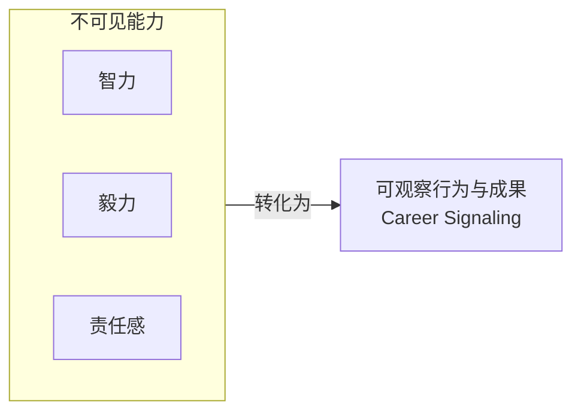
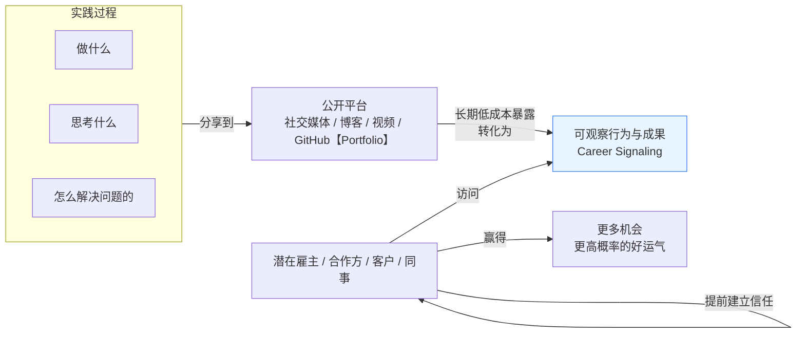
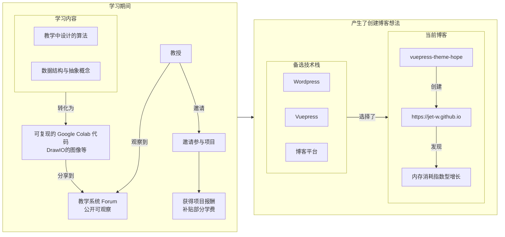
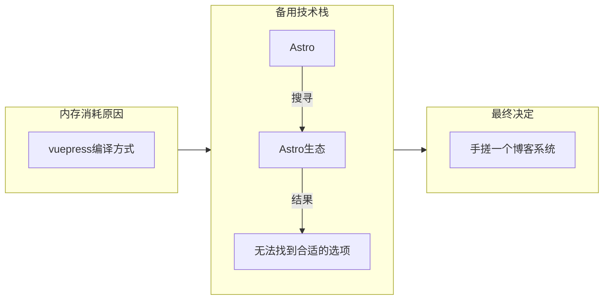

---

## Career Signaling  （职业信号传递）

**Career Signaling** 正在变成一项对普通人
* 非常重要
* **性价比极高**的事情

---

## Career Signaling 本质

---

## Career Signaling实践

---

## 简历V.S. Portfolio

### 简历
- 学历
- 曾任职的公司
- 职位
- 内部项目经历

### Portfolio

- 技术文章
- 真实项目经验
- GitHub
- 视频等

---

## 我的Portfolio

---

## 我的新博客系统

---

## 下一步计划

* 修改为可复用的npm包发布出去，供其他人使用
* 制作博客系统教学视频
* 制作各类博客系统插件以供使用
* 持续维护博客系统