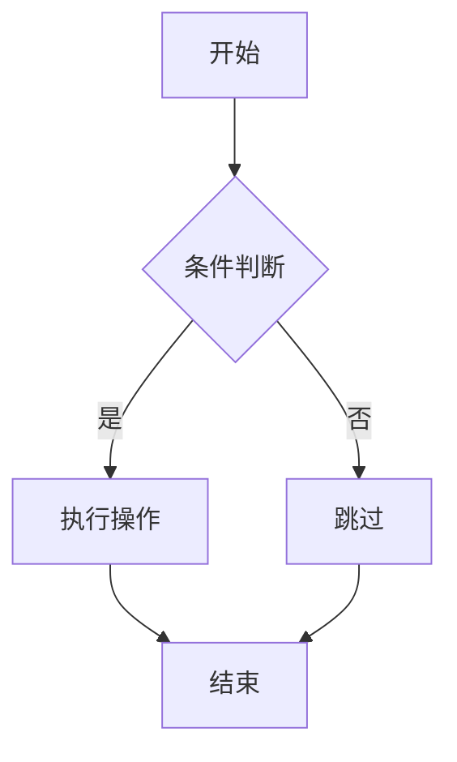

# Astro Blog 使用教程

从零开始，创建你的技术博客

---

## 目录

1. **系统概览** - 了解博客架构
2. **快速开始** - 安装与运行
3. **内容创作** - 文章编写指南
4. **特色功能** - Markdown 增强
5. **幻灯片** - 创建演示文稿
6. **配置定制** - 个性化设置
7. **部署上线** - 发布到互联网

---

# 第一章

## 系统概览

----

## 技术栈

| 技术 | 用途 |
|------|------|
| **Astro 5** | 静态站点生成器 |
| **Vue 3** | 交互式组件 |
| **TypeScript** | 类型安全 |
| **Tailwind CSS** | 样式系统 |
| **Reveal.js** | 幻灯片演示 |

----

## 主要特性

<p class="fragment">Markdown & MDX 支持</p>
<p class="fragment">代码高亮 (100+ 语言)</p>
<p class="fragment">数学公式 (LaTeX/KaTeX)</p>
<p class="fragment">流程图 (Mermaid)</p>
<p class="fragment">数据可视化 (ECharts)</p>
<p class="fragment">幻灯片演示 (Reveal.js)</p>

----

## 目录结构

```
blog/
├── content/           # 内容目录
│   ├── posts/        # 博客文章
│   ├── pages/        # 静态页面
│   └── slides/       # 独立幻灯片
├── src/
│   ├── config/       # 配置文件
│   ├── components/   # 组件
│   ├── layouts/      # 布局模板
│   └── plugins/      # Markdown 插件
└── public/           # 静态资源
```

---

# 第二章

## 快速开始

----

## 环境要求

- **Node.js** 18.0 或更高版本
- **npm** 或 **pnpm** 包管理器
- 代码编辑器 (推荐 VS Code)

----

## 安装步骤

```bash
# 1. 克隆项目
git clone <repository-url>

# 2. 进入目录
cd astro-blog

# 3. 安装依赖
npm install

# 4. 启动开发服务器
npm run dev
```

----

## 常用命令

| 命令 | 说明 |
|------|------|
| `npm run dev` | 启动开发服务器 |
| `npm run build` | 构建生产版本 |
| `npm run preview` | 预览构建结果 |

访问 `http://localhost:4321` 查看博客

---

# 第三章

## 内容创作

----

## 创建文章

在 `content/posts/` 目录下创建 `.md` 文件：

```
content/posts/
├── my-first-post.md      # 根目录文章
├── tutorial/
│   ├── README.md         # 目录首页
│   └── getting-started.md
└── projects/
    └── project-a.md
```

----

## Frontmatter 配置

每篇文章必须以 YAML 格式的元数据开头：

```yaml
---
title: 文章标题（必填）
description: 文章描述
pubDate: 2025-01-05
author: 作者名
tags: [标签1, 标签2]
categories: [分类]
draft: false
star: false
---
```

----

## 必填与可选字段

| 字段 | 必填 | 说明 |
|------|:----:|------|
| `title` | ✅ | 文章标题 |
| `pubDate` | ✅ | 发布日期 |
| `description` | - | SEO 描述 |
| `author` | - | 作者名 |
| `tags` | - | 标签列表 |
| `categories` | - | 分类 |
| `draft` | - | 草稿状态 |

----

## URL 映射规则

文件路径决定访问 URL：

| 文件路径 | 访问 URL |
|----------|----------|
| `posts/hello.md` | `/posts/hello` |
| `posts/guide/intro.md` | `/posts/guide/intro` |
| `posts/guide/README.md` | `/posts/guide` |

---

# 第四章

## 特色功能

----

## 提示容器

六种预设容器样式：

```markdown
::: tip 提示
这是一个提示信息
:::

::: warning 警告
这是警告信息
:::

::: danger 危险
这是危险警告
:::
```

----

## 容器类型一览

| 类型 | 图标 | 用途 |
|------|------|------|
| `tip` | 💡 | 技巧建议 |
| `info` | ℹ️ | 补充信息 |
| `note` | 📝 | 重要备注 |
| `warning` | ⚠️ | 警告提醒 |
| `danger` | 🚨 | 危险警示 |
| `details` | 📋 | 可折叠内容 |

----

## 代码高亮

支持 100+ 种编程语言：

````markdown
```javascript
function hello(name) {
  console.log(`Hello, ${name}!`);
}
```

```python
def hello(name):
    print(f"Hello, {name}!")
```
````

----

## 数学公式

使用 LaTeX 语法：

**行内公式：** `$E = mc^2$`

**块级公式：**
```latex
$$
\int_{-\infty}^{\infty} e^{-x^2} dx = \sqrt{\pi}
$$
```

----

## Mermaid 流程图

````markdown

````

----

## Mermaid 图表类型

- **流程图** - `graph TD/LR/BT/RL`
- **时序图** - `sequenceDiagram`
- **类图** - `classDiagram`
- **甘特图** - `gantt`
- **饼图** - `pie`
- **状态图** - `stateDiagram-v2`

----

## ECharts 图表

在幻灯片中支持交互式图表：

````markdown
```echarts
{
  "xAxis": { "type": "category", "data": ["A", "B", "C"] },
  "yAxis": { "type": "value" },
  "series": [{ "data": [120, 200, 150], "type": "bar" }]
}
```
````

---

# 第五章

## 幻灯片演示

----

## 三种使用方式

| 方式 | 位置 | 说明 |
|------|------|------|
| 独立幻灯片 | `content/slides/` | 专门的演示页面 |
| 文章内幻灯片 | `content/posts/` | `layout: slides` |
| 嵌入式幻灯片 | `.mdx` 文件 | `<Slides>` 组件 |

----

## 方式一：独立幻灯片

在 `content/slides/` 创建文件：

```markdown
---
title: 我的演示
theme: black
slideNumber: true
---

# 第一页

内容...

---

# 第二页

使用 `---` 分隔幻灯片
```

----

## 方式二：文章内幻灯片

在 frontmatter 中设置 `layout: slides`：

```yaml
---
title: 技术分享
pubDate: 2025-01-05
layout: slides
theme: white
transition: fade
---
```

整篇文章将渲染为幻灯片

----

## 方式三：嵌入幻灯片

在 `.mdx` 文件中使用组件：

```jsx
import Slides from '@/components/media/Slides.astro';

<Slides src="/slides/demo" height="400px" />

// 或内联内容
<Slides height="400px">
# 标题
内容...
</Slides>
```

----

## 幻灯片分隔符

| 分隔符 | 方向 | 说明 |
|--------|------|------|
| `---` | 水平 ➡️ | 主线内容 |
| `----` | 垂直 ⬇️ | 章节子内容 |

```markdown
# 第一章 (按 →)
---
# 第二章
----
## 2.1 详细 (按 ↓)
----
## 2.2 更多
---
# 第三章
```

----

## 可用主题

| 主题 | 风格 |
|------|------|
| `black` | 黑色背景（默认） |
| `white` | 白色背景 |
| `league` | 深灰商务风 |
| `night` | 深蓝夜间模式 |
| `solarized` | 开发者配色 |
| `moon` | 深蓝月光风 |

----

## 快捷键

| 按键 | 功能 |
|------|------|
| `→` / `Space` | 下一页 |
| `←` | 上一页 |
| `↑` / `↓` | 垂直导航 |
| `Esc` / `O` | 概览模式 |
| `F` | 全屏 |
| `S` | 演讲者视图 |

---

# 第六章

## 配置定制

----

## 站点配置

编辑 `src/config/site.ts`：

```typescript
export const siteConfig = {
  title: "我的博客",
  description: "博客描述",
  author: "作者名",
  email: "email@example.com",
  avatar: "/avatar.png",
}
```

----

## 社交链接

编辑 `src/config/social.ts`：

```typescript
export const socialLinks = [
  { name: 'GitHub', url: 'https://github.com/xxx' },
  { name: 'Twitter', url: 'https://twitter.com/xxx' },
  { name: 'Email', url: 'mailto:xxx@example.com' },
]
```

----

## 导航菜单

编辑 `src/config/menu.ts`：

```typescript
export const menuItems = [
  { title: '首页', path: '/' },
  { title: '博客', path: '/posts' },
  { title: '关于', path: '/about' },
]
```

---

# 第七章

## 部署上线

----

## 构建生产版本

```bash
# 构建
npm run build

# 本地预览
npm run preview
```

构建产物在 `dist/` 目录

----

## 部署平台

| 平台 | 特点 |
|------|------|
| **Vercel** | 零配置，自动部署 |
| **Netlify** | 功能丰富，CDN 加速 |
| **GitHub Pages** | 免费，适合开源项目 |
| **Cloudflare Pages** | 全球 CDN，速度快 |

----

## Vercel 部署

1. 将代码推送到 GitHub
2. 在 Vercel 导入项目
3. 自动检测 Astro 框架
4. 点击 Deploy

每次 push 自动更新！

----

## GitHub Pages 部署

```yaml
# .github/workflows/deploy.yml
name: Deploy to GitHub Pages
on:
  push:
    branches: [main]
jobs:
  build:
    runs-on: ubuntu-latest
    steps:
      - uses: actions/checkout@v4
      - uses: actions/setup-node@v4
      - run: npm install && npm run build
      - uses: peaceiris/actions-gh-pages@v3
        with:
          github_token: ${{ secrets.GITHUB_TOKEN }}
          publish_dir: ./dist
```

---

# 总结

----

## 核心要点回顾

<p class="fragment">📁 内容放在 `content/posts/` 目录</p>
<p class="fragment">📝 使用 Markdown + Frontmatter 编写</p>
<p class="fragment">✨ 善用容器、代码块、图表等功能</p>
<p class="fragment">🎬 幻灯片有三种创建方式</p>
<p class="fragment">⚙️ 通过 config 文件个性化定制</p>
<p class="fragment">🚀 一键部署到各大平台</p>

----

## 学习资源

- 📚 **博客文档** - `/posts/blog_docs/`
- 🎯 **示例幻灯片** - `/slides/demo`
- 🔗 **Astro 官网** - astro.build
- 🔗 **Reveal.js** - revealjs.com
- 🔗 **Mermaid** - mermaid.js.org

----

## 开始创作吧！

```bash
# 创建你的第一篇文章
touch content/posts/my-first-post.md

# 启动开发服务器
npm run dev

# 开始写作 ✍️
```

---

# 谢谢！

有问题欢迎交流讨论

按 `Esc` 查看所有幻灯片概览
