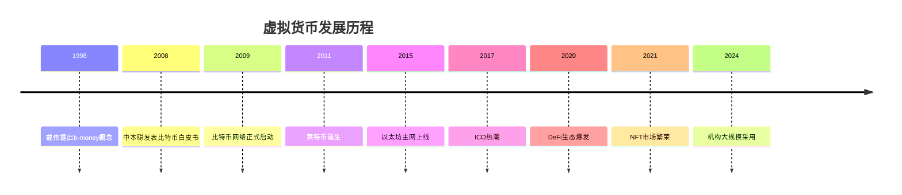
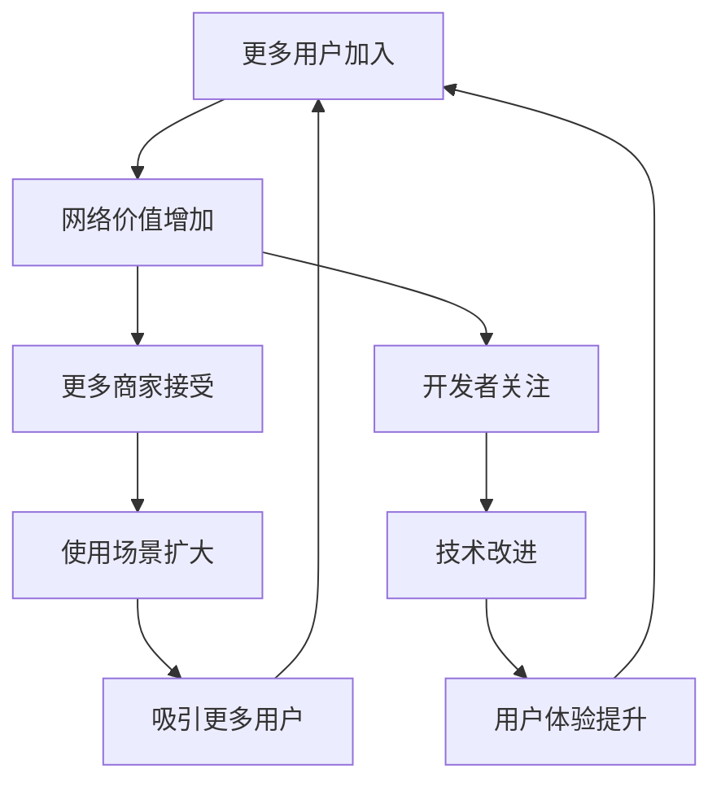

# 第1章：虚拟货币基础概念

::: tip 学习目标
- 理解虚拟货币的定义和本质
- 了解虚拟货币的发展历史
- 掌握数字货币、加密货币、虚拟货币的区别
- 认识主要的虚拟货币类型
:::

## 虚拟货币的定义与本质

### 核心概念

虚拟货币（Virtual Currency）是指使用密码学技术保障安全性的数字化货币形式，不依赖于传统的中央银行或政府机构发行。

::: note 关键特征
- **数字化形式**：完全以电子数据形式存在
- **去中心化**：无需中央权威机构控制
- **密码学保护**：使用加密算法确保安全性
- **全球流通**：可跨越地理边界进行交易
:::

### 与传统货币的区别

| 特征 | 传统货币 | 虚拟货币 |
|------|----------|----------|
| 发行机构 | 中央银行 | 算法/协议 |
| 物理形态 | 纸币、硬币 | 数字代码 |
| 交易验证 | 银行系统 | 网络共识 |
| 存储方式 | 银行账户 | 数字钱包 |
| 透明度 | 有限 | 高度透明 |

## 虚拟货币的发展历史

### 重要发展节点



### 发展阶段分析

1. **概念萌芽期（1990s-2008）**
   - 密码朋克运动兴起
   - 数字现金概念提出
   - 技术基础逐步建立

2. **技术验证期（2009-2013）**
   - 比特币网络稳定运行
   - 早期采用者参与
   - 技术可行性得到验证

3. **生态发展期（2014-2019）**
   - 多种虚拟货币涌现
   - 交易所和钱包服务发展
   - 监管框架开始建立

4. **主流接受期（2020-至今）**
   - 机构投资者入场
   - 各国央行研发数字货币
   - Web3.0生态繁荣发展

## 货币类型的区分

### 数字货币 vs 加密货币 vs 虚拟货币

::: warning 概念区分
这三个概念经常被混用，但实际上有细微差别：

- **数字货币**：最广泛的概念，包括所有数字形式的货币
- **虚拟货币**：特指在虚拟环境中使用的数字货币
- **加密货币**：使用密码学技术保护的去中心化数字货币
:::

```python
# 概念层级关系示例
class DigitalCurrency:
    """数字货币基类 - 最广泛的概念"""
    def __init__(self, name, is_digital=True):
        self.name = name
        self.is_digital = is_digital

class VirtualCurrency(DigitalCurrency):
    """虚拟货币 - 在特定环境中使用的数字货币"""
    def __init__(self, name, platform):
        super().__init__(name)
        self.platform = platform  # 使用平台

class Cryptocurrency(VirtualCurrency):
    """加密货币 - 使用密码学保护的去中心化货币"""
    def __init__(self, name, consensus_mechanism, blockchain):
        super().__init__(name, "Decentralized Network")
        self.consensus_mechanism = consensus_mechanism
        self.blockchain = blockchain
        self.is_decentralized = True

# 实例化不同类型的货币
cbdc = DigitalCurrency("央行数字货币")  # 中心化数字货币
game_coin = VirtualCurrency("游戏金币", "某游戏平台")  # 游戏虚拟货币
bitcoin = Cryptocurrency("Bitcoin", "PoW", "Bitcoin Blockchain")  # 加密货币

print(f"比特币是否去中心化：{bitcoin.is_decentralized}")
print(f"比特币共识机制：{bitcoin.consensus_mechanism}")
```

## 主要虚拟货币类型

### 1. 支付型代币（Payment Tokens）

**特点**：专门用于价值转移和支付
**代表**：比特币（BTC）、莱特币（LTC）

```python
class PaymentToken:
    """支付型代币示例"""
    def __init__(self, name, total_supply, block_time):
        self.name = name
        self.total_supply = total_supply  # 总供应量
        self.block_time = block_time      # 出块时间
        self.primary_use = "支付和价值存储"

    def calculate_transaction_fee(self, amount, congestion_level):
        """计算交易费用"""
        base_fee = amount * 0.001  # 基础费率0.1%
        congestion_fee = base_fee * congestion_level  # 网络拥堵费
        return base_fee + congestion_fee

# 比特币示例
bitcoin = PaymentToken("Bitcoin", 21_000_000, 10)  # 2100万总量，10分钟出块
print(f"转账100 BTC的预估费用：{bitcoin.calculate_transaction_fee(100, 1.5):.4f} BTC")
```

### 2. 平台型代币（Platform Tokens）

**特点**：为智能合约和DApp提供基础设施
**代表**：以太坊（ETH）、币安智能链（BNB）

```python
class PlatformToken:
    """平台型代币示例"""
    def __init__(self, name, native_token, virtual_machine):
        self.name = name
        self.native_token = native_token
        self.virtual_machine = virtual_machine
        self.supported_features = []

    def add_feature(self, feature):
        """添加平台功能"""
        self.supported_features.append(feature)

    def execute_smart_contract(self, contract_code, gas_limit):
        """执行智能合约"""
        gas_used = min(len(contract_code) * 100, gas_limit)  # 简化的gas计算
        return {
            "success": gas_used <= gas_limit,
            "gas_used": gas_used,
            "remaining_gas": gas_limit - gas_used
        }

# 以太坊示例
ethereum = PlatformToken("Ethereum", "ETH", "EVM")
ethereum.add_feature("智能合约")
ethereum.add_feature("DeFi协议")
ethereum.add_feature("NFT")

# 执行智能合约示例
contract_result = ethereum.execute_smart_contract("transfer(address,uint256)", 21000)
print(f"合约执行结果：{contract_result}")
```

### 3. 功能型代币（Utility Tokens）

**特点**：在特定生态系统中提供特殊功能或权益
**代表**：Chainlink（LINK）、Basic Attention Token（BAT）

```python
import random
from datetime import datetime

class UtilityToken:
    """功能型代币示例"""
    def __init__(self, name, symbol, use_case):
        self.name = name
        self.symbol = symbol
        self.use_case = use_case
        self.holders = {}
        self.total_supply = 0

    def mint_tokens(self, recipient, amount, reason):
        """铸造代币"""
        if recipient not in self.holders:
            self.holders[recipient] = 0

        self.holders[recipient] += amount
        self.total_supply += amount

        print(f"为 {recipient} 铸造 {amount} {self.symbol}，原因：{reason}")

    def use_for_service(self, user, amount, service):
        """使用代币获取服务"""
        if user in self.holders and self.holders[user] >= amount:
            self.holders[user] -= amount
            return f"用户 {user} 使用 {amount} {self.symbol} 获取服务：{service}"
        else:
            return f"用户 {user} 余额不足"

# Chainlink LINK代币示例
chainlink = UtilityToken("Chainlink", "LINK", "Oracle服务支付")

# 为预言机节点提供者铸造奖励
chainlink.mint_tokens("Oracle_Node_1", 100, "提供准确数据")

# 智能合约使用LINK支付预言机服务
result = chainlink.use_for_service("DeFi_Protocol", 10, "获取ETH/USD价格数据")
print(result)
```

### 4. 治理型代币（Governance Tokens）

**特点**：持有者可以参与项目决策和治理
**代表**：Uniswap（UNI）、Compound（COMP）

```python
from collections import defaultdict
from datetime import datetime, timedelta

class GovernanceToken:
    """治理型代币示例"""
    def __init__(self, name, symbol):
        self.name = name
        self.symbol = symbol
        self.holders = defaultdict(int)
        self.proposals = []
        self.votes = defaultdict(dict)  # {proposal_id: {voter: vote_power}}

    def distribute_tokens(self, recipient, amount):
        """分发治理代币"""
        self.holders[recipient] += amount
        print(f"向 {recipient} 分发 {amount} {self.symbol}")

    def create_proposal(self, proposer, title, description, voting_period_days=7):
        """创建治理提案"""
        if self.holders[proposer] < 1000:  # 需要至少1000代币才能提案
            return "提案者持币量不足，无法创建提案"

        proposal = {
            "id": len(self.proposals),
            "proposer": proposer,
            "title": title,
            "description": description,
            "created_at": datetime.now(),
            "voting_end": datetime.now() + timedelta(days=voting_period_days),
            "yes_votes": 0,
            "no_votes": 0,
            "status": "active"
        }

        self.proposals.append(proposal)
        return f"提案 #{proposal['id']} 创建成功：{title}"

    def vote(self, voter, proposal_id, support):
        """投票"""
        if proposal_id >= len(self.proposals):
            return "提案不存在"

        proposal = self.proposals[proposal_id]

        # 检查投票期限
        if datetime.now() > proposal["voting_end"]:
            return "投票已截止"

        # 计算投票权重（等于持币数量）
        vote_power = self.holders[voter]

        if vote_power == 0:
            return "无投票权（未持有代币）"

        # 记录投票
        self.votes[proposal_id][voter] = vote_power if support else -vote_power

        # 更新提案计票
        if support:
            proposal["yes_votes"] += vote_power
        else:
            proposal["no_votes"] += vote_power

        return f"{voter} 投票完成，权重：{vote_power}"

    def finalize_proposal(self, proposal_id):
        """结算提案"""
        proposal = self.proposals[proposal_id]

        if datetime.now() < proposal["voting_end"]:
            return "投票尚未截止"

        if proposal["yes_votes"] > proposal["no_votes"]:
            proposal["status"] = "passed"
            result = "通过"
        else:
            proposal["status"] = "rejected"
            result = "拒绝"

        return f"提案 #{proposal_id} {result}，支持票：{proposal['yes_votes']}，反对票：{proposal['no_votes']}"

# Uniswap UNI治理示例
uniswap_dao = GovernanceToken("Uniswap", "UNI")

# 分发治理代币
uniswap_dao.distribute_tokens("社区成员A", 5000)
uniswap_dao.distribute_tokens("社区成员B", 3000)
uniswap_dao.distribute_tokens("开发团队", 10000)

# 创建提案
proposal_result = uniswap_dao.create_proposal(
    "开发团队",
    "增加新交易对手续费池",
    "提议为USDC/USDT交易对创建0.01%手续费池"
)
print(proposal_result)

# 投票
print(uniswap_dao.vote("社区成员A", 0, True))   # 支持
print(uniswap_dao.vote("社区成员B", 0, False))  # 反对
print(uniswap_dao.vote("开发团队", 0, True))    # 支持

# 结算（模拟投票期结束）
uniswap_dao.proposals[0]["voting_end"] = datetime.now() - timedelta(days=1)
print(uniswap_dao.finalize_proposal(0))
```

## 虚拟货币的价值来源

### 1. 技术价值

虚拟货币的底层技术创新为其提供了基础价值：

```python
def calculate_network_value(active_users, transaction_volume, utility_score):
    """
    计算网络价值的简化模型
    参数：
    - active_users: 活跃用户数
    - transaction_volume: 交易量
    - utility_score: 实用性评分 (1-10)
    """
    # 梅特卡夫定律：网络价值与用户数的平方成正比
    network_effect = active_users ** 1.5  # 简化版本

    # 交易活跃度价值
    transaction_value = transaction_volume * 0.01

    # 实用性价值
    utility_value = utility_score * 1000

    total_value = network_effect + transaction_value + utility_value

    return {
        "network_effect": network_effect,
        "transaction_value": transaction_value,
        "utility_value": utility_value,
        "total_estimated_value": total_value
    }

# 比特币网络价值评估示例
btc_value = calculate_network_value(
    active_users=50_000_000,      # 5000万活跃用户
    transaction_volume=1_000_000,  # 100万日交易量
    utility_score=8               # 实用性评分8分
)

print("比特币网络价值评估：")
for key, value in btc_value.items():
    print(f"  {key}: {value:,.0f}")
```

### 2. 经济价值

::: note 供需关系
虚拟货币的价格主要由市场供需关系决定：

- **供应侧**：发行机制、通胀率、销毁机制
- **需求侧**：投资需求、支付需求、投机需求
- **市场情绪**：新闻事件、监管政策、技术进展
:::

### 3. 网络效应



## 风险与挑战

### 主要风险因素

1. **技术风险**
   - 代码漏洞
   - 网络攻击
   - 扩容问题

2. **市场风险**
   - 价格剧烈波动
   - 流动性不足
   - 市场操纵

3. **监管风险**
   - 政策不确定性
   - 合规要求变化
   - 禁止使用风险

4. **操作风险**
   - 私钥丢失
   - 钱包安全
   - 交易所风险

::: warning 投资提醒

虚拟货币投资具有高风险特性，价格波动巨大，投资前请：
1. 充分了解相关风险
2. 只投资能承受损失的资金
3. 做好充分的研究和准备
4. 考虑寻求专业建议
:::

## 本章小结

通过本章学习，我们了解了：

1. **虚拟货币的基本定义**：数字化、去中心化、加密保护的货币形式
2. **发展历程**：从概念萌芽到主流接受的演进过程
3. **类型分类**：支付型、平台型、功能型、治理型等不同类别
4. **价值来源**：技术创新、网络效应、市场供需等因素
5. **风险认知**：技术、市场、监管、操作等多维度风险

这些基础概念为后续深入学习区块链技术和具体应用奠定了重要基础。在下一章中，我们将深入探讨支撑虚拟货币的核心技术——区块链技术原理。