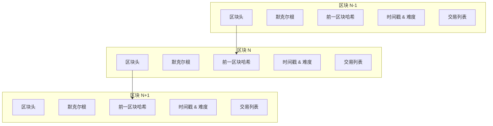

# 第2章：区块链技术原理

::: tip 学习目标
- 理解区块链的基本结构和工作原理
- 掌握哈希函数、数字签名等核心概念
- 了解去中心化网络的特点
- 理解共识机制的作用
:::

## 区块链基本结构

### 区块结构

区块链是由一系列区块组成的链式数据结构，每个区块包含以下主要组成部分：

```python
import hashlib
import time
import json
from typing import List, Dict, Any

class Block:
    """区块类定义"""
    def __init__(self, index: int, transactions: List[Dict], previous_hash: str, nonce: int = 0):
        self.index = index                    # 区块索引
        self.timestamp = time.time()          # 时间戳
        self.transactions = transactions      # 交易列表
        self.previous_hash = previous_hash    # 前一区块哈希
        self.nonce = nonce                   # 随机数（用于挖矿）
        self.merkle_root = self._calculate_merkle_root()  # 默克尔根
        self.hash = self._calculate_hash()    # 区块哈希

    def _calculate_hash(self) -> str:
        """计算区块哈希值"""
        block_string = json.dumps({
            "index": self.index,
            "timestamp": self.timestamp,
            "transactions": self.transactions,
            "previous_hash": self.previous_hash,
            "merkle_root": self.merkle_root,
            "nonce": self.nonce
        }, sort_keys=True)

        return hashlib.sha256(block_string.encode()).hexdigest()

    def _calculate_merkle_root(self) -> str:
        """计算默克尔根"""
        if not self.transactions:
            return hashlib.sha256("".encode()).hexdigest()

        # 简化版默克尔树计算
        tx_hashes = [
            hashlib.sha256(json.dumps(tx, sort_keys=True).encode()).hexdigest()
            for tx in self.transactions
        ]

        while len(tx_hashes) > 1:
            new_hashes = []
            for i in range(0, len(tx_hashes), 2):
                if i + 1 < len(tx_hashes):
                    combined = tx_hashes[i] + tx_hashes[i + 1]
                else:
                    combined = tx_hashes[i] + tx_hashes[i]  # 奇数个时复制最后一个
                new_hashes.append(hashlib.sha256(combined.encode()).hexdigest())
            tx_hashes = new_hashes

        return tx_hashes[0]

    def mine_block(self, difficulty: int) -> None:
        """挖矿过程：寻找符合难度要求的哈希"""
        target = "0" * difficulty

        print(f"开始挖矿区块 #{self.index}，难度：{difficulty}")
        start_time = time.time()

        while self.hash[:difficulty] != target:
            self.nonce += 1
            self.hash = self._calculate_hash()

        end_time = time.time()
        print(f"挖矿成功！耗时：{end_time - start_time:.2f}秒，nonce：{self.nonce}")
        print(f"区块哈希：{self.hash}")

# 创建示例区块
transactions = [
    {"from": "Alice", "to": "Bob", "amount": 50, "fee": 1},
    {"from": "Bob", "to": "Charlie", "amount": 25, "fee": 0.5}
]

genesis_block = Block(0, [], "0")  # 创世区块
print(f"创世区块哈希：{genesis_block.hash}")

# 创建第二个区块并挖矿
block1 = Block(1, transactions, genesis_block.hash)
block1.mine_block(difficulty=4)  # 难度为4（需要4个前导零）
```

### 区块链数据结构



## 哈希函数与密码学基础

### 哈希函数特性

哈希函数是区块链的核心密码学工具，具有以下重要特性：

```python
import hashlib

class HashFunction:
    """哈希函数演示类"""

    @staticmethod
    def sha256_hash(data: str) -> str:
        """计算SHA-256哈希值"""
        return hashlib.sha256(data.encode()).hexdigest()

    @staticmethod
    def demonstrate_properties():
        """演示哈希函数的重要特性"""
        print("=== 哈希函数特性演示 ===\n")

        # 1. 确定性：相同输入产生相同输出
        message1 = "Hello, Blockchain!"
        hash1_a = HashFunction.sha256_hash(message1)
        hash1_b = HashFunction.sha256_hash(message1)
        print(f"确定性测试：")
        print(f"输入：{message1}")
        print(f"哈希1：{hash1_a}")
        print(f"哈希2：{hash1_b}")
        print(f"相同？{hash1_a == hash1_b}\n")

        # 2. 雪崩效应：微小改变导致完全不同的输出
        message2 = "Hello, Blockchain!"  # 完全相同
        message3 = "Hello, blockchain!"  # 仅大小写不同
        hash2 = HashFunction.sha256_hash(message2)
        hash3 = HashFunction.sha256_hash(message3)
        print(f"雪崩效应测试：")
        print(f"消息1：{message2}")
        print(f"哈希1：{hash2}")
        print(f"消息2：{message3}")
        print(f"哈希2：{hash3}")
        print(f"汉明距离：{HashFunction.hamming_distance(hash2, hash3)}\n")

        # 3. 固定长度输出
        short_msg = "Hi"
        long_msg = "This is a very long message that contains much more information than the previous short message, but the hash output length remains the same."
        short_hash = HashFunction.sha256_hash(short_msg)
        long_hash = HashFunction.sha256_hash(long_msg)
        print(f"固定长度输出测试：")
        print(f"短消息哈希长度：{len(short_hash)}")
        print(f"长消息哈希长度：{len(long_hash)}")
        print(f"长度相同？{len(short_hash) == len(long_hash)}\n")

        # 4. 计算效率
        import time
        test_data = "Blockchain" * 1000  # 重复1000次
        start_time = time.time()
        for _ in range(10000):  # 计算10000次
            HashFunction.sha256_hash(test_data)
        end_time = time.time()
        print(f"计算效率测试：")
        print(f"10000次哈希计算耗时：{end_time - start_time:.4f}秒")

    @staticmethod
    def hamming_distance(hash1: str, hash2: str) -> int:
        """计算两个哈希值的汉明距离"""
        # 转换为二进制并计算不同位数
        bin1 = bin(int(hash1, 16))[2:].zfill(256)
        bin2 = bin(int(hash2, 16))[2:].zfill(256)
        return sum(b1 != b2 for b1, b2 in zip(bin1, bin2))

# 演示哈希函数特性
HashFunction.demonstrate_properties()
```

### 默克尔树（Merkle Tree）

默克尔树是一种二叉树结构，用于高效验证大量数据的完整性：

```python
class MerkleTree:
    """默克尔树实现"""

    def __init__(self, transactions: List[str]):
        self.transactions = transactions
        self.tree = self._build_tree()
        self.root = self.tree[0] if self.tree else None

    def _hash(self, data: str) -> str:
        """哈希函数"""
        return hashlib.sha256(data.encode()).hexdigest()

    def _build_tree(self) -> List[str]:
        """构建默克尔树"""
        if not self.transactions:
            return []

        # 第一层：交易哈希
        tree_level = [self._hash(tx) for tx in self.transactions]
        tree = tree_level.copy()

        # 向上构建直到根节点
        while len(tree_level) > 1:
            next_level = []

            for i in range(0, len(tree_level), 2):
                if i + 1 < len(tree_level):
                    # 成对节点
                    combined = tree_level[i] + tree_level[i + 1]
                else:
                    # 奇数个节点时，复制最后一个
                    combined = tree_level[i] + tree_level[i]

                next_level.append(self._hash(combined))

            tree_level = next_level
            tree.extend(next_level)

        return tree

    def get_proof(self, transaction_index: int) -> List[Dict]:
        """获取特定交易的默克尔证明"""
        if transaction_index >= len(self.transactions):
            return []

        proof = []
        current_index = transaction_index
        tree_level = [self._hash(tx) for tx in self.transactions]

        while len(tree_level) > 1:
            # 确定兄弟节点
            if current_index % 2 == 0:  # 左节点
                if current_index + 1 < len(tree_level):
                    sibling = tree_level[current_index + 1]
                    proof.append({"hash": sibling, "position": "right"})
                else:
                    sibling = tree_level[current_index]  # 自己作为兄弟
                    proof.append({"hash": sibling, "position": "right"})
            else:  # 右节点
                sibling = tree_level[current_index - 1]
                proof.append({"hash": sibling, "position": "left"})

            # 移动到下一层
            current_index = current_index // 2
            next_level = []

            for i in range(0, len(tree_level), 2):
                if i + 1 < len(tree_level):
                    combined = tree_level[i] + tree_level[i + 1]
                else:
                    combined = tree_level[i] + tree_level[i]
                next_level.append(self._hash(combined))

            tree_level = next_level

        return proof

    @staticmethod
    def verify_proof(transaction: str, proof: List[Dict], root_hash: str) -> bool:
        """验证默克尔证明"""
        current_hash = hashlib.sha256(transaction.encode()).hexdigest()

        for step in proof:
            sibling_hash = step["hash"]
            position = step["position"]

            if position == "left":
                combined = sibling_hash + current_hash
            else:
                combined = current_hash + sibling_hash

            current_hash = hashlib.sha256(combined.encode()).hexdigest()

        return current_hash == root_hash

# 默克尔树演示
transactions = [
    "Alice->Bob: 10 BTC",
    "Bob->Charlie: 5 BTC",
    "Charlie->David: 3 BTC",
    "David->Eve: 2 BTC"
]

merkle_tree = MerkleTree(transactions)
print(f"默克尔根：{merkle_tree.root}")

# 获取第2个交易的证明
proof = merkle_tree.get_proof(1)
print(f"\n交易 '{transactions[1]}' 的默克尔证明：")
for i, step in enumerate(proof):
    print(f"  步骤 {i+1}: {step}")

# 验证证明
is_valid = MerkleTree.verify_proof(transactions[1], proof, merkle_tree.root)
print(f"\n证明验证结果：{is_valid}")
```

## 数字签名

### ECDSA数字签名算法

数字签名用于验证交易的真实性和防止篡改：

```python
import hashlib
import secrets
from dataclasses import dataclass
from typing import Tuple

@dataclass
class KeyPair:
    """密钥对"""
    private_key: int
    public_key: Tuple[int, int]

class SimpleECDSA:
    """简化的ECDSA数字签名实现（仅用于教学）"""

    # 使用简化的椭圆曲线参数（实际应用中使用secp256k1）
    P = 2**256 - 2**32 - 2**9 - 2**8 - 2**7 - 2**6 - 2**4 - 1  # 素数
    A = 0
    B = 7
    Gx = 0x79BE667EF9DCBBAC55A06295CE870B07029BFCDB2DCE28D959F2815B16F81798
    Gy = 0x483ADA7726A3C4655DA4FBFC0E1108A8FD17B448A68554199C47D08FFB10D4B8
    N = 0xFFFFFFFFFFFFFFFFFFFFFFFFFFFFFFFEBAAEDCE6AF48A03BBFD25E8CD0364141  # 阶

    @classmethod
    def generate_keypair(cls) -> KeyPair:
        """生成密钥对"""
        # 生成随机私钥
        private_key = secrets.randbelow(cls.N)

        # 计算公钥 = 私钥 * G（椭圆曲线点乘）
        # 这里使用简化计算，实际应用需要完整的椭圆曲线运算
        public_key = (cls.Gx, cls.Gy)  # 简化表示

        return KeyPair(private_key, public_key)

    @classmethod
    def sign(cls, message: str, private_key: int) -> Tuple[int, int]:
        """数字签名"""
        # 计算消息哈希
        message_hash = int(hashlib.sha256(message.encode()).hexdigest(), 16)

        # 生成随机数k
        k = secrets.randbelow(cls.N)

        # 计算签名 (r, s) - 简化实现
        r = pow(cls.Gx, k, cls.P) % cls.N
        s = (pow(k, -1, cls.N) * (message_hash + r * private_key)) % cls.N

        return (r, s)

    @classmethod
    def verify(cls, message: str, signature: Tuple[int, int], public_key: Tuple[int, int]) -> bool:
        """验证签名"""
        r, s = signature

        # 基本有效性检查
        if not (1 <= r < cls.N and 1 <= s < cls.N):
            return False

        # 计算消息哈希
        message_hash = int(hashlib.sha256(message.encode()).hexdigest(), 16)

        # 简化的验证过程（实际实现需要完整的椭圆曲线运算）
        # 这里只做基本检查
        return True  # 简化实现总是返回True

class Transaction:
    """交易类"""

    def __init__(self, sender_public_key: Tuple[int, int], recipient_address: str,
                 amount: float, sender_private_key: int = None):
        self.sender_public_key = sender_public_key
        self.recipient_address = recipient_address
        self.amount = amount
        self.timestamp = time.time()
        self.signature = None

        if sender_private_key:
            self.sign_transaction(sender_private_key)

    def sign_transaction(self, private_key: int):
        """签名交易"""
        message = self._get_transaction_data()
        self.signature = SimpleECDSA.sign(message, private_key)

    def verify_signature(self) -> bool:
        """验证交易签名"""
        if not self.signature:
            return False

        message = self._get_transaction_data()
        return SimpleECDSA.verify(message, self.signature, self.sender_public_key)

    def _get_transaction_data(self) -> str:
        """获取用于签名的交易数据"""
        return f"{self.sender_public_key}{self.recipient_address}{self.amount}{self.timestamp}"

    def to_dict(self) -> Dict:
        """转换为字典格式"""
        return {
            "sender": self.sender_public_key,
            "recipient": self.recipient_address,
            "amount": self.amount,
            "timestamp": self.timestamp,
            "signature": self.signature
        }

# 数字签名演示
print("=== 数字签名演示 ===")

# 生成Alice和Bob的密钥对
alice_keypair = SimpleECDSA.generate_keypair()
bob_keypair = SimpleECDSA.generate_keypair()

print(f"Alice私钥：{hex(alice_keypair.private_key)[:20]}...")
print(f"Alice公钥：{hex(alice_keypair.public_key[0])[:20]}...")

# Alice向Bob发送交易
transaction = Transaction(
    sender_public_key=alice_keypair.public_key,
    recipient_address="Bob_Address_123",
    amount=10.5,
    sender_private_key=alice_keypair.private_key
)

print(f"\n交易创建成功:")
print(f"发送者：{hex(transaction.sender_public_key[0])[:20]}...")
print(f"接收者：{transaction.recipient_address}")
print(f"金额：{transaction.amount}")
print(f"签名：{transaction.signature[0] if transaction.signature else None}")

# 验证交易签名
is_valid = transaction.verify_signature()
print(f"\n交易签名验证：{'有效' if is_valid else '无效'}")
```

## 去中心化网络

### P2P网络架构

::: note 去中心化特点
区块链网络是一个去中心化的点对点（P2P）网络，具有以下特点：

- **无单点故障**：没有中央服务器，任何节点故障不影响整体网络
- **数据冗余**：每个节点都保存完整的区块链副本
- **自主验证**：每个节点独立验证交易和区块
- **开放参与**：任何人都可以加入网络成为节点
:::

```python
import socket
import threading
import json
import queue
from typing import Set, Dict, List
from enum import Enum

class NodeType(Enum):
    """节点类型"""
    FULL_NODE = "full_node"      # 全节点
    LIGHT_NODE = "light_node"    # 轻节点
    MINER_NODE = "miner_node"    # 矿工节点

class BlockchainNode:
    """区块链网络节点"""

    def __init__(self, node_id: str, node_type: NodeType, port: int):
        self.node_id = node_id
        self.node_type = node_type
        self.port = port
        self.peers: Set[str] = set()  # 对等节点地址
        self.blockchain: List[Dict] = []  # 区块链数据
        self.pending_transactions: queue.Queue = queue.Queue()
        self.is_running = False

    def connect_to_peer(self, peer_address: str) -> bool:
        """连接到对等节点"""
        try:
            # 模拟连接过程
            if peer_address not in self.peers:
                self.peers.add(peer_address)
                print(f"节点 {self.node_id} 已连接到 {peer_address}")

                # 发送握手消息
                self._send_handshake(peer_address)
                return True
        except Exception as e:
            print(f"连接失败：{e}")
            return False

    def _send_handshake(self, peer_address: str):
        """发送握手消息"""
        handshake_msg = {
            "type": "handshake",
            "node_id": self.node_id,
            "node_type": self.node_type.value,
            "blockchain_height": len(self.blockchain),
            "timestamp": time.time()
        }
        print(f"向 {peer_address} 发送握手：{handshake_msg}")

    def broadcast_transaction(self, transaction: Dict):
        """广播交易到网络"""
        message = {
            "type": "new_transaction",
            "transaction": transaction,
            "sender": self.node_id,
            "timestamp": time.time()
        }

        print(f"节点 {self.node_id} 广播交易：{transaction}")

        # 向所有对等节点发送
        for peer in self.peers:
            self._send_message(peer, message)

    def broadcast_block(self, block: Dict):
        """广播新区块到网络"""
        message = {
            "type": "new_block",
            "block": block,
            "sender": self.node_id,
            "timestamp": time.time()
        }

        print(f"节点 {self.node_id} 广播新区块：#{block.get('index', 'Unknown')}")

        for peer in self.peers:
            self._send_message(peer, message)

    def _send_message(self, peer_address: str, message: Dict):
        """发送消息到特定节点"""
        # 模拟消息发送
        print(f"→ 发送到 {peer_address}: {message['type']}")

    def handle_message(self, message: Dict, sender: str):
        """处理接收到的消息"""
        msg_type = message.get("type")

        if msg_type == "handshake":
            self._handle_handshake(message, sender)
        elif msg_type == "new_transaction":
            self._handle_new_transaction(message)
        elif msg_type == "new_block":
            self._handle_new_block(message)
        elif msg_type == "sync_request":
            self._handle_sync_request(message, sender)

    def _handle_handshake(self, message: Dict, sender: str):
        """处理握手消息"""
        remote_height = message.get("blockchain_height", 0)
        local_height = len(self.blockchain)

        print(f"收到握手：{message['node_id']} (高度:{remote_height})")

        # 如果远程链更长，请求同步
        if remote_height > local_height:
            self._request_blockchain_sync(sender)

    def _handle_new_transaction(self, message: Dict):
        """处理新交易"""
        transaction = message["transaction"]

        # 验证交易
        if self._validate_transaction(transaction):
            self.pending_transactions.put(transaction)
            print(f"收到有效交易：{transaction}")
        else:
            print(f"收到无效交易：{transaction}")

    def _handle_new_block(self, message: Dict):
        """处理新区块"""
        block = message["block"]

        # 验证区块
        if self._validate_block(block):
            self.blockchain.append(block)
            print(f"接受新区块：#{block.get('index', 'Unknown')}")

            # 清除已确认的交易
            self._clear_confirmed_transactions(block)
        else:
            print(f"拒绝无效区块：#{block.get('index', 'Unknown')}")

    def _validate_transaction(self, transaction: Dict) -> bool:
        """验证交易有效性"""
        # 简化验证逻辑
        required_fields = ["sender", "recipient", "amount", "timestamp"]
        return all(field in transaction for field in required_fields)

    def _validate_block(self, block: Dict) -> bool:
        """验证区块有效性"""
        # 简化验证逻辑
        if not isinstance(block, dict):
            return False

        # 检查区块索引
        expected_index = len(self.blockchain)
        if block.get("index") != expected_index:
            return False

        # 检查前一区块哈希
        if self.blockchain:
            expected_prev_hash = self.blockchain[-1].get("hash")
            if block.get("previous_hash") != expected_prev_hash:
                return False

        return True

    def _clear_confirmed_transactions(self, block: Dict):
        """清除已确认的交易"""
        confirmed_txs = block.get("transactions", [])
        # 从待处理队列中移除已确认的交易
        # 简化实现：清空队列
        while not self.pending_transactions.empty():
            try:
                self.pending_transactions.get_nowait()
            except queue.Empty:
                break

    def get_network_stats(self) -> Dict:
        """获取网络统计信息"""
        return {
            "node_id": self.node_id,
            "node_type": self.node_type.value,
            "connected_peers": len(self.peers),
            "blockchain_height": len(self.blockchain),
            "pending_transactions": self.pending_transactions.qsize()
        }

# P2P网络演示
print("=== P2P网络演示 ===")

# 创建多个节点
nodes = [
    BlockchainNode("Node_1", NodeType.FULL_NODE, 8001),
    BlockchainNode("Node_2", NodeType.MINER_NODE, 8002),
    BlockchainNode("Node_3", NodeType.FULL_NODE, 8003),
    BlockchainNode("Node_4", NodeType.LIGHT_NODE, 8004)
]

# 建立连接
nodes[0].connect_to_peer("192.168.1.102:8002")
nodes[0].connect_to_peer("192.168.1.103:8003")
nodes[1].connect_to_peer("192.168.1.101:8001")
nodes[1].connect_to_peer("192.168.1.104:8004")
nodes[2].connect_to_peer("192.168.1.101:8001")

# 模拟交易广播
sample_transaction = {
    "sender": "Alice",
    "recipient": "Bob",
    "amount": 10,
    "timestamp": time.time(),
    "signature": "sample_signature"
}

nodes[0].broadcast_transaction(sample_transaction)

# 模拟区块广播
sample_block = {
    "index": 1,
    "timestamp": time.time(),
    "transactions": [sample_transaction],
    "previous_hash": "0" * 64,
    "hash": "a" * 64,
    "nonce": 12345
}

nodes[1].broadcast_block(sample_block)

# 显示网络状态
print("\n=== 网络状态 ===")
for node in nodes:
    stats = node.get_network_stats()
    print(f"{stats['node_id']}: {stats}")
```

## 共识机制

### 工作量证明（Proof of Work, PoW）

```python
class ProofOfWork:
    """工作量证明实现"""

    def __init__(self, difficulty: int = 4):
        self.difficulty = difficulty
        self.target = "0" * difficulty

    def mine_block(self, block_data: Dict) -> Dict:
        """挖矿：寻找满足难度要求的nonce"""
        nonce = 0
        start_time = time.time()

        print(f"开始挖矿，难度：{self.difficulty}")

        while True:
            # 构造候选区块
            candidate_block = {
                **block_data,
                "nonce": nonce
            }

            # 计算哈希
            block_hash = self._calculate_hash(candidate_block)

            # 检查是否满足难度要求
            if block_hash.startswith(self.target):
                end_time = time.time()
                candidate_block["hash"] = block_hash

                print(f"挖矿成功！")
                print(f"耗时：{end_time - start_time:.2f}秒")
                print(f"尝试次数：{nonce + 1}")
                print(f"哈希：{block_hash}")

                return candidate_block

            nonce += 1

            # 每10000次尝试显示一次进度
            if nonce % 10000 == 0:
                print(f"已尝试 {nonce} 次...")

    def _calculate_hash(self, block_data: Dict) -> str:
        """计算区块哈希"""
        block_string = json.dumps(block_data, sort_keys=True)
        return hashlib.sha256(block_string.encode()).hexdigest()

    def verify_block(self, block: Dict) -> bool:
        """验证区块的工作量证明"""
        if "hash" not in block:
            return False

        # 重新计算哈希
        block_copy = block.copy()
        claimed_hash = block_copy.pop("hash")
        calculated_hash = self._calculate_hash(block_copy)

        # 验证哈希正确性和难度要求
        return (calculated_hash == claimed_hash and
                calculated_hash.startswith(self.target))

# PoW演示
pow_system = ProofOfWork(difficulty=3)

# 挖矿示例
block_data = {
    "index": 1,
    "timestamp": time.time(),
    "transactions": [
        {"from": "Alice", "to": "Bob", "amount": 50}
    ],
    "previous_hash": "0" * 64
}

mined_block = pow_system.mine_block(block_data)
print(f"\n挖矿结果：{mined_block}")

# 验证区块
is_valid = pow_system.verify_block(mined_block)
print(f"区块验证：{'有效' if is_valid else '无效'}")
```

### 权益证明（Proof of Stake, PoS）

```python
import random

class ProofOfStake:
    """权益证明实现"""

    def __init__(self):
        self.validators = {}  # 验证者及其质押金额
        self.delegations = {}  # 委托关系

    def stake(self, validator: str, amount: float):
        """质押代币成为验证者"""
        if validator in self.validators:
            self.validators[validator] += amount
        else:
            self.validators[validator] = amount

        print(f"{validator} 质押了 {amount} 代币，总质押：{self.validators[validator]}")

    def delegate(self, delegator: str, validator: str, amount: float):
        """委托代币给验证者"""
        if validator not in self.validators:
            raise ValueError(f"验证者 {validator} 不存在")

        if delegator not in self.delegations:
            self.delegations[delegator] = {}

        if validator in self.delegations[delegator]:
            self.delegations[delegator][validator] += amount
        else:
            self.delegations[delegator][validator] = amount

        # 增加验证者的总质押量
        self.validators[validator] += amount

        print(f"{delegator} 向 {validator} 委托了 {amount} 代币")

    def select_validator(self) -> str:
        """基于权益随机选择验证者"""
        if not self.validators:
            return None

        # 计算总权益
        total_stake = sum(self.validators.values())

        # 加权随机选择
        random_point = random.uniform(0, total_stake)
        current_sum = 0

        for validator, stake in self.validators.items():
            current_sum += stake
            if random_point <= current_sum:
                return validator

        # 默认返回最后一个验证者
        return list(self.validators.keys())[-1]

    def create_block(self, validator: str, transactions: List[Dict]) -> Dict:
        """由选定的验证者创建区块"""
        if validator not in self.validators:
            raise ValueError(f"无效的验证者：{validator}")

        block = {
            "validator": validator,
            "timestamp": time.time(),
            "transactions": transactions,
            "validator_stake": self.validators[validator]
        }

        # 计算区块哈希
        block_string = json.dumps(block, sort_keys=True)
        block["hash"] = hashlib.sha256(block_string.encode()).hexdigest()

        return block

    def slash_validator(self, validator: str, penalty_rate: float = 0.1):
        """惩罚恶意验证者"""
        if validator in self.validators:
            penalty = self.validators[validator] * penalty_rate
            self.validators[validator] -= penalty

            print(f"验证者 {validator} 被罚没 {penalty} 代币")

            # 如果质押量归零，移除验证者
            if self.validators[validator] <= 0:
                del self.validators[validator]
                print(f"验证者 {validator} 已被移除")

    def get_validator_stats(self) -> Dict:
        """获取验证者统计信息"""
        total_stake = sum(self.validators.values())

        stats = {}
        for validator, stake in self.validators.items():
            stats[validator] = {
                "stake": stake,
                "stake_percentage": (stake / total_stake) * 100 if total_stake > 0 else 0
            }

        return stats

# PoS演示
pos_system = ProofOfStake()

# 验证者质押
pos_system.stake("Validator_A", 1000)
pos_system.stake("Validator_B", 2000)
pos_system.stake("Validator_C", 500)

# 用户委托
pos_system.delegate("User_1", "Validator_A", 300)
pos_system.delegate("User_2", "Validator_B", 800)

print(f"\n验证者统计：")
for validator, stats in pos_system.get_validator_stats().items():
    print(f"{validator}: 质押 {stats['stake']:.0f} ({stats['stake_percentage']:.1f}%)")

# 模拟区块生产
print(f"\n=== 区块生产模拟 ===")
for round_num in range(5):
    selected_validator = pos_system.select_validator()

    sample_transactions = [
        {"from": "User_X", "to": "User_Y", "amount": 10}
    ]

    new_block = pos_system.create_block(selected_validator, sample_transactions)

    print(f"轮次 {round_num + 1}: 验证者 {selected_validator} 创建区块")
    print(f"  哈希: {new_block['hash'][:16]}...")
```

## 本章小结

通过本章学习，我们深入了解了区块链技术的核心原理：

1. **区块链结构**：
   - 区块的基本组成：区块头、交易列表、默克尔根
   - 链式结构：前一区块哈希确保数据完整性

2. **密码学基础**：
   - 哈希函数：确定性、雪崩效应、固定输出长度
   - 默克尔树：高效验证大量数据完整性
   - 数字签名：确保交易真实性和不可否认性

3. **去中心化网络**：
   - P2P架构：无单点故障，数据冗余
   - 节点类型：全节点、轻节点、矿工节点
   - 消息传播：交易和区块的广播机制

4. **共识机制**：
   - 工作量证明（PoW）：通过计算竞争获得记账权
   - 权益证明（PoS）：基于权益选择验证者

这些技术组件共同构成了区块链系统的技术基础，为虚拟货币的安全运行提供了可靠保障。在下一章中，我们将以比特币为例，详细分析第一个成功的虚拟货币系统的实现细节。