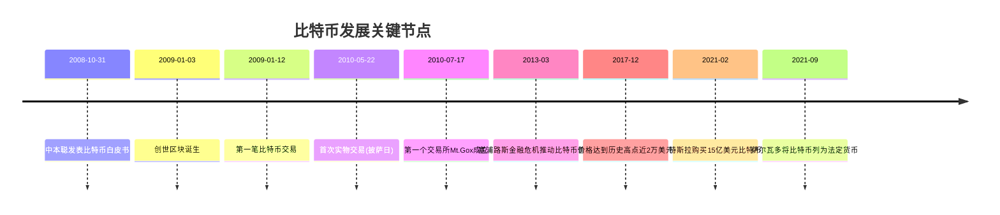

# 第3章：比特币深度解析

::: tip 学习目标
- 了解比特币的创建背景和设计理念
- 掌握比特币的技术架构
- 理解挖矿机制和奖励系统
- 学习比特币交易的验证过程
:::

## 比特币的创建背景

### 历史背景与动机

比特币诞生于2008年全球金融危机期间，中本聪（Satoshi Nakamoto）发表的白皮书《Bitcoin: A Peer-to-Peer Electronic Cash System》提出了一个去中心化的电子现金系统。

::: note 设计初衷
比特币的核心设计目标：
- **去信任化**：无需依赖第三方金融机构
- **去中心化**：没有单一控制点
- **不可篡改**：使用密码学保证安全性
- **有限供应**：总量上限2100万个
- **全球流通**：7×24小时无国界交易
:::



## 比特币技术架构

### UTXO模型

比特币使用UTXO（Unspent Transaction Output）模型，与传统账户模型不同：

```python
from typing import Dict, List, Optional, Tuple
import hashlib
import json
import time
from dataclasses import dataclass

@dataclass
class UTXO:
    """未花费交易输出"""
    txid: str          # 交易ID
    output_index: int  # 输出索引
    amount: float      # 金额
    script_pubkey: str # 锁定脚本
    address: str       # 接收地址

class UTXOSet:
    """UTXO集合管理"""

    def __init__(self):
        self.utxos: Dict[str, UTXO] = {}  # key: txid:index

    def add_utxo(self, utxo: UTXO):
        """添加UTXO"""
        key = f"{utxo.txid}:{utxo.output_index}"
        self.utxos[key] = utxo

    def spend_utxo(self, txid: str, output_index: int) -> Optional[UTXO]:
        """花费UTXO"""
        key = f"{txid}:{output_index}"
        return self.utxos.pop(key, None)

    def get_balance(self, address: str) -> float:
        """获取地址余额"""
        balance = 0
        for utxo in self.utxos.values():
            if utxo.address == address:
                balance += utxo.amount
        return balance

    def get_utxos_for_address(self, address: str) -> List[UTXO]:
        """获取地址的所有UTXO"""
        return [utxo for utxo in self.utxos.values() if utxo.address == address]

class BitcoinTransaction:
    """比特币交易"""

    def __init__(self):
        self.version = 1
        self.inputs: List[Dict] = []
        self.outputs: List[Dict] = []
        self.locktime = 0
        self.txid: Optional[str] = None

    def add_input(self, prev_txid: str, output_index: int, signature: str):
        """添加交易输入"""
        tx_input = {
            "prev_txid": prev_txid,
            "output_index": output_index,
            "signature_script": signature,
            "sequence": 0xffffffff
        }
        self.inputs.append(tx_input)

    def add_output(self, amount: float, recipient_address: str):
        """添加交易输出"""
        tx_output = {
            "amount": amount,
            "script_pubkey": f"OP_DUP OP_HASH160 {recipient_address} OP_EQUALVERIFY OP_CHECKSIG"
        }
        self.outputs.append(tx_output)

    def calculate_txid(self) -> str:
        """计算交易ID"""
        tx_data = {
            "version": self.version,
            "inputs": self.inputs,
            "outputs": self.outputs,
            "locktime": self.locktime
        }
        tx_string = json.dumps(tx_data, sort_keys=True)
        self.txid = hashlib.sha256(tx_string.encode()).hexdigest()
        return self.txid

    def calculate_fee(self, utxo_set: UTXOSet) -> float:
        """计算交易费用"""
        input_total = 0

        # 计算输入总额
        for tx_input in self.inputs:
            key = f"{tx_input['prev_txid']}:{tx_input['output_index']}"
            if key in utxo_set.utxos:
                input_total += utxo_set.utxos[key].amount

        # 计算输出总额
        output_total = sum(output["amount"] for output in self.outputs)

        return input_total - output_total

# UTXO模型演示
print("=== UTXO模型演示 ===")

# 初始化UTXO集合
utxo_set = UTXOSet()

# 创建创世交易（挖矿奖励）
genesis_utxo = UTXO(
    txid="genesis_tx",
    output_index=0,
    amount=50.0,
    script_pubkey="OP_DUP OP_HASH160 alice_pubkey OP_EQUALVERIFY OP_CHECKSIG",
    address="alice_address"
)
utxo_set.add_utxo(genesis_utxo)

print(f"Alice初始余额: {utxo_set.get_balance('alice_address')} BTC")

# Alice向Bob转账25 BTC
tx1 = BitcoinTransaction()
tx1.add_input("genesis_tx", 0, "alice_signature")
tx1.add_output(25.0, "bob_address")      # 给Bob
tx1.add_output(24.9, "alice_address")    # 找零给Alice
tx1.calculate_txid()

print(f"\n交易1 ID: {tx1.txid}")
print(f"交易费用: {tx1.calculate_fee(utxo_set)} BTC")

# 更新UTXO集合
utxo_set.spend_utxo("genesis_tx", 0)  # 花费原UTXO
utxo_set.add_utxo(UTXO(tx1.txid, 0, 25.0, "", "bob_address"))      # Bob的新UTXO
utxo_set.add_utxo(UTXO(tx1.txid, 1, 24.9, "", "alice_address"))    # Alice的找零UTXO

print(f"\n交易后余额:")
print(f"Alice: {utxo_set.get_balance('alice_address')} BTC")
print(f"Bob: {utxo_set.get_balance('bob_address')} BTC")
```

### 脚本系统

比特币使用基于栈的脚本语言来定义交易条件：

```python
from typing import List, Union
import hashlib
import time

class BitcoinScript:
    """比特币脚本解释器"""

    def __init__(self):
        self.stack: List[Union[str, bytes, int]] = []
        self.alt_stack: List[Union[str, bytes, int]] = []

    def execute(self, script: List[str]) -> bool:
        """执行脚本"""
        try:
            for operation in script:
                if operation.startswith("OP_"):
                    self._execute_opcode(operation)
                else:
                    # 普通数据推入栈
                    self.stack.append(operation)

            # 脚本成功执行且栈顶为True
            return len(self.stack) > 0 and self._is_true(self.stack[-1])

        except Exception as e:
            print(f"脚本执行错误: {e}")
            return False

    def _execute_opcode(self, opcode: str):
        """执行操作码"""
        if opcode == "OP_DUP":
            # 复制栈顶元素
            if self.stack:
                self.stack.append(self.stack[-1])

        elif opcode == "OP_HASH160":
            # 对栈顶元素执行RIPEMD160(SHA256(x))
            if self.stack:
                data = str(self.stack.pop())
                sha256_hash = hashlib.sha256(data.encode()).digest()
                ripemd160_hash = hashlib.new('ripemd160', sha256_hash).hexdigest()
                self.stack.append(ripemd160_hash)

        elif opcode == "OP_EQUALVERIFY":
            # 比较栈顶两个元素是否相等，不等则终止
            if len(self.stack) >= 2:
                a = self.stack.pop()
                b = self.stack.pop()
                if a != b:
                    raise Exception("OP_EQUALVERIFY failed")
                self.stack.append(1)  # True

        elif opcode == "OP_CHECKSIG":
            # 验证数字签名（简化实现）
            if len(self.stack) >= 2:
                pubkey = self.stack.pop()
                signature = self.stack.pop()
                # 简化的签名验证
                is_valid = self._verify_signature(signature, pubkey)
                self.stack.append(1 if is_valid else 0)

        elif opcode == "OP_CHECKMULTISIG":
            # 多重签名验证
            if not self.stack:
                raise Exception("OP_CHECKMULTISIG: 空栈")

            num_pubkeys = int(self.stack.pop())
            pubkeys = [self.stack.pop() for _ in range(num_pubkeys)]
            num_sigs = int(self.stack.pop())
            signatures = [self.stack.pop() for _ in range(num_sigs)]

            # 简化验证：至少一个签名有效
            valid_sigs = 0
            for sig in signatures:
                for pubkey in pubkeys:
                    if self._verify_signature(sig, pubkey):
                        valid_sigs += 1
                        break

            self.stack.append(1 if valid_sigs >= num_sigs else 0)

        elif opcode == "OP_RETURN":
            # OP_RETURN - 使交易无效（用于数据存储）
            raise Exception("OP_RETURN encountered")

    def _verify_signature(self, signature: str, pubkey: str) -> bool:
        """验证数字签名（简化实现）"""
        # 实际实现需要ECDSA验证
        return len(signature) > 10 and len(pubkey) > 10

    def _is_true(self, value: Union[str, bytes, int]) -> bool:
        """检查值是否为真"""
        if isinstance(value, int):
            return value != 0
        if isinstance(value, str):
            return value != "0" and value != ""
        return len(value) > 0

# 脚本示例演示
print("\n=== 比特币脚本演示 ===")

# 1. P2PKH (Pay to Public Key Hash) 脚本
print("\n1. P2PKH脚本验证:")
script_interpreter = BitcoinScript()

# 解锁脚本 (scriptSig)
unlock_script = ["valid_signature", "alice_pubkey"]

# 锁定脚本 (scriptPubKey)
lock_script = ["OP_DUP", "OP_HASH160", "alice_pubkey_hash", "OP_EQUALVERIFY", "OP_CHECKSIG"]

# 执行完整脚本
full_script = unlock_script + lock_script
result = script_interpreter.execute(full_script)
print(f"P2PKH脚本执行结果: {result}")

# 2. 多重签名脚本
print("\n2. 多重签名脚本 (2-of-3):")
multisig_interpreter = BitcoinScript()

# 2-of-3多签脚本
multisig_script = [
    "0",  # OP_CHECKMULTISIG的bug修复
    "signature1", "signature2",  # 2个签名
    "2",  # 需要的签名数量
    "pubkey1", "pubkey2", "pubkey3",  # 3个公钥
    "3",  # 总公钥数量
    "OP_CHECKMULTISIG"
]

result = multisig_interpreter.execute(multisig_script)
print(f"2-of-3多签脚本执行结果: {result}")

# 3. 时间锁脚本演示
print("\n3. 时间锁脚本概念:")
timelock_script = [
    "1640995200",  # 时间戳 (2022-01-01)
    "OP_CHECKLOCKTIMEVERIFY",  # 检查时间锁
    "OP_DROP",
    "alice_signature",
    "alice_pubkey",
    "OP_CHECKSIG"
]
print("时间锁脚本结构:", timelock_script)
print("说明: 只有在指定时间后才能花费该UTXO")
```

## 挖矿机制详解

### 工作量证明算法

比特币使用SHA-256哈希算法的双重哈希作为工作量证明：

```python
import struct
import time
from typing import List, Dict

class BitcoinBlock:
    """比特币区块结构"""

    def __init__(self, previous_hash: str, transactions: List[Dict],
                 bits: int, timestamp: float = None):
        self.version = 1
        self.previous_hash = previous_hash
        self.merkle_root = self._calculate_merkle_root(transactions)
        self.timestamp = timestamp or time.time()
        self.bits = bits  # 难度目标
        self.nonce = 0
        self.transactions = transactions
        self.block_hash = ""

    def _calculate_merkle_root(self, transactions: List[Dict]) -> str:
        """计算默克尔根"""
        if not transactions:
            return "0" * 64

        # 简化实现
        tx_hashes = [hashlib.sha256(json.dumps(tx, sort_keys=True).encode()).hexdigest()
                    for tx in transactions]

        while len(tx_hashes) > 1:
            new_hashes = []
            for i in range(0, len(tx_hashes), 2):
                if i + 1 < len(tx_hashes):
                    combined = tx_hashes[i] + tx_hashes[i + 1]
                else:
                    combined = tx_hashes[i] + tx_hashes[i]
                new_hashes.append(hashlib.sha256(combined.encode()).hexdigest())
            tx_hashes = new_hashes

        return tx_hashes[0]

    def get_header_bytes(self) -> bytes:
        """获取区块头字节"""
        # 比特币区块头结构 (80字节)
        header = struct.pack('<I', self.version)  # 4字节版本号
        header += bytes.fromhex(self.previous_hash)  # 32字节前一区块哈希
        header += bytes.fromhex(self.merkle_root)  # 32字节默克尔根
        header += struct.pack('<I', int(self.timestamp))  # 4字节时间戳
        header += struct.pack('<I', self.bits)  # 4字节难度目标
        header += struct.pack('<I', self.nonce)  # 4字节随机数
        return header

    def calculate_hash(self) -> str:
        """计算区块哈希（双SHA-256）"""
        header_bytes = self.get_header_bytes()
        first_hash = hashlib.sha256(header_bytes).digest()
        second_hash = hashlib.sha256(first_hash).digest()
        return second_hash[::-1].hex()  # 小端序转大端序

    def get_target(self) -> int:
        """根据bits计算目标值"""
        # bits格式：前8位为指数，后24位为系数
        exponent = self.bits >> 24
        mantissa = self.bits & 0x00ffffff

        if exponent <= 3:
            target = mantissa >> (8 * (3 - exponent))
        else:
            target = mantissa << (8 * (exponent - 3))

        return target

class BitcoinMiner:
    """比特币挖矿器"""

    def __init__(self, miner_address: str):
        self.miner_address = miner_address
        self.hashrate = 0  # 哈希率（H/s）

    def mine_block(self, block: BitcoinBlock, max_nonce: int = 2**32) -> bool:
        """挖矿过程"""
        target = block.get_target()
        start_time = time.time()
        hashes_computed = 0

        print(f"开始挖矿...")
        print(f"目标值: {hex(target)}")
        print(f"难度bits: {hex(block.bits)}")

        for nonce in range(max_nonce):
            block.nonce = nonce
            block_hash = block.calculate_hash()
            hash_int = int(block_hash, 16)
            hashes_computed += 1

            # 检查是否满足难度要求
            if hash_int < target:
                end_time = time.time()
                elapsed_time = end_time - start_time
                self.hashrate = hashes_computed / elapsed_time if elapsed_time > 0 else 0

                block.block_hash = block_hash

                print(f"挖矿成功！")
                print(f"Nonce: {nonce}")
                print(f"区块哈希: {block_hash}")
                print(f"耗时: {elapsed_time:.2f}秒")
                print(f"计算哈希数: {hashes_computed:,}")
                print(f"哈希率: {self.hashrate:,.0f} H/s")

                return True

            # 定期显示进度
            if nonce % 100000 == 0 and nonce > 0:
                elapsed = time.time() - start_time
                current_hashrate = nonce / elapsed if elapsed > 0 else 0
                print(f"进度: {nonce:,} nonces, 当前哈希率: {current_hashrate:,.0f} H/s")

        print("挖矿失败：未找到有效nonce")
        return False

    def create_coinbase_transaction(self, block_reward: float, block_height: int) -> Dict:
        """创建铸币交易"""
        coinbase_tx = {
            "version": 1,
            "inputs": [{
                "prev_txid": "0" * 64,  # 铸币交易无前置交易
                "output_index": 0xffffffff,
                "signature_script": f"block_height_{block_height}",
                "sequence": 0xffffffff
            }],
            "outputs": [{
                "amount": block_reward,
                "script_pubkey": f"OP_DUP OP_HASH160 {self.miner_address} OP_EQUALVERIFY OP_CHECKSIG"
            }],
            "locktime": 0
        }

        # 计算交易ID
        tx_string = json.dumps(coinbase_tx, sort_keys=True)
        coinbase_tx["txid"] = hashlib.sha256(tx_string.encode()).hexdigest()

        return coinbase_tx

# 挖矿演示
print("\n=== 比特币挖矿演示 ===")

# 创建矿工
miner = BitcoinMiner("miner_address_123")

# 创建铸币交易
coinbase_tx = miner.create_coinbase_transaction(6.25, 700000)  # 当前区块奖励6.25 BTC
print(f"铸币交易: {coinbase_tx['txid']}")

# 创建区块
transactions = [coinbase_tx]
new_block = BitcoinBlock(
    previous_hash="00000000000000000008a89e854d57e5667df88f1cdef6fde2fbca676bd5e2ea",
    transactions=transactions,
    bits=0x1d00ffff  # 较低难度用于演示
)

print(f"区块默克尔根: {new_block.merkle_root}")

# 开始挖矿（限制最大尝试次数避免运行过久）
success = miner.mine_block(new_block, max_nonce=500000)

if success:
    print(f"\n区块挖矿成功！")
    print(f"最终区块哈希: {new_block.block_hash}")
else:
    print("演示挖矿未成功（难度设置可能过高）")
```

### 难度调整机制

比特币网络每2016个区块（约2周）自动调整挖矿难度：

```python
class DifficultyAdjustment:
    """难度调整算法"""

    TARGET_BLOCK_TIME = 600  # 目标出块时间 10分钟
    ADJUSTMENT_INTERVAL = 2016  # 调整间隔 2016个区块
    MAX_ADJUSTMENT_FACTOR = 4  # 最大调整倍数

    @classmethod
    def calculate_new_difficulty(cls, current_bits: int, actual_time: float) -> int:
        """计算新的难度目标"""
        target_time = cls.TARGET_BLOCK_TIME * cls.ADJUSTMENT_INTERVAL

        # 计算时间比率
        time_ratio = actual_time / target_time

        # 限制调整幅度
        if time_ratio < 1.0 / cls.MAX_ADJUSTMENT_FACTOR:
            time_ratio = 1.0 / cls.MAX_ADJUSTMENT_FACTOR
        elif time_ratio > cls.MAX_ADJUSTMENT_FACTOR:
            time_ratio = cls.MAX_ADJUSTMENT_FACTOR

        # 计算当前目标值
        current_target = cls._bits_to_target(current_bits)

        # 计算新目标值
        new_target = int(current_target * time_ratio)

        # 转换回bits格式
        new_bits = cls._target_to_bits(new_target)

        return new_bits

    @classmethod
    def _bits_to_target(cls, bits: int) -> int:
        """将bits转换为目标值"""
        exponent = bits >> 24
        mantissa = bits & 0x00ffffff

        if exponent <= 3:
            target = mantissa >> (8 * (3 - exponent))
        else:
            target = mantissa << (8 * (exponent - 3))

        return target

    @classmethod
    def _target_to_bits(cls, target: int) -> int:
        """将目标值转换为bits"""
        if target == 0:
            return 0

        # 找到最高位
        target_bytes = target.to_bytes((target.bit_length() + 7) // 8, 'big')

        # 计算指数和尾数
        exponent = len(target_bytes)

        if target_bytes[0] > 0x7f:
            exponent += 1
            mantissa = int.from_bytes(target_bytes[:3], 'big') >> 8
        else:
            mantissa = int.from_bytes((target_bytes[:3] + b'\x00')[:3], 'big')

        bits = (exponent << 24) | mantissa
        return bits

    @classmethod
    def estimate_network_hashrate(cls, difficulty: float, block_time: float) -> float:
        """估算网络算力"""
        # 网络算力 = 难度 * 2^32 / 出块时间
        return difficulty * (2**32) / block_time

# 难度调整演示
print("\n=== 难度调整演示 ===")

# 模拟历史数据
current_bits = 0x1d00ffff
actual_time = 2016 * 8 * 60  # 实际用时8分钟出块（比目标快）

print(f"当前难度bits: {hex(current_bits)}")
print(f"目标时间: {DifficultyAdjustment.TARGET_BLOCK_TIME * DifficultyAdjustment.ADJUSTMENT_INTERVAL}秒")
print(f"实际时间: {actual_time}秒")

# 计算新难度
new_bits = DifficultyAdjustment.calculate_new_difficulty(current_bits, actual_time)

print(f"新难度bits: {hex(new_bits)}")

# 转换为人类可读的难度值
current_target = DifficultyAdjustment._bits_to_target(current_bits)
new_target = DifficultyAdjustment._bits_to_target(new_bits)

max_target = 0x00000000FFFF0000000000000000000000000000000000000000000000000000
current_difficulty = max_target / current_target
new_difficulty = max_target / new_target

print(f"当前难度: {current_difficulty:,.2f}")
print(f"新难度: {new_difficulty:,.2f}")
print(f"难度调整: {new_difficulty/current_difficulty:.2f}倍")

# 估算网络算力
hashrate = DifficultyAdjustment.estimate_network_hashrate(new_difficulty, 600)
print(f"估算网络算力: {hashrate/1e12:.2f} TH/s")
```

## 比特币交易验证

### 交易验证流程

```python
class BitcoinValidator:
    """比特币交易验证器"""

    def __init__(self, utxo_set: UTXOSet, mempool: List[Dict]):
        self.utxo_set = utxo_set
        self.mempool = mempool  # 内存池

    def validate_transaction(self, transaction: BitcoinTransaction) -> Tuple[bool, str]:
        """完整的交易验证"""

        # 1. 基本格式验证
        if not self._validate_format(transaction):
            return False, "交易格式无效"

        # 2. 输入验证
        if not self._validate_inputs(transaction):
            return False, "交易输入无效"

        # 3. 输出验证
        if not self._validate_outputs(transaction):
            return False, "交易输出无效"

        # 4. 余额验证
        if not self._validate_balance(transaction):
            return False, "输入输出金额不匹配"

        # 5. 脚本验证
        if not self._validate_scripts(transaction):
            return False, "脚本验证失败"

        # 6. 双花检测
        if not self._check_double_spend(transaction):
            return False, "检测到双花攻击"

        return True, "交易验证通过"

    def _validate_format(self, transaction: BitcoinTransaction) -> bool:
        """验证交易基本格式"""
        # 检查版本号
        if transaction.version < 1:
            return False

        # 检查输入输出数量
        if len(transaction.inputs) == 0 or len(transaction.outputs) == 0:
            return False

        # 检查交易大小限制
        tx_size = self._calculate_transaction_size(transaction)
        if tx_size > 1000000:  # 1MB限制
            return False

        return True

    def _validate_inputs(self, transaction: BitcoinTransaction) -> bool:
        """验证交易输入"""
        for tx_input in transaction.inputs:
            # 检查引用的UTXO是否存在
            utxo_key = f"{tx_input['prev_txid']}:{tx_input['output_index']}"
            if utxo_key not in self.utxo_set.utxos:
                return False

            # 检查签名脚本长度
            script_sig = tx_input.get('signature_script', '')
            if len(script_sig) > 1650:  # 签名脚本大小限制
                return False

        return True

    def _validate_outputs(self, transaction: BitcoinTransaction) -> bool:
        """验证交易输出"""
        for output in transaction.outputs:
            # 检查金额有效性
            if output['amount'] <= 0:
                return False

            # 检查最小输出金额（防止粉尘攻击）
            if output['amount'] < 0.00000546:  # 546 satoshis
                return False

            # 检查脚本长度
            script_pubkey = output.get('script_pubkey', '')
            if len(script_pubkey) > 10000:
                return False

        return True

    def _validate_balance(self, transaction: BitcoinTransaction) -> bool:
        """验证输入输出余额"""
        input_total = 0
        output_total = 0

        # 计算输入总额
        for tx_input in transaction.inputs:
            utxo_key = f"{tx_input['prev_txid']}:{tx_input['output_index']}"
            if utxo_key in self.utxo_set.utxos:
                input_total += self.utxo_set.utxos[utxo_key].amount

        # 计算输出总额
        for output in transaction.outputs:
            output_total += output['amount']

        # 输入必须大于等于输出（差额为手续费）
        return input_total >= output_total

    def _validate_scripts(self, transaction: BitcoinTransaction) -> bool:
        """验证脚本执行"""
        for i, tx_input in enumerate(transaction.inputs):
            # 获取对应的UTXO
            utxo_key = f"{tx_input['prev_txid']}:{tx_input['output_index']}"
            if utxo_key not in self.utxo_set.utxos:
                return False

            utxo = self.utxo_set.utxos[utxo_key]

            # 组合脚本：解锁脚本 + 锁定脚本
            script_sig = tx_input.get('signature_script', '').split()
            script_pubkey = utxo.script_pubkey.split()

            combined_script = script_sig + script_pubkey

            # 执行脚本验证
            script_interpreter = BitcoinScript()
            if not script_interpreter.execute(combined_script):
                return False

        return True

    def _check_double_spend(self, transaction: BitcoinTransaction) -> bool:
        """检查双花攻击"""
        used_inputs = set()

        # 检查交易内部是否有重复输入
        for tx_input in transaction.inputs:
            input_key = f"{tx_input['prev_txid']}:{tx_input['output_index']}"
            if input_key in used_inputs:
                return False
            used_inputs.add(input_key)

        # 检查内存池中是否有冲突交易
        for mempool_tx in self.mempool:
            for mempool_input in mempool_tx.get('inputs', []):
                mempool_key = f"{mempool_input['prev_txid']}:{mempool_input['output_index']}"
                if mempool_key in used_inputs:
                    return False

        return True

    def _calculate_transaction_size(self, transaction: BitcoinTransaction) -> int:
        """计算交易大小（字节）"""
        # 简化计算：基础大小 + 输入数*150 + 输出数*35
        base_size = 10
        input_size = len(transaction.inputs) * 150
        output_size = len(transaction.outputs) * 35
        return base_size + input_size + output_size

# 交易验证演示
print("\n=== 交易验证演示 ===")

# 创建验证器
validator = BitcoinValidator(utxo_set, [])

# 创建一个有效交易
valid_tx = BitcoinTransaction()
valid_tx.add_input("genesis_tx", 0, "valid_signature")
valid_tx.add_output(10.0, "bob_address")
valid_tx.add_output(14.9, "alice_address")  # 找零
valid_tx.calculate_txid()

# 验证交易
is_valid, message = validator.validate_transaction(valid_tx)
print(f"交易验证结果: {is_valid}")
print(f"验证信息: {message}")

# 创建一个无效交易（双花）
invalid_tx = BitcoinTransaction()
invalid_tx.add_input("genesis_tx", 0, "another_signature")  # 相同UTXO
invalid_tx.add_output(20.0, "charlie_address")
invalid_tx.calculate_txid()

# 将第一个交易加入内存池
validator.mempool.append(valid_tx.__dict__)

# 验证双花交易
is_valid, message = validator.validate_transaction(invalid_tx)
print(f"\n双花交易验证结果: {is_valid}")
print(f"验证信息: {message}")
```

## 网络协议与消息类型

```python
from enum import Enum
from dataclasses import dataclass
from typing import Any, Dict

class MessageType(Enum):
    """比特币网络消息类型"""
    VERSION = "version"
    VERACK = "verack"
    ADDR = "addr"
    INV = "inv"
    GETDATA = "getdata"
    BLOCK = "block"
    TX = "tx"
    PING = "ping"
    PONG = "pong"

@dataclass
class BitcoinMessage:
    """比特币网络消息"""
    command: MessageType
    payload: Dict[str, Any]
    timestamp: float

class BitcoinProtocol:
    """比特币网络协议"""

    PROTOCOL_VERSION = 70015
    NETWORK_MAGIC = 0xD9B4BEF9  # 主网魔术字节

    @classmethod
    def create_version_message(cls, node_info: Dict) -> BitcoinMessage:
        """创建版本握手消息"""
        payload = {
            "version": cls.PROTOCOL_VERSION,
            "services": 1,  # NODE_NETWORK
            "timestamp": int(time.time()),
            "addr_recv": node_info.get("remote_addr", "127.0.0.1:8333"),
            "addr_from": node_info.get("local_addr", "127.0.0.1:8333"),
            "nonce": node_info.get("nonce", 12345),
            "user_agent": "/Bitcoin Core:0.21.0/",
            "start_height": node_info.get("block_height", 0)
        }

        return BitcoinMessage(
            command=MessageType.VERSION,
            payload=payload,
            timestamp=time.time()
        )

    @classmethod
    def create_inv_message(cls, inventory_type: str, items: List[str]) -> BitcoinMessage:
        """创建库存通告消息"""
        inventory_items = []

        for item in items:
            inv_type = {
                "tx": 1,      # 交易
                "block": 2,   # 区块
                "filtered_block": 3  # 过滤区块
            }.get(inventory_type, 0)

            inventory_items.append({
                "type": inv_type,
                "hash": item
            })

        payload = {
            "count": len(inventory_items),
            "inventory": inventory_items
        }

        return BitcoinMessage(
            command=MessageType.INV,
            payload=payload,
            timestamp=time.time()
        )

# 协议消息演示
print("\n=== 比特币网络协议演示 ===")

# 创建版本消息
node_info = {
    "remote_addr": "192.168.1.100:8333",
    "local_addr": "192.168.1.101:8333",
    "nonce": 567890,
    "block_height": 700000
}

version_msg = BitcoinProtocol.create_version_message(node_info)
print("版本消息:")
print(f"  协议版本: {version_msg.payload['version']}")
print(f"  用户代理: {version_msg.payload['user_agent']}")
print(f"  区块高度: {version_msg.payload['start_height']}")

# 创建库存通告消息
new_transactions = [
    "a1b2c3d4e5f6789012345678901234567890123456789012345678901234567890",
    "b2c3d4e5f6789012345678901234567890123456789012345678901234567890a1"
]

inv_msg = BitcoinProtocol.create_inv_message("tx", new_transactions)
print(f"\n库存通告消息:")
print(f"  类型: 交易通告")
print(f"  数量: {inv_msg.payload['count']}")
print(f"  首个交易哈希: {inv_msg.payload['inventory'][0]['hash'][:16]}...")
```

## 本章小结

本章深入分析了比特币系统的技术实现：

1. **UTXO模型**：
   - 与账户模型的区别
   - 交易输入输出结构
   - 找零机制

2. **脚本系统**：
   - 基于栈的脚本语言
   - P2PKH、多重签名等脚本类型
   - 时间锁和条件支付

3. **挖矿机制**：
   - 双SHA-256工作量证明
   - 区块结构与nonce搜索
   - 难度调整算法

4. **交易验证**：
   - 多层验证机制
   - 脚本执行验证
   - 双花检测

5. **网络协议**：
   - P2P消息类型
   - 节点发现与通信
   - 数据同步机制

比特币作为第一个成功的虚拟货币，其设计理念和技术实现为后续的虚拟货币发展奠定了基础。下一章我们将学习其他主流虚拟货币的创新特点。