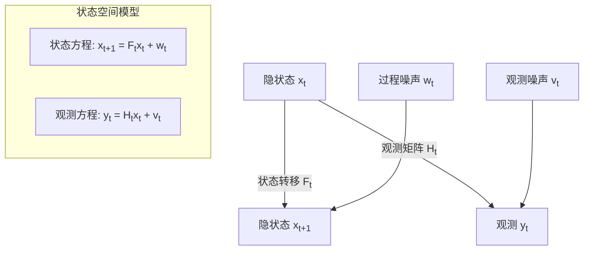

# 第1章：数学基础与金融预备知识

::: tip 学习目标
- 掌握线性代数基础（向量、矩阵运算、特征值分解）
- 理解概率论与统计学基础（随机变量、概率分布、贝叶斯定理）
- 熟悉状态空间模型的基本概念
- 了解金融时间序列的基本特征和统计性质
:::

## 知识点总结

### 1. 线性代数基础

#### 向量和矩阵运算
- **向量内积**：$\mathbf{a} \cdot \mathbf{b} = \sum_{i=1}^{n} a_i b_i$
- **矩阵乘法**：$(AB)_{ij} = \sum_{k=1}^{n} A_{ik}B_{kj}$
- **矩阵转置**：$(A^T)_{ij} = A_{ji}$
- **矩阵逆**：$AA^{-1} = I$（仅对可逆矩阵）

#### 特征值分解
- **特征值方程**：$A\mathbf{v} = \lambda\mathbf{v}$
- **特征分解**：$A = Q\Lambda Q^{-1}$
- **对角化的条件**：矩阵必须有n个线性无关的特征向量

### 2. 概率论与统计学基础

#### 随机变量和概率分布
- **期望值**：$E[X] = \int_{-\infty}^{\infty} x f(x) dx$
- **方差**：$Var(X) = E[(X - E[X])^2] = E[X^2] - (E[X])^2$
- **协方差**：$Cov(X,Y) = E[(X-E[X])(Y-E[Y])]$

#### 贝叶斯定理
- **贝叶斯公式**：$P(A|B) = \frac{P(B|A)P(A)}{P(B)}$
- **条件概率的链式法则**：$P(A,B) = P(A|B)P(B)$

### 3. 状态空间模型基础

#### 基本结构
状态空间模型由两个核心方程组成：

- **状态方程**：$\mathbf{x}_{t+1} = F_t \mathbf{x}_t + G_t \mathbf{u}_t + \mathbf{w}_t$
- **观测方程**：$\mathbf{y}_t = H_t \mathbf{x}_t + \mathbf{v}_t$

其中：
- $\mathbf{x}_t$：状态向量
- $\mathbf{y}_t$：观测向量
- $F_t$：状态转移矩阵
- $H_t$：观测矩阵
- $\mathbf{w}_t$、$\mathbf{v}_t$：过程噪声和观测噪声

### 4. 金融时间序列特征

#### 收益率的统计性质
- **对数收益率**：$r_t = \ln(P_t) - \ln(P_{t-1})$
- **波动率聚集性**：高波动期后往往跟随高波动期
- **厚尾分布**：金融收益率分布比正态分布有更厚的尾部
- **自相关性**：价格变化通常表现出微弱的自相关

## 示例代码

### 矩阵运算示例

```python
import numpy as np
import matplotlib.pyplot as plt

# 矩阵基本运算示例
A = np.array([[2, 1], [1, 3]])
B = np.array([[1, 2], [0, 1]])

# 矩阵乘法
C = np.dot(A, B)
print("矩阵乘法结果 A*B:")
print(C)

# 特征值分解
eigenvalues, eigenvectors = np.linalg.eig(A)
print(f"特征值: {eigenvalues}")
print(f"特征向量:\n{eigenvectors}")

# 验证特征值分解
reconstructed = eigenvectors @ np.diag(eigenvalues) @ np.linalg.inv(eigenvectors)
print(f"重构矩阵误差: {np.max(np.abs(A - reconstructed))}")
```

### 概率分布与贝叶斯推断

```python
import scipy.stats as stats

# 正态分布示例
mu, sigma = 0, 1
x = np.linspace(-4, 4, 100)
pdf = stats.norm.pdf(x, mu, sigma)

# 贝叶斯更新示例（共轭先验）
# 先验：正态分布 N(μ₀, σ₀²)
mu_0, sigma_0 = 0, 2
# 观测数据
observations = np.array([1.2, 0.8, 1.5, 0.9])
n = len(observations)
sample_mean = np.mean(observations)

# 后验参数（已知方差情况）
sigma_obs = 1  # 假设观测噪声方差已知
precision_prior = 1 / sigma_0**2
precision_obs = n / sigma_obs**2

# 后验均值和方差
mu_posterior = (precision_prior * mu_0 + precision_obs * sample_mean) / (precision_prior + precision_obs)
sigma_posterior = 1 / np.sqrt(precision_prior + precision_obs)

print(f"先验均值: {mu_0}, 后验均值: {mu_posterior:.3f}")
print(f"先验标准差: {sigma_0}, 后验标准差: {sigma_posterior:.3f}")
```

### 金融时间序列分析

```python
# 模拟股价数据并计算统计特征
np.random.seed(42)
T = 252  # 一年的交易日
dt = 1/252
mu = 0.1  # 年化期望收益率
sigma = 0.2  # 年化波动率

# 几何布朗运动模拟股价
returns = np.random.normal(mu*dt, sigma*np.sqrt(dt), T)
log_prices = np.cumsum(returns)
prices = 100 * np.exp(log_prices)  # 起始价格100

# 计算收益率统计特征
daily_returns = np.diff(log_prices)
print(f"平均日收益率: {np.mean(daily_returns):.6f}")
print(f"日收益率标准差: {np.std(daily_returns):.6f}")
print(f"年化波动率: {np.std(daily_returns) * np.sqrt(252):.3f}")

# 检验正态性（Jarque-Bera检验）
from scipy.stats import jarque_bera
jb_stat, jb_pvalue = jarque_bera(daily_returns)
print(f"Jarque-Bera统计量: {jb_stat:.3f}, p值: {jb_pvalue:.3f}")

# 绘制价格和收益率分布
fig, (ax1, ax2) = plt.subplots(1, 2, figsize=(12, 4))

ax1.plot(prices)
ax1.set_title('模拟股价走势')
ax1.set_xlabel('交易日')
ax1.set_ylabel('价格')

ax2.hist(daily_returns, bins=30, alpha=0.7, density=True)
x_norm = np.linspace(daily_returns.min(), daily_returns.max(), 100)
ax2.plot(x_norm, stats.norm.pdf(x_norm, np.mean(daily_returns), np.std(daily_returns)), 'r-', label='正态分布拟合')
ax2.set_title('日收益率分布')
ax2.set_xlabel('收益率')
ax2.set_ylabel('密度')
ax2.legend()

plt.tight_layout()
plt.show()
```

## 状态空间模型框架图



## 重要概念对比

| 概念 | 线性代数 | 概率统计 | 金融应用 |
|------|----------|----------|----------|
| **向量** | 数值集合 | 随机变量向量 | 资产价格向量 |
| **矩阵** | 线性变换 | 协方差矩阵 | 风险因子载荷 |
| **特征值** | 主要方向 | 主成分 | 风险因子权重 |
| **期望值** | - | 概率加权平均 | 期望收益率 |
| **方差** | - | 不确定性度量 | 风险度量 |

::: note 重要提醒
卡尔曼滤波的核心是在不确定性环境中进行最优估计，因此扎实的概率统计基础至关重要。在金融应用中，我们经常处理非平稳、非线性的数据，这些数学工具为后续的高级技术奠定基础。
:::

::: warning 注意事项
- 矩阵运算时要注意维度匹配
- 金融数据往往不满足正态分布假设
- 在实际应用中要考虑数值稳定性问题
- 协方差矩阵必须是正定的（或半正定的）
:::

## 本章小结

本章建立了学习卡尔曼滤波所需的数学基础，包括：

1. **线性代数工具**：为矩阵运算和状态空间表示做准备
2. **概率统计理论**：为不确定性建模和贝叶斯推断奠定基础
3. **状态空间概念**：引入动态系统的数学描述框架
4. **金融数据特征**：理解实际应用中数据的特殊性质

这些基础知识将在后续章节中得到充分应用，特别是在构建金融市场的动态模型时。