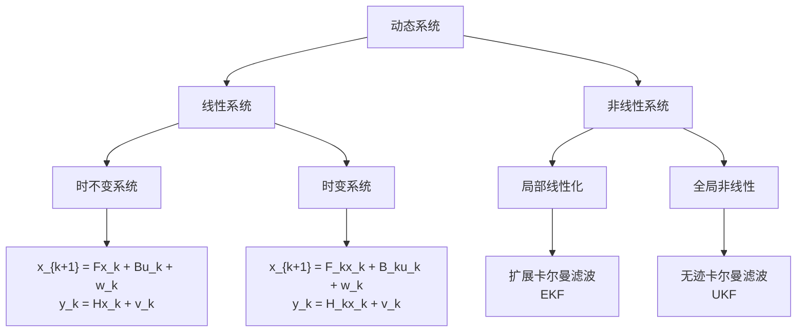

# 第2章：动态系统与状态估计入门

::: tip 学习目标
- 理解动态系统的基本概念和数学描述
- 掌握状态变量、观测变量的定义
- 了解噪声模型和不确定性描述方法
:::

## 知识点总结

### 1. 动态系统基本概念

#### 系统的数学描述
动态系统是指状态随时间变化的系统，其数学表示为：

$$\mathbf{x}_{k+1} = f(\mathbf{x}_k, \mathbf{u}_k, \mathbf{w}_k)$$
$$\mathbf{y}_k = h(\mathbf{x}_k, \mathbf{v}_k)$$

其中：
- $\mathbf{x}_k \in \mathbb{R}^n$：状态向量
- $\mathbf{u}_k \in \mathbb{R}^m$：控制输入
- $\mathbf{y}_k \in \mathbb{R}^p$：观测向量
- $\mathbf{w}_k$：过程噪声
- $\mathbf{v}_k$：观测噪声

#### 线性动态系统
当系统函数为线性时，可以表示为：

$$\mathbf{x}_{k+1} = F_k \mathbf{x}_k + B_k \mathbf{u}_k + \mathbf{w}_k$$
$$\mathbf{y}_k = H_k \mathbf{x}_k + \mathbf{v}_k$$

### 2. 状态变量与观测变量

#### 状态变量的选择原则
- **最小性**：状态向量应包含描述系统动态的最少信息
- **可观测性**：状态应能通过观测量推断
- **物理意义**：状态变量应有明确的物理或经济意义

#### 观测变量特点
- **部分可观测**：通常只能观测到系统的部分状态
- **噪声污染**：观测数据包含测量误差
- **采样频率**：观测频率可能低于系统动态变化频率

### 3. 噪声模型和不确定性

#### 过程噪声
表示系统模型的不确定性：
- **模型误差**：简化假设带来的误差
- **未建模动态**：未考虑的系统动态
- **外部扰动**：环境变化等外部因素

#### 观测噪声
表示测量过程的不确定性：
- **传感器误差**：设备精度限制
- **量化误差**：数字化过程中的舍入误差
- **环境干扰**：测量环境的影响

#### 噪声的统计特性
通常假设噪声具有以下性质：
- **零均值**：$E[\mathbf{w}_k] = 0, E[\mathbf{v}_k] = 0$
- **独立性**：不同时刻的噪声相互独立
- **正态分布**：$\mathbf{w}_k \sim \mathcal{N}(0, Q_k), \mathbf{v}_k \sim \mathcal{N}(0, R_k)$

## 示例代码

### 简单线性动态系统模拟

```python
import numpy as np
import matplotlib.pyplot as plt

# 定义一个简单的线性动态系统
# 状态: [位置, 速度]^T
# 观测: 位置

def simulate_linear_system(T=100):
    """
    模拟一维运动系统
    状态方程: x_{k+1} = F * x_k + w_k
    观测方程: y_k = H * x_k + v_k
    """
    dt = 0.1  # 时间步长

    # 状态转移矩阵 (位置-速度模型)
    F = np.array([[1, dt],
                  [0, 1]])

    # 观测矩阵 (只观测位置)
    H = np.array([[1, 0]])

    # 噪声协方差矩阵
    Q = np.array([[0.01, 0],      # 过程噪声协方差
                  [0, 0.01]])
    R = np.array([[0.1]])         # 观测噪声协方差

    # 初始状态
    x_true = np.array([[0],       # 初始位置
                       [1]])      # 初始速度

    # 存储真实状态和观测
    states_true = np.zeros((2, T))
    observations = np.zeros((1, T))

    for k in range(T):
        # 状态更新
        w_k = np.random.multivariate_normal([0, 0], Q).reshape(2, 1)
        x_true = F @ x_true + w_k
        states_true[:, k] = x_true.flatten()

        # 生成观测
        v_k = np.random.multivariate_normal([0], R).reshape(1, 1)
        y_k = H @ x_true + v_k
        observations[:, k] = y_k.flatten()

    return states_true, observations, F, H, Q, R

# 运行模拟
states_true, observations, F, H, Q, R = simulate_linear_system()

# 绘制结果
fig, (ax1, ax2) = plt.subplots(2, 1, figsize=(12, 8))

# 位置对比
ax1.plot(states_true[0, :], 'b-', label='真实位置', linewidth=2)
ax1.plot(observations[0, :], 'r.', label='观测位置', alpha=0.6, markersize=4)
ax1.set_ylabel('位置')
ax1.set_title('状态vs观测：位置')
ax1.legend()
ax1.grid(True)

# 速度（不可观测）
ax2.plot(states_true[1, :], 'g-', label='真实速度', linewidth=2)
ax2.set_ylabel('速度')
ax2.set_xlabel('时间步')
ax2.set_title('隐状态：速度（不可直接观测）')
ax2.legend()
ax2.grid(True)

plt.tight_layout()
plt.show()

print("系统矩阵:")
print(f"状态转移矩阵 F:\n{F}")
print(f"观测矩阵 H:\n{H}")
print(f"过程噪声协方差 Q:\n{Q}")
print(f"观测噪声协方差 R:\n{R}")
```

### 金融应用：股价动态建模

```python
# 股价动态系统建模示例
def stock_price_model(T=252):
    """
    股价的状态空间模型
    状态: [log_price, drift]^T
    观测: log_price (带噪声)
    """

    # 状态转移矩阵
    # log_price_{t+1} = log_price_t + drift_t + w1_t
    # drift_{t+1} = drift_t + w2_t
    F = np.array([[1, 1],
                  [0, 1]])

    # 观测矩阵 (观测对数价格)
    H = np.array([[1, 0]])

    # 过程噪声协方差 (价格变动和漂移变化的不确定性)
    sigma_price = 0.02    # 日价格波动
    sigma_drift = 0.001   # 漂移变化
    Q = np.array([[sigma_price**2, 0],
                  [0, sigma_drift**2]])

    # 观测噪声协方差 (测量误差)
    R = np.array([[0.0001]])

    # 初始状态
    x_true = np.array([[4.6],      # log(100) ≈ 4.6
                       [0.0004]])  # 日漂移 ≈ 0.1年化收益率

    # 模拟
    states_true = np.zeros((2, T))
    observations = np.zeros((1, T))

    for k in range(T):
        # 状态更新
        w_k = np.random.multivariate_normal([0, 0], Q).reshape(2, 1)
        x_true = F @ x_true + w_k
        states_true[:, k] = x_true.flatten()

        # 生成观测
        v_k = np.random.multivariate_normal([0], R).reshape(1, 1)
        y_k = H @ x_true + v_k
        observations[:, k] = y_k.flatten()

    # 转换为价格
    true_prices = np.exp(states_true[0, :])
    observed_prices = np.exp(observations[0, :])

    return true_prices, observed_prices, states_true, F, H, Q, R

# 运行股价模拟
np.random.seed(42)
true_prices, observed_prices, states, F, H, Q, R = stock_price_model()

# 绘制股价动态
fig, (ax1, ax2, ax3) = plt.subplots(3, 1, figsize=(12, 10))

# 价格走势
ax1.plot(true_prices, 'b-', label='真实价格', linewidth=2)
ax1.plot(observed_prices, 'r-', label='观测价格', alpha=0.7)
ax1.set_ylabel('价格')
ax1.set_title('股价动态系统模拟')
ax1.legend()
ax1.grid(True)

# 对数价格
ax2.plot(states[0, :], 'b-', label='真实对数价格', linewidth=2)
ax2.plot(np.log(observed_prices), 'r-', label='观测对数价格', alpha=0.7)
ax2.set_ylabel('对数价格')
ax2.set_title('对数价格动态')
ax2.legend()
ax2.grid(True)

# 漂移项（隐状态）
ax3.plot(states[1, :], 'g-', label='价格漂移', linewidth=2)
ax3.set_ylabel('漂移')
ax3.set_xlabel('时间（交易日）')
ax3.set_title('价格漂移（隐状态）')
ax3.legend()
ax3.grid(True)

plt.tight_layout()
plt.show()

# 计算统计特征
price_returns = np.diff(np.log(true_prices))
print(f"年化收益率: {np.mean(price_returns) * 252:.3f}")
print(f"年化波动率: {np.std(price_returns) * np.sqrt(252):.3f}")
```

### 系统可观测性分析

```python
def check_observability(F, H):
    """
    检查线性系统的可观测性
    可观测性矩阵: O = [H; HF; HF²; ...; HF^(n-1)]
    """
    n = F.shape[0]  # 状态维数

    # 构建可观测性矩阵
    O = H.copy()
    HF_power = H.copy()

    for i in range(1, n):
        HF_power = HF_power @ F
        O = np.vstack([O, HF_power])

    # 计算秩
    rank_O = np.linalg.matrix_rank(O)
    is_observable = (rank_O == n)

    return O, rank_O, is_observable

# 测试位置-速度系统的可观测性
O, rank_O, is_observable = check_observability(F, H)

print("可观测性分析:")
print(f"状态维数: {F.shape[0]}")
print(f"可观测性矩阵秩: {rank_O}")
print(f"系统可观测: {is_observable}")
print(f"可观测性矩阵:\n{O}")

# 如果只观测位置，系统是否可观测？
if is_observable:
    print("✓ 通过位置观测可以推断速度")
else:
    print("✗ 仅通过位置观测无法完全确定系统状态")
```

## 动态系统分类



## 噪声模型对比

| 噪声类型 | 数学表示 | 物理意义 | 金融应用 |
|----------|----------|----------|----------|
| **过程噪声** | $\mathbf{w}_k \sim \mathcal{N}(0, Q_k)$ | 模型不确定性 | 市场微观结构噪声 |
| **观测噪声** | $\mathbf{v}_k \sim \mathcal{N}(0, R_k)$ | 测量误差 | 报价误差、数据延迟 |
| **有色噪声** | $w_k = \rho w_{k-1} + \epsilon_k$ | 相关噪声 | 波动率聚集 |
| **重尾噪声** | $w_k \sim t_\nu(0, \Sigma)$ | 极端事件 | 金融危机、黑天鹅 |

## 状态估计问题的挑战

::: note 估计问题的本质
状态估计的核心挑战是从噪声观测中推断隐状态：
- **信息不完全**：只能观测到部分状态
- **噪声干扰**：观测数据包含随机误差
- **动态性**：状态随时间不断变化
- **实时性**：需要在线更新估计
:::

### 最优估计准则

1. **最小均方误差 (MMSE)**：
   $$\hat{\mathbf{x}}_k = \arg\min E[||\mathbf{x}_k - \hat{\mathbf{x}}_k||^2]$$

2. **最大后验概率 (MAP)**：
   $$\hat{\mathbf{x}}_k = \arg\max p(\mathbf{x}_k | \mathbf{y}_{1:k})$$

3. **最大似然估计 (MLE)**：
   $$\hat{\mathbf{x}}_k = \arg\max p(\mathbf{y}_{1:k} | \mathbf{x}_k)$$

::: warning 实际应用中的注意事项
- **模型假设**：线性假设在实际中往往是近似的
- **噪声特性**：金融数据的噪声通常不满足正态分布
- **参数时变性**：系统参数可能随时间变化
- **计算复杂度**：高维系统的计算负担
:::

## 本章小结

本章介绍了动态系统与状态估计的基础概念：

1. **动态系统建模**：学会用状态空间方程描述系统
2. **状态与观测**：理解可观测性和信息不完全性
3. **噪声建模**：掌握不确定性的数学描述方法
4. **估计挑战**：认识实际应用中的复杂性

这些概念为理解卡尔曼滤波算法奠定了基础，特别是在金融应用中，我们经常面临复杂的动态系统和多源噪声的挑战。