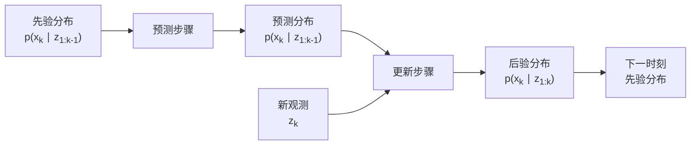

# 第3章：卡尔曼滤波基本原理

::: tip 学习目标
- 理解卡尔曼滤波的核心思想和工作原理
- 掌握预测步骤和更新步骤的数学推导
- 理解最优性证明和贝叶斯框架
:::

## 核心思想

卡尔曼滤波是一种递归的状态估计算法，其核心思想是通过**预测-更新**循环，利用系统的动态模型和观测数据来获得系统状态的最优估计。

### 基本哲学

卡尔曼滤波基于以下几个核心概念：

1. **状态空间表示**：系统可以用状态向量完全描述
2. **线性高斯假设**：系统动态和观测都是线性的，噪声服从高斯分布
3. **贝叶斯更新**：利用先验信息和观测数据进行最优估计
4. **递归处理**：每一步都基于前一步的结果，适合实时处理

## 数学框架

### 状态空间模型

卡尔曼滤波基于以下状态空间模型：

**状态转移方程**：
$$x_k = F_k x_{k-1} + B_k u_k + w_k$$

**观测方程**：
$$z_k = H_k x_k + v_k$$

其中：
- $x_k \in \mathbb{R}^n$：k时刻的状态向量
- $z_k \in \mathbb{R}^m$：k时刻的观测向量
- $F_k \in \mathbb{R}^{n \times n}$：状态转移矩阵
- $H_k \in \mathbb{R}^{m \times n}$：观测矩阵
- $B_k \in \mathbb{R}^{n \times l}$：控制输入矩阵
- $u_k \in \mathbb{R}^l$：控制输入向量
- $w_k \sim \mathcal{N}(0, Q_k)$：过程噪声
- $v_k \sim \mathcal{N}(0, R_k)$：观测噪声

### 概率表示



## 算法推导

### 预测步骤（Prediction）

基于前一时刻的后验估计，预测当前时刻的状态：

**状态预测**：
$$\hat{x}_{k|k-1} = F_k \hat{x}_{k-1|k-1} + B_k u_k$$

**协方差预测**：
$$P_{k|k-1} = F_k P_{k-1|k-1} F_k^T + Q_k$$

### 更新步骤（Update）

利用观测数据修正预测：

**卡尔曼增益**：
$$K_k = P_{k|k-1} H_k^T (H_k P_{k|k-1} H_k^T + R_k)^{-1}$$

**状态更新**：
$$\hat{x}_{k|k} = \hat{x}_{k|k-1} + K_k (z_k - H_k \hat{x}_{k|k-1})$$

**协方差更新**：
$$P_{k|k} = (I - K_k H_k) P_{k|k-1}$$

### 创新序列

**创新**（Innovation）是观测值与预测值的差：
$$\nu_k = z_k - H_k \hat{x}_{k|k-1}$$

**创新协方差**：
$$S_k = H_k P_{k|k-1} H_k^T + R_k$$

## 贝叶斯框架下的推导

### 贝叶斯定理应用

卡尔曼滤波本质上是贝叶斯估计的特例。对于线性高斯系统：

$$p(x_k|z_{1:k}) \propto p(z_k|x_k) p(x_k|z_{1:k-1})$$

其中：
- $p(z_k|x_k)$：似然函数
- $p(x_k|z_{1:k-1})$：先验分布
- $p(x_k|z_{1:k})$：后验分布

### 高斯分布的封闭性

由于线性变换和高斯分布的性质：

1. **预测分布**：$p(x_k|z_{1:k-1}) = \mathcal{N}(\hat{x}_{k|k-1}, P_{k|k-1})$
2. **似然函数**：$p(z_k|x_k) = \mathcal{N}(H_k x_k, R_k)$
3. **后验分布**：$p(x_k|z_{1:k}) = \mathcal{N}(\hat{x}_{k|k}, P_{k|k})$

## 算法流程

```python
def kalman_filter_step(x_prev, P_prev, F, B, u, Q, H, R, z):
    """
    卡尔曼滤波单步更新

    参数:
    x_prev: 前一时刻的状态估计
    P_prev: 前一时刻的协方差矩阵
    F: 状态转移矩阵
    B: 控制输入矩阵
    u: 控制输入
    Q: 过程噪声协方差
    H: 观测矩阵
    R: 观测噪声协方差
    z: 当前观测
    """

    # 预测步骤
    x_pred = F @ x_prev + B @ u  # 状态预测
    P_pred = F @ P_prev @ F.T + Q  # 协方差预测

    # 更新步骤
    y = z - H @ x_pred  # 创新（残差）
    S = H @ P_pred @ H.T + R  # 创新协方差
    K = P_pred @ H.T @ np.linalg.inv(S)  # 卡尔曼增益

    x_updated = x_pred + K @ y  # 状态更新
    P_updated = (np.eye(len(x_pred)) - K @ H) @ P_pred  # 协方差更新

    return x_updated, P_updated, K, y, S
```

## 最优性证明

### 最小均方误差准则

卡尔曼滤波在以下意义下是最优的：

$$\hat{x}_{k|k} = \arg\min_{\hat{x}} E[(x_k - \hat{x})^T (x_k - \hat{x}) | z_{1:k}]$$

::: note 最优性条件
在线性高斯假设下，卡尔曼滤波给出：
1. **最小方差估计器**：在所有无偏估计器中方差最小
2. **最大似然估计器**：在高斯分布假设下
3. **最小均方误差估计器**：在所有估计器中均方误差最小
:::

### 正交投影解释

从几何角度看，卡尔曼滤波是将状态向量投影到观测空间的正交投影：

```python
# 正交投影的几何解释
def geometric_interpretation():
    """
    卡尔曼滤波的几何解释：
    状态估计 = 先验估计 + 卡尔曼增益 × 创新

    这等价于在希尔伯特空间中的正交投影
    """
    # 创新是观测空间中不能被先验解释的部分
    innovation = z - H @ x_pred

    # 卡尔曼增益决定了如何将创新投影回状态空间
    kalman_gain = P_pred @ H.T @ inv(H @ P_pred @ H.T + R)

    # 最终估计是先验加上投影的创新
    x_posterior = x_pred + kalman_gain @ innovation

    return x_posterior
```

## 信息论视角

### 信息融合

卡尔曼滤波可以理解为信息融合过程：

1. **先验信息**：来自系统模型的预测
2. **观测信息**：来自传感器的测量
3. **融合权重**：由各自的不确定性决定

### 熵的减少

每次观测都会减少系统状态的不确定性：

$$H(x_k|z_{1:k}) \leq H(x_k|z_{1:k-1})$$

其中$H(\cdot)$表示微分熵。

## 协方差矩阵的性质

### 对称正定性

协方差矩阵$P_k$具有以下重要性质：

1. **对称性**：$P_k = P_k^T$
2. **正半定性**：$P_k \succeq 0$
3. **单调性**：$P_{k|k} \preceq P_{k|k-1}$（观测总是减少不确定性）

### 数值稳定性

为保证数值稳定性，常用以下形式：

```python
def joseph_form_update(P_pred, H, K, R):
    """
    Joseph形式的协方差更新，保证数值稳定性
    """
    I_KH = np.eye(len(P_pred)) - K @ H
    P_updated = I_KH @ P_pred @ I_KH.T + K @ R @ K.T
    return P_updated
```

## 实际应用考虑

### 初始化

::: warning 初始化重要性
卡尔曼滤波的性能很大程度上取决于初始状态估计$\hat{x}_{0|0}$和初始协方差$P_{0|0}$的选择。
:::

通常的初始化策略：

1. **状态初始化**：基于先验知识或前几个观测
2. **协方差初始化**：反映初始不确定性，通常选择较大的值

### 滤波发散

当模型不匹配或参数选择不当时，可能出现滤波发散：

- **症状**：协方差矩阵增长，估计误差增大
- **原因**：$Q$矩阵过小，$R$矩阵过大，模型误差
- **解决**：参数调优，鲁棒化改进

## 金融应用预览

在金融领域，卡尔曼滤波的典型应用包括：

1. **状态变量**：隐含波动率、风险因子、市场趋势
2. **观测变量**：股票价格、利率、期权价格
3. **应用场景**：参数估计、风险管理、投资组合优化

::: tip 下一章预告
下一章我们将详细学习线性卡尔曼滤波的具体实现，包括五个核心方程的编程实现和数值技巧。
:::