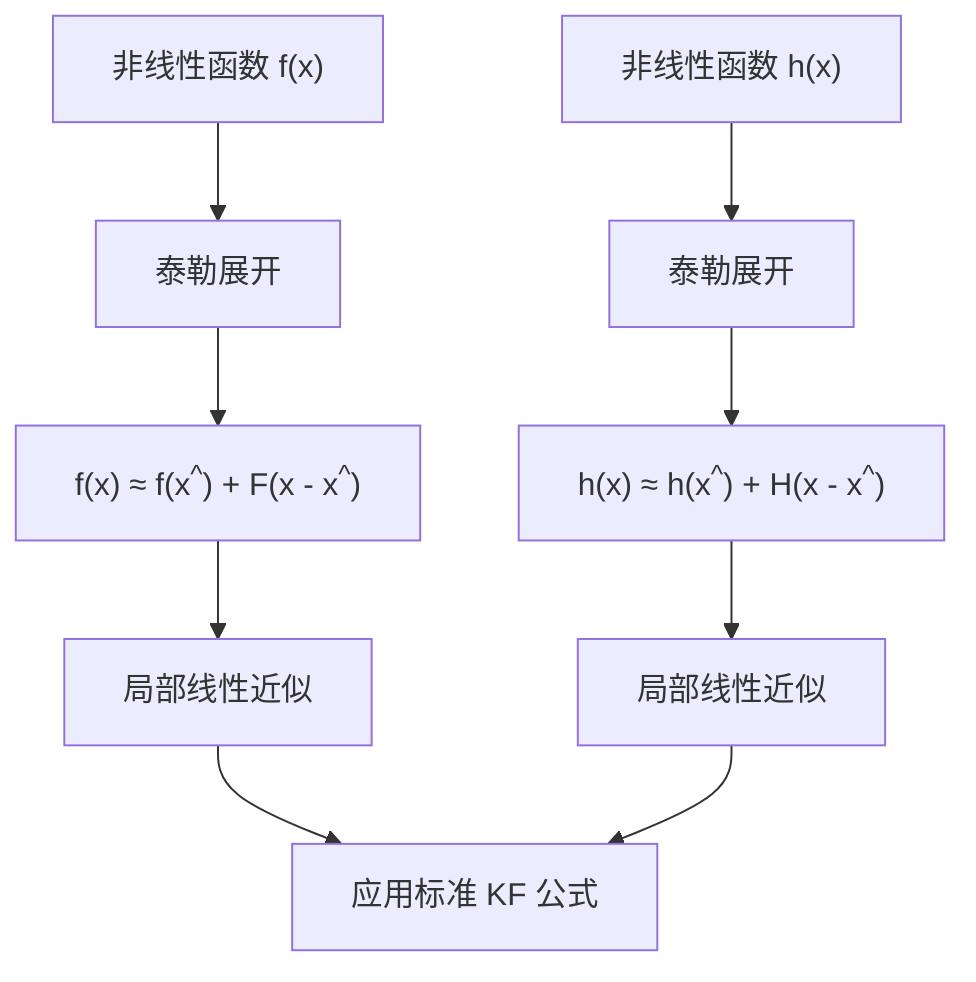

# 第5章：扩展卡尔曼滤波（EKF）

::: tip 学习目标
- 理解非线性系统的挑战和解决思路
- 掌握雅可比矩阵的计算和线性化方法
- 学会EKF的算法实现和应用场景
:::

## 非线性系统的挑战

标准卡尔曼滤波适用于线性高斯系统，但现实中许多系统都是非线性的。扩展卡尔曼滤波（EKF）通过局部线性化来处理非线性系统。

### 非线性状态空间模型

**非线性状态转移**：
$$x_k = f(x_{k-1}, u_k) + w_k$$

**非线性观测方程**：
$$z_k = h(x_k) + v_k$$

其中：
- $f(\cdot)$：非线性状态转移函数
- $h(\cdot)$：非线性观测函数
- $w_k \sim \mathcal{N}(0, Q_k)$：过程噪声
- $v_k \sim \mathcal{N}(0, R_k)$：观测噪声

## 线性化原理

EKF的核心思想是在当前估计点附近进行泰勒展开，保留一阶项进行线性化。

### 雅可比矩阵

**状态转移雅可比矩阵**：
$$F_k = \frac{\partial f}{\partial x}\bigg|_{x=\hat{x}_{k-1|k-1}, u=u_k}$$

**观测雅可比矩阵**：
$$H_k = \frac{\partial h}{\partial x}\bigg|_{x=\hat{x}_{k|k-1}}$$

### 线性化过程


## EKF算法步骤

### 预测步骤

**状态预测**：
$$\hat{x}_{k|k-1} = f(\hat{x}_{k-1|k-1}, u_k)$$

**协方差预测**：
$$P_{k|k-1} = F_k P_{k-1|k-1} F_k^T + Q_k$$

其中$F_k$是在$\hat{x}_{k-1|k-1}$处计算的雅可比矩阵。

### 更新步骤

**卡尔曼增益**：
$$K_k = P_{k|k-1} H_k^T (H_k P_{k|k-1} H_k^T + R_k)^{-1}$$

**状态更新**：
$$\hat{x}_{k|k} = \hat{x}_{k|k-1} + K_k (z_k - h(\hat{x}_{k|k-1}))$$

**协方差更新**：
$$P_{k|k} = (I - K_k H_k) P_{k|k-1}$$

其中$H_k$是在$\hat{x}_{k|k-1}$处计算的雅可比矩阵。

## EKF实现

```python
import numpy as np
from scipy.optimize import minimize
import sympy as sp
from typing import Callable, Optional

class ExtendedKalmanFilter:
    """
    扩展卡尔曼滤波器实现
    """

    def __init__(self, dim_x: int, dim_z: int,
                 f: Callable, h: Callable,
                 f_jacobian: Callable, h_jacobian: Callable):
        """
        初始化扩展卡尔曼滤波器

        参数:
        dim_x: 状态维度
        dim_z: 观测维度
        f: 状态转移函数
        h: 观测函数
        f_jacobian: 状态转移雅可比函数
        h_jacobian: 观测雅可比函数
        """
        self.dim_x = dim_x
        self.dim_z = dim_z

        # 非线性函数
        self.f = f  # 状态转移函数
        self.h = h  # 观测函数
        self.f_jacobian = f_jacobian  # F的雅可比
        self.h_jacobian = h_jacobian  # H的雅可比

        # 状态和协方差
        self.x = np.zeros((dim_x, 1))
        self.P = np.eye(dim_x)

        # 噪声协方差
        self.Q = np.eye(dim_x)
        self.R = np.eye(dim_z)

        # 用于存储中间结果
        self.x_prior = None
        self.P_prior = None
        self.F = None
        self.H = None
        self.K = None
        self.y = None
        self.S = None

    def predict(self, u: Optional[np.ndarray] = None):
        """
        预测步骤
        """
        # 计算雅可比矩阵
        self.F = self.f_jacobian(self.x, u)

        # 非线性状态预测
        self.x = self.f(self.x, u)

        # 协方差预测
        self.P = self.F @ self.P @ self.F.T + self.Q

        # 保存先验估计
        self.x_prior = self.x.copy()
        self.P_prior = self.P.copy()

    def update(self, z: np.ndarray):
        """
        更新步骤
        """
        # 确保z是列向量
        if z.ndim == 1:
            z = z.reshape((-1, 1))

        # 计算观测雅可比矩阵
        self.H = self.h_jacobian(self.x)

        # 计算残差
        self.y = z - self.h(self.x)

        # 计算创新协方差
        self.S = self.H @ self.P @ self.H.T + self.R

        # 计算卡尔曼增益
        self.K = self.P @ self.H.T @ np.linalg.inv(self.S)

        # 状态更新
        self.x = self.x + self.K @ self.y

        # 协方差更新（Joseph形式）
        I_KH = np.eye(self.dim_x) - self.K @ self.H
        self.P = I_KH @ self.P @ I_KH.T + self.K @ self.R @ self.K.T
```

## 自动雅可比计算

### 符号微分方法

```python
def symbolic_jacobian(func_expr, vars_expr):
    """
    使用符号计算自动生成雅可比矩阵

    参数:
    func_expr: 函数的符号表达式列表
    vars_expr: 变量的符号表达式列表
    """
    jacobian_matrix = []
    for f in func_expr:
        row = []
        for var in vars_expr:
            row.append(sp.diff(f, var))
        jacobian_matrix.append(row)

    return sp.Matrix(jacobian_matrix)

# 示例：定义符号变量和函数
def define_nonlinear_system():
    """
    定义非线性系统的符号表达式
    """
    # 状态变量 [x, y, vx, vy]
    x, y, vx, vy = sp.symbols('x y vx vy')
    dt = sp.Symbol('dt')

    # 非线性状态转移（匀速运动）
    f_expr = [
        x + vx * dt,
        y + vy * dt,
        vx,
        vy
    ]

    # 非线性观测（距离和角度）
    h_expr = [
        sp.sqrt(x**2 + y**2),    # 距离
        sp.atan2(y, x)           # 角度
    ]

    # 计算雅可比矩阵
    states = [x, y, vx, vy]
    F_symbolic = symbolic_jacobian(f_expr, states)
    H_symbolic = symbolic_jacobian(h_expr, states)

    print("状态转移雅可比矩阵F:")
    print(F_symbolic)
    print("\n观测雅可比矩阵H:")
    print(H_symbolic)

    return F_symbolic, H_symbolic

# 生成数值函数
def create_numerical_functions():
    """
    将符号雅可比转换为数值函数
    """
    F_sym, H_sym = define_nonlinear_system()

    # 转换为numpy函数
    F_func = sp.lambdify([sp.symbols('x y vx vy dt')], F_sym, 'numpy')
    H_func = sp.lambdify([sp.symbols('x y vx vy')], H_sym, 'numpy')

    return F_func, H_func
```

### 数值微分方法

```python
def numerical_jacobian(func, x, epsilon=1e-7):
    """
    数值计算雅可比矩阵
    """
    x = np.atleast_1d(x).astype(float)
    n = len(x)
    f0 = func(x)
    m = len(f0) if hasattr(f0, '__len__') else 1

    jacobian = np.zeros((m, n))

    for j in range(n):
        x_plus = x.copy()
        x_minus = x.copy()
        x_plus[j] += epsilon
        x_minus[j] -= epsilon

        f_plus = func(x_plus)
        f_minus = func(x_minus)

        jacobian[:, j] = (f_plus - f_minus) / (2 * epsilon)

    return jacobian

class AutoDiffEKF(ExtendedKalmanFilter):
    """
    自动微分的EKF实现
    """

    def __init__(self, dim_x, dim_z, f, h):
        # 使用数值微分自动计算雅可比
        def f_jac(x, u):
            return numerical_jacobian(lambda x: f(x, u), x.flatten()).reshape((dim_x, dim_x))

        def h_jac(x):
            return numerical_jacobian(lambda x: h(x), x.flatten()).reshape((dim_z, dim_x))

        super().__init__(dim_x, dim_z, f, h, f_jac, h_jac)
```

## 具体应用示例

### 示例1：极坐标观测的目标跟踪

```python
def polar_tracking_example():
    """
    极坐标观测的目标跟踪示例
    """

    # 状态：[x, y, vx, vy] - 位置和速度
    # 观测：[r, θ] - 距离和角度

    def f(x, u, dt=1.0):
        """状态转移函数（匀速运动）"""
        F = np.array([
            [1, 0, dt, 0],
            [0, 1, 0, dt],
            [0, 0, 1, 0],
            [0, 0, 0, 1]
        ])
        return F @ x

    def h(x):
        """观测函数（极坐标）"""
        px, py = x[0, 0], x[1, 0]
        r = np.sqrt(px**2 + py**2)
        theta = np.arctan2(py, px)
        return np.array([[r], [theta]])

    def f_jacobian(x, u, dt=1.0):
        """状态转移雅可比"""
        return np.array([
            [1, 0, dt, 0],
            [0, 1, 0, dt],
            [0, 0, 1, 0],
            [0, 0, 0, 1]
        ])

    def h_jacobian(x):
        """观测雅可比"""
        px, py = x[0, 0], x[1, 0]
        r_sq = px**2 + py**2
        r = np.sqrt(r_sq)

        if r < 1e-6:  # 避免除零
            r = 1e-6
            r_sq = r**2

        H = np.array([
            [px/r, py/r, 0, 0],
            [-py/r_sq, px/r_sq, 0, 0]
        ])
        return H

    # 创建EKF
    ekf = ExtendedKalmanFilter(4, 2, f, h, f_jacobian, h_jacobian)

    # 初始化
    ekf.x = np.array([[0], [0], [1], [1]])  # 初始状态
    ekf.P = 10 * np.eye(4)  # 初始协方差

    ekf.Q = np.array([  # 过程噪声
        [0.1, 0, 0, 0],
        [0, 0.1, 0, 0],
        [0, 0, 0.1, 0],
        [0, 0, 0, 0.1]
    ])

    ekf.R = np.array([  # 观测噪声
        [0.5, 0],
        [0, 0.1]
    ])

    # 模拟跟踪
    true_states = []
    observations = []
    estimates = []

    true_state = np.array([0, 0, 1, 1])  # [x, y, vx, vy]

    for k in range(50):
        # 真实状态演化
        true_state = f(true_state.reshape(-1, 1), None).flatten()
        true_states.append(true_state.copy())

        # 生成观测
        true_obs = h(true_state.reshape(-1, 1))
        noisy_obs = true_obs + np.array([[np.random.normal(0, 0.5)],
                                       [np.random.normal(0, 0.1)]])
        observations.append(noisy_obs.flatten())

        # EKF步骤
        ekf.predict()
        ekf.update(noisy_obs)

        estimates.append(ekf.x.flatten())

    # 绘制结果
    import matplotlib.pyplot as plt

    true_states = np.array(true_states)
    estimates = np.array(estimates)

    plt.figure(figsize=(12, 8))

    plt.subplot(2, 2, 1)
    plt.plot(true_states[:, 0], true_states[:, 1], 'g-',
             label='真实轨迹', linewidth=2)
    plt.plot(estimates[:, 0], estimates[:, 1], 'b--',
             label='EKF估计', linewidth=2)
    plt.legend()
    plt.title('轨迹比较')
    plt.xlabel('X位置')
    plt.ylabel('Y位置')
    plt.grid(True)

    plt.subplot(2, 2, 2)
    plt.plot(true_states[:, 0] - estimates[:, 0], 'r-', label='X误差')
    plt.plot(true_states[:, 1] - estimates[:, 1], 'b-', label='Y误差')
    plt.legend()
    plt.title('位置估计误差')
    plt.xlabel('时间步')
    plt.ylabel('误差')
    plt.grid(True)

    plt.tight_layout()
    plt.show()

    return true_states, observations, estimates

# 运行示例
# polar_tracking_example()
```

### 示例2：金融中的非线性波动率模型

```python
def stochastic_volatility_ekf():
    """
    随机波动率模型的EKF估计
    """

    # 状态：[log_price, log_volatility]
    # 观测：[price]

    def f(x, u, dt=1.0):
        """
        状态转移：
        log(S_t) = log(S_{t-1}) + μdt + σ_{t-1}dW_1
        log(σ_t²) = log(σ_{t-1}²) + κ(θ - log(σ_{t-1}²))dt + ξdW_2
        """
        log_price, log_vol = x[0, 0], x[1, 0]

        # 参数
        mu = 0.05      # 期望收益率
        kappa = 0.1    # 回归速度
        theta = -2.0   # 长期方差的对数
        xi = 0.1       # 波动率的波动率

        # 简化的欧拉离散化
        new_log_price = log_price + mu * dt
        new_log_vol = log_vol + kappa * (theta - log_vol) * dt

        return np.array([[new_log_price], [new_log_vol]])

    def h(x):
        """观测函数：价格 = exp(log_price)"""
        log_price = x[0, 0]
        return np.array([[np.exp(log_price)]])

    def f_jacobian(x, u, dt=1.0):
        """状态转移雅可比"""
        kappa = 0.1
        return np.array([
            [1, 0],
            [0, 1 - kappa * dt]
        ])

    def h_jacobian(x):
        """观测雅可比"""
        log_price = x[0, 0]
        return np.array([[np.exp(log_price), 0]])

    # 创建EKF
    ekf = ExtendedKalmanFilter(2, 1, f, h, f_jacobian, h_jacobian)

    # 初始化
    ekf.x = np.array([[4.6], [-2.0]])  # log(100), log(0.135)
    ekf.P = np.array([[0.1, 0], [0, 0.5]])

    ekf.Q = np.array([[0.01, 0], [0, 0.02]])  # 过程噪声
    ekf.R = np.array([[1.0]])  # 观测噪声

    # 模拟数据并运行滤波
    prices = []
    log_vols = []
    estimated_log_vols = []

    for k in range(100):
        # 预测和更新
        ekf.predict()

        # 模拟观测（这里使用模拟的价格数据）
        true_price = 100 * np.exp(0.001 * k + 0.1 * np.random.normal())
        noisy_price = true_price + np.random.normal(0, 1)

        ekf.update(np.array([noisy_price]))

        prices.append(noisy_price)
        log_vols.append(ekf.x[1, 0])
        estimated_log_vols.append(ekf.x[1, 0])

    # 绘制结果
    plt.figure(figsize=(12, 6))

    plt.subplot(1, 2, 1)
    plt.plot(prices, 'b-', label='观测价格')
    plt.legend()
    plt.title('价格序列')
    plt.xlabel('时间')
    plt.ylabel('价格')

    plt.subplot(1, 2, 2)
    plt.plot(np.exp(estimated_log_vols), 'r-', label='估计波动率')
    plt.legend()
    plt.title('估计的波动率')
    plt.xlabel('时间')
    plt.ylabel('波动率')

    plt.tight_layout()
    plt.show()

    return prices, estimated_log_vols

# 运行示例
# stochastic_volatility_ekf()
```

## EKF的局限性和改进

### 主要局限性

::: warning EKF的问题
1. **线性化误差**：一阶泰勒展开可能不够精确
2. **雅可比计算**：需要解析导数或数值微分
3. **发散风险**：强非线性系统容易发散
4. **局部最优**：可能陷入局部最小值
:::

### 改进方法

**1. 迭代扩展卡尔曼滤波（IEKF）**：

```python
class IteratedEKF(ExtendedKalmanFilter):
    """
    迭代扩展卡尔曼滤波
    """

    def update(self, z, max_iter=5, tolerance=1e-6):
        """迭代更新"""
        x_prev = self.x.copy()

        for i in range(max_iter):
            # 标准EKF更新
            super().update(z)

            # 检查收敛
            if np.linalg.norm(self.x - x_prev) < tolerance:
                break

            x_prev = self.x.copy()
```

**2. 自适应EKF**：

```python
def adaptive_noise_estimation(ekf, window_size=10):
    """
    自适应噪声估计
    """
    # 基于创新序列估计噪声
    if hasattr(ekf, 'innovation_history'):
        if len(ekf.innovation_history) >= window_size:
            recent_innovations = ekf.innovation_history[-window_size:]
            estimated_R = np.cov(recent_innovations, rowvar=False)
            ekf.R = estimated_R
```

## 性能评估

### 评估指标

```python
def ekf_performance_metrics(true_states, estimates):
    """
    计算EKF性能指标
    """
    errors = true_states - estimates

    # 均方根误差
    rmse = np.sqrt(np.mean(errors**2, axis=0))

    # 平均绝对误差
    mae = np.mean(np.abs(errors), axis=0)

    # 归一化估计误差平方
    nees = np.mean([err.T @ np.linalg.inv(P) @ err
                   for err, P in zip(errors, covariances)])

    return {
        'RMSE': rmse,
        'MAE': mae,
        'NEES': nees
    }
```

::: tip 下一章预告
下一章我们将学习无迹卡尔曼滤波（UKF），这是处理非线性系统的另一种重要方法，通过sigma点采样避免了雅可比计算的复杂性。
:::